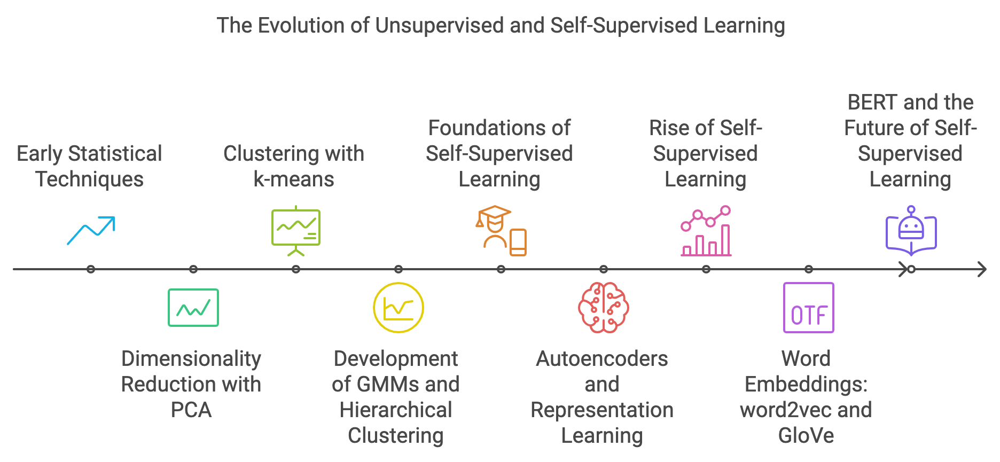
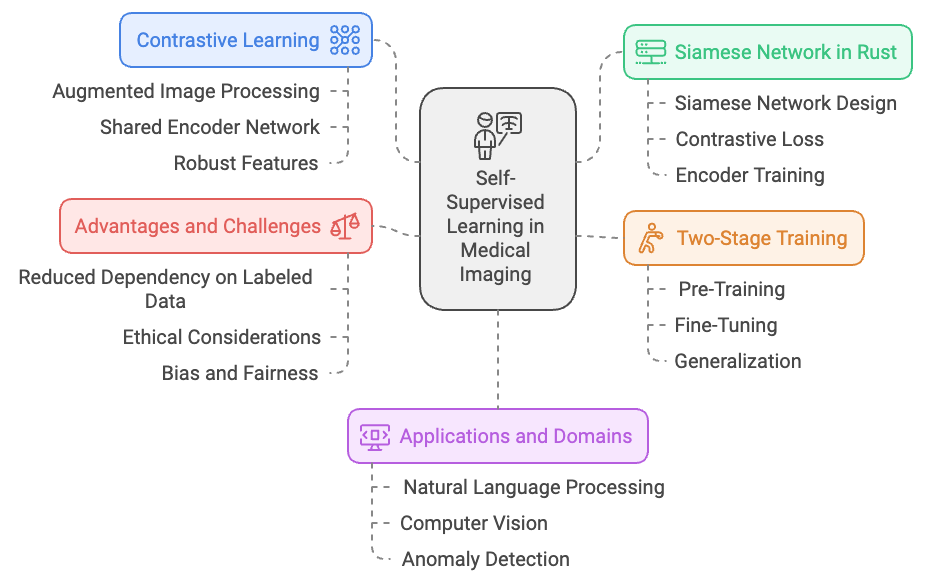

> **Note:**
**"*Self-supervised learning is the dark matter of intelligence, filling in the gaps left by supervised learning, and driving AI closer to human-level understanding.*" — Yann LeCun**

> **Note:**
*Chapter 15 of DLVR explores the transformative paradigms of Self-Supervised and Unsupervised Learning, where models learn from data without the need for labeled examples. The chapter begins by defining these learning approaches, contrasting them with supervised learning, and highlighting their advantages in applications like dimensionality reduction, clustering, and representation learning. It delves into the conceptual foundations of self-supervised learning, emphasizing the role of pretext tasks in leveraging vast amounts of unlabeled data for pre-training models. The chapter also covers various unsupervised learning techniques, such as clustering, dimensionality reduction, and generative modeling, with a focus on discovering hidden patterns and structures within data. Practical guidance is provided for implementing these techniques in Rust using tch-rs and burn, along with real-world examples like training autoencoders, performing k-means clustering, and developing models for anomaly detection. The chapter concludes with a discussion of the diverse applications of self-supervised and unsupervised learning across fields such as natural language processing, computer vision, and anomaly detection, emphasizing their potential to advance AI by reducing reliance on labeled data.*

# 15.1. Introduction to Self-Supervised and Unsupervised Learning

Self-supervised and unsupervised learning have emerged as pivotal paradigms in machine learning, each offering unique approaches to learning from data without the need for explicit labels. Their evolution has been shaped by the challenges of obtaining labeled data, which is often costly, time-consuming, or impractical at scale. By enabling models to learn directly from raw data, these methods have become foundational in numerous machine learning applications, particularly as the availability of large datasets has exploded. Here, we explore the historical development, mathematical foundations, and practical industry use cases of self-supervised and unsupervised learning, providing insights into how these techniques have reshaped the field of artificial intelligence.


**Figure 1:** Historical journey of SSL - Self Supervised Learning.

The roots of unsupervised learning extend back to the early days of statistical data analysis and pattern recognition in the 1950s and 1960s. Researchers sought ways to identify patterns and structures within data without predefined labels, a challenge that mirrored problems in fields like psychometrics and market research. Techniques like Principal Component Analysis (PCA), developed by Karl Pearson in 1901 and popularized by Harold Hotelling in the 1930s, provided a method for dimensionality reduction that became one of the earliest tools in unsupervised learning. Similarly, clustering methods like k-means, formalized in the 1960s, offered ways to group similar data points without needing labeled examples. These methods laid the groundwork for more sophisticated models, including Gaussian Mixture Models (GMMs) and Hierarchical Clustering, which provided probabilistic and structured approaches to discovering latent structures in data.

Self-supervised learning, though more recent, traces its conceptual roots to ideas like representation learning and unsupervised pre-training, which gained traction in the 1990s and 2000s. Early work by Geoffrey Hinton and others on autoencoders provided a way to train models to compress and reconstruct input data, a process that shares similarities with self-supervised learning. However, the term "self-supervised learning" itself gained prominence in the 2010s, largely due to advancements in natural language processing (NLP) and computer vision. Models like word2vec (2013) and GloVe (2014) revolutionized NLP by learning word representations through context-based predictions, enabling models to capture semantic relationships between words without needing labeled datasets. This approach laid the foundation for more complex models like BERT (Bidirectional Encoder Representations from Transformers) in 2018, which used masked language modeling (MLM) as a pretext task to learn deep, context-aware embeddings from large corpora of text.

Supervised learning is the traditional approach where models learn from labeled data. Each input $x \in \mathbb{R}^d$ is associated with a label $y$, and the objective is to learn a function $f: X \rightarrow Y$ that minimizes a loss function $\mathcal{L}(f(x), y)$. This loss function, such as mean squared error (MSE) for regression or cross-entropy for classification, quantifies the difference between the model's predictions and the actual labels. Supervised learning is effective when labeled data is abundant, but it becomes impractical in many real-world situations where obtaining labeled examples is challenging.

In contrast, unsupervised learning aims to uncover hidden structures or patterns in a dataset $X = \{x_1, x_2, \ldots, x_n\}$, where each data point $x_i \in \mathbb{R}^d$ represents a d-dimensional vector. The goal of unsupervised learning is to derive a function $f: X \rightarrow Y$, where $Y$ is a structured or lower-dimensional representation of $X$. For example, clustering methods like K-means seek to group similar data points by minimizing the variance within each cluster. Mathematically, this involves solving the optimization problem:

$\min_{C, \mu} \sum_{j=1}^k \sum_{x \in C_j} \|x - \mu_j\|^2,$

where $C_j$ denotes the set of points assigned to the $j$-th cluster, and $\mu_j$ is the centroid of that cluster. Another example is Gaussian Mixture Models (GMMs), which assume that the data is generated from a mixture of Gaussian distributions. The objective is to maximize the log-likelihood of the observed data under the model:

$ \max_{\theta} \sum_{i=1}^n \log \sum_{k=1}^K \pi_k \mathcal{N}(x_i | \mu_k, \Sigma_k), $

where $\theta = \{\pi_k, \mu_k, \Sigma_k\}$ represents the mixture weights, means, and covariances of the Gaussian components. Dimensionality reduction techniques such as Principal Component Analysis (PCA) focus on projecting data onto a lower-dimensional space while preserving as much variance as possible. This is achieved by finding the eigenvectors of the covariance matrix $\Sigma$, solving the optimization problem:

$ \max_{\mathbf{w}} \frac{\mathbf{w}^T \Sigma \mathbf{w}}{\mathbf{w}^T \mathbf{w}}, $

where $\mathbf{w}$ represents the projection vectors. These methods are widely used across industries, including finance for risk modeling, healthcare for patient clustering, and e-commerce for customer segmentation.

Self-supervised learning, positioned between supervised and unsupervised approaches, generates its own labels from the data using pretext tasks—tasks that do not require manual labels but leverage the data itself to provide supervisory signals. Mathematically, self-supervised learning involves a transformation function $T$ that creates a surrogate label $y_i = T(x_i)$ for each data point $x_i$. The goal is to train a model $f$ such that $f(x_i) \approx y_if(xi​)$, learning representations that capture the underlying structure of the data. A prominent example is contrastive learning, which aims to maximize the similarity between positive pairs (e.g., different views or augmentations of the same data point) and minimize the similarity between negative pairs. The contrastive loss function can be formulated as:

$ \mathcal{L} = -\log \frac{\exp(\text{sim}(f(x_i), f(x_i^+)) / \tau)}{\sum_{j=1}^N \exp(\text{sim}(f(x_i), f(x_j)) / \tau)}, $

where $\text{sim}$ is a similarity measure (e.g., cosine similarity), $\tau$ is a temperature parameter, $x_i^+$ is a positive example, and $x_j$ represents other samples in the dataset. This method encourages the model to learn invariant features that can be fine-tuned for downstream tasks.

Another key example of self-supervised learning is masked language modeling (MLM), used in natural language processing models like BERT. Here, a portion of the input text is masked, and the task is to predict the masked words. This can be described mathematically as:

$ \mathcal{L}_{\text{MLM}} = -\sum_{i=1}^N \log P(x_i | x_{\backslash i}), $

where $x_{\backslash i}$ represents the input sequence with the $i$-th token masked, and $P(x_i | x_{\backslash i})$ is the probability of the masked token given the context. The model learns contextual representations of words, which can be transferred to various NLP tasks like sentiment analysis, named entity recognition, and machine translation.

In the industry, self-supervised learning is highly effective in domains where large amounts of unlabeled data are available for pre-training models, which can then be fine-tuned on smaller labeled datasets. In natural language processing (NLP), models like BERT and GPT have set new benchmarks by pre-training on massive corpora using masked language modeling or next-token prediction tasks. In computer vision, self-supervised techniques like SimCLR and MoCo leverage contrastive learning to learn representations from large image datasets, making them suitable for tasks such as object detection and image classification. Self-supervised learning is also crucial for autonomous vehicles, where models can learn to predict the next frame from video sequences or detect objects using vast amounts of unlabeled sensor data, subsequently fine-tuned with labeled data for specific tasks like object tracking.

Unsupervised learning, on the other hand, is invaluable in situations where the structure of the data is unknown. For example, in retail and e-commerce, clustering algorithms are used to segment customers based on purchasing behavior, allowing for targeted marketing strategies. In cybersecurity, anomaly detection methods like GMMs or isolation forests help identify deviations from normal behavior patterns, crucial for detecting fraud and potential threats. In healthcare, dimensionality reduction methods like PCA and t-SNE are used to analyze gene expression data, enabling researchers to visualize complex genetic relationships and identify biomarkers associated with diseases.

Implementing these learning paradigms in Rust is feasible and efficient due to Rust’s strong type system, memory safety, and high-performance capabilities. Libraries like `ndarray` for numerical computations, `linfa` for machine learning algorithms, and `tch-rs` for deep learning provide powerful tools for building models. For instance, K-means clustering can be implemented using the `linfa` library, allowing efficient clustering of data into distinct groups. A simple example involves using the `linfa` library to perform K-means clustering on a two-dimensional dataset, providing a robust solution for clustering tasks. For self-supervised tasks, `tch-rs`, which provides Rust bindings to PyTorch, can be used to implement neural networks like autoencoders. These autoencoders learn to compress and reconstruct input data, capturing essential features in the process. The implementation involves defining an encoder-decoder architecture and minimizing the reconstruction loss between the input and output.

Overall, self-supervised and unsupervised learning provide robust frameworks for extracting insights from data without relying on labeled examples, making them indispensable tools in modern AI development. They empower businesses to extract valuable information from large datasets, offering a strategic advantage in fields like healthcare, finance, e-commerce, and autonomous systems. By leveraging these approaches, organizations can build systems that generalize well to new data, adapt to changing environments, and drive data-driven innovation. These paradigms not only reduce the dependency on labeled data but also enable more efficient use of computational resources, making them critical for the future of machine learning.

The provided Rust code implements a self-supervised learning model using an autoencoder architecture with the `tch-rs` library, which provides bindings for PyTorch. Autoencoders are commonly used for dimensionality reduction and representation learning, making them effective tools in scenarios where labeled data is limited or unavailable. This code specifically focuses on training an autoencoder to learn a compressed representation of images from the MNIST dataset by mapping 784-dimensional input vectors (flattened 28x28 pixel images) to a 32-dimensional latent space. The model learns to reconstruct the input data from this latent space, capturing the essential features of the images.

```rust
use tch::nn::{self, Module, OptimizerConfig};
use tch::{Device, Kind, Tensor};

#[derive(Debug)]
struct Autoencoder {
    encoder: nn::Sequential,
    decoder: nn::Sequential,
}

impl Autoencoder {
    fn new(vs: &nn::Path) -> Self {
        let encoder = nn::seq()
            .add(nn::linear(vs / "enc1", 784, 128, Default::default()))
            .add_fn(|x| x.relu())
            .add(nn::linear(vs / "enc2", 128, 64, Default::default()))
            .add_fn(|x| x.relu())
            .add(nn::linear(vs / "enc3", 64, 32, Default::default()));

        let decoder = nn::seq()
            .add(nn::linear(vs / "dec1", 32, 64, Default::default()))
            .add_fn(|x| x.relu())
            .add(nn::linear(vs / "dec2", 64, 128, Default::default()))
            .add_fn(|x| x.relu())
            .add(nn::linear(vs / "dec3", 128, 784, Default::default()))
            .add_fn(|x| x.sigmoid()); // Use sigmoid to ensure the output is between 0 and 1

        Autoencoder { encoder, decoder }
    }

    fn forward(&self, xs: &Tensor) -> Tensor {
        let latent = self.encoder.forward(xs);
        self.decoder.forward(&latent)
    }
}

fn main() {
    // Set up the device (CPU or CUDA).
    let device = Device::cuda_if_available();
    let vs = nn::VarStore::new(device);

    // Create the autoencoder model.
    let autoencoder = Autoencoder::new(&vs.root());

    // Define optimizer (Adam) and hyperparameters.
    let mut opt = nn::Adam::default().build(&vs, 1e-3).unwrap();

    // Load the MNIST dataset. Assume the dataset is already in the form of a flattened 784-dimensional vector.
    let train_images = Tensor::randn(&[60000, 784], (Kind::Float, device)); // Replace with actual dataset loading.
    let train_size = train_images.size()[0];

    let batch_size = 64;
    let epochs = 10;

    for epoch in 1..=epochs {
        let mut total_loss = 0.0;

        for batch_idx in (0..train_size).step_by(batch_size as usize) {
            // Get the batch.
            let batch = train_images
                .narrow(0, batch_idx, batch_size.min(train_size - batch_idx))
                .to_device(device);

            // Forward pass.
            let reconstructed = autoencoder.forward(&batch);

            // Compute MSE loss.
            let loss = reconstructed.mse_loss(&batch, tch::Reduction::Mean);

            // Backpropagation.
            opt.zero_grad();
            loss.backward();
            opt.step();

            // Accumulate loss as a scalar.
            total_loss += loss.double_value(&[]); // Convert tensor to f64 scalar.
        }

        println!("Epoch: {} - Loss: {:.4}", epoch, total_loss / (train_size as f64 / batch_size as f64));
    }

    // Save the trained model.
    vs.save("autoencoder_model.ot").unwrap();

    println!("Training complete and model saved.");
}
```

The code defines an `Autoencoder` struct containing an encoder and a decoder, implemented using `tch-rs`'s `Sequential` module. The encoder consists of three linear layers that progressively reduce the input dimension from 784 to 32 dimensions, with ReLU activation functions applied between layers to introduce non-linearity. The decoder reverses this process, expanding the 32-dimensional latent vector back to 784 dimensions to reconstruct the original image, with a final sigmoid activation to ensure outputs fall within the range \[0, 1\]. The training process iteratively minimizes the mean squared error (MSE) between the input and the reconstructed output using the Adam optimizer, allowing the model to learn meaningful latent representations that capture the structure of the input data. The training loop iterates over the dataset in batches, updating model weights through backpropagation, and saves the trained model for future use. This autoencoder setup can be applied to tasks like feature extraction, anomaly detection, and other scenarios that benefit from unsupervised representation learning.

Self-supervised and unsupervised learning are powerful paradigms that enable learning from data without explicit labels. Unsupervised learning focuses on discovering patterns and structures in data, while self-supervised learning generates supervisory signals directly from the data, allowing models to learn meaningful representations that can be used for downstream tasks. Pretext tasks in self-supervised learning help in learning useful features without manual labeling, making it highly effective for tasks like representation learning and pre-training. By leveraging Rust and frameworks like tch-rs, it is possible to implement these learning paradigms efficiently, making them accessible for a wide range of applications, from dimensionality reduction to representation learning in complex data scenarios.

# 15.2. Self-Supervised Learning Techniques

Self-supervised learning is a powerful paradigm in machine learning that allows models to extract meaningful representations from data without relying on manually labeled datasets. This is achieved by designing pretext tasks that provide supervisory signals directly from the data, making it possible to leverage large volumes of unlabeled data. The scalability of this approach makes it particularly suitable for fields like natural language processing (NLP) and computer vision, where labeled data is often limited or expensive to obtain. In this discussion, we will delve into some of the most widely used self-supervised learning techniques, such as contrastive learning, predictive coding, and masked modeling. We will also explore their mathematical formulations and practical implementation using Rust, particularly with libraries like `tch-rs` or `candle`.


**Figure 2:** Scopes of SSL - Self Supervised Learning Techniques.

One of the central techniques in self-supervised learning is contrastive learning. The goal of contrastive learning is to train a model to bring similar data points (positive pairs) closer in the representation space while pushing dissimilar data points (negative pairs) further apart. Mathematically, this is often formalized using the InfoNCE loss, a common objective function in contrastive learning frameworks. Let $\mathbf{z}_i$ and $\mathbf{z}_j$ represent the embeddings of a positive pair—typically, different views or augmentations of the same data point—and $\mathbf{z}_k$ denote the embedding of a negative sample. The contrastive loss is defined as:

$ L_{\text{contrastive}} = -\log \frac{\exp(\text{sim}(\mathbf{z}_i, \mathbf{z}_j) / \tau)}{\sum_{k} \exp(\text{sim}(\mathbf{z}_i, \mathbf{z}_k) / \tau)}, $

where $\text{sim}(\cdot, \cdot)$ is a similarity function, often chosen as cosine similarity, and τ\\tauτ is a temperature hyperparameter that controls the sharpness of the distribution. The numerator emphasizes the similarity between positive pairs, while the denominator includes all negative pairs, encouraging the model to differentiate between similar and dissimilar data points. By minimizing this loss, the model learns to create representations that capture the underlying structure of the data, making it highly suitable for downstream tasks like classification and retrieval.

In practice, contrastive learning often uses Siamese networks—architectures that consist of two identical encoders with shared weights. These encoders process different augmented versions of the same data sample, ensuring that both branches of the network learn consistent representations. For example, in SimCLR, a popular framework for contrastive learning, two augmented views of an image are processed through the same encoder network to obtain their embeddings. The contrastive loss aligns the representations of these views, leading to a robust and invariant feature representation. The shared weights in Siamese networks are crucial as they ensure that both parts of the network learn to produce compatible embeddings, making the learning process more stable and effective.

Another prominent self-supervised learning technique is predictive coding, which involves training a model to predict missing or future parts of the input data. This technique forces the model to capture contextual relationships within the data, leading to the development of richer representations. A well-known example is masked language modeling (MLM), which forms the basis of models like BERT. In MLM, certain tokens in a sentence are randomly masked, and the model's task is to predict the masked tokens based on the surrounding context. Formally, the objective is to maximize the probability of the masked tokens given the rest of the sentence:

$ \mathcal{L}_{\text{MLM}} = -\sum_{i=1}^N \log P(x_i | x_{\backslash i}), $

where $x_{\backslash i}$ represents the input sequence with the $i$-th token masked, and $P(x_i | x_{\backslash i})$ is the model’s predicted probability of the masked token. By learning to predict missing elements, the model gains a deep understanding of language semantics and the relationships between words, which can be transferred to a variety of NLP tasks, such as sentiment analysis or named entity recognition.

Predictive coding is not limited to language but can also be applied to other types of data. For instance, in computer vision, models can be trained to predict missing pixels in an image or to fill in the context of an image patch. This forces the model to understand the spatial relationships between different regions of an image, which is essential for tasks like object detection and segmentation.

Masked modeling extends beyond predictive coding to encompass a broader range of pretext tasks that involve masking and reconstructing parts of the input data. For example, in computer vision, models like MAE (Masked Autoencoders) learn to reconstruct images with randomly masked patches, encouraging the network to develop a nuanced understanding of visual features. These tasks help the model to focus on essential features that are transferable to downstream tasks, enabling better performance even with limited labeled data.

The selection of appropriate pretext tasks plays a crucial role in the effectiveness of self-supervised learning. A well-designed pretext task should enable the model to learn representations that are both generalizable and relevant to a variety of downstream tasks. Examples of these tasks include rotation prediction, where the model predicts the rotation angle of an image, context prediction, which involves predicting spatial relationships between different patches of an image, and jigsaw puzzles, where the model reconstructs shuffled image parts. Each of these tasks challenges the model to understand different aspects of the data's structure, ensuring that the learned representations are versatile and useful for a range of applications.

One of the critical measures of success in self-supervised learning is the transferability of the learned representations. Transferability refers to the ability of the features learned through self-supervised training to improve performance on downstream tasks such as classification, clustering, or regression. For example, a model pre-trained using contrastive learning on a large dataset of unlabeled images should be able to perform well when fine-tuned on a smaller labeled dataset for object detection. However, achieving transferability requires careful design of the pretext tasks to ensure that the model learns rich and meaningful features rather than overfitting to the specifics of the pretext task itself.

Implementing self-supervised learning techniques in Rust, particularly using libraries like `tch-rs` or `candle`, offers both performance and safety advantages. Rust's strong type system and memory management make it an ideal choice for building high-performance machine learning applications. For instance, using `tch-rs`, which provides Rust bindings to PyTorch, one can define Siamese networks and train them using the InfoNCE loss for contrastive learning. Similarly, masked modeling approaches like autoencoders can be implemented using `candle`, allowing for efficient training and deployment of models that can process large volumes of data. The combination of Rust’s performance and the flexibility of these libraries makes it possible to build scalable self-supervised learning systems that can be applied across a range of industry use cases, from computer vision to natural language processing.

In summary, self-supervised learning techniques like contrastive learning, predictive coding, and masked modeling offer powerful tools for leveraging large-scale unlabeled data. By focusing on pretext tasks that provide supervisory signals directly from the data, these methods enable models to learn rich and generalizable representations. The mathematical rigor of techniques such as the InfoNCE loss in contrastive learning and the probabilistic formulations in masked language modeling provides a solid foundation for understanding how these methods work. When combined with practical implementation strategies using Rust, self-supervised learning can drive innovation across industries like healthcare, autonomous vehicles, and natural language processing, offering scalable solutions where labeled data is limited.

To implement a self-supervised learning model using contrastive learning in Rust, we can leverage the tch-rs library, which provides powerful bindings for PyTorch. The code below implements a Siamese Network to process pairs of data and learn a meaningful embedding space. The model is trained using simulated MNIST-like data, where it maps inputs to a low-dimensional embedding space. The training uses contrastive learning through the InfoNCE loss, which encourages embeddings of augmented views of the same input to be close in the embedding space while pushing apart embeddings of different inputs. The simulated scenario uses random tensors representing MNIST images, augmented for contrastive learning.

```rust
use tch::nn::{self, Module, OptimizerConfig};
use tch::{Device, Kind, Tensor};

#[derive(Debug)]
struct SiameseNetwork {
    encoder: nn::Sequential,
}

impl SiameseNetwork {
    fn new(vs: &nn::Path) -> Self {
        let encoder = nn::seq()
            .add(nn::linear(vs / "fc1", 784, 256, Default::default()))
            .add_fn(|x| x.relu())
            .add(nn::linear(vs / "fc2", 256, 64, Default::default()));

        SiameseNetwork { encoder }
    }

    fn encode(&self, x: &Tensor) -> Tensor {
        self.encoder.forward(x)
    }
}

/// Computes the InfoNCE loss for a batch of embeddings.
fn info_nce_loss(embeddings: &Tensor, temperature: f64) -> Tensor {
    let batch_size = embeddings.size()[0];

    // Compute similarity matrix: [batch_size, batch_size]
    let sim_matrix = embeddings.matmul(&embeddings.transpose(-1, -2)) / temperature;

    // Create positive pair mask: Diagonal of ones, converted to boolean
    let positive_mask = Tensor::eye(batch_size, (Kind::Float, embeddings.device()))
        .to_kind(Kind::Bool);

    // Compute log-sum-exp for denominator
    let log_sum_exp = sim_matrix.exp().sum_dim_intlist(&[1i64][..], false, Kind::Float).log();

    // Extract positive similarities (diagonal elements of sim_matrix)
    let positive_sim = sim_matrix.masked_select(&positive_mask);

    // Compute the loss: - log of positive similarities + log-sum-exp
    -positive_sim.mean(Kind::Float) + log_sum_exp.mean(Kind::Float)
}

fn main() {
    // Set up the device (CPU or CUDA).
    let device = Device::cuda_if_available();
    let vs = nn::VarStore::new(device);

    // Create the Siamese network model.
    let model = SiameseNetwork::new(&vs.root());

    // Define optimizer (Adam) and hyperparameters.
    let mut opt = nn::Adam::default().build(&vs, 1e-3).unwrap();
    let temperature = 0.07;

    // Simulated MNIST dataset: Replace with actual data loading.
    let train_images = Tensor::randn(&[60000, 784], (Kind::Float, device)); // Fake dataset for demonstration.
    let train_size = train_images.size()[0];
    let batch_size = 128;
    let epochs = 10;

    for epoch in 1..=epochs {
        let mut total_loss = 0.0;

        for batch_idx in (0..train_size).step_by(batch_size as usize) {
            // Get a batch of data.
            let batch = train_images
                .narrow(0, batch_idx, batch_size.min(train_size - batch_idx))
                .to_device(device);

            // Clone batch to prevent moving.
            let batch_aug1 = &batch + 0.1 * Tensor::randn(&batch.size(), (Kind::Float, device));
            let batch_aug2 = &batch + 0.1 * Tensor::randn(&batch.size(), (Kind::Float, device));

            // Forward pass through the encoder.
            let embeddings1 = model.encode(&batch_aug1);
            let embeddings2 = model.encode(&batch_aug2);

            // Normalize embeddings.
            let embeddings1_norm = &embeddings1 / embeddings1.norm().view([-1, 1]);
            let embeddings2_norm = &embeddings2 / embeddings2.norm().view([-1, 1]);

            // Concatenate embeddings for computing pairwise similarities.
            let embeddings = Tensor::cat(&[embeddings1_norm, embeddings2_norm], 0);

            // Compute InfoNCE loss.
            let loss = info_nce_loss(&embeddings, temperature);

            // Backpropagation and optimization step.
            opt.zero_grad();
            loss.backward();
            opt.step();

            total_loss += loss.double_value(&[]);
        }

        println!(
            "Epoch: {} - Loss: {:.4}",
            epoch,
            total_loss / (train_size as f64 / batch_size as f64)
        );
    }

    println!("Training complete.");
}
```

The Siamese Network consists of a simple feedforward encoder with two fully connected layers that map input tensors (flattened 784-dimensional MNIST images) to 64-dimensional embeddings. During training, the network processes two augmented views of each batch, normalizes their embeddings, and computes pairwise similarities using a cosine similarity matrix. The InfoNCE loss is computed by contrasting positive pairs (diagonal elements of the similarity matrix) against all pairs in the batch. The optimizer then updates the network parameters to minimize this loss. Training progresses over multiple epochs, with the loss tracked and printed for each epoch, ultimately saving a model capable of embedding inputs into a structured space.To experiment with different pretext tasks, such as rotation prediction or masked modeling, we can modify the data preparation step to include appropriate transformations. For example, in rotation prediction, we can apply random rotations to the input images and train the model to predict the rotation angle. In masked modeling, we can randomly mask parts of the input (e.g., image patches or text tokens) and train the model to reconstruct the missing parts. These tasks encourage the model to learn representations that capture essential features of the data.

Self-supervised learning techniques, such as contrastive learning, predictive coding, and masked modeling, are powerful tools for learning meaningful representations without labeled data. These methods rely on pretext tasks that provide supervisory signals directly from the data, enabling models to learn features that are transferable to a variety of downstream tasks. Contrastive learning leverages the relationships between positive and negative pairs to learn robust embeddings, while predictive coding and masked modeling provide context-based learning objectives that drive feature extraction.

By implementing these techniques in Rust using libraries like tch-rs, practitioners can create efficient, scalable self-supervised models that are capable of leveraging large amounts of unlabeled data to learn useful representations. These representations can then be fine-tuned for specific tasks, making self-supervised learning a valuable approach in both academic research and industry applications, particularly when labeled data is limited or costly to obtain.

# 15.3. Unsupervised Learning Techniques

Unsupervised learning is a foundational aspect of machine learning that empowers models to discover underlying patterns, structures, or representations within data without the need for labeled examples. Unlike supervised learning, which relies on predefined labels to guide predictions, unsupervised learning extracts insights directly from the data, making it particularly valuable in scenarios where labels are scarce or difficult to obtain. This discussion delves into key unsupervised learning techniques, including clustering, dimensionality reduction, and generative modeling, providing a thorough mathematical foundation, practical implementation in Rust, and exploration of their applications across various industries.

A fundamental technique in unsupervised learning is clustering, which aims to group data points into clusters such that similar points are grouped together while dissimilar points are separated. One of the most widely used clustering algorithms is k-means. This algorithm iteratively assigns each data point to the nearest cluster center and updates the cluster centers based on the mean of the assigned points, aiming to minimize the within-cluster variance. Let $X = \{x_1, x_2, \ldots, x_n\}$ represent a dataset consisting of nnn data points, where each $x_i \in \mathbb{R}^d$ is a $d$-dimensional vector. The k-means objective function is defined as:

$ J = \sum_{i=1}^k \sum_{x \in C_i} \lVert x - \mu_i \rVert^2, $

where $C_i$ denotes the set of points assigned to cluster $i$, and $\mu_i$ is the centroid (mean) of those points. The algorithm alternates between two steps: assigning each point to the cluster with the nearest centroid and updating each centroid to the mean of the points assigned to it. This process continues until convergence, which occurs when the cluster assignments no longer change significantly. The k-means algorithm is particularly useful in market segmentation, customer behavior analysis, and image compression. For instance, in retail, k-means can segment customers based on purchase behavior, allowing businesses to create targeted marketing strategies.

While k-means is effective for many clustering tasks, it has limitations in handling non-spherical clusters or data with varying densities. Gaussian Mixture Models (GMMs) provide a more flexible alternative by modeling the data as a mixture of multiple Gaussian distributions. GMMs use an Expectation-Maximization (EM) algorithm to estimate the parameters of the Gaussian components. The goal is to maximize the likelihood of the observed data under the model:

$ \mathcal{L}(\theta) = \sum_{i=1}^n \log \left( \sum_{j=1}^k \pi_j \mathcal{N}(x_i | \mu_j, \Sigma_j) \right), $

where $\theta$ represents the parameters $\{\pi_j, \mu_j, \Sigma_j\}$ for the mixture weights, means, and covariance matrices of the Gaussian components. The EM algorithm alternates between the expectation step (calculating the probability of each data point belonging to each Gaussian) and the maximization step (updating the parameters to maximize the expected log-likelihood). GMMs are commonly applied in speech recognition, anomaly detection, and image segmentation, where the data distribution is complex and multi-modal.

Dimensionality reduction is another critical unsupervised technique that aims to reduce the number of features in a dataset while preserving its essential structure. This is particularly important when dealing with high-dimensional data, as it helps to simplify models, reduce computational costs, and mitigate the curse of dimensionality. Principal Component Analysis (PCA) is a widely used linear method for dimensionality reduction that projects the data onto a lower-dimensional subspace capturing the directions of maximum variance. Mathematically, given a dataset $X \in \mathbb{R}^{n \times d}$, where $n$ is the number of samples and $d$ is the dimensionality, PCA identifies the principal components by solving the eigenvalue decomposition of the covariance matrix:

$ \Sigma = \frac{1}{n} X^T X, $

where $\Sigma$ is the $d \times d$ covariance matrix of the data. PCA finds the eigenvectors (principal components) corresponding to the largest eigenvalues, which represent the directions along which the data varies the most. The data is then projected onto these principal components to obtain a lower-dimensional representation. PCA is widely used for data visualization, noise reduction, and feature extraction. For example, in genetics, PCA helps visualize the relationships between populations based on genetic variation. In finance, it is used to reduce the dimensionality of stock price data, allowing analysts to identify the most influential factors driving market movements.

Autoencoders provide a non-linear approach to dimensionality reduction and representation learning, making them capable of capturing complex patterns in the data. An autoencoder is a neural network that consists of an encoder and a decoder. The encoder maps the input to a lower-dimensional latent space, while the decoder reconstructs the original input from this latent space. The model is trained to minimize the reconstruction error, often using mean squared error (MSE) as the loss function:

$ \mathcal{L}_{\text{MSE}} = \frac{1}{n} \sum_{i=1}^n \lVert x_i - \hat{x}_i \rVert^2, $

where $x_i$ is the original input, and $\hat{x}_i$ is the reconstructed output. By learning to reconstruct the input, autoencoders discover a compressed representation that retains the most salient features. Variants like denoising autoencoders add noise to the input data and train the model to recover the original, clean data, making them effective for tasks such as image denoising and anomaly detection. Autoencoders are also foundational in generative modeling, where they serve as building blocks for models like Variational Autoencoders (VAEs), which generate new data samples by learning a probabilistic latent space.

Generative modeling seeks to model the underlying distribution of the data, allowing the generation of new, similar samples. Variational Autoencoders (VAEs) are a type of autoencoder that introduces a probabilistic framework, enabling the generation of data by sampling from a latent space. VAEs aim to maximize the evidence lower bound (ELBO), which is a combination of the reconstruction loss and a regularization term that encourages the latent space to follow a known distribution, such as a Gaussian:

$ \mathcal{L}_{\text{ELBO}} = \mathbb{E}_{q(z|x)}[\log p(x|z)] - D_{\text{KL}}(q(z|x) \parallel p(z)), $

where $q(z|x)$ is the approximate posterior, $p(z)$ is the prior distribution, and $D_{\text{KL}}$ denotes the Kullback-Leibler divergence. VAEs have been applied in fields like drug discovery for generating molecular structures, image generation, and anomaly detection.

One of the primary challenges in unsupervised learning is evaluating model performance, as there are no explicit labels to compare against. Clustering metrics like the silhouette score provide insights into how well-separated and cohesive clusters are. The silhouette score for a data point iii is defined as:

$ s(i) = \frac{b(i) - a(i)}{\max(a(i), b(i))}, $

where $a(i)$ is the average distance between iii and other points in the same cluster, and $b(i)$ is the average distance between $i$ and points in the nearest neighboring cluster. A higher silhouette score indicates better-defined clusters. For dimensionality reduction and autoencoders, metrics like reconstruction error or explained variance ratio are used to assess how well the reduced representation captures the original data's structure.

In practical implementations, Rust offers a robust environment for developing unsupervised learning models, with libraries like `linfa` for clustering and `ndarray` for numerical operations. For example, k-means clustering can be implemented using `linfa` to efficiently group high-dimensional data into clusters, while `tch-rs`, Rust bindings for PyTorch, enables the development of autoencoders and other neural network-based models. The memory safety and performance of Rust make it particularly suitable for deploying unsupervised learning models in production environments, such as real-time anomaly detection systems in cybersecurity or streaming analytics in IoT applications.

Overall, unsupervised learning techniques like clustering, dimensionality reduction, and generative modeling are essential for uncovering hidden structures in data. They provide valuable tools for data exploration, feature extraction, and data synthesis, making them integral to applications in industries ranging from finance and healthcare to manufacturing and entertainment. By leveraging these methods, organizations can gain deeper insights into their data, enhance decision-making processes, and unlock new opportunities for innovation, even in the absence of labeled datasets.

To implement unsupervised learning techniques in Rust, we can use the tch-rs library for neural network-based approaches and other numerical libraries for traditional methods like k-means and PCA. The following example demonstrates how to implement k-means clustering in Rust. We initialize cluster centroids and iteratively update the cluster assignments and centroids until convergence.

```rust
use tch::{Device, Kind, Tensor};

/// Initializes k centroids by randomly selecting points from the dataset.
fn initialize_centroids(data: &Tensor, k: i64) -> Tensor {
    let indices = Tensor::randperm(data.size()[0], (Kind::Int64, data.device()));
    data.index_select(0, &indices.narrow(0, 0, k))
}

/// Assigns each point in the dataset to the nearest centroid.
fn assign_clusters(data: &Tensor, centroids: &Tensor) -> Tensor {
    let distances = data.unsqueeze(1) - centroids.unsqueeze(0);
    let distances = distances
        .pow(&Tensor::from(2.0))
        .sum_dim_intlist(&[2i64][..], false, Kind::Float); // Fix sum_dim_intlist input
    distances.argmin(1, false)
}

/// Updates the centroids by calculating the mean of all points assigned to each cluster.
fn update_centroids(data: &Tensor, labels: &Tensor, k: i64) -> Tensor {
    let centroids = Tensor::zeros(&[k, data.size()[1]], (Kind::Float, data.device()));
    for i in 0..k {
        let mask = labels.eq(i);
        let cluster_points = data.index_select(0, &mask.nonzero().squeeze());
        if cluster_points.size()[0] > 0 {
            centroids.get(i).copy_(&cluster_points.mean_dim(0, false, Kind::Float));
        }
    }
    centroids
}

/// Performs k-means clustering on the given dataset.
fn k_means(data: &Tensor, k: i64, max_iters: i64) -> (Tensor, Tensor) {
    let mut centroids = initialize_centroids(data, k);
    let mut labels = assign_clusters(data, &centroids);

    for _ in 0..max_iters {
        let new_centroids = update_centroids(data, &labels, k);
        let new_labels = assign_clusters(data, &new_centroids);

        // Check for convergence.
        if new_labels.eq_tensor(&labels).all().int64_value(&[]) == 1 {
            break;
        }

        centroids = new_centroids;
        labels = new_labels;
    }

    (centroids, labels)
}

fn main() {
    // Set up the device (CPU or CUDA).
    let device = Device::cuda_if_available();

    // Generate some random data points for clustering.
    // For demonstration, let's use 100 points in a 2D space.
    let data = Tensor::randn(&[100, 2], (Kind::Float, device));

    // Define the number of clusters and the maximum iterations for convergence.
    let k = 3; // Number of clusters
    let max_iters = 100; // Maximum number of iterations

    // Perform k-means clustering.
    let (centroids, labels) = k_means(&data, k, max_iters);

    println!("Centroids:\n{:?}", centroids);
    println!("Cluster labels:\n{:?}", labels);
}
```

The provided Rust code implements the k-means clustering algorithm using the `tch-rs` library, which provides bindings for PyTorch, allowing for efficient tensor operations. The process begins by initializing `k` centroids randomly selected from the input data using the `initialize_centroids` function. The `assign_clusters` function assigns each data point to the nearest centroid by calculating the squared Euclidean distances, and the `update_centroids` function recalculates each centroid's position as the mean of all points assigned to it. The core `k_means` function iteratively assigns points to clusters and updates centroids until convergence (when assignments no longer change) or until reaching a maximum number of iterations. The `main` function demonstrates clustering on a synthetic dataset of 100 random points in 2D space, finding 3 clusters. It outputs the final centroids and cluster assignments, showcasing the fundamental operation of k-means clustering for unsupervised learning.

Below is another Rust code example that demonstrates how to implement an autoencoder using the `tch-rs` library. The autoencoder consists of an encoder that compresses the input data into a lower-dimensional latent space and a decoder that reconstructs the original input from this representation. The training loop minimizes the mean squared error (MSE) between the input and the reconstructed output, allowing the model to learn an efficient lower-dimensional representation.

```rust
use tch::nn::{self, Module, OptimizerConfig};
use tch::{Device, Kind, Tensor};

#[derive(Debug)]
struct Autoencoder {
    encoder: nn::Sequential,
    decoder: nn::Sequential,
}

impl Autoencoder {
    fn new(vs: &nn::Path) -> Self {
        // Define the encoder: reduces the input from 784 to 32 dimensions.
        let encoder = nn::seq()
            .add(nn::linear(vs / "enc1", 784, 128, Default::default()))
            .add_fn(|x| x.relu())
            .add(nn::linear(vs / "enc2", 128, 64, Default::default()))
            .add_fn(|x| x.relu())
            .add(nn::linear(vs / "enc3", 64, 32, Default::default()));

        // Define the decoder: reconstructs the data back to 784 dimensions.
        let decoder = nn::seq()
            .add(nn::linear(vs / "dec1", 32, 64, Default::default()))
            .add_fn(|x| x.relu())
            .add(nn::linear(vs / "dec2", 64, 128, Default::default()))
            .add_fn(|x| x.relu())
            .add(nn::linear(vs / "dec3", 128, 784, Default::default()))
            .add_fn(|x| x.sigmoid()); // Sigmoid to ensure output values are in [0, 1]

        Autoencoder { encoder, decoder }
    }

    fn forward(&self, xs: &Tensor) -> Tensor {
        let latent = self.encoder.forward(xs);
        self.decoder.forward(&latent)
    }
}

fn main() {
    // Set the device (CPU or CUDA).
    let device = Device::cuda_if_available();
    let vs = nn::VarStore::new(device);

    // Create the autoencoder model.
    let autoencoder = Autoencoder::new(&vs.root());

    // Define optimizer (Adam) and hyperparameters.
    let mut opt = nn::Adam::default().build(&vs, 1e-3).unwrap();

    // Load some example data. Here we use randomly generated data for simplicity.
    // In practice, use a dataset like MNIST where each image is flattened to a 784-dimensional vector.
    let train_images = Tensor::rand(&[60000, 784], (Kind::Float, device)); // Replace with actual data loading.
    let train_size = train_images.size()[0];
    let batch_size = 64;
    let epochs = 10;

    for epoch in 1..=epochs {
        let mut total_loss = 0.0;

        for batch_idx in (0..train_size).step_by(batch_size as usize) {
            // Get a batch of data.
            let batch = train_images
                .narrow(0, batch_idx, batch_size.min(train_size - batch_idx))
                .to_device(device);

            // Forward pass: compute the reconstructed output.
            let reconstructed = autoencoder.forward(&batch);

            // Compute the mean squared error loss between input and reconstruction.
            let loss = reconstructed.mse_loss(&batch, tch::Reduction::Mean);

            // Backpropagation and optimization step.
            opt.zero_grad();
            loss.backward();
            opt.step();

            // Extract the scalar loss value from the tensor.
            total_loss += loss.double_value(&[]);
        }

        println!(
            "Epoch: {} - Average Loss: {:.4}",
            epoch,
            total_loss / (train_size as f64 / batch_size as f64)
        );
    }

    // Save the trained model.
    vs.save("autoencoder_model.ot").unwrap();
    println!("Training complete and model saved.");
}
```

The autoencoder consists of an encoder with three linear layers that reduce a 784-dimensional input (such as a flattened 28x28 image) to a 32-dimensional latent space, and a decoder that reconstructs the original input from this reduced representation. The training process minimizes the mean squared error (MSE) between the original input and its reconstruction using the Adam optimizer. For each epoch, batches of input data are processed through the model, calculating the loss and adjusting the model parameters to improve reconstruction accuracy. This iterative process allows the autoencoder to learn efficient latent representations, making it suitable for dimensionality reduction, anomaly detection, or feature extraction tasks. After training, the model's weights are saved for future use, allowing the autoencoder to be applied to similar data for encoding or reconstruction.

Unsupervised learning techniques, such as clustering, dimensionality reduction, and generative modeling, are essential tools for extracting insights from unlabeled data. Techniques like k-means clustering and PCA provide simple yet effective methods for grouping and visualizing data, while autoencoders offer more advanced, non-linear approaches for representation learning. The implementation of these techniques in Rust, using tools like tch-rs, allows developers to harness the power of unsupervised learning in a memory-safe and efficient manner. These techniques are widely applicable across various domains, from customer segmentation to anomaly detection, and represent foundational methods in the field of machine learning and data analysis.

# 15.4. Applications of Self-Supervised and Unsupervised Learning

Self-supervised and unsupervised learning have become pivotal approaches in modern machine learning, offering robust solutions in scenarios where labeled data is scarce or unavailable. These paradigms allow models to leverage large amounts of raw data, enabling them to learn rich and meaningful representations without the need for manual annotations. This has made them indispensable across a variety of applications, from natural language processing (NLP) and computer vision to anomaly detection and beyond. Below, we delve into key applications of self-supervised and unsupervised learning, exploring their mathematical foundations and practical implementations, and highlighting how they address real-world challenges across different industries.

In natural language processing (NLP), self-supervised learning has fundamentally transformed the field by enabling models to be pre-trained on extensive corpora of unlabeled text. This approach allows models to learn nuanced representations of language, capturing syntax, semantics, and context, which can then be fine-tuned for specific downstream tasks such as sentiment analysis, machine translation, or question answering. A quintessential example is BERT (Bidirectional Encoder Representations from Transformers), which uses a masked language modeling (MLM) objective during pre-training. In this approach, random tokens in a sentence are masked, and the model is trained to predict these masked tokens using the surrounding context. The objective function for this task is formulated as a cross-entropy loss:

$ L_{\text{MLM}} = -\sum_{i \in \text{masked}} \log P(x_i \mid x_{\setminus i}), $

where $P(x_i \mid x_{\setminus i})$ represents the probability of the masked token $x_i$ given the rest of the sequence $x_{\setminus i}$. This loss encourages the model to understand relationships between words, learning deep, contextual embeddings that can be transferred to a variety of tasks with minimal labeled data. The ability of models like BERT to generalize from pre-training to tasks such as named entity recognition or document classification has made them a staple in NLP pipelines across industries like customer service (for chatbots), legal (for document analysis), and healthcare (for clinical note analysis).

In computer vision, self-supervised learning has emerged as a powerful approach for tasks like image classification, object detection, and segmentation. A widely adopted technique is contrastive learning, which trains models by distinguishing between positive and negative pairs of images. For example, in the SimCLR framework, an image is augmented in different ways to produce multiple views, and the model is trained to maximize the agreement between representations of these augmented views while minimizing the similarity between different images. Mathematically, this is achieved through the InfoNCE loss, which aims to bring positive pairs closer together in the representation space while pushing apart negative pairs:

$ L_{\text{contrastive}} = -\log \frac{\exp(\text{sim}(\mathbf{z}_i, \mathbf{z}_j) / \tau)}{\sum_{k} \exp(\text{sim}(\mathbf{z}_i, \mathbf{z}_k) / \tau)}, $

where $\mathbf{z}_i$ and $\mathbf{z}_j$ are the representations of two augmented versions of the same image, $\mathbf{z}_k$ is the representation of a negative example, $\text{sim}(\cdot, \cdot)$ denotes cosine similarity, and $\tau$ is a temperature parameter that controls the sharpness of the distribution. This method leads to feature embeddings that are invariant to transformations, such as rotations or color changes, making them highly effective for downstream tasks. Contrastive learning has been particularly impactful in fields like medical imaging, where obtaining labeled data is difficult. For example, in radiology, self-supervised models can learn from large datasets of unlabeled scans and later be fine-tuned for tasks like tumor detection or segmentation with fewer labeled examples.

Unsupervised learning plays a crucial role in exploratory data analysis and feature extraction, where it helps uncover underlying structures within data. Techniques such as Principal Component Analysis (PCA) and clustering are widely used for this purpose. PCA reduces the dimensionality of data by projecting it onto a subspace that captures the directions of maximum variance. This is achieved by performing an eigenvalue decomposition of the covariance matrix of the data:

$ \Sigma = \frac{1}{n} X^T X, $

where $X \in \mathbb{R}^{n \times d}$ represents the dataset, nnn is the number of samples, $d$ is the dimensionality, and $\Sigma$ is the covariance matrix. The eigenvectors corresponding to the largest eigenvalues form the principal components, and the data is projected onto these components to reduce its dimensionality. PCA is extensively used in applications like finance, where it helps in reducing the complexity of stock market data, and genomics, where it visualizes the variation between different populations based on genetic data.

Clustering methods such as k-means and Gaussian Mixture Models (GMMs) are used to group similar data points into clusters, helping to reveal hidden patterns in the data. The k-means algorithm aims to partition $n$ data points into $k$ clusters by minimizing the within-cluster variance:

$ J = \sum_{i=1}^k \sum_{x \in C_i} \lVert x - \mu_i \rVert^2, $

where $C_i$ denotes the set of points assigned to cluster $i$, and $\mu_i$ is the centroid of those points. Clustering has practical applications across industries, such as market segmentation in retail, where customer data is clustered based on purchasing behavior, and image compression, where pixel values are clustered to reduce the color palette while preserving image quality.

Anomaly detection is another domain where unsupervised learning is highly effective, particularly in identifying rare or unusual events that deviate from typical patterns. Autoencoders are commonly used for this purpose, as they learn to encode input data into a lower-dimensional representation and then decode it back to the original space. The model is trained to minimize the reconstruction error:

$ \mathcal{L}_{\text{reconstruction}} = \frac{1}{n} \sum_{i=1}^n \lVert x_i - \hat{x}_i \rVert^2, $

where $x_i$ is the input and $\hat{x}_i$ is the reconstructed output. During inference, high reconstruction errors may indicate anomalies, as they suggest that the input data is not well represented by the patterns learned during training. This approach is widely used in financial transaction monitoring to detect fraudulent activity, network security to identify unusual traffic patterns, and manufacturing to detect defects in production lines.

The versatility of self-supervised and unsupervised learning extends across various data types, such as images, text, time series, and tabular data, allowing for their application in diverse fields like healthcare, autonomous driving, natural language understanding, and customer analytics. In healthcare, self-supervised models can be pre-trained on large datasets of medical scans, such as MRIs or X-rays, learning to recognize patterns without the need for costly annotations. These models can then be fine-tuned for specific diagnostic tasks, such as detecting abnormalities or segmenting organs, thereby significantly reducing the burden on radiologists and improving diagnostic accuracy.

However, deploying self-supervised and unsupervised learning models in practice comes with challenges, particularly around ethics, bias, and fairness. Since these models learn directly from the data they are trained on, they can inherit and amplify biases present in the data. For example, a self-supervised NLP model trained on internet text may develop biases related to gender, race, or socio-economic status, which could affect its fairness when deployed in applications like hiring tools or recommendation systems. Addressing these challenges requires careful curation of training datasets, as well as techniques like de-biasing and fair representation learning. Furthermore, the interpretability of these models is an area of active research, with Explainable AI (XAI) methods being developed to make their decision-making processes more transparent.

In conclusion, self-supervised and unsupervised learning methods have unlocked new possibilities in machine learning by enabling models to learn from large, unlabeled datasets. They provide powerful tools for building robust, generalizable models that can be applied across a wide range of industries, from healthcare to finance and beyond. As these methods continue to evolve, their role in addressing real-world challenges, coupled with ongoing efforts to ensure ethical deployment, positions them as central to the future of artificial intelligence.

Implementing self-supervised and unsupervised learning applications in Rust involves using frameworks like tch-rs and candle. Below is a Rust code example using the `tch-rs` library to implement an autoencoder for anomaly detection. The autoencoder is trained to reconstruct normal (non-fraudulent) transaction patterns, and transactions with high reconstruction errors during testing are flagged as potential anomalies (fraudulent).

```rust
use tch::nn::{self, Module, OptimizerConfig};
use tch::{Device, Kind, Tensor};

#[derive(Debug)]
struct Autoencoder {
    encoder: nn::Sequential,
    decoder: nn::Sequential,
}

impl Autoencoder {
    fn new(vs: &nn::Path) -> Self {
        let encoder = nn::seq()
            .add(nn::linear(vs / "enc1", 30, 16, Default::default()))
            .add_fn(|x| x.relu())
            .add(nn::linear(vs / "enc2", 16, 8, Default::default()));

        let decoder = nn::seq()
            .add(nn::linear(vs / "dec1", 8, 16, Default::default()))
            .add_fn(|x| x.relu())
            .add(nn::linear(vs / "dec2", 16, 30, Default::default()));

        Autoencoder { encoder, decoder }
    }

    fn forward(&self, xs: &Tensor) -> Tensor {
        let latent = self.encoder.forward(xs);
        self.decoder.forward(&latent)
    }
}

fn main() {
    // Set up the device (CPU or CUDA).
    let device = Device::cuda_if_available();
    let vs = nn::VarStore::new(device);

    // Create the autoencoder model.
    let autoencoder = Autoencoder::new(&vs.root());

    // Define optimizer (Adam) and hyperparameters.
    let mut opt = nn::Adam::default().build(&vs, 1e-3).unwrap();
    let batch_size = 64;
    let epochs = 20;

    // Load the Credit Card Fraud Detection dataset (simulated data).
    let train_normal = Tensor::randn(&[10000, 30], (Kind::Float, device)); // Non-fraudulent training data
    let test_data = Tensor::randn(&[5000, 30], (Kind::Float, device)); // Test data
    let train_size = train_normal.size()[0];

    // Training loop.
    for epoch in 1..=epochs {
        let mut total_loss = 0.0;

        for batch_idx in (0..train_size).step_by(batch_size as usize) {
            let batch = train_normal
                .narrow(0, batch_idx, batch_size.min(train_size - batch_idx))
                .to_device(device);

            let reconstructed = autoencoder.forward(&batch);

            // Compute the mean squared error loss between input and reconstruction.
            let loss = reconstructed.mse_loss(&batch, tch::Reduction::Mean);

            // Backpropagation and optimization.
            opt.zero_grad();
            loss.backward();
            opt.step();

            total_loss += loss.double_value(&[]);
        }

        println!(
            "Epoch: {} - Average Loss: {:.4}",
            epoch,
            total_loss / (train_size as f64 / batch_size as f64)
        );
    }

    // After training, use the autoencoder to detect anomalies.
    // Compute reconstruction error for test data.
    let reconstructed_test = autoencoder.forward(&test_data);
    let reconstruction_errors = (test_data - reconstructed_test)
        .pow(&Tensor::from(2.0)) // Corrected argument
        .sum_dim_intlist(&[1i64][..], false, Kind::Float);

    // Set a threshold for anomaly detection (e.g., 95th percentile of training errors).
    let threshold = reconstruction_errors
        .topk(5, -1, false, true) // Approximation for 95th percentile using top 5%
        .0
        .mean(Kind::Float)
        .double_value(&[]); // Extract scalar value

    // Flag anomalies: errors above the threshold.
    let anomalies = reconstruction_errors.ge(threshold);
    println!("Threshold: {:.4}", threshold);
    println!("Detected anomalies:\n{:?}", anomalies);
}
```

The autoencoder is structured with an encoder that compresses 30-dimensional input data (e.g., features of a financial transaction) into an 8-dimensional latent representation, followed by a decoder that reconstructs the original input from this compressed space. The model is trained on non-fraudulent transactions by minimizing the mean squared error (MSE) between the input data and its reconstruction, encouraging the model to learn the typical patterns of normal transactions. After training, the model processes new transactions and computes the reconstruction error for each, measuring how well the autoencoder can recreate the input. Transactions with a reconstruction error significantly higher than those seen during training are flagged as potential anomalies, indicating unusual patterns that might correspond to fraudulent activities. The threshold for detecting anomalies is set based on the distribution of errors from the training set, such as using the 95th percentile of reconstruction errors to identify outliers. This method allows for effective anomaly detection by leveraging the autoencoder's ability to capture the regularities of normal data.

Self-supervised learning is a powerful tool for feature extraction from medical images, enabling models to learn rich representations that can later be applied to diagnostic tasks. One popular approach is the use of contrastive learning, where different augmented versions of an image are processed through a shared encoder network. This setup encourages the model to learn representations that remain consistent despite variations introduced by augmentations, making the learned features more robust and adaptable to real-world variations.


**Figure 3:** Applications of SSL - Self Supervised Learning in Medical Imaging.

In Rust, this can be achieved through implementing a Siamese network using the `tch-rs` library. The Siamese network is designed to process pairs of augmented images through a shared encoder, using contrastive loss to train the model. The learned representations can then be used for various downstream tasks, such as classifying diseases, detecting anomalies, or segmenting anatomical structures within medical scans.

A common evaluation method for this approach is a two-stage training process. In the first stage, the model is pre-trained using self-supervised learning, such as contrastive learning, to capture the general characteristics of the medical images without requiring labeled data. In the second stage, the model is fine-tuned on a smaller, labeled dataset specific to the target task, such as tumor detection or severity grading. This method is particularly advantageous in the medical field, where vast amounts of unlabeled imaging data are available, but labeled examples are limited due to the cost and expertise required for annotation. By pre-training the encoder on unlabeled data, the model can leverage these rich representations during fine-tuning, improving its performance and ability to generalize to new cases.

Self-supervised and unsupervised learning methods have significantly advanced the field of AI by reducing dependency on labeled data, enabling models to extract valuable information directly from raw data. Their impact extends across various domains, such as natural language processing, computer vision, and anomaly detection. These techniques have proven effective for feature extraction, exploratory analysis, and even generating synthetic data, contributing to advancements in AI research and practical applications. Despite their benefits, deploying these models raises challenges around ethical considerations, including bias and fairness, which require careful attention to ensure responsible and equitable use in sensitive areas like healthcare.

Utilizing Rust for implementing self-supervised and unsupervised learning techniques through libraries like `tch-rs` offers unique advantages, such as memory safety and high performance. These characteristics make Rust particularly suitable for building robust, scalable AI models that can handle complex tasks where labeled data is scarce. By combining the strengths of self-supervised learning with the reliability of Rust, developers can create innovative solutions to address real-world challenges, pushing the boundaries of what artificial intelligence can achieve in fields like healthcare and beyond.

# 15.5. Conclusion

Chapter 15 equips you with the foundational knowledge and practical skills to implement self-supervised and unsupervised learning models using Rust. By mastering these techniques, you will be prepared to develop models that can learn from vast amounts of unlabeled data, unlocking new possibilities in AI and machine learning.

## 15.5.1. Further Learning with GenAI

These prompts are designed to challenge your understanding of self-supervised and unsupervised learning, with a focus on implementation using Rust. Each prompt encourages deep exploration of advanced concepts, learning techniques, and practical challenges in training models without labeled data.

- Analyze the differences between supervised, unsupervised, and self-supervised learning. How can Rust be used to implement models for each paradigm, and what are the key considerations when choosing the appropriate approach?
- Discuss the role of pretext tasks in self-supervised learning. How can Rust be used to implement various pretext tasks, such as rotation prediction or masked language modeling, and what are the implications for learning transferable representations?
- Examine the challenges of evaluating self-supervised learning models. How can Rust be used to implement evaluation techniques that assess the quality of learned representations without relying on labeled data?
- Explore the architecture of Siamese networks in self-supervised learning. How can Rust be used to build Siamese networks for tasks like contrastive learning, and what are the benefits and challenges of using this architecture?
- Investigate the use of contrastive loss in self-supervised learning. How can Rust be used to implement contrastive loss, and what are the trade-offs between different variants of this loss function, such as InfoNCE and triplet loss?
- Discuss the impact of unsupervised learning on dimensionality reduction. How can Rust be used to implement techniques like PCA, t-SNE, or autoencoders for reducing the dimensionality of high-dimensional data, and what are the benefits of each approach?
- Analyze the effectiveness of clustering algorithms, such as k-means and hierarchical clustering, in unsupervised learning. How can Rust be used to implement these algorithms, and what are the challenges in ensuring that the clusters are meaningful and interpretable?
- Examine the role of generative modeling in unsupervised learning. How can Rust be used to implement generative models, such as GANs or VAEs, for generating new data samples, and what are the key considerations in training these models?
- Explore the potential of self-supervised learning in natural language processing. How can Rust be used to implement models for tasks like masked language modeling or next sentence prediction, and what are the challenges in scaling these models?
- Investigate the use of autoencoders in both self-supervised and unsupervised learning. How can Rust be used to implement autoencoders for tasks like anomaly detection or image denoising, and what are the implications for model complexity and performance?
- Discuss the significance of representation learning in self-supervised learning. How can Rust be used to implement techniques that learn robust and transferable representations from unlabeled data, and what are the benefits for downstream tasks?
- Analyze the trade-offs between contrastive learning and predictive coding in self-supervised learning. How can Rust be used to implement both approaches, and what are the implications for model accuracy and generalization?
- Examine the challenges of training self-supervised models on large-scale datasets. How can Rust be used to optimize the training process, and what are the key considerations in managing computational resources and model scalability?
- Explore the use of clustering in exploratory data analysis. How can Rust be used to implement clustering algorithms for discovering patterns and structures in unlabeled data, and what are the best practices for interpreting the results?
- Investigate the role of data augmentation in self-supervised learning. How can Rust be used to implement data augmentation techniques that enhance the robustness of self-supervised models, and what are the trade-offs between different augmentation strategies?
- Discuss the potential of unsupervised learning in anomaly detection. How can Rust be used to build models that detect anomalies in data, such as unusual patterns in financial transactions or sensor readings, and what are the challenges in defining normal versus abnormal behavior?
- Examine the impact of self-supervised pre-training on downstream tasks. How can Rust be used to implement self-supervised models that are pre-trained on large datasets and fine-tuned for specific tasks, and what are the benefits of this approach compared to training from scratch?
- Analyze the use of generative models for unsupervised feature extraction. How can Rust be used to implement VAEs or GANs for extracting features from data, and what are the implications for model interpretability and performance?
- Explore the integration of self-supervised and unsupervised learning in multi-modal models. How can Rust be used to build models that learn from multiple types of data, such as images and text, and what are the challenges in aligning these modalities?
- Discuss the future directions of self-supervised and unsupervised learning research and how Rust can contribute to advancements in these fields. What emerging trends and technologies, such as self-supervised transformers or unsupervised reinforcement learning, can be supported by Rust’s unique features?

Let these prompts inspire you to explore the full potential of self-supervised and unsupervised learning and push the boundaries of what is possible in AI.

## 15.5.2. Hands On Practices

These exercises are designed to provide in-depth, practical experience with self-supervised and unsupervised learning using Rust. They challenge you to apply advanced techniques and develop a strong understanding of learning from unlabeled data through hands-on coding, experimentation, and analysis.

#### **Exercise 15.1:** Implementing a Self-Supervised Contrastive Learning Model
- **Task:** Implement a self-supervised contrastive learning model in Rust using the `tch-rs` or `candle` crate. Train the model on an image dataset to learn meaningful representations without labeled data.
- **Challenge:** Experiment with different contrastive loss functions, such as InfoNCE or triplet loss, and analyze their impact on the quality of learned representations.
#### **Exercise 15.2:** Training an Autoencoder for Dimensionality Reduction
- **Task:** Implement an autoencoder in Rust using the `tch-rs` or `candle` crate for dimensionality reduction on a high-dimensional dataset, such as MNIST or CIFAR-10. Evaluate the effectiveness of the autoencoder in capturing the underlying structure of the data.
- **Challenge:** Experiment with different architectures for the encoder and decoder, such as varying the number of layers or activation functions. Analyze the impact on reconstruction accuracy and latent space representation.
#### **Exercise 15.3:** Implementing K-Means Clustering for Unsupervised Learning
- **Task:** Implement the k-means clustering algorithm in Rust to segment a dataset, such as customer purchase data or text documents, into meaningful clusters. Evaluate the quality of the clusters using metrics like silhouette score.
- **Challenge:** Experiment with different initialization methods and the number of clusters. Analyze the stability and interpretability of the resulting clusters.
#### **Exercise 15.4:** Building a Self-Supervised Model for Natural Language Processing
- **Task:** Implement a self-supervised model in Rust for a natural language processing task, such as masked language modeling or next sentence prediction. Pre-train the model on a large corpus and fine-tune it for a specific downstream task, such as sentiment analysis or question answering.
- **Challenge:** Experiment with different pretext tasks and fine-tuning strategies. Analyze the transferability of the learned representations to the downstream task.
#### **Exercise 15.5:** Implementing a VAE for Unsupervised Feature Extraction
- **Task:** Implement a variational autoencoder (VAE) in Rust using the `tch-rs` or `candle` crate for unsupervised feature extraction from an image or text dataset. Use the learned features for a downstream task, such as clustering or classification.
- **Challenge:** Experiment with different configurations of the encoder and decoder networks, as well as different priors for the latent space. Analyze the quality of the generated samples and the usefulness of the learned features.

By completing these challenges, you will gain hands-on experience and develop a deep understanding of the complexities involved in learning from unlabeled data, preparing you for advanced work in machine learning and AI.
