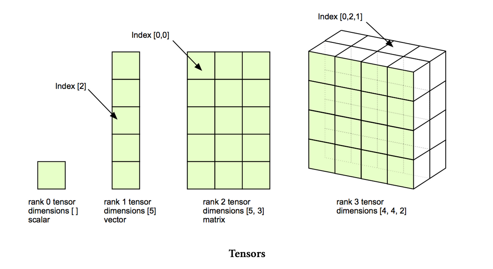
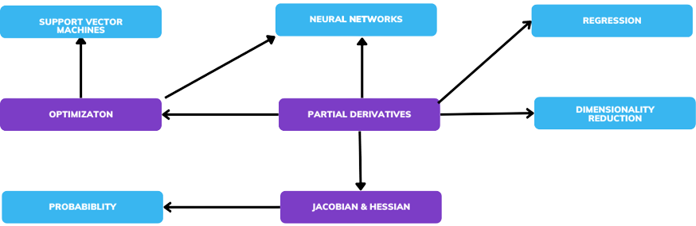

> **Note:**
**"*Mathematics is the key to unlocking the full potential of Deep Learning. Understanding its foundations is essential to innovating and pushing the boundaries of what AI can achieve.*" — Geoffrey Hinton**

> **Note:**
*Chapter 2 of DLVR delves into the critical mathematical foundations that underpin deep learning, providing a comprehensive and rigorous exploration of the essential concepts. The chapter begins with a deep dive into linear algebra, covering vectors, matrices, and operations like addition, multiplication, and inversion, with a focus on how these operations support neural network functionality, particularly in forward and backward propagation. It also explores advanced topics such as eigenvectors, eigenvalues, and singular value decomposition (SVD), emphasizing their role in dimensionality reduction and optimization. The chapter then transitions to probability and statistics, outlining the basics of probability theory, statistical concepts like mean and variance, and their crucial applications in deep learning, such as uncertainty estimation and model evaluation. The calculus and optimization section addresses the fundamentals of differential calculus, including derivatives and gradients, and their application in gradient-based optimization techniques, which are pivotal in training neural networks. The chapter further explores linear models and generalizations, connecting linear and logistic regression to more complex neural network architectures and highlighting the importance of regularization in preventing overfitting. Finally, the chapter covers numerical methods and approximation techniques, focusing on their role in solving equations, handling large datasets, and ensuring numerical stability in deep learning models. Throughout the chapter, practical implementation in Rust is emphasized, with examples of matrix operations, probability distributions, gradient descent algorithms, and numerical methods, showcasing how Rust's powerful features can be leveraged to build efficient and robust deep learning models.*

# 2.1. Linear Algebra Essentials

Linear algebra forms the core of many operations in deep learning. It is not only crucial for understanding the mathematical foundation of neural networks, but it is also key to implementing efficient and scalable models. This section covers essential linear algebra concepts, explains their role in deep learning, and demonstrates practical implementations using Rust with a focus on performance and safety. By bridging mathematical theory with Rust implementations, we aim to build a deep and comprehensive understanding of how linear algebra powers modern AI systems.


**Figure 1:** Scalar, vector, matrix and tensor.

Vectors and matrices are fundamental building blocks in both linear algebra and deep learning. In the context of deep learning, vectors often represent data points (such as input features or neural network weights), and matrices represent transformations that map one set of features to another, such as in neural network layers.

- Vectors: A vector is a one-dimensional array of numbers, typically represented as $\mathbf{v} = (v_1, v_2, \dots, v_n)$, where each element $v_i$ is a scalar. In deep learning, vectors are used to represent input data, weights, biases, and output predictions. The mathematical operations on vectors—such as addition, scalar multiplication, and dot products—are essential for data processing in neural networks.
- Matrices: A matrix is a two-dimensional array of numbers, denoted as $\mathbf{A} \in \mathbb{R}^{m \times n}$, where $m$ is the number of rows and $n$ is the number of columns. Matrices are used in deep learning to represent operations such as transformations, rotations, and scaling. A matrix can also represent a neural network’s weights that map input features to output predictions.

Mathematically, matrix operations include:

- Addition: If $\mathbf{A}, \mathbf{B} \in \mathbb{R}^{m \times n}$ is element-wise addition: $c_{ij} = a_{ij} + b_{ij}$.
- Matrix Multiplication: This is key in neural networks. Given $\mathbf{A} \in \mathbb{R}^{m \times n}$ and $\mathbf{B} \in \mathbb{R}^{n \times p}$, their product $\mathbf{C} = \mathbf{A} \mathbf{B}$ is calculated as: $c_{ij} = \sum_{k=1}^{n} a_{ik} b_{kj}$. Matrix multiplication is used during forward propagation when applying weights to inputs in each layer of a neural network.

Matrix Transposition: The transpose of a matrix $\mathbf{A}$, denoted $\mathbf{A}^T$, switches the rows and columns: $\mathbf{A}^T_{ij} = \mathbf{A}_{ji}$. This operation is essential in backpropagation, where gradients of loss with respect to weight matrices are computed.

- Matrix Inversion: For a square matrix $\mathbf{A} \in \mathbb{R}^{n \times n}$, the inverse $\mathbf{A}^{-1}$ satisfies $\mathbf{A} \mathbf{A}^{-1} = \mathbf{I}$, where $\mathbf{I}$ is the identity matrix. While matrix inversion is less commonly used in deep learning (due to the large computational cost), it is crucial in certain optimization algorithms like Newton’s method.

In deep learning, tensors generalize the concepts of vectors and matrices to handle multi-dimensional data. A tensor is a multi-dimensional array that can represent complex structures such as input data, parameters, and intermediate computations in neural networks. This flexibility is essential for processing data types like images, videos, and sequences. Mathematically, tensors extend the idea of vectors (1D tensors) and matrices (2D tensors) to $n$-dimensions. A tensor of order $n$ is represented as $\mathbf{T} \in \mathbb{R}^{d_1 \times d_2 \times \dots \times d_n}$ represent its dimensions. For example, a vector is a 1D tensor of shape $(d_1)$, while a matrix is a 2D tensor of shape $(d_1, d_2)$.

Tensors can represent a wide range of data structures. Scalars (single numbers) are 0-dimensional tensors, vectors are 1D tensors, and matrices are 2D tensors. Higher-dimensional tensors can represent more complex data, such as a color image represented as a 3D tensor with dimensions for width, height, and color channels. In deep learning, tensors store the input data (e.g., a batch of images as a 4D tensor with shape $(batch\_size, height, width, channels)$, weights of the neural network, and the predictions or intermediate activations during forward propagation.


**Figure 2:** Tensors generalize the concepts of vectors and matrices.

Tensors support several key operations in neural network training and inference. Element-wise operations apply functions to each tensor element, such as adding two tensors or applying an activation function like ReLU. Tensor multiplication generalizes matrix multiplication and is critical for computing forward passes in neural networks, where weights are applied to inputs. Reshaping allows tensors to be modified to fit specific layer requirements, such as reshaping a 3D image tensor into a 1D vector for a fully connected layer. Transposition reorders tensor dimensions, such as swapping rows and columns, which is essential in operations like backpropagation or attention mechanisms in neural networks. Finally, broadcasting enables operations between tensors of different shapes by automatically expanding the smaller tensor to match the dimensions of the larger one, which simplifies operations like scaling or combining tensors of different sizes.

To implement linear algebra operations in Rust, we can use the `ndarray` crate, which provides efficient support for multidimensional arrays, and the `nalgebra` crate, which focuses on linear algebra-specific operations. Below is an example of matrix multiplication using `ndarray`:

```rust
use ndarray;
use ndarray::{Array2, arr2};

fn main() {
    let a: Array2<f64> = arr2(&[[1., 2.], [3., 4.]]);
    let b: Array2<f64> = arr2(&[[5., 6.], [7., 8.]]);
    let c = a.dot(&b);  // Matrix multiplication
    println!("Matrix product:\n{}", c);
}
```

This example performs matrix multiplication, a critical operation in neural network forward propagation. The `ndarray` crate provides a simple, efficient way to handle these operations in Rust, and the `dot` method efficiently computes the matrix product.

In the context of linear algebra, eigenvectors and eigenvalues represent important properties of matrices. Given a square matrix $\mathbf{A}$, an eigenvector $\mathbf{v}$ satisfies the equation:

$\mathbf{A} \mathbf{v} = \lambda \mathbf{v}$

where $\lambda$ is the eigenvalue associated with the eigenvector $\mathbf{v}$. In deep learning, eigenvectors and eigenvalues are often used in analyzing covariance matrices during techniques like Principal Component Analysis (PCA), which is useful for dimensionality reduction. PCA projects high-dimensional data onto a lower-dimensional space, where the eigenvectors represent the principal directions of variance, and the eigenvalues represent the magnitude of that variance. Dimensionality reduction helps in reducing computational complexity and improving generalization.

Eigenvectors also play a role in the stability analysis of optimization algorithms. By examining the eigenvalues of the Hessian matrix (second-order derivatives of the loss function), we can assess the curvature of the loss landscape and adjust optimization techniques accordingly.

Singular Value Decomposition (SVD) is another powerful tool in linear algebra, which decomposes a matrix $\mathbf{A} \in \mathbb{R}^{m \times n}$ into three matrices:

$ \mathbf{A} = \mathbf{U} \mathbf{\Sigma} \mathbf{V}^T $

Where:

- $\mathbf{U}$ is an orthogonal matrix containing the left singular vectors.
- $\mathbf{\Sigma}$ is a diagonal matrix with singular values (non-negative real numbers).
- $\mathbf{V}$ is an orthogonal matrix containing the right singular vectors.

SVD is used in deep learning for dimensionality reduction, where only the largest singular values and corresponding vectors are retained. This technique is particularly useful in compressing large models or datasets, making them computationally more manageable while preserving important features.

Here’s how SVD can be computed in Rust using the `nalgebra` crate:

```rust
use nalgebra as na;
use na::DMatrix;

fn main() {
    let a = DMatrix::<f64>::from_vec(3, 2, vec![1.0, 2.0, 3.0, 4.0, 5.0, 6.0]);
    let svd = a.svd(true, true);  // Perform SVD
    println!("Singular values: {:?}", svd.singular_values);
}
```

This decomposition is key in reducing the dimensionality of data without sacrificing critical features, which is essential for efficient computation and storage in deep learning applications.

At the heart of neural networks is the concept of linear transformations. A neural network layer performs a linear transformation on the input data using weight matrices and bias vectors. For instance, given an input vector $\mathbf{x}$, the transformation in a fully connected layer is:

$ \mathbf{y} = \mathbf{W} \mathbf{x} + \mathbf{b} $

where:

- $\mathbf{W}$ is the weight matrix.
- $\mathbf{b}$ is the bias vector.
- $\mathbf{x}$ is the input vector.
- $\mathbf{y}$ is the output vector.

This operation is the basis for both forward and backward propagation. During forward propagation, the inputs are transformed layer by layer using these matrix multiplications. In backward propagation, the gradients of the loss function with respect to each parameter (weights and biases) are computed using the chain rule, which involves matrix transpositions and multiplications.

In deep learning, optimization techniques such as gradient descent rely heavily on linear algebra. For each iteration, gradient descent updates the model parameters by computing the gradient of the loss function with respect to the parameters, which involves matrix and vector operations. Efficient computation of these gradients is crucial for speeding up the training of deep learning models, especially in large-scale systems.

Rust provides a solid foundation for optimizing matrix computations, especially with libraries like `rayon` for parallel processing. By distributing computations across multiple threads, Rust ensures that matrix operations—such as those used in gradient descent—are performed efficiently and safely.

Matrix computations in deep learning can become a bottleneck, especially when dealing with large datasets or models. Rust’s performance guarantees and its ability to handle low-level memory management make it an ideal language for optimizing these operations. By combining libraries like `ndarray` for handling multidimensional arrays and `rayon` for parallelizing operations, you can significantly speed up matrix computations.

Here’s an example of how matrix multiplication can be parallelized in Rust using the `rayon` crate:

```rust
use ndarray::{Array2, arr2};

fn parallel_matrix_multiplication(a: &Array2<f64>, b: &Array2<f64>) -> Array2<f64> {
    let mut result = Array2::zeros((a.nrows(), b.ncols()));
    result.axis_iter_mut(ndarray::Axis(0))
        .into_iter()
        .enumerate()
        .for_each(|(i, mut row)| {
            row.assign(&a.row(i).dot(b));
        });
    result
}

fn main() {
    let a: Array2<f64> = arr2(&[[1., 2.], [3., 4.]]);
    let b: Array2<f64> = arr2(&[[5., 6.], [7., 8.]]);
    let result = parallel_matrix_multiplication(&a, &b);
    println!("Parallel Matrix product:\n{}", result);
}
```

This example demonstrates how matrix computations, a critical part of neural networks, can be optimized for performance in Rust. By leveraging multi-threading, you can significantly improve the computational efficiency of your deep learning models.

Linear algebra is the foundation for many key operations in deep learning. From simple matrix multiplication to more complex techniques like SVD and eigenvalue decomposition, these operations are essential for the construction, training, and optimization of neural networks. Rust, with its efficient libraries like `ndarray`, `nalgebra`, and its ability to handle multi-threading with `rayon`, is well-suited for implementing these operations in a robust and performant manner. Understanding these fundamental concepts, and knowing how to implement and optimize them in Rust, is crucial for anyone aiming to develop high-performance deep learning systems.

# 2.2. Probability and Statistics

Probability and statistics are foundational to understanding and developing deep learning models. These concepts allow us to model uncertainty, quantify performance, and ensure that our models generalize well to unseen data. In this section, we explore the formal mathematical background of probability and statistics and demonstrate how they can be practically implemented in Rust. This discussion will connect theory to practice, emphasizing the critical role these fields play in building robust and high-performing neural networks in both academic research and industrial applications.


**Figure 3:** Differences between probability and statistics.

At the heart of probability theory is the concept of random variables, which are mathematical functions that assign numerical values to outcomes of random processes. In deep learning, random variables are often used to represent uncertain quantities, such as the weights in a neural network or the prediction made by a model. These variables can either be discrete (taking on a finite set of values, like the outcome of rolling a die) or continuous (taking on any value within a given range, such as the height of a person).

The behavior of random variables is described by probability distributions. For discrete random variables, we use probability mass functions (PMF) to describe the likelihood of each possible outcome. For continuous random variables, we rely on probability density functions (PDF). The most fundamental quantity associated with a random variable is its expected value, or mean, which is the long-run average value of the variable. Mathematically, for a discrete random variable $X$, the expected value $\mathbb{E}[X]$ is defined as:

$ \mathbb{E}[X] = \sum_x x P(X = x) $

For a continuous random variable, the expected value is given by:

$ \mathbb{E}[X] = \int_{-\infty}^{\infty} x f_X(x) \, dx $

The variance of a random variable quantifies its spread or dispersion around the mean. This is crucial in deep learning, as variance helps in understanding the variability of model predictions and in detecting overfitting. The variance is defined as:

$ \text{Var}(X) = \mathbb{E}[(X - \mathbb{E}[X])^2] $

Both expected value and variance are essential for analyzing uncertainty and behavior in machine learning models.

In practice, Rust provides libraries such as `rand` for generating random variables and distributions, while `ndarray` and `statrs` can be used to compute key statistical measures like mean and variance. Below is an example of calculating the mean and variance of a dataset in Rust using `ndarray`:

```rust
use ndarray;
use ndarray::{Array1, arr1};

fn main() {
    let data: Array1<f64> = arr1(&[1.0, 2.0, 3.0, 4.0, 5.0]);

    let mean = data.mean().unwrap();
    println!("Mean: {}", mean);

    let variance = data.mapv(|x| (x - mean).powi(2)).mean().unwrap();
    println!("Variance: {}", variance);
}
```

This illustrates how fundamental operations in probability theory, such as calculating the mean and variance of a dataset, can be easily implemented in Rust.

In addition to basic probability, statistical measures like mean, variance, covariance, and correlation play an essential role in both training and evaluating deep learning models. The mean of a dataset is the average value, and it represents the central tendency of the data. In the context of deep learning, the mean is often used to describe the average performance of a model or the average values of its weights.

Variance measures the spread of the data around the mean and is critical for understanding the stability of a model. A model with high variance is prone to overfitting, capturing noise in the training data rather than underlying patterns. Reducing variance, often through techniques like regularization, helps to improve the generalization of deep learning models to unseen data.

Covariance measures the degree to which two random variables change together. It helps in understanding relationships between different features in a dataset. For two random variables $X$ and $Y$, covariance is defined as:

$ \text{Cov}(X, Y) = \mathbb{E}[(X - \mathbb{E}[X])(Y - \mathbb{E}[Y])] $

In deep learning, covariance can be used to identify redundancies in input features or model parameters. High covariance between input features, for example, may indicate that some features are not contributing unique information to the model, leading to inefficiencies.

Correlation is a normalized version of covariance, ranging between -1 and 1, and it quantifies the strength and direction of the relationship between two variables. In neural networks, correlations between neurons or layers can give insights into the model’s behavior, helping to diagnose issues such as vanishing gradients or over-reliance on certain features.

The implementation of these statistical measures in Rust is straightforward, thanks to libraries like `ndarray`. Here's an example of calculating covariance between two datasets:

```rust
use ndarray;
use ndarray::{Array1, arr1};

fn main() {
    let data1: Array1<f64> = arr1(&[1.0, 2.0, 3.0, 4.0, 5.0]);
    let data2: Array1<f64> = arr1(&[2.0, 4.0, 6.0, 8.0, 10.0]);

    let mean1 = data1.mean().unwrap();
    let mean2 = data2.mean().unwrap();

    let covariance = (data1.clone() - mean1) * (data2.clone() - mean2);
    let covariance_mean = covariance.mean().unwrap();
    println!("Covariance: {}", covariance_mean);
}
```

This code demonstrates how to compute covariance between two datasets, a measure that is critical for understanding relationships between features in deep learning.

Probability distributions are integral to many operations in deep learning, from modeling the distribution of data to making probabilistic predictions. One of the most widely used distributions is the Gaussian distribution, also known as the normal distribution. This distribution is characterized by its mean $\mu$ and variance $\sigma^2$, and is used to model the noise in data, initialize weights in neural networks, and estimate the uncertainty of predictions. The Gaussian distribution’s probability density function is given by:

$ f(x | \mu, \sigma^2) = \frac{1}{\sqrt{2 \pi \sigma^2}} \exp\left( -\frac{(x - \mu)^2}{2 \sigma^2} \right) $

In deep learning, weight initialization using Gaussian distributions helps ensure that neurons in the network start with diverse values, preventing symmetry and enhancing the model’s ability to learn. Additionally, the Gaussian distribution plays a key role in Bayesian Neural Networks and Variational Autoencoders (VAEs), where predictions are represented as distributions, allowing the model to capture uncertainty.

Other distributions, such as the Bernoulli distribution (used in binary classification) and the Multinomial distribution (used in multi-class classification via softmax activation), are also widely applied. Understanding these distributions and their properties is essential for building and interpreting deep learning models.

In Rust, we can simulate data from a Gaussian distribution using the `rand` crate:

```toml
[dependencies]
nalgebra = "0.33.2"
ndarray = "0.16.1"
rand = "0.8.5"
rand_distr = "0.4.3"
```
```rust
use rand;
use rand_distr::{Normal, Distribution};

fn main() {
    let normal = Normal::new(0.0, 1.0).unwrap();  // mean = 0, standard deviation = 1
    let mut rng = rand::thread_rng();

    let sample: f64 = normal.sample(&mut rng);
    println!("Random sample from Gaussian distribution: {}", sample);
}
```

This demonstrates how to generate random samples from a Gaussian distribution, a key component in probabilistic modeling and model initialization.

Probability theory underpins much of what happens in neural networks, especially in terms of uncertainty estimation and probabilistic predictions. For example, dropout is a widely used regularization technique in neural networks that can be interpreted as a form of Bayesian inference. By randomly dropping out units during training, dropout helps the network estimate the uncertainty in its predictions, reducing overfitting and improving generalization.

Statistical methods are also critical in evaluating the performance of deep learning models. Concepts like the bias-variance tradeoff provide a framework for understanding model performance. A high-bias model (e.g., a linear model) may underfit the data, capturing only simple patterns. On the other hand, a high-variance model (e.g., a deep neural network with many parameters) may overfit, capturing noise in the training data rather than general patterns. The goal in deep learning is to strike a balance between bias and variance, allowing the model to generalize well to new data.

Activation functions in neural networks, such as the sigmoid and softmax, also have probabilistic interpretations. The sigmoid function, often used in binary classification tasks, can be viewed as the cumulative distribution function (CDF) of the logistic distribution. Similarly, the softmax function, used in multi-class classification, is related to the categorical distribution, with the output values representing probabilities assigned to each class.

In addition to building models, evaluating their performance is a critical aspect of deep learning. Statistical methods such as cross-validation, precision, recall, and F1-score provide detailed insights into model behavior, helping to identify overfitting and assess generalization. Cross-validation, in particular, is an effective way to estimate model performance by partitioning the data into training and validation sets multiple times, allowing for robust estimation of generalization error.

Rust’s libraries, such as `ndarray`, can be used to implement these evaluation techniques efficiently. Here is an example of simulating random variables and performing basic statistical analysis using Rust:

```toml
[dependencies]
nalgebra = "0.33.2"
ndarray = "0.16.1"
rand = "0.8.5"
rand_distr = "0.4.3"
statrs = "0.17.1"
```
```rust
use rand;
use rand_distr::{Distribution as RandDistribution, Normal};
use statrs::statistics::{Data, Distribution as StatrsDistribution};

fn main() {
    let normal = Normal::new(0.0, 1.0).unwrap();
    let mut rng = rand::thread_rng();

    // Generate a sample of random data
    let samples: Vec<f64> = (0..1000).map(|_| normal.sample(&mut rng)).collect();

    // Use statrs crate for statistical analysis
    let data = Data::new(samples);

    println!("Mean: {}", data.mean().unwrap_or_default());
    println!("Variance: {}", data.variance().unwrap_or_default());
    println!("Skewness: {}", data.skewness().unwrap_or_default());
}
```

This code shows how to analyze the statistical properties of random variables, which can be extended to evaluate the performance of machine learning models.

Probability and statistics are indispensable for deep learning, providing the theoretical and practical tools to model uncertainty, evaluate performance, and optimize models. From basic concepts like random variables and distributions to advanced techniques like dropout and the bias-variance tradeoff, these ideas form the foundation for building and improving neural networks. Rust, with its powerful libraries and performance optimizations, is well-suited for implementing these concepts in both research and industry settings. By leveraging Rust’s strengths, we can create more efficient and reliable deep learning systems that are grounded in a solid understanding of probability and statistics.

# 2.3. Calculus and Optimization

Calculus and optimization form the mathematical backbone of deep learning. In the context of neural networks, the process of learning is framed as an optimization problem, where we aim to find the best set of parameters (weights and biases) that minimize a given loss function. Calculus provides the necessary tools to understand how small changes in the parameters affect the output of the network, enabling us to iteratively adjust those parameters to improve performance. In this section, we will explore the fundamental concepts of calculus, explain how they are applied to deep learning through optimization techniques, and show how these ideas can be implemented efficiently in Rust.


**Figure 4:** Calculus and optimization in context of neural networks.

At the heart of calculus is the concept of the derivative, which measures how a function changes as its input changes. In the context of deep learning, derivatives are used to determine how changes in the model’s parameters affect the loss function. Formally, the derivative of a function $f(x)$ with respect to $x$, denoted $f'(x)$, is the slope of the function at a particular point:

$ f'(x) = \lim_{\Delta x \to 0} \frac{f(x + \Delta x) - f(x)}{\Delta x} $

In multivariable functions, such as those in neural networks where the loss function depends on many parameters, we use the gradient. The gradient is a vector that contains the partial derivatives of the function with respect to each of its parameters. If $L(\theta_1, \theta_2, \dots, \theta_n)$ is the loss function, then the gradient is:

$ \nabla L(\theta) = \left( \frac{\partial L}{\partial \theta_1}, \frac{\partial L}{\partial \theta_2}, \dots, \frac{\partial L}{\partial \theta_n} \right) $

The gradient tells us the direction in which the loss function increases the fastest. In gradient-based optimization, we use this information to update the parameters in the direction that reduces the loss function.

The Hessian matrix is a second-order derivative that provides information about the curvature of the loss function. It is particularly useful in optimization methods like Newton’s method, which rely on second-order information to update the parameters more efficiently. The Hessian matrix $H$ for a function $L(\theta)$ is given by:

$ H = \begin{bmatrix} \frac{\partial^2 L}{\partial \theta_1^2} & \frac{\partial^2 L}{\partial \theta_1 \partial \theta_2} & \cdots & \frac{\partial^2 L}{\partial \theta_1 \partial \theta_n} \\ \frac{\partial^2 L}{\partial \theta_2 \partial \theta_1} & \frac{\partial^2 L}{\partial \theta_2^2} & \cdots & \frac{\partial^2 L}{\partial \theta_2 \partial \theta_n} \\ \vdots & \vdots & \ddots & \vdots \\ \frac{\partial^2 L}{\partial \theta_n \partial \theta_1} & \frac{\partial^2 L}{\partial \theta_n \partial \theta_2} & \cdots & \frac{\partial^2 L}{\partial \theta_n^2} \end{bmatrix} $

While Hessians are rarely used in practical deep learning due to their computational cost, they play an important role in theoretical optimization.

In deep learning, the most commonly used optimization algorithm is gradient descent. Gradient descent is an iterative optimization technique that updates the model parameters by moving them in the direction opposite to the gradient of the loss function. This process is repeated until the loss function reaches a minimum or an acceptable threshold. The update rule for gradient descent is:

$ \theta \leftarrow \theta - \eta \nabla L(\theta) $

where $\theta$ represents the model parameters, $\nabla L(\theta)$ is the gradient of the loss function with respect to the parameters, and η\\etaη is the learning rate, which controls the step size for each update.

There are several variants of gradient descent that improve its performance:

- Stochastic Gradient Descent (SGD): Instead of computing the gradient on the entire dataset, SGD computes the gradient on a random subset (or mini-batch) of the data. This speeds up training and introduces stochasticity, which helps the model escape local minima.
- Momentum: Momentum helps accelerate gradient descent by adding a fraction of the previous update to the current update, smoothing the trajectory and preventing oscillations.
- Adam: The Adam optimizer combines the benefits of both SGD and momentum by maintaining separate learning rates for each parameter and using both the first and second moments of the gradients for updates.

These optimization techniques are essential for training deep learning models, as they enable efficient and effective parameter updates.

In neural networks, the process of training involves adjusting the weights and biases to minimize the loss function. To do this, we need to compute how changes in the weights and biases affect the loss. This is done using backpropagation, which relies on the chain rule of calculus. The chain rule allows us to compute the derivative of a composite function. If we have a function $f(g(x))$, the derivative of $f$ with respect to $x$ is:

$ \frac{df}{dx} = \frac{df}{dg} \cdot \frac{dg}{dx} $

In the context of neural networks, the chain rule is used to compute the gradient of the loss function with respect to each parameter by propagating the errors backward through the network. Each layer’s output is a function of the previous layer’s output, and the chain rule allows us to compute the gradient efficiently for all layers.

In practice, implementing backpropagation requires calculating partial derivatives for each layer in the network and then updating the weights accordingly. Automatic differentiation tools, like those provided by Rust libraries such as `autodiff` or `burn`, can simplify this process by automatically computing gradients.

Calculus is fundamental to neural network training because it allows us to quantify how changes in the network’s parameters affect the output. By calculating gradients using the principles of differential calculus, we can adjust the weights and biases of the network to minimize the loss function. This iterative process of gradient calculation and parameter updating, known as optimization, is what enables the network to learn from data.

The chain rule is particularly important because neural networks are composed of multiple layers of functions. During forward propagation, the network computes a series of transformations, and during backpropagation, it computes the gradients of these transformations in reverse order, applying the chain rule at each step. This process ensures that the network learns efficiently, even with many layers and parameters.

The goal of training a neural network is to find the set of parameters that minimizes the loss function, and this is achieved through optimization. Gradient-based optimization methods, such as gradient descent, are the most commonly used techniques in deep learning. These methods rely on the gradients of the loss function to guide the search for optimal parameters. By moving the parameters in the direction of the negative gradient, the optimizer ensures that the loss function decreases with each iteration.

However, optimization in deep learning is not always straightforward. Neural networks often have highly non-convex loss landscapes with many local minima and saddle points. Advanced optimization techniques, such as momentum and Adam, help navigate these complex landscapes by incorporating additional information, such as the gradient history or adaptive learning rates. These methods help improve the convergence speed and stability of the training process.

One of the challenges in training deep neural networks is the vanishing gradient problem, where the gradients become very small as they are propagated backward through the network. This makes it difficult for the network to update the weights in the earlier layers, slowing down learning. The exploding gradient problem, on the other hand, occurs when the gradients become excessively large, leading to unstable updates and divergence of the training process.

These problems are particularly common in very deep networks, such as recurrent neural networks (RNNs) or deep feedforward networks with many layers. Several techniques have been developed to address these issues, including using activation functions like ReLU (which avoids saturating gradients), weight initialization methods (such as Xavier initialization), and advanced optimizers (like Adam) that adapt the learning rate during training.

In Rust, we can implement automatic differentiation to compute the gradients required for training a neural network. The `autodiff` crate provides tools for automatic differentiation, making it easy to compute derivatives without manually implementing the chain rule. Additionally, gradient descent algorithms can be implemented in Rust to train models effectively.

Here’s an example of implementing a simple gradient descent algorithm in Rust:

```toml
[dependencies]
nalgebra = "0.33.2"
ndarray = "0.16.1"
rand = "0.8.5"
rand_distr = "0.4.3"
statrs = "0.17.1"
```
```rust
use ndarray::{Array1, Array2, arr1, arr2};

fn gradient_descent(weights: &mut Array1<f64>, learning_rate: f64, gradient: &Array1<f64>) {
    for i in 0..weights.len() {
        weights[i] -= learning_rate * gradient[i];
    }
}

fn compute_loss_gradient(weights: &Array1<f64>, inputs: &Array2<f64>, targets: &Array1<f64>) -> Array1<f64> {
    let predictions = inputs.dot(weights);
    let errors = &predictions - targets;
    inputs.t().dot(&errors) / targets.len() as f64
}

fn main() {
    let inputs: Array2<f64> = arr2(&[[1.0, 2.0], [3.0, 4.0]]);
    let targets: Array1<f64> = arr1(&[5.0, 6.0]);
    let mut weights: Array1<f64> = arr1(&[0.1, 0.1]);

    let learning_rate = 0.01;
    let num_iterations = 1000;

    for _ in 0..num_iterations {
        let gradient = compute_loss_gradient(&weights, &inputs, &targets);
        gradient_descent(&mut weights, learning_rate, &gradient);
    }

    println!("Optimized weights: {:?}", weights);
}
```

In this example, we define a simple linear model and use gradient descent to minimize the loss function. The the `compute_loss_gradient` function calculates the gradient of the loss with respect to the weights, and the `gradient_descent` function updates the weights by moving them in the direction of the negative gradient.

Calculus and optimization are essential tools in deep learning, forming the basis for training neural networks. From the computation of gradients using differential calculus to the optimization of model parameters using techniques like gradient descent, these concepts are fundamental to the learning process. In Rust, we can implement these ideas efficiently using libraries like `ndarray` and `autodiff`, allowing us to build high-performance deep learning models. By understanding the mathematical foundations of calculus and optimization, and by applying them in practice, we can develop more robust and scalable neural networks for a wide range of applications.

# 2.4. Linear Models and Generalizations

Linear models are fundamental to both traditional machine learning and deep learning, serving as the simplest form of predictive models and often acting as a building block for more complex architectures. These models, including linear regression and logistic regression, offer a foundation for understanding more sophisticated algorithms used in deep learning. In this section, we will explore the mathematical principles behind linear models, the key loss functions used for optimization, and how generalized linear models extend the concept of linearity. We will also demonstrate how these models can be implemented in Rust, showcasing their practical relevance in both research and industry applications.

At the heart of linear regression is the assumption that the target variable $y$ is a linear function of the input features $X$. The relationship between the inputs and the target is modeled as:

$ y = \mathbf{X} \cdot \mathbf{w} + b $

where $\mathbf{X}$ is a matrix of input features, $\mathbf{w}$ is a vector of weights (or coefficients), and $b$ is the bias (or intercept). Linear regression aims to find the best-fitting line by minimizing the mean squared error (MSE) loss function, which measures the average squared difference between the predicted and actual values:

$ \text{MSE} = \frac{1}{n} \sum_{i=1}^{n} (y_i - \hat{y_i})^2 $

This simple model forms the foundation of many machine learning tasks, and in the context of deep learning, linear regression serves as a basic example of how models learn from data by adjusting parameters to minimize a loss function.

Logistic regression is a natural extension of linear regression to the domain of binary classification. Instead of predicting continuous values, logistic regression models the probability that a given input belongs to a particular class. The model uses the logistic (or sigmoid) function to constrain the output between 0 and 1, representing probabilities:

$ P(y=1 | \mathbf{X}) = \sigma(\mathbf{X} \cdot \mathbf{w} + b) = \frac{1}{1 + \exp(-(\mathbf{X} \cdot \mathbf{w} + b))} $

The loss function for logistic regression is the binary cross-entropy (log-loss), which measures the difference between the true label and the predicted probability:

$ \text{Cross-entropy} = -\frac{1}{n} \sum_{i=1}^{n} \left[ y_i \log(\hat{y_i}) + (1 - y_i) \log(1 - \hat{y_i}) \right] $

Logistic regression is often used as the final layer in neural networks for binary classification tasks. Both linear and logistic regression provide a simple yet powerful framework for understanding more complex neural network architectures.

In both linear and logistic regression, the choice of loss function is critical to training the model. For linear regression, mean squared error (MSE) is commonly used because it directly measures the difference between predicted and actual values in a continuous setting. However, in logistic regression, cross-entropy is preferred because it measures how well the predicted probabilities match the true binary outcomes.

The choice of loss function impacts how the model parameters are updated during training. In deep learning, the optimization process typically involves gradient-based methods (e.g., gradient descent), where the gradients of the loss function with respect to the model parameters guide the updates. The gradients depend on the form of the loss function, making it important to choose a loss function that aligns with the model's task (regression or classification) and the desired behavior (e.g., continuous or probabilistic predictions).

In Rust, we can implement these loss functions from scratch, allowing us to understand their mechanics and test their impact on model performance.

Generalized linear models (GLMs) extend linear regression by allowing the dependent variable to follow a distribution from the exponential family (e.g., Gaussian, Poisson, or binomial) and introducing a link function that relates the linear predictor to the mean of the distribution. The most common GLMs include:

- Linear regression (Gaussian distribution with identity link function).
- Logistic regression (Binomial distribution with logit link function).
- Poisson regression (Poisson distribution with log link function).

Mathematically, a GLM models the conditional mean of the target variable $y$ as a function of the linear predictor $\mathbf{X} \cdot \mathbf{w} + b$:

$ g(\mathbb{E}[y | \mathbf{X}]) = \mathbf{X} \cdot \mathbf{w} + b $

where $g(\cdot)$ is the link function. GLMs provide flexibility for modeling different types of data (e.g., binary, count, continuous), making them highly versatile for a range of tasks in machine learning and deep learning. In deep learning, GLMs can be viewed as a special case of neural networks with no hidden layers.

Linear models, particularly logistic regression, are closely related to neural networks. In fact, logistic regression can be viewed as a single-layer neural network with a sigmoid activation function. The key difference between a linear model and a neural network is the presence of hidden layers in the latter, which allows for non-linear transformations of the input data. By adding more layers and using non-linear activation functions (such as ReLU or sigmoid), neural networks can capture complex patterns in the data that linear models cannot.

Linear models serve as building blocks for more complex architectures in deep learning. For example, in a feedforward neural network, each neuron in a hidden layer performs a linear transformation of the inputs followed by a non-linear activation. This process is repeated across multiple layers, allowing the network to learn hierarchical representations of the data.

One of the challenges in training linear models is overfitting, where the model captures noise in the training data rather than the underlying pattern. Regularization techniques, such as L2 regularization (Ridge regression) and L1 regularization (Lasso regression), help mitigate overfitting by penalizing large weights in the model:

- L2 regularization adds a penalty proportional to the square of the weights:

$\text{L2 penalty} = \lambda \sum_{i=1}^{n} w_i^2$

- L1 regularization adds a penalty proportional to the absolute value of the weights:

$\text{L1 penalty} = \lambda \sum_{i=1}^{n} |w_i|$

These regularization terms are added to the loss function, discouraging the model from assigning too much importance to any one feature. Regularization is a crucial tool for improving generalization, especially in high-dimensional datasets.

Rust's type safety and performance make it an excellent language for implementing machine learning models from scratch. Below is an implementation of linear regression using Rust, showcasing how to compute predictions and optimize the model using gradient descent:

```rust
use ndarray::{Array1, Array2, arr1, arr2};

fn linear_regression_train(inputs: &Array2<f64>, targets: &Array1<f64>, learning_rate: f64, num_iterations: usize) -> Array1<f64> {
    let mut weights: Array1<f64> = Array1::zeros(inputs.ncols());

    for _ in 0..num_iterations {
        let predictions = inputs.dot(&weights);
        let errors = &predictions - targets;
        let gradient = inputs.t().dot(&errors) / targets.len() as f64;
        weights = weights - learning_rate * gradient;
    }

    weights
}

fn main() {
    let inputs: Array2<f64> = arr2(&[[1.0, 2.0], [3.0, 4.0], [5.0, 6.0]]);
    let targets: Array1<f64> = arr1(&[3.0, 7.0, 11.0]);

    let learning_rate = 0.01;
    let num_iterations = 1000;

    let weights = linear_regression_train(&inputs, &targets, learning_rate, num_iterations);
    println!("Trained weights: {:?}", weights);
}
```

This simple implementation demonstrates how to train a linear regression model using gradient descent. The `inputs` represent the feature matrix, and the `targets` are the true values. We update the weights using the gradient of the loss function (mean squared error), iteratively refining the model.

For logistic regression, we can extend this approach by applying the sigmoid function to the predictions and using cross-entropy as the loss function:

```rust
use ndarray::{Array1, Array2, arr1, arr2};

fn sigmoid(x: f64) -> f64 {
    1.0 / (1.0 + (-x).exp())
}

fn logistic_regression_train(inputs: &Array2<f64>, targets: &Array1<f64>, learning_rate: f64, num_iterations: usize) -> Array1<f64> {
    let mut weights: Array1<f64> = Array1::zeros(inputs.ncols());

    for _ in 0..num_iterations {
        let predictions: Array1<f64> = inputs.dot(&weights).mapv(sigmoid);
        let errors = &predictions - targets;
        let gradient = inputs.t().dot(&errors) / targets.len() as f64;
        weights = weights - learning_rate * gradient;
    }

    weights
}

fn main() {
    let inputs: Array2<f64> = arr2(&[[1.0, 2.0], [3.0, 4.0], [5.0, 6.0]]);
    let targets: Array1<f64> = arr1(&[0.0, 1.0, 1.0]);

    let learning_rate = 0.01;
    let num_iterations = 1000;

    let weights = logistic_regression_train(&inputs, &targets, learning_rate, num_iterations);
    println!("Trained weights: {:?}", weights);
}
```

In this example, the `sigmoid` function is used to squash the outputs into probabilities, and the model is trained using gradient descent with cross-entropy loss. The implementation allows us to see how the same mathematical principles apply to different tasks (regression and classification) and how loss functions influence model behavior.

Linear models, including linear and logistic regression, are foundational to deep learning and provide a clear introduction to optimization and loss functions. While they are simple, linear models offer insights into how neural networks work and serve as the building blocks for more complex architectures. Generalized linear models extend these concepts to a broader range of tasks, and regularization techniques help prevent overfitting. By implementing these models in Rust, we not only deepen our understanding of mathematics but also build efficient, high-performance systems that are well-suited for real-world applications. Understanding the role of linear models and their generalizations is crucial for mastering the mathematical foundations of deep learning.

# 2.5. Numerical Methods and Approximation

Numerical methods and approximation techniques are central to the computational efficiency and stability of deep learning models. While deep learning is fundamentally about learning patterns in data through optimization, the real-world implementation of these algorithms requires numerical techniques to handle large datasets, complex model architectures, and the limitations of machine precision. In this section, we will explore key numerical methods such as Newton's method and gradient descent, the importance of numerical stability, and how approximation methods can make deep learning more computationally feasible. We will also discuss how these methods can be implemented in Rust, combining the language’s performance and safety features with the mathematical rigor required for deep learning.

Numerical methods are used to solve mathematical problems that are difficult or impossible to solve analytically. In deep learning, this typically involves finding the minimum of a loss function that depends on many parameters. Two of the most important numerical methods for solving optimization problems in deep learning are Newton’s method and gradient descent.

Newton’s method is an iterative technique for finding the roots of a function, and it can also be used for optimization by finding points where the gradient of the loss function is zero. Newton’s method uses both the gradient (first derivative) and the Hessian (second derivative) of the function to update the parameters:

$ \theta_{t+1} = \theta_t - H^{-1} \nabla L(\theta_t) $

where $\nabla L(\theta_t)$ is the gradient of the loss function at $\theta_t$, and $H^{-1}$ is the inverse of the Hessian matrix. While Newton’s method can converge faster than gradient descent, it is computationally expensive because it requires computing and inverting the Hessian matrix, which can be infeasible for large models.

In contrast, gradient descent is a more widely used numerical method in deep learning due to its simplicity and scalability. Gradient descent updates the model parameters by moving in the direction of the negative gradient of the loss function:

$ \theta_{t+1} = \theta_t - \eta \nabla L(\theta_t) $

where $\eta$ is the learning rate, a hyperparameter that controls the size of the step. Gradient descent comes in several variants, including stochastic gradient descent (SGD), where the gradient is computed on a subset (mini-batch) of the data, and momentum or Adam, which introduces additional terms to accelerate convergence. These methods are essential for training large neural networks, as they provide a balance between computational efficiency and accuracy.

In Rust, gradient descent can be implemented efficiently, leveraging libraries like `ndarray` for matrix operations and `rayon` for parallelization. Here is an example of implementing basic gradient descent for a simple loss function:

```toml
[dependencies]
nalgebra = "0.33.2"
ndarray = "0.16.1"
rand = "0.8.5"
rand_distr = "0.4.3"
rayon = "1.10.0"
statrs = "0.17.1"
```
```rust
use ndarray::{Array1, Array2, arr1, arr2};
use rayon::prelude::*;

fn sequential_gradient_descent(weights: &mut Array1<f64>, inputs: &Array2<f64>, targets: &Array1<f64>, learning_rate: f64, num_epochs: usize) {
    for _ in 0..num_epochs {
        let predictions = inputs.dot(weights);
        let errors = &predictions - targets;
        let gradient = inputs.t().dot(&errors) / targets.len() as f64;
        *weights = weights.clone() - learning_rate * gradient;
    }
}

fn parallel_gradient_descent(weights: &mut Array1<f64>, inputs: &Array2<f64>, targets: &Array1<f64>, learning_rate: f64, num_epochs: usize) {
    for _ in 0..num_epochs {
        let predictions = inputs.dot(weights);
        let errors = &predictions - targets;

        // Collect each column of `inputs` as `Array1` for parallel iteration
        let columns: Vec<Array1<f64>> = (0..inputs.ncols())
            .map(|i| inputs.column(i).to_owned())
            .collect();

        // Compute the gradient in parallel
        let gradient: Vec<f64> = columns
            .par_iter()
            .map(|col| col.dot(&errors) / targets.len() as f64)
            .collect();

        // Convert Vec<f64> to Array1<f64>
        let gradient = Array1::from(gradient);

        *weights = weights.clone() - learning_rate * gradient;
    }
}

fn main() {
    let inputs: Array2<f64> = arr2(&[[1.0, 2.0], [3.0, 4.0], [5.0, 6.0]]);
    let targets: Array1<f64> = arr1(&[3.0, 7.0, 11.0]);
    let mut weights: Array1<f64> = arr1(&[0.1, 0.1]);

    println!("Running Sequential Gradient Descent...");
    sequential_gradient_descent(&mut weights, &inputs, &targets, 0.01, 1000);
    println!("Optimized weights (Sequential): {:?}", weights);

    weights.fill(0.1); // Reset weights for parallel run

    println!("Running Parallel Gradient Descent using Rayon...");
    parallel_gradient_descent(&mut weights, &inputs, &targets, 0.01, 1000);
    println!("Optimized weights (Parallel): {:?}", weights);
}
```

This simple gradient descent implementation demonstrates how to iteratively update weights to minimize a loss function, a core numerical method used in neural network training.

When working with large datasets or complex models, it is often computationally infeasible to use exact methods for every calculation. Approximation techniques provide a way to reduce the computational burden while maintaining acceptable levels of accuracy. In deep learning, several approximation techniques are commonly used, including:

- Mini-batch gradient descent: Instead of computing the gradient over the entire dataset, which can be computationally expensive, mini-batch gradient descent computes the gradient over small subsets (mini-batches) of the data. This reduces the computational load while maintaining a good approximation of the true gradient.
- Sampling methods: In cases where it is infeasible to compute exact probabilities or expectations, sampling methods like Monte Carlo approximation can be used. These methods approximate the desired quantity by averaging over a random sample of data points, making them particularly useful in large-scale models like Variational Autoencoders (VAEs).
- Low-rank matrix approximations: In models with large weight matrices, it can be beneficial to approximate these matrices using low-rank factorizations. Techniques such as singular value decomposition (SVD) decompose a matrix into its principal components, allowing for efficient storage and computation.

In Rust, these approximation techniques can be implemented with a focus on performance, particularly when handling large datasets. For instance, we can use Rust’s parallelization capabilities to speed up mini-batch gradient descent, as shown below:

```rust
use ndarray::{Array1, Array2};

fn mini_batch_gradient_descent(weights: &mut Array1<f64>, inputs: &Array2<f64>, targets: &Array1<f64>, batch_size: usize, learning_rate: f64, num_epochs: usize) {
    let num_samples = inputs.nrows();
    for _ in 0..num_epochs {
        let mut total_gradient = Array1::zeros(weights.len());
        for (batch_inputs, batch_targets) in inputs.axis_chunks_iter(ndarray::Axis(0), batch_size).zip(targets.axis_chunks_iter(ndarray::Axis(0), batch_size)) {
            let predictions = batch_inputs.dot(weights);
            let errors = predictions - batch_targets;
            let gradient = batch_inputs.t().dot(&errors) / batch_targets.len() as f64;
            total_gradient += &gradient;
        }
        *weights = weights.clone() - learning_rate * total_gradient / (num_samples as f64 / batch_size as f64);
    }
}

fn main() {
    let inputs: Array2<f64> = ndarray::arr2(&[[1.0, 2.0], [3.0, 4.0], [5.0, 6.0], [7.0, 8.0]]);
    let targets: Array1<f64> = ndarray::arr1(&[3.0, 7.0, 11.0, 15.0]);
    let mut weights: Array1<f64> = ndarray::arr1(&[0.1, 0.1]);

    mini_batch_gradient_descent(&mut weights, &inputs, &targets, 2, 0.01, 1000);
    println!("Optimized weights: {:?}", weights);
}
```

This implementation uses mini-batch gradient descent, allowing the model to efficiently handle larger datasets without requiring the entire dataset to be processed in one iteration.

Numerical stability is a critical aspect of deep learning, as instability in calculations can lead to poor model performance, slow convergence, or even divergence during training. Numerical stability issues often arise from limited precision in floating-point arithmetic, which can cause large errors when dealing with very small or very large numbers.

One common example of instability in deep learning is the vanishing gradient problem, where gradients become extremely small as they are propagated backward through deep networks, making it difficult for the network to learn. Conversely, the exploding gradient problem occurs when gradients become excessively large, leading to unstable updates and divergence. Both of these issues are related to the way gradients are computed and propagated through the network, and they are particularly problematic in recurrent neural networks (RNNs) and deep feedforward networks.

To mitigate these issues, several techniques are used:

- Gradient clipping limits the size of the gradients during backpropagation to prevent them from becoming too large.
- Normalized initialization techniques such as Xavier initialization help ensure that the weights are initialized in a way that avoids exploding or vanishing gradients.
- Batch normalization helps stabilize the training process by normalizing the inputs to each layer, reducing the internal covariate shift.

In Rust, ensuring numerical stability requires careful attention to the precision of floating-point operations and the implementation of techniques such as gradient clipping. Here’s how gradient clipping can be implemented in Rust:

```rust
use ndarray::Array1;

fn clip_gradients(gradient: &mut Array1<f64>, clip_value: f64) {
    for grad in gradient.iter_mut() {
        if *grad > clip_value {
            *grad = clip_value;
        } else if *grad < -clip_value {
            *grad = -clip_value;
        }
    }
}

fn main() {
    let mut gradient = ndarray::arr1(&[0.5, 1.2, -3.5, 0.8]);
    clip_gradients(&mut gradient, 1.0);
    println!("Clipped gradient: {:?}", gradient);
}
```

This gradient clipping function ensures that the gradients are kept within a certain range, preventing instability during training.

Numerical methods and approximation techniques are crucial for the efficient and stable training of deep learning models. Whether it’s using gradient descent for optimization, employing mini-batch techniques for handling large datasets or ensuring numerical stability through techniques like gradient clipping, these methods allow us to train models effectively on real-world data. Rust, with its performance, concurrency features, and mathematical libraries, offers an ideal platform for implementing these methods in a way that ensures both accuracy and computational efficiency. By understanding and applying these numerical techniques, we can build more robust and scalable deep learning models that are well-suited for both research and industry applications.

# 2.6. Conclusion

Chapter 2 equips you with the mathematical tools necessary for implementing Deep Learning models in Rust. By mastering these concepts, you can build AI systems that are not only accurate but also efficient and robust. This foundational knowledge will serve as a crucial stepping stone for more advanced topics in Deep Learning and Rust.

## 2.6.1. Further Learning with GenAI

These prompts are crafted to delve deeply into the mathematical concepts underlying Deep Learning and their implementation in Rust.

- Analyze the role of matrix operations, specifically matrix multiplication, in the forward and backward propagation of neural networks. How can matrix operations be optimized in Rust for both memory efficiency and computational speed in large-scale Deep Learning tasks?
- Examine the mathematical significance of eigenvectors and eigenvalues in the context of Principal Component Analysis (PCA). How can Rust’s numerical libraries be leveraged to implement PCA, and what are the performance implications for dimensionality reduction in high-dimensional datasets?
- Discuss the application of singular value decomposition (SVD) in compressing neural network models. How can SVD be efficiently implemented in Rust, and what are the trade-offs between accuracy and computational efficiency when applying SVD to Deep Learning models?
- Evaluate the importance of different probability distributions, such as Gaussian, Bernoulli, and Exponential, in modeling uncertainty in neural networks. How can Rust’s statistical libraries be used to implement these distributions, and what are the challenges in maintaining numerical stability during simulation and analysis?
- Explore the concept of the Central Limit Theorem (CLT) and its relevance to Deep Learning, particularly in the context of model evaluation and ensemble methods. How can Rust be used to simulate large-scale experiments to demonstrate the CLT, and what are the practical implications for training robust models?
- Analyze the relationship between mean, variance, and model performance in Deep Learning. How can Rust be utilized to calculate these statistical measures on large datasets, and what strategies can be employed to reduce variance and improve generalization in neural networks?
- Investigate the bias-variance tradeoff and its critical role in model evaluation. How can Rust be used to visualize and minimize this tradeoff in neural networks, and what are the implications for overfitting and underfitting in complex models?
- Examine the implementation of gradient descent, including variants like stochastic and mini-batch gradient descent, in Rust. How can these algorithms be optimized for large-scale Deep Learning applications, and what challenges arise in maintaining numerical precision and convergence speed?
- Discuss the chain rule in the context of backpropagation for Deep Learning. How can Rust’s features be utilized to implement backpropagation effectively, particularly in deep architectures where vanishing and exploding gradients are significant concerns?
- Explore the concept of the Jacobian and Hessian matrices in optimization problems. How can Rust be used to compute these matrices efficiently, and what are the practical challenges in applying second-order optimization methods to neural networks?
- Investigate the phenomenon of vanishing and exploding gradients in deep neural networks. How can Rust be used to diagnose and mitigate these issues, and what architectural modifications can be implemented to enhance gradient flow?
- Analyze the role of regularization techniques, including L1 and L2 regularization, in preventing overfitting. How can these techniques be implemented in Rust, and what are the trade-offs between model complexity and generalization performance?
- Examine the implementation of linear and logistic regression models in Rust. How can these models be extended to support multi-class classification and regularization, and what are the performance considerations in terms of training time and memory usage?
- Evaluate the importance of numerical stability in large-scale Deep Learning models. How can Rust’s numerical libraries ensure stability in computations involving large tensors, and what strategies can be employed to minimize round-off errors and overflow/underflow conditions?
- Investigate the use of Newton’s method for optimizing neural network parameters. How can this method be implemented in Rust for large datasets, and what are the challenges in ensuring convergence, especially in non-convex optimization landscapes?
- Discuss the role of approximation techniques, such as stochastic methods or low-rank approximations, in improving the computational efficiency of Deep Learning models. How can these techniques be implemented in Rust, and what are the implications for model accuracy and training speed?
- Analyze the application of Monte Carlo methods in Deep Learning, particularly in the context of uncertainty quantification and Bayesian inference. How can Rust’s concurrency features be utilized to optimize these methods for large-scale simulations, and what are the challenges in ensuring accurate and reliable results?
- Explore the connection between linear algebra and convolutional neural networks (CNNs). How can Rust be used to implement and optimize the convolution operation, particularly in terms of memory management and computational efficiency?
- Examine the role of activation functions in neural networks, focusing on their mathematical properties and impact on training dynamics. How can Rust’s functional programming features be leveraged to implement and experiment with custom activation functions?
- Discuss the importance of understanding partial derivatives in the training of neural networks. How can Rust be used to implement and visualize these derivatives in complex models, and what are the challenges in ensuring numerical accuracy and stability in deep architectures?

By engaging with these complex and multifaceted questions, you will deepen your technical understanding and develop the skills needed to build sophisticated, efficient, and robust AI models. Let these prompts inspire you to explore new horizons in AI development with Rust.

## 2.6.2. Hands On Practices

These exercises are designed to be more challenging, pushing you to apply advanced mathematical concepts in Rust to solve complex problems. They require deep understanding, critical thinking, and hands-on implementation, providing a rigorous practice environment.

#### **Exercise 2.1:** Advanced Matrix Computation Library in Rust
- **Task:** Develop a highly optimized matrix computation library in Rust, capable of performing operations such as matrix multiplication, inversion, and eigenvalue decomposition on large matrices. Implement techniques to minimize memory usage and enhance computational speed, such as blocking and parallelization.
- **Challenge:** Extend the library to support sparse matrices and implement custom algorithms for efficient sparse matrix operations. Benchmark the performance of your library against existing Rust libraries (e.g., `ndarray` and `nalgebra` ) and analyze the trade-offs in terms of speed, memory usage, and numerical stability.
#### **Exercise 2.2:** Probabilistic Modeling and Statistical Analysis Library in Rust
- **Task:** Create a comprehensive Rust-based library for probabilistic modeling, including implementations of key probability distributions (Gaussian, Bernoulli, Exponential) and statistical measures (mean, variance, covariance). Ensure the library supports large-scale data simulations and efficient sampling methods.
- **Challenge:** Implement advanced statistical techniques, such as Monte Carlo simulations and Bayesian inference, using Rust’s concurrency features. Test the library on real-world datasets, analyzing its performance in terms of accuracy, computational efficiency, and memory usage.
#### **Exercise 2.3:** Custom Automatic Differentiation Engine in Rust
- **Task:** Implement a custom automatic differentiation engine in Rust that supports both forward and reverse mode differentiation. Use this engine to build and train deep neural networks, ensuring that the engine handles complex operations such as convolutions and batch normalization.
- **Challenge:** Optimize the engine for large-scale models by implementing techniques such as gradient checkpointing and memory-efficient backpropagation. Compare the performance of your engine with established Rust libraries (e.g., `tch-rs` and `candle`), focusing on speed, memory consumption, and numerical precision.
#### **Exercise 2.4:** Numerical Stability and Optimization Techniques in Deep Learning
- **Task:** Implement Newton’s method and gradient descent in Rust for optimizing neural networks, focusing on handling large datasets and ensuring numerical stability. Investigate techniques to mitigate vanishing and exploding gradients, such as gradient clipping and careful initialization.
- **Challenge:** Extend your implementation to include second-order optimization methods, such as L-BFGS, and analyze their performance on non-convex optimization problems. Evaluate the trade-offs between convergence speed, computational complexity, and memory usage in various neural network architectures.
#### **Exercise 2.5:** Implementation of High-Performance Convolutional Operations in Rust
- **Task:** Develop a Rust-based library for performing convolution operations, focusing on optimizing memory management and computational efficiency. Implement advanced techniques such as FFT-based convolutions and Winograd's algorithm to accelerate the computations.
- **Challenge:** Extend the library to support 3D convolutions and analyze the performance gains in comparison to traditional convolution methods. Test the library on large-scale image datasets (e.g., ImageNet) and evaluate the trade-offs in terms of accuracy, computational speed, and memory footprint.

By completing these challenging tasks, you will gain the hands-on experience necessary to tackle complex AI projects, ensuring you are well-prepared for the demands of modern AI development.
