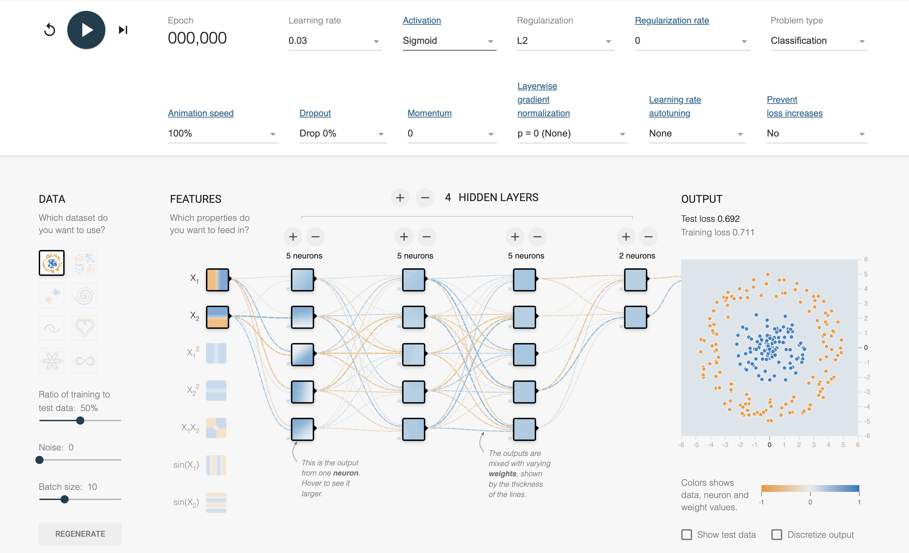

> **Note:**
**"*Understanding the mechanics of learning in neural networks is key to advancing AI. The ability to implement these ideas in efficient and safe ways, as Rust allows, is the next step forward.*" — Geoffrey Hinton**

> **Note:**
*Chapter 3 of DLVR provides an in-depth exploration of neural networks and the crucial mechanisms that enable their learning, with a focus on implementing these concepts using Rust. The chapter begins by introducing the fundamental components of artificial neural networks (ANNs), including neurons, layers, weights, and biases, while covering different types of neural networks such as feedforward, convolutional, and recurrent networks. It emphasizes the role of activation functions like Sigmoid, Tanh, and ReLU in introducing non-linearity, which is vital for solving complex problems. The practical aspects include building basic neural network architectures in Rust, configuring layers, and training a simple feedforward network. The chapter then progresses to advanced neural network architectures, discussing deep neural networks (DNNs), convolutional neural networks (CNNs) for image processing, and recurrent neural networks (RNNs) for sequential data. It explores the challenges of training deep networks, such as vanishing and exploding gradients, and the significance of memory in RNNs, LSTMs, and GRUs. Practical examples in Rust include implementing CNNs and RNNs and optimizing these networks for computational and memory efficiency. The discussion then shifts to backpropagation and gradient descent, detailing how gradients are calculated using the chain rule, the role of various loss functions, and different approaches to gradient descent, including stochastic and mini-batch. Rust implementations focus on efficient gradient calculations, experimenting with loss functions, and training neural networks using backpropagation. The chapter also covers optimization algorithms like Adam and RMSprop, learning rate strategies, and hyperparameter tuning, with Rust examples that compare optimizers and demonstrate the impact of learning rate schedules on training dynamics. Finally, the chapter addresses regularization techniques, overfitting, and model evaluation, introducing methods like L1/L2 regularization, dropout, and early stopping, and emphasizing the importance of metrics such as accuracy, precision, recall, and AUC-ROC. Practical Rust examples showcase how to implement these techniques to enhance model generalization and robustness, ultimately guiding the reader in fine-tuning neural networks for optimal performance.*

# 3.1. Foundations of Neural Networks

Artificial Neural Networks (ANNs) are the backbone of many deep learning systems, designed to mimic the behavior of biological neurons. At the heart of an ANN is the *neuron*, which performs a weighted summation of its inputs, adds a bias, and applies an activation function to introduce non-linearity into the system. This architecture is crucial for solving problems that are not linearly separable.

Mathematically, a neuron takes an input vector $\mathbf{x} = [x_1, x_2, \dots, x_n]$ and computes a weighted sum of the inputs, where $\mathbf{w} = [w_1, w_2, \dots, w_n]$ represents the corresponding weights for each input. The bias term $b$ is added to account for any offset, and the result is passed through an activation function $f(z)$. Formally, the output of the neuron is given by:

$$ z = \mathbf{w}^T \mathbf{x} + b = w_1 x_1 + w_2 x_2 + \dots + w_n x_n + b $$

Here, $f(z)$ introduces non-linearity, allowing the network to model complex relationships between inputs and outputs. Without activation functions, a neural network would behave as a linear system, no matter how many layers it has, limiting its capacity to model complex, non-linear data distributions.

The architecture of ANNs is organized into layers: the *input layer*, which receives the raw input data; one or more *hidden layers*, where features are progressively extracted; and the *output layer*, which generates predictions. Each connection between neurons in consecutive layers has an associated weight, and the training process of a neural network involves adjusting these weights and biases to minimize the error in the predictions.


**Figure 1:** Visualization and interactive tools for FNN - <a href="http://deeperplayground.org">deeperplayground.org</a>.

Different types of neural networks are tailored for specific tasks. The simplest is the *Feedforward Neural Network (FNN)*, where the data flows in one direction from input to output without any feedback loops. FNNs are used primarily for static tasks, such as classification and regression. The mathematical formulation in feedforward networks involves matrix operations, where the input vector is multiplied by a weight matrix for each layer, and the result is passed through an activation function. In matrix notation, for a layer with weights $\mathbf{W}$ and biases $\mathbf{b}$, the output of layer $l$ is:

$$ \mathbf{a}^{(l)} = f(\mathbf{W}^{(l)} \mathbf{a}^{(l-1)} + \mathbf{b}^{(l)}) $$

This iterative computation continues layer by layer until the output layer is reached.

*Convolutional Neural Networks (CNNs)* are specialized for tasks involving spatial data, such as image recognition. They use *convolutional layers* that apply filters to local regions of the input, preserving spatial relationships. This is crucial in domains where the structure of the input data is important. Mathematically, a convolution operation involves sliding a filter over the input and computing a weighted sum of the local input region. The convolution process reduces the spatial dimensions while maintaining key features in the data.

*Recurrent Neural Networks (RNNs)*, on the other hand, are designed for sequential data like time series or text. Unlike FNNs, RNNs have feedback loops, allowing the network to maintain a "memory" of previous inputs. This makes them particularly useful for tasks that depend on the history of data, such as language modeling or speech recognition. The output of each neuron in an RNN is not only dependent on the current input but also on the output of the previous neuron in the sequence.

Activation functions play a crucial role in introducing non-linearity into neural networks, enabling them to model complex patterns. The sigmoid activation function, defined as:

$$ f(z) = \frac{1}{1 + e^{-z}} $$

maps the input $z$ to a range between 0 and 1, making it useful for binary classification problems. However, the sigmoid function can suffer from vanishing gradients, where the gradient becomes too small for effective learning in deep networks.

The hyperbolic tangent (Tanh) function, given by:

$$ f(z) = \frac{2}{1 + e^{-2z}} - 1 $$

maps the input to the range (-1, 1). Like sigmoid, Tanh can still encounter vanishing gradients in deep networks, but its output is zero-centered, which makes it more suitable for certain tasks than sigmoid.

The Rectified Linear Unit (ReLU), defined as:

$$ f(z) = \max(0, z) $$

is widely used in modern deep networks due to its simplicity and effectiveness. ReLU addresses the vanishing gradient problem, as it does not saturate for large values of $z$, allowing gradients to flow more effectively during training.

A typical neural network consists of an input layer, several hidden layers, and an output layer. The forward propagation process involves feeding input data through each layer, applying weighted sums and activation functions, and ultimately generating a prediction at the output layer. This process can be understood as a composition of matrix-vector operations, where each layer computes:

$$ \mathbf{a}^{(l)} = f(\mathbf{W}^{(l)} \mathbf{a}^{(l-1)} + \mathbf{b}^{(l)}) $$

Here, $\mathbf{W}^{(l)}$ represents the weight matrix of layer $l$, and $\mathbf{b}^{(l)}$ represents the bias vector. The output $\mathbf{a}^{(l)}$ is passed as input to the next layer until the final output is produced.

The architecture of neural networks is designed to capture hierarchical representations of data. For example, in image recognition, early layers may capture simple features like edges, while deeper layers capture more complex features like shapes or objects. The depth and width of the network, combined with the choice of activation functions, determine its capacity to model complex relationships.

Rust, known for its high performance and memory safety, is an excellent language for implementing neural networks, especially in environments where efficiency is critical, such as embedded systems or real-time applications. Rust's strict ownership and borrowing rules ensure that memory is managed safely, reducing the risk of bugs like null pointer dereferencing or data races in multi-threaded programs.

Below is a more advanced implementation of a simple feedforward neural network in Rust using the `ndarray` crate for matrix operations:

```rust
use ndarray::Array2;
use rand::Rng;

// Sigmoid activation function
fn sigmoid(x: f64) -> f64 {
    1.0 / (1.0 + (-x).exp())
}

// Derivative of sigmoid function for backpropagation
fn sigmoid_derivative(x: f64) -> f64 {
    sigmoid(x) * (1.0 - sigmoid(x))
}

struct NeuralNetwork {
    #[allow(dead_code)]
    input_size: usize,
    #[allow(dead_code)]
    hidden_size: usize,
    #[allow(dead_code)]
    output_size: usize,
    weights_input_hidden: Array2<f64>,
    weights_hidden_output: Array2<f64>,
}

impl NeuralNetwork {
    fn new(input_size: usize, hidden_size: usize, output_size: usize) -> Self {
        let mut rng = rand::thread_rng();
        let weights_input_hidden = Array2::from_shape_fn((input_size, hidden_size), |_| rng.gen::<f64>());
        let weights_hidden_output = Array2::from_shape_fn((hidden_size, output_size), |_| rng.gen::<f64>());

        NeuralNetwork {
            input_size,
            hidden_size,
            output_size,
            weights_input_hidden,
            weights_hidden_output,
        }
    }

    #[allow(dead_code)]
    fn forward(&self, input: &Array2<f64>) -> Array2<f64> {
        let hidden_input = input.dot(&self.weights_input_hidden);
        let hidden_output = hidden_input.mapv(sigmoid);
        let final_input = hidden_output.dot(&self.weights_hidden_output);
        final_input.mapv(sigmoid)
    }

    // Backward pass and weight updates
    fn train(&mut self, input: &Array2<f64>, target: &Array2<f64>, learning_rate: f64) {
        // Forward pass
        let hidden_input = input.dot(&self.weights_input_hidden);
        let hidden_output = hidden_input.mapv(sigmoid);
        let final_input = hidden_output.dot(&self.weights_hidden_output);
        let final_output = final_input.mapv(sigmoid);

        println!("Forward pass:");
        println!("Hidden layer input:\n{}", hidden_input);
        println!("Hidden layer output (after sigmoid):\n{}", hidden_output);
        println!("Output layer input:\n{}", final_input);
        println!("Output layer output (predictions, after sigmoid):\n{}", final_output);

        // Error in output layer
        let output_error = target - &final_output;
        let output_delta = &output_error * &final_output.mapv(sigmoid_derivative);

        println!("\nBackward pass:");
        println!("Output error:\n{}", output_error);
        println!("Output delta (error * sigmoid derivative):\n{}", output_delta);

        // Error in hidden layer
        let hidden_error = output_delta.dot(&self.weights_hidden_output.t());
        let hidden_delta = &hidden_error * &hidden_output.mapv(sigmoid_derivative);

        println!("Hidden layer error:\n{}", hidden_error);
        println!("Hidden delta (error * sigmoid derivative):\n{}", hidden_delta);

        // Update weights with scaled addition
        self.weights_hidden_output.scaled_add(learning_rate, &hidden_output.t().dot(&output_delta));
        self.weights_input_hidden.scaled_add(learning_rate, &input.t().dot(&hidden_delta));

        println!("\nWeight updates:");
        println!("Updated weights (input to hidden):\n{}", self.weights_input_hidden);
        println!("Updated weights (hidden to output):\n{}", self.weights_hidden_output);
    }
}

fn main() {
    let mut nn = NeuralNetwork::new(3, 5, 1);
    let input = Array2::from_elem((1, 3), 1.0);
    let target = Array2::from_elem((1, 1), 0.5);
    nn.train(&input, &target, 0.1);
}
```

In this example, we define a `NeuralNetwork` struct that initializes random weights for the input-to-hidden and hidden-to-output layers. The `forward` function implements the forward propagation, while the `train` function handles backpropagation and updates the weights using the gradient descent algorithm. The neural network is trained to minimize the error between the predicted output and the target values.

This implementation demonstrates the simplicity and efficiency of Rust for neural networks. With its focus on memory safety and performance, Rust allows developers to build robust neural network models that are well-suited for industrial applications such as robotics, autonomous vehicles, and edge computing.

In conclusion, neural networks represent a powerful framework for solving a wide range of tasks. By understanding the mathematical foundations and implementing these networks in Rust, developers can leverage Rust's performance and safety to build scalable and efficient machine learning models for real-world applications.

# 3.2. Advanced Neural Network Architectures

Deep Neural Networks (DNNs) form the foundation of modern deep learning, extending the architecture of traditional neural networks by introducing multiple hidden layers. Each layer captures progressively more abstract features, allowing the network to model intricate patterns. The depth of a network refers to the number of these hidden layers, and increasing this depth enables the network to learn hierarchical feature representations.

Mathematically, the output of each layer in a DNN is computed through a linear transformation followed by a non-linear activation function. For a layer $l$, the output $\mathbf{a}^{(l)}$ is expressed as:

$$ \mathbf{a}^{(l)} = f(\mathbf{W}^{(l)} \mathbf{a}^{(l-1)} + \mathbf{b}^{(l)}) $$

where $\mathbf{W}^{(l)}$ is the weight matrix for the connections between layers $l-1$ and $l$, $\mathbf{b}^{(l)}$ is the bias vector, and $\mathbf{b}^{(l)}$ is the activation function (e.g., ReLU). This recursive structure allows DNNs to extract increasingly complex features from the data, which is why they are particularly effective in tasks like image classification, natural language processing, and reinforcement learning.

Training DNNs poses challenges such as the *vanishing gradient* and *exploding gradient* problems. The vanishing gradient problem occurs when the gradients of the loss function become too small, especially for the early layers in deep networks. This makes it difficult to adjust the weights during backpropagation, slowing down the learning process. The exploding gradient problem, conversely, leads to excessively large gradients that can cause unstable training dynamics. Solutions to these issues include using activation functions such as ReLU (which mitigates vanishing gradients) and techniques like batch normalization and gradient clipping.


**Figure 2:** Example of CNN architecture for MNIST classification.

Convolutional Neural Networks (CNNs) represent a powerful architecture designed specifically for image and spatial data processing. Unlike fully connected layers, CNNs use *convolutional layers* to exploit the spatial structure of the input. Each convolutional layer applies small, learnable filters (kernels) across the image to extract local features like edges and textures. These filters move (convolve) across the input image, computing the dot product between the filter and the local receptive field of the image. This operation is formalized as:

$$ S(i, j) = (I * F)(i, j) = \sum_{m} \sum_{n} I(i + m, j + n) F(m, n) $$

where $I$ is the input image, $F$ is the filter, and $S(i, j)$ represents the value of the resulting feature map at position $(i, j)$. By applying multiple filters, CNNs generate different feature maps that capture various characteristics of the input, such as edges, corners, and textures.

The *pooling layer*, typically applied after a convolutional layer, serves to down-sample the spatial dimensions of the feature maps while retaining essential information. For instance, max-pooling selects the maximum value in each local region, reducing the size of the feature maps and increasing computational efficiency while providing translation invariance. The process can be written as:

$$ P(i, j) = \max \{ S(i+m, j+n) \} $$

Max-pooling is the most common form, but average-pooling and other variations can be used depending on the task.

One of the most significant advantages of CNNs is that the convolutional filters are shared across the image, reducing the number of parameters compared to fully connected layers. This weight sharing allows CNNs to efficiently process large inputs, making them ideal for tasks such as image classification, object detection, and medical image analysis. The hierarchical nature of CNNs enables them to learn both low-level (edges, textures) and high-level (object parts, faces) features, making them indispensable for visual recognition tasks.

Rust’s efficiency and memory safety make it an excellent language for implementing computationally intensive operations like convolution. Using the `ndarray` crate, developers can build CNNs that leverage Rust's parallel computing capabilities to accelerate image processing tasks.

Here’s an advanced implementation of a convolutional layer in Rust:

```rust
use ndarray::{Array4, Array, s};
use rand::distributions::Uniform;
use rand::Rng;

// Convolution operation
fn conv2d(input: &Array4<f64>, filter: &Array4<f64>, stride: usize, padding: usize) -> Array4<f64> {
    let (input_height, input_width, input_depth, _) = (
        input.shape()[0], input.shape()[1], input.shape()[2], input.shape()[3]);
    let num_filters = filter.shape()[3];

    let output_height = (input_height - filter.shape()[0] + 2 * padding) / stride + 1;
    let output_width = (input_width - filter.shape()[1] + 2 * padding) / stride + 1;
    let mut output = Array::zeros((output_height, output_width, num_filters, 1));

    for n in 0..num_filters {
        for i in 0..output_height {
            for j in 0..output_width {
                for d in 0..input_depth {
                    let input_region = input.slice(s![
                        i * stride..i * stride + filter.shape()[0],
                        j * stride..j * stride + filter.shape()[1],
                        d,
                        0
                    ]);

                    let filter_region = filter.slice(s![.., .., d, n]);
                    output[[i, j, n, 0]] += (&input_region * &filter_region).sum();
                }
            }
        }
    }
    output
}

fn main() {
    let mut rng = rand::thread_rng();
    let input = Array4::from_shape_fn((28, 28, 3, 1), |_| rng.sample(Uniform::new(0.0, 1.0))); // Example input
    let filter = Array4::from_shape_fn((3, 3, 3, 32), |_| rng.sample(Uniform::new(-1.0, 1.0))); // 32 filters
    let output = conv2d(&input, &filter, 1, 0); // No padding, stride 1
    println!("Output shape: {:?}", output.shape());
}
```

This code implements a 2D convolution operation in Rust using the `ndarray` crate. The function `conv2d` takes an input tensor (representing an image), a filter tensor, a stride, and padding values, and outputs a feature map. This code can be extended to include multiple convolutional and pooling layers, forming the backbone of CNN architectures.

Recurrent Neural Networks (RNNs) are designed to process sequential data, such as time series, speech, or text, by incorporating feedback loops that allow information to persist over time. Unlike feedforward networks, where the input flows in one direction, RNNs maintain a hidden state that captures information from previous time steps. The hidden state is updated at each time step based on the current input and the previous hidden state. Formally, the hidden state at time step ttt is defined as:

$$h_t = f(W_h h_{t-1} + W_x x_t)$$

where $h_t$ is the hidden state at time $t$, $h_{t-1}$ is the hidden state from the previous time step, $x_t$ is the current input, and $W_h$ and $W_x$ are the weight matrices. The activation function $f$ (commonly tanh or ReLU) introduces non-linearity, allowing the network to capture complex temporal dependencies in the data.

Despite their ability to model sequential data, basic RNNs suffer from the vanishing gradient problem, which makes it difficult to capture long-term dependencies. To address this, more advanced architectures like Long Short-Term Memory (LSTM) networks and Gated Recurrent Units (GRUs) were developed. LSTMs introduce *cell states* and *gating mechanisms* (input, forget, and output gates) that control the flow of information, enabling the network to retain information over longer sequences.


**Figure 3:** Computing the hidden state in an LSTM model.

Mathematically, an LSTM network can be described by the following set of equations for each time step ttt:

$$ F_t = \sigma(W_f x_t + U_f h_{t-1} + b_f) \quad \text{(forget gate)} $$

$$ I_t = \sigma(W_i x_t + U_i h_{t-1} + b_i) \quad \text{(input gate)} $$

$$ \tilde{C}_t = \tanh(W_C x_t + U_C h_{t-1} + b_C) \quad \text{(candidate cell state)} $$

$$ C_t = f_t \odot C_{t-1} + i_t \odot  $$

$$ O_t = \sigma(W_o x_t + U_o h_{t-1} + b_o) \quad \text{(output gate)} $$

$$ H_t = o_t \odot \tanh(C_t) \quad \text{(new hidden state)} $$

LSTMs have become a staple in tasks requiring long-term memory, such as machine translation, speech recognition, and time series forecasting. GRUs simplify the LSTM architecture by combining the forget and input gates into a single *update gate*, making them computationally more efficient while maintaining the ability to capture long-term dependencies.

In Rust, implementing RNNs requires efficiently handling sequences and managing state across time steps. Rust's strong memory guarantees ensure that the hidden states are correctly updated without memory errors or race conditions, making it a suitable choice for implementing sequential models.

Below is an example of an RNN implemented in Rust:

```rust
use ndarray::{Array2, Array1};
use rand::Rng;
use rand::distributions::Uniform;

// Recurrent step
fn rnn_step(x_t: &Array1<f64>, h_t_prev: &Array1<f64>, w_xh: &Array2<f64>, w_hh: &Array2<f64>) -> Array1<f64> {
    let h_t = w_xh.dot(x_t) + w_hh.dot(h_t_prev);
    h_t.mapv(|x| x.tanh())
}

fn main() {
    let mut rng = rand::thread_rng();

    // Generate random input array for 10 timesteps and 5 features
    let input = Array2::from_shape_fn((10, 5), |_| rng.sample(Uniform::new(0.0, 1.0)));

    // Initialize hidden state with zeros (5 hidden units)
    let mut hidden_state = Array1::zeros(5);

    // Generate random weights for w_xh and w_hh
    let w_xh = Array2::from_shape_fn((5, 5), |_| rng.sample(Uniform::new(-1.0, 1.0)));
    let w_hh = Array2::from_shape_fn((5, 5), |_| rng.sample(Uniform::new(-1.0, 1.0)));

    // Iterate over each timestep in the input sequence
    for t in 0..input.shape()[0] {
        hidden_state = rnn_step(&input.row(t).to_owned(), &hidden_state, &w_xh, &w_hh);
        println!("Hidden state at timestep {}: {:?}", t, hidden_state);
    }
}
```

This code implements a basic RNN step, updating the hidden state based on the current input and the previous hidden state. The `tanh` activation function is used to introduce non-linearity. This implementation can be extended to support more complex architectures like LSTMs or GRUs.

Training deep networks, particularly CNNs and RNNs, involves significant computational and memory demands. Rust’s memory safety, ownership model, and concurrency features make it highly suitable for optimizing these operations. By leveraging Rust’s multi-threading capabilities, developers can parallelize matrix operations, convolution computations, and backpropagation steps, improving the performance of deep learning models.

Additionally, Rust’s zero-cost abstractions and low-level control over memory allow for efficient use of hardware resources, making it an excellent choice for deploying models on edge devices or environments with limited computational power.

In summary, CNNs and RNNs form the backbone of deep learning architectures for image and sequential data processing, respectively. By implementing these architectures in Rust, developers can build high-performance and memory-safe models, making Rust an attractive language for real-world applications in domains like computer vision, natural language processing, and time series analysis.

# 3.3. Backpropagation and Gradient Descent

Backpropagation is a fundamental algorithm used in neural network training, allowing efficient computation of the gradient of the loss function with respect to each weight in the network. It relies on the chain rule of calculus to propagate the error backwards through the network, adjusting weights in each layer to minimize the loss function. Mathematically, let’s consider a neural network where the predicted output is denoted by $\hat{y} = f(\mathbf{W}, \mathbf{x})$, with $\mathbf{W}$ representing the set of weights and $\mathbf{x}$ as the input data. The goal of training the network is to minimize a loss function $L(\hat{y}, y)$, where $y$ represents the true labels. The backpropagation algorithm calculates the gradient of the loss with respect to each weight $W$ using the chain rule, as given by:

$$ \frac{\partial L}{\partial W} = \frac{\partial L}{\partial \hat{y}} \cdot \frac{\partial \hat{y}}{\partial W} $$

This calculation propagates backwards from the output layer to the input layer, updating the weights according to the computed gradients. The weights in each layer are then adjusted based on gradient descent, where the weight update rule is:

$$ W^{(l)} \leftarrow W^{(l)} - \eta \frac{\partial L}{\partial W^{(l)}} $$

Here, $\eta$ represents the learning rate, a hyperparameter that controls the size of the weight updates. The purpose of backpropagation is to minimize the overall error by propagating gradients that inform each weight on how to adjust to reduce the loss.

The choice of the loss function is critical in guiding the learning process. Two widely used loss functions are Mean Squared Error (MSE) and Cross-Entropy. The Mean Squared Error (MSE) is used in regression tasks and is mathematically defined as:

$$ L_{\text{MSE}}(\hat{y}, y) = \frac{1}{n} \sum_{i=1}^{n} (y_i - \hat{y}_i)^2 $$

In this equation, $y_i$ denotes the true label, while $\hat{y}_i$ is the predicted value. MSE calculates the average squared difference between the predicted values and the actual values, providing a measure of how well the model performs. The gradient of the MSE with respect to the predicted output is:

$$ \frac{\partial L_{\text{MSE}}}{\partial \hat{y}} = -\frac{2}{n} (y - \hat{y}) $$

In classification tasks, Cross-Entropy is a more suitable loss function. For binary classification, Cross-Entropy is defined as:

$$ L_{\text{Cross-Entropy}}(\hat{y}, y) = -\frac{1}{n} \sum_{i=1}^{n} \left[ y_i \log(\hat{y}_i) + (1 - y_i) \log(1 - \hat{y}_i) \right] $$

Cross-Entropy measures the dissimilarity between the predicted probabilities $\hat{y}_i$ and the true labels $y_i$, which take values in $\{0, 1\}$. The gradient of the Cross-Entropy loss is given by:

$$ \frac{\partial L_{\text{Cross-Entropy}}}{\partial \hat{y}} = -\frac{y}{\hat{y}} + \frac{1 - y}{1 - \hat{y}} $$

These loss functions define the optimization objective, which backpropagation seeks to minimize by adjusting the weights through gradient descent.

Gradient descent is the optimization algorithm used in conjunction with backpropagation to update the network’s weights. The basic idea is to take steps in the direction of the negative gradient of the loss function with respect to the weights. There are three main variants of gradient descent: Standard Gradient Descent, Stochastic Gradient Descent (SGD), and Mini-batch Gradient Descent. Standard Gradient Descent computes the gradient of the loss over the entire training dataset before updating the weights. This method, while accurate, can be computationally expensive for large datasets. Stochastic Gradient Descent, in contrast, updates the weights after computing the gradient on each individual training sample. This results in faster updates but introduces higher variance in the weight updates, which can lead to noisy learning. Mini-batch Gradient Descent strikes a balance by computing the gradient over a small subset (mini-batch) of the training data, combining the efficiency of SGD with the stability of Standard Gradient Descent. The general update rule for gradient descent is:

$$ W \leftarrow W - \eta \frac{1}{n} \sum_{i=1}^{n} \nabla_W L(\hat{y}^{(i)}, y^{(i)}) $$

where $n$ is the size of the mini-batch, $\eta$ is the learning rate, and $\nabla_W L$ is the gradient of the loss function with respect to the weights.

Backpropagation works by calculating the gradients for each layer and updating the weights to minimize the loss function. The network’s error at the output layer is calculated, and this error is propagated backwards to compute the gradients for earlier layers. The chain rule enables backpropagation to efficiently compute the gradient of the loss function with respect to each weight, allowing the weights to be updated by gradient descent. The learning rate $\eta$ plays a crucial role in determining the size of the weight updates. If the learning rate is too high, the model may overshoot the optimal solution, causing divergence. If it is too low, convergence may be slow, requiring many iterations to reach an optimal solution. Choosing the right learning rate and optimization algorithm is essential for training a well-optimized network.


**Figure 4:** Illustration of back propagation and gradient descent algorithms.

However, backpropagation faces several challenges, such as overfitting, underfitting, and difficulty in optimizing very deep networks. Overfitting occurs when the network learns to memorize the training data, including its noise, instead of generalizing to new data. Techniques such as regularization (L2 and L1), dropout, and early stopping are commonly used to mitigate overfitting. Underfitting, on the other hand, occurs when the model is too simple to capture the complexity of the data, resulting in high errors on both training and test sets. Addressing underfitting often involves increasing the model’s capacity by adding more layers, using better activation functions, or optimizing hyperparameters.

From a practical standpoint, implementing backpropagation in Rust can be done efficiently by leveraging Rust’s powerful type system and memory management. Rust’s strict ownership model ensures that memory is handled safely, reducing the likelihood of memory-related bugs such as dangling pointers or memory leaks. In the context of deep learning, the implementation of backpropagation involves defining a neural network, computing the forward pass to obtain predictions, and then calculating the gradients during the backward pass to update the weights. Below is an example of a simple implementation of backpropagation in Rust:

```rust
use ndarray::Array2;
use rand::Rng;

fn sigmoid(x: f64) -> f64 {
    1.0 / (1.0 + (-x).exp())
}

fn sigmoid_derivative(x: f64) -> f64 {
    sigmoid(x) * (1.0 - sigmoid(x))
}

struct NeuralNetwork {
    weights_input_hidden: Array2<f64>,
    weights_hidden_output: Array2<f64>,
    learning_rate: f64,
}

impl NeuralNetwork {
    fn new(input_size: usize, hidden_size: usize, output_size: usize, learning_rate: f64) -> Self {
        let mut rng = rand::thread_rng();
        let weights_input_hidden = Array2::from_shape_fn((input_size, hidden_size), |_| rng.gen::<f64>());
        let weights_hidden_output = Array2::from_shape_fn((hidden_size, output_size), |_| rng.gen::<f64>());

        NeuralNetwork {
            weights_input_hidden,
            weights_hidden_output,
            learning_rate,
        }
    }

    fn forward(&self, input: &Array2<f64>) -> (Array2<f64>, Array2<f64>) {
        let hidden_input = input.dot(&self.weights_input_hidden);
        let hidden_output = hidden_input.mapv(sigmoid);
        let final_input = hidden_output.dot(&self.weights_hidden_output);
        let final_output = final_input.mapv(sigmoid);
        (hidden_output, final_output)
    }

    fn backward(&mut self, input: &Array2<f64>, hidden_output: &Array2<f64>, output: &Array2<f64>, target: &Array2<f64>) {
        let output_error = target - output;
        let output_delta = &output_error * &output.mapv(sigmoid_derivative);

        let hidden_error = output_delta.dot(&self.weights_hidden_output.t());
        let hidden_delta = &hidden_error * &hidden_output.mapv(sigmoid_derivative);

        // Print values during the backward pass
        println!("Output error:\n{}", output_error);
        println!("Output delta:\n{}", output_delta);
        println!("Hidden error:\n{}", hidden_error);
        println!("Hidden delta:\n{}", hidden_delta);

        self.weights_hidden_output.scaled_add(self.learning_rate, &hidden_output.t().dot(&output_delta));
        self.weights_input_hidden.scaled_add(self.learning_rate, &input.t().dot(&hidden_delta));
    }

    fn train(&mut self, input: &Array2<f64>, target: &Array2<f64>) {
        let (hidden_output, final_output) = self.forward(input);

        // Print values during the forward pass
        println!("Input:\n{}", input);
        println!("Hidden layer output:\n{}", hidden_output);
        println!("Final output (predictions):\n{}", final_output);
        println!("Target:\n{}", target);

        self.backward(input, &hidden_output, &final_output, target);
    }
}

fn main() {
    let input = Array2::from_elem((1, 3), 1.0);
    let target = Array2::from_elem((1, 1), 0.5);
    let mut nn = NeuralNetwork::new(3, 5, 1, 0.1);

    nn.train(&input, &target);
}
```

This implementation demonstrates a basic neural network in Rust, using backpropagation to adjust the weights. The network consists of an input layer, a hidden layer, and an output layer. During the forward pass, the input is propagated through the network to produce an output. The backward pass computes the gradients and adjusts the weights using the gradient descent algorithm. The learning rate controls the magnitude of these updates, and it can be tuned to optimize the network’s training performance.

Backpropagation and gradient descent form the foundation of training neural networks. By calculating the gradients and updating the weights, neural networks can learn to map inputs to desired outputs. Implementing these algorithms efficiently in Rust, with its emphasis on performance and memory safety, provides a robust framework for building deep learning models that can be applied to real-world problems.

# 3.4. Optimizers and Learning Rate Strategies

Optimization algorithms are critical to neural network training, as they dictate how the model’s parameters are updated during backpropagation to minimize the loss function. Various optimizers have been developed to improve training efficiency and convergence, each with distinct mathematical foundations and practical use cases. Three of the most commonly used optimizers are Stochastic Gradient Descent (SGD), Adam, and RMSprop.


**Figure 5:** Visual illustration of common gradient descent algorithms.

Stochastic Gradient Descent (SGD) is the foundation of most optimization algorithms. The primary principle of SGD is to adjust the weights based on the gradient of the loss function with respect to the weights for each mini-batch or individual training example. Mathematically, the weight update rule in SGD is:

$$ W \leftarrow W - \eta \nabla_W L(\hat{y}, y) $$

where $\eta$ is the learning rate, and $\nabla_W L(\hat{y}, y)$ is the gradient of the loss function $L$ with respect to the weights $W$. While SGD is effective, it can suffer from slow convergence and oscillation, particularly in the presence of steep or flat regions of the loss surface.

To address these issues, variants of SGD have been developed, such as the *momentum* technique. Momentum helps accelerate convergence by accumulating a velocity vector $v_t$ in the direction of the gradient, effectively “smoothing” the updates:

$$ v_t = \gamma v_{t-1} + \eta \nabla_W L(\hat{y}, y) $$

$$ W \leftarrow W - v_t $$

Here, $\gamma$ is the momentum factor, typically set between 0.9 and 0.99. Momentum allows the optimizer to build speed in directions with consistent gradients and dampen oscillations in directions with high curvature.

Adam (Adaptive Moment Estimation) builds on both momentum and RMSprop by maintaining separate estimates of the first and second moments of the gradients (the mean and the variance). Adam computes moving averages of the gradient mtm_tmt (the first moment) and the squared gradient vtv_tvt (the second moment) at each iteration:

$$ m_t = \beta_1 m_{t-1} + (1 - \beta_1) \nabla_W L(\hat{y}, y) $$

$$ v_t = \beta_2 v_{t-1} + (1 - \beta_2) (\nabla_W L(\hat{y}, y))^2 $$

The parameters $\beta_1$ and $\beta_2$ control the decay rates for the first and second moments, respectively. The weights are then updated as follows:

$$ \hat{m_t} = \frac{m_t}{1 - \beta_1^t}, \quad \hat{v_t} = \frac{v_t}{1 - \beta_2^t} $$

$$ W \leftarrow W - \eta \frac{\hat{m_t}}{\sqrt{\hat{v_t}} + \epsilon} $$

Adam automatically adapts the learning rate for each parameter based on the magnitudes of the gradients, making it particularly effective for problems with sparse gradients or noisy updates. RMSprop, a precursor to Adam, only adapts the learning rate based on the moving average of the squared gradients, making it suitable for problems with rapidly changing gradients.

The choice of optimizer has a significant impact on the performance of the neural network, as different optimizers behave differently in various optimization landscapes. For example, SGD with momentum is preferred in problems where the loss function has steep gradients, as momentum helps accelerate convergence. Adam and RMSprop, on the other hand, are often used when the optimization problem involves noisy gradients or sparse features, as they adapt the learning rates for individual parameters.

Learning rate scheduling is another crucial technique that helps control the convergence of neural networks. The learning rate controls the size of the updates during gradient descent, and its value can affect the training dynamics. A high learning rate may lead to instability, while a low learning rate can slow down convergence. Learning rate scheduling gradually decreases the learning rate as training progresses, allowing the optimizer to take larger steps early in training and smaller, more refined steps later. One common scheduling strategy is exponential decay, where the learning rate decreases exponentially after each epoch:

$$ \eta_t = \eta_0 e^{-\lambda t} $$

Here, $\eta_0$ is the initial learning rate, $t$ is the current epoch, and $\lambda$ is the decay rate. Another popular approach is the step decay schedule, where the learning rate is reduced by a factor after a fixed number of epochs. These strategies help the network avoid overshooting the optimal solution and ensure better convergence towards a local or global minimum.

Hyperparameter tuning is another critical aspect of training deep learning models. Hyperparameters like the learning rate, momentum, decay rates, and regularization coefficients have a profound effect on the model’s performance. Finding the optimal set of hyperparameters can be challenging and often involves a combination of grid search or random search over a predefined range of values. In practical settings, tools like Optuna or Ray Tune automate this process, providing efficient exploration of the hyperparameter space.

In practice, implementing optimizers and learning rate schedules in Rust requires efficient gradient computation and parameter updates. The `ndarray` crate can be used to handle the matrix operations involved in gradient updates, and Rust’s memory safety guarantees ensure that parameter updates are performed safely. Below is an example of implementing the Adam optimizer in Rust:

```rust
use ndarray::Array2;
use rand::Rng;
use rand::distributions::Uniform;

// Adam optimizer implementation
struct Adam {
    learning_rate: f64,
    beta1: f64,
    beta2: f64,
    epsilon: f64,
    m: Array2<f64>,
    v: Array2<f64>,
    t: usize,
}

impl Adam {
    fn new(input_size: usize, output_size: usize, learning_rate: f64, beta1: f64, beta2: f64, epsilon: f64) -> Self {
        let m = Array2::zeros((input_size, output_size));
        let v = Array2::zeros((input_size, output_size));
        Adam {
            learning_rate,
            beta1,
            beta2,
            epsilon,
            m,
            v,
            t: 0,
        }
    }

    fn update(&mut self, weights: &mut Array2<f64>, gradients: &Array2<f64>) {
        self.t += 1;

        // Update biased first moment estimate
        self.m = self.beta1 * &self.m + (1.0 - self.beta1) * gradients;

        // Update biased second moment estimate
        self.v = self.beta2 * &self.v + (1.0 - self.beta2) * gradients.mapv(|g| g * g);

        // Compute bias-corrected first and second moment estimates
        let m_hat = &self.m / (1.0 - self.beta1.powi(self.t as i32));
        let v_hat = &self.v / (1.0 - self.beta2.powi(self.t as i32));

        // Update weights
        *weights -= &(self.learning_rate * m_hat / (v_hat.mapv(f64::sqrt) + self.epsilon));
    }
}

fn main() {
    let input_size = 3;
    let output_size = 2;

    // Initialize weights and gradients with random values
    let mut rng = rand::thread_rng();
    let mut weights = Array2::from_shape_fn((input_size, output_size), |_| rng.sample(Uniform::new(-1.0, 1.0)));
    let gradients = Array2::from_shape_fn((input_size, output_size), |_| rng.sample(Uniform::new(-0.1, 0.1)));

    // Adam optimizer with specified parameters
    let mut adam = Adam::new(input_size, output_size, 0.001, 0.9, 0.999, 1e-8);

    // Run optimizer updates
    for _ in 0..1000 {
        adam.update(&mut weights, &gradients);
    }

    println!("Updated weights: {:?}", weights);
}
```

In this implementation, we define an `Adam` optimizer that updates the weights based on the gradients computed during backpropagation. The optimizer maintains moving averages of the gradient and its square, which are used to adaptively adjust the learning rate for each parameter. This implementation can be extended to include learning rate schedules and other optimization strategies, such as SGD with momentum.

In industry, choosing the right optimizer and learning rate schedule is critical for scaling models to large datasets and complex architectures. Adam has become a widely used optimizer due to its adaptability and robustness, particularly in large-scale settings like language models and image classification. However, for certain tasks like reinforcement learning, RMSprop or SGD with momentum may perform better due to their stability properties in environments with non-stationary gradients.

Learning rate scheduling and hyperparameter tuning are also essential for achieving optimal model performance. Using too high a learning rate can cause the model to overshoot the minimum, while too low a rate can result in slow convergence. Hyperparameter tuning techniques, such as grid search or Bayesian optimization, help automate the process of selecting optimal values, which is crucial in real-world applications where model performance directly impacts the success of the system.

In conclusion, optimizers and learning rate strategies are pivotal in deep learning, with each algorithm offering unique advantages for different tasks. Implementing these strategies in Rust allows for high-performance model training while maintaining memory safety, making Rust a suitable choice for industrial applications. By experimenting with different optimizers and learning rate schedules, developers can fine-tune their models for better performance and faster convergence.

# 3.5. Regularization, Overfitting, and Model Evaluation

In neural network training, understanding and addressing overfitting and underfitting are critical for building models that generalize well to unseen data. Overfitting occurs when the model is too complex relative to the amount of training data, allowing it to memorize the noise and details specific to the training set rather than learning the underlying patterns. This leads to excellent performance on the training data but poor performance on validation or test sets. Mathematically, overfitting is often characterized by a low training error but a high generalization error, which is the error on new, unseen data. On the opposite end, underfitting happens when the model is too simple to capture the complexity of the data, leading to high errors on both the training and test sets. Effective regularization techniques help mitigate overfitting by introducing constraints that prevent the model from becoming overly complex.


**Figure 6:** Illustration of model regularization.

Regularization techniques like L1 and L2 regularization are among the most commonly used strategies to prevent overfitting by penalizing large weights. In L2 regularization, also known as weight decay, the objective function is modified by adding a term proportional to the square of the weights. The new loss function becomes:

$$ L_{\text{total}} = L_{\text{original}} + \lambda \sum_{i} W_i^2 $$

Here, $L_{\text{original}}$ represents the original loss function (such as cross-entropy or mean squared error), $W_i$ is the weight of the $i$-th connection, and $\lambda$ is the regularization strength, a hyperparameter that controls the amount of penalty applied. The gradient of this regularized loss with respect to the weights is:

$$ \frac{\partial L_{\text{total}}}{\partial W_i} = \frac{\partial L_{\text{original}}}{\partial W_i} + 2 \lambda W_i∂Wi​ $$

This extra term $2 \lambda W_i$ ensures that during gradient descent, large weights are penalized, thereby preventing the model from overfitting by relying too heavily on any specific feature.

L1 regularization modifies the loss function by adding the absolute values of the weights, which promotes sparsity in the model. The L1 regularized loss is given by:

$$ L_{\text{total}} = L_{\text{original}} + \lambda \sum_{i} |W_i| $$

In this case, the gradient of the regularized loss is:

$$ \frac{\partial L_{\text{total}}}{\partial W_i} = \frac{\partial L_{\text{original}}}{\partial W_i} + \lambda \cdot \text{sign}(W_i) $$

where $\text{sign}(W_i)$ is the sign function, which returns +1 or -1 depending on the sign of $W_i$. L1 regularization tends to produce sparse weight matrices, as the absolute value penalty encourages small weights to become zero, leading to a simpler model that is less prone to overfitting.

Dropout is another widely used regularization technique in deep learning that randomly "drops" a fraction of neurons during each forward pass in training. Dropout effectively prevents the network from becoming too reliant on any particular subset of neurons by forcing the network to learn redundant representations. Dropout can be mathematically described by multiplying the activations of neurons by a random binary mask $\mathbf{r}$, where each element of $\mathbf{r}$ is sampled from a Bernoulli distribution with probability $p$, the dropout rate. The forward pass for a layer with dropout is:

$$ \mathbf{a}^{(l)}_{\text{dropout}} = \mathbf{a}^{(l)} \odot \mathbf{r} $$

where $\odot$ denotes element-wise multiplication. The dropout rate ppp determines the fraction of neurons that are set to zero. At test time, the dropout mechanism is turned off, but the weights are scaled by $1 - p$ to account for the fact that more neurons are active during inference than during training.

Early stopping is another technique used to prevent overfitting by monitoring the performance of the model on a validation set during training. Instead of training the model for a fixed number of epochs, early stopping halts the training process when the validation error starts to increase, indicating that the model is beginning to overfit the training data. Early stopping is particularly useful when combined with other regularization techniques like L2 regularization or dropout, as it ensures that the model does not continue to memorize the training data.

Evaluating the performance of a neural network requires careful consideration of various metrics that go beyond just accuracy. Accuracy is the ratio of correctly classified instances to the total number of instances, but it can be misleading, especially when the dataset is imbalanced. Precision, recall, and F1 score are metrics that provide a more detailed view of model performance. Precision measures the fraction of positive predictions that are actually correct:

$$ \text{Precision} = \frac{\text{True Positives}}{\text{True Positives} + \text{False Positives}} $$

Recall measures the fraction of actual positives that are correctly identified:

$$ \text{Recall} = \frac{\text{True Positives}}{\text{True Positives} + \text{False Negatives}} $$

The F1 score is the harmonic mean of precision and recall, providing a single metric that balances both:

$$ F1 = 2 \cdot \frac{\text{Precision} \cdot \text{Recall}}{\text{Precision} + \text{Recall}} $$

Another important metric is the AUC-ROC (Area Under the Receiver Operating Characteristic Curve), which measures the model’s ability to distinguish between classes across different thresholds. AUC-ROC is particularly useful in binary classification problems, as it provides insight into the trade-off between the true positive rate and false positive rate.


**Figure 7:** Example of neural network confusion matrix and their corresponding area under curve (AUC) for best sensitivity and 1-specificity from the network s training, validation and testing data with 10 hidden layers, 10 input elements and two outputs. (a) Training confusion matrix; (b) validation confusion matrix; (c) test confusion matrix; (d) all confusion matrix; (e) AUC of training confusion matrix; (f) AUC of validation confusion matrix; (g) AUC of test confusion matrix; (h) AUC of all confusion matrix. ROC: receiver operating characteristic

In practice, regularization and model evaluation are essential for ensuring that neural networks generalize well to unseen data. Implementing these techniques in Rust involves creating efficient algorithms for penalizing large weights, applying dropout, and evaluating the model’s performance using metrics like precision, recall, and F1 score. Below is an extended Rust implementation that demonstrates L2 regularization, dropout, and model evaluation metrics.

```rust
use ndarray::{Array2, Array1};
use rand::Rng;
use rand::distributions::Uniform;
use std::f64;

// L2 regularization
fn l2_regularization(weights: &Array2<f64>, lambda: f64) -> f64 {
    lambda * weights.mapv(|w| w.powi(2)).sum()
}

// Dropout implementation
fn dropout(input: &Array2<f64>, dropout_rate: f64) -> Array2<f64> {
    let mut rng = rand::thread_rng();
    let dropout_mask = Array2::from_shape_fn(input.dim(), |_| {
        if rng.gen::<f64>() < dropout_rate {
            0.0
        } else {
            1.0
        }
    });
    input * dropout_mask
}

// Precision, Recall, F1 score
fn precision_recall_f1(y_true: &Array1<f64>, y_pred: &Array1<f64>, threshold: f64) -> (f64, f64, f64) {
    let mut true_positive = 0.0;
    let mut false_positive = 0.0;
    let mut false_negative = 0.0;

    for (&true_val, &pred_val) in y_true.iter().zip(y_pred.iter()) {
        let pred_class = if pred_val >= threshold { 1.0 } else { 0.0 };
        if pred_class == 1.0 && true_val == 1.0 {
            true_positive += 1.0;
        } else if pred_class == 1.0 && true_val == 0.0 {
            false_positive += 1.0;
        } else if pred_class == 0.0 && true_val == 1.0 {
            false_negative += 1.0;
        }
    }

    let precision = if true_positive + false_positive == 0.0 {
        0.0
    } else {
        true_positive / (true_positive + false_positive)
    };

    let recall = if true_positive + false_negative == 0.0 {
        0.0
    } else {
        true_positive / (true_positive + false_negative)
    };

    let f1 = if precision + recall == 0.0 {
        0.0
    } else {
        2.0 * (precision * recall) / (precision + recall)
    };

    (precision, recall, f1)
}

// AUC-ROC calculation
fn auc_roc(y_true: &Array1<f64>, y_pred: &Array1<f64>) -> f64 {
    let mut sorted_pred: Vec<_> = y_pred.iter().zip(y_true.iter()).collect();
    sorted_pred.sort_by(|a, b| a.0.partial_cmp(b.0).unwrap());

    let mut tpr = vec![];
    let mut fpr = vec![];

    let total_positives = y_true.iter().filter(|&&y| y == 1.0).count() as f64;
    let total_negatives = y_true.iter().filter(|&&y| y == 0.0).count() as f64;

    let mut true_positives = 0.0;
    let mut false_positives = 0.0;

    for (_, &true_val) in sorted_pred {
        if true_val == 1.0 {
            true_positives += 1.0;
        } else {
            false_positives += 1.0;
        }

        tpr.push(true_positives / total_positives);
        fpr.push(false_positives / total_negatives);
    }

    let mut auc = 0.0;
    for i in 1..tpr.len() {
        let delta_x = fpr[i] - fpr[i - 1];
        let avg_y = (tpr[i] + tpr[i - 1]) / 2.0;
        auc += delta_x * avg_y;
    }

    auc
}

fn main() {
    let input_size = 3;
    let hidden_size = 5;
    let output_size = 1;
    let dropout_rate = 0.5;
    let lambda = 0.01;

    // Simulate Neural Network's input and output for demonstration purposes
    let mut rng = rand::thread_rng();
    let input = Array2::from_shape_fn((1, input_size), |_| rng.sample(Uniform::new(0.0, 1.0)));
    let weights = Array2::from_shape_fn((hidden_size, output_size), |_| rng.sample(Uniform::new(0.0, 1.0)));

    // Apply L2 regularization
    let l2_loss = l2_regularization(&weights, lambda);
    println!("L2 Regularization Loss: {}", l2_loss);

    // Apply Dropout to the input
    let dropped_input = dropout(&input, dropout_rate);
    println!("Input after Dropout: {:?}", dropped_input);

    // Evaluation metrics
    let y_true = Array1::from(vec![1.0, 0.0, 1.0, 0.0, 1.0]);
    let y_pred = Array1::from(vec![0.9, 0.1, 0.8, 0.4, 0.6]);

    let (precision, recall, f1) = precision_recall_f1(&y_true, &y_pred, 0.5);
    println!("Precision: {}, Recall: {}, F1 Score: {}", precision, recall, f1);

    // AUC-ROC Calculation
    let auc = auc_roc(&y_true, &y_pred);
    println!("AUC-ROC Score: {}", auc);
}
```

This Rust-like implementation demonstrates a basic neural network workflow, incorporating L2 regularization, dropout, precision-recall-F1 metrics, and AUC-ROC score computation. The `l2_regularization` function applies a penalty to large weights to prevent overfitting, while the `dropout` function randomly drops input activations during training to enhance model generalization. The `precision_recall_f1` function calculates precision, recall, and F1 score based on predictions and actual values, helping evaluate classification performance. Additionally, the `auc_roc` function computes the AUC-ROC score, which integrates the true positive rate (TPR) and false positive rate (FPR) across varying thresholds, offering insight into the model's ability to distinguish between classes. The code brings together these components to assess a model’s performance both in terms of accuracy and robustness, crucial in deep learning classification tasks.

In `tch-rs`, which is a Rust wrapper around PyTorch, you have access to most of the PyTorch functionalities, including dropout, regularization, and metrics calculation using tensors. The code below implements a simple neural network in Rust using the `tch` library, which provides bindings for PyTorch's C++ API. The network includes functions for L2 regularization, dropout, and performance evaluation metrics (precision, recall, and F1 score) that are commonly used in machine learning. These components are integrated to form a basic framework for training and evaluating neural networks with regularization and evaluation metrics.

```rust
use tch::{nn, nn::Module, Device, Tensor};
use tch::Kind;

fn l2_regularization(weights: &Tensor, lambda: f64) -> Tensor {
    weights.pow_tensor_scalar(2).sum(Kind::Float) * lambda
}

fn dropout(input: &Tensor, dropout_rate: f64) -> Tensor {
    input.dropout(dropout_rate, true)
}

fn precision_recall_f1(y_true: &Tensor, y_pred: &Tensor, threshold: f64) -> (f64, f64, f64) {
    let pred_class = y_pred.ge(threshold);
    let true_positive = pred_class
        .eq_tensor(y_true)
        .logical_and(&y_true.eq_tensor(&Tensor::from(1.0)))
        .sum(Kind::Float);
    let false_positive = pred_class
        .eq_tensor(&Tensor::from(1.0))
        .logical_and(&y_true.eq_tensor(&Tensor::from(0.0)))
        .sum(Kind::Float);
    let false_negative = pred_class
        .eq_tensor(&Tensor::from(0.0))
        .logical_and(&y_true.eq_tensor(&Tensor::from(1.0)))
        .sum(Kind::Float);

    let tp_val = true_positive.double_value(&[]);
    let fp_val = false_positive.double_value(&[]);
    let fn_val = false_negative.double_value(&[]);

    let precision = if tp_val + fp_val > 0.0 {
        tp_val / (tp_val + fp_val)
    } else {
        0.0
    };

    let recall = if tp_val + fn_val > 0.0 {
        tp_val / (tp_val + fn_val)
    } else {
        0.0
    };

    let f1 = if precision + recall > 0.0 {
        2.0 * (precision * recall) / (precision + recall)
    } else {
        0.0
    };

    (precision, recall, f1)
}

fn main() {
    let device = Device::cuda_if_available();
    let vs = nn::VarStore::new(device);

    let net = nn::seq()
        .add(nn::linear(vs.root() / "layer1", 3, 128, Default::default()))
        .add_fn(|xs| xs.relu())
        .add(nn::linear(vs.root() / "layer2", 128, 64, Default::default()))
        .add_fn(|xs| xs.relu())
        .add(nn::linear(vs.root() / "layer3", 64, 1, Default::default()));

    let xs = Tensor::randn(&[100, 3], (Kind::Float, device));
    let ys = Tensor::randn(&[100, 1], (Kind::Float, device));

    // Dropout applied during forward pass
    let _dropped_out_input = dropout(&xs, 0.5);

    // L2 regularization
    let weights = net.forward(&xs);
    let _loss = l2_regularization(&weights, 0.01);

    // Precision, Recall, F1 Score
    let (precision, recall, f1) = precision_recall_f1(&ys, &weights, 0.5);
    println!("Precision: {}, Recall: {}, F1 Score: {}", precision, recall, f1);
}
```

The code starts by defining helper functions for L2 regularization and dropout. The `l2_regularization` function penalizes large weights to prevent overfitting, while `dropout` randomly zeros out parts of the input to reduce over-reliance on specific neurons. The `precision_recall_f1` function calculates precision, recall, and F1 score by comparing the predicted output to actual labels, which is useful for classification problems. The main function initializes a neural network with three layers using the `tch` library's sequential model API, setting up variable storage on the GPU if available. Input and output tensors are randomly generated, and dropout is applied to the input as part of the forward pass. The network's predictions are passed through the L2 regularization function to compute a regularization loss, and finally, the precision, recall, and F1 score are printed, providing a performance summary of the model.

In industry, regularization techniques like L2 regularization, dropout, and early stopping are essential for training neural networks that are both accurate and robust. These techniques are widely used in areas such as image classification, natural language processing, and time-series forecasting, where models are often prone to overfitting due to the complexity of the data. The use of evaluation metrics like precision, recall, and F1 score is also critical in domains like healthcare, finance, and fraud detection, where the cost of false positives or false negatives can be high.

In conclusion, regularization techniques such as L1, L2, and dropout are indispensable tools for preventing overfitting and improving model generalization. These methods, when combined with robust model evaluation using metrics like precision, recall, and F1 score, help ensure that the neural network performs well on unseen data. Implementing these techniques in Rust allows for high-performance, memory-safe model training, making Rust an excellent choice for deep learning applications in industry.

# 3.6. Conclusion

Chapter 3 equips you with the knowledge and tools to effectively implement and train neural networks using Rust. By mastering these concepts, you can develop robust, efficient, and high-performing AI models that take full advantage of Rust's unique features.

## 3.6.1. Further Learning with GenAI

These prompts encourage critical thinking and push for advanced understanding, touching on the mathematical foundations, practical challenges, and optimization strategies necessary to master these topics.

- Examine the mathematical properties of activation functions (such as ReLU, Sigmoid, and Tanh) and their role in introducing non-linearity into neural networks. How can these activation functions be implemented in Rust to optimize performance for large-scale deep learning models, and what are the trade-offs in terms of training stability and gradient flow?
- Analyze the complexities involved in training deep neural networks (DNNs), particularly with respect to depth, vanishing gradients, and computational efficiency. How can Rust's memory safety and ownership features be leveraged to implement deep networks that minimize these issues, and what advanced techniques can be employed to ensure training convergence?
- Discuss the mathematical foundation of convolutional operations in Convolutional Neural Networks (CNNs), focusing on their implementation in Rust for high-performance computing. How can Rust's low-level control over memory and parallelism be used to optimize convolutional layers, and what are the best practices for handling large-scale image processing tasks?
- Investigate the challenges of training Recurrent Neural Networks (RNNs), especially when dealing with long sequences and maintaining gradient flow. How can Rust's concurrency and parallel processing capabilities be harnessed to implement RNNs, LSTMs, and GRUs that efficiently process sequential data, and what strategies can be employed to address the issues of vanishing/exploding gradients?
- Explore the implementation of backpropagation in Rust, focusing on the computation of gradients using the chain rule. How can Rust's type system and memory management features be utilized to create a robust and efficient backpropagation algorithm, particularly for complex architectures like deep networks and recurrent models?
- Evaluate the impact of different loss functions on the training dynamics of neural networks. How can loss functions such as Cross-Entropy and Mean Squared Error be implemented in Rust to ensure numerical stability and accurate gradient computation, and what are the implications for model performance across various applications?
- Discuss the role of learning rate selection and scheduling in the training of neural networks. How can dynamic learning rate schedules (e.g., cyclical learning rates, warm restarts) be implemented in Rust to enhance convergence speed and prevent overfitting, and what are the trade-offs between different scheduling strategies?
- Analyze the differences between advanced optimizers such as Adam, RMSprop, and Stochastic Gradient Descent (SGD). How can these optimizers be implemented and tuned in Rust for large-scale neural networks, and what are the best practices for achieving optimal convergence while managing computational resources?
- Examine the phenomenon of vanishing and exploding gradients in deep networks. How can these issues be detected and mitigated in Rust-based neural network implementations, and what advanced techniques, such as gradient clipping and normalized initialization, can be applied to improve training stability?
- Explore the role of regularization techniques, such as dropout, weight decay, and batch normalization, in enhancing model generalization. How can these techniques be efficiently implemented in Rust to prevent overfitting, and what are the best practices for balancing model complexity with generalization performance?
- Investigate the significance of model evaluation metrics in assessing the performance of neural networks. How can metrics such as Precision, Recall, F1 Score, and AUC-ROC be implemented and calculated in Rust, and what insights can they provide into the strengths and weaknesses of a trained model?
- Discuss the application of cross-validation and test sets in neural network training. How can Rust be used to implement robust evaluation frameworks that prevent data leakage and ensure reliable model performance across different datasets, and what strategies can be employed to optimize cross-validation processes?
- Examine the concept of early stopping as a regularization technique. How can early stopping be effectively implemented in Rust to halt training at the optimal point, and what are the benefits and potential drawbacks of this approach in preventing overfitting while maximizing generalization?
- Explore the application of transfer learning in Rust-based neural networks. How can pre-trained models be adapted to new tasks through fine-tuning in Rust, and what are the challenges in maintaining model accuracy while reducing training time on domain-specific data?
- Analyze the implementation of batch normalization in Rust and its impact on the training dynamics of deep neural networks. How can batch normalization layers be integrated into complex architectures to improve convergence speed and model stability, and what are the best practices for implementing this technique in Rust?
- Investigate the use of data augmentation in improving the robustness of neural networks. How can data augmentation techniques be implemented in Rust to enhance model performance on tasks such as image classification, and what are the trade-offs between data complexity and training time?
- Discuss the challenges of training very deep networks, such as ResNets or DenseNets, in Rust. How can these architectures be efficiently implemented and trained in Rust, and what strategies can be employed to overcome common issues such as gradient degradation and computational bottlenecks?
- Examine the process of hyperparameter tuning in optimizing neural network performance. How can Rust be used to automate hyperparameter tuning, and what are the key parameters that have the most significant impact on model accuracy and training efficiency?
- Analyze the concept of model interpretability in the context of deep learning. How can techniques such as feature visualization and saliency maps be implemented in Rust to provide insights into the decision-making processes of neural networks, and what are the challenges in balancing interpretability with model complexity?
- Explore the deployment of Rust-based neural networks in production environments. How can Rust's performance and safety features be leveraged to create scalable and reliable AI systems, and what are the best practices for deploying models in real-world applications with stringent performance and safety requirements?

By engaging with these advanced questions, you will deepen your technical knowledge and develop the skills necessary to build sophisticated, efficient, and scalable AI models. Let these prompts inspire you to push the boundaries of what you can achieve with Rust in the field of deep learning.

## 3.6.2. Hands On Practices

These exercises challenge you to apply advanced techniques in Rust, focusing on building and optimizing neural networks with a deep understanding of the underlying principles.

#### **Exercise 3.1:** Implementing Advanced Activation Functions
- **Task:** Implement and compare multiple advanced activation functions, such as Leaky ReLU, Parametric ReLU (PReLU), and Swish, in Rust. Analyze their impact on gradient flow and training stability in deep neural networks.
- **Challenge:** Extend your implementation to include custom activation functions that dynamically adjust based on the input data distribution, and evaluate their performance on complex datasets.
#### **Exercise 3.2:** Building and Training a Custom Convolutional Neural Network
- **Task:** Build a custom Convolutional Neural Network (CNN) in Rust from scratch, focusing on optimizing convolutional and pooling layers for high-performance image classification. Implement advanced techniques such as dilated convolutions and depthwise separable convolutions to enhance model efficiency.
- **Challenge:** Train your CNN on a large-scale image dataset and optimize it using Rust's parallel processing capabilities. Analyze the trade-offs between model accuracy, training speed, and computational resource usage.
#### **Exercise 3.3:** Implementing and Optimizing Recurrent Neural Networks
- **Task:** Develop a Recurrent Neural Network (RNN) in Rust, including LSTM and GRU variants, to process sequential data. Focus on optimizing the network for long sequences, implementing techniques such as gradient clipping and advanced weight initialization methods to address vanishing/exploding gradients.
- **Challenge:** Train your RNN on a complex sequential dataset, such as time-series data or text, and optimize it using advanced learning rate schedules. Evaluate the model's ability to capture long-term dependencies and compare its performance with other architectures.
#### **Exercise 3.4:** Implementing Custom Loss Functions and Optimizers
- **Task:** Implement custom loss functions and optimizers in Rust, such as Huber loss, focal loss, and AdaBound optimizer. Analyze their impact on model convergence and performance across different types of neural networks.
- **Challenge:** Integrate your custom loss functions and optimizers into a deep learning pipeline, fine-tuning hyperparameters to achieve the best possible performance on a challenging dataset. Evaluate the effectiveness of these customizations in overcoming common training issues.
#### **Exercise 3.5:** Applying Regularization Techniques to Deep Networks
- **Task:** Implement and compare various regularization techniques, such as dropout, L1/L2 regularization, and batch normalization, in Rust-based neural networks. Focus on preventing overfitting while maintaining high model accuracy.
- **Challenge:** Train a deep neural network with a large number of parameters on a complex dataset, applying regularization techniques to improve generalization. Analyze the effects of different regularization methods on training dynamics and final model performance, and propose a strategy for selecting the most effective techniques for different scenarios.

By completing these challenging tasks, you will develop the skills needed to tackle complex AI projects, ensuring you are well-prepared for real-world applications in deep learning.
