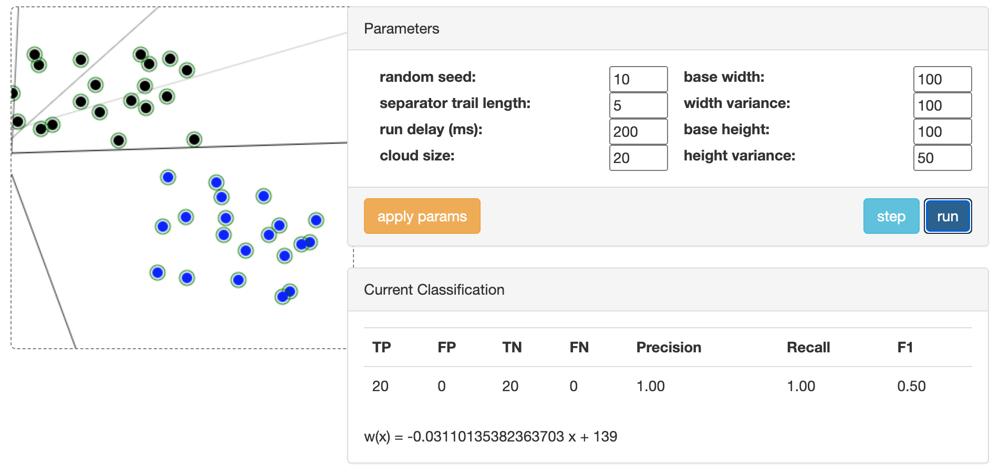
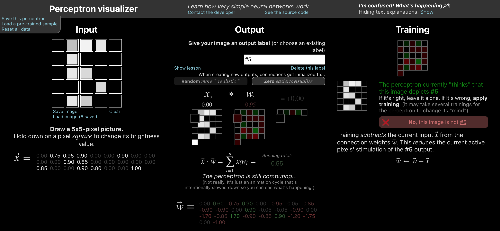
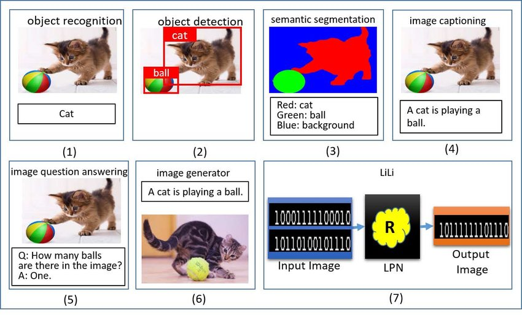
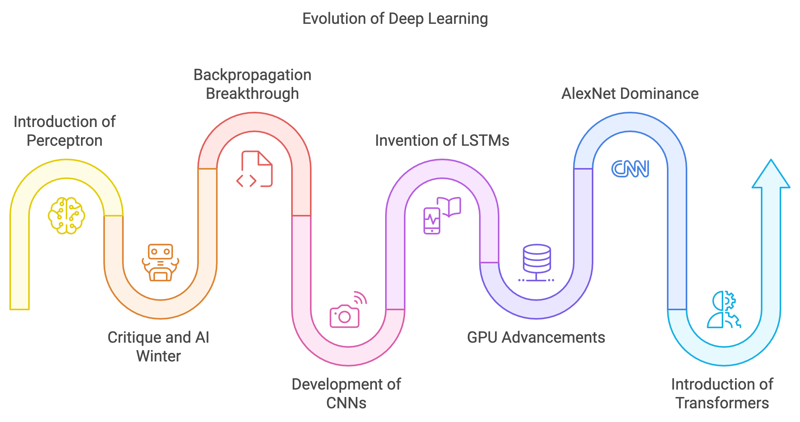
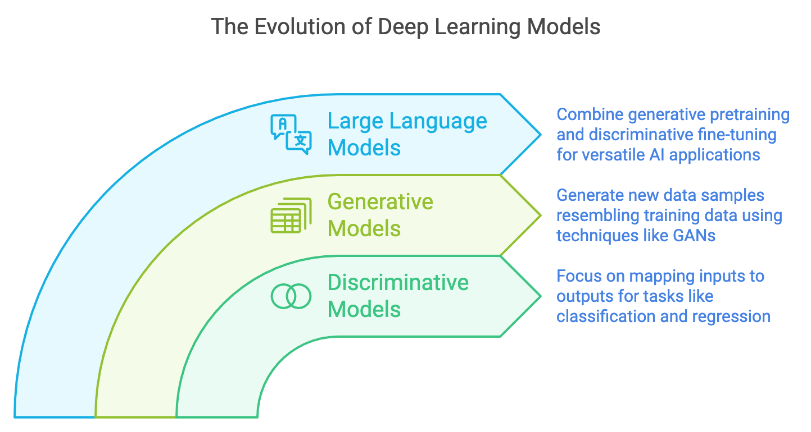

> **Note:**
**"*The ability of machines to extract knowledge from vast amounts of data using layered neural networks represents one of the greatest achievements of human ingenuity. It mirrors the structure of our own brains, opening pathways to unprecedented innovation and understanding.*" — Inspired by Turing Award Winners Yoshua Bengio, Geoffrey Hinton, and Yann LeCun.**

> **Note:**
*Chapter 1 of DLVR serves as the gateway to understanding deep learning, establishing a robust foundation that bridges beginners and advanced learners. It begins by defining deep learning, emphasizing its essence as the ability of neural networks to hierarchically extract meaningful patterns from data. The chapter traces the historical evolution of deep learning, from early perceptrons to revolutionary architectures like Transformers, showcasing how advancements in algorithms and hardware fueled this growth. It explores the core concepts of neural networks, introducing the mathematical principles that drive these models, such as tensors, gradients, and optimization. With practical examples and Rust implementations, the chapter demonstrates how Rust's safety, efficiency, and robust library ecosystem make it a compelling choice for deep learning development. By combining theoretical insights, historical context, and hands-on examples, Chapter 1 sets the stage for the deeper explorations to come.*

# 1.1. What is Deep Learning

Deep learning is a revolutionary domain within Artificial Intelligence (AI) that leverages multi-layered neural networks to uncover and model complex, non-linear relationships in data. At its core lies the mathematical abstraction of *tensors*—multi-dimensional arrays that generalize vectors and matrices to represent structured data. Tensors serve as the foundational building blocks of deep learning, enabling efficient encoding of diverse data modalities like images and text in formats optimized for computational learning. For images, tensors are represented as three-dimensional structures, with dimensions capturing height, width, and color channels (e.g., RGB), allowing convolutional neural networks (CNNs) to detect spatial patterns such as edges, textures, and shapes. In the realm of text, tensors encode sequences through embeddings, where words or subwords are mapped into fixed-length vectors that capture semantic relationships, further structured as sequential tensors for modeling with recurrent neural networks (RNNs) or Transformers. This structured tensor-based approach empowers neural networks to interpret and process intricate patterns across various data types, enabling deep learning models to achieve remarkable precision in solving real-world problems in domains like computer vision, natural language processing, and beyond.


**Figure 1:** Deep learning technology scopes from tensor representation, vision to NLP.

In essence, deep learning can be viewed as an advanced form of function approximation. A trained neural network acts as a highly flexible and expressive function, capable of mapping inputs to outputs in complex and often non-linear ways. Central to this capability is the use of tensors, which provide structured representations of raw data, and the network’s ability to recognize patterns within these tensors through hierarchical learning. For instance, in image classification, raw pixel values are organized into a tensor that encodes the spatial and color information of the image. The network begins by identifying simple patterns, such as edges or gradients, in the initial layers, using filters in convolutional layers to detect directional changes in pixel intensity. As data flows through deeper layers, these basic patterns are combined into increasingly complex structures, such as shapes, textures, and eventually objects like "cat" or "dog." This progressive refinement allows the network to extract task-specific features, transforming high-dimensional data into meaningful representations. Similarly, for sequential data like text, patterns in word usage or syntax are captured by embedding tensors and advanced architectures like RNNs or Transformers, which focus on context and relationships across sequences. This ability to detect, combine, and abstract patterns from tensors is what empowers deep learning models to understand and generate insights from vast and varied data, mirroring human perception while unlocking transformative applications.


**Figure 2:** Deep learning model is like high dimensional function approximator $f(x)$ where $x$ is image.

Similarly, in natural language processing (NLP), deep learning transforms raw text into structured, meaningful representations by capturing patterns and relationships within linguistic data. At its core, this process mirrors how humans learn language—starting from recognizing individual words and their meanings, akin to the initial layers of a neural network, and progressing to understanding complex sentence structures, context, and subtleties in deeper layers. Neural networks begin by encoding text as tensors, often using word embeddings that map words into dense vector spaces where semantic similarities are preserved. These embeddings capture basic patterns, such as synonyms or frequently co-occurring words, which are then refined through layers that model syntax, grammar, and even long-term dependencies in sentences. Advanced architectures like Transformers further enable the network to focus on context at scale, attending to relationships between words across entire paragraphs or documents. This hierarchical learning allows models to excel in tasks like translation, summarization, and question answering, where nuanced understanding and generation of language are crucial. By systematically uncovering patterns in textual data, deep learning systems revolutionize the way machines process, interpret, and generate human language, unlocking capabilities that bridge communication gaps and drive innovation in NLP.


**Figure 3:** Data processing lifecycle from raw to task-specific representations (Vision or NLP or Multimodality).

The mathematical foundation of deep learning begins with the perceptron, introduced by Frank Rosenblatt in 1958, which represents the simplest form of a neural network. The perceptron is a binary classifier that maps an input vector $\mathbf{x} = [x_1, x_2, \dots, x_n]$ to an output $y$ by computing a weighted sum of its inputs and applying an activation function. Mathematically, the perceptron is expressed as:

$ y = f\left(\sum_{i=1}^{n} w_i x_i + b\right), $

where $\mathbf{w} = [w_1, w_2, \dots, w_n]$ are the learnable weights, $b$ is the bias term, and $f$ is the activation function. In its original form, the perceptron used a step activation function defined as:

$ f(z) = \begin{cases} 1 & \text{if } z \geq 0, \\ 0 & \text{if } z < 0, \end{cases} $

where $z = \sum_{i=1}^{n} w_i x_i + b$. The perceptron outputs 1 if the weighted sum of its inputs exceeds a threshold (set implicitly by the bias term) and 0 otherwise.


**Figure 4:** Illustration of perceptron learning algorithm (ref: <a href="https://tamas.xyz/perceptron-demo/app/">https://tamas.xyz/perceptron-demo/app</a>).

The perceptron learning algorithm (PLA) is a foundational supervised learning technique for binary classification that intuitively represents a linear separator in 2D data. The single perceptron models a straight line that divides the input space into two regions, corresponding to the two classes. It begins by initializing weights to zero or small random values and iteratively adjusts them based on the difference between the actual and desired outputs for each training example. The perceptron computes the weighted sum of inputs, applies a step activation function, and updates its weights by adding the product of the learning rate, the error term (the difference between the target and predicted output), and the input feature. This adjustment shifts the separating line to better classify the data. When the data is linearly separable, the perceptron eventually converges, perfectly dividing the two classes with a straight line.

The PLA adjusts the weights and bias to minimize classification errors on a training dataset. For a given dataset $\{(\mathbf{x}^{(i)}, y^{(i)})\}_{i=1}^m$, where $\mathbf{x}^{(i)}$ is the input vector and $y^{(i)}$ is the target label, the learning algorithm follows these steps:

- Initialization: Initialize the weights $\mathbf{w}$ and bias $b$ to small random values (often zero).
- Prediction: For each training sample, compute the output $\hat{y}^{(i)} = f\left(\sum_{j=1}^n w_j x_j^{(i)} + b\right)$.
- Update Rule: If the prediction $\hat{y}^{(i)}$ does not match the target $y^{(i)}$, update the weights and bias as follows: $w_j \leftarrow w_j + \eta \left(y^{(i)} - \hat{y}^{(i)}\right)x_j^{(i)}, \quad b \leftarrow b + \eta \left(y^{(i)} - \hat{y}^{(i)}\right)$, where $\eta$ is the learning rate, a small positive scalar that controls the magnitude of updates.
- Repeat: Iterate over the dataset until all samples are classified correctly or a maximum number of iterations is reached.

This Rust program demonstrates the implementation of the PLA, a foundational binary classification technique, applied to a synthetic 2D dataset. The dataset consists of randomly generated points, linearly separated into two classes based on a simple condition. The perceptron adjusts its weights and bias iteratively to identify the optimal decision boundary that separates the two classes. Leveraging the `tch` crate for numerical operations and the `plotters` crate for visualization, the program not only trains the perceptron but also visualizes the data points and the resulting decision boundary, providing an intuitive understanding of the learning process.

```toml
[dependencies]
rand = "0.8.5"
plotters = "0.3.7"
```
```rust
use rand::Rng;
use plotters::prelude::*;
use std::f64;

// Function to generate synthetic 2D dataset
fn generate_data(n_samples: usize) -> (Vec<(f64, f64)>, Vec<i32>) {
    let mut rng = rand::thread_rng();
    let mut data = Vec::new();
    let mut labels = Vec::new();

    for _ in 0..n_samples {
        let x1: f64 = rng.gen_range(-1.0..1.0);
        let x2: f64 = rng.gen_range(-1.0..1.0);
        let label = if x1 + x2 > 0.0 { 1 } else { -1 }; // Linearly separable condition
        data.push((x1, x2));
        labels.push(label);
    }

    (data, labels)
}

// Perceptron Learning Algorithm
fn perceptron_learning_algorithm(
    data: &[(f64, f64)],
    labels: &[i32],
    learning_rate: f64,
    max_iter: usize,
) -> (f64, f64, f64) {
    let mut w1 = 0.0;
    let mut w2 = 0.0;
    let mut b = 0.0;

    for _ in 0..max_iter {
        let mut converged = true;

        for (i, &(x1, x2)) in data.iter().enumerate() {
            let y = labels[i];
            let prediction = if w1 * x1 + w2 * x2 + b > 0.0 { 1 } else { -1 };

            if prediction != y {
                // Update weights and bias
                w1 += learning_rate * (y - prediction) as f64 * x1;
                w2 += learning_rate * (y - prediction) as f64 * x2;
                b += learning_rate * (y - prediction) as f64;
                converged = false;
            }
        }

        if converged {
            break;
        }
    }

    (w1, w2, b)
}

// Visualization of data and decision boundary using plotters
fn visualize(
    data: &[(f64, f64)],
    labels: &[i32],
    weights: (f64, f64, f64),
    filename: &str,
) {
    let (w1, w2, b) = weights;

    let root = BitMapBackend::new(filename, (800, 800)).into_drawing_area();
    root.fill(&WHITE).unwrap();

    let mut chart = ChartBuilder::on(&root)
        .caption("Perceptron Learning Algorithm", ("sans-serif", 30))
        .margin(10)
        .x_label_area_size(40)
        .y_label_area_size(40)
        .build_cartesian_2d(-1.5..1.5, -1.5..1.5)
        .unwrap();

    chart.configure_mesh().draw().unwrap();

    // Plot data points
    for (i, &(x1, x2)) in data.iter().enumerate() {
        let color = if labels[i] == 1 { &RED } else { &BLUE };
        chart.draw_series(PointSeries::of_element(
            [(x1, x2)],
            5,
            color,
            &|c, s, st| EmptyElement::at(c) + Circle::new((0, 0), s, st.filled()),
        )).unwrap();
    }

    // Plot decision boundary
    let x_min = -1.5;
    let x_max = 1.5;
    let y_min = (-b - w1 * x_min) / w2;
    let y_max = (-b - w1 * x_max) / w2;

    chart
        .draw_series(LineSeries::new([(x_min, y_min), (x_max, y_max)], &BLACK))
        .unwrap();

    root.present().unwrap();
}

fn main() {
    let n_samples = 200;
    let (data, labels) = generate_data(n_samples);

    let learning_rate = 0.1;
    let max_iter = 1000;
    let weights = perceptron_learning_algorithm(&data, &labels, learning_rate, max_iter);

    println!("Learned weights: {:?}", weights);

    visualize(&data, &labels, weights, "perceptron_visualization.png");
}
```

The program generates a dataset of red and blue points representing the two classes and iteratively trains the perceptron to find a linear separator. After training, the learned weights and bias define a decision boundary, visualized as a straight line on the 2D plot. The resulting visualization shows how well the perceptron has classified the points, with the line dividing the red and blue points. If the dataset is linearly separable, the perceptron perfectly separates the points; otherwise, it minimizes classification errors. This visual output demonstrates the effectiveness of PLA in solving simple binary classification tasks while highlighting its reliance on linearly separable data.


**Figure 5:** Single perceptron represent single line in 2D dataset.

The perceptron algorithm, a foundational concept in machine learning, is designed to find a linear decision boundary that separates data into two distinct classes. This capability works effectively when the dataset is linearly separable, meaning that a straight line (in two dimensions) or a hyperplane (in higher dimensions) can partition the data without misclassification. The perceptron iteratively adjusts its weights based on classification errors, and for linearly separable datasets, it guarantees convergence to a set of weights that successfully separates the classes.

However, this linearity imposes a critical limitation: the perceptron cannot solve problems involving non-linearly separable datasets, where no single straight line or hyperplane can separate the data points into their respective classes. This limitation was famously demonstrated by Minsky and Papert in their analysis of the XOR problem. XOR, or "exclusive OR," represents a dataset where the outputs alternate between classes in a way that no single linear boundary can separate. For instance, in the 2D XOR dataset, points labeled as one class are diagonally opposed, requiring a non-linear boundary, such as a curve or multiple partitions, to separate them.

The reason for this limitation lies in the perceptron’s structure. As a single-layer model, it computes a weighted sum of its inputs and passes the result through a step function to make a binary decision. This process inherently creates a linear boundary, which is insufficient for capturing the more complex relationships present in non-linearly separable data.

The inability of the perceptron to handle non-linear problems highlighted the need for more powerful models. This led to the development of the *multi-layer perceptron* (MLP), which introduced one or more hidden layers between the input and output layers. These hidden layers use non-linear activation functions (e.g., sigmoid, ReLU) to enable the network to learn non-linear decision boundaries. By stacking layers of perceptrons, MLPs transform the input space into intermediate representations where non-linear patterns can be disentangled and linearly separable. This compositional structure allows MLPs to approximate complex functions, overcoming the limitations of the single-layer perceptron.

The analysis of the XOR problem and the limitations of the perceptron not only clarified the need for non-linear modeling but also catalyzed the evolution of modern neural networks, ultimately paving the way for the deep learning revolution. A *multi-layer perceptron* (MLP) addresses these limitations by introducing one or more hidden layers between the input and output layers, enabling the network to model complex, non-linear relationships in data. As demonstrated in the interactive animation at [perceptrondemo.com](https://perceptrondemo.com), the MLP processes input features through successive layers of interconnected nodes. Each node computes a weighted sum of its inputs and applies a non-linear activation function, allowing the network to learn intermediate representations of the data. These hidden layers enable the MLP to construct non-linear decision boundaries, making it capable of solving problems like XOR, where single-layer perceptrons fail. By iteratively adjusting weights, the MLP reshapes its decision boundaries to align with the data's true structure. This compositional architecture empowers MLPs to approximate any continuous function, establishing them as foundational building blocks for modern deep learning systems.


**Figure 6:** Illustration of Multi Layer Perceptron (MLP) model (ref: <a href="https://perceptrondemo.com">perceptrondemo.com</a>).

An MLP adds hidden layers between the input and output, with each layer composed of multiple perceptrons (neurons). Unlike the perceptron, MLPs replace the step activation function with differentiable non-linear functions such as the sigmoid, hyperbolic tangent (tanh), or rectified linear unit (ReLU): $\text{ReLU: } f(z) = \max(0, z)$. The architecture of an MLP with $L$ layers can be expressed as:

$ \mathbf{y} = f_L\left(\mathbf{W}_L f_{L-1}\left(\mathbf{W}_{L-1} \cdots f_1\left(\mathbf{W}_1 \mathbf{x} + \mathbf{b}_1\right) + \mathbf{b}_{L-1}\right) + \mathbf{b}_L\right), $

where $\mathbf{W}_i$ and $\mathbf{b}_i$ are the weights and biases of the $i$-th layer, and $f_i$ is the activation function for that layer. The inclusion of hidden layers allows MLPs to learn hierarchical and non-linear mappings, enabling them to model complex functions and classify non-linearly separable data.

MLPs are trained using the *backpropagation* algorithm, which calculates the gradient of a loss function (e.g., mean squared error or cross-entropy) with respect to the network's parameters. Using these gradients, weights and biases are updated through gradient descent or its variants (e.g., stochastic gradient descent). This iterative process adjusts the parameters to minimize the loss, effectively teaching the network to approximate the underlying function.

The perceptron model, while simple, is a fundamental concept in neural networks and serves as the building block for understanding more advanced architectures. It operates by creating a linear decision boundary, or a single line in the case of 2D datasets, to separate data into two classes based on features. This simplicity makes the perceptron an excellent starting point for exploring neural network mechanics, such as weighted inputs, activation functions, and iterative weight updates during training. However, its ability to model data is limited to cases where the data is linearly separable, as demonstrated by its failure to handle problems like XOR, where no straight line can adequately partition the data. These limitations inspired the development of multi-layer architectures, such as the MLP, which introduced hidden layers and non-linear activation functions, enabling the modeling of more complex patterns and relationships in high-dimensional data.

The TensorFlow Playground tool provides an intuitive, interactive way to explore and understand the perceptron and its extensions to multi-layer neural networks. This browser-based application allows users to experiment with 2D datasets and neural network architectures in real time. For example, when experimenting with a *single-hidden-layer single-perceptron*, users will observe that it represents a single separator line in the data space. Increasing the complexity by adding hidden layers and non-linear activation functions transforms the network into an MLP, allowing it to learn non-linear decision boundaries and solve problems that a single perceptron cannot. TensorFlow Playground also visualizes the learned weights and activations, providing valuable insights into how neural networks process and transform data at each layer. This interactive tool bridges the gap between theory and practice, making it easier for beginners and practitioners to grasp the mechanics and potential of neural networks.


**Figure 7:** Tensorflow playground tools to learn key concepts in multi-layer perceptron (MLP) model.

The MLP model, while foundational, has evolved in its interpretability and explainability due to advancements in AI research. Modern insights reveal that the layers of an MLP perform a hierarchical transformation of data, where each layer extracts increasingly abstract features. The initial layers capture basic patterns, such as edges or local correlations in data, while deeper layers combine these features into more complex structures that align closely with the task's objectives. Explainability tools, such as saliency maps, activation visualizations, and SHAP (Shapley Additive Explanations), have provided a window into understanding how individual neurons contribute to the final output, offering a more transparent view of the decision-making process. These methods help demystify the "black-box" nature of MLPs, showing how the network assigns importance to various inputs and how it represents learned concepts in its weight structure. Additionally, recent research emphasizes the importance of sparsity and modularity in weights, revealing that MLPs tend to adapt their internal representations to minimize redundancy, focusing computational resources on task-relevant features. This evolving understanding not only enhances trust in MLP models but also guides their design for improved fairness, robustness, and efficiency in real-world applications.

Deep learning extends the MLP concept by stacking more layers, giving rise to deep neural networks (DNNs). These networks are capable of hierarchical representation learning, where each layer learns to extract increasingly abstract features from the data. For instance, in an image classification task, early layers may detect edges and textures, intermediate layers identify shapes and objects, and the final layers perform high-level reasoning to classify the image.

From a theoretical standpoint, several principles underpin the power of deep learning. The universal approximation theorem states that a sufficiently large neural network with non-linear activation functions can approximate any continuous function to arbitrary precision, highlighting the expressive power of these models. However, this expressiveness comes with challenges related to generalization, optimization, and computational complexity. Concepts such as the Vapnik–Chervonenkis (VC) dimension provide a measure of a model's capacity and its ability to generalize to unseen data. The training process involves solving a non-convex optimization problem to minimize a loss function, such as mean squared error or cross-entropy. Although the optimization landscape is non-convex, techniques like stochastic gradient descent (SGD) effectively navigate these challenges, often leveraging insights from convex optimization.

Deep learning excels in computer vision by leveraging convolutional neural networks (CNNs) to analyze large datasets and extract complex patterns, enabling a wide array of tasks. Object recognition (1) identifies and classifies individual objects within an image, while object detection (2) extends this by localizing objects with bounding boxes. Semantic segmentation (3) classifies each pixel into a predefined category, facilitating detailed scene understanding, such as in autonomous driving. Moving further, tasks like image captioning (4) generate natural language descriptions of an image's content, while visual question answering (VQA) (5) combines vision and language to answer questions about an image. Deep generative models power image generation (6), creating new images from text descriptions or samples, while data concept logic explores high-level logical patterns from datasets (7). These applications demonstrate the transformative role of deep learning in advancing computer vision across diverse fields, from healthcare to autonomous systems.


**Figure 8:** Common computer vision tasks using Deep Learning models.

In Natural Language Processing (NLP, the figure below illustrates a comprehensive range of tasks that leverage deep learning to process, understand, and generate human language. Text preprocessing forms the foundation by handling tasks like part-of-speech tagging, grammatical error correction, word sense disambiguation, and coreference resolution. Classification tasks include text classification and sentiment analysis, where models categorize texts or determine emotions. Information retrieval and document ranking focus on sentence/document similarity and question answering to locate relevant information or respond to queries. Text-to-text generation encompasses tasks like machine translation, summarization, simplification, and text generation, transforming or simplifying textual content. Knowledge extraction involves named entity recognition, relation extraction, and prediction to identify and link entities or infer relationships. Text reasoning supports advanced applications like common sense reasoning, natural language inference, and stance detection, often used in tasks like fake news and hate speech detection. Chatbots and conversational agents tackle intent detection and slot filling, aiding interactive and dynamic systems. Finally, text-to-data tasks, including speech-to-text, text-to-image, and vice versa, expand NLP applications to multi-modal domains, combining textual and non-textual data for a variety of real-world use cases. These tasks collectively highlight the versatility and depth of deep learning in advancing NLP solutions.


**Figure 9:** Common NLP tasks using Deep Learning models.

To demonstrate deep learning practically, consider implementing an MLP model using Rust's `tch` library and synthetic dataset like in Tensorflow playground. Rust offers a unique combination of performance and safety, making it an excellent choice for high-performance machine learning. Here, we can create an MLP to classify circular separable data. The model consists of a single linear layer followed by a step or RELU activation function. Using `tch`, tensors represent the input data and weights, while gradient descent updates the parameters during training. This hands-on approach demonstrates how fundamental mathematical principles translate into actionable implementations in deep learning.


**Figure 10:** MLP model using 6 hidden layers network with ReLU activations and circular pattern data.

The `tch` crate is a Rust library that provides bindings to the PyTorch C++ library, enabling efficient tensor computations and deep learning model development in Rust. It supports GPU acceleration via CUDA, making it a powerful choice for high-performance machine learning tasks. The crate includes features for creating and manipulating tensors, defining neural networks, applying optimizers, and performing various operations such as matrix multiplications. In the following code, we leverage `tch` to implement an MLP based on playground design and train it on a synthetic 2D dataset, demonstrating its ability to classify circularly separable data patterns. The `tch` crate enables this with a Python-like API, making it accessible to users familiar with PyTorch.

```toml
[dependencies]
tch = "0.12.0"
rand = "0.8.5"
plotters = "0.3.7"
ndarray = "0.16.1"
ndarray-rand = "0.15.0"
```
```rust
use plotters::prelude::*;
use rand::Rng;
use tch::{nn, nn::OptimizerConfig, Device, Kind, Tensor};
use tch::nn::ModuleT;

fn main() -> anyhow::Result<()> {
    // 1. Generate 2D synthetic datasets with circular pattern
    let n_samples = 1000;
    let mut rng = rand::thread_rng();
    let mut data = Vec::new();
    let mut labels = Vec::new();

    for _ in 0..n_samples {
        let r = rng.gen_range(0.0..2.0);
        let theta = rng.gen_range(0.0..(2.0 * std::f64::consts::PI));
        let x = r * theta.cos();
        let y = r * theta.sin();
        data.push([x, y]);
        labels.push(if r < 1.0 { 0 } else { 1 });
    }

    let data: Tensor = Tensor::of_slice2(&data)
        .to_kind(Kind::Float)
        .to_device(Device::Cpu);
    let labels: Tensor = Tensor::of_slice(&labels)
        .to_kind(Kind::Int64)
        .to_device(Device::Cpu);

    // 2. Define Multi-Layer Perceptron with 6 hidden layers (8 neurons each)
    let vs = nn::VarStore::new(Device::Cpu);
    let net = nn::seq()
        .add(nn::linear(&vs.root(), 2, 8, Default::default()))
        .add_fn(|x| x.relu())
        .add(nn::linear(&vs.root(), 8, 8, Default::default()))
        .add_fn(|x| x.relu())
        .add(nn::linear(&vs.root(), 8, 8, Default::default()))
        .add_fn(|x| x.relu())
        .add(nn::linear(&vs.root(), 8, 8, Default::default()))
        .add_fn(|x| x.relu())
        .add(nn::linear(&vs.root(), 8, 8, Default::default()))
        .add_fn(|x| x.relu())
        .add(nn::linear(&vs.root(), 8, 2, Default::default()));

    // 3. Train the model using Adam optimizer
    let mut opt = nn::Adam::default().build(&vs, 1e-3).unwrap();

    for epoch in 1..=500 {
        let preds = net.forward_t(&data, true);
        let loss = preds.cross_entropy_for_logits(&labels);
        opt.backward_step(&loss);

        if epoch % 50 == 0 {
            println!("Epoch: {}, Loss: {:.4}", epoch, loss.double_value(&[]));
        }
    }

    // 4. Evaluate and visualize the results
    let preds = net.forward_t(&data, false).argmax(1, false);
    let accuracy = preds.eq_tensor(&labels).to_kind(Kind::Float).mean(Kind::Float);
    println!("Accuracy: {:.2}%", accuracy.double_value(&[]) * 100.0);

    // Visualization setup
    let root = BitMapBackend::new("classification_visualization.png", (800, 800)).into_drawing_area();
    root.fill(&WHITE)?;

    let mut chart = ChartBuilder::on(&root)
        .margin(5)
        .caption("MLP Classification and Predictions", ("sans-serif", 30))
        .x_label_area_size(30)
        .y_label_area_size(30)
        .build_cartesian_2d(-2.5..2.5, -2.5..2.5)?;

    chart.configure_mesh().draw()?;

    // Plot decision boundary
    let resolution = 200;
    let mut grid_data = vec![];
    for i in 0..resolution {
        for j in 0..resolution {
            let x = -2.5 + 5.0 * (i as f64) / (resolution as f64);
            let y = -2.5 + 5.0 * (j as f64) / (resolution as f64);
            grid_data.push([x, y]);
        }
    }

    let grid_tensor: Tensor = Tensor::of_slice2(&grid_data)
        .to_kind(Kind::Float)
        .to_device(Device::Cpu);
    let grid_preds = net.forward_t(&grid_tensor, false).argmax(1, false);

    let grid_points: Vec<(f64, f64, u8)> = grid_data
        .iter()
        .zip(grid_preds.iter::<i64>().unwrap())
        .map(|(coords, label)| (coords[0], coords[1], label as u8))
        .collect();

    chart.draw_series(
        grid_points.iter().map(|(x, y, label)| {
            let color = if *label == 0 { &BLUE.mix(0.2) } else { &RED.mix(0.2) };
            Circle::new((*x, *y), 1, color.filled())
        }),
    )?;

    // Plot original data points
    let data_points: Vec<((f64, f64), i64)> = data
        .to_kind(Kind::Double)
        .chunk(2, 1)
        .iter()
        .zip(labels.iter::<i64>().unwrap())
        .map(|(coords, label)| {
            let x = coords.double_value(&[0]);
            let y = coords.double_value(&[1]);
            ((x, y), label)
        })
        .collect();

    chart.draw_series(
        data_points
            .iter()
            .filter(|(_, label)| *label == 0)
            .map(|((x, y), _)| Circle::new((*x, *y), 3, BLUE.filled())),
    )?;

    chart.draw_series(
        data_points
            .iter()
            .filter(|(_, label)| *label == 1)
            .map(|((x, y), _)| Circle::new((*x, *y), 3, RED.filled())),
    )?;

    root.present()?;
    println!("Visualization saved to classification_visualization.png");

    Ok(())
}
```

The code begins by generating a synthetic dataset, where two circularly separable classes are constructed using polar coordinates. Each point is classified based on whether it lies inside or outside a unit circle. Using the `tch` crate, a multi-layer perceptron (MLP) is defined with six hidden layers, each containing eight neurons activated by the ReLU function. The network is trained using the Adam optimizer to minimize the cross-entropy loss, a common objective for classification tasks. Once trained, the model's performance is evaluated by calculating its accuracy on the training dataset. For visualization, the decision boundary is generated by passing a grid of 2D points through the model and visualizing their predicted classes. Both the decision boundary and the original data points, colored by their true labels, are plotted using the `plotters` crate. This creates an intuitive representation of how well the neural network separates the two classes. Running the code and viewing the plot will provide a clear demonstration of the model's classification capability and the visual representation of the learned decision boundary.

In summary, deep learning is built on a robust mathematical foundation and extends these ideas into powerful, scalable frameworks capable of solving real-world problems. The transition from perceptrons to multi-layer neural networks demonstrates the evolution of representational power, while theoretical insights such as the universal approximation theorem and optimization principles underpin their effectiveness. Practical implementations, combined with the computational efficiency of modern programming tools like Rust, make deep learning an indispensable tool in AI and beyond.

# 1.2. Historical Journey of Deep Learning Models

The historical journey of deep learning is a comprehensive tapestry of breakthroughs in mathematics, computational science, and technological ingenuity, evolving over decades. It began in 1958 with Frank Rosenblatt's introduction of the perceptron, a simple computational model mimicking biological neurons. The perceptron mathematically formalized the process of taking weighted inputs, applying a bias, and computing an output using a step function. However, its inability to solve non-linear problems, as highlighted in Marvin Minsky and Seymour Papert's 1969 critique, led to skepticism about neural networks, ushering in the first "AI winter." This stagnation persisted until the 1980s when backpropagation, introduced by David Rumelhart, Geoffrey Hinton, and Ronald Williams, revolutionized neural networks by enabling efficient gradient computation for multi-layer networks. This breakthrough, based on the chain rule of calculus, breathed new life into deep learning, establishing multi-layer perceptrons (MLPs) as practical tools for solving complex tasks.

In the 1990s, Yann LeCun's development of convolutional neural networks (CNNs) marked a significant leap in computer vision. LeNet demonstrated the power of convolutional layers for capturing spatial hierarchies in image data, paving the way for applications in handwritten digit recognition, image classification, and beyond. Concurrently, recurrent neural networks (RNNs) gained prominence for processing sequential data, but their effectiveness was hampered by vanishing gradients. This limitation was resolved in 1997 with the invention of long short-term memory networks (LSTMs) by Sepp Hochreiter and Jürgen Schmidhuber, enabling robust modeling of long-term dependencies in tasks such as language processing and speech recognition.


**Figure 11:** Key milestones in deep learning history.

The 2000s saw the confluence of algorithmic advancements and hardware evolution, with NVIDIA's GPUs emerging as the catalyst for modern deep learning. Initially designed for graphics rendering, GPUs excelled in parallelized matrix computations essential for neural networks. NVIDIA's CUDA platform, introduced in 2006, allowed researchers to leverage GPUs for general-purpose computing, drastically reducing training times for deep models. This period culminated in 2012 with AlexNet, a CNN architecture that utilized GPUs to dominate the ImageNet competition, outperforming traditional machine learning methods and establishing deep learning as a transformative force in AI.

The deep learning landscape transformed further in 2017 with the introduction of the Transformer architecture by Vaswani et al. Replacing RNNs and LSTMs with self-attention mechanisms, Transformers revolutionized natural language processing (NLP) by enabling parallel processing of entire sequences. This innovation gave rise to models like BERT, which excelled in contextual understanding, and OpenAI’s GPT series, epitomized by GPT-3 in 2020 with its 175 billion parameters. GPT-3 showcased the vast potential of large language models (LLMs) in tasks ranging from creative writing to complex reasoning, redefining human-computer interaction across industries.

NVIDIA's GPU advancements, such as Tensor Cores and mixed-precision training, further accelerated the training of LLMs, empowering models like GPT-3 and its successors. These models have since revolutionized industries by enabling applications in automated assistants, content generation, advanced analytics, and more. The impact of LLMs extends to healthcare, where they analyze medical data and aid drug discovery, and to finance, where they enhance fraud detection and trading strategies. Meanwhile, generative models are reshaping creative fields through AI-generated art, music, and interactive experiences.


**Figure 12:** Important achievements in the evolution of deep learning.

Despite these achievements, challenges persist. Training LLMs demands substantial computational resources, raising concerns about energy consumption and sustainability. Ethical considerations, including biases in model outputs and potential misuse, underscore the need for robust governance and responsible AI development. The journey from perceptrons to LLMs highlights the interplay between theoretical breakthroughs, architectural innovations, and computational advances, with each milestone building upon its predecessors.

Tracing this journey—from the perceptron (1958) to backpropagation (1986), CNNs (1990s), LSTMs (1997), AlexNet (2012), Transformers (2017), and GPT-3 (2020)—reveals how deep learning evolved into a cornerstone of modern AI. These milestones demonstrate how collaboration, persistence, and technological progress have transformed neural networks into tools that not only solve complex problems but also redefine industries and societal possibilities.

# 1.3. Core Concepts and Principles of Deep Learning

Deep learning rests on a robust mathematical foundation that enables neural networks to model complex, non-linear patterns in data. At its core, deep learning leverages the concept of linear combinations of weights and biases to transform input data into outputs, layer by layer. This transformation is expressed mathematically as: $z = \mathbf{W} \mathbf{x} + \mathbf{b}$, where $\mathbf{x}$ is the input vector, $\mathbf{W}$ is the weight matrix, $\mathbf{b}$ is the bias vector, and $z$ is the resulting output. Each layer applies such transformations to extract features from the data. While this operation alone captures linear relationships, it is insufficient for modeling the non-linear complexities of real-world problems. The introduction of non-linearity via activation functions enables neural networks to approximate arbitrary functions and model highly intricate patterns.


**Figure 13:** Development cycle of deep learning model from raw data.

Activation functions are mathematical operations applied element-wise to the outputs of a layer, introducing the ability to represent non-linear mappings. The Rectified Linear Unit (ReLU), defined as $f(z) = \max(0, z)$, is widely used due to its simplicity and efficiency. ReLU activates only positive values, leading to sparsity in the network’s activations, which reduces computational overhead. Other activation functions, such as the Sigmoid and Tanh, are also fundamental. The sigmoid function, $f(z) = \frac{1}{1 + e^{-z}}$, maps inputs to the range \[0, 1\], making it suitable for probabilistic outputs, though it suffers from vanishing gradients for large or small values of $z$. The tanh function, $f(z) = \frac{e^z - e^{-z}}{e^z + e^{-z}}$, maps inputs to \[-1, 1\] and is often preferred in scenarios requiring zero-centered outputs. These activation functions, by enabling non-linear transformations, are integral to the deep learning process.

The training of neural networks centers around the optimization of a loss function, which quantifies the error between the network’s predictions and the true targets. Loss functions are chosen based on the task at hand. For instance, in regression tasks, the mean squared error (MSE) is commonly used, while in classification tasks, the cross-entropy loss is the standard. The process of training involves minimizing this loss function using gradient-based optimization techniques, most notably gradient descent. Gradient descent updates the network’s parameters by calculating the gradient of the loss with respect to the weights and biases:

$\theta \leftarrow \theta - \eta \nabla_\theta \mathcal{L}, $

where $\theta$ represents the parameters, $\eta$ is the learning rate, and $\nabla_\theta \mathcal{L}$ is the gradient of the loss function $\mathcal{L}$. This iterative update process drives the network toward a configuration that minimizes the loss. While traditional gradient descent requires the entire dataset to compute updates, stochastic gradient descent (SGD) introduces randomness by computing updates based on small batches of data, striking a balance between computational efficiency and convergence stability.

The ability of neural networks to learn hierarchical representations stems from their layered structure, where each layer captures progressively abstract features. For example, in an image classification task, the first layer might detect edges, the second layer combines these edges to recognize shapes, and deeper layers assemble these shapes into higher-level concepts such as objects. This progression is mathematically represented by composing multiple linear and non-linear transformations:

$ \mathbf{h}^{(l)} = f\left(\mathbf{W}^{(l)} \mathbf{h}^{(l-1)} + \mathbf{b}^{(l)}\right), $

where $\mathbf{h}^{(l-1)}$ is the input to the $l$-th layer, $\mathbf{W}^{(l)}$ and $\mathbf{b}^{(l)}$ are the weights and biases of the $l$-th layer, and $f$ is the activation function. The architecture of a neural network—encompassing the number of layers, the size of each layer, and the types of layers—determines its capacity to learn and generalize. Larger and deeper networks have greater representational power but also risk overfitting, a challenge that can be addressed through regularization techniques like weight decay and dropout.

Training a neural network involves several key concepts. Parameters, such as weights and biases, are the elements that the model learns during training. Hyperparameters, such as learning rate, batch size, and the number of epochs, are manually tuned settings that govern the training process. An epoch represents one complete pass through the training dataset, while an iteration refers to a single update of the model’s parameters. These concepts are essential for understanding how neural networks learn and how to optimize their performance.

The mathematical and conceptual foundations of deep learning come to life when implemented practically. Building a simple neural network using Rust’s `tch` library provides an excellent demonstration of these principles. For example, a minimal network can consist of a single linear layer followed by a ReLU activation function. The training process involves computing the loss, calculating gradients via backpropagation, and updating weights using gradient descent. By visualizing the weights and loss values during training, one can observe how the network evolves to minimize errors and improve predictions.

The learning dynamics of neural networks are deeply tied to the flow of gradients through their layers. Gradients indicate the sensitivity of the loss to each parameter and guide the optimization process. In practice, challenges such as vanishing or exploding gradients can impede training, particularly in very deep networks. Techniques like batch normalization and residual connections have been developed to address these issues, ensuring stable gradient flow and faster convergence. Visualization tools, such as heatmaps of gradients or plots of loss curves, provide invaluable insights into the network’s learning behavior, helping practitioners diagnose and resolve training challenges.

This Rust program demonstrates the use of deep learning and data visualization techniques. It creates a synthetic 2D dataset with a circular pattern and trains an MLP model using the `tch` crate, which is a wrapper for PyTorch. The code also employs the `plotters` crate for visualizing the training process, including a loss curve and a heatmap of gradients. By integrating neural network training with effective visualization, the program showcases the learning behavior and optimization dynamics of a deep learning model.

```toml
[dependencies]
tch = "0.12.0"
rand = "0.8.5"
plotters = "0.3.7"
```
```rust
use plotters::prelude::*;
use rand::Rng;
use tch::{nn, nn::OptimizerConfig, Device, Kind, Tensor};
use tch::nn::ModuleT;

fn main() -> anyhow::Result<()> {
    // Generate 2D synthetic datasets with circular pattern
    let n_samples = 1000;
    let mut rng = rand::thread_rng();
    let mut data = Vec::new();
    let mut labels = Vec::new();

    for _ in 0..n_samples {
        let r = rng.gen_range(0.0..2.0);
        let theta = rng.gen_range(0.0..(2.0 * std::f64::consts::PI));
        let x = r * theta.cos();
        let y = r * theta.sin();
        data.push([x, y]);
        labels.push(if r < 1.0 { 0 } else { 1 });
    }

    let data: Tensor = Tensor::of_slice2(&data)
        .to_kind(Kind::Float)
        .to_device(Device::Cpu);
    let labels: Tensor = Tensor::of_slice(&labels)
        .to_kind(Kind::Int64)
        .to_device(Device::Cpu);

    // Define Multi-Layer Perceptron with 6 hidden layers (8 neurons each)
    let vs = nn::VarStore::new(Device::Cpu);
    let net = nn::seq()
        .add(nn::linear(&vs.root(), 2, 8, Default::default()))
        .add_fn(|x| x.relu())
        .add(nn::linear(&vs.root(), 8, 8, Default::default()))
        .add_fn(|x| x.relu())
        .add(nn::linear(&vs.root(), 8, 8, Default::default()))
        .add_fn(|x| x.relu())
        .add(nn::linear(&vs.root(), 8, 8, Default::default()))
        .add_fn(|x| x.relu())
        .add(nn::linear(&vs.root(), 8, 8, Default::default()))
        .add_fn(|x| x.relu())
        .add(nn::linear(&vs.root(), 8, 2, Default::default()));

    // Train the model using Adam optimizer
    let mut opt = nn::Adam::default().build(&vs, 1e-3).unwrap();
    let mut loss_history = vec![];

    for epoch in 1..=2000 {
        let preds = net.forward_t(&data, true);
        let loss = preds.cross_entropy_for_logits(&labels);
        opt.backward_step(&loss);

        // Store loss for visualization
        loss_history.push(loss.double_value(&[]));

        // Print progress every 50 epochs
        if epoch % 50 == 0 {
            println!("Epoch: {}, Loss: {:.4}", epoch, loss.double_value(&[]));
        }
    }

    // Visualize loss curve
    plot_loss_curve("loss_curve.png", &loss_history)?;

    // Visualize heatmap of gradients
    let grads = visualize_gradients(&vs)?;
    plot_gradients("gradient_heatmap.png", grads)?;

    Ok(())
}

fn plot_loss_curve(filename: &str, loss_history: &[f64]) -> anyhow::Result<()> {
    let root = BitMapBackend::new(filename, (800, 600)).into_drawing_area();
    root.fill(&WHITE)?;

    let max_loss = *loss_history.iter().max_by(|a, b| a.partial_cmp(b).unwrap()).unwrap();
    let mut chart = ChartBuilder::on(&root)
        .caption("Training Loss Curve", ("sans-serif", 30))
        .margin(10)
        .x_label_area_size(30)
        .y_label_area_size(40)
        .build_cartesian_2d(0..loss_history.len(), 0.0..max_loss)?;

    chart.configure_mesh().draw()?;

    chart.draw_series(LineSeries::new(
        loss_history.iter().enumerate().map(|(x, &y)| (x, y)),
        &BLUE,
    ))?;

    root.present()?;
    println!("Loss curve saved to {}", filename);
    Ok(())
}

fn visualize_gradients(vs: &nn::VarStore) -> Result<Tensor, tch::TchError> {
    // Extract gradients from all parameters
    let grads: Vec<Tensor> = vs
        .variables()
        .values()
        .map(|var| {
            let grad = var.grad();
            if grad.numel() == 0 {
                Tensor::zeros_like(var)
            } else {
                grad
            }
        })
        .collect();

    // Concatenate gradients into a single tensor for visualization
    let flattened_grads = Tensor::cat(&grads.iter().map(|g| g.view(-1)).collect::<Vec<_>>(), 0);
    Ok(flattened_grads)
}

fn plot_gradients(filename: &str, gradients: Tensor) -> anyhow::Result<()> {
    // Extract gradient data as a Vec<f32>
    let tensor = gradients.abs().to_kind(Kind::Float).view([-1]);
    let numel = tensor.size()[0] as usize;
    let gradient_data: Vec<f32> = (0..numel)
        .map(|i| tensor.double_value(&[i as i64]) as f32)
        .collect();

    // Find the maximum gradient value
    let max_grad = gradient_data.iter().cloned().fold(0.0_f32, f32::max);

    // Set up the plot
    let root = BitMapBackend::new(filename, (800, 600)).into_drawing_area();
    root.fill(&WHITE)?;

    let mut chart = ChartBuilder::on(&root)
        .caption("Gradient Heatmap", ("sans-serif", 30))
        .margin(10)
        .x_label_area_size(30)
        .y_label_area_size(40)
        .build_cartesian_2d(0..gradient_data.len(), 0.0..max_grad as f64)?;

    chart.configure_mesh().draw()?;

    // Plot the gradient data as a line series
    chart.draw_series(LineSeries::new(
        gradient_data.iter().enumerate().map(|(x, &y)| (x, y as f64)),
        &RED,
    ))?;

    root.present()?;
    println!("Gradient heatmap saved to {}", filename);
    Ok(())
}
```

The program first generates a synthetic dataset with two circularly separable classes. This data is transformed into tensors and used to train an MLP with six hidden layers, each containing eight neurons and ReLU activation. The model is trained using the Adam optimizer to minimize cross-entropy loss over 2000 epochs. During training, the loss values are recorded for visualization. The `plot_loss_curve` function plots the loss curve, illustrating the convergence of the model. Additionally, the gradients of the network’s parameters are extracted using `visualize_gradients` and plotted as a heatmap using `plot_gradients`. These visualizations provide insights into the model's training dynamics and the magnitude of parameter updates, helping users analyze the learning process effectively.


**Figure 14:** The training loss curve of a simple MLP model plotted using Rust crate plotters.

In summary, the core concepts and principles of deep learning—linear transformations, activation functions, loss functions, and hierarchical feature learning—are the foundation of its ability to model complex data. These principles, supported by robust mathematical theories and practical implementations, enable neural networks to excel in diverse tasks across industries. The interplay between theory and practice continues to drive advancements in the field, making deep learning one of the most transformative technologies of our time. By mastering these concepts, practitioners can unlock the full potential of neural networks, pushing the boundaries of artificial intelligence.

# 1.4. Key Mathematical Foundations for Deep Learning

Deep learning stands at the intersection of theory and practice, built upon a robust foundation of mathematical disciplines. From linear algebra to calculus, probability, and optimization, these mathematical tools provide the precision and rigor required to design, implement, and train neural networks. A deep understanding of these foundations is essential not only for grasping how deep learning models work but also for pushing the boundaries of what they can achieve. This section explores these mathematical concepts in detail, emphasizing their significance, theoretical underpinnings, and practical applications in deep learning.

Linear algebra forms the backbone of deep learning, serving as the mathematical framework for representing and manipulating data. In neural networks, data is represented as tensors, which are multi-dimensional generalizations of vectors and matrices. These tensors flow through the network, undergoing transformations at each layer.

Central operations in neural networks, such as dot products and matrix multiplications, are linear algebra operations. For example, the computation $z = \mathbf{W} \mathbf{x} + \mathbf{b}$, where $\mathbf{W}$ is a weight matrix, $\mathbf{x}$ is an input vector, and $\mathbf{b}$ is a bias vector, represents a linear transformation of the input. This operation projects the input into a new space, capturing relationships encoded in the weights.

Beyond these basics, advanced concepts like eigenvalues and eigenvectors are critical for understanding transformations in deep learning. Eigenvalues describe how data is stretched or compressed by a transformation, while eigenvectors indicate the directions of this scaling. These ideas underpin techniques such as principal component analysis (PCA) for dimensionality reduction and play a role in understanding the stability and expressiveness of network architectures.

While linear algebra provides the structure, calculus powers the learning process in neural networks. Calculus allows us to compute the rate of change of a function, which is critical for optimizing the network’s parameters. Gradients, the derivatives of the loss function with respect to the model parameters, measure how small changes in parameters affect the output. This information is used to guide the network toward a configuration that minimizes the loss.

The chain rule, a fundamental principle in calculus, enables the efficient computation of gradients in deep networks through the backpropagation algorithm. For a composed function $f(g(h(x)))$, the chain rule states:

$ \frac{d}{dx} f(g(h(x))) = f'(g(h(x))) \cdot g'(h(x)) \cdot h'(x). $

In neural networks, this principle is applied recursively to propagate gradients backward from the output layer to the input layer. Each layer contributes to the overall gradient, ensuring that all parameters are updated effectively. Without this mathematical mechanism, training deep neural networks would be computationally infeasible.

Deep learning often operates in environments with uncertainty, making probability theory a cornerstone of the field. Probability provides the tools to model uncertainty, quantify randomness, and make predictions under uncertain conditions. For example, a neural network’s output for classification tasks is typically treated as a probability distribution over classes, computed using the softmax function:

$ \text{Softmax}(z_i) = \frac{e^{z_i}}{\sum_{j=1}^C e^{z_j}}, $

where $z_i$ is the raw score for class $i$, and $C$ is the total number of classes.

Concepts like expectation and variance are central to analyzing and improving the learning process. Expectation, the weighted average of possible outcomes, helps in understanding the average behavior of stochastic systems, such as mini-batch gradient descent. Variance quantifies the spread of predictions, offering insights into model stability. Distributions, such as Gaussian and categorical distributions, are widely used in initializing weights, modeling outputs, and regularizing networks.

Stochastic processes, like stochastic gradient descent (SGD), inherently involve randomness. The ability of probability theory to model and analyze such processes is essential for explaining why SGD converges to optimal or near-optimal solutions despite its noisy updates.

At the heart of deep learning lies optimization, the process of adjusting model parameters to minimize the loss function. The most common optimization algorithm is gradient descent, which iteratively updates parameters in the direction that reduces the loss:

$ \theta \leftarrow \theta - \eta \nabla_\theta \mathcal{L}, $

where $\theta$ represents the parameters, $\eta$ is the learning rate, and $\nabla_\theta \mathcal{L}$ is the gradient of the loss function $\mathcal{L}$ with respect to $\theta$.

Variants of gradient descent, such as stochastic gradient descent (SGD), Adam, and RMSprop, have been developed to address challenges in training deep networks. For example, Adam combines momentum, which smooths updates by incorporating information from previous gradients, with adaptive learning rates that adjust based on parameter-specific conditions. These techniques enable efficient and stable convergence, even in high-dimensional, non-convex loss landscapes.

Understanding optimization also involves recognizing the complexities of loss landscapes in deep learning. Unlike convex problems, where a single global minimum exists, neural networks often have many local minima and saddle points. Remarkably, gradient-based methods often find solutions that generalize well, despite these challenges. Theoretical insights into these dynamics continue to advance our understanding of why neural networks work so effectively.

The interplay of linear algebra, calculus, probability, and optimization is what enables deep learning models to function. Linear algebra provides the structural framework for data manipulation, calculus powers the learning process through gradient computation, probability models uncertainty and randomness, and optimization ensures that networks converge toward solutions. Together, these disciplines form the foundation for designing, training, and analyzing neural networks.

Beyond theory, combining mathematical understanding with modern Generative AI tools for code generation accelerates the learning process. For students and practitioners, this synergy allows a focus on solving real-world problems while leveraging AI to automate routine tasks. For instance, students can use Generative AI to generate Python or Rust code snippets for implementing gradient descent or tensor manipulations, bridging the gap between theory and practice.

To solidify these concepts, hands-on examples in Rust using the `tch` library can bring the theory to life. For example, tensor manipulations can demonstrate core linear algebra operations like matrix multiplication and element-wise transformations. Building on this, a simple multi-layer perceptron can be implemented, showcasing how gradients are computed and propagated backward during training.

Consider a two-layer neural network. The forward pass might involve computing activations using matrix multiplications and ReLU, followed by a loss computation. The backward pass would then calculate gradients using the chain rule, updating weights via SGD. Visualizing the gradients and loss during training provides invaluable insights into how networks learn.

The mathematical foundations of deep learning—linear algebra, calculus, probability, and optimization—are the bedrock of this transformative field. These tools provide the rigor and precision needed to design and train neural networks, making them indispensable for understanding and advancing deep learning. By coupling this deep mathematical understanding with practical implementations and generative AI tools, students and practitioners can unlock the full potential of deep learning, driving innovation and solving complex real-world problems. This fusion of theory and application is what makes deep learning a powerful and ever-evolving domain in artificial intelligence.

# 1.5. Current Progress of Deep Learning in Industry Use Cases

Deep learning has made transformative advances across industries, driven by innovations in both discriminative and generative models. These models, powered by the mathematical and computational capabilities of modern architectures, have evolved from solving simple tasks like regression and classification to enabling complex applications such as autonomous systems, natural language understanding, and synthetic content creation. Among these advances, Large Language Models (LLMs) like GPT, LLaMA, Gemini, and Claude stand out as the pinnacle of deep learning's progress, combining scale, efficiency, and versatility to redefine the role of AI in society.


**Figure 15:** Evolution of deep learning from discriminative, generative to large language models.

Discriminative models form the foundation of deep learning by focusing on mapping inputs to outputs. They excel at tasks such as classification, regression, and clustering, where the goal is to predict a target label or value given input features. For instance, classification tasks aim to model conditional probabilities $P(y \mid x)$, where $y$ is the target and $x$ is the input. Optimization techniques minimize loss functions, such as cross-entropy for classification or mean squared error for regression, ensuring that the model generalizes well to unseen data.

Generative models, on the other hand, focus on modeling the underlying data distribution to generate new samples that resemble the training data. Early generative approaches, such as Gaussian Mixture Models and Restricted Boltzmann Machines, paved the way for modern techniques like Variational Autoencoders (VAEs), Generative Adversarial Networks (GANs), and Transformers. GANs, for instance, use a game-theoretic framework where a generator creates synthetic data while a discriminator evaluates its authenticity, resulting in highly realistic outputs across domains like image and video synthesis.

The convergence of discriminative and generative modeling principles has culminated in the rise of Large Language Models (LLMs), which combine generative pretraining and discriminative fine-tuning. LLMs are trained on vast datasets and leverage the Transformer architecture to capture complex dependencies in sequential data. These models are capable of performing a wide range of tasks, from language generation and translation to reasoning and multi-modal understanding, making them some of the most versatile tools in AI today.


**Figure 16:** Industrial state of the art LLMs and their applications.

The development of LLMs like GPT, LLaMA, Gemini, and Claude has marked a new era in deep learning. These models are based on the Transformer architecture, which introduced self-attention mechanisms to process sequential data efficiently and capture long-range dependencies. This innovation allows LLMs to generate coherent, contextually relevant text and perform a variety of downstream tasks.

- GPT (Generative Pre-trained Transformer), developed by OpenAI, exemplifies the power of LLMs. The GPT series, culminating in GPT-4, has demonstrated remarkable capabilities in language understanding and generation. GPT-4, for example, extends beyond text-based tasks to multi-modal applications, enabling it to process both text and images. This versatility has made GPT indispensable in applications such as machine translation, conversational AI, and content creation, where fluency, coherence, and creativity are essential.
- LLaMA (Large Language Model Meta AI), developed by Meta, emphasizes efficiency and accessibility. While it operates on a smaller scale compared to GPT, LLaMA achieves competitive performance by optimizing architectural efficiency. Its compact design makes it suitable for deployment in resource-constrained environments, broadening access to advanced language modeling capabilities. LLaMA has found applications in knowledge retrieval, collaborative AI systems, and real-time applications where responsiveness is critical.
- Gemini, created by Google DeepMind, combines the strengths of large-scale Transformers with reinforcement learning techniques. Designed for adaptability, Gemini excels at tasks requiring problem-solving and contextual reasoning, such as scientific research and technical problem-solving. Its integration into tools like Google Search enhances user interaction, delivering richer and more relevant results while supporting advanced knowledge exploration.
- Claude, developed by Anthropic, prioritizes safety, alignment, and interpretability, addressing growing concerns around AI ethics and reliability. Trained with an emphasis on reducing harmful or biased outputs, Claude is particularly suited for sensitive applications, such as legal analysis, healthcare support, and educational tools. Its alignment-focused training ensures that its responses are accurate, contextually appropriate, and aligned with user intent.

The impact of LLMs extends across multiple industries, where they enable applications that were once thought impossible. In healthcare, LLMs are used for medical diagnostics, generating patient reports, and synthesizing research papers to accelerate drug discovery. GPT-4, for instance, helps clinicians by analyzing unstructured data such as clinical notes, identifying patterns, and generating actionable insights. In education, tools powered by LLMs personalize learning experiences, generate tailored course materials, and provide interactive tutors that adapt to individual student needs.


**Figure 17:** Potential impacts of Large Language Models (LLMs).

Business operations have also been transformed by LLMs like Gemini and GPT, which automate customer interactions through conversational agents, optimize supply chains, and provide detailed financial analyses. In entertainment, LLMs drive creativity by drafting scripts, composing music, and generating virtual characters for video games and films. Meanwhile, in scientific research, models like LLaMA and Gemini summarize vast bodies of literature, generate hypotheses, and simulate experiments, significantly accelerating the pace of discovery.

The versatility of LLMs also makes them central to the pursuit of Artificial General Intelligence (AGI). By integrating reasoning, decision-making, and multi-modal capabilities, LLMs demonstrate early steps toward general-purpose AI systems. However, this progress raises questions about the implications of technological singularity, a hypothetical point where AI surpasses human intelligence and begins self-improvement at an exponential rate. The potential benefits of AGI, such as solving global challenges, must be balanced against the ethical and societal risks it poses, highlighting the need for careful oversight and regulation.

The success of LLMs in industry is exemplified by the achievements of leading technology companies. OpenAI's GPT models, integrated into tools like ChatGPT and Codex, enable automation in workflows, creative content generation, and customer engagement. Google has leveraged Gemini to enhance search capabilities, provide real-time translation, and support advanced analytics in healthcare and research. Meta's LLaMA has expanded access to efficient language modeling, empowering smaller organizations to deploy advanced AI systems. Meanwhile, Anthropic's Claude has set new standards in AI safety and alignment, making it a trusted tool for applications in law, healthcare, and education.

To bring these concepts to life, developers can implement industry-relevant deep learning tasks using Rust and libraries like `llm-chain`. For instance, a machine translation system can be built using pre-trained Transformer models, training them to specialize in domain-specific translations, such as legal or medical text. Similarly, a text summarization tool can condense lengthy documents into concise summaries while preserving key information. Sentiment analysis systems, another practical implementation, classify customer reviews or social media content into sentiment categories, providing actionable insights for businesses.

These practical projects not only demonstrate the capabilities of LLMs but also provide a deeper understanding of their adaptability to diverse tasks and industries.

Deep learning has transformed industries by solving complex problems with discriminative and generative models. LLMs like GPT, LLaMA, Gemini, and Claude represent the cutting edge of this progress, combining innovative architectures with immense computational power to tackle challenges across healthcare, education, business, and beyond. These models are not only advancing the capabilities of AI but are also laying the groundwork for the development of Artificial General Intelligence. As we navigate this era of rapid innovation, the responsible deployment of these technologies will be critical to ensuring their benefits are widely and equitably distributed, driving progress while addressing the ethical considerations of a world increasingly shaped by AI.

# 1.6. Why Rust for Deep Learning?

Deep learning requires highly optimized frameworks and tools to handle the computationally intensive tasks of training and deploying neural networks. As deep learning models grow in size and complexity, the need for efficiency, safety, and control becomes paramount. Traditionally, Python has been the dominant language in AI and deep learning, thanks to its simplicity and rich ecosystem of libraries. However, Rust is emerging as a compelling alternative for developers who need the performance of low-level programming languages combined with safety guarantees and modern concurrency models. This section explores the technical and mathematical advantages of Rust for deep learning, compares it to Python-based ecosystems, and demonstrates its real-world applications.


**Figure 18:** Transition of Python to Rust for better performance, concurrency, stability and safety.

Deep learning computations rely on key mathematical operations such as matrix multiplications, convolutions, and gradient computations. These operations must be executed efficiently to meet the demands of large datasets and high-dimensional models. Rust offers unique advantages in handling these challenges due to its strong focus on low-level performance, memory safety, and numerical stability.

Rust’s ownership model ensures that resources like memory and computational threads are managed efficiently and safely. For example, matrix multiplications and tensor operations, which involve billions of floating-point computations in deep learning models, benefit from Rust’s zero-cost abstractions and deterministic memory management. Unlike Python, which depends on garbage collection, Rust compiles to machine code, eliminating runtime overhead and ensuring consistent performance.

The language’s emphasis on numerical stability is also crucial for deep learning. Gradient computations during backpropagation, represented mathematically as $\nabla_\theta \mathcal{L}$, are prone to instability due to the accumulation of small numerical errors. Rust’s type system and precision control allow developers to mitigate such issues by enforcing consistent floating-point representations. This is particularly beneficial in applications requiring mixed-precision arithmetic, such as training large language models where FP16 (16-bit floating-point) computations are used for efficiency and FP32 (32-bit) precision is maintained for stability.

Parallelism and concurrency are central to modern deep learning frameworks, where workloads are distributed across multiple GPUs, CPUs, or TPU cores. Rust’s concurrency model enables developers to write parallelized code safely, avoiding issues like data races. In tensor computations, this translates to efficient handling of operations such as convolutions, pooling, and gradient updates, which can be parallelized across devices or threads. The combination of safety and performance makes Rust a natural fit for the high-performance computing demands of deep learning.


**Figure 19:** Main advantages of Rust for deep learning development and deployment.

Rust’s core design principles—safety, speed, and control—address many challenges faced in deep learning development and deployment.

- **Safety** is a defining feature of Rust, achieved through its ownership model, borrow checker, and type system. These features prevent common bugs such as null pointer dereferencing, memory leaks, and data races, which are critical in systems that handle large-scale tensor computations. In deep learning pipelines, where tensors and gradients are repeatedly allocated and deallocated, Rust’s memory safety guarantees ensure stability and reliability.
- **Speed** is another critical advantage. Rust compiles directly to machine code, enabling performance comparable to C and C++. This is particularly valuable in deep learning, where even small performance gains in tensor computations or gradient updates can result in significant time savings during training. Unlike Python, which relies on interpreters and external C/C++ backends for performance-critical tasks, Rust provides high-speed execution natively.
- **Control** over low-level operations is a hallmark of Rust, allowing developers to fine-tune memory allocation, hardware interactions, and data flow. This is particularly useful in scenarios like deploying deep learning models on edge devices, where resources are limited. Rust’s deterministic behavior ensures predictable performance, making it ideal for latency-sensitive applications such as real-time inference in autonomous vehicles or robotics.

When compared to Python, the strengths of Rust become apparent. Python’s simplicity and vast ecosystem make it a dominant choice for research and prototyping. However, its dynamic typing and reliance on garbage collection introduce runtime overhead and debugging challenges. Rust’s compile-time guarantees, static typing, and direct hardware access make it better suited for production environments, particularly in applications requiring high efficiency and reliability.

Rust’s unique combination of memory safety, performance, and control positions it as a powerful language for deep learning, particularly in applications requiring efficiency and reliability. While Python remains the go-to language for research and prototyping, Rust’s advantages make it increasingly relevant for production environments, real-time applications, and scenarios involving constrained resources. The `tch` crate bridges the gap between Rust and established frameworks like PyTorch, enabling developers to harness the best of both worlds. As the field of deep learning continues to evolve, Rust’s role is set to expand, offering new opportunities for innovation and optimization in AI development.

# 1.7. Overview of DLVR Book and Its Companions

Deep Learning via Rust (DLVR) is a meticulously crafted resource for mastering deep learning, combining theoretical foundations with practical implementations in Rust. Celebrated for its safety, speed, and low-level control, Rust provides a unique advantage in building reliable and high-performance AI systems. DLVR caters to a broad audience, from beginners exploring the fundamentals to researchers investigating the cutting edge of AI. The book’s structure, divided into three distinct parts—Foundations, Architectures, and Advanced Techniques—offers a holistic journey through the principles, design paradigms, and advanced methodologies that define deep learning.

While deep learning is mathematically rigorous, DLVR integrates mathematical tools and concepts seamlessly within relevant chapters to maintain a balance between accessibility and depth. For those who wish to delve deeper into the underlying theories, [Machine Learning via Rust](https://mlvr.rantai.dev/) (MLVR) and [Large Language Models via Rust ](https://lmvr.rantai.dev/)(LMVR) provide detailed explorations of foundational and specialized areas of AI, respectively. Complementing these works are two additional companion books, [Reinforcement Learning via Rust](https://rlvr.rantai.dev/) (RLVR) and [Data Mining via Rust](https://dmvr.rantai.dev/) (DMVR), which expand the ecosystem to cover decision-making and data-centric methodologies.

DLVR is structured to ensure a gradual learning curve, moving from the basics of deep learning to advanced techniques and applications.

- The journey begins with Part I: Foundations, which lays the groundwork for understanding deep learning. Chapter 1 introduces the fundamental concepts, explaining deep learning's role in modern AI and its transformative impact across industries. Chapter 2 provides an accessible but rigorous introduction to the mathematical foundations necessary for deep learning, including linear algebra, calculus, probability, and optimization. Chapters 3 and 4 explore the mechanics of neural networks, backpropagation, and an introduction to Rust's ecosystem of deep learning libraries, empowering readers to start building models effectively.
- In Part II: Architectures, the focus shifts to the evolution of deep learning models. Chapters 5 through 8 cover convolutional and recurrent neural networks (CNNs and RNNs), their applications, and contemporary variants. Chapter 9 introduces self-attention mechanisms and their integration with CNNs and RNNs, setting the stage for Chapter 10, which delves into the Transformer architecture. Chapters 11 through 13 explore generative models, including Generative Adversarial Networks (GANs), probabilistic diffusion models, and energy-based models (EBMs). These chapters illustrate the diversity and specialization of deep learning architectures, equipping readers to understand and implement state-of-the-art solutions.
- Part III: Advanced Techniques equips readers with the tools to tackle complex challenges in deep learning. Chapters 14 through 17 focus on hyperparameter optimization, self-supervised and unsupervised learning, reinforcement learning, and model interpretability. Chapter 18 introduces Kolmogorov-Arnolds Networks (KANs), expanding readers' understanding of novel model designs. Chapters 19 and 20 explore scalability and distributed training, culminating in a detailed guide to building large language models in Rust. The book concludes with Chapter 21, offering insights into emerging trends and research frontiers, inspiring readers to contribute to the rapidly evolving field of deep learning.

DLVR equips readers with a deep understanding of deep learning principles, architectures, and advanced techniques, while also teaching them to harness Rust's unique features for building robust AI systems. Beginners will gain a strong foundation, practitioners will learn how to apply deep learning to real-world problems, and researchers will discover advanced topics and cutting-edge trends.

For beginners, DLVR is a roadmap to understanding the intricacies of deep learning, from its fundamental principles to its practical implementations. Rust’s emphasis on memory safety and performance ensures that even novice developers can confidently build reliable models. Practitioners will find the book invaluable for translating theoretical knowledge into applications, covering deployment strategies, optimization techniques, and model tuning. Researchers will appreciate the focus on state-of-the-art models, scalability, and emerging trends like large-scale generative architectures, enabling them to push the boundaries of what is possible in deep learning.

The book also provides practical guidance for navigating its content. Beginners are encouraged to start with Part I to grasp the fundamentals before moving to advanced topics. Practitioners may dive into Part II, exploring architectures most relevant to their domain, while researchers can focus on Part III for advanced methodologies and innovative approaches. Hands-on exercises, code examples, and practical implementations throughout the book reinforce learning, enabling readers to apply their knowledge to real-world scenarios immediately.

DLVR is part of a broader suite of books designed to form a unified learning ecosystem:

- [Machine Learning via Rust (MLVR) ](https://mlvr.rantai.dev/)offers a comprehensive exploration of foundational machine learning techniques, focusing on algorithms, feature engineering, and classical models.
- [Large Language Models via Rust (LMVR)](https://lmvr.rantai.dev/) dives into the intricacies of large-scale generative models, such as GPT and Transformers, providing detailed guidance on building and fine-tuning language models.
- [Reinforcement Learning via Rust (RLVR) ](https://rlvr.rantai.dev/)expands the ecosystem by exploring decision-making and control, covering essential topics like Markov Decision Processes (MDPs), policy optimization, and advanced multi-agent reinforcement learning systems.
- [Data Mining via Rust (DMVR)](https://dmvr.rantai.dev/) complements the suite with a focus on extracting actionable insights from large datasets. The book covers clustering, classification, association rule mining, and anomaly detection, highlighting Rust’s capabilities in handling data-intensive operations.

Together, these books offer a cohesive framework for mastering machine learning, deep learning, reinforcement learning, and data mining, all while leveraging Rust's strengths. Each book stands alone as a complete guide to its respective field, while their interconnected topics create a comprehensive resource for understanding the broader AI landscape.

Deep Learning via Rust (DLVR) is more than a book—it is a gateway to mastering the principles and applications of deep learning through the powerful lens of Rust. Structured into Foundations, Architectures, and Advanced Techniques, it ensures a gradual progression from core concepts to the latest advancements in the field. Whether readers are beginners seeking foundational knowledge, practitioners looking to implement real-world solutions, or researchers pushing the boundaries of AI, DLVR provides the tools, insights, and inspiration needed to succeed. With Rust as the backbone, readers are empowered to build efficient, safe, and scalable deep learning systems, while companion books like RLVR and DMVR extend their expertise to reinforcement learning and data mining. Together, this ecosystem equips readers to shape the future of AI and contribute meaningfully to the evolving landscape of technology and innovation.

# 1.8. Conclusion and Further Learning

This chapter concludes by underscoring the transformative power of deep learning in revolutionizing industries and advancing AI research. The historical journey from perceptrons to modern architectures reveals the iterative progress and breakthroughs that made deep learning indispensable. By mastering the fundamental mathematical tools and understanding the conceptual abstraction of neural networks, readers gain insights into how models learn, adapt, and predict. The chapter also highlights the unique advantages of using Rust for deep learning, ensuring safe and efficient implementations. Readers are encouraged to apply the foundational knowledge and practical skills presented here to build their understanding, paving the way for more advanced topics covered in the subsequent chapters.

## 1.8.1. Further Learning with GenAI

From understanding tensors and backpropagation to delving into the historical evolution of architectures and Rust’s unique advantages in deep learning, these prompts encourage curiosity and foster a deeper appreciation of the field. Each prompt has been crafted to stimulate critical thinking and inspire innovative applications, preparing readers to confidently tackle more complex topics in subsequent chapters.

- How does tensor manipulation enable efficient data representation and computation in neural networks? Explore the role of tensors in representing multi-dimensional data and how operations like broadcasting, slicing, and indexing optimize computation. Analyze the impact of tensor libraries (like PyTorch, TensorFlow, and Rust’s `tch`) in managing memory allocation, parallelization, and GPU acceleration. Discuss scenarios where tensor manipulation can be critical, such as training on high-dimensional datasets or handling variable-length sequences.
- Explain the significance of hierarchical feature extraction in deep learning and how it differs from traditional machine learning approaches. Investigate how deep learning architectures extract increasingly abstract features at each layer and why this hierarchical representation is superior for complex tasks. Compare this with feature engineering in traditional machine learning. Provide examples in computer vision (e.g., CNNs for edge detection to object recognition) and natural language processing.
- Discuss the mathematical principles underlying perceptrons and their limitations for solving non-linear problems. Examine the perceptron’s working mechanism, including linear separability and the geometric intuition behind it. Explain its limitations in solving non-linearly separable problems, such as XOR, and how activation functions and multi-layer architectures address these issues.
- How did backpropagation revolutionize neural network training, and what are its mathematical foundations? Provide a step-by-step mathematical breakdown of backpropagation, focusing on the chain rule for computing gradients. Discuss its historical impact on neural network scalability and the limitations it overcame. Address the importance of gradient flow and challenges like vanishing and exploding gradients.
- Analyze the role of GPU acceleration in transforming deep learning scalability and efficiency. Explore how GPUs process large-scale matrix operations in parallel and their role in reducing training time for complex models. Discuss advancements in specialized hardware like TPUs and their integration with frameworks like PyTorch and `tch`. Highlight the limitations of CPU-based computations for deep learning.
- Compare and contrast early architectures like perceptrons and multilayer perceptrons (MLPs) with modern innovations like Transformers. Analyze the evolution of neural network architectures, starting from perceptrons and MLPs to attention-based models. Compare their mathematical foundations, scalability, and applicability to tasks. Discuss how Transformers eliminate the need for recurrence and convolution, enabling efficient sequence modeling.
- How do activation functions introduce non-linearity into neural networks, and what are the trade-offs of common functions like ReLU, Sigmoid, and Tanh? Explore the role of non-linearity in approximating complex functions. Compare the mathematical properties of ReLU, Sigmoid, Tanh, and newer functions like Swish or GELU. Discuss their impact on training dynamics, gradient flow, and computational efficiency.
- Explore the connection between optimization algorithms (e.g., SGD, Adam) and the convergence properties of deep learning models. Compare the mathematical workings of gradient descent variants, such as SGD, momentum, Adam, and RMSProp. Discuss their convergence properties, hyperparameter sensitivity, and trade-offs in terms of speed and stability for large-scale training.
- What challenges did early neural networks face, and how did hardware advancements help overcome them? Analyze issues like the lack of computational power, inadequate training data, and inefficient algorithms. Discuss how advancements in GPUs, larger datasets, and optimized training algorithms enabled breakthroughs in deep learning.
- How does Rust’s ownership model improve memory safety in implementing deep learning algorithms? Explain the challenges of managing memory in deep learning, such as memory leaks and undefined behavior. Illustrate how Rust’s ownership and borrowing principles ensure memory safety while maintaining computational performance in large-scale models.
- Discuss the advantages of using Rust’s `tch` crate for PyTorch-like tensor computations and model training. Highlight the features of `tch` that enable seamless tensor manipulation, GPU utilization, and integration with PyTorch models. Compare the performance and safety benefits of using `tch` over Python-based frameworks for production-grade systems.
- What are eigenvalues, and why are they important for understanding matrix transformations in deep learning? Explain the concept of eigenvalues and eigenvectors and their role in understanding linear transformations. Discuss their applications in dimensionality reduction techniques like PCA and their relevance in weight matrix analysis during training.
- Provide a detailed explanation of how gradients are calculated and used in neural networks.\

Break down the process of gradient computation using the chain rule. Discuss how these gradients guide optimization algorithms and the role of automatic differentiation in modern frameworks like `tch`.

- Discuss the interplay between overfitting, underfitting, and regularization techniques in deep learning models. Explore the causes and signs of overfitting and underfitting. Analyze regularization methods such as L1/L2 penalties, dropout, and data augmentation, explaining their mathematical basis and practical impact.
- How do deep learning applications in natural language processing differ from those in computer vision in terms of data representation and architecture? Compare data representation techniques like embeddings for text and pixel arrays for images. Discuss architectural differences, such as the use of CNNs for images versus Transformers for sequential data, and the unique challenges of each domain.
- Analyze the importance of interpretability in modern AI and how mathematical principles support explainability. Discuss the need for interpretability in critical applications like healthcare. Explain techniques such as SHAP values and feature attribution and how they rely on mathematical principles to provide insights into model predictions.
- How has the introduction of Transformers shaped the progression of natural language processing and computer vision? Analyze the architectural innovations introduced by Transformers, including self-attention and positional encoding. Discuss their scalability and impact on tasks like language translation, text generation, and object detection.
- Examine a Rust-based example of a simple neural network implementation and its computational advantages over Python.\

Explore the key steps in building a neural network using the `tch` crate. Compare the computational efficiency, memory safety, and real-time performance of Rust implementations with Python frameworks.

- Propose a novel use case for deep learning in a real-world industry and outline a Rust implementation plan. Brainstorm applications in healthcare, finance, or autonomous systems. Develop an outline for implementing a Rust-based deep learning solution, including data preprocessing, model design, and deployment.
- Discuss how foundational mathematical tools like linear algebra and calculus remain central to building and optimizing neural networks, even as architectures evolve. Highlight how concepts like matrix operations and gradients underpin neural network computations. Analyze their relevance across different architectures, from early MLPs to modern Transformers.

Deep learning represents a confluence of mathematical elegance, engineering innovation, and transformative applications. Engaging deeply with these prompts will help you unlock a nuanced understanding of this field, empowering you to connect foundational principles with state-of-the-art advancements. By exploring these questions with ChatGPT, you’ll gain actionable insights, strengthen your problem-solving abilities, and cultivate the confidence to innovate in cutting-edge AI domains.

## 18.2. Hands On Practices

These assignments are designed to provide a hands-on approach to understanding foundational deep learning concepts, empowering you to apply theoretical knowledge in Rust-based implementations.

---
#### **Exercise 1.1:** Building a Simple Neural Network in Rust

**Task:** Implement a basic neural network with a single hidden layer in Rust using the `tch` crate. Train the network on a small dataset to perform binary classification, such as classifying points in a 2D space as above or below a decision boundary. Ensure the implementation includes forward propagation, loss calculation, and backpropagation.

**Tasks:**

- Visualize the training process by plotting the decision boundary and loss reduction over epochs.
- Experiment with at least three different activation functions (e.g., ReLU, Sigmoid, and Tanh) and compare their effects on the training dynamics and model performance.
- Evaluate and explain the network’s sensitivity to hyperparameters like learning rate and batch size.
---
#### **Exercise 1.2:** Exploring the History of Deep Learning

**Task:** Create a detailed and visually engaging timeline that illustrates the evolution of deep learning architectures, from the perceptron to Transformers. Highlight key milestones, breakthroughs, and contributors, such as the introduction of backpropagation, CNNs, RNNs, and the Transformer model.

**Tasks:**

- Write an analytical report comparing the computational requirements and learning capabilities of early perceptrons and modern architectures like Transformers. Include metrics such as memory usage, computational complexity, and scalability.
- Include a case study of how one of these innovations (e.g., CNNs for computer vision) transformed a specific industry.
---
#### **Exercise 1.3:** Gradient Descent Implementation

**Task:** Implement a simple gradient descent algorithm in Rust to minimize a quadratic function, such as $f(x) = x^2 + 4x + 4$. Ensure your implementation includes parameter updates and a stopping criterion.

**Tasks:**

- Extend the implementation to support stochastic gradient descent (SGD) and mini-batch gradient descent. Compare their convergence rates on the same function with different learning rates and batch sizes.
- Visualize the optimization paths for each method on a 2D or 3D surface plot and explain the observed behavior.
- Modify the implementation to optimize a simple neural network and analyze how the choice of optimizer affects training efficiency and convergence.
---
#### **Exercise 1.4:** Rust-Based Tensor Operations

**Task:** Use the `tch` crate to perform and visualize basic tensor operations, including addition, multiplication, reshaping, and slicing. Demonstrate how these operations are utilized in common neural network computations like dot products, matrix multiplications, and activation applications.

**Tasks:**

- Create a matrix multiplication function in Rust from scratch, without relying on external libraries. Compare its performance with the matrix multiplication operation provided by `tch`.
- Analyze and optimize your implementation for memory usage and computational speed.
- Extend your matrix multiplication function to support batched multiplications and evaluate its scalability with larger matrices on both CPU and GPU.
---
#### **Exercise 1.5:** Industry Use Case Exploration

**Task:** Research a deep learning use case in an industry of your choice (e.g., healthcare, autonomous vehicles, finance, or natural language processing). Present how deep learning is applied in this context, the specific models used, and the challenges faced during implementation.

**Tasks:**

- Identify a real-world challenge in your chosen industry that remains unresolved or inefficiently addressed by current solutions. Propose a Rust-based deep learning solution to tackle this challenge, outlining the model architecture, dataset requirements, and evaluation metrics.
- Build a minimal Rust implementation of a component of your proposed solution, such as preprocessing a dataset or implementing a simple prototype model.
- Evaluate your prototype on synthetic or real-world data and discuss its potential for scalability and deployment in production.

By completing these tasks, you will be starting a journey to develop practical skills and a deeper appreciation for the mathematical, conceptual, and computational principles that drive deep learning innovation.
