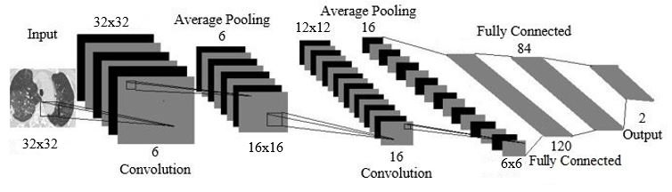
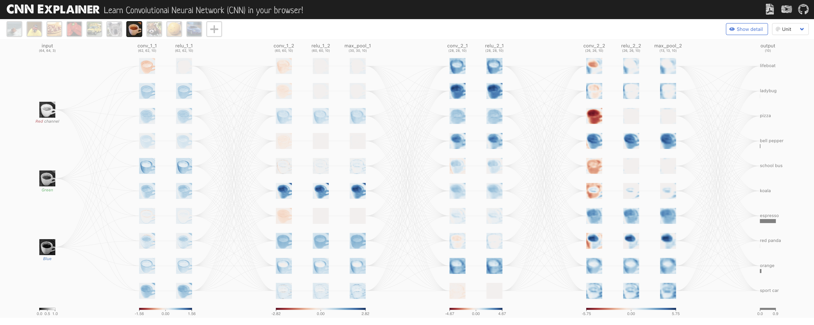
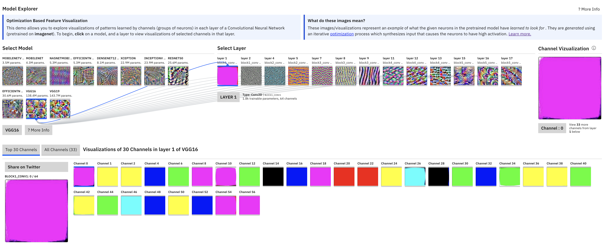
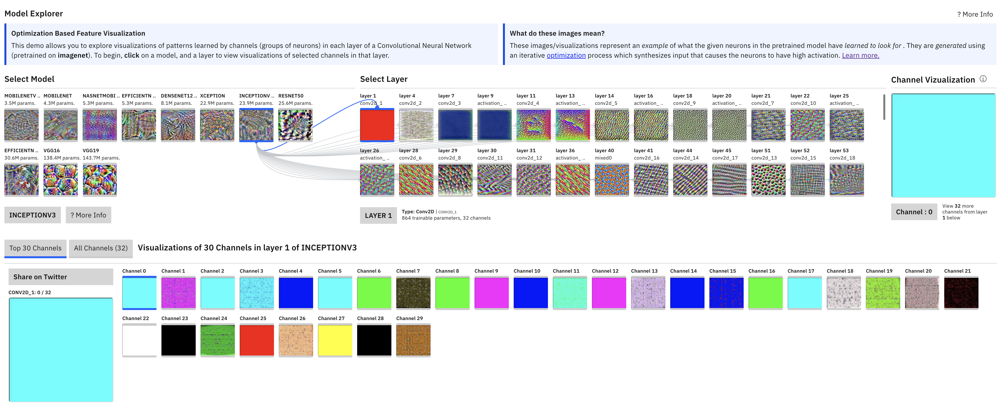

> **Note:**
**"*CNNs have revolutionized the way we process visual data, and mastering their implementation in a language like Rust opens new doors for high-performance, scalable AI applications.*" — Yann LeCun**

> **Note:**
*Chapter 5 of DLVR provides a thorough introduction to Convolutional Neural Networks (CNNs), covering both foundational principles and practical implementations. The chapter begins by tracing the historical development of CNNs, highlighting their evolution from traditional neural networks to sophisticated models that excel at image recognition tasks. It introduces the basic structure of CNNs, explaining key components such as convolutional layers, pooling layers, and fully connected layers, along with fundamental concepts like receptive fields, kernels, and feature maps. The chapter delves into the mechanics of convolutional layers, emphasizing their role in feature extraction, and explores the impact of pooling layers in reducing dimensionality while preserving critical information. It includes practical guidance on building a simple CNN in Rust, configuring layers and parameters to optimize feature extraction, and implementing various convolutional operations, including advanced types like depthwise and dilated convolutions. The chapter further examines pooling strategies, their role in achieving translational invariance, and their effect on model performance. Moving into advanced CNN architectures, it discusses the evolution from basic designs to complex models like ResNet and Inception, focusing on the importance of depth, width, and innovations like residual connections. Finally, the chapter addresses the challenges of training CNNs, covering essential topics such as loss functions, backpropagation, optimization algorithms, data augmentation, and hyperparameter tuning. Through detailed explanations and hands-on examples, Chapter 5 equips readers with both the theoretical understanding and practical skills needed to implement, train, and optimize CNNs in Rust.*

# 5.1. Foundations of Convolutional Neural Networks (CNNs)

The development of Convolutional Neural Networks (CNNs) is one of the most important milestones in the history of deep learning and artificial intelligence, particularly in fields like computer vision and pattern recognition. While neural networks had been researched for decades, it was the work of Yann LeCun in the late 1980s and early 1990s that brought CNNs into the spotlight. LeCun’s breakthrough came when he applied CNNs to the task of handwritten digit recognition, most notably using the MNIST dataset. His system, known as LeNet-5, demonstrated the effectiveness of CNNs for image classification by achieving high accuracy on the MNIST dataset, a task that had previously been challenging for traditional machine learning algorithms.


**Figure 1:** LeCun’s LeNet-5 CNN architecture.

The key innovation in CNNs, as opposed to traditional fully connected neural networks (FCNs), lies in their ability to process data with a spatial or grid-like structure. Traditional FCNs flatten input data, which destroys any inherent spatial relationships, whereas CNNs preserve these relationships by operating on local receptive fields. CNNs exploit the fact that nearby pixels in an image (or temporal points in a sequence) are more likely to be correlated than distant ones. This is critical for image-related tasks, where spatial hierarchies and local patterns, such as edges, textures, and shapes, play a crucial role in recognition and classification.

CNNs consist of convolutional layers, pooling layers, and fully connected layers. The convolutional layers apply filters (kernels) over local patches of the input data to extract relevant features. These filters are capable of detecting low-level features, such as edges and textures, in the earlier layers and more complex features, such as shapes and objects, in the deeper layers. This hierarchical feature extraction allows CNNs to effectively "see" and learn how different parts of an image relate to each other. The pooling layers are typically used to reduce the dimensionality of the feature maps by summarizing local information, making the model more computationally efficient while retaining the most important features.

The historical advancement of CNNs was heavily influenced by improvements in backpropagation, a technique originally developed by Geoffrey Hinton and others in the 1980s. Backpropagation enabled the efficient training of deep neural networks by computing the gradients of the loss function with respect to the network's parameters, which are then used to update the weights via gradient descent. LeCun's adaptation of backpropagation to CNNs played a pivotal role in making these networks feasible for practical tasks.

Another critical turning point for CNNs came with the availability of large-scale datasets like ImageNet. ImageNet, introduced by Fei-Fei Li in 2009, provided millions of labeled images across thousands of categories, offering a rich resource for training deep models. CNNs’ ability to learn from this large and diverse dataset demonstrated their superiority over traditional approaches, which often relied on hand-engineered features. The combination of CNNs and ImageNet culminated in the success of AlexNet, developed by Alex Krizhevsky, Ilya Sutskever, and Geoffrey Hinton in 2012. AlexNet won the ImageNet Large Scale Visual Recognition Challenge (ILSVRC) by a large margin, and it was the first CNN to significantly outperform conventional machine learning models in such a competition. This victory marked a turning point for the widespread adoption of CNNs.

The architecture of AlexNet introduced several key innovations, such as the use of rectified linear units (ReLU) as the activation function instead of traditional sigmoidal functions. ReLU allowed for faster training by alleviating the vanishing gradient problem, a significant issue in deep networks that prevents gradients from propagating through many layers. AlexNet also utilized dropout, a regularization technique that reduces overfitting by randomly disabling neurons during training, and data augmentation, which artificially increases the size of the training set by applying transformations such as rotation and flipping to the input data.

While AlexNet pushed CNNs to deeper architectures, it was still relatively shallow compared to what would follow. One of the challenges that arose as networks grew deeper was the difficulty of training them effectively due to the vanishing gradient problem. As the depth of a network increases, the gradients used to update the weights during backpropagation tend to diminish, making it difficult for the network to learn. This challenge was addressed by the introduction of ResNet (Residual Networks) in 2015, developed by Kaiming He, Xiangyu Zhang, Shaoqing Ren, and Jian Sun. ResNet introduced residual connections, or skip connections, which bypass certain layers and allow gradients to flow more easily through the network. This innovation enabled the training of extremely deep networks, with versions of ResNet containing over 150 layers. ResNet demonstrated that deeper networks could not only be trained but also achieve higher accuracy, and it set a new standard for CNN architecture design.

The rise of CNNs also coincided with advancements in hardware acceleration, particularly through the use of Graphics Processing Units (GPUs). GPUs, initially developed for rendering graphics, are well-suited for the parallel processing required by deep learning algorithms. The ability to train large-scale CNNs on GPUs significantly accelerated the development of deep learning. Frameworks like CUDA from NVIDIA allowed researchers to harness the power of GPUs for training deep networks, making it feasible to train models like AlexNet, VGG, and ResNet on large datasets like ImageNet in a reasonable amount of time.


**Figure 2:** Early evolution of CNN models.

Further advancements in CNN architectures followed, each building upon the successes of its predecessors. VGGNet, developed by Karen Simonyan and Andrew Zisserman in 2014, emphasized the importance of depth by using very small $3 \times 3$ filters while significantly increasing the number of layers (up to 19 in VGG-19). GoogLeNet (Inception Network), introduced by Christian Szegedy and colleagues at Google in 2015, focused on improving computational efficiency by using inception modules that applied convolutions of multiple filter sizes in parallel, reducing the number of parameters without sacrificing accuracy.

Recent architectures like EfficientNet, introduced in 2019 by Mingxing Tan and Quoc Le, further optimize CNN design through compound scaling. EfficientNet applies a systematic method for scaling the width, depth, and resolution of a network in a balanced manner, leading to models that achieve high accuracy with fewer parameters and lower computational cost.

The evolution of CNNs from LeNet to AlexNet, VGG, ResNet, and EfficientNet represents a series of innovations that have expanded the power of neural networks in handling complex tasks like image classification, object detection, and segmentation. The development of larger datasets, improved algorithms for training deep networks, and advances in hardware have all contributed to the ongoing success and widespread adoption of CNNs in various fields, including medical imaging, autonomous driving, and facial recognition. CNNs continue to be a cornerstone of deep learning research, with ongoing efforts to make them more efficient, scalable, and applicable to new domains.


**Figure 3:** CNN Explainer visual tools to understand key building blocks of CNN (<a href="https://poloclub.github.io/cnn-explainer/">https://poloclub.github.io/cnn-explainer</a>).

Mathematically, a convolution operation can be expressed as:

$$ y[i,j] = (X * K)[i,j] = \sum_{m} \sum_{n} X[i+m, j+n] \cdot K[m,n] $$

where $X$ is the input image, $K$ is the convolutional kernel (filter), and $y$ is the output (feature map). The kernel slides across the image, applying the filter in a windowed fashion, and outputs the convolved feature map.

- Convolutional Layers: These layers are the core of CNNs. A convolution operation applies several kernels (filters) to the input image, resulting in multiple feature maps. The convolution process reduces the dimensionality while preserving spatial relationships, thus efficiently learning important patterns such as edges, textures, and shapes.
- Pooling Layers: Pooling layers are used to reduce the dimensionality of feature maps, which helps to lower computational complexity while maintaining critical information. The most common form of pooling is max pooling, where the maximum value is selected from a region of the feature map. For instance, for a pooling size of $2 \times 2$, the output is:

$$ y[i,j] = \max(X[i:i+2, j:j+2]) $$

- This reduction leads to a compact feature representation and helps prevent overfitting by reducing the number of parameters.
- Fully Connected Layers: In the final stages of a CNN, fully connected layers (also known as dense layers) flatten the feature maps into a single vector and apply a fully connected neural network, producing the final classification or regression output.
- The receptive field refers to the specific region of the input image that influences a particular unit (or neuron) in the feature map. The receptive field size increases with each layer, allowing the network to capture larger and more complex patterns. Kernels (or filters) are small matrices that slide across the input image to produce feature maps. Feature maps represent the output of applying kernels, and each map corresponds to specific learned features like edges, textures, or patterns.

Convolutional layers work by sliding the kernel across the image and computing dot products between the kernel and the corresponding portion of the image. Each convolution operation yields a feature map that highlights specific features in the image, such as edges, corners, or textures. Deeper layers in the CNN learn increasingly complex features, such as shapes or objects, by combining lower-level features.

Pooling layers help to down-sample feature maps, making the network less sensitive to small variations in the input. This leads to feature hierarchies, where initial layers capture basic elements like edges, and subsequent layers capture higher-level patterns and objects. This hierarchy is crucial for tasks like image classification, where objects are recognized based on multiple learned features.

In summary, a CNN is a deep learning architecture specifically designed to process and recognize patterns in grid-like data, such as images. Unlike traditional neural networks, CNNs utilize convolutional layers that apply filters to input data to capture spatial features, such as edges, textures, and shapes. These layers are followed by pooling layers, which reduce spatial dimensions, making the model computationally efficient while preserving important features. CNNs typically end with fully connected layers that integrate the extracted features to classify the input data. The architecture is particularly effective for image recognition tasks, as it learns hierarchical features—from simple edges in initial layers to more complex patterns in deeper layers.

The following code implements a CNN to classify images from the MNIST dataset, a widely-used dataset of handwritten digits. The CNN architecture consists of two convolutional layers that extract spatial features from the 28x28 pixel images, followed by max-pooling layers to reduce spatial dimensions and two fully connected layers that perform the final classification into 10 digit classes (0-9). The `download_mnist` function ensures that the MNIST data files are present, downloading and extracting them if needed. The `run_conv` function carries out the training task, using the Adam optimizer to update the model weights based on cross-entropy loss computed for each mini-batch of training data. After each epoch, the code evaluates the model's accuracy on the test set, providing feedback on the model’s learning progress for the digit classification task.

```toml
[dependencies]
anyhow = "1.0"
tch = "0.12"
reqwest = { version = "0.11", features = ["blocking"] }
flate2 = "1.0"
tokio = { version = "1", features = ["full"] }
```
```rust
use anyhow::{Result, Context};
use flate2::read::GzDecoder;
use std::{fs, fs::File, io::copy, path::Path};
use tch::{nn, nn::ModuleT, nn::OptimizerConfig, Device, Tensor, vision};
use reqwest;

// URLs for the MNIST dataset files
const MNIST_URLS: &[(&str, &str)] = &[
    ("https://ossci-datasets.s3.amazonaws.com/mnist/train-images-idx3-ubyte.gz", "data/train-images-idx3-ubyte"),
    ("https://ossci-datasets.s3.amazonaws.com/mnist/train-labels-idx1-ubyte.gz", "data/train-labels-idx1-ubyte"),
    ("https://ossci-datasets.s3.amazonaws.com/mnist/t10k-images-idx3-ubyte.gz", "data/t10k-images-idx3-ubyte"),
    ("https://ossci-datasets.s3.amazonaws.com/mnist/t10k-labels-idx1-ubyte.gz", "data/t10k-labels-idx1-ubyte"),
];

// Function to download and extract MNIST dataset files if they don't exist.
async fn download_mnist() -> Result<()> {
    fs::create_dir_all("data").context("Failed to create data directory")?;

    for &(url, file_path) in MNIST_URLS {
        if !Path::new(file_path).exists() {
            println!("Downloading {}...", url);
            let response = reqwest::get(url).await?;

            // Check if the response is a valid GZIP file
            if response.headers().get("content-type").map(|v| v != "application/x-gzip").unwrap_or(true) {
                return Err(anyhow::anyhow!("Invalid content type for {}: {:?}", url, response.headers().get("content-type")));
            }

            // Attempt to extract the GZIP file
            let bytes = response.bytes().await?;
            let mut gz = GzDecoder::new(bytes.as_ref());
            let mut out_file = File::create(file_path).context("Failed to create MNIST file")?;
            copy(&mut gz, &mut out_file).context("Failed to extract MNIST file")?;
            println!("Downloaded and extracted to {}", file_path);
        } else {
            println!("File {} already exists, skipping download.", file_path);
        }
    }
    Ok(())
}

// Main function to download MNIST data and run the CNN model.
#[tokio::main]
async fn main() -> Result<()> {
    // Ensure the MNIST dataset is downloaded and extracted.
    download_mnist().await?;

    // Run the CNN model training
    run_conv()
}

// CNN Model - Should reach around 99% accuracy.
#[derive(Debug)]
struct Net {
    conv1: nn::Conv2D,
    conv2: nn::Conv2D,
    fc1: nn::Linear,
    fc2: nn::Linear,
}

impl Net {
    // Initializes a new CNN model with layers defined in the `Net` structure.
    fn new(vs: &nn::Path) -> Net {
        let conv1 = nn::conv2d(vs, 1, 32, 5, Default::default());
        let conv2 = nn::conv2d(vs, 32, 64, 5, Default::default());
        let fc1 = nn::linear(vs, 1024, 1024, Default::default());
        let fc2 = nn::linear(vs, 1024, 10, Default::default());
        Net { conv1, conv2, fc1, fc2 }
    }
}

// Implementing the forward pass of the CNN model with ReLU and Dropout.
impl nn::ModuleT for Net {
    fn forward_t(&self, xs: &Tensor, train: bool) -> Tensor {
        xs.view([-1, 1, 28, 28])  // Reshape input to 1x28x28 images.
            .apply(&self.conv1)   // Apply first convolutional layer.
            .max_pool2d_default(2) // Max pooling.
            .apply(&self.conv2)   // Apply second convolutional layer.
            .max_pool2d_default(2) // Max pooling.
            .view([-1, 1024])     // Flatten.
            .apply(&self.fc1)     // Apply first linear layer.
            .relu()               // ReLU activation.
            .dropout(0.5, train)  // Dropout layer for regularization.
            .apply(&self.fc2)     // Final linear layer for classification.
    }
}

// Function to train and test the CNN model on the MNIST dataset.
fn run_conv() -> Result<()> {
    // Load the MNIST dataset; this will download if the files are missing.
    let m = vision::mnist::load_dir("data")?;

    // Use GPU if available, otherwise use CPU
    let vs = nn::VarStore::new(Device::cuda_if_available());
    let net = Net::new(&vs.root()); // Initialize the CNN model.
    let mut opt = nn::Adam::default().build(&vs, 1e-4)?; // Set up the optimizer.

    // Reshape and normalize the training and test images
    let train_images = m.train_images.view([-1, 1, 28, 28]) / 255.0;
    let train_labels = m.train_labels;
    let test_images = m.test_images.view([-1, 1, 28, 28]) / 255.0;
    let test_labels = m.test_labels;

    // Training loop for the CNN model.
    for epoch in 1..=10 {
        // Shuffle and split the training data into batches
        for (bimages, blabels) in train_images.split(256, 0).into_iter().zip(train_labels.split(256, 0).into_iter()) {
            let loss = net.forward_t(&bimages, true).cross_entropy_for_logits(&blabels);
            opt.backward_step(&loss); // Backpropagation step.
        }

        // Calculate and print test accuracy at the end of each epoch
        let test_accuracy = net.batch_accuracy_for_logits(&test_images, &test_labels, vs.device(), 1024);
        println!("Epoch: {:4}, Test Accuracy: {:5.2}%", epoch, 100. * test_accuracy);
    }
    Ok(())
}
```

The code defines a CNN model using the `tch` library to classify images from the MNIST dataset. The `Net` struct represents the CNN architecture, which has two convolutional layers (`conv1` and `conv2`) for feature extraction, followed by two fully connected layers (`fc1` and `fc2`) for classification. Each convolutional layer is followed by a max-pooling layer to reduce spatial dimensions. The `forward_t` method implements the forward pass of the network, applying each layer sequentially with ReLU activations and a dropout layer for regularization. In the `run_conv` function, the model is trained over ten epochs, using the Adam optimizer for parameter updates. After each epoch, the model’s accuracy on the test dataset is evaluated and printed, allowing us to track its performance across epochs. Additionally, a `download_mnist` function ensures the dataset is downloaded and extracted from an external source before training begins.

In industry, CNNs are widely adopted for tasks such as image recognition, object detection, and medical image analysis. The practice of fine-tuning pre-trained CNNs (like ResNet or VGG) on specific datasets is common, as it saves computational resources and leverages existing learned features. Companies often deploy CNNs in real-world applications using frameworks like TensorFlow or PyTorch, but with Rust, we see growing interest due to the language’s performance benefits and safety guarantees, especially in systems requiring lower-level control, such as embedded devices and web assembly.

# 5.2. Deep Dive into Convolutional Layers

In the CNN Explainer, the input layer (leftmost) represents the image being fed into the convolutional neural network (CNN). Since we are working with RGB images, this layer has three channels—red, green, and blue—corresponding to the three color channels of the input image.

The convolutional layers are the core building blocks of a CNN. These layers contain learned kernels (also called filters or weights), which extract important features from the input image to help distinguish between different classes. This process is crucial for image classification tasks.

As you interact with the convolutional layers, you will notice connections to the preceding layers. Each connection represents a unique kernel that performs the convolution operation to produce the current layer's output, known as an activation map (or feature map).


**Figure 4:** As you hover over the activation map of the topmost node from the first convolutional layer, you can see that 3 kernels were applied to yield this activation map. After clicking this activation map, you can see the convolution operation occuring with each unique kernel.

When you hover over the activation map of the first convolutional layer (topmost node), you can see that three kernels are applied to generate this map. If you click on the activation map, you’ll observe how each kernel operates during the convolution process.

In each convolutional neuron, the operation begins with an elementwise dot product between a kernel and the output of the corresponding neuron from the previous layer. This produces one intermediate result for each kernel. The final output of the convolutional neuron is obtained by summing all intermediate results and adding a learned bias.

Let’s examine the first convolutional layer of the TinyVGG architecture. This layer contains 10 neurons, while the previous layer has 3 neurons (representing the RGB channels). In this architecture, the convolutional layers are fully connected, meaning that each neuron in the current layer is connected to every neuron in the previous layer.


**Figure 5:** The kernel being applied to yield the topmost intermediate result for the discussed activation map.

By focusing on the output of the topmost neuron in the first convolutional layer, we see that there are 3 unique kernels applied. Each kernel performs an elementwise dot product with the output of the previous layer. In this example, the kernel size is 3x3, and the stride (the number of pixels the kernel shifts over) is set to 1. This means that the kernel moves one pixel at a time across the image during the convolution operation. Stride is a hyperparameter that can be adjusted by the network designer to fit specific datasets.

For each neuron, all three kernels are applied, producing three intermediate results. These results are then summed elementwise, along with the learned bias, to generate the final output—an activation map, which is a 2D tensor representing the features detected by that neuron.

In the first convolutional layer of TinyVGG, there are 3 x 10 = 30 unique kernels, each of size 3x3. These kernels are used to process the three input channels (RGB) for each of the 10 neurons. The design of the kernel connectivity between layers is a critical decision when building a CNN architecture, as it directly influences the number of kernels and the complexity of feature extraction in each layer.

Convolution is the core operation in Convolutional Neural Networks (CNNs), used to extract features from input data, particularly images. Mathematically, a convolution operation is defined as:

$$ y[i,j] = (X * K)[i,j] = \sum_{m} \sum_{n} X[i+m, j+n] \cdot K[m,n] $$

Where $X$ is the input matrix (e.g., an image), $K$ is the kernel (or filter), and $y$ is the output feature map. The convolution theorem, crucial in signal processing, states that convolution in the time domain is equivalent to multiplication in the frequency domain. This property, while less used in standard CNNs, is relevant in certain optimization contexts where Fast Fourier Transforms (FFTs) are applied to speed up convolutions.

The kernel, also known as the filter, is a matrix of learnable weights that "slides" across the input image. The dot product between the kernel and a small patch of the image generates a new pixel value in the output feature map. Each convolution layer can apply multiple filters, learning different features like edges, textures, and patterns in the image.

CNNs utilize several types of convolution operations to optimize feature extraction:

- Standard Convolution: This is the traditional convolution operation where a kernel slides across the entire input matrix. It is computationally intensive but effective at capturing spatial hierarchies in data.
- Depthwise Convolution: In this operation, each input channel (e.g., RGB channels of an image) is convolved with its own filter, rather than combining all channels with a single filter. Depthwise convolutions significantly reduce computational complexity while preserving spatial information. The mathematical operation is similar, but each channel $X_d$ has its own kernel $K_d$:

$$ y_d[i,j] = \sum_{m} \sum_{n} X_d[i+m, j+n] \cdot K_d[m,n] $$

- Dilated Convolution: Dilated convolutions introduce gaps between kernel elements, allowing a larger receptive field without increasing the number of parameters. This is particularly useful in tasks requiring multi-scale context, such as semantic segmentation. The dilated convolution operation is represented as:

$$ y[i,j] = \sum_{m} \sum_{n} X[i + d \cdot m, j + d \cdot n] \cdot K[m,n] $$

- Where $d$ is the dilation rate.

Padding and stride are two critical hyperparameters that control the output size and computational efficiency of the convolution operation.

Padding involves adding extra pixels (typically zeros) around the input image to control the spatial dimensions of the output feature map. Without padding (known as valid padding), the output size reduces with each convolution operation, leading to a loss of information at the borders. To avoid this, same padding is used, which ensures that the output size matches the input size, preserving boundary information.

Padding is crucial when the kernel extends beyond the activation map, as it helps conserve edge data, which often improves the model's performance. It also allows for deeper architectures by maintaining spatial dimensions across layers. The most common padding technique is zero-padding, which involves adding zeros symmetrically around the input. This method is widely used due to its simplicity, computational efficiency, and performance benefits, and it’s adopted in many high-performing CNNs, such as AlexNet.


**Figure 6:** Key hyperparameters in CNN architecture.

The kernel size (or filter size) refers to the dimensions of the sliding window that moves over the input. Choosing the kernel size is a critical hyperparameter decision, as it directly impacts the information extracted from the input.

- Smaller kernels extract highly localized features, capturing fine details, and result in smaller reductions in layer dimensions, which allows for deeper network architectures. This often leads to better performance in tasks like image classification, as deeper networks can learn more complex feature hierarchies.
- Larger kernels, on the other hand, reduce the layer dimensions more rapidly and are better suited for detecting larger patterns in the data. However, they tend to perform worse in tasks requiring detailed feature extraction, as they lose fine-grained information.

Ultimately, the optimal kernel size depends on the specific task and dataset, but smaller kernels are generally preferred for image classification because they allow more layers to be stacked, facilitating the learning of more intricate features.

Stride controls how far the kernel moves across the input with each step. A stride of 1 means the kernel moves one pixel at a time, while a stride greater than 1 skips pixels, reducing the size of the output feature map.

Stride introduces a trade-off between computational efficiency and spatial resolution. A smaller stride (e.g., 1) enables the extraction of more features, resulting in larger output layers and more detailed learning, but at the cost of increased computational complexity. In contrast, a larger stride reduces the number of features extracted and the size of the output layers, but it can lead to faster computations and fewer parameters.

For example, in Tiny VGG, a stride of 1 is used for its convolutional layers, meaning the kernel slides one pixel at a time over the input, computing a dot product in each position. Adjusting the stride size impacts the feature extraction process in a similar way to adjusting the kernel size, and it’s essential for the architecture designer to ensure symmetric kernel sliding across the input.

Experiment with stride using the hyperparameter visualization to see how it affects input and output dimensions! The output size of a convolution operation can be calculated as:

$$ \text{Output Size} = \left(\frac{\text{Input Size} - \text{Kernel Size} + 2 \times \text{Padding}}{\text{Stride}}\right) + 1 $$

The choice of kernel size has a direct impact on the CNN's ability to extract features. Small kernels (e.g., 3x3 or 5x5) are common in modern CNN architectures like ResNet because they efficiently capture local patterns with fewer parameters, allowing for deeper networks. Larger kernels, while capturing broader contextual information, are more computationally expensive and prone to overfitting in smaller datasets.

The use of different kernel sizes, padding, and stride allows flexibility in CNN architectures. For example, using small kernels with appropriate padding can maintain spatial resolution, while large strides can reduce the computational load by down-sampling feature maps.

LeNet-5 is a pioneering Convolutional Neural Network (CNN) architecture developed by Yann LeCun in the late 1980s, specifically for handwritten digit recognition on the MNIST dataset. The architecture consists of two convolutional layers with average pooling layers for downsampling, followed by three fully connected layers. The convolutional layers use small filters to capture local spatial features, while the pooling layers reduce the spatial dimensions, making the model efficient and capable of learning hierarchical features. The fully connected layers at the end consolidate learned features for the final classification into ten classes (digits 0-9). LeNet-5's simplicity and efficiency have made it a foundational model for later CNN advancements.

Let’s implement the LeNet-5 with various convolutional layers, focusing on standard, depthwise, and dilated convolutions using Rust and `tch-rs` for tensor operations:

```rust
use anyhow::{Result, Context};
use flate2::read::GzDecoder;
use std::{fs, fs::File, io::copy, path::Path};
use tch::{nn, nn::ModuleT, nn::OptimizerConfig, Device, Tensor, vision};
use reqwest;

// URLs for the MNIST dataset files
const MNIST_URLS: &[(&str, &str)] = &[
    ("https://ossci-datasets.s3.amazonaws.com/mnist/train-images-idx3-ubyte.gz", "data/train-images-idx3-ubyte"),
    ("https://ossci-datasets.s3.amazonaws.com/mnist/train-labels-idx1-ubyte.gz", "data/train-labels-idx1-ubyte"),
    ("https://ossci-datasets.s3.amazonaws.com/mnist/t10k-images-idx3-ubyte.gz", "data/t10k-images-idx3-ubyte"),
    ("https://ossci-datasets.s3.amazonaws.com/mnist/t10k-labels-idx1-ubyte.gz", "data/t10k-labels-idx1-ubyte"),
];

// Function to download and extract MNIST dataset files if they don't exist.
async fn download_mnist() -> Result<()> {
    fs::create_dir_all("data").context("Failed to create data directory")?;

    for &(url, file_path) in MNIST_URLS {
        if !Path::new(file_path).exists() {
            println!("Downloading {}...", url);
            let response = reqwest::get(url).await?;

            // Check if the response is a valid GZIP file
            if response.headers().get("content-type").map(|v| v != "application/x-gzip").unwrap_or(true) {
                return Err(anyhow::anyhow!("Invalid content type for {}: {:?}", url, response.headers().get("content-type")));
            }

            // Attempt to extract the GZIP file
            let bytes = response.bytes().await?;
            let mut gz = GzDecoder::new(bytes.as_ref());
            let mut out_file = File::create(file_path).context("Failed to create MNIST file")?;
            copy(&mut gz, &mut out_file).context("Failed to extract MNIST file")?;
            println!("Downloaded and extracted to {}", file_path);
        } else {
            println!("File {} already exists, skipping download.", file_path);
        }
    }
    Ok(())
}

// Main function to download MNIST data and run the LeNet-5 model.
#[tokio::main]
async fn main() -> Result<()> {
    // Ensure the MNIST dataset is downloaded and extracted.
    download_mnist().await?;

    // Run the LeNet-5 model training
    run_lenet5()
}

// LeNet-5 Model
#[derive(Debug)]
struct LeNet5 {
    conv1: nn::Conv2D,
    conv2: nn::Conv2D,
    fc1: nn::Linear,
    fc2: nn::Linear,
    fc3: nn::Linear,
}

impl LeNet5 {
    // Initializes a new LeNet-5 model with layers defined in the `LeNet5` structure.
    fn new(vs: &nn::Path) -> LeNet5 {
        let conv1 = nn::conv2d(vs, 1, 6, 5, Default::default());   // 6 filters, 5x5 kernel
        let conv2 = nn::conv2d(vs, 6, 16, 5, Default::default());  // 16 filters, 5x5 kernel
        let fc1 = nn::linear(vs, 16 * 4 * 4, 120, Default::default()); // Flattened output to 120
        let fc2 = nn::linear(vs, 120, 84, Default::default());     // 120 to 84
        let fc3 = nn::linear(vs, 84, 10, Default::default());      // 84 to 10 (output classes)
        LeNet5 { conv1, conv2, fc1, fc2, fc3 }
    }
}

// Implementing the forward pass of the LeNet-5 model.
impl nn::ModuleT for LeNet5 {
    fn forward_t(&self, xs: &Tensor, train: bool) -> Tensor {
        xs.view([-1, 1, 28, 28])            // Reshape input to 1x28x28 images.
            .apply(&self.conv1)              // Apply first convolutional layer.
            .avg_pool2d_default(2)           // Average pooling layer with 2x2 kernel.
            .apply(&self.conv2)              // Apply second convolutional layer.
            .avg_pool2d_default(2)           // Average pooling layer with 2x2 kernel.
            .view([-1, 16 * 4 * 4])          // Flatten for fully connected layer.
            .apply(&self.fc1)                // Apply first fully connected layer.
            .relu()                          // ReLU activation.
            .apply(&self.fc2)                // Apply second fully connected layer.
            .relu()                          // ReLU activation.
            .apply(&self.fc3)                // Final fully connected layer for classification.
    }
}

// Function to train and test the LeNet-5 model on the MNIST dataset.
fn run_lenet5() -> Result<()> {
    // Load the MNIST dataset; this will download if the files are missing.
    let m = vision::mnist::load_dir("data")?;

    // Use GPU if available, otherwise use CPU
    let vs = nn::VarStore::new(Device::cuda_if_available());
    let net = LeNet5::new(&vs.root()); // Initialize the LeNet-5 model.
    let mut opt = nn::Adam::default().build(&vs, 1e-4)?; // Set up the optimizer.

    // Reshape and normalize the training and test images
    let train_images = m.train_images.view([-1, 1, 28, 28]) / 255.0;
    let train_labels = m.train_labels;
    let test_images = m.test_images.view([-1, 1, 28, 28]) / 255.0;
    let test_labels = m.test_labels;

    // Training loop for the LeNet-5 model.
    for epoch in 1..=10 {
        // Shuffle and split the training data into batches
        for (bimages, blabels) in train_images.split(256, 0).into_iter().zip(train_labels.split(256, 0).into_iter()) {
            let loss = net.forward_t(&bimages, true).cross_entropy_for_logits(&blabels);
            opt.backward_step(&loss); // Backpropagation step.
        }

        // Calculate and print test accuracy at the end of each epoch
        let test_accuracy = net.batch_accuracy_for_logits(&test_images, &test_labels, vs.device(), 1024);
        println!("Epoch: {:4}, Test Accuracy: {:5.2}%", epoch, 100. * test_accuracy);
    }
    Ok(())
}
```

The modified code implements the LeNet-5 architecture in the `Net` struct by adjusting the layer structure to match the original design. In `Net::new`, the first convolutional layer (`conv1`) has 6 filters with a 5x5 kernel, and the second convolutional layer (`conv2`) has 16 filters, both using average pooling instead of max pooling. The fully connected layers are redefined to match LeNet-5’s architecture, with the first fully connected layer (`fc1`) having 120 units, the second (`fc2`) having 84 units, and the final layer mapping to 10 output classes for classification. The `forward_t` function follows LeNet-5’s sequence, applying each convolutional layer with average pooling and flattening before the fully connected layers. In `run_conv`, the model is trained over multiple epochs, with accuracy evaluated on the test set after each epoch to monitor performance.

The implementation shows how these operations can be configured with different settings like padding, stride, and dilation, all of which affect the output shape and feature extraction. You can modify kernel sizes, strides, and padding to observe their impact on performance and model accuracy.

AlexNet, introduced in 2012 by Alex Krizhevsky et al., significantly advanced Convolutional Neural Networks (CNNs) by building on foundational models like LeNet-5. Designed for large-scale image recognition, AlexNet was a landmark improvement in both depth and computational power, allowing CNNs to handle complex datasets like ImageNet with over a million images. AlexNet expanded upon LeNet-5 by incorporating multiple layers of convolutions, pooling, and fully connected layers, while also introducing innovations like ReLU activations, dropout for regularization, and overlapping max-pooling layers. This design drastically increased model capacity and resilience to overfitting, making AlexNet far more powerful for visual recognition tasks.

```rust
use anyhow::{Result, Context};
use flate2::read::GzDecoder;
use std::{fs, fs::File, io::copy, path::Path};
use tch::{nn, nn::ModuleT, nn::OptimizerConfig, Device, Tensor, vision};
use reqwest;

// URLs for the MNIST dataset files
const MNIST_URLS: &[(&str, &str)] = &[
    ("https://ossci-datasets.s3.amazonaws.com/mnist/train-images-idx3-ubyte.gz", "data/train-images-idx3-ubyte"),
    ("https://ossci-datasets.s3.amazonaws.com/mnist/train-labels-idx1-ubyte.gz", "data/train-labels-idx1-ubyte"),
    ("https://ossci-datasets.s3.amazonaws.com/mnist/t10k-images-idx3-ubyte.gz", "data/t10k-images-idx3-ubyte"),
    ("https://ossci-datasets.s3.amazonaws.com/mnist/t10k-labels-idx1-ubyte.gz", "data/t10k-labels-idx1-ubyte"),
];

// Function to download and extract MNIST dataset files if they don't exist.
async fn download_mnist() -> Result<()> {
    fs::create_dir_all("data").context("Failed to create data directory")?;

    for &(url, file_path) in MNIST_URLS {
        if !Path::new(file_path).exists() {
            println!("Downloading {}...", url);
            let response = reqwest::get(url).await?;
            if response.headers().get("content-type").map(|v| v != "application/x-gzip").unwrap_or(true) {
                return Err(anyhow::anyhow!("Invalid content type for {}: {:?}", url, response.headers().get("content-type")));
            }

            let bytes = response.bytes().await?;
            let mut gz = GzDecoder::new(bytes.as_ref());
            let mut out_file = File::create(file_path).context("Failed to create MNIST file")?;
            copy(&mut gz, &mut out_file).context("Failed to extract MNIST file")?;
            println!("Downloaded and extracted to {}", file_path);
        } else {
            println!("File {} already exists, skipping download.", file_path);
        }
    }
    Ok(())
}

// Main function to download MNIST data and run the AlexNet model.
#[tokio::main]
async fn main() -> Result<()> {
    // Ensure the MNIST dataset is downloaded and extracted.
    download_mnist().await?;

    // Run the AlexNet model training
    run_alexnet()
}

// AlexNet Model for MNIST
#[derive(Debug)]
struct AlexNet {
    conv1: nn::Conv2D,
    conv2: nn::Conv2D,
    conv3: nn::Conv2D,
    conv4: nn::Conv2D,
    fc1: nn::Linear,
    fc2: nn::Linear,
    fc3: nn::Linear,
}

impl AlexNet {
    fn new(vs: &nn::Path) -> AlexNet {
        let conv1 = nn::conv2d(vs, 1, 64, 3, nn::ConvConfig { stride: 1, padding: 1, ..Default::default() });
        let conv2 = nn::conv2d(vs, 64, 128, 3, nn::ConvConfig { stride: 1, padding: 1, ..Default::default() });
        let conv3 = nn::conv2d(vs, 128, 256, 3, nn::ConvConfig { stride: 1, padding: 1, ..Default::default() });
        let conv4 = nn::conv2d(vs, 256, 256, 3, nn::ConvConfig { stride: 1, padding: 1, ..Default::default() });
        let fc1 = nn::linear(vs, 256 * 3 * 3, 4096, Default::default());
        let fc2 = nn::linear(vs, 4096, 4096, Default::default());
        let fc3 = nn::linear(vs, 4096, 10, Default::default());
        AlexNet { conv1, conv2, conv3, conv4, fc1, fc2, fc3 }
    }
}

// Implementing the forward pass of the AlexNet model.
impl nn::ModuleT for AlexNet {
    fn forward_t(&self, xs: &Tensor, train: bool) -> Tensor {
        xs.view([-1, 1, 28, 28])
            .apply(&self.conv1).relu()
            .max_pool2d_default(2)
            .apply(&self.conv2).relu()
            .max_pool2d_default(2)
            .apply(&self.conv3).relu()
            .apply(&self.conv4).relu()
            .max_pool2d_default(2)
            .view([-1, 256 * 3 * 3])
            .apply(&self.fc1).relu()
            .dropout(0.5, train)
            .apply(&self.fc2).relu()
            .dropout(0.5, train)
            .apply(&self.fc3)
    }
}

// Function to train and test the AlexNet model on the MNIST dataset.
fn run_alexnet() -> Result<()> {
    let m = vision::mnist::load_dir("data")?;
    let vs = nn::VarStore::new(Device::cuda_if_available());
    let net = AlexNet::new(&vs.root());
    let mut opt = nn::Adam::default().build(&vs, 1e-4)?;

    let train_images = m.train_images.view([-1, 1, 28, 28]) / 255.0;
    let train_labels = m.train_labels;
    let test_images = m.test_images.view([-1, 1, 28, 28]) / 255.0;
    let test_labels = m.test_labels;

    for epoch in 1..=10 {
        for (bimages, blabels) in train_images.split(256, 0).into_iter().zip(train_labels.split(256, 0).into_iter()) {
            let loss = net.forward_t(&bimages, true).cross_entropy_for_logits(&blabels);
            opt.backward_step(&loss);
        }

        let test_accuracy = net.batch_accuracy_for_logits(&test_images, &test_labels, vs.device(), 1024);
        println!("Epoch: {:4}, Test Accuracy: {:5.2}%", epoch, 100. * test_accuracy);
    }
    Ok(())
}
```

The AlexNet architecture in code consists of five convolutional layers followed by three fully connected layers. The first two convolutional layers use large filters (11x11 and 5x5), with strides to reduce dimensionality and overlapping max-pooling for feature extraction. The next three convolutional layers use smaller 3x3 filters, capturing more granular details. After the convolutional layers, three fully connected layers consolidate these features: the first two have 4096 units each, with dropout for regularization, and the final layer has units equal to the number of classes. ReLU activations are applied after each convolutional and fully connected layer to introduce non-linearity, allowing the model to learn complex patterns. This architecture dramatically increases model capacity, enabling effective learning from large-scale image datasets.

In modern industry practices, different convolution types are utilized for specific tasks. For instance, depthwise separable convolutions are widely used in mobile and embedded systems (e.g., in architectures like MobileNet) to reduce computational load while maintaining accuracy. Dilated convolutions are used in segmentation networks like DeepLab, where a broader context is necessary for dense prediction tasks.

The choice of kernel size, padding, and stride is often dictated by task requirements. In image classification, smaller kernels and stride values are favored to maintain spatial resolution, while in real-time object detection, larger strides are used to speed up inference. The practical tuning of these hyperparameters is crucial in balancing accuracy and computational efficiency, and modern frameworks (such as TensorFlow, PyTorch, and increasingly Rust libraries like `tch-rs`) provide flexibility in experimenting with these configurations.

The combination of scientific understanding and practical Rust implementation enables developers to experiment with various convolutional configurations, evaluate their performance, and optimize models for specific tasks in both research and industrial settings.

# 5.3. Pooling Layers and Dimensionality Reduction

Pooling layers play a critical role in reducing the dimensionality of feature maps in Convolutional Neural Networks (CNNs), helping to improve computational efficiency while retaining key features. The most commonly used types of pooling are max pooling, average pooling, and global pooling.

- Max Pooling: In max pooling, the maximum value from a defined sub-region of the input feature map is selected. Formally, for a pooling size of $p \times p$:

$$ y[i,j] = \max(X[i:i+p, j:j+p]) $$

- This operation effectively downsamples the input by taking the largest value in each region, which helps retain strong activations while discarding weaker ones.
- Average Pooling: Average pooling takes the average of the values in the sub-region, smoothing the feature map. Mathematically, it is represented as:

$$ y[i,j] = \frac{1}{p^2} \sum_{m=0}^{p-1} \sum_{n=0}^{p-1} X[i+m, j+n] $$

- This is often used when we want a smoother representation of features, although it can dilute strong activations.
- Global Pooling: Global pooling reduces each feature map to a single value. In global max pooling, the maximum value across the entire feature map is taken, while global average pooling computes the average of all values in the feature map.

$$ y = \max(X) \quad \text{or} \quad y = \frac{1}{N} \sum_{i=1}^{N} X[i] $$

This type of pooling is often used in the final stages of CNN architectures before the fully connected layers, serving as a bridge between the convolutional part of the network and the classifier.


**Figure 7:** Max and average pooling in CNN.

Pooling layers reduce the spatial dimensions of the input feature maps, lowering the computational burden and the number of parameters in the network. By downsampling the feature maps, pooling layers also introduce a form of translational invariance, meaning the network becomes more robust to small translations of the input data. This is crucial for tasks like image recognition, where the position of objects in the image might change, but the overall patterns remain recognizable.

However, reducing dimensionality also comes with trade-offs. Pooling may result in the loss of spatial resolution, and the balance between downsampling and feature retention is essential for optimizing model performance.

Downsampling through pooling has a significant effect on both the computational efficiency and the performance of a CNN. While reducing the spatial dimensions helps to decrease the number of computations and parameters, aggressive downsampling can lead to a loss of important spatial information, potentially reducing the accuracy of the model.

Mathematically, after applying a pooling operation with a pool size of $p \times p$ and stride $s$, the output size can be calculated as:

$$ \text{Output Size} = \left(\frac{\text{Input Size} - p}{s}\right) + 1 $$

For example, with a pooling size of $2 \times 2$ and stride 2, the spatial dimensions of the feature map are halved. This reduction allows deeper layers to focus on higher-level features while maintaining efficiency.

One of the key benefits of pooling layers is translational invariance. By selecting the maximum or averaging values across regions, pooling layers make the network less sensitive to small translations of input data. This means the CNN can detect objects in an image even if they appear in slightly different locations, which is crucial for robust image classification and object detection.

Choosing the appropriate pooling strategy depends on the balance between reducing the model’s computational complexity and preserving enough spatial information to ensure good performance. For example, max pooling aggressively reduces dimensionality by focusing on the most salient features, making it highly effective in recognition tasks. In contrast, average pooling might be more useful in tasks where overall patterns matter more than individual strong activations.

Below is an example of how to implement max pooling, average pooling, and global pooling in Rust using the `tch-rs` library:

```rust
use tch::Tensor;

fn main() {
    // Define a dummy input tensor representing an image with size (1, 1, 28, 28)
    let input = Tensor::randn(&[1, 1, 28, 28], tch::kind::FLOAT_CPU);

    // Max pooling with a kernel size of 2x2 and stride 2
    let max_pooling = input.max_pool2d_default(2);

    // Average pooling with a kernel size of 2x2 and stride 2
    let avg_pooling = input.avg_pool2d_default(2);

    // Global max pooling (pooling over the entire feature map)
    let global_max_pooling = input.max_pool2d(vec![28, 28], vec![1, 1], vec![0, 0], vec![1, 1], false);

    // Global average pooling (pooling over the entire feature map)
    let global_avg_pooling = input.avg_pool2d(vec![28, 28], vec![1, 1], vec![0, 0], false, false, None);

    // Print out the sizes of the output tensors
    println!("Max Pooling Output Shape: {:?}", max_pooling.size());
    println!("Average Pooling Output Shape: {:?}", avg_pooling.size());
    println!("Global Max Pooling Output Shape: {:?}", global_max_pooling.size());
    println!("Global Average Pooling Output Shape: {:?}", global_avg_pooling.size());
}
```

In this code, we apply max pooling, average pooling, and global pooling to an input tensor. The pooling operation is configured to downsample the input by half in both max and average pooling, and global pooling reduces each feature map to a single value.

The choice of pooling strategy can significantly affect the performance of a CNN in terms of both accuracy and efficiency. By comparing the impact of max pooling and average pooling in a practical setting, we can observe:

- Max Pooling: Tends to focus on the most prominent features, which makes the model more robust to noise. However, it might discard some useful background information, potentially reducing performance in tasks that require fine-grained detail.
- Average Pooling: Preserves more information than max pooling but can dilute strong activations, making it less effective in some recognition tasks. It tends to work well in tasks that require capturing overall patterns rather than specific details.
- Global Pooling: Often used towards the end of a network, it reduces each feature map to a single value, effectively summarizing the entire feature map. This is especially useful in image classification, where the goal is to assign a label to the entire image rather than locate specific objects within the image.

By experimenting with different pooling strategies, developers can adjust the balance between computational efficiency (model size and training time) and model accuracy. For example, in embedded systems or mobile applications, where computational resources are limited, using aggressive pooling strategies like max pooling with larger kernel sizes and strides can significantly reduce the model’s complexity without sacrificing too much performance.

In industry, pooling layers are used in almost all CNN architectures, from simple image classification tasks to complex object detection models. For example, modern CNN architectures such as VGG and ResNet use max pooling extensively to downsample feature maps while retaining the most important activations. In contrast, global average pooling is often used in architectures like GoogLeNet and MobileNet to reduce the dimensionality of the final feature maps before the fully connected layers.

Lets see the implementation of VGG, which is a deep convolutional neural network model introduced by the Visual Geometry Group (VGG) at Oxford University. Known for its simplicity and depth, VGG utilizes small 3x3 convolution filters stacked in sequence, with multiple layers per block. This design enables the model to capture complex features while keeping the parameters manageable. The use of max-pooling layers between blocks progressively reduces spatial dimensions, allowing the network to focus on high-level features in deeper layers. VGG’s architecture emphasizes depth, with up to 19 layers in its larger variants, making it particularly effective for image recognition tasks.

```rust
use anyhow::{Result, Context};
use flate2::read::GzDecoder;
use std::{fs, fs::File, io::copy, path::Path};
use tch::{nn, nn::ModuleT, nn::OptimizerConfig, Device, Tensor, vision};
use reqwest;

// URLs for the MNIST dataset files
const MNIST_URLS: &[(&str, &str)] = &[
    ("https://ossci-datasets.s3.amazonaws.com/mnist/train-images-idx3-ubyte.gz", "data/train-images-idx3-ubyte"),
    ("https://ossci-datasets.s3.amazonaws.com/mnist/train-labels-idx1-ubyte.gz", "data/train-labels-idx1-ubyte"),
    ("https://ossci-datasets.s3.amazonaws.com/mnist/t10k-images-idx3-ubyte.gz", "data/t10k-images-idx3-ubyte"),
    ("https://ossci-datasets.s3.amazonaws.com/mnist/t10k-labels-idx1-ubyte.gz", "data/t10k-labels-idx1-ubyte"),
];

// Function to download and extract MNIST dataset files if they don't exist.
async fn download_mnist() -> Result<()> {
    fs::create_dir_all("data").context("Failed to create data directory")?;

    for &(url, file_path) in MNIST_URLS {
        if !Path::new(file_path).exists() {
            println!("Downloading {}...", url);
            let response = reqwest::get(url).await?;
            if response.headers().get("content-type").map(|v| v != "application/x-gzip").unwrap_or(true) {
                return Err(anyhow::anyhow!("Invalid content type for {}: {:?}", url, response.headers().get("content-type")));
            }

            let bytes = response.bytes().await?;
            let mut gz = GzDecoder::new(bytes.as_ref());
            let mut out_file = File::create(file_path).context("Failed to create MNIST file")?;
            copy(&mut gz, &mut out_file).context("Failed to extract MNIST file")?;
            println!("Downloaded and extracted to {}", file_path);
        } else {
            println!("File {} already exists, skipping download.", file_path);
        }
    }
    Ok(())
}

// Main function to download MNIST data and run the VGGNet model.
#[tokio::main]
async fn main() -> Result<()> {
    download_mnist().await?;
    run_vgg()
}

// VGGNet Model for MNIST
#[derive(Debug)]
struct VGGNet {
    conv1_1: nn::Conv2D,
    conv1_2: nn::Conv2D,
    conv2_1: nn::Conv2D,
    conv2_2: nn::Conv2D,
    conv3_1: nn::Conv2D,
    conv3_2: nn::Conv2D,
    fc1: nn::Linear,
    fc2: nn::Linear,
    fc3: nn::Linear,
}

impl VGGNet {
    fn new(vs: &nn::Path) -> VGGNet {
        let conv1_1 = nn::conv2d(vs, 1, 64, 3, nn::ConvConfig { padding: 1, ..Default::default() });
        let conv1_2 = nn::conv2d(vs, 64, 64, 3, nn::ConvConfig { padding: 1, ..Default::default() });
        let conv2_1 = nn::conv2d(vs, 64, 128, 3, nn::ConvConfig { padding: 1, ..Default::default() });
        let conv2_2 = nn::conv2d(vs, 128, 128, 3, nn::ConvConfig { padding: 1, ..Default::default() });
        let conv3_1 = nn::conv2d(vs, 128, 256, 3, nn::ConvConfig { padding: 1, ..Default::default() });
        let conv3_2 = nn::conv2d(vs, 256, 256, 3, nn::ConvConfig { padding: 1, ..Default::default() });
        let fc1 = nn::linear(vs, 256 * 3 * 3, 4096, Default::default());
        let fc2 = nn::linear(vs, 4096, 4096, Default::default());
        let fc3 = nn::linear(vs, 4096, 10, Default::default());

        VGGNet { conv1_1, conv1_2, conv2_1, conv2_2, conv3_1, conv3_2, fc1, fc2, fc3 }
    }
}

// Implementing the forward pass of the VGGNet model.
impl nn::ModuleT for VGGNet {
    fn forward_t(&self, xs: &Tensor, train: bool) -> Tensor {
        xs.view([-1, 1, 28, 28])
            .apply(&self.conv1_1).relu()
            .apply(&self.conv1_2).relu()
            .max_pool2d_default(2)
            .apply(&self.conv2_1).relu()
            .apply(&self.conv2_2).relu()
            .max_pool2d_default(2)
            .apply(&self.conv3_1).relu()
            .apply(&self.conv3_2).relu()
            .max_pool2d_default(2)
            .view([-1, 256 * 3 * 3])
            .apply(&self.fc1).relu()
            .dropout(0.5, train)
            .apply(&self.fc2).relu()
            .dropout(0.5, train)
            .apply(&self.fc3)
    }
}

// Function to train and test the VGGNet model on the MNIST dataset.
fn run_vgg() -> Result<()> {
    let m = vision::mnist::load_dir("data")?;
    let vs = nn::VarStore::new(Device::cuda_if_available());
    let net = VGGNet::new(&vs.root());
    let mut opt = nn::Adam::default().build(&vs, 1e-4)?;

    let train_images = m.train_images.view([-1, 1, 28, 28]) / 255.0;
    let train_labels = m.train_labels;
    let test_images = m.test_images.view([-1, 1, 28, 28]) / 255.0;
    let test_labels = m.test_labels;

    for epoch in 1..=10 {
        for (bimages, blabels) in train_images.split(256, 0).into_iter().zip(train_labels.split(256, 0).into_iter()) {
            let loss = net.forward_t(&bimages, true).cross_entropy_for_logits(&blabels);
            opt.backward_step(&loss);
        }

        let test_accuracy = net.batch_accuracy_for_logits(&test_images, &test_labels, vs.device(), 1024);
        println!("Epoch: {:4}, Test Accuracy: {:5.2}%", epoch, 100. * test_accuracy);
    }
    Ok(())
}
```

In this code, we implement a simplified VGGNet model suitable for the MNIST dataset. The model includes three blocks, each with two convolutional layers and a max-pooling layer to down-sample the spatial dimensions. Each convolution layer uses a 3x3 filter and ReLU activation for non-linearity. After the convolutional blocks, the output is flattened and passed through three fully connected (dense) layers, with dropout layers added between the dense layers to reduce overfitting. The model is trained on MNIST images using cross-entropy loss, with an Adam optimizer to update weights. This implementation balances the VGG architecture’s depth with modifications to handle MNIST’s smaller 28x28 images efficiently.

Choosing the right pooling strategy depends on the specific application and constraints. In scenarios where computational efficiency is prioritized (e.g., on mobile devices or edge computing), max pooling with larger strides is preferred to reduce the model’s size and complexity. On the other hand, in tasks that require fine-grained information, average pooling or hybrid pooling strategies might be employed to preserve more spatial details.The flexibility offered by Rust, combined with the efficiency and safety guarantees, makes it an excellent choice for implementing CNNs in performance-critical environments.

# 5.4. Advanced CNN Architectures

The development of advanced Convolutional Neural Network (CNN) architectures is the result of extensive research in deep learning, transitioning from simple, shallow networks to deeper, more complex models. These advancements have revolutionized computer vision tasks, allowing for increasingly accurate image classification, object detection, and segmentation. Early CNN models, like LeNet, laid the groundwork for modern architectures, while later models, such as AlexNet, VGG, ResNet, and Inception, introduced key innovations that pushed the boundaries of what CNNs could achieve.

One of the earliest CNNs, LeNet, was designed primarily for digit recognition tasks, such as classifying handwritten digits from the MNIST dataset. It consists of a simple sequence of convolutional and pooling layers, followed by fully connected layers. The mathematical operation for the convolution in LeNet is typically represented as $y = f(W_c * x + b)$, where $W_c$ represents the weights of the convolutional filters, $x$ is the input image, and $b$ is the bias term. Although simple by today’s standards, LeNet established the core principles of CNNs and demonstrated the effectiveness of convolutional layers for feature extraction, setting the stage for more advanced networks.

AlexNet was a significant leap forward in CNN design, introducing deeper architectures and the use of Rectified Linear Units (ReLU) as activation functions, which helped address vanishing gradient problems during training. It also incorporated dropout as a regularization technique to reduce overfitting. Moreover, AlexNet was one of the first architectures to leverage GPU computing, enabling the training of large-scale CNNs on extensive image datasets, such as ImageNet. This advancement highlighted the potential of deep CNNs for handling large and complex datasets, marking the beginning of a new era in image classification tasks.

The VGG architecture further emphasized the importance of network depth by using very small convolutional filters, typically of size 3x3, and stacking many such layers to increase the network's representational capacity. The key equation for VGG’s convolutional operation is $y = f(\sum_{i=1}^{n} W_i * x + b)$, where multiple filters are applied to the input, summing their contributions to create more detailed feature maps. Despite its simplicity, the consistent use of small filters allowed VGG networks to go deeper (e.g., VGG16, VGG19), increasing their ability to capture hierarchical features. This depth proved crucial for achieving state-of-the-art results on large-scale image classification tasks.


**Figure 8:** Model explorer for VGG architecture (<a href="http://convnetplayground.fastforwardlabs.com">convnetplayground.fastforwardlabs.com</a>).

One of the most influential breakthroughs in CNN architecture was the introduction of ResNet (Residual Networks), which addressed the problem of performance degradation as networks become deeper. ResNet introduced residual connections, which allow layers to skip connections, bypassing certain layers and adding the input directly to the output. This is mathematically expressed as $y = f(x) + x$, where $f(x)$ represents the transformation learned by the network, and $x$ is the input passed directly to the output. These residual connections help mitigate the vanishing gradient problem and enable networks to be trained with hundreds or even thousands of layers (e.g., ResNet-152). By allowing the network to learn identity mappings, residual connections ensure that deeper networks can perform at least as well as shallower ones, if not better.


**Figure 9:** Model explorer for RestNet architecture (<a href="http://convnetplayground.fastforwardlabs.com">convnetplayground.fastforwardlabs.com</a>).

The Inception architecture, introduced by GoogleNet, focused on improving both the depth and width of the network. Instead of merely stacking layers, Inception networks use inception modules, which apply multiple convolutional operations with different filter sizes (e.g., 1x1, 3x3, 5x5) in parallel on the same input. The outputs of these operations are then concatenated into a single output. This approach enables the network to capture both fine and coarse features simultaneously, enhancing its ability to recognize patterns at various scales. Mathematically, the operation can be represented as $y = Concat(f_{1x1}(x), f_{3x3}(x), f_{5x5}(x))$, where different filter sizes process the input in parallel. Inception’s use of parallel convolutions allows it to be computationally efficient while still capturing diverse features, making it one of the most effective architectures for large-scale image recognition tasks.


**Figure 10:** 

The evolution of CNN architectures has been driven by the need to address challenges like the vanishing gradient problem, overfitting, and computational efficiency. Increasing depth, as seen in VGG and ResNet, has enabled networks to learn more complex hierarchical representations, while increasing width, as seen in Inception, has allowed networks to capture more detailed features at multiple scales. Techniques such as residual connections and inception modules have been instrumental in enabling these deeper architectures to train effectively by overcoming the limitations of traditional deep networks.

In conclusion, the advancements in CNN architectures, from the simple designs of LeNet to the complex, multi-scale networks of Inception and the deeply layered ResNet, represent a significant leap in our ability to process and classify images. Innovations such as increasing depth and width, residual connections, and inception modules have not only improved the performance of CNNs but also expanded their applicability to a wide range of complex tasks. These architectural innovations continue to drive progress in the field of computer vision and deep learning, setting the stage for future advancements in artificial intelligence.

We will now implement a simplified version of an advanced CNN architecture using Rust, focusing on ResNet. ResNet, short for Residual Network, introduced a novel approach to deep learning by implementing residual connections that help mitigate the vanishing gradient problem, allowing neural networks to train effectively even with very deep architectures. Traditional deep networks sometimes struggle with degradation, where additional layers do not necessarily improve performance due to issues with gradient flow. ResNet’s solution was to introduce shortcut or skip connections that bypass one or more layers, enabling gradients to flow directly through these connections during backpropagation. These residual connections simplify optimization and enable ResNet to reach greater depths, like 50, 101, or even 152 layers, leading to improved performance on tasks such as image classification. In this implementation, we include residual connections to demonstrate how they prevent performance degradation in deep networks.

```rust
use anyhow::{Result, Context};
use flate2::read::GzDecoder;
use std::{fs, fs::File, io::copy, path::Path};
use tch::{nn, nn::ModuleT, nn::OptimizerConfig, Device, Tensor, vision};
use reqwest;

// URLs for the MNIST dataset files
const MNIST_URLS: &[(&str, &str)] = &[
    ("https://ossci-datasets.s3.amazonaws.com/mnist/train-images-idx3-ubyte.gz", "data/train-images-idx3-ubyte"),
    ("https://ossci-datasets.s3.amazonaws.com/mnist/train-labels-idx1-ubyte.gz", "data/train-labels-idx1-ubyte"),
    ("https://ossci-datasets.s3.amazonaws.com/mnist/t10k-images-idx3-ubyte.gz", "data/t10k-images-idx3-ubyte"),
    ("https://ossci-datasets.s3.amazonaws.com/mnist/t10k-labels-idx1-ubyte.gz", "data/t10k-labels-idx1-ubyte"),
];

// Function to download and extract MNIST dataset files if they don't exist.
async fn download_mnist() -> Result<()> {
    fs::create_dir_all("data").context("Failed to create data directory")?;

    for &(url, file_path) in MNIST_URLS {
        if !Path::new(file_path).exists() {
            println!("Downloading {}...", url);
            let response = reqwest::get(url).await?;
            if response.headers().get("content-type").map(|v| v != "application/x-gzip").unwrap_or(true) {
                return Err(anyhow::anyhow!("Invalid content type for {}: {:?}", url, response.headers().get("content-type")));
            }

            let bytes = response.bytes().await?;
            let mut gz = GzDecoder::new(bytes.as_ref());
            let mut out_file = File::create(file_path).context("Failed to create MNIST file")?;
            copy(&mut gz, &mut out_file).context("Failed to extract MNIST file")?;
            println!("Downloaded and extracted to {}", file_path);
        } else {
            println!("File {} already exists, skipping download.", file_path);
        }
    }
    Ok(())
}

// Define the Residual Block used in ResNet
#[derive(Debug)]
struct ResidualBlock {
    conv1: nn::Conv2D,
    conv2: nn::Conv2D,
}

impl ResidualBlock {
    fn new(vs: &nn::Path, in_channels: i64, out_channels: i64) -> Self {
        let conv1 = nn::conv2d(vs, in_channels, out_channels, 3, nn::ConvConfig { padding: 1, ..Default::default() });
        let conv2 = nn::conv2d(vs, out_channels, out_channels, 3, nn::ConvConfig { padding: 1, ..Default::default() });
        Self { conv1, conv2 }
    }
}

// Implementing the `ModuleT` trait for `ResidualBlock`
impl nn::ModuleT for ResidualBlock {
    fn forward_t(&self, xs: &Tensor, _train: bool) -> Tensor {
        let out = xs.apply(&self.conv1).relu().apply(&self.conv2);
        out + xs // Adding the input (skip connection)
    }
}

// Define the ResNet model
#[derive(Debug)]
struct ResNet {
    conv1: nn::Conv2D,
    layer1: ResidualBlock,
    layer2: ResidualBlock,
    fc: nn::Linear,
}

impl ResNet {
    fn new(vs: &nn::Path) -> Self {
        let conv1 = nn::conv2d(vs, 1, 16, 3, nn::ConvConfig { padding: 1, ..Default::default() });
        let layer1 = ResidualBlock::new(vs, 16, 16);
        let layer2 = ResidualBlock::new(vs, 16, 16);
        let fc = nn::linear(vs, 16 * 28 * 28, 10, Default::default());
        Self { conv1, layer1, layer2, fc }
    }
}

// Implementing the forward pass of the ResNet model.
impl nn::ModuleT for ResNet {
    fn forward_t(&self, xs: &Tensor, train: bool) -> Tensor {
        let out = xs.view([-1, 1, 28, 28])
            .apply(&self.conv1).relu()
            .apply_t(&self.layer1, train)
            .apply_t(&self.layer2, train)
            .view([-1, 16 * 28 * 28])
            .apply(&self.fc);
        out
    }
}

// Main function to download MNIST data and run the ResNet model.
#[tokio::main]
async fn main() -> Result<()> {
    download_mnist().await?;
    run_resnet()
}

// Function to train and test the ResNet model on the MNIST dataset.
fn run_resnet() -> Result<()> {
    let m = vision::mnist::load_dir("data")?;
    let vs = nn::VarStore::new(Device::cuda_if_available());
    let net = ResNet::new(&vs.root());
    let mut opt = nn::Adam::default().build(&vs, 1e-4)?;

    let train_images = m.train_images.view([-1, 1, 28, 28]) / 255.0;
    let train_labels = m.train_labels;
    let test_images = m.test_images.view([-1, 1, 28, 28]) / 255.0;
    let test_labels = m.test_labels;

    for epoch in 1..=10 {
        for (bimages, blabels) in train_images.split(256, 0).into_iter().zip(train_labels.split(256, 0).into_iter()) {
            let loss = net.forward_t(&bimages, true).cross_entropy_for_logits(&blabels);
            opt.backward_step(&loss);
        }

        let test_accuracy = net.batch_accuracy_for_logits(&test_images, &test_labels, vs.device(), 1024);
        println!("Epoch: {:4}, Test Accuracy: {:5.2}%", epoch, 100. * test_accuracy);
    }
    Ok(())
}
```

This code defines a simplified ResNet architecture to classify MNIST images. It begins with a `ResidualBlock` structure containing two convolutional layers and an identity connection (a skip connection), which adds the input to the output of the second convolution layer. Each `ResidualBlock` implements the `ModuleT` trait, allowing it to be integrated into the model's main structure. The `ResNet` struct itself includes an initial convolutional layer, two `ResidualBlock` layers, and a fully connected layer for output classification. During the forward pass, the input image passes through the initial convolutional layer, followed by each residual block and then the fully connected layer. The training function `run_resnet` trains the model on MNIST data, reporting accuracy at each epoch, thus demonstrating the effectiveness of residual connections in this deep architecture.

In practical scenarios, advanced CNN architectures like ResNet and Inception outperform simpler architectures such as VGG or LeNet in tasks requiring deeper feature extraction or when the dataset contains complex patterns. By using residual connections or inception modules, we avoid the degradation issues observed in deep networks and make the training process more efficient.

In industry, ResNet has become a standard architecture for image recognition tasks due to its scalability and performance. Inception networks are frequently used in real-world applications like Google’s image classification and object detection systems. Both architectures have proven to be highly effective in various domains, from medical imaging to autonomous vehicles, where the ability to capture complex patterns is crucial.

By implementing advanced CNNs in Rust, developers can build performant models that leverage both the power of modern architectures and the safety and concurrency benefits provided by Rust, making it suitable for applications in embedded systems and performance-critical environments.

# 5.5. Training and Optimizing CNNs in Rust

Training a Convolutional Neural Network (CNN) involves a sequence of critical steps aimed at optimizing the model to improve its performance in various tasks, particularly image classification. The process consists of defining a suitable loss function, utilizing backpropagation to compute gradients, and applying optimization algorithms to update the network’s weights. These steps work together to minimize the difference between the predicted output and the true labels, ultimately enabling the model to generalize well on unseen data.

The loss function plays a central role in CNN training, as it quantifies the error between the predicted outputs and the true labels. For classification tasks, the most commonly used loss function is Cross-Entropy Loss, which is effective for multi-class classification problems. The Cross-Entropy Loss is defined as:

$$ L(y, \hat{y}) = - \sum_{i} y_i \log(\hat{y}_i) $$

In this equation, $y_i$ represents the true label (usually a one-hot encoded vector), and $\hat{y}_i$ is the predicted probability of class $i$. This loss function measures how well the predicted probability distribution aligns with the true distribution, where lower values indicate better performance. Cross-Entropy Loss penalizes incorrect predictions more heavily, thus driving the model to make accurate classifications.

Once the loss is calculated, the next step in the training process is backpropagation, a method used to compute the gradients of the loss function with respect to each weight in the network. Backpropagation relies on the chain rule from calculus to propagate the error backward through the network, starting from the output layer and moving toward the input. The gradient for a weight $W_l$ in layer $l$ can be expressed as:

$$ \frac{\partial L}{\partial W_l} = \frac{\partial L}{\partial y} \cdot \frac{\partial y}{\partial W_l}∂Wl​ $$

This gradient provides information on how much a small change in each weight will affect the loss, guiding the update process. The computed gradients are essential for adjusting the weights in a way that minimizes the loss, improving the network’s predictions over time.

The weight update step is handled by optimization algorithms, with Gradient Descent being the most widely used approach. Gradient Descent comes in various forms, but Adam (Adaptive Moment Estimation) has become the preferred optimizer in many deep learning tasks due to its efficiency and adaptability. Adam adjusts the learning rate for each parameter based on the first and second moments of the gradient, allowing for faster convergence. The weight update rule for Adam is:

$$ W_{t+1} = W_t - \eta \frac{m_t}{\sqrt{v_t} + \epsilon} $$

Here, $m_t$ represents the first moment (mean of the gradient), and $v_t$ represents the second moment (uncentered variance of the gradient), with $\eta$ being the learning rate and $\epsilon$ a small constant to prevent division by zero. Adam's dynamic learning rate adjustment helps the optimizer navigate challenging loss landscapes, making it robust for a wide range of neural network architectures, including CNNs.

While the above methods are crucial for improving a model’s accuracy, CNNs, especially deep ones, are prone to overfitting—a condition where the model performs exceptionally well on the training data but struggles with unseen data. Data augmentation is an effective strategy to address this problem. It involves artificially expanding the training dataset by applying various transformations to the input images, such as rotations, flips, random crops, and scaling. These transformations generate new variations of the original data, forcing the model to learn more generalized features rather than memorizing specific patterns. Mathematically, data augmentation can be represented as:

$$X' = T(X)$$

where $T(X)$ is a transformation function applied to the input data $T(X)$, generating an augmented version $X'$. By increasing the diversity of the training data, data augmentation helps the model generalize better to real-world scenarios.

Another important aspect of CNN training is the selection and tuning of hyperparameters, which have a significant impact on the model’s performance. The learning rate controls the size of the steps taken during weight updates. A learning rate that is too high can cause the model to overshoot the optimal solution, while a low learning rate may lead to slow convergence or getting stuck in local minima. Batch size, another key hyperparameter, determines how many training samples are used to compute the gradients before updating the weights. Larger batch sizes provide more stable gradient estimates but require more memory, whereas smaller batch sizes allow for faster updates but introduce more noise in the gradient estimates.

In addition to data augmentation, regularization techniques are often used to prevent overfitting. L2 regularization, for instance, adds a penalty term to the loss function, which discourages the model from learning overly large weights. The L2 regularization term is expressed as:

$$ L_{\text{reg}}(W) = L(W) + \lambda \|W\|^2 $$

Here, $\lambda$ controls the strength of the regularization, with higher values enforcing smaller weight values. By penalizing large weights, L2 regularization encourages the network to learn simpler and more generalizable features. Another regularization technique, dropout, randomly deactivates a subset of neurons during training, forcing the network to learn redundant representations and preventing co-adaptation of neurons.

Training deep CNNs introduces unique challenges, such as the vanishing gradient problem, which occurs when gradients diminish as they are propagated through many layers. This makes it difficult to update the weights of early layers in the network. A solution to this problem is the use of residual connections, as implemented in architectures like ResNet. Residual connections allow gradients to bypass certain layers, ensuring that information is preserved as it flows backward through the network. This helps maintain meaningful gradients, even in very deep networks.

In addition to vanishing gradients, deep networks are particularly vulnerable to overfitting, especially when trained on small datasets. Techniques such as data augmentation, regularization, and dropout are essential in combating this issue by encouraging the model to learn robust, generalized patterns rather than overfitting to specific details in the training set.

In summary, training a CNN is a multifaceted process involving the careful selection of loss functions, the application of backpropagation to compute gradients, and the use of optimization algorithms like Adam to update the network’s weights. To enhance the generalization ability of the model, data augmentation and regularization techniques are employed to prevent overfitting. Hyperparameters such as learning rate and batch size must be fine-tuned to ensure stable and efficient training. Overcoming challenges like vanishing gradients and overfitting is crucial in training deep CNNs, allowing them to perform effectively on complex tasks.

The process of training a CNN in Rust involves defining a training loop that applies forward propagation, computes the loss, performs backpropagation, and updates the weights using an optimizer. We also introduce data augmentation and experiment with different hyperparameter settings to optimize performance. The code provided implements a ResNet architecture for classifying handwritten digits from the MNIST dataset. ResNet, short for Residual Network, is an advanced deep learning model known for its innovative use of skip (or residual) connections, which allow information to bypass certain layers. This technique helps mitigate the vanishing gradient problem, making it feasible to train deeper networks without suffering from degraded performance. In this implementation, we use the ResNet architecture with a smaller number of layers suited to the simpler task of MNIST classification.

To improve the model's performance, the code includes data augmentation techniques that introduce random transformations to the training images, such as horizontal flipping, rotation, and cropping. These augmentations aim to make the model more robust by allowing it to generalize better to variations in input data. Additionally, hyperparameter tuning is performed by experimenting with a different optimizer (SGD), modifying the learning rate, and adjusting the batch size. These settings are crucial for optimizing model training and achieving a balance between convergence speed and accuracy.

This code implements a deep learning pipeline using a ResNet-inspired architecture to classify the MNIST dataset, which consists of handwritten digit images. The model is trained with data augmentation techniques, including horizontal flips and random cropping, to improve generalization. To address compatibility with the original `28x28` image dimensions, the augmented images are padded back to `28x28`, ensuring consistency across both training and testing. The model architecture leverages residual blocks, which help combat the vanishing gradient problem by allowing gradient flow directly through skip connections. This setup is designed to test the impact of ResNet and data augmentation on the MNIST dataset's classification accuracy.

```rust
use anyhow::{Result, Context};
use flate2::read::GzDecoder;
use std::{fs, fs::File, io::copy, path::Path};
use tch::{nn, nn::ModuleT, nn::OptimizerConfig, Device, Tensor, vision};
use rand::Rng;
use reqwest;

// URLs for the MNIST dataset files
const MNIST_URLS: &[(&str, &str)] = &[
    ("https://ossci-datasets.s3.amazonaws.com/mnist/train-images-idx3-ubyte.gz", "data/train-images-idx3-ubyte"),
    ("https://ossci-datasets.s3.amazonaws.com/mnist/train-labels-idx1-ubyte.gz", "data/train-labels-idx1-ubyte"),
    ("https://ossci-datasets.s3.amazonaws.com/mnist/t10k-images-idx3-ubyte.gz", "data/t10k-images-idx3-ubyte"),
    ("https://ossci-datasets.s3.amazonaws.com/mnist/t10k-labels-idx1-ubyte.gz", "data/t10k-labels-idx1-ubyte"),
];

// Function to download and extract MNIST dataset files if they don't exist.
async fn download_mnist() -> Result<()> {
    fs::create_dir_all("data").context("Failed to create data directory")?;

    for &(url, file_path) in MNIST_URLS {
        if !Path::new(file_path).exists() {
            println!("Downloading {}...", url);
            let response = reqwest::get(url).await?;
            if response.headers().get("content-type").map(|v| v != "application/x-gzip").unwrap_or(true) {
                return Err(anyhow::anyhow!("Invalid content type for {}: {:?}", url, response.headers().get("content-type")));
            }

            let bytes = response.bytes().await?;
            let mut gz = GzDecoder::new(bytes.as_ref());
            let mut out_file = File::create(file_path).context("Failed to create MNIST file")?;
            copy(&mut gz, &mut out_file).context("Failed to extract MNIST file")?;
            println!("Downloaded and extracted to {}", file_path);
        } else {
            println!("File {} already exists, skipping download.", file_path);
        }
    }
    Ok(())
}

// Define the Residual Block used in ResNet
#[derive(Debug)]
struct ResidualBlock {
    conv1: nn::Conv2D,
    conv2: nn::Conv2D,
}

impl ResidualBlock {
    fn new(vs: &nn::Path, in_channels: i64, out_channels: i64) -> Self {
        let conv1 = nn::conv2d(vs, in_channels, out_channels, 3, nn::ConvConfig { padding: 1, ..Default::default() });
        let conv2 = nn::conv2d(vs, out_channels, out_channels, 3, nn::ConvConfig { padding: 1, ..Default::default() });
        Self { conv1, conv2 }
    }
}

// Implementing the `ModuleT` trait for `ResidualBlock`
impl nn::ModuleT for ResidualBlock {
    fn forward_t(&self, xs: &Tensor, _train: bool) -> Tensor {
        let out = xs.apply(&self.conv1).relu().apply(&self.conv2);
        out + xs // Adding the input (skip connection)
    }
}

// Define the ResNet model
#[derive(Debug)]
struct ResNet {
    conv1: nn::Conv2D,
    layer1: ResidualBlock,
    layer2: ResidualBlock,
    fc: nn::Linear,
}

impl ResNet {
    fn new(vs: &nn::Path) -> Self {
        let conv1 = nn::conv2d(vs, 1, 16, 3, nn::ConvConfig { padding: 1, ..Default::default() });
        let layer1 = ResidualBlock::new(vs, 16, 16);
        let layer2 = ResidualBlock::new(vs, 16, 16);
        let fc = nn::linear(vs, 16 * 28 * 28, 10, Default::default()); // Fully connected layer expecting 28x28 dimensions
        Self { conv1, layer1, layer2, fc }
    }
}

// Implementing the forward pass of the ResNet model.
impl nn::ModuleT for ResNet {
    fn forward_t(&self, xs: &Tensor, train: bool) -> Tensor {
        let out = xs.view([-1, 1, 28, 28]) // Keeps dimensions consistent for both training and testing
            .apply(&self.conv1).relu()
            .apply_t(&self.layer1, train)
            .apply_t(&self.layer2, train)
            .view([-1, 16 * 28 * 28])
            .apply(&self.fc);
        out
    }
}

// Function to augment data with a flip and random crop effect, then resize back to 28x28 with padding
fn augment_data(tensor: &Tensor) -> Tensor {
    let mut rng = rand::thread_rng();
    let crop_x = rng.gen_range(0..4); // Crop up to 4 pixels off any edge
    let crop_y = rng.gen_range(0..4);

    // Apply flip, random crop, and then pad back to 28x28
    tensor.flip(&[3]) // Horizontal flip
          .narrow(2, crop_x, 24) // Random cropping to 24x24
          .narrow(3, crop_y, 24)
          .pad(&[2, 2, 2, 2], "constant", 0.0) // Pad back to 28x28
}

// Main function to download MNIST data and run the ResNet model.
#[tokio::main]
async fn main() -> Result<()> {
    download_mnist().await?;
    run_resnet()
}

// Function to train and test the ResNet model on the MNIST dataset.
fn run_resnet() -> Result<()> {
    let m = vision::mnist::load_dir("data")?;
    let vs = nn::VarStore::new(Device::cuda_if_available());
    let net = ResNet::new(&vs.root());
    let mut opt = nn::Adam::default().build(&vs, 1e-4)?;

    let train_images = augment_data(&(&m.train_images.view([-1, 1, 28, 28]) / 255.0));
    let train_labels = m.train_labels;
    let test_images = m.test_images.view([-1, 1, 28, 28]) / 255.0; // No augmentation, keeping 28x28
    let test_labels = m.test_labels;

    for epoch in 1..=10 {
        for (bimages, blabels) in train_images.split(256, 0).into_iter().zip(train_labels.split(256, 0).into_iter()) {
            let loss = net.forward_t(&bimages, true).cross_entropy_for_logits(&blabels);
            opt.backward_step(&loss);
        }

        let test_accuracy = net.batch_accuracy_for_logits(&test_images, &test_labels, vs.device(), 1024);
        println!("Epoch: {:4}, Test Accuracy: {:5.2}%", epoch, 100. * test_accuracy);
    }
    Ok(())
}
```

The code starts by downloading and preparing the MNIST dataset if it is not already available. A custom `ResNet` model is defined, incorporating residual blocks that consist of two convolutional layers, with each block passing the input directly to the output to preserve gradient information. The main function manages the model training, including the application of the data augmentation function, `augment_data`, which applies random flips, crops, and padding to keep the input dimensions consistent. An Adam optimizer is used to minimize the cross-entropy loss during training. At the end of each epoch, the model’s accuracy is evaluated on the test set and printed to the console, giving insights into the model’s performance and optimization.

In industry practices, training deep CNNs involves a fine balance between data, model size, and compute resources. Techniques like transfer learning, where pre-trained models are fine-tuned on new data, are often used to accelerate training on smaller datasets. Hyperparameter tuning (learning rate, batch size, optimizer type) is typically done through automated methods like grid search or random search to optimize performance.

Training and optimizing CNNs efficiently in Rust, while still a growing area, can provide benefits in terms of performance and safety, particularly in resource-constrained environments such as embedded systems, where efficiency is critical.

# 5.6. Conclusion

Chapter 5 equips you with the knowledge and tools to implement and optimize Convolutional Neural Networks using Rust. By understanding both the fundamental concepts and advanced techniques, you are well-prepared to build powerful CNN models that leverage Rust's strengths in performance and memory safety.

## 5.6.1. Further Learning with GenAI

Each prompt is designed to elicit in-depth, technical responses that push the boundaries of understanding, encouraging a comprehensive exploration of the topic.

- Delve into the mathematical underpinnings of convolution operations in CNNs, focusing on the convolution theorem and its application in image processing. How can these operations be optimized in Rust to balance computational efficiency with model accuracy, particularly when dealing with large-scale image datasets?
- Examine the effects of varying kernel size, padding, and stride on the feature extraction capabilities of CNNs. How can Rust’s performance characteristics be harnessed to implement these parameters dynamically, and what are the implications for model generalization and overfitting?
- Analyze the role of pooling layers in preserving essential features while reducing spatial dimensions. What strategies can be employed in Rust to implement pooling layers that maintain the balance between information retention and computational load, and how do different pooling methods impact the overall network performance?
- Investigate the architectural principles behind advanced CNN models like ResNet and Inception, with a focus on their innovations such as residual connections and inception modules. How can these architectures be efficiently implemented in Rust, and what considerations should be made regarding memory management and parallel processing?
- Explore the challenges and solutions in training deep CNNs, particularly in addressing vanishing gradients and overfitting. How can techniques like batch normalization, dropout, and advanced optimizers be implemented in Rust to ensure robust training of deep networks, and what are the trade-offs involved in these methods?
- Discuss the role of data augmentation in enhancing CNN robustness and generalization. How can Rust be utilized to implement complex data augmentation pipelines, and what are the challenges in balancing increased training time with the benefits of improved model performance?
- Examine the process of backpropagation in CNNs, focusing on the calculation and propagation of gradients through convolutional layers. How can Rust’s ownership and type systems be leveraged to implement efficient and safe backpropagation, particularly in large and deep CNN architectures?
- Analyze the impact of various loss functions on the training dynamics of CNNs. How can loss functions like cross-entropy and mean squared error be implemented in Rust to minimize numerical instability, and what are the best practices for choosing and customizing loss functions for specific tasks?
- Evaluate the effectiveness of different optimizers, such as Adam, RMSprop, and SGD, in training CNNs. How can Rust be used to implement and tune these optimizers to achieve faster convergence and better generalization, especially in the context of high-dimensional data?
- Explore the concept of transfer learning within CNNs, particularly the adaptation of pre-trained models to new tasks using Rust. What are the challenges and techniques involved in fine-tuning CNNs for domain-specific applications, and how can Rust’s concurrency and memory management features aid in this process?
- Investigate the debugging and profiling tools available in Rust for CNNs. How can these tools be used to identify performance bottlenecks, memory leaks, and inefficiencies in CNN implementations, and what strategies can be employed to optimize both training and inference phases?
- Examine the integration of GPU acceleration in Rust for CNN training. How can Rust-based CNNs be adapted to leverage GPU capabilities, and what are the best practices for managing memory and computational resources across different hardware architectures?
- Analyze the scalability of CNNs in Rust, focusing on distributed training and deployment across multiple devices. How can Rust’s features be utilized to ensure efficient model scaling, and what are the potential challenges in synchronizing and optimizing large-scale CNN deployments?
- Discuss the implementation of model evaluation metrics in Rust, focusing on accuracy, precision, recall, and F1 score. How can these metrics be calculated efficiently in Rust, and what insights do they provide into the strengths and weaknesses of a trained CNN model?
- Explore the future directions of CNN research and the role Rust can play in advancing deep learning. How can Rust’s unique features be leveraged to support emerging trends in CNN architecture, such as attention mechanisms and self-supervised learning?
- Investigate the role of residual connections in deep CNNs, particularly in mitigating the degradation problem in very deep networks. How can these connections be implemented in Rust, and what are the challenges in ensuring they contribute positively to model accuracy and convergence?
- Examine the architectural innovations in CNNs that focus on multi-scale feature extraction, such as the Inception modules. How can these innovations be implemented in Rust, and what are the trade-offs in terms of computational complexity and model interpretability?
- Discuss the challenges and strategies for implementing convolutional layers with non-standard convolutions, such as dilated and depthwise separable convolutions, in Rust. How do these methods impact the model’s capacity to capture spatial hierarchies and how can Rust’s performance optimizations be applied?
- Analyze the role of hyperparameter tuning in optimizing CNN performance. How can Rust be used to automate the hyperparameter tuning process, and what are the most critical parameters that influence CNN training and generalization?
- Explore the implementation of interpretability techniques for CNNs in Rust, such as feature visualization and saliency maps. How can these techniques provide insights into the decision-making processes of CNNs, and what are the challenges in balancing interpretability with model complexity?

By engaging with these comprehensive questions, you will gain a deep technical understanding that will empower you to build and optimize CNNs with confidence and precision. Let these prompts guide you toward mastery in the field of deep learning with Rust.

## 5.6.2. Hands On Practices

These exercises are challenging you to apply advanced techniques and develop a strong understanding of CNNs through hands-on coding, experimentation, and optimization.

#### **Exercise 5.1:** Implementing and Optimizing Convolutional Layers in Rust
- **Task:** Build convolutional layers in Rust from scratch, focusing on the mathematical foundations and performance optimizations. Implement various convolutional strategies, such as depthwise and dilated convolutions, and experiment with different kernel sizes, padding, and stride configurations.
- **Challenge:** Optimize your implementation for both accuracy and computational efficiency, comparing the performance of different convolutional configurations on a large-scale image dataset.
#### **Exercise 5.2:** Developing a Custom CNN Architecture with Advanced Features
- **Task:** Design and implement a custom CNN architecture in Rust that includes advanced features such as residual connections and inception modules. Focus on creating a flexible architecture that can be easily adapted for different tasks and datasets.
- **Challenge:** Train your custom CNN on a complex dataset, such as CIFAR-10 or ImageNet, and fine-tune the architecture for optimal performance. Analyze the trade-offs between model depth, width, and computational requirements.
#### **Exercise 4.3:** Implementing and Analyzing Pooling Strategies in CNNs
- **Task:** Implement various pooling strategies in Rust, including max pooling, average pooling, and global pooling. Analyze the impact of each pooling method on the dimensionality reduction and information retention in your CNN.
- **Challenge:** Experiment with different pooling configurations in your CNN architecture, evaluating their effects on model accuracy, training time, and computational efficiency. Compare the performance of your models on different image classification tasks.
#### **Exercise 4.4:** Training and Fine-Tuning a CNN with Data Augmentation and Regularization
- **Task:** Train a CNN in Rust using data augmentation techniques such as random cropping, flipping, and rotation. Implement regularization methods, such as dropout and L2 regularization, to improve model generalization and prevent overfitting.
- **Challenge:** Fine-tune your CNN by optimizing hyperparameters such as learning rate, batch size, and regularization strength. Evaluate the effectiveness of your data augmentation and regularization strategies on model performance and robustness.
#### **Exercise 4.5:** Implementing Transfer Learning in Rust for Domain-Specific Tasks
- **Task:** Implement a transfer learning pipeline in Rust by fine-tuning a pre-trained CNN model for a new, domain-specific task. Focus on adapting the model to a smaller, specialized dataset while maintaining high accuracy.
- **Challenge:** Experiment with different fine-tuning strategies, such as freezing layers and adjusting learning rates for specific layers. Analyze the challenges and benefits of transfer learning in Rust, and compare the performance of your fine-tuned model to that of a model trained from scratch.

By tackling these challenges, you will gain hands-on experience and develop a deep understanding of the complexities involved in building high-performance CNN models, preparing you for advanced work in deep learning and AI.
