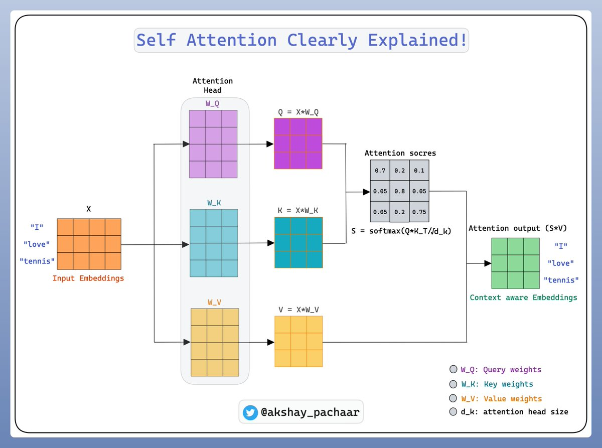

> **Note:**
**"*Attention mechanisms are a fundamental breakthrough in how we design and train models, allowing us to better capture the nuances of data.*" — Yann LeCun**

> **Note:**
*Chapter 9 of DLVR provides a comprehensive exploration of self-attention mechanisms and their integration into both Convolutional Neural Networks (CNNs) and Recurrent Neural Networks (RNNs). It begins with an introduction to the concept of self-attention, highlighting its evolution from traditional attention mechanisms in RNNs to its role in modern deep learning models, and contrasting it with conventional convolutional and recurrent operations. The chapter then delves into the application of self-attention in CNNs, where it enhances feature extraction by dynamically focusing on different regions of an image, thereby improving tasks like image classification and object detection. Following this, the chapter explores the integration of self-attention in RNNs, emphasizing its ability to capture long-range dependencies and mitigate challenges such as the vanishing gradient problem. The discussion culminates with an in-depth analysis of Transformer models, which rely entirely on self-attention to process sequences in parallel, offering significant advantages in training efficiency and sequence modeling. Finally, the chapter provides practical guidance on training and optimizing self-attention models in Rust, covering essential techniques such as regularization, gradient clipping, and the use of transfer learning to enhance model performance. Throughout, readers are guided through hands-on implementation using Rust and the tch-rs and burn libraries, with practical examples that solidify their understanding of self-attention’s transformative impact on modern deep learning.*

# 9.1. Self-Attention Mechanisms

Self-attention mechanisms have emerged as a critical advancement in deep learning, offering a way for models to dynamically focus on different parts of their input sequences or images. In essence, self-attention allows each element of the input—whether a word in a sentence or a pixel in an image—to attend to other elements, learning contextual relationships across the entire input space. This capability enables the model to capture long-range dependencies efficiently, which is particularly valuable in tasks like natural language processing (NLP), image classification, and machine translation.

The concept of self-attention originated from traditional attention mechanisms used in Recurrent Neural Networks (RNNs). Initially, attention was applied to sequence-to-sequence models, where the goal was to align input tokens with output tokens in tasks like translation. However, as these mechanisms evolved, self-attention emerged as a more generalized approach. Unlike in RNNs, where the attention is directed between different sequences (such as between an input sentence and an output translation), self-attention applies the attention mechanism within a single sequence or image. This allows the model to determine the relative importance of each part of the input in relation to other parts, regardless of their position.

One of the primary differences between self-attention and traditional operations in convolutional neural networks (CNNs) or RNNs is the way the model processes input. CNNs rely on localized filters that slide over the image or sequence to capture spatial or temporal features. RNNs, on the other hand, use sequential processing, where information is passed from one time step to the next. In contrast, self-attention operates on the entire input at once, creating a direct relationship between each element and every other element. This enables self-attention mechanisms to capture long-range dependencies much more effectively, without being constrained by the local receptive fields of CNNs or the sequential processing of RNNs.

Mathematically, self-attention works by computing attention scores for each pair of elements in the input. Given an input sequence $X = (x_1, x_2, \dots, x_T)$, self-attention computes a set of queries $Q$, keys $K$, and values $V$, where each of these matrices is derived from the input $X$ through learned transformations. The attention score between two elements $x_i$ and $x_j$ is calculated as the scaled dot product of their query and key vectors:

$$
a_{i,j} = \frac{Q_i \cdot K_j^T}{\sqrt{d_k}}
$$

where $d_k$ is the dimensionality of the key vectors, and the dot product measures the similarity between the elements. These attention scores are then normalized using a softmax function to produce attention weights:

$$
\alpha_{i,j} = \frac{\exp(a_{i,j})}{\sum_{j'} \exp(a_{i,j'})}
$$

Finally, the output for each element is a weighted sum of the value vectors $V$, where the attention weights determine the contribution of each value:

$$
z_i = \sum_j \alpha_{i,j} V_j
$$

This formulation allows the model to assign different importance to each part of the input, enabling more context-aware processing. In tasks such as machine translation, for example, self-attention allows the model to understand how different words in a sentence relate to each other, making it easier to translate complex sentences where word order or grammatical structure differs between languages.

One of the key advantages of self-attention is its ability to process the input in parallel, unlike RNNs, which process sequences sequentially. This parallelism greatly speeds up training and inference, making self-attention models more scalable to large datasets. Additionally, self-attention models, such as the Transformer architecture, have shown state-of-the-art performance in tasks like machine translation and text generation, due to their ability to handle long-range dependencies and complex interactions within the input.

In the context of natural language processing (NLP) and RNN, self-attention is a mechanism that allows a model to selectively focus on different parts of the input sequence when processing each token. To illustrate this process, let’s consider the sentence “I love tennis.” In a self-attention-based model like a Transformer, each word in the sentence interacts with every other word, learning which words are most important for understanding each token.

We begin by converting the words into embeddings, which are dense vector representations of the tokens. Suppose we have a pre-trained embedding matrix or use the output of a previous layer to generate embeddings for the tokens "I," "love," and "tennis." Let’s denote these word embeddings as $X = [x_1, x_2, x_3]$, where each $x_i$ represents the vector embedding of the $i$-th word in the sentence. These embeddings might be initialized using pre-trained embeddings like GloVe or generated as part of the model's training process. So, for "I," "love," and "tennis," each token has an embedding $x_1$, $x_2$, and $x_3$, respectively, each being vectors in a high-dimensional space.


**Figure 1:** A simple example of self-attention computation.

Next, we compute the attention mechanism for this sequence of tokens using self-attention. The self-attention mechanism uses three key components for each token: query ($Q$), key ($K$), and value ($V$) vectors. These vectors are computed by applying learned weight matrices $W_Q$, $W_K$, and $W_V$ to the input embeddings $X$. Each of these matrices maps the input embeddings into new spaces where they can interact with each other more effectively.

Mathematically, we compute the query, key, and value matrices for all tokens in the sequence as follows:

$$
Q = X W_Q, \quad K = X W_K, \quad V = X W_V
$$

where $W_Q$, $W_K$, and $W_V$ are learnable parameter matrices, and $X$ is the matrix of input embeddings. Let’s assume the dimensionality of the embeddings is $d$, and each of $W_Q$, $W_K$, and $W_V$ is a $d \times d$ matrix. The query matrix $Q$ contains the query vectors for all tokens in the sequence, while $K$ contains the key vectors, and $V$ contains the value vectors.

Now, for each token in the sequence, the attention mechanism calculates a score that represents how much attention it should pay to every other token in the sequence. These scores are computed using the dot product between the query vector of the current token and the key vectors of all tokens in the sequence. The idea is to determine how relevant each word is in relation to the current word.

For example, if we want to compute the attention score for the word "love" (represented by its query vector $q_2$) in relation to the entire sequence, we calculate the dot products between $q_2$ and each key vector $k_1, k_2, k_3$, corresponding to the tokens "I," "love," and "tennis." The resulting scores, denoted as $a_{21}, a_{22}, a_{23}$, tell us how important the words "I," "love," and "tennis" are for understanding "love." These attention scores are computed as $a_{ij} = \frac{q_i \cdot k_j}{\sqrt{d_k}}$, where $a_{ij}$ is the attention score between the $i$-th token's query vector and the $j$-th token's key vector, and $d_k$ is the dimensionality of the key vectors. The division by $\sqrt{d_k}$ is used to stabilize gradients by scaling the dot product result.

Once we have computed the attention scores, we apply a softmax function to these scores to normalize them, converting them into attention weights. The softmax function ensures that the attention weights sum to 1, effectively representing how much focus the current token should place on other tokens in the sequence $\alpha_{ij} = \frac{\exp(a_{ij})}{\sum_{k} \exp(a_{ik})}$, where, $\alpha_{ij}$ represents the attention weight that the $I$-th token assigns to the $j$-th token.

After obtaining the attention weights, we use them to compute the weighted sum of the value vectors, producing a context-aware representation for each token. For instance, the new representation for the token "love" is computed as a weighted sum of the value vectors $v_1, v_2, v_3$, where the weights are the attention weights $\alpha_{21}, \alpha_{22}, \alpha_{23}$: $z_2 = \sum_{j} \alpha_{2j} v_j$. In this case, $z_2$ is the new context-aware embedding for the token "love." It incorporates information from all other tokens in the sequence, weighted by their importance as determined by the attention mechanism. This allows the model to understand "love" not just in isolation, but in relation to both "I" and "tennis," capturing the dependencies between the words.

The process is repeated for each token in the sequence, resulting in a new set of context-aware embeddings $Z = [z_1, z_2, z_3]$ for the entire sentence. These embeddings contain richer information because each token's representation now takes into account the relevant context from the entire sequence. The output embeddings $Z$ are then passed to the next layer of the model, which could be another attention layer or a feed-forward network, depending on the architecture.

Self-attention, originally developed for natural language processing (NLP) and RNNs, has also demonstrated significant potential in image-processing tasks, particularly when combined with convolutional neural networks (CNNs). In the context of NLP, self-attention allows a model to selectively focus on certain words in a sentence, based on their relevance to the current word. This mechanism not only captures relationships between nearby words but also between distant words, making it well-suited for tasks that require understanding long-range dependencies, such as machine translation or text summarization.

Similarly, when applied to images, self-attention provides the model with the ability to selectively focus on different parts of the image, enabling it to learn both local and global context simultaneously. In traditional CNNs, the model primarily focuses on local regions of the image, using convolutional filters to extract spatial features from small patches of pixels. While CNNs are excellent at capturing local patterns, they struggle with global context because each convolutional operation processes only a small receptive field at a time, leading to a limited understanding of the relationships between distant regions of the image.


**Figure 2:** Visual and textual self-attention combined for image QA (Credit to Microsoft Research).

Self-attention addresses this limitation by allowing each pixel or patch of an image to interact with all other pixels or patches, no matter how distant they are from each other. This enables the model to understand long-range dependencies and capture more holistic patterns within the image. For example, in an image segmentation task, where the goal is to label each pixel with its corresponding object or region, understanding the relationship between distant parts of the image is crucial. Self-attention can help the model recognize that even though two regions of an image may be far apart spatially, they may belong to the same object or share important contextual information.

Mathematically, the application of self-attention to images works similarly to how it operates in NLP. Let’s consider an input image, where each pixel or patch is first transformed into a feature vector through a CNN. We can denote these feature vectors as $X = [x_1, x_2, ..., x_n]$, where each $x_i$ represents the feature vector of a particular region (patch or pixel) in the image. Just like in NLP, self-attention uses query, key, and value matrices, $Q = X W_Q$, $K = X W_K$, and $V = X W_V$, to compute attention scores. These scores measure how much attention one part of the image should pay to every other part.

For each patch, the attention score between two regions $i$ and $j$ is computed using the dot product between their query and key vectors $a_{ij} = \frac{q_i \cdot k_j}{\sqrt{d_k}}$. In this case, $q_i$ and $k_j$ are the query and key vectors corresponding to regions $i$ and $j$, and $d_k$ is the dimensionality of the key vectors. After computing the attention scores, the softmax function is applied to normalize these scores, turning them into attention weights $\alpha_{ij} = \frac{\exp(a_{ij})}{\sum_{k} \exp(a_{ik})}$. These attention weights $\alpha_{ij}$ represent the degree to which region $i$ should attend to region $j$. The next step is to compute a context-aware embedding for each region by taking a weighted sum of the value vectors $z_i = \sum_{j} \alpha_{ij} v_j$.

In this way, each region $i$ receives information not only from its own local features but also from other distant regions in the image that are deemed relevant according to the attention mechanism. This allows the model to make more informed decisions when classifying or segmenting different regions of the image, as it can integrate both local and global information.

The following code implements and evaluates a neural network for MNIST digit classification using both a standard Convolutional Neural Network (CNN) and a CNN augmented with a self-attention mechanism. The scenario explores how adding self-attention can enhance the model's ability to focus on relevant regions of an image, potentially improving classification accuracy. The key features include a dataset downloader, the integration of self-attention as an optional component, and a training pipeline that compares the accuracy of models with and without self-attention.

```toml
[dependencies]
anyhow = "1.0"
tch = "0.12"
reqwest = { version = "0.11", features = ["blocking"] }
flate2 = "1.0"
tokio = { version = "1", features = ["full"] }
plotters = "0.3.7"
rand = "0.8.5"
```
```rust
use anyhow::{Result, Context};
use flate2::read::GzDecoder;
use std::{fs, fs::File, io::copy, path::Path};
use tch::{nn, nn::ModuleT, nn::OptimizerConfig, Device, Tensor, vision};
use reqwest;

// URLs for the MNIST dataset files
const MNIST_URLS: &[(&str, &str)] = &[
    // MNIST dataset URLs and corresponding local file paths
    ("https://ossci-datasets.s3.amazonaws.com/mnist/train-images-idx3-ubyte.gz", "data/train-images-idx3-ubyte"),
    ("https://ossci-datasets.s3.amazonaws.com/mnist/train-labels-idx1-ubyte.gz", "data/train-labels-idx1-ubyte"),
    ("https://ossci-datasets.s3.amazonaws.com/mnist/t10k-images-idx3-ubyte.gz", "data/t10k-images-idx3-ubyte"),
    ("https://ossci-datasets.s3.amazonaws.com/mnist/t10k-labels-idx1-ubyte.gz", "data/t10k-labels-idx1-ubyte"),
];

// Function to download and extract MNIST dataset files if they don't exist
async fn download_mnist() -> Result<()> {
    // Create data directory if it doesn't exist
    fs::create_dir_all("data").context("Failed to create data directory")?;

    for &(url, file_path) in MNIST_URLS {
        // Check if the file already exists
        if !Path::new(file_path).exists() {
            println!("Downloading {}...", url);
            let response = reqwest::get(url).await?;
            let bytes = response.bytes().await?;

            // Extract GZIP file
            let mut gz = GzDecoder::new(bytes.as_ref());
            let mut out_file = File::create(file_path).context("Failed to create MNIST file")?;
            copy(&mut gz, &mut out_file).context("Failed to extract MNIST file")?;
            println!("Downloaded and extracted to {}", file_path);
        } else {
            println!("File {} already exists, skipping download.", file_path);
        }
    }
    Ok(())
}

// Define the self-attention mechanism
#[derive(Debug)]
struct SelfAttention {
    query: nn::Linear, // Linear layer to compute query
    key: nn::Linear,   // Linear layer to compute key
    value: nn::Linear, // Linear layer to compute value
    out: nn::Linear,   // Linear layer for the output
}

impl SelfAttention {
    // Initialize the self-attention layer
    fn new(vs: &nn::Path, embed_size: i64) -> SelfAttention {
        let query = nn::linear(vs, embed_size, embed_size, Default::default());
        let key = nn::linear(vs, embed_size, embed_size, Default::default());
        let value = nn::linear(vs, embed_size, embed_size, Default::default());
        let out = nn::linear(vs, embed_size, embed_size, Default::default());
        SelfAttention { query, key, value, out }
    }

    // Forward pass for self-attention
    fn forward(&self, input: &Tensor) -> Tensor {
        let q = input.apply(&self.query); // Compute query
        let k = input.apply(&self.key);   // Compute key
        let v = input.apply(&self.value); // Compute value

        // Compute attention scores: QK^T / sqrt(d)
        let scores = q.matmul(&k.transpose(-2, -1)) / (q.size()[2] as f64).sqrt();
        let attn_weights = scores.softmax(-1, scores.kind()); // Softmax normalization

        // Compute attention output: softmax(QK^T)V
        let attn_output = attn_weights.matmul(&v);
        attn_output.apply(&self.out) // Apply output linear layer
    }
}

// CNN Model with optional self-attention
#[derive(Debug)]
struct Net {
    conv1: nn::Conv2D,             // First convolutional layer
    conv2: nn::Conv2D,             // Second convolutional layer
    fc1: nn::Linear,               // First fully connected layer
    fc2: nn::Linear,               // Second fully connected layer
    attention: Option<SelfAttention>, // Optional self-attention layer
}

impl Net {
    // Initialize the model, optionally adding self-attention
    fn new(vs: &nn::Path, use_attention: bool) -> Net {
        let conv1 = nn::conv2d(vs, 1, 32, 5, Default::default());
        let conv2 = nn::conv2d(vs, 32, 64, 5, Default::default());
        let fc1 = nn::linear(vs, 1024, 1024, Default::default());
        let fc2 = nn::linear(vs, 1024, 10, Default::default());
        let attention = if use_attention {
            Some(SelfAttention::new(vs, 1024)) // Add self-attention layer
        } else {
            None
        };
        Net { conv1, conv2, fc1, fc2, attention }
    }
}

// Forward pass for the model
impl nn::ModuleT for Net {
    fn forward_t(&self, xs: &Tensor, train: bool) -> Tensor {
        let mut x = xs.view([-1, 1, 28, 28]) // Reshape input to image dimensions
            .apply(&self.conv1)              // Apply first convolution
            .max_pool2d_default(2)           // Max pooling
            .apply(&self.conv2)              // Apply second convolution
            .max_pool2d_default(2)           // Max pooling
            .view([-1, 1024])                // Flatten
            .apply(&self.fc1)                // Apply first linear layer
            .relu()                          // ReLU activation
            .dropout(0.5, train);            // Dropout for regularization

        // Apply self-attention if enabled
        if let Some(attention) = &self.attention {
            x = x.view([-1, 1, 1024]);       // Add sequence dimension
            x = attention.forward(&x);       // Apply self-attention
            x = x.view([-1, 1024]);          // Flatten back
        }

        x.apply(&self.fc2)                   // Apply second linear layer for classification
    }
}

// Train and evaluate the model
fn run_model(use_attention: bool) -> Result<f64> {
    let m = vision::mnist::load_dir("data")?; // Load MNIST dataset
    let vs = nn::VarStore::new(Device::cuda_if_available());
    let net = Net::new(&vs.root(), use_attention); // Initialize model
    let mut opt = nn::Adam::default().build(&vs, 1e-4)?; // Optimizer

    // Normalize data
    let train_images = m.train_images.view([-1, 1, 28, 28]) / 255.0;
    let train_labels = m.train_labels;
    let test_images = m.test_images.view([-1, 1, 28, 28]) / 255.0;
    let test_labels = m.test_labels;

    // Train the model
    for epoch in 1..=10 {
        for (bimages, blabels) in train_images.split(256, 0).zip(train_labels.split(256, 0)) {
            let loss = net.forward_t(&bimages, true).cross_entropy_for_logits(&blabels);
            opt.backward_step(&loss);
        }

        // Evaluate test accuracy
        let test_accuracy = net.batch_accuracy_for_logits(&test_images, &test_labels, vs.device(), 1024);
        println!("Epoch: {:4}, Test Accuracy: {:5.2}%", epoch, 100. * test_accuracy);
    }

    // Return final accuracy
    let final_accuracy = net.batch_accuracy_for_logits(&test_images, &test_labels, vs.device(), 1024);
    Ok(100. * final_accuracy)
}

#[tokio::main]
async fn main() -> Result<()> {
    download_mnist().await?; // Download dataset

    println!("Running model without self-attention...");
    let accuracy_no_attention = run_model(false)?; // Train and test without self-attention
    println!("Final Test Accuracy without self-attention: {:.2}%", accuracy_no_attention);

    println!("Running model with self-attention...");
    let accuracy_with_attention = run_model(true)?; // Train and test with self-attention
    println!("Final Test Accuracy with self-attention: {:.2}%", accuracy_with_attention);

    Ok(())
}
```

The code begins by downloading and preparing the MNIST dataset, ensuring that data files are available locally. It defines a CNN model (`Net`) with two convolutional layers and two fully connected layers, optionally incorporating a self-attention mechanism for enhanced feature extraction. The self-attention layer computes attention scores using the query-key-value mechanism to emphasize important features. The `run_model` function trains the model, evaluates its accuracy, and reports results for models with and without self-attention. The `main` function orchestrates the process by first downloading the dataset and then executing training and evaluation for both configurations, allowing for a direct comparison of their performance.

The self-attention mechanism is particularly valuable in complex image processing tasks, such as image segmentation, object detection, and image generation. For example, in segmentation tasks, where the goal is to assign each pixel to a specific class (e.g., distinguishing between objects like cars, trees, and roads in a street scene), capturing the global context is crucial. Self-attention enables the model to recognize that different parts of an object (such as the front and back of a car) are related, even if they are far apart in the pixel space, leading to more accurate segmentation.

In image generation tasks, self-attention can be used to improve the coherence of generated images by ensuring that distant parts of the image are contextually consistent. For example, in generating a landscape image, the model can ensure that the colors and textures of the sky, mountains, and water are harmonized, even though these elements may be far apart in the image. This is something that traditional CNNs struggle with, as they lack the ability to capture long-range dependencies across the image.

Overall, self-attention allows models to overcome the limitations of local receptive fields in CNNs by enabling each region of the image to attend to other relevant regions, regardless of their spatial distance. This enhances the model's ability to capture both fine-grained details and high-level, global structures, making it more effective in a variety of image processing tasks. Just as self-attention revolutionized NLP by allowing models to capture long-range dependencies in text, it is now playing a similar role in advancing the state of the art in computer vision.

In conclusion, self-attention mechanisms have revolutionized deep learning by allowing models to focus on the most relevant parts of the input, improving performance in tasks that require capturing long-range dependencies. By processing the entire input in parallel and dynamically computing attention weights, self-attention provides a more flexible and powerful approach to sequence and image modeling than traditional convolutional or recurrent operations.

# 9.2. Self-Attention in Convolutional Neural Networks (CNNs)

Self-attention mechanisms, originally developed for natural language processing tasks, have found a powerful application in Convolutional Neural Networks (CNNs), particularly in enhancing feature extraction and improving spatial awareness. Traditionally, CNNs rely on localized convolutional filters to scan across the input image and capture local patterns. These filters are spatially constrained, focusing on fixed receptive fields that cover small, local regions of the image. While this approach is effective for capturing low-level features like edges or textures, it becomes less efficient when the model needs to capture global dependencies or relationships between distant parts of the image. By integrating self-attention mechanisms into CNNs, it is possible to address these limitations by allowing the model to dynamically focus on relevant regions of the image, regardless of their spatial proximity.

The integration of self-attention into CNN architectures involves adding attention layers that compute attention weights over different regions of the image, enabling the model to emphasize important parts of the image while downplaying less relevant areas. In this setup, self-attention layers are typically placed alongside or on top of convolutional layers to complement the feature extraction process. The convolutional layers capture local features through their filters, while the self-attention layers capture global relationships by computing attention scores between different spatial locations in the image. This combination allows the model to gain a more holistic understanding of the input.

Mathematically, self-attention in CNNs works similarly to how it operates in sequences, with some modifications to account for the spatial structure of images. Given an input feature map $X$ of dimensions $H \times W \times C$ (height, width, and channels), where each spatial location contains a feature vector, the self-attention mechanism computes a set of query ($Q$), key ($K$), and value ($V$) matrices. These matrices are learned projections of the input feature map, where $Q$, $K$, and $V$ are derived from the feature map by applying separate convolutional layers. The attention scores between different spatial locations $i$ and $j$ are computed as:

$$
a_{i,j} = \frac{Q_i \cdot K_j^T}{\sqrt{d_k}}
$$

Here, $Q_i$ and $K_j$ represent the query and key vectors at spatial locations $i$ and $j$, and $d_k$ is the dimensionality of the key vectors. The attention scores $a_{i,j}$ represent the degree of similarity between different regions in the image, and these scores are normalized using a softmax function to produce attention weights:

$$
\alpha_{i,j} = \frac{\exp(a_{i,j})}{\sum_{j'} \exp(a_{i,j'})}
$$

Finally, the output feature for each spatial location is computed as a weighted sum of the value vectors:

$$
z_i = \sum_j \alpha_{i,j} V_j
$$

This process allows the model to aggregate information from different parts of the image dynamically, enabling it to focus on the most relevant regions for a given task, such as image classification or object detection.

Self-attention layers, when added to CNNs, significantly enhance the model's spatial awareness. In image classification tasks, for example, a self-attention CNN can focus on the most salient parts of the image, such as the object itself while ignoring background noise. This capability improves the model's interpretability, as attention maps can reveal which regions of the image the model considers important for making a prediction. In object detection, self-attention helps the model capture relationships between distant objects or between an object and its surroundings, leading to more accurate bounding box predictions.

From a conceptual standpoint, self-attention complements convolutional layers by introducing dynamic weighting across different regions of the image. Convolutional operations are limited by their fixed receptive fields, which focus on localized patterns. While deeper CNN architectures can capture larger receptive fields, they do so indirectly through stacking layers and often struggle with capturing global context efficiently. Self-attention, on the other hand, enables the model to capture both local and global dependencies directly, allowing for a more flexible and powerful feature extraction process. By assigning attention weights dynamically, self-attention layers allow the model to prioritize the most relevant regions, leading to better performance in tasks requiring spatial awareness.

One of the trade-offs when integrating self-attention into CNNs is the increased computational complexity. Computing attention scores between all pairs of spatial locations introduce a quadratic scaling factor with respect to the image size, which can become computationally expensive, particularly for high-resolution images. This increased complexity can slow down training and inference times. However, the improvements in performance and the ability to capture long-range dependencies often justify the additional computational cost, especially in tasks where spatial relationships are critical.

The code implements a ResNet-50 architecture for image classification on the CIFAR-10 dataset, enhanced with a Self-Attention Mechanism to improve its ability to capture long-range dependencies within image feature maps. ResNet-50 is a well-known convolutional neural network model that uses residual blocks to enable deep architectures by mitigating vanishing gradient issues. The addition of self-attention in residual blocks augments the standard convolutional layers by dynamically re-weighting feature interactions, which is especially beneficial for capturing global contextual information. The CIFAR-10 dataset, consisting of 60,000 32x32 color images across 10 classes, is used to train and evaluate the model.

```toml
[dependencies]
anyhow = "1.0"
tch = "0.12"
reqwest = { version = "0.11", features = ["blocking"] }
flate2 = "1.0"
tokio = { version = "1", features = ["full"] }
plotters = "0.3.7"
rand = "0.8.5"
tar = "0.4.43"
```
```rust
use anyhow::{Result, Context};
use flate2::read::GzDecoder;
use reqwest;
use std::{fs, path::Path};
use tar::Archive;
use tch::{nn, nn::ModuleT, nn::OptimizerConfig, Device, Tensor, vision};

/// URL for the CIFAR-10 dataset
const CIFAR10_URL: &str = "https://www.cs.toronto.edu/~kriz/cifar-10-binary.tar.gz";

/// Function to download and extract the CIFAR-10 dataset.
async fn download_cifar10() -> Result<()> {
    let dest = "data/cifar10";
    if Path::new(&format!("{}/test_batch.bin", dest)).exists() {
        println!("CIFAR-10 dataset already exists, skipping download.");
        return Ok(());
    }

    fs::create_dir_all(dest).context("Failed to create data directory")?;

    println!("Downloading CIFAR-10 dataset...");
    let response = reqwest::get(CIFAR10_URL).await?;
    let bytes = response.bytes().await?;
    let tar_gz = GzDecoder::new(&bytes[..]);
    let mut archive = Archive::new(tar_gz);

    println!("Extracting CIFAR-10 dataset...");
    archive.unpack("data")?;

    println!("CIFAR-10 dataset downloaded and extracted successfully.");
    Ok(())
}

// Define a Self-Attention Module
#[derive(Debug)]
struct SelfAttention {
    query: nn::Linear,
    key: nn::Linear,
    value: nn::Linear,
    scale: f64,
}

impl SelfAttention {
    fn new(vs: &nn::Path, embed_dim: i64) -> SelfAttention {
        let query = nn::linear(vs, embed_dim, embed_dim, Default::default());
        let key = nn::linear(vs, embed_dim, embed_dim, Default::default());
        let value = nn::linear(vs, embed_dim, embed_dim, Default::default());
        let scale = (embed_dim as f64).sqrt();

        SelfAttention { query, key, value, scale }
    }

    fn forward(&self, xs: &Tensor) -> Tensor {
        let q = xs.apply(&self.query);
        let k = xs.apply(&self.key);
        let v = xs.apply(&self.value);

        let attn_scores = q.matmul(&k.transpose(-2, -1)) / self.scale; // Compute attention scores
        let attn_weights = attn_scores.softmax(-1, tch::Kind::Float); // Softmax over the last dimension
        attn_weights.matmul(&v) // Weighted sum of values
    }
}

// Define the Residual Block with Self-Attention
#[derive(Debug)]
struct ResidualBlock {
    conv1: nn::Conv2D,
    bn1: nn::BatchNorm,
    conv2: nn::Conv2D,
    bn2: nn::BatchNorm,
    conv3: nn::Conv2D,
    bn3: nn::BatchNorm,
    self_attention: SelfAttention, // Add Self-Attention
    shortcut: Option<nn::Conv2D>,
}

impl ResidualBlock {
    fn new(
        vs: &nn::Path,
        in_channels: i64,
        out_channels: i64,
        stride: i64,
        shortcut: Option<nn::Conv2D>,
    ) -> ResidualBlock {
        let conv1 = nn::conv2d(vs, in_channels, out_channels / 4, 1, Default::default());
        let bn1 = nn::batch_norm2d(vs, out_channels / 4, Default::default());
        let conv2 = nn::conv2d(
            vs,
            out_channels / 4,
            out_channels / 4,
            3,
            nn::ConvConfig { stride, padding: 1, ..Default::default() },
        );
        let bn2 = nn::batch_norm2d(vs, out_channels / 4, Default::default());
        let conv3 = nn::conv2d(vs, out_channels / 4, out_channels, 1, Default::default());
        let bn3 = nn::batch_norm2d(vs, out_channels, Default::default());
        let self_attention = SelfAttention::new(vs, out_channels); // Initialize Self-Attention

        ResidualBlock {
            conv1,
            bn1,
            conv2,
            bn2,
            conv3,
            bn3,
            self_attention,
            shortcut,
        }
    }

    fn forward(&self, xs: &Tensor, train: bool) -> Tensor {
        let shortcut = match &self.shortcut {
            Some(sc) => xs.apply(sc),
            None => xs.shallow_clone(),
        };

        let res = xs
            .apply(&self.conv1)
            .apply_t(&self.bn1, train)
            .relu()
            .apply(&self.conv2)
            .apply_t(&self.bn2, train)
            .relu()
            .apply(&self.conv3)
            .apply_t(&self.bn3, train);

        let attended_res = self.self_attention.forward(&res); // Apply Self-Attention
        attended_res + shortcut
    }
}

// Wrapper for ResidualBlock
#[derive(Debug)]
struct ResidualBlockWrapper {
    block: ResidualBlock,
}

impl ResidualBlockWrapper {
    fn new(
        vs: &nn::Path,
        in_channels: i64,
        out_channels: i64,
        stride: i64,
        shortcut: Option<nn::Conv2D>,
    ) -> Self {
        Self {
            block: ResidualBlock::new(vs, in_channels, out_channels, stride, shortcut),
        }
    }
}

impl nn::Module for ResidualBlockWrapper {
    fn forward(&self, xs: &Tensor) -> Tensor {
        self.block.forward(xs, false)
    }
}

// Define the ResNet-50 architecture.
#[derive(Debug)]
struct ResNet50 {
    conv1: nn::Conv2D,
    bn1: nn::BatchNorm,
    layers: nn::Sequential,
    fc: nn::Linear,
}

impl ResNet50 {
    fn new(vs: &nn::Path) -> ResNet50 {
        let conv1 = nn::conv2d(
            vs,
            3,
            64,
            7,
            nn::ConvConfig {
                stride: 2,
                padding: 3,
                ..Default::default()
            },
        );
        let bn1 = nn::batch_norm2d(vs, 64, Default::default());

        let mut layers = nn::seq();
        layers = layers
            .add(build_residual_block(vs, 64, 256, 3, 1))
            .add(build_residual_block(vs, 256, 512, 4, 2))
            .add(build_residual_block(vs, 512, 1024, 6, 2))
            .add(build_residual_block(vs, 1024, 2048, 3, 2));

        let fc = nn::linear(vs, 2048, 10, Default::default());

        ResNet50 {
            conv1,
            bn1,
            layers,
            fc,
        }
    }
}

impl nn::ModuleT for ResNet50 {
    fn forward_t(&self, xs: &Tensor, train: bool) -> Tensor {
        xs.apply(&self.conv1)
            .apply_t(&self.bn1, train)
            .relu()
            .max_pool2d(&[3, 3], &[2, 2], &[1, 1], &[1, 1], false)
            .apply_t(&self.layers, train)
            .adaptive_avg_pool2d(&[1, 1])
            .view([-1, 2048])
            .apply(&self.fc)
    }
}

// Function to build a series of residual blocks.
fn build_residual_block(
    vs: &nn::Path,
    in_channels: i64,
    out_channels: i64,
    blocks: i64,
    stride: i64,
) -> nn::Sequential {
    let mut layer = nn::seq();
    let shortcut = if stride != 1 || in_channels != out_channels {
        Some(nn::conv2d(
            vs,
            in_channels,
            out_channels,
            1,
            nn::ConvConfig {
                stride,
                ..Default::default()
            },
        ))
    } else {
        None
    };

    layer = layer.add(ResidualBlockWrapper::new(
        vs,
        in_channels,
        out_channels,
        stride,
        shortcut,
    ));
    for _ in 1..blocks {
        layer = layer.add(ResidualBlockWrapper::new(vs, out_channels, out_channels, 1, None));
    }
    layer
}

// Function to train and test the ResNet-50 model on the CIFAR-10 dataset.
fn run_resnet50() -> Result<()> {
    // Load the CIFAR-10 dataset.
    let cifar_data = vision::cifar::load_dir("data/cifar10")?;

    // Use GPU if available, otherwise use CPU.
    let vs = nn::VarStore::new(Device::cuda_if_available());
    let net = ResNet50::new(&vs.root()); // Initialize the ResNet-50 model.
    let mut opt = nn::Sgd::default().build(&vs, 0.01)?; // Set up SGD optimizer.

    // Reshape and normalize the training and test images.
    let train_images = cifar_data.train_images / 255.0;
    let train_labels = cifar_data.train_labels;
    let test_images = cifar_data.test_images / 255.0;
    let test_labels = cifar_data.test_labels;

    // Training loop for the ResNet-50 model.
    for epoch in 1..=20 {
        for (bimages, blabels) in train_images.split(128, 0).into_iter().zip(train_labels.split(128, 0).into_iter()) {
            let loss = net.forward_t(&bimages, true).cross_entropy_for_logits(&blabels);
            opt.backward_step(&loss); // Backpropagation step.
        }

        // Calculate and print test accuracy at the end of each epoch.
        let test_accuracy = net.batch_accuracy_for_logits(&test_images, &test_labels, vs.device(), 256);
        println!("Epoch: {:4}, Test Accuracy: {:5.2}%", epoch, 100. * test_accuracy);
    }
    Ok(())
}

#[tokio::main]
async fn main() -> Result<()> {
    // Ensure the CIFAR-10 dataset is downloaded and extracted.
    download_cifar10().await?;

    // Run the ResNet-50 model training.
    run_resnet50()
}
```

The code begins by downloading and extracting the CIFAR-10 dataset if it does not already exist. A modified ResNet-50 model is implemented with residual blocks that integrate self-attention layers, which compute attention scores to highlight relevant features across the input tensor. Each residual block combines the outputs of convolutions, batch normalization, and self-attention with a shortcut connection to preserve information. The training loop optimizes the model using stochastic gradient descent (SGD) and evaluates its accuracy on the test set at the end of each epoch. The `SelfAttention` module plays a pivotal role in enhancing the model's feature extraction capabilities by incorporating both local and global relationships in the data.

Once implemented, this self-attention CNN can be trained on image datasets, such as MNIST, CIFAR-10 or ImageNet, to evaluate its performance in image classification tasks. By experimenting with different configurations, such as varying the number of attention heads or adjusting the position of the attention layers within the network, it is possible to optimize the model for different tasks. For instance, adding more attention heads can allow the model to capture more complex relationships between different regions of the image, while placing attention layers earlier in the network may help capture global context before extracting finer details.

In conclusion, integrating self-attention mechanisms into CNNs provides a powerful way to enhance feature extraction by allowing the model to dynamically focus on different parts of the image. This capability improves the model's spatial awareness and interpretability, making it particularly useful for tasks like image classification, object detection, and image segmentation. While the increased computational complexity of self-attention introduces some trade-offs, the improvements in performance and the ability to capture long-range dependencies make it a valuable addition to CNN architectures. Implementing self-attention CNNs in Rust using libraries like `tch-rs` allows developers to build high-performance models that leverage the strengths of both convolutional and attention-based operations.

# 9.3. Self-Attention in Recurrent Neural Networks (RNNs)

Self-attention mechanisms, when integrated with Recurrent Neural Networks (RNNs), provide an advanced framework for capturing long-range dependencies in sequential data more effectively than traditional RNNs. While standard RNNs, along with their gated variants such as Long Short-Term Memory (LSTM) networks and Gated Recurrent Units (GRUs), are well-suited for modeling temporal sequences, they often struggle with capturing dependencies across distant time steps due to issues such as vanishing gradients. Self-attention enhances RNNs by enabling the model to directly attend to any time step within the sequence, dynamically weighting the importance of different elements without relying solely on the hidden state propagation mechanism.

The architecture of a self-attention RNN incorporates attention layers within the recurrent framework. In a standard RNN, each time step $t$ updates a hidden state $h_t$ based on the input at that time and the hidden state from the previous time step $h_{t-1}$. This process inherently limits the ability of the RNN to retain and prioritize distant past information. However, by integrating self-attention, the model computes attention scores between the current hidden state $h_t$ and all previous hidden states $h_1, h_2, \dots, h_t$. These attention scores are used to assign weights to each time step, allowing the model to retrieve information from distant time steps as needed, rather than depending solely on sequential memory.

Mathematically, the self-attention mechanism within an RNN operates as follows. For each time step $t$, the model computes attention scores $a_{t,s}$ between the hidden state at time step $t$ and the hidden state at time step $s$, where $s \leq t$. These scores are calculated as the dot product between the query vector derived from $h_t$ and the key vector derived from $h_s$, scaled by the square root of the key dimension: $a_{t,s} = \frac{Q_t \cdot K_s^T}{\sqrt{d_k}}$. Here, $Q_t$ is the query vector for time step $t$, $K_s$ is the key vector for time step $s$, and $d_k$ is the dimensionality of the key vectors. The attention scores are then normalized using a softmax function to produce attention weights $\alpha_{t,s}$:

$$
\alpha_{t,s} = \frac{\exp(a_{t,s})}{\sum_{s'} \exp(a_{t,s'})}
$$

These attention weights are used to compute a weighted sum of the value vectors $V_s$, where the value vectors are derived from the hidden states of the RNN. The final output of the attention mechanism at time step $t$ is:

$$
z_t = \sum_s \alpha_{t,s} V_s
$$

This context vector $z_t$ is then combined with the hidden state $h_t$ to produce a more contextually aware representation, improving the model’s ability to capture long-range dependencies. This combination can be achieved through simple concatenation or by passing $z_t$ through a feed-forward layer.

The benefits of self-attention in RNNs are particularly evident in tasks that require context awareness over long sequences. In traditional RNNs, the model relies heavily on the hidden states, which are propagated through time, to retain past information. However, as the sequence length increases, the effectiveness of this mechanism diminishes, making it difficult to capture dependencies between distant time steps. Self-attention mitigates this issue by allowing the model to attend directly to the relevant parts of the sequence, without relying solely on the hidden state. This is especially useful in tasks such as language modeling, machine translation, and time series prediction, where context from earlier parts of the sequence is crucial for making accurate predictions.

One of the key roles of self-attention in RNNs is to overcome the vanishing gradient problem, a challenge faced by traditional RNNs when trying to learn long-term dependencies. In standard RNNs, gradients are propagated through time, but as the sequence length grows, the gradients diminish exponentially, making it difficult for the model to learn from distant past information. Self-attention alleviates this by providing direct paths for information flow between distant time steps, reducing the reliance on gradient propagation through many intermediate time steps.

While the integration of self-attention improves the performance of RNNs, it also introduces trade-offs in terms of computational complexity and training time. Standard RNNs process the sequence sequentially, with each time step depending on the previous one. Self-attention, on the other hand, requires computing attention scores for every pair of time steps, leading to a quadratic complexity with respect to the sequence length. This increases the computational cost of the model, especially for long sequences. However, the improvements in accuracy and the ability to capture long-range dependencies often justify the additional computational expense.

The provided code implements a character-level language model using a Bidirectional LSTM combined with a self-attention mechanism to enhance sequence modeling capabilities. The Bidirectional LSTM captures forward and backward context, allowing the model to understand dependencies in both directions within the text. The self-attention mechanism further refines these representations by dynamically weighting sequence elements based on their relevance to others, enabling the model to focus on the most informative parts of the input. This integration of LSTM and self-attention makes the model robust for tasks like text generation, where long-range dependencies and contextual relevance are crucial. The code includes dataset downloading, preprocessing, training, sampling, and loss optimization steps.

```rust
use anyhow::Result;
use std::fs;
use std::path::Path;
use tch::data::TextData;
use tch::nn::{self, Linear, Module, OptimizerConfig, RNN};
use tch::{Device, Kind, Tensor};
use reqwest;

// Constants for training configuration
const LEARNING_RATE: f64 = 0.01;
const HIDDEN_SIZE: i64 = 256; // Hidden size for each direction
const BIDIRECTIONAL_HIDDEN_SIZE: i64 = HIDDEN_SIZE * 2; // Total hidden size (forward + backward)
const SEQ_LEN: i64 = 180;
const BATCH_SIZE: i64 = 256;
const EPOCHS: i64 = 50; // Reduced for demonstration
const SAMPLING_LEN: i64 = 1024;
const DROPOUT_RATE: f64 = 0.3; // Dropout rate for regularization
const GRAD_CLIP_NORM: f64 = 5.0; // Gradient clipping threshold
const DATASET_URL: &str = "https://raw.githubusercontent.com/karpathy/char-rnn/master/data/tinyshakespeare/input.txt";
const DATA_PATH: &str = "data/input.txt";

// Downloads the dataset if it doesn't exist locally.
fn download_dataset() -> Result<()> {
    let path = Path::new(DATA_PATH);
    if !path.exists() {
        println!("Downloading dataset...");
        let content = reqwest::blocking::get(DATASET_URL)?.text()?;
        fs::create_dir_all(path.parent().unwrap())?;
        fs::write(path, content)?;
        println!("Dataset downloaded and saved to {}", DATA_PATH);
    } else {
        println!("Dataset already exists at {}", DATA_PATH);
    }
    Ok(())
}

// Self-attention module
fn self_attention(input: &Tensor, hidden_size: i64) -> Tensor {
    let query = input.matmul(&Tensor::randn(&[hidden_size, hidden_size], (Kind::Float, input.device())));
    let key = input.matmul(&Tensor::randn(&[hidden_size, hidden_size], (Kind::Float, input.device())));
    let value = input.matmul(&Tensor::randn(&[hidden_size, hidden_size], (Kind::Float, input.device())));

    let scores = query.matmul(&key.transpose(-2, -1)) / (hidden_size as f64).sqrt();
    let weights = scores.softmax(-1, Kind::Float);
    weights.matmul(&value)
}

// Generate sample text using the trained Bidirectional LSTM with self-attention.
fn sample(data: &TextData, lstm: &nn::LSTM, linear: &Linear, device: Device, temperature: f64) -> String {
    let labels = data.labels();
    let mut state = lstm.zero_state(1); // Initialize LSTM state
    let mut last_label = 0i64; // Start with the first label
    let mut result = String::new();

    for _ in 0..SAMPLING_LEN {
        let input = Tensor::zeros([1, labels], (Kind::Float, device)); // One-hot input
        let _ = input.narrow(1, last_label, 1).fill_(1.0); // Set the input for the last label

        // Step through the LSTM and update state
        state = lstm.step(&input.unsqueeze(0), &state);

        // Get a reference to the hidden state (first tensor) from the LSTM state
        let hidden = &state.0.0; // Access first element (hidden state)

        // Apply self-attention mechanism
        let attended = self_attention(hidden, BIDIRECTIONAL_HIDDEN_SIZE);

        // Pass through the output layer and apply temperature scaling
        let logits = linear.forward(&attended);
        let adjusted_logits = logits / temperature;
        let sampled_y = adjusted_logits
            .softmax(-1, Kind::Float)
            .multinomial(1, false)
            .int64_value(&[0]);
        last_label = sampled_y;
        result.push(data.label_to_char(last_label)); // Append the sampled character
    }

    result
}

pub fn main() -> Result<()> {
    download_dataset()?;
    let device = Device::cuda_if_available();
    let vs = nn::VarStore::new(device);
    let data = TextData::new(DATA_PATH)?; // Load the text dataset
    let labels = data.labels(); // Number of unique labels (characters)
    println!("Dataset loaded, {labels} labels.");

    // Define the Bidirectional LSTM model and output layer with dropout
    let lstm_config = nn::RNNConfig {
        bidirectional: true, // Enable bidirectionality
        dropout: DROPOUT_RATE, // Add dropout for regularization
        ..Default::default()
    };
    let lstm = nn::lstm(&vs.root(), labels, HIDDEN_SIZE, lstm_config);
    let linear = nn::linear(&vs.root(), BIDIRECTIONAL_HIDDEN_SIZE, labels, Default::default());
    let mut opt = nn::Adam::default().build(&vs, LEARNING_RATE)?;

    let mut lr_schedule = LEARNING_RATE;

    for epoch in 1..=EPOCHS {
        let mut total_loss = 0.0;
        let mut batch_count = 0.0;

        for batch in data.iter_shuffle(SEQ_LEN + 1, BATCH_SIZE) {
            let xs = batch.narrow(1, 0, SEQ_LEN).onehot(labels);
            let ys = batch.narrow(1, 1, SEQ_LEN).to_kind(Kind::Int64);

            let (output, _) = lstm.seq(&xs.to_device(device));

            // Apply self-attention to the LSTM output
            let attended_output = self_attention(&output, BIDIRECTIONAL_HIDDEN_SIZE);

            let logits = linear.forward(&attended_output.reshape([-1, BIDIRECTIONAL_HIDDEN_SIZE]));
            let loss = logits.cross_entropy_for_logits(&ys.to_device(device).view([-1]));
            opt.zero_grad();
            loss.backward();

            for tensor in vs.trainable_variables() {
                let _ = tensor.grad().clamp_(-GRAD_CLIP_NORM, GRAD_CLIP_NORM); // Fix warning here
            }

            opt.step();

            total_loss += loss.double_value(&[]);
            batch_count += 1.0;
        }

        lr_schedule *= 0.95;
        opt.set_lr(lr_schedule);

        println!(
            "Epoch: {} | Loss: {:.4} | Learning Rate: {:.6}",
            epoch,
            total_loss / batch_count,
            lr_schedule
        );
        println!("Sample: {}", sample(&data, &lstm, &linear, device, 0.8));
    }

    Ok(())
}
```

The main workflow starts by downloading and preparing the Shakespeare dataset for character-level modeling. A Bidirectional LSTM is defined, which processes sequences in both forward and backward directions, producing contextual embeddings for each character in the input. The self-attention mechanism then enhances these embeddings by calculating attention weights using query, key, and value matrices, allowing the model to emphasize significant sequence elements dynamically. During training, the combined LSTM and attention outputs are passed through a linear layer for classification, with cross-entropy loss computed to guide optimization. For text generation, the model predicts one character at a time by feeding its outputs back into the network, producing coherent sequences based on the learned language patterns.

Lets learn other code for Machine Translation, which is a critical task in natural language processing (NLP) that involves automatically converting text from one language to another. We will implement a basic sequence-to-sequence (Seq2Seq) architecture to perform English-to-French translation. The challenge lies in capturing the semantic structure of the input language and producing grammatically correct sentences in the target language, all while preserving meaning. This task requires robust modeling of context and dependencies between words in the sequence, which is addressed using a Recurrent Neural Network (RNN) with Gated Recurrent Units (GRUs).

The implemented architecture consists of an encoder and a decoder. The encoder processes the input English sentence and compresses its information into a context vector. The decoder takes this context vector and generates the corresponding French sentence word by word. An attention mechanism could be added later to allow the decoder to focus on specific parts of the input sequence during generation. The code supports customizable vocabulary building, handles special tokens (`SOS`, `EOS`), and ensures clean preprocessing of text data. It uses PyTorch's `tch` library for defining and training the neural network components.

```text
i am hungry	je suis affamé
i am tired	je suis fatigué
i am happy	je suis heureux
i am sad	je suis triste
i am angry	je suis en colère
you are smart	tu es intelligent
you are kind	tu es gentil
you are brave	tu es courageux
you are strong	tu es fort
you are quick	tu es rapide
he is tall	il est grand
he is short	il est petit
he is young	il est jeune
he is old	il est vieux
he is funny	il est drôle
she is beautiful	elle est belle
she is kind	elle est gentille
she is strong	elle est forte
she is smart	elle est intelligente
she is shy	elle est timide
we are happy	nous sommes heureux
we are sad	nous sommes tristes
we are friends	nous sommes amis
we are family	nous sommes une famille
we are ready	nous sommes prêts
they are strong	ils sont forts
they are weak	ils sont faibles
they are students	ils sont étudiants
they are teachers	ils sont enseignants
they are happy	ils sont heureux
```

The code first preprocesses the input data by normalizing and filtering English-French sentence pairs based on length constraints and specific prefixes. It constructs vocabularies for both input (English) and output (French) languages using the `Lang` struct, which maps words to unique indices and tracks their frequencies. The `Dataset` struct pairs processed English sentences with their French counterparts, converting them into sequences of word indices suitable for training. The main function initializes the dataset, builds the vocabularies, and sets up the encoder for training.

```rust
use anyhow::{bail, Result};
use std::{
    collections::HashMap,
    fs::File,
    io::{BufRead, BufReader},
};
use tch::{nn, nn::Module, Device, Tensor};

// Constants
const MAX_LENGTH: usize = 10;
const PREFIXES: [&str; 12] = [
    "i am ", "i m ", "you are ", "you re", "he is ", "he s ", "she is ", "she s ", "we are ",
    "we re ", "they are ", "they re ",
];
const SOS_TOKEN: &str = "SOS";
const EOS_TOKEN: &str = "EOS";

/// Language structure
#[derive(Debug)]
pub struct Lang {
    name: String,
    word_to_index_and_count: HashMap<String, (usize, usize)>,
    index_to_word: HashMap<usize, String>,
}

impl Lang {
    pub fn new(name: &str) -> Lang {
        let mut lang = Lang {
            name: name.to_string(),
            word_to_index_and_count: HashMap::new(),
            index_to_word: HashMap::new(),
        };
        lang.add_word(SOS_TOKEN);
        lang.add_word(EOS_TOKEN);
        lang
    }

    fn add_word(&mut self, word: &str) {
        if !word.is_empty() {
            match self.word_to_index_and_count.get_mut(word) {
                None => {
                    let length = self.word_to_index_and_count.len();
                    self.word_to_index_and_count.insert(word.to_string(), (length, 1));
                    self.index_to_word.insert(length, word.to_owned());
                }
                Some((_, cnt)) => {
                    *cnt += 1;
                }
            }
        }
    }

    pub fn add_sentence(&mut self, sentence: &str) {
        for word in sentence.split_whitespace() {
            self.add_word(word);
        }
    }

    pub fn len(&self) -> usize {
        self.index_to_word.len()
    }

    pub fn sos_token(&self) -> usize {
        self.word_to_index_and_count.get(SOS_TOKEN).unwrap().0
    }

    pub fn eos_token(&self) -> usize {
        self.word_to_index_and_count.get(EOS_TOKEN).unwrap().0
    }

    pub fn name(&self) -> &str {
        &self.name
    }

    pub fn get_index(&self, word: &str) -> Option<usize> {
        self.word_to_index_and_count.get(word).map(|x| x.0)
    }

    pub fn seq_to_string(&self, seq: &[usize]) -> String {
        seq.iter()
            .map(|s| self.index_to_word.get(s).unwrap().to_string())
            .collect::<Vec<_>>()
            .join(" ")
    }
}

/// Dataset structure
#[derive(Debug)]
pub struct Dataset {
    input_lang: Lang,
    output_lang: Lang,
    pairs: Vec<(String, String)>,
}

impl Dataset {
    pub fn new(ilang: &str, olang: &str, max_length: usize) -> Result<Dataset> {
        let pairs = read_pairs(ilang, olang, max_length)?;
        let mut input_lang = Lang::new(ilang);
        let mut output_lang = Lang::new(olang);
        for (lhs, rhs) in &pairs {
            input_lang.add_sentence(lhs);
            output_lang.add_sentence(rhs);
        }
        Ok(Dataset {
            input_lang,
            output_lang,
            pairs,
        })
    }

    pub fn input_lang(&self) -> &Lang {
        &self.input_lang
    }

    pub fn output_lang(&self) -> &Lang {
        &self.output_lang
    }

    pub fn reverse(self) -> Self {
        Dataset {
            input_lang: self.output_lang,
            output_lang: self.input_lang,
            pairs: self.pairs.into_iter().map(|(x, y)| (y, x)).collect(),
        }
    }

    pub fn pairs(&self) -> Vec<(Vec<usize>, Vec<usize>)> {
        self.pairs
            .iter()
            .map(|(lhs, rhs)| {
                (to_indexes(lhs, &self.input_lang), to_indexes(rhs, &self.output_lang))
            })
            .collect::<Vec<_>>()
    }
}

/// Self-Attention Encoder
pub struct SelfAttentionEncoder {
    embedding: nn::Embedding,
    query_proj: nn::Linear,
    key_proj: nn::Linear,
    value_proj: nn::Linear,
    output_proj: nn::Linear,
    hidden_dim: i64,
}

impl SelfAttentionEncoder {
    pub fn new(vs: nn::Path, in_dim: usize, hidden_dim: usize) -> Self {
        let hidden_dim = hidden_dim as i64;
        SelfAttentionEncoder {
            embedding: nn::embedding(&vs, in_dim as i64, hidden_dim, Default::default()),
            query_proj: nn::linear(&vs, hidden_dim, hidden_dim, Default::default()),
            key_proj: nn::linear(&vs, hidden_dim, hidden_dim, Default::default()),
            value_proj: nn::linear(&vs, hidden_dim, hidden_dim, Default::default()),
            output_proj: nn::linear(&vs, hidden_dim, hidden_dim, Default::default()),
            hidden_dim,
        }
    }

    pub fn forward(&self, xs: &Tensor) -> Tensor {
        let embedded = self.embedding.forward(xs); // Shape: [seq_len, batch_size, hidden_dim]
        let queries = embedded.apply(&self.query_proj);
        let keys = embedded.apply(&self.key_proj);
        let values = embedded.apply(&self.value_proj);

        // Scaled Dot-Product Attention
        let scores = queries.matmul(&keys.transpose(-2, -1)) / (self.hidden_dim as f64).sqrt();
        let attention_weights = scores.softmax(-1, scores.kind());
        let attention_output = attention_weights.matmul(&values);

        // Project back to hidden_dim
        attention_output.apply(&self.output_proj)
    }
}

/// Helper functions
fn normalize(s: &str) -> String {
    s.to_lowercase()
        .chars()
        .map(|c| match c {
            '!' => " !".to_string(),
            '.' => " .".to_string(),
            '?' => " ?".to_string(),
            _ => {
                if c.is_alphanumeric() {
                    c.to_string()
                } else {
                    " ".to_string()
                }
            }
        })
        .collect()
}

fn filter_prefix(s: &str) -> bool {
    PREFIXES.iter().any(|prefix| s.starts_with(prefix))
}

fn to_indexes(s: &str, lang: &Lang) -> Vec<usize> {
    let mut res = s
        .split_whitespace()
        .filter_map(|word| lang.get_index(word))
        .collect::<Vec<_>>();
    res.push(lang.eos_token());
    res
}

fn read_pairs(ilang: &str, olang: &str, max_length: usize) -> Result<Vec<(String, String)>> {
    let file = File::open(format!("data/{ilang}-{olang}.txt"))?;
    let mut res = Vec::new();
    for line in BufReader::new(file).lines() {
        let line = line?;
        match line.split('\t').collect::<Vec<_>>().as_slice() {
            [lhs, rhs] => {
                let lhs = normalize(lhs);
                let rhs = normalize(rhs);
                if lhs.split_whitespace().count() < max_length
                    && rhs.split_whitespace().count() < max_length
                    && (filter_prefix(&lhs) || filter_prefix(&rhs))
                {
                    res.push((lhs, rhs));
                }
            }
            _ => bail!("Invalid line format: {}", line),
        }
    }
    Ok(res)
}

fn main() -> Result<()> {
    let dataset = Dataset::new("eng", "fra", MAX_LENGTH)?.reverse();
    let ilang = &dataset.input_lang;
    println!("Input vocabulary size: {}", ilang.len());

    // Initialize model
    let device = Device::cuda_if_available();
    let vs = nn::VarStore::new(device);
    let encoder = SelfAttentionEncoder::new(vs.root(), ilang.len(), 256);

    // Fixed tensor creation
    let input = Tensor::randint(ilang.len() as i64, &[MAX_LENGTH as i64], (tch::Kind::Int64, device));
    let output = encoder.forward(&input);

    println!("Self-attention output shape: {:?}", output.size());
    Ok(())
}
```

The encoder is implemented as a GRU-based RNN. Each word in the input sequence is passed through an embedding layer, transforming it into a dense vector. These embeddings are sequentially processed by the GRU, which produces a hidden state at each step that captures contextual information about the sequence. The final hidden state from the encoder is passed to the decoder. While the code primarily defines the encoder, a corresponding decoder would take this hidden state, initialize its RNN, and generate the translated sequence using the French vocabulary. The code outputs the vocabulary sizes, showing the readiness of the dataset and model for training. Inputs are expected in the form of English sentences that conform to the predefined prefixes and vocabulary, and the model generates French sentences as output.

The self-attention mechanism in the code above enables the model to focus on relevant parts of the input sequence while processing it. It computes a set of queries, keys, and values from the embedded input sequence, applies a scaled dot-product operation between the queries and keys to measure the importance of each word in the sequence, and uses these scores to weight the values. This mechanism allows the encoder to capture relationships between all words in the sequence, regardless of their positions, enabling the model to understand contextual dependencies more effectively. The benefit of self-attention lies in its ability to process input sequences in parallel, making it computationally efficient and better at capturing long-range dependencies compared to sequential models like RNNs or GRUs. This enhances the model's performance in tasks like machine translation, where the meaning of a word often depends on distant context.

Once implemented, this self-attention RNN can be trained on sequential datasets such as text or time series data to evaluate its ability to capture long-range dependencies. By experimenting with different configurations of the attention mechanism, such as varying the attention window size or adding multiple attention heads, it is possible to optimize the model for different tasks. For example, a larger attention window might improve performance in tasks where distant past information is critical, while adding more attention heads can enable the model to capture multiple aspects of the sequence.

In summary, integrating self-attention into RNNs provides a powerful way to enhance the model’s ability to focus on relevant parts of long sequences, improving performance on tasks that require capturing long-range dependencies. While the increased computational complexity introduces some trade-offs, the benefits in terms of accuracy and context-awareness make self-attention RNNs an important tool for sequence modeling tasks. Implementing these models in Rust using libraries like `tch-rs` allows developers to build scalable, efficient models that leverage the strengths of both recurrent and attention-based mechanisms.

# 9.4. Transformer Models: The Ultimate Application of Self-Attention

Transformer models have revolutionized deep learning by entirely relying on self-attention mechanisms, replacing the need for traditional Recurrent Neural Networks (RNNs) and Convolutional Neural Networks (CNNs) in many sequence and image processing tasks. At their core, Transformers leverage self-attention to process input sequences in parallel, which dramatically improves training efficiency while enhancing the model’s ability to capture long-range dependencies in data. This has made Transformers the de facto standard for tasks like language modeling, machine translation, and text generation.

The architecture of Transformer models consists of several key components: multi-head attention, positional encoding, and feed-forward networks. In the self-attention mechanism, each token in the input sequence attends to every other token through attention weights, capturing relationships regardless of their distance. For each token, queries, keys, and values are computed, and attention scores are calculated as: $a_{i,j} = \frac{Q_i \cdot K_j^T}{\sqrt{d_k}}$, where $Q_i$ is the query vector for the $i$-th token, $K_j$ is the key vector for the $j$-th token, and $d_k$ is the dimensionality of the key vectors. These scores are normalized using the softmax function to generate attention weights:

$$
\alpha_{i,j} = \frac{\exp(a_{i,j})}{\sum_{j'} \exp(a_{i,j'})}
$$

The final output for each token is a weighted sum of the value vectors $V_j$: $z_i = \sum_j \alpha_{i,j} V_j$.

Multi-head attention is a key feature of Transformers. Instead of computing attention once, the input sequence is processed in parallel through multiple attention heads. Each head learns to capture different aspects of the relationships between tokens, allowing the model to focus on various parts of the sequence simultaneously. The outputs of the attention heads are concatenated and transformed to create a more robust representation of the input.

One challenge Transformers face is the lack of inherent positional information in the self-attention mechanism. Unlike RNNs, which process input sequentially, the self-attention mechanism processes all tokens in parallel, losing the notion of word order or token position. To address this, positional encoding is introduced, which adds position-specific information to the input tokens. This encoding allows the model to differentiate between tokens based on their positions in the sequence. The positional encoding is often represented as a set of sinusoidal functions:

$$
PE_{(pos, 2i)} = \sin\left(\frac{pos}{10000^{2i/d}}\right)
$$

$$
PE_{(pos, 2i+1)} = \cos\left(\frac{pos}{10000^{2i/d}}\right)
$$

where $pos$ is the position in the sequence, $i$ is the dimension index, and $d$ is the dimensionality of the model. These encodings are added to the input embeddings before applying the self-attention mechanism, preserving the sequential nature of the data.

The feed-forward networks in Transformers apply point-wise non-linearity to each token independently, further processing the self-attention outputs. The feed-forward layer typically consists of two linear layers with a ReLU activation function in between, ensuring that the model can learn complex transformations of the attention-weighted inputs.

Transformers have demonstrated their superiority over RNNs and CNNs in several ways. First, by processing sequences in parallel, Transformers eliminate the sequential bottleneck of RNNs, leading to significantly faster training, especially for long sequences. Second, the ability of multi-head attention to focus on different parts of the sequence simultaneously allows Transformers to capture complex relationships that RNNs might miss due to their inherent limitations with long-term dependencies. Finally, Transformers can be scaled efficiently by increasing the number of layers, attention heads, or model dimensions, which has led to state-of-the-art performance in tasks like language generation and machine translation with models such as GPT, BERT, and T5.

This code implements a modern character-level Transformer model designed for sequence modeling tasks, such as text generation or language modeling. The model uses advanced techniques, including rotary positional embeddings for improved token positional understanding and multi-head self-attention to capture contextual relationships between characters across sequences. Key features of the model include adaptive input embeddings, scalable multi-head attention with rotary embeddings, feed-forward layers with SwiGLU activation for efficient computation, and pre-norm layer structures. Additionally, a cosine learning rate scheduler with a warm-up phase is used to stabilize and optimize training.

```rust
/* This example uses the tinyshakespeare dataset which can be downloaded at:
   https://raw.githubusercontent.com/karpathy/char-rnn/master/data/tinyshakespeare/input.txt
*/

use anyhow::Result;
use tch::data::TextData;
use tch::nn::{self, Linear, Module};
use tch::{Device, Kind, Tensor};
use tch::nn::OptimizerConfig;

// Constants and hyperparameters
const LEARNING_RATE: f64 = 0.0001; // Learning rate for the optimizer
const HIDDEN_SIZE: i64 = 512; // Size of hidden embeddings
const NUM_HEADS: i64 = 8; // Number of attention heads
const NUM_LAYERS: i64 = 12; // Number of transformer layers
const FEEDFORWARD_SIZE: i64 = 2048; // Size of the feed-forward layer
const SEQ_LEN: i64 = 256; // Maximum sequence length
const BATCH_SIZE: i64 = 32; // Batch size for training
const EPOCHS: i64 = 100; // Number of training epochs
const WARMUP_STEPS: i64 = 4000; // Number of warmup steps for learning rate
const DROPOUT_RATE: f64 = 0.1; // Dropout rate for regularization
const DATA_PATH: &str = "data/input.txt"; // Path to the input data file

// Multi-head Attention mechanism
struct MultiHeadAttention {
    wq: Linear, // Linear layer to project input to query (Q)
    wk: Linear, // Linear layer to project input to key (K)
    wv: Linear, // Linear layer to project input to value (V)
    wo: Linear, // Linear layer to project output to original dimensions
    num_heads: i64, // Number of attention heads
    head_dim: i64, // Dimension of each attention head
    dropout: f64, // Dropout rate for attention probabilities
}

impl MultiHeadAttention {
    // Initializes the multi-head attention layer
    fn new(vs: &nn::Path, hidden_size: i64, num_heads: i64, dropout: f64) -> Self {
        let head_dim = hidden_size / num_heads; // Compute the size of each attention head
        let init = nn::LinearConfig {
            bias: false, // Disable biases for attention projections
            ..Default::default()
        };

        MultiHeadAttention {
            wq: nn::linear(vs / "wq", hidden_size, hidden_size, init),
            wk: nn::linear(vs / "wk", hidden_size, hidden_size, init),
            wv: nn::linear(vs / "wv", hidden_size, hidden_size, init),
            wo: nn::linear(vs / "wo", hidden_size, hidden_size, init),
            num_heads,
            head_dim,
            dropout,
        }
    }

    // Forward pass for multi-head attention
    fn forward_t(&self, x: &Tensor, mask: Option<&Tensor>) -> Tensor {
        let (batch_size, seq_len, _) = x.size3().unwrap();

        // Compute Q, K, V projections and reshape for multi-head computation
        let q = self.wq.forward(x)
            .reshape(&[batch_size, seq_len, self.num_heads, self.head_dim])
            .transpose(1, 2); // Shape: [batch_size, num_heads, seq_len, head_dim]
        let k = self.wk.forward(x)
            .reshape(&[batch_size, seq_len, self.num_heads, self.head_dim])
            .transpose(1, 2);
        let v = self.wv.forward(x)
            .reshape(&[batch_size, seq_len, self.num_heads, self.head_dim])
            .transpose(1, 2);

        // Apply rotary embeddings for positional information
        let positions = Tensor::arange(seq_len, (Kind::Float, x.device()));
        let freqs = positions
            .unsqueeze(-1)
            .repeat(&[1, self.head_dim / 2])
            * (-8.0f64 * (self.head_dim as f64).ln() / (self.head_dim as f64)).exp();
        let freqs = freqs
            .unsqueeze(0)
            .unsqueeze(0)
            .expand(&[batch_size, self.num_heads, seq_len, self.head_dim / 2], true);

        let q = apply_rotary_emb(&q, &freqs);
        let k = apply_rotary_emb(&k, &freqs);

        // Compute scaled dot-product attention
        let scale = 1.0 / (self.head_dim as f64).sqrt();
        let mut attn_scores = q.matmul(&k.transpose(-2, -1)) * scale;

        // Apply optional attention mask
        if let Some(mask) = mask {
            attn_scores = attn_scores + mask;
        }

        // Compute attention probabilities and apply to values (V)
        let attn_probs = attn_scores.softmax(-1, Kind::Float).dropout(self.dropout, true);
        let out = attn_probs.matmul(&v)
            .transpose(1, 2)
            .reshape(&[batch_size, seq_len, -1]);

        self.wo.forward(&out) // Project output back to original dimensions
    }
}

// Function to apply rotary embeddings for positional information
fn apply_rotary_emb(x: &Tensor, freq: &Tensor) -> Tensor {
    let half_head_dim = x.size4().unwrap().3 / 2;

    let x_real = x.narrow(-1, 0, half_head_dim);
    let x_imag = x.narrow(-1, half_head_dim, half_head_dim);

    let cos = freq.cos();
    let sin = freq.sin();

    let x_rot = &x_real * &cos - &x_imag * &sin;
    let x_pass = &x_imag * &cos + &x_real * &sin;

    Tensor::cat(&[x_rot, x_pass], -1) // Concatenate real and imaginary parts
}

// Feed-forward layer with SwiGLU activation
struct FeedForward {
    w1: Linear, // First linear layer
    w2: Linear, // Second linear layer for gated activation
    w3: Linear, // Third linear layer
    dropout: f64, // Dropout rate
}

impl FeedForward {
    // Initializes the feed-forward layer
    fn new(vs: &nn::Path, hidden_size: i64, feedforward_size: i64, dropout: f64) -> Self {
        FeedForward {
            w1: nn::linear(vs / "w1", hidden_size, feedforward_size, Default::default()),
            w2: nn::linear(vs / "w2", hidden_size, feedforward_size, Default::default()),
            w3: nn::linear(vs / "w3", feedforward_size, hidden_size, Default::default()),
            dropout,
        }
    }

    // Forward pass through the feed-forward layer
    fn forward(&self, x: &Tensor) -> Tensor {
        let x1 = self.w1.forward(x).silu(); // Apply activation to first layer
        let x2 = self.w2.forward(x); // Gated connection
        let swiglu = &x1 * &x2; // Element-wise multiplication for gating
        self.w3.forward(&swiglu).dropout(self.dropout, true)
    }
}

// Complete transformer layer consisting of attention and feed-forward components
struct TransformerLayer {
    attention: MultiHeadAttention,
    attention_norm: nn::LayerNorm, // Layer normalization for attention
    feedforward: FeedForward,
    feedforward_norm: nn::LayerNorm, // Layer normalization for feed-forward
}

impl TransformerLayer {
    // Initializes a transformer layer
    fn new(vs: &nn::Path, hidden_size: i64, num_heads: i64, feedforward_size: i64, dropout: f64) -> Self {
        TransformerLayer {
            attention: MultiHeadAttention::new(&(vs / "attention"), hidden_size, num_heads, dropout),
            attention_norm: nn::layer_norm(vs / "attention_norm", vec![hidden_size], Default::default()),
            feedforward: FeedForward::new(&(vs / "feedforward"), hidden_size, feedforward_size, dropout),
            feedforward_norm: nn::layer_norm(vs / "feedforward_norm", vec![hidden_size], Default::default()),
        }
    }

    // Forward pass through the transformer layer
    fn forward(&self, x: &Tensor, mask: Option<&Tensor>) -> Tensor {
        let normed_x = self.attention_norm.forward(x); // Normalize input
        let x = x + self.attention.forward_t(&normed_x, mask); // Apply attention
        let normed_x = self.feedforward_norm.forward(&x); // Normalize again
        x + self.feedforward.forward(&normed_x) // Apply feed-forward network
    }
}

// Adaptive embedding layer for input tokens
struct AdaptiveEmbedding {
    embedding: nn::Embedding,
    projection: Linear,
}

impl AdaptiveEmbedding {
    // Initializes the adaptive embedding layer
    fn new(vs: &nn::Path, vocab_size: i64, hidden_size: i64) -> Self {
        AdaptiveEmbedding {
            embedding: nn::embedding(vs / "emb", vocab_size, hidden_size * 4, Default::default()),
            projection: nn::linear(vs / "proj", hidden_size * 4, hidden_size, Default::default()),
        }
    }

    // Forward pass through the embedding layer
    fn forward(&self, x: &Tensor) -> Tensor {
        let embedded = self.embedding.forward(x); // Embed input tokens
        self.projection.forward(&embedded) // Project to hidden size
    }
}

// Full transformer model
struct CharacterTransformer {
    embedding: AdaptiveEmbedding,
    layers: Vec<TransformerLayer>, // Stack of transformer layers
    norm: nn::LayerNorm, // Final normalization
    output: Linear, // Final output layer for predictions
    dropout: f64, // Dropout rate
}

impl CharacterTransformer {
    // Initializes the transformer model
    fn new(vs: &nn::Path, vocab_size: i64) -> Self {
        let embedding = AdaptiveEmbedding::new(&(vs / "embedding"), vocab_size, HIDDEN_SIZE);

        let mut layers = Vec::new();
        for i in 0..NUM_LAYERS {
            layers.push(TransformerLayer::new(
                &(vs / format!("layer_{}", i)),
                HIDDEN_SIZE,
                NUM_HEADS,
                FEEDFORWARD_SIZE,
                DROPOUT_RATE,
            ));
        }

        let norm = nn::layer_norm(vs / "norm", vec![HIDDEN_SIZE], Default::default());
        let output = nn::linear(vs / "output", HIDDEN_SIZE, vocab_size, Default::default());

        CharacterTransformer {
            embedding,
            layers,
            norm,
            output,
            dropout: DROPOUT_RATE,
        }
    }

    // Forward pass through the transformer model
    fn forward(&self, x: &Tensor, mask: Option<&Tensor>) -> Tensor {
        let mut x = self.embedding.forward(x).dropout(self.dropout, true); // Embed and apply dropout

        for layer in &self.layers {
            x = layer.forward(&x, mask); // Pass through each transformer layer
        }

        self.output.forward(&self.norm.forward(&x)) // Normalize and generate output
    }
}

// Cosine learning rate scheduler with warmup
fn get_lr(step: i64) -> f64 {
    if step < WARMUP_STEPS {
        LEARNING_RATE * step as f64 / WARMUP_STEPS as f64 // Warmup phase
    } else {
        LEARNING_RATE * 0.5 * (1.0 + ((step - WARMUP_STEPS) as f64 * -std::f64::consts::PI / (EPOCHS as f64 * 1000.0)).cos()) // Cosine decay
    }
}

fn main() -> Result<()> {
    let device = Device::cuda_if_available();
    let vs = nn::VarStore::new(device); // Create variable store
    let data = TextData::new(DATA_PATH)?; // Load dataset
    let vocab_size = data.labels() as i64; // Vocabulary size from data

    let model = CharacterTransformer::new(&vs.root(), vocab_size); // Initialize the model
    let mut opt = nn::Adam::default().build(&vs, LEARNING_RATE)?; // Build optimizer

    // Create attention mask for causal attention
    let mask = Tensor::ones(&[BATCH_SIZE, NUM_HEADS, SEQ_LEN, SEQ_LEN], (Kind::Float, device))
        .triu(1)
        .f_mul_scalar(-1e9)?;

    let mut step = 0; // Track training steps
    for epoch in 1..=EPOCHS {
        let mut total_loss = 0.0;
        let mut batch_count = 0.0;

        for batch in data.iter_shuffle(SEQ_LEN + 1, BATCH_SIZE) {
            println!("Batch input shape: {:?}", batch.size());

            opt.set_lr(get_lr(step)); // Update learning rate
            step += 1;

            let xs = batch.narrow(1, 0, SEQ_LEN).to_device(device).to_kind(Kind::Int64); // Inputs
            let ys = batch.narrow(1, 1, SEQ_LEN).to_device(device).to_kind(Kind::Int64); // Targets

            println!("Input tensor shape: {:?}", xs.size());
            println!("Target tensor shape: {:?}", ys.size());

            let logits = model.forward(&xs, Some(&mask)); // Forward pass through the model
            println!("Logits shape: {:?}", logits.size());

            let loss = logits
                .view([-1, vocab_size])
                .cross_entropy_for_logits(&ys.view([-1])); // Compute loss

            opt.zero_grad(); // Zero gradients
            loss.backward(); // Backpropagation
            opt.clip_grad_norm(5.0); // Gradient clipping
            opt.step(); // Update model parameters

            total_loss += loss.double_value(&[]);
            batch_count += 1.0;
        }

        // Print epoch statistics
        println!(
            "Epoch: {} | Loss: {:.4} | LR: {:.6}",
            epoch,
            total_loss / batch_count,
            get_lr(step)
        );
    }

    Ok(())
}
```

The model begins by tokenizing input text at the character level and encoding it using an adaptive embedding layer, which projects tokens into a high-dimensional space and reduces them to the model's hidden size. Rotary positional embeddings are applied within the multi-head attention mechanism to encode positional context directly into token relationships, enabling the computation of scaled dot-product attention that aggregates information across the sequence. Feed-forward layers, enhanced with SwiGLU activation, refine these representations through nonlinear transformations. Multiple Transformer layers stack these mechanisms, and a final linear layer generates output logits for predictions. Training employs a cross-entropy loss to compare predictions against ground truth, with a cosine learning rate scheduler, gradient clipping, and the Adam optimizer ensuring stable and efficient convergence. Data is processed in shuffled mini-batches to improve generalization, while attention masks ensure proper handling of sequential dependencies, particularly for autoregressive tasks. Debugging outputs monitor tensor dimensions and model behavior, ensuring robustness throughout training.

Once implemented, this Transformer model can be trained on complex datasets such as large language models or machine translation tasks. Transformers are particularly well-suited for these tasks because they can efficiently model the relationships between words or tokens over long sequences, capturing both local and global context. By experimenting with different configurations—such as increasing the number of attention heads, adding more Transformer layers, or adjusting the model's hidden dimensions—you can optimize the model's performance for specific tasks.

In conclusion, Transformer models represent the pinnacle of self-attention-based architectures, replacing traditional RNNs and CNNs in many sequence and image processing tasks. By relying entirely on self-attention mechanisms, Transformers can process sequences in parallel, leading to faster training times and better performance on tasks that require capturing long-range dependencies. With the addition of multi-head attention, positional encoding, and feed-forward layers, Transformers offer a highly scalable and flexible architecture that has set new benchmarks in deep learning. Implementing Transformers in Rust using `tch-rs` or `burn` allows developers to take full advantage of Rust’s performance and safety features, while building state-of-the-art models for real-world applications. We will discuss more about Transformer model in the next chapter.

# 9.5. Training and Optimizing Self-Attention Models in Rust

Training self-attention models, such as those used in Transformer architectures, presents unique challenges compared to traditional neural networks like RNNs and CNNs. Self-attention models, with their complex architectures and large parameter spaces, require careful design of training strategies to ensure efficiency and stability. The training process typically involves defining appropriate loss functions, selecting optimization algorithms, and employing techniques to manage the computational complexity and memory requirements inherent in these models, especially when dealing with large-scale datasets.

One of the key challenges in training self-attention models is their increased computational complexity. Unlike RNNs, which process sequences sequentially, self-attention models compute attention scores between all pairs of elements in the input sequence. This results in a quadratic increase in complexity with respect to the sequence length, making the training process computationally intensive. To manage this, parallelization techniques, such as using GPUs, are commonly employed. However, careful memory management is still critical, as storing attention scores for long sequences can quickly exhaust available resources.

The loss function for training self-attention models depends on the task. In sequence-to-sequence tasks such as machine translation, the typical loss function is cross-entropy loss, which measures the divergence between the predicted and true sequences. For classification tasks, a similar cross-entropy loss is often used. In practice, self-attention models tend to have a large number of parameters, so choosing the right optimizer is essential to ensure convergence. The Adam optimizer is commonly used for self-attention models due to its adaptive learning rate, which helps stabilize training by adjusting the learning rate dynamically based on the gradients' magnitude.

Regularization plays a significant role in preventing overfitting in self-attention models. Due to the large parameter space, these models are prone to overfitting, especially when trained on small or moderately sized datasets. Dropout is one of the most effective regularization techniques in self-attention models. Dropout randomly zeroes out a portion of the network’s activations during training, preventing the model from becoming overly reliant on any one part of the network. This technique is often applied to both the attention weights and the outputs of the feed-forward layers in self-attention models. Mathematically, dropout can be described as:

$$
\tilde{h} = h \cdot \text{Bernoulli}
$$

where $h$ is the hidden layer, $p$ is the dropout rate, and $\tilde{h}$ is the layer after dropout is applied. The dropout rate typically ranges between 0.1 and 0.3 in self-attention models.

Self-attention models also require careful tuning of learning rates and batch sizes. Since self-attention layers compute complex relationships between inputs, they are sensitive to the learning rate. Too high a learning rate can cause the model to diverge, while too low a rate can lead to slow convergence. A common strategy is to use a learning rate scheduler, which decreases the learning rate over time. For example, the warm-up learning rate strategy is often used in Transformer models, where the learning rate starts low, gradually increases during the warm-up phase, and then decreases. This strategy is useful for stabilizing the early stages of training, allowing the model to explore the parameter space without making drastic updates that could destabilize learning.

Another important consideration in training self-attention models is the use of gradient clipping. Self-attention models, especially Transformers, are prone to unstable gradients, where gradients can grow excessively large, leading to exploding gradients and training instability. Gradient clipping limits the gradients' norm during backpropagation, ensuring they do not exceed a predefined threshold. This helps maintain stable updates during training and prevents divergence. Mathematically, gradient clipping can be expressed as:

$$
g = g \cdot \min\left(1, \frac{\text{threshold}}{\| g \|_2}\right)
$$

where $g$ represents the gradients, and the threshold is a user-defined value, typically set around 1.0.

Transfer learning is a powerful approach in self-attention models, particularly when training in data-scarce environments. Since training large-scale self-attention models from scratch is computationally expensive and data-intensive, pre-trained models like CNNs and RNNs are often fine-tuned for specific tasks. Fine-tuning involves taking a pre-trained model and training it on a smaller, task-specific dataset, allowing the model to leverage the knowledge learned from a large corpus of data while adapting to the new task. This approach significantly reduces training time and improves model performance in domains where data is limited.

This code demonstrates how to perform transfer learning by fine-tuning a pre-trained ResNet-18 model for a custom dataset. It leverages pre-trained weights from ImageNet and adapts the model to a new dataset by replacing its final classification layer with a linear layer matching the number of classes in the target dataset. The approach precomputes activations from the pre-trained ResNet-18, allowing efficient training of the new classification head. This method is commonly used to adapt large pre-trained models to specialized tasks with limited data, significantly reducing computational cost and training time.

```rust
// This example illustrates how to use transfer learning to fine tune a pre-trained
// imagenet model on another dataset.
//
// The pre-trained weight files containing the pre-trained weights can be found here:
// https://github.com/LaurentMazare/tch-rs/releases/download/untagged-eb220e5c19f9bb250bd1/resnet18.ot

use anyhow::{bail, Result};
use tch::nn::{self, OptimizerConfig};
use tch::vision::{imagenet, resnet};

pub fn main() -> Result<()> {
    let args: Vec<_> = std::env::args().collect();
    let (weights, dataset_dir) = match args.as_slice() {
        [_, w, d] => (std::path::Path::new(w), d.to_owned()),
        _ => bail!("usage: main resnet18.ot dataset-path"),
    };
    // Load the dataset and resize it to the usual imagenet dimension of 224x224.
    let dataset = imagenet::load_from_dir(dataset_dir)?;
    println!("{dataset:?}");

    // Create the model and load the weights from the file.
    let mut vs = tch::nn::VarStore::new(tch::Device::Cpu);
    let net = resnet::resnet18_no_final_layer(&vs.root());
    vs.load(weights)?;

    // Pre-compute the final activations.
    let train_images = tch::no_grad(|| dataset.train_images.apply_t(&net, false));
    let test_images = tch::no_grad(|| dataset.test_images.apply_t(&net, false));

    let vs = nn::VarStore::new(tch::Device::Cpu);
    let linear = nn::linear(vs.root(), 512, dataset.labels, Default::default());
    let mut sgd = nn::Sgd::default().build(&vs, 1e-3)?;

    for epoch_idx in 1..1001 {
        let predicted = train_images.apply(&linear);
        let loss = predicted.cross_entropy_for_logits(&dataset.train_labels);
        sgd.backward_step(&loss);

        let test_accuracy = test_images.apply(&linear).accuracy_for_logits(&dataset.test_labels);
        println!("{} {:.2}%", epoch_idx, 100. * f64::try_from(test_accuracy)?);
    }
    Ok(())
}
```

The program starts by parsing command-line arguments to load the pre-trained model weights and dataset directory. The dataset is resized to 224x224 to match the input dimensions expected by ImageNet models. Using the ResNet-18 architecture without its final classification layer, the model's weights are loaded from a provided file. Activations for the train and test datasets are precomputed in a no-gradient mode to leverage the pre-trained features efficiently. A new linear layer is added to map the 512-dimensional ResNet-18 features to the target dataset's label count. The model is trained for 1000 epochs using stochastic gradient descent (SGD) to minimize cross-entropy loss between predictions and true labels. During each epoch, the test accuracy is evaluated using the updated linear layer, providing feedback on the model's performance throughout training. This efficient setup fine-tunes the pre-trained model for the specific dataset while maintaining computational efficiency.

Lets see another example. The following code implements a character-level language model inspired by the miniGPT architecture to generate text based on the Tiny Shakespeare dataset. The model adopts a GPT-style architecture, utilizing Transformer blocks with causal self-attention, embedding layers for tokens and positions, and a configurable number of layers, attention heads, and embedding dimensions. It trains on character-level sequences, learning to predict the next character in a sequence, and can generate text based on learned patterns. Key features include dropout for regularization, weight decay for optimization, and a sampling function for generating new text sequences from trained weights.

```rust
/* This example uses the tinyshakespeare dataset which can be downloaded at:
   https://raw.githubusercontent.com/karpathy/char-rnn/master/data/tinyshakespeare/input.txt

   This is mostly a rust port of https://github.com/karpathy/minGPT
*/

use anyhow::{bail, Result};
use tch::data::TextData;
use tch::nn::{ModuleT, OptimizerConfig};
use tch::{nn, Device, IndexOp, Kind, Tensor};

const LEARNING_RATE: f64 = 0.0003;
const BLOCK_SIZE: i64 = 128;
const BATCH_SIZE: i64 = 64;
const EPOCHS: i64 = 100;
const SAMPLING_LEN: i64 = 4096;

#[derive(Debug, Copy, Clone)]
struct Config {
    vocab_size: i64,
    n_embd: i64,
    n_head: i64,
    n_layer: i64,
    block_size: i64,
    attn_pdrop: f64,
    resid_pdrop: f64,
    embd_pdrop: f64,
}

// Weight decay only applies to the weight matrixes in the linear layers
const NO_WEIGHT_DECAY_GROUP: usize = 0;
const WEIGHT_DECAY_GROUP: usize = 1;

// Custom linear layer so that different groups can be used for weight
// and biases.
#[derive(Debug)]
struct Linear {
    pub ws: Tensor,
    pub bs: Tensor,
}

impl nn::Module for Linear {
    fn forward(&self, xs: &Tensor) -> Tensor {
        xs.matmul(&self.ws.tr()) + &self.bs
    }
}

fn linear(vs: nn::Path, in_dim: i64, out_dim: i64) -> Linear {
    let wd = vs.set_group(WEIGHT_DECAY_GROUP);
    let no_wd = vs.set_group(NO_WEIGHT_DECAY_GROUP);
    Linear {
        ws: wd.randn("weight", &[out_dim, in_dim], 0.0, 0.02),
        bs: no_wd.zeros("bias", &[out_dim]),
    }
}

fn linear_no_bias(vs: nn::Path, in_dim: i64, out_dim: i64) -> Linear {
    let wd = vs.set_group(WEIGHT_DECAY_GROUP);
    let no_wd = vs.set_group(NO_WEIGHT_DECAY_GROUP);
    Linear {
        ws: wd.randn("weight", &[out_dim, in_dim], 0.0, 0.02),
        bs: no_wd.zeros_no_train("bias", &[out_dim]),
    }
}

fn causal_self_attention(p: &nn::Path, cfg: Config) -> impl ModuleT {
    let key = linear(p / "key", cfg.n_embd, cfg.n_embd);
    let query = linear(p / "query", cfg.n_embd, cfg.n_embd);
    let value = linear(p / "value", cfg.n_embd, cfg.n_embd);
    let proj = linear(p / "proj", cfg.n_embd, cfg.n_embd);
    let mask_init =
        Tensor::ones([cfg.block_size, cfg.block_size], (Kind::Float, p.device())).tril(0);
    let mask_init = mask_init.view([1, 1, cfg.block_size, cfg.block_size]);
    // let mask = p.var_copy("mask", &mask_init);
    let mask = mask_init;
    nn::func_t(move |xs, train| {
        let (sz_b, sz_t, sz_c) = xs.size3().unwrap();
        let sizes = [sz_b, sz_t, cfg.n_head, sz_c / cfg.n_head];
        let k = xs.apply(&key).view(sizes).transpose(1, 2);
        let q = xs.apply(&query).view(sizes).transpose(1, 2);
        let v = xs.apply(&value).view(sizes).transpose(1, 2);
        let att = q.matmul(&k.transpose(-2, -1)) * (1.0 / f64::sqrt(sizes[3] as f64));
        let att = att.masked_fill(&mask.i((.., .., ..sz_t, ..sz_t)).eq(0.), f64::NEG_INFINITY);
        let att = att.softmax(-1, Kind::Float).dropout(cfg.attn_pdrop, train);
        let ys = att.matmul(&v).transpose(1, 2).contiguous().view([sz_b, sz_t, sz_c]);
        ys.apply(&proj).dropout(cfg.resid_pdrop, train)
    })
}

fn block(p: &nn::Path, cfg: Config) -> impl ModuleT {
    let ln1 = nn::layer_norm(p / "ln1", vec![cfg.n_embd], Default::default());
    let ln2 = nn::layer_norm(p / "ln2", vec![cfg.n_embd], Default::default());
    let attn = causal_self_attention(p, cfg);
    let lin1 = linear(p / "lin1", cfg.n_embd, 4 * cfg.n_embd);
    let lin2 = linear(p / "lin2", 4 * cfg.n_embd, cfg.n_embd);
    nn::func_t(move |xs, train| {
        let xs = xs + xs.apply(&ln1).apply_t(&attn, train);
        let ys =
            xs.apply(&ln2).apply(&lin1).gelu("none").apply(&lin2).dropout(cfg.resid_pdrop, train);
        xs + ys
    })
}

fn gpt(p: nn::Path, cfg: Config) -> impl ModuleT {
    let p = &p.set_group(NO_WEIGHT_DECAY_GROUP);
    let tok_emb = nn::embedding(p / "tok_emb", cfg.vocab_size, cfg.n_embd, Default::default());
    let pos_emb = p.zeros("pos_emb", &[1, cfg.block_size, cfg.n_embd]);
    let ln_f = nn::layer_norm(p / "ln_f", vec![cfg.n_embd], Default::default());
    let head = linear_no_bias(p / "head", cfg.n_embd, cfg.vocab_size);
    let mut blocks = nn::seq_t();
    for block_idx in 0..cfg.n_layer {
        blocks = blocks.add(block(&(p / block_idx), cfg));
    }
    nn::func_t(move |xs, train| {
        let (_sz_b, sz_t) = xs.size2().unwrap();
        let tok_emb = xs.apply(&tok_emb);
        let pos_emb = pos_emb.i((.., ..sz_t, ..));
        (tok_emb + pos_emb)
            .dropout(cfg.embd_pdrop, train)
            .apply_t(&blocks, train)
            .apply(&ln_f)
            .apply(&head)
    })
}

/// Generates some sample string using the GPT model.
fn sample(data: &TextData, gpt: &impl ModuleT, input: Tensor) -> String {
    let mut input = input;
    let mut result = String::new();
    for _index in 0..SAMPLING_LEN {
        let logits = input.apply_t(gpt, false).i((0, -1, ..));
        let sampled_y = logits.softmax(-1, Kind::Float).multinomial(1, true);
        let last_label = i64::try_from(&sampled_y).unwrap();
        result.push(data.label_to_char(last_label));
        input = Tensor::cat(&[input, sampled_y.view([1, 1])], 1).narrow(1, 1, BLOCK_SIZE);
    }
    result
}

pub fn main() -> Result<()> {
    let device = Device::cuda_if_available();
    let mut vs = nn::VarStore::new(device);
    let data = TextData::new("data/input.txt")?;
    let labels = data.labels();
    println!("Dataset loaded, {labels} labels.");
    let cfg = Config {
        vocab_size: labels,
        n_embd: 512,
        n_head: 8,
        n_layer: 8,
        block_size: BLOCK_SIZE,
        attn_pdrop: 0.1,
        resid_pdrop: 0.1,
        embd_pdrop: 0.1,
    };
    let gpt = gpt(vs.root() / "gpt", cfg);
    let args: Vec<_> = std::env::args().collect();
    if args.len() < 2 {
        bail!("usage: main (train|predict weights.ot seqstart)")
    }
    match args[1].as_str() {
        "train" => {
            let mut opt = nn::AdamW::default().build(&vs, LEARNING_RATE)?;
            opt.set_weight_decay_group(NO_WEIGHT_DECAY_GROUP, 0.0);
            opt.set_weight_decay_group(WEIGHT_DECAY_GROUP, 0.1);
            let mut idx = 0;
            for epoch in 1..(1 + EPOCHS) {
                let mut sum_loss = 0.;
                let mut cnt_loss = 0.;
                for batch in data.iter_shuffle(BLOCK_SIZE + 1, BATCH_SIZE) {
                    let xs = batch.narrow(1, 0, BLOCK_SIZE).to_kind(Kind::Int64).to_device(device);
                    let ys = batch.narrow(1, 1, BLOCK_SIZE).to_kind(Kind::Int64).to_device(device);
                    let logits = xs.apply_t(&gpt, true);
                    let loss = logits
                        .view([BATCH_SIZE * BLOCK_SIZE, labels])
                        .cross_entropy_for_logits(&ys.view([BATCH_SIZE * BLOCK_SIZE]));
                    opt.backward_step_clip(&loss, 0.5);
                    sum_loss += f64::try_from(loss)?;
                    cnt_loss += 1.0;
                    idx += 1;
                    if idx % 10000 == 0 {
                        println!("Epoch: {}   loss: {:5.3}", epoch, sum_loss / cnt_loss);
                        let input = Tensor::zeros([1, BLOCK_SIZE], (Kind::Int64, device));
                        println!("Sample: {}", sample(&data, &gpt, input));
                        if let Err(err) = vs.save(format!("gpt{idx}.ot")) {
                            println!("error while saving {err}");
                        }
                        sum_loss = 0.;
                        cnt_loss = 0.;
                    }
                }
            }
        }
        "predict" => {
            vs.load(args[2].as_str())?;
            let seqstart = args[3].as_str();
            let input = Tensor::zeros([1, BLOCK_SIZE], (Kind::Int64, device));
            for (idx, c) in seqstart.chars().rev().enumerate() {
                let idx = idx as i64;
                if idx >= BLOCK_SIZE {
                    break;
                }
                let _filled =
                    input.i((0, BLOCK_SIZE - 1 - idx)).fill_(data.char_to_label(c)? as i64);
            }
            println!("Sample: {}", sample(&data, &gpt, input));
        }
        _ => bail!("usage: main (train|predict weights.ot seqstart)"),
    };

    Ok(())
}
```

This Rust code implements a character-level language model inspired by the GPT architecture, specifically a port of Karpathy's minGPT, using the tinyshakespeare dataset. It defines a transformer-based architecture with configurations for embedding size, number of heads, layers, and dropout rates, leveraging custom linear layers for finer control of weight decay during optimization. The model uses causal self-attention with triangular masks to ensure autoregressive behavior, processing input sequences of a fixed block size. Training involves iterating over shuffled mini-batches of the dataset, optimizing a cross-entropy loss using the AdamW optimizer with gradient clipping and weight decay. The model also supports generating text samples by iteratively predicting the next character based on the learned token embeddings and attention mechanisms. The code integrates functionality for both training and prediction modes, allowing for model fine-tuning or inference, and includes positional embeddings and layer normalization for stable learning.

The attention mechanism in the miniGPT code uses causal self-attention to capture dependencies between tokens in a sequence while ensuring that each token only attends to preceding tokens, preserving the autoregressive nature of language modeling. The mechanism begins by projecting the input tensor into query, key, and value representations using learned linear transformations. The queries and keys are used to compute scaled dot-product attention scores, normalized using a softmax function to represent the attention distribution. A causal mask is applied to ensure that each token only considers previous tokens, masking out future positions with negative infinity to prevent leakage. The resulting attention scores are used to weight the values, producing context-aware representations for each token. These representations are passed through a projection layer and combined with residual connections and dropout to enhance stability and prevent overfitting, forming the core operation of each Transformer block.

In conclusion, training and optimizing self-attention models require specialized strategies due to their complex architectures and computational demands. By carefully tuning learning rates, employing regularization techniques, and leveraging transfer learning, self-attention models can be trained efficiently and achieve state-of-the-art performance in tasks that require capturing long-range dependencies. Implementing these models in Rust using libraries like `tch-rs` provides developers with a powerful, efficient framework for building deep learning systems that are scalable and robust in real-world applications.

# 9.6. Conclusion

Chapter 9 equips you with the knowledge and skills to implement and optimize self-attention mechanisms in both CNNs and RNNs using Rust. By mastering these advanced techniques, you can develop models that capture complex patterns and dependencies in data, setting the stage for state-of-the-art performance in a wide range of tasks.

## 9.6.1. Further Learning with GenAI

Each prompt encourages deep exploration of advanced concepts, architectural innovations, and practical challenges in building and training models that leverage self-attention.

- Analyze the mathematical foundations of self-attention mechanisms. How do attention scores and weighted sums contribute to the dynamic context-aware processing of sequences or images, and how can these be implemented efficiently in Rust?
- Discuss the advantages of integrating self-attention mechanisms into CNN architectures. How can self-attention enhance feature extraction and spatial awareness in CNNs, and what are the trade-offs in terms of computational complexity and model performance?
- Examine the role of self-attention in improving the ability of RNNs to capture long-range dependencies. How can self-attention mechanisms be incorporated into RNN architectures in Rust to address the limitations of traditional RNNs, such as the vanishing gradient problem?
- Explore the architecture of Transformer models, focusing on the role of multi-head attention and positional encoding. How do these components contribute to the superior performance of Transformers in sequence modeling tasks, and how can they be implemented in Rust?
- Investigate the challenges of training self-attention models, particularly in terms of computational complexity and memory usage. How can Rust's performance optimizations be leveraged to handle the increased demands of self-attention models, and what techniques can be employed to stabilize training?
- Discuss the impact of self-attention on model interpretability. How does the ability to focus on different parts of the input sequence or image enhance our understanding of model decisions, and what tools or techniques can be used in Rust to visualize attention patterns?
- Analyze the trade-offs between using pure convolutional operations versus integrating self-attention in CNNs. How can Rust be used to experiment with different hybrid architectures, and what are the implications for model accuracy, training time, and resource usage?
- Examine the role of self-attention in handling variable-length sequences in RNNs. How can Rust be used to implement self-attention mechanisms that dynamically adjust to different sequence lengths, and what are the benefits for tasks like language modeling or speech recognition?
- Discuss the benefits and challenges of using multi-head attention in Transformers. How can Rust be used to implement multi-head attention efficiently, and what are the implications for capturing diverse features and relationships in data?
- Explore the integration of self-attention mechanisms with other neural network architectures, such as CNN-RNN hybrids. How can Rust be used to build and train models that leverage the strengths of both self-attention and traditional neural network layers?
- Investigate the impact of self-attention on training dynamics, particularly the need for careful tuning of hyperparameters like learning rate and batch size. How can Rust be used to automate hyperparameter tuning for self-attention models, and what are the most critical factors to consider?
- Analyze the role of regularization techniques, such as dropout, in preventing overfitting in self-attention models. How can Rust be used to implement and experiment with different regularization strategies, and what are the trade-offs between model complexity and generalization?
- Discuss the use of transfer learning and pre-training in self-attention models. How can Rust be leveraged to fine-tune pre-trained self-attention models for new tasks, and what are the key considerations in adapting these models to different domains or datasets?
- Examine the scalability of self-attention models, particularly in distributed training across multiple devices. How can Rust's concurrency and parallel processing features be utilized to scale self-attention models, and what are the challenges in maintaining synchronization and efficiency?
- Explore the role of positional encoding in Transformers and other self-attention models. How can Rust be used to implement different positional encoding schemes, and what are the implications for sequence modeling and capturing temporal relationships in data?
- Investigate the implementation of custom self-attention mechanisms in Rust. How can Rust be used to experiment with novel attention architectures, and what are the key challenges in balancing model complexity with training efficiency?
- Analyze the debugging and profiling tools available in Rust for self-attention models. How can these tools be used to identify and resolve performance bottlenecks in complex self-attention architectures, ensuring that both training and inference are optimized?
- Discuss the future directions of self-attention research and how Rust can contribute to advancements in deep learning. What emerging trends and technologies in self-attention, such as sparse attention or dynamic attention, can be supported by Rust's unique features?
- Examine the impact of different loss functions on the training of self-attention models. How can Rust be used to implement and compare various loss functions, and what are the implications for model accuracy, convergence, and generalization?
- Explore the integration of self-attention with reinforcement learning algorithms. How can Rust be used to build models that leverage self-attention in decision-making processes, and what are the potential benefits for tasks like game playing or autonomous control?

Let these prompts inspire you to push the boundaries of what is possible with self-attention models.

## 9.6.2. Hands On Practices

These exercises are designed to provide in-depth, practical experience with the implementation and optimization of self-attention mechanisms in CNNs and RNNs using Rust.

#### **Exercise 9.1:** Implementing Self-Attention in a CNN for Image Classification
- **Task:** Implement a self-attention mechanism in a CNN architecture using Rust and the `tch-rs` or `burn` crate. Train the model on an image classification task, such as CIFAR-10, and evaluate the impact of self-attention on feature extraction and classification accuracy.
- **Challenge:** Experiment with different self-attention configurations, such as varying the number of attention heads or the position of attention layers. Analyze the trade-offs between model complexity and performance.
#### **Exercise 9.2:** Building a Self-Attention RNN for Sequence Prediction
- **Task:** Implement a self-attention mechanism within an RNN architecture in Rust. Train the model on a sequence prediction task, such as language modeling or time series forecasting, and evaluate its ability to capture long-range dependencies.
- **Challenge:** Experiment with different attention window sizes and compare the performance of your self-attention RNN with that of a traditional RNN. Analyze the benefits of incorporating self-attention in sequence modeling tasks.
#### **Exercise 9.3:** Implementing a Transformer Model for Text Generation
- **Task:** Implement a Transformer model from scratch in Rust using the `tch-rs` or `burn` crate. Train the model on a text generation task, such as generating coherent sentences or paragraphs, and evaluate its performance against traditional RNN-based models.
- **Challenge:** Experiment with different configurations of the Transformer, such as varying the number of layers, attention heads, and hidden units. Analyze the trade-offs between model complexity, training time, and text generation quality.
#### **Exercise 9.4:** Implementing Multi-Head Attention in a Transformer-Based RNN
- **Task:** Implement multi-head attention mechanisms in a Transformer-Based RNN model in Rust. Train the model on a complex sequence prediction task, such as machine translation or document summarization, and evaluate the impact of multi-head attention on model performance and accuracy.
- **Challenge:** Experiment with different numbers of attention heads and attention mechanisms. Compare the performance of your model with and without multi-head attention, analyzing the trade-offs between model complexity and training efficiency.
#### **Exercise 9.5:** Optimizing Self-Attention Models with Regularization and Hyperparameter Tuning
- **Task:** Implement regularization techniques, such as dropout, in a self-attention model in Rust. Train the model on a large-scale dataset, such as ImageNet or a large text corpus, and experiment with different regularization strengths and hyperparameter settings to optimize model performance.
- **Challenge:** Use Rust's concurrency features to automate hyperparameter tuning and compare the performance of different regularization strategies. Analyze the impact of regularization on preventing overfitting and improving generalization in self-attention models.

By completing these challenges, you will gain hands-on experience and develop a deep understanding of the complexities involved in building state-of-the-art self-attention models, preparing you for advanced work in deep learning and AI.
