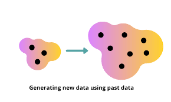
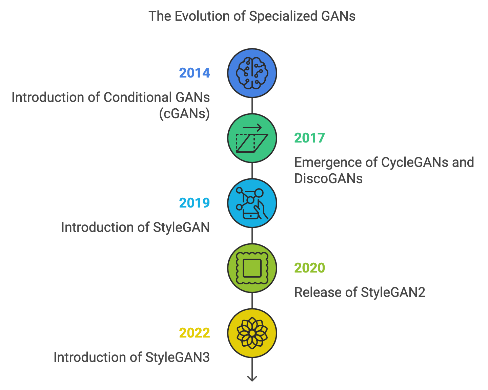
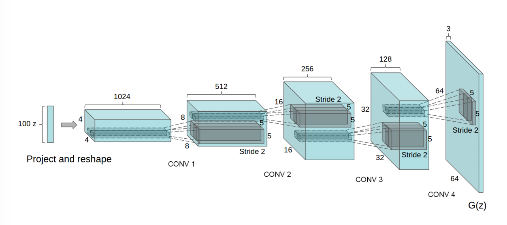
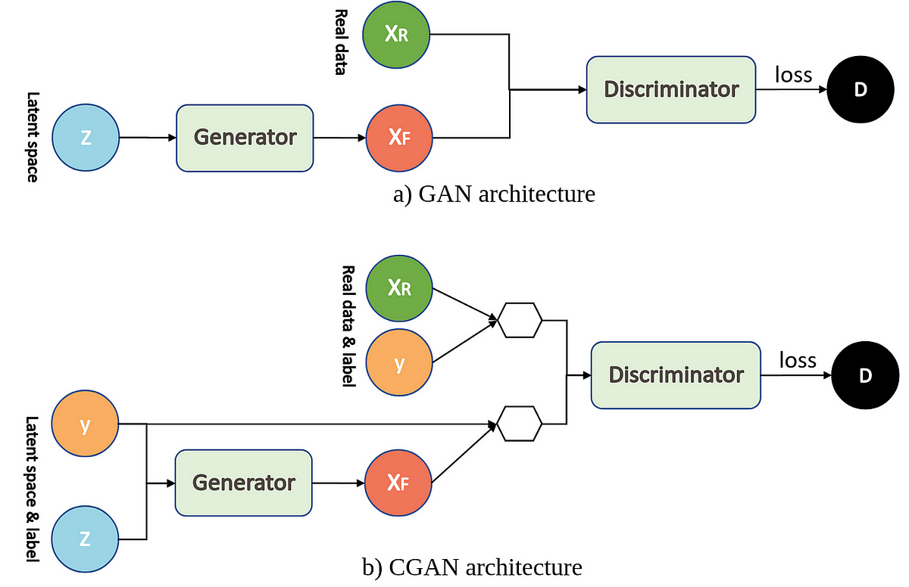
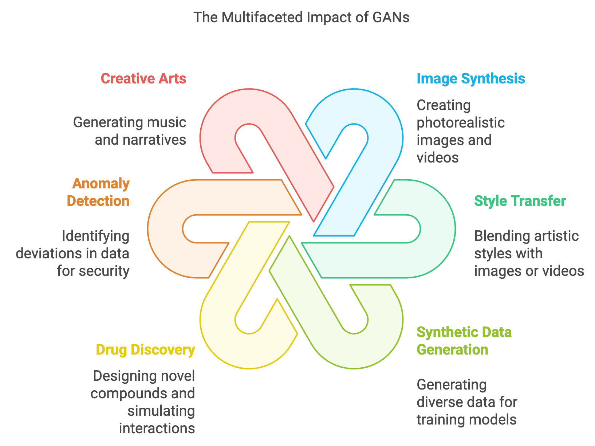

> **Note:**
**"*Generative adversarial networks are a powerful tool for teaching machines to imagine. They hold the key to creating data where there was none before.*" — Ian Goodfellow**

> **Note:**
*Chapter 11 of DLVR offers an in-depth exploration of Generative Adversarial Networks (GANs), a groundbreaking framework introduced by Ian Goodfellow in 2014 for training generative models. The chapter begins by unpacking the fundamental architecture of GANs, consisting of the Generator and Discriminator, and the adversarial process that drives their training. It delves into the min-max game that underlies GAN training, highlighting the crucial role of the adversarial loss function and addressing the inherent challenges such as mode collapse and instability. The chapter advances to cover the intricacies of training GANs, providing practical techniques for overcoming common issues and optimizing performance. It also introduces advanced GAN architectures, like DCGAN, cGAN, and WGAN, explaining their innovations and practical applications. Further, it discusses methods for evaluating GAN performance, balancing quantitative metrics with qualitative analysis, and explores the diverse applications of GANs, from creative endeavors to scientific and industrial uses. Practical examples and Rust-based implementations throughout the chapter equip readers with the skills to build, train, and evaluate GANs effectively using the tch-rs and burn libraries.*

# 11.1. Introduction to Generative Models

Richard Feynman once famously stated, “What I cannot create, I do not understand,” which has deep implications in the world of machine learning, particularly in the domain of generative models. Feynman’s sentiment resonates with the core idea of generative models: they aim not only to model data but to create new data that resembles the underlying patterns and structures found in the real world. Generative models attempt to understand the data distribution so well that they can generate new instances that could plausibly have come from that distribution.


**Figure 1:** Generative models able to create new data from existing data.

Generative models are a class of machine learning models that learn to capture the underlying probability distribution of a dataset, enabling them to generate new, realistic data samples. The goal of a generative model is to approximate the true data distribution $p_{\text{data}}$ by learning a model $p_{\theta}(x)$ parameterized by $\theta$. By understanding this distribution, the model can generate new samples $x$ that are similar to those in the training data. These models are powerful because they allow us to perform tasks like image synthesis, text generation, and data augmentation, among others.

Generative models can be mathematically formalized by defining the goal of learning the distribution $p(x)$, where $x$ represents the data. Depending on how the model approaches the task of estimating $p(x)$, generative models can be categorized into different types, each employing distinct methods for modeling and sampling from the data distribution. Let us now compare various generative models like Variational Autoencoders (VAE), autoregressive models, flow-based models, energy-based models, Generative Adversarial Networks (GANs), and diffusion models, each with its own theoretical foundation and advantages.


**Figure 2:** Comparison of basic ideas of generative models.

Variational Autoencoders (VAEs) are a type of latent variable generative model that use neural networks to approximate both the likelihood of the data $p_\varphi(x \mid z)$ and the posterior distribution over the latent variables $q_\varphi(z \mid x)$, where $z$ is a latent variable that explains the data $x$. VAEs maximize the evidence lower bound (ELBO) to approximate the intractable marginal likelihood $\log p_\varphi(x)$. The ELBO is given by:

$$ \log p_\varphi(x) \geq \mathbb{E}_{q_\varphi(z \mid x)} \left[ \log p_\varphi(x \mid z) \right] - D_{\text{KL}}(q_\varphi(z \mid x) \parallel p(z)), $$

where $D_{\text{KL}}$ is the Kullback-Leibler divergence between the approximate posterior $q_\varphi(z \mid x)$ and the prior $p(z)$. VAEs allow efficient sampling by first drawing from the prior $p(z)$ and then using the learned decoder network to generate new samples $x$. Although VAEs offer tractable likelihoods and a principled probabilistic framework, the generated samples tend to be blurry due to the Gaussian assumption made in the latent space.

Autoregressive models represent a class of generative models that decompose the joint distribution $p(x)$ into a product of conditional distributions using the chain rule of probability:

$$p(x) = p(x_1) p(x_2 \mid x_1) \cdots p(x_n \mid x_1, \dots, x_{n-1}).$$

These models, such as PixelCNN and WaveNet, directly model the data likelihood without introducing latent variables. Autoregressive models are trained by maximizing the likelihood of the data, and at test time, samples are generated sequentially by sampling one element at a time based on previously generated elements. While they provide exact likelihoods and are highly expressive, autoregressive models suffer from slow sampling since each new data point must be generated conditionally on all previous data points.

Flow-based models, such as RealNVP and Glow, use invertible transformations to map a simple prior distribution (e.g., Gaussian) into a more complex data distribution. These models rely on bijective mappings $f_\varphi$, which transform a latent variable $z \sim p(z)$ into a data point $x = f_\varphi(z)$. The key advantage of flow-based models is that both the sampling process and the computation of exact log-likelihood are tractable, as the likelihood of the data can be computed using the change of variables formula:

$$ \log p(x) = \log p(z) - \log \left| \det \frac{\partial f_\varphi^{-1}(x)}{\partial x} \right|. $$

Flow-based models provide exact and tractable likelihoods, but their expressiveness is often constrained by the requirement for the transformations to be invertible and have tractable Jacobian determinants.

Energy-based models (EBMs) approach generative modeling by defining an energy function $E_\varphi(x)$ over the data space. The probability distribution over data is implicitly defined as:

$$p_\varphi(x) = \frac{\exp(-E_\varphi(x))}{Z(\varphi)}$$

where $Z(\varphi)$ is the partition function or normalization constant. Unlike other models, EBMs do not provide a direct way to sample from the distribution; instead, sampling is typically done using Markov Chain Monte Carlo (MCMC) methods. The advantage of EBMs lies in their flexibility, as they can model complex and multimodal distributions. However, the intractability of the partition function makes learning and sampling computationally challenging.

Diffusion models are a recent class of generative models that rely on a forward process that progressively corrupts data by adding noise over several steps, and a reverse process that learns to denoise this corrupted data to generate samples. Formally, the forward process defines a sequence of latent variables $\{x_0, x_1, \dots, x_T\}$ where $x_0$ is the data, and $x_T$ is a fully noised version of the data sampled from a Gaussian distribution. The reverse process learns a series of denoising steps to recover the data from the noise:

$$ p_\varphi(x_{t-1} \mid x_t) = \mathcal{N}(x_{t-1}; \mu_\varphi(x_t, t), \Sigma_\varphi(x_t, t)), $$

where $\mu_\varphi$ and $\Sigma_\varphi$ are parameterized by neural networks. Diffusion models have shown strong empirical results and provide flexibility in balancing sample quality and diversity, though they often require many sampling steps to generate high-quality data.

Generative Adversarial Networks (GANs), introduced by Ian Goodfellow in 2014, provide a novel framework for training generative models by employing a game-theoretic setup between two networks: the Generator $G$ and the Discriminator $D$. The Generator takes a noise vector $z \sim p(z)$ as input and produces a data sample $G(z)$, while the Discriminator tries to distinguish between real data $x$ and generated data $G(z)$. The objective of the GAN can be written as a minimax optimization problem. The Generator seeks to minimize this objective, while the Discriminator maximizes it, leading to an adversarial process where the Generator improves by fooling the Discriminator. GANs are known for generating high-quality samples, particularly in image generation. However, they suffer from instability during training, as well as issues like mode collapse, where the Generator produces a limited variety of outputs.


**Figure 3:** 

Over time, innovations like Wasserstein GANs (WGANs) and their gradient penalty variant (WGAN-GP) introduced better loss functions for more stable training, while techniques like spectral normalization further improved convergence. Architectures such as Progressive Growing GANs (PGGANs) and StyleGAN redefined image synthesis by enabling ultra-high-resolution and fine-grained control over generated outputs, making GANs indispensable in industries like gaming, advertising, and virtual reality.

Beyond image synthesis, specialized GAN variants expanded their applications. Conditional GANs (cGANs) allowed controlled outputs based on labels, while CycleGANs enabled image-to-image translation for unpaired datasets. StyleGAN and its successors became the gold standard for photorealistic and controllable generation, revolutionizing creative fields. Applications of GANs now include 3D modeling, video generation, music composition, and text-to-image synthesis, with multimodal GANs bridging vision and language.

While GANs have achieved remarkable success, they have also raised ethical concerns. Technologies like deepfakes highlight the risk of misinformation and fraud, spurring research into detection and watermarking methods. Additionally, concerns about fairness and bias in synthetic datasets underscore the need for responsible AI development. As GANs evolve, they remain at the forefront of generative AI, driving innovation in science, art, and industry while prompting critical discussions on their ethical implications.

In summary, each generative model offers unique advantages and trade-offs. VAEs provide a principled approach to probabilistic modeling but often produce blurry samples. Autoregressive models offer exact likelihoods but can be slow to sample from. Flow-based models provide exact likelihoods and efficient sampling but require invertible transformations. EBMs are flexible but difficult to train. GANs excel in generating high-quality samples but suffer from instability. Finally, diffusion models provide promising results with a different noise-based framework but can be computationally expensive. The choice of model depends on the specific task and requirements, such as sample quality, likelihood tractability, or training stability.

# 11.2. Generative Adversarial Networks (GANs)

Generative Adversarial Networks (GANs) are an innovative approach to generative modeling, where two neural networks — a Generator and a Discriminator — engage in an adversarial game. The Generator, denoted by $G_\theta$, parameterized by $\theta$ that is implemented as MLP (Multi Layer Perceptron), takes a latent vector $z \sim p_z(z)$, usually drawn from a simple prior distribution such as Gaussian or uniform, and maps it to the data space, aiming to produce samples that resemble the real data distribution $p_{\text{data}}(x)$. The Discriminator, denoted by $D_\phi$, parameterized by $\phi$ and implemented as MLP (Multi Layer Perceptron), evaluates both real data $x \sim p_{\text{data}}(x)$ and generated data $G_\theta(z)$ and classifies them as either real or fake. The Discriminator outputs a probability, where $D_\phi(x) = 1$ means it believes the sample is real, and $D_\phi(G_\theta(z)) = 0$ means it believes the sample is fake.


**Figure 4:** GAN model - G and D implemented as multi layer perceptron (MLP) with parameters $\theta$ and $\phi$ respectively.

The interaction between the Generator and Discriminator is framed as a two-player minimax optimization problem. The Generator's goal is to generate data that "fools" the Discriminator into classifying it as real, while the Discriminator aims to correctly distinguish between real and generated data. This setup leads to the following objective function:

$$ \min_{\theta} \max_{\phi} V(D_\phi, G_\theta) = \mathbb{E}_{x \sim p_{\text{data}}(x)} [\log D_\phi(x)] + \mathbb{E}_{z \sim p_z(z)} [\log (1 - D_\phi(G_\theta(z)))]. $$

The first term, $\mathbb{E}_{x \sim p_{\text{data}}(x)} [\log D_\phi(x)]$, is the expectation over the real data distribution, encouraging the Discriminator to assign a high probability to real data. The second term, $\mathbb{E}_{z \sim p_z(z)} [\log (1 - D_\phi(G_\theta(z)))]$, is the expectation over the latent variable $z$, where the Generator aims to minimize this term by producing realistic data samples that make $D_\phi(G_\theta(z)) \approx 1$. The Discriminator tries to maximize its objective by correctly classifying real data as $1$ and generated data as $0$.

The GAN optimization problem can be viewed as a minimax game, where the Generator and Discriminator have opposing goals. The Generator seeks to minimize the Discriminator's ability to distinguish between real and generated data, while the Discriminator attempts to maximize this ability. To better understand the underlying theoretical framework of GANs, it is essential to consider how the model minimizes divergence between the true data distribution $p_{\text{data}}(x)$ and the distribution of generated data $p_\theta(x)$. Two key divergences play a role in understanding GANs: the Kullback-Leibler (KL) divergence and the Jensen-Shannon (JS) divergence.

The KL divergence is a measure of how one probability distribution diverges from a reference distribution. Given two distributions $P$ and $Q$, the KL divergence from $Q$ to $P$ is defined as:

$$ D_{\text{KL}}(P \parallel Q) = \int p(x) \log \frac{p(x)}{q(x)} dx. $$

In the context of generative modeling, $P$ represents the true data distribution $p_{\text{data}}(x)$, and $Q$ represents the model’s distribution $p_\theta(x)$ (the distribution of generated samples). KL divergence is asymmetric, meaning that $D_{\text{KL}}(P \parallel Q) \neq D_{\text{KL}}(Q \parallel P)$, and it heavily penalizes cases where $q(x)$ assigns low probability to regions where $p(x)$ assigns high probability. This means that if the Generator misses important modes of the data, the KL divergence will significantly penalize the Generator.

The JS divergence is a symmetrized version of the KL divergence and is bounded between 0 and 1. It is defined as:

$$ D_{\text{JS}}(P \parallel Q) = \frac{1}{2} D_{\text{KL}}(P \parallel M) + \frac{1}{2} D_{\text{KL}}(Q \parallel M), $$

where $M = \frac{1}{2}(P + Q)$ is the midpoint distribution between $P$ and $Q$. The JS divergence measures the similarity between two distributions and, unlike the KL divergence, does not penalize missing modes as severely. In the context of GANs, when the Discriminator is optimal, the training of the Generator can be seen as minimizing the JS divergence between the real data distribution $p_{\text{data}}(x)$ and the generated data distribution $p_\theta(x)$.

When the Discriminator is optimal, $D_\phi(x) = \frac{p_{\text{data}}(x)}{p_{\text{data}}(x) + p_\theta(x)}$. Substituting this into the original GAN objective leads to minimizing the JS divergence between $p_{\text{data}}(x)$ and $p_\theta(x)$, which theoretically pushes the Generator's distribution closer to the real data distribution.

The original GAN objective can lead to unstable training dynamics, particularly in the early stages when the Discriminator easily outperforms the Generator, causing vanishing gradients. To address this issue, a common reformulation is applied to the Generator’s objective. Instead of minimizing $\log (1 - D_\phi(G_\theta(z)))$, which tends to saturate when the Discriminator is confident, the Generator is modified to maximize $\log D_\phi(G_\theta(z))$. This alternative objective ensures that the Generator receives more meaningful gradients in the early stages of training:

$$ \min_\theta \mathbb{E}_{z \sim p_z(z)} [-\log D_\phi(G_\theta(z))]. $$

This reformulation leads to a new optimization problem:

$$ \min_\theta \max_\phi \mathbb{E}_{x \sim p_{\text{data}}(x)} [\log D_\phi(x)] + \mathbb{E}_{z \sim p_z(z)} [-\log D_\phi(G_\theta(z))]. $$

In this reformulated game, the Generator's objective becomes minimizing the negative log-likelihood of the Discriminator's confidence in its generated samples. This modification stabilizes the training process, as the Generator is no longer discouraged by vanishing gradients in the early phases of learning. The Discriminator, on the other hand, still seeks to maximize its ability to classify real and fake data, but the Generator is better positioned to improve over time with a more consistent gradient signal.


**Figure 5:** Visual and interactive learning tool for GAN (<a href="https://poloclub.github.io/ganlab/">https://poloclub.github.io/ganlab/</a>).

The Minimax GAN architecture is a foundational approach in generative adversarial networks (GANs), where two neural networks—the generator and the discriminator (or critic)—compete in a zero-sum game. The generator aims to produce data that resembles real data, while the discriminator seeks to distinguish between real and generated (fake) data. This adversarial setup is formulated as a minimax optimization problem, where the generator minimizes the negative log-likelihood of the discriminator misclassifying its outputs, and the discriminator maximizes its ability to correctly classify real and fake data. The architecture's simplicity and effectiveness make it a starting point for understanding and experimenting with GANs, leading to later refinements like Wasserstein GANs and conditional GANs.

```toml
[dependencies]
anyhow = "1.0"
serde_json = "1.0.132"
tch = "0.12.0"
reqwest = { version = "0.12.8", features = ["blocking"] }
image = "0.25.5"
rayon = "1.10.0"
rand = "0.8.5"
```
```rust
use tch::nn::{self, Module, OptimizerConfig, Sequential};
use tch::{Device, Kind, Tensor};
use tch::vision::mnist;
use image::{ImageBuffer, Luma};

fn main() -> anyhow::Result<()> {
    let device = Device::cuda_if_available();
    println!("Using device: {:?}", device);

    // Load MNIST dataset and normalize the pixel values to [0, 1]
    let mnist = mnist::load_dir("data")?;
    let train_images = mnist.train_images / 255.0; // Normalize pixel values
    let train_images = train_images.to_device(device);

    let epochs = 5;
    let batch_size = 64;
    let latent_dim = 100; // Dimensionality of the latent noise vector
    let learning_rate = 0.00005;
    let critic_iterations = 5; // Number of critic updates per generator update

    // Train Minimax GAN
    println!("Training Minimax GAN...");
    train_minimax_gan(&train_images, epochs, batch_size, latent_dim, learning_rate, device)?;

    Ok(())
}

// Build the generator network
fn build_generator(p: &nn::Path, latent_dim: i64) -> Sequential {
    nn::seq()
        .add(nn::linear(p / "lin1", latent_dim, 256, Default::default())) // First layer
        .add_fn(|xs| xs.relu()) // Activation function: ReLU
        .add(nn::linear(p / "lin2", 256, 512, Default::default())) // Second layer
        .add_fn(|xs| xs.relu()) // Activation function: ReLU
        .add(nn::linear(p / "lin3", 512, 1024, Default::default())) // Third layer
        .add_fn(|xs| xs.relu()) // Activation function: ReLU
        .add(nn::linear(p / "lin4", 1024, 28 * 28, Default::default())) // Final layer
        .add_fn(|xs| xs.tanh()) // Activation function: Tanh for output normalization
}

// Build the critic/discriminator network
fn build_critic(p: &nn::Path) -> Sequential {
    nn::seq()
        .add(nn::linear(p / "lin1", 28 * 28, 512, Default::default())) // First layer
        .add_fn(|xs| xs.leaky_relu()) // Activation function: Leaky ReLU
        .add(nn::linear(p / "lin2", 512, 256, Default::default())) // Second layer
        .add_fn(|xs| xs.leaky_relu()) // Activation function: Leaky ReLU
        .add(nn::linear(p / "lin3", 256, 1, Default::default())) // Output layer
}

// Train Minimax GAN
fn train_minimax_gan(
    train_images: &Tensor,
    epochs: i64,
    batch_size: i64,
    latent_dim: i64,
    learning_rate: f64,
    device: Device,
) -> anyhow::Result<()> {
    let vs_gen = nn::VarStore::new(device);
    let generator = build_generator(&vs_gen.root(), latent_dim);

    let vs_critic = nn::VarStore::new(device);
    let critic = build_critic(&vs_critic.root());

    let mut opt_gen = nn::Adam::default().build(&vs_gen, learning_rate)?;
    let mut opt_critic = nn::Adam::default().build(&vs_critic, learning_rate)?;

    let train_size = train_images.size()[0];
    let batches_per_epoch = train_size / batch_size;

    for epoch in 1..=epochs {
        for batch_idx in 0..batches_per_epoch {
            // Train the critic (maximize log(D(x)) + log(1 - D(G(z))))
            let idx = batch_idx * batch_size;
            let real_images = train_images
                .narrow(0, idx, batch_size)
                .view([batch_size, 28 * 28])
                .to_device(device);

            let noise = Tensor::randn(&[batch_size, latent_dim], (Kind::Float, device));
            let fake_images = generator.forward(&noise).detach();

            let real_score = critic.forward(&real_images).sigmoid();
            let fake_score = critic.forward(&fake_images).sigmoid();

            let critic_loss = -real_score.log().mean(Kind::Float)
                - (1.0f32 - fake_score).log().mean(Kind::Float);

            opt_critic.zero_grad();
            critic_loss.backward();
            opt_critic.step();

            // Train the generator (minimize log(1 - D(G(z))) or equivalently maximize log(D(G(z))))
            let noise = Tensor::randn(&[batch_size, latent_dim], (Kind::Float, device));
            let fake_images = generator.forward(&noise);
            let fake_score = critic.forward(&fake_images).sigmoid();

            let generator_loss = -(fake_score.log().mean(Kind::Float));

            opt_gen.zero_grad();
            generator_loss.backward();
            opt_gen.step();

            if batch_idx % 100 == 0 {
                println!(
                    "Epoch [{}/{}], Batch [{}/{}], Critic Loss: {:.4}, Generator Loss: {:.4}",
                    epoch,
                    epochs,
                    batch_idx,
                    batches_per_epoch,
                    f64::from(critic_loss.double_value(&[])),
                    f64::from(generator_loss.double_value(&[]))
                );
            }
        }
    }

    Ok(())
}

// Function to generate and save images
fn generate_and_save_images(
    generator: &Sequential,
    epoch: i64,
    device: Device,
    output_dir: &str,
) -> anyhow::Result<()> {
    // Generate noise for the generator
    let noise = Tensor::randn(&[64, 100], (Kind::Float, device));
    let fake_images = generator.forward(&noise).to_device(Device::Cpu); // Move to CPU for saving

    for i in 0..fake_images.size()[0] {
        let img = fake_images.get(i);
        let img = img.view([28, 28]).detach(); // Reshape to image dimensions
        let img = (img * 0.5 + 0.5).clamp(0.0, 1.0) * 255.0; // Normalize to [0, 255]

        let img = img.to_kind(Kind::Uint8); // Convert to uint8 data type

        // Extract data from tensor into a vector
        let size = img.size();
        let numel = size.iter().product::<i64>() as usize; // Calculate total number of elements
        let mut data = Vec::with_capacity(numel);
        for idx in 0..numel {
            data.push(img.int64_value(&[idx.try_into().unwrap()]) as u8); // Convert idx to i64 and extract value
        }

        // Create an image buffer from the vector
        let image = ImageBuffer::<Luma<u8>, _>::from_raw(28, 28, data).unwrap();
        image.save(format!("{}/epoch{}_img{}.png", output_dir, epoch, i))?;
    }

    Ok(())
}
```

The provided code implements a Minimax GAN trained on the MNIST dataset of handwritten digits using the `tch` crate for PyTorch bindings in Rust. The generator network transforms random noise vectors into flattened 28x28 images, utilizing multiple fully connected layers with ReLU activations and a final Tanh activation to normalize outputs. The discriminator (critic) is a fully connected network that outputs a single probability score, indicating whether an input is real or fake. The training loop alternates between updating the critic, which maximizes its ability to classify real and fake data correctly, and the generator, which minimizes the discriminator's accuracy by producing more realistic images. Optimizers use the Adam algorithm, and progress is logged during training. Additionally, a helper function to save generated images is defined but not invoked in the current training setup. This implementation highlights the fundamental adversarial dynamics and uses sigmoid activations for the discriminator's probability outputs.

The training of GANs is inherently adversarial and proceeds by alternating between updates to the Discriminator and Generator. First, the Discriminator is updated to maximize the objective function with respect to its parameters $\phi$, improving its classification ability. This involves increasing $\log D_\phi(x)$ for real data and minimizing $\log (1 - D_\phi(G_\theta(z)))$ for generated data. Once the Discriminator has been updated, the Generator is updated to minimize the reformulated objective, driving the generated data $G_\theta(z)$ closer to real data in terms of the Discriminator's output. The Generator seeks to produce samples that lead to higher values of $D_\phi(G_\theta(z))$, thereby "fooling" the Discriminator.

However, despite the reformulation, GANs can still suffer from challenges like mode collapse, where the Generator produces a limited variety of outputs. Additionally, the dynamic balance between the Generator and Discriminator can lead to instability. If the Discriminator becomes too powerful, the Generator's gradients may vanish, halting progress. Conversely, if the Generator improves too quickly, the Discriminator may struggle to learn.

To mitigate the challenges faced by traditional GANs, the Wasserstein GAN (WGAN) leverages the Wasserstein distance, also known as the Earth Mover’s distance (EMD), which arises from optimal transport theory. This framework introduces a more stable and smoother metric than the Jensen-Shannon (JS) divergence, which is used in the original GAN formulation. The motivation behind WGAN is to provide a more meaningful measure of distance between the real data distribution $p_{\text{data}}(x)$ and the generated data distribution $p_\theta(x)$, particularly when the distributions have little or no overlap — a situation where JS divergence or KL divergence fail to provide useful gradient information.

The optimal transport problem originated from the study of moving mass in an optimal way. In the context of machine learning, the goal is to move the "mass" of one probability distribution (e.g., $p_{\text{data}}$) to another distribution (e.g., $p_\theta$) in the most cost-effective way. The cost is defined by a "ground metric," typically the distance between points in the space.

Formally, the Wasserstein distance between two distributions $p_{\text{data}}(x)$ and $p_\theta(x)$ is defined as:

$$ W(p_{\text{data}}, p_\theta) = \inf_{\gamma \in \Pi(p_{\text{data}}, p_\theta)} \mathbb{E}_{(x, y) \sim \gamma} [\|x - y\|], $$

where $\Pi(p_{\text{data}}, p_\theta)$ is the set of all possible joint distributions (also called couplings) $\gamma(x, y)$ with marginals $p_{\text{data}}(x)$ and $p_\theta(x)$. The goal is to find a coupling $\gamma$that minimizes the expected distance $\|x - y\|$, which represents the cost of transporting mass from the real distribution $p_{\text{data}}$ to the generated distribution $p_\theta$. The "Earth Mover’s distance" is an intuitive way to measure how much "work" is required to transform one distribution into another.

Directly minimizing the Wasserstein distance using the optimal transport formulation can be computationally infeasible, especially for high-dimensional data, due to the complexity of finding the optimal coupling $\gamma$. To overcome this, WGAN employs a key result from optimal transport theory, the Kantorovich-Rubinstein duality, which allows the Wasserstein distance to be rewritten as a tractable optimization problem.

Using this duality, the Wasserstein distance can be approximated as:

$$ W(p_{\text{data}}, p_\theta) = \sup_{\|f\|_L \leq 1} \mathbb{E}_{x \sim p_{\text{data}}} [f(x)] - \mathbb{E}_{x \sim p_\theta} [f(x)], $$

where $f$ is a 1-Lipschitz continuous function, meaning that for any two points $x_1$ and $x_2$, the function $f$ satisfies the condition:

$$|f(x_1) - f(x_2)| \leq \|x_1 - x_2\|$$

In WGAN, the Discriminator is replaced by a critic $f_w$, parameterized by $w$, which approximates this 1-Lipschitz function. The critic $f_w$ is optimized to maximize the difference between the expectations of $f_w(x)$ over the real data distribution and the generated data distribution, effectively estimating the Wasserstein distance. The objective function for the WGAN thus becomes:

$$ \max_w \mathbb{E}_{x \sim p_{\text{data}}} [f_w(x)] - \mathbb{E}_{z \sim p_z(z)} [f_w(g_\theta(z))]. $$

The Generator then minimizes this critic's output by reducing the Wasserstein distance between $p_{\text{data}}(x)$ and $p_\theta(x)$, leading to the following overall optimization problem:

$$ \min_\theta \max_w \mathbb{E}_{x \sim p_{\text{data}}} [f_w(x)] - \mathbb{E}_{z \sim p_z(z)} [f_w(g_\theta(z))]. $$


**Figure 6:** Wasserstein GAN model.

This formulation addresses a major shortcoming of traditional GANs: when the real and generated distributions do not overlap, the Wasserstein distance remains a valid measure of how far apart the two distributions are, while the JS divergence becomes less informative (resulting in vanishing gradients for the Generator).

A key challenge in implementing WGAN is ensuring that the critic $f_w$ satisfies the 1-Lipschitz constraint. The original WGAN formulation enforced this constraint by weight clipping, which restricted the critic's parameters $w$ to lie within a bounded range. However, weight clipping can lead to undesirable side effects, such as limiting the capacity of the critic and resulting in poor gradients during training.

To address this issue, WGAN-GP (WGAN with Gradient Penalty) introduces a more effective way to enforce the Lipschitz constraint. Instead of clipping the weights, WGAN-GP adds a gradient penalty term to the critic's loss function. The gradient penalty enforces the 1-Lipschitz condition by penalizing the critic if the norm of its gradient exceeds 1. Specifically, the gradient penalty term is given by:

$$ \lambda \mathbb{E}_{\hat{x} \sim p_{\hat{x}}} \left[ (\|\nabla_{\hat{x}} f_w(\hat{x})\|_2 - 1)^2 \right], $$

where $\hat{x}$ is sampled uniformly along straight lines between real data points and generated data points, and $\lambda$ is a penalty coefficient. This penalty encourages the norm of the gradient $\|\nabla_{\hat{x}} f_w(\hat{x})\|_2$ to be close to 1, ensuring that the critic remains approximately 1-Lipschitz.

The overall WGAN-GP objective thus becomes:

$$ \min_\theta \max_w \mathbb{E}_{x \sim p_{\text{data}}} [f_w(x)] - \mathbb{E}_{z \sim p_z(z)} [f_w(g_\theta(z))] + \lambda \mathbb{E}_{\hat{x} \sim p_{\hat{x}}} \left[ (\|\nabla_{\hat{x}} f_w(\hat{x})\|_2 - 1)^2 \right]. $$

By using the gradient penalty instead of weight clipping, WGAN-GP ensures that the critic can effectively approximate the Wasserstein distance while maintaining stable and robust training dynamics.

The Wasserstein distance provides several important advantages over traditional GANs. First, it gives non-zero gradients even when the generated and real distributions have little overlap, addressing the vanishing gradient problem that can occur in standard GANs. This leads to more stable training and a smoother optimization landscape for the Generator. Second, because the Wasserstein distance provides a meaningful metric for measuring the similarity between distributions, it leads to better convergence and alleviates issues like mode collapse, where the Generator produces only a limited variety of samples.

The WGAN improves upon traditional Minimax GANs by addressing issues such as mode collapse and training instability. Unlike standard GANs, WGAN optimizes the Wasserstein distance (Earth Mover's distance) between the real and generated data distributions, providing a smoother loss landscape and better gradient flow. This is achieved by replacing the discriminator with a "critic" that scores the realness of data without strictly classifying it as real or fake. To enforce the Lipschitz constraint, WGAN employs weight clipping on the critic's parameters. The WGAN is particularly useful in scenarios where stable and high-quality generation is required, such as image synthesis, data augmentation, and creating high-resolution outputs.

The provided code implements a Wasserstein Generative Adversarial Network (WGAN) to generate MNIST-style handwritten digit images. It features a generator, which creates synthetic data from random noise, and a critic, which evaluates the quality of the generated data by distinguishing it from real samples. The training process alternates between updating the critic, which uses the Wasserstein loss to assess the difference between real and generated data distributions, and updating the generator to produce more realistic samples based on the critic's feedback. To ensure stability and maintain the Lipschitz continuity required by WGAN, weight clipping is applied to the critic's parameters after each update. The model also saves and visualizes generated images at the end of each training epoch, providing a clear representation of the generator's progress.

```toml
[dependencies]
anyhow = "1.0"
serde_json = "1.0.132"
tch = "0.12.0"
reqwest = { version = "0.12.8", features = ["blocking"] }
image = "0.25.5"
rayon = "1.10.0"
rand = "0.8.5"
```
```rust
use tch::nn::{self, Module, OptimizerConfig, Sequential};
use tch::{Device, Kind, Tensor};
use tch::vision::mnist;
use image::{ImageBuffer, Luma};

fn main() -> anyhow::Result<()> {
    let device = Device::cuda_if_available();
    println!("Using device: {:?}", device);

    // Load MNIST dataset and normalize the pixel values to [0, 1]
    let mnist = mnist::load_dir("data")?;
    let train_images = mnist.train_images / 255.0; // Normalize pixel values
    let train_images = train_images.to_device(device);

    let epochs = 5;
    let batch_size = 64;
    let latent_dim = 100; // Dimensionality of the latent noise vector
    let learning_rate = 0.00005;
    let critic_iterations = 5; // Number of critic updates per generator update
    let clipping_value = 0.01; // Clipping value for WGAN weight clipping

    // Train WGAN
    println!("Training WGAN...");
    train_wgan(
        &train_images,
        epochs,
        batch_size,
        latent_dim,
        learning_rate,
        critic_iterations,
        clipping_value,
        device,
    )?;

    Ok(())
}

// Build the generator network
fn build_generator(p: &nn::Path, latent_dim: i64) -> Sequential {
    nn::seq()
        .add(nn::linear(p / "lin1", latent_dim, 256, Default::default())) // First layer
        .add_fn(|xs| xs.relu()) // Activation function: ReLU
        .add(nn::linear(p / "lin2", 256, 512, Default::default())) // Second layer
        .add_fn(|xs| xs.relu()) // Activation function: ReLU
        .add(nn::linear(p / "lin3", 512, 1024, Default::default())) // Third layer
        .add_fn(|xs| xs.relu()) // Activation function: ReLU
        .add(nn::linear(p / "lin4", 1024, 28 * 28, Default::default())) // Final layer
        .add_fn(|xs| xs.tanh()) // Activation function: Tanh for output normalization
}

// Build the critic network
fn build_critic(p: &nn::Path) -> Sequential {
    nn::seq()
        .add(nn::linear(p / "lin1", 28 * 28, 512, Default::default())) // First layer
        .add_fn(|xs| xs.leaky_relu()) // Activation function: Leaky ReLU
        .add(nn::linear(p / "lin2", 512, 256, Default::default())) // Second layer
        .add_fn(|xs| xs.leaky_relu()) // Activation function: Leaky ReLU
        .add(nn::linear(p / "lin3", 256, 1, Default::default())) // Output layer
}

// Train WGAN
fn train_wgan(
    train_images: &Tensor,
    epochs: i64,
    batch_size: i64,
    latent_dim: i64,
    learning_rate: f64,
    critic_iterations: i64,
    clipping_value: f64,
    device: Device,
) -> anyhow::Result<()> {
    let vs_gen = nn::VarStore::new(device);
    let generator = build_generator(&vs_gen.root(), latent_dim);

    let vs_critic = nn::VarStore::new(device);
    let critic = build_critic(&vs_critic.root());

    let mut opt_gen = nn::Adam::default().build(&vs_gen, learning_rate)?;
    let mut opt_critic = nn::Adam::default().build(&vs_critic, learning_rate)?;

    let train_size = train_images.size()[0];
    let batches_per_epoch = train_size / batch_size;

    for epoch in 1..=epochs {
        for batch_idx in 0..batches_per_epoch {
            // Train the critic
            let mut critic_loss_value = 0.0; // Variable to store critic loss for logging
            for _ in 0..critic_iterations {
                let idx = batch_idx * batch_size;
                let real_images = train_images
                    .narrow(0, idx, batch_size)
                    .view([batch_size, 28 * 28])
                    .to_device(device);

                let noise = Tensor::randn(&[batch_size, latent_dim], (Kind::Float, device));
                let fake_images = generator.forward(&noise).detach();

                let real_score = critic.forward(&real_images);
                let fake_score = critic.forward(&fake_images);

                // Wasserstein loss for the critic
                let critic_loss = fake_score.mean(Kind::Float) - real_score.mean(Kind::Float);

                opt_critic.zero_grad();
                critic_loss.backward();
                opt_critic.step();

                // Weight clipping for Lipschitz constraint
                for mut var in vs_critic.variables() {
                    let clamped_var = var.1.clamp(-clipping_value, clipping_value);
                    var.1 = clamped_var;
                }

                // Store critic loss value for logging
                critic_loss_value = f64::from(critic_loss.double_value(&[]));
            }

            // Train the generator
            let noise = Tensor::randn(&[batch_size, latent_dim], (Kind::Float, device));
            let fake_images = generator.forward(&noise);
            let fake_score = critic.forward(&fake_images);

            // Wasserstein loss for the generator
            let generator_loss = -fake_score.mean(Kind::Float);

            opt_gen.zero_grad();
            generator_loss.backward();
            opt_gen.step();

            let generator_loss_value = f64::from(generator_loss.double_value(&[]));

            // Print progress
            if batch_idx % 100 == 0 {
                println!(
                    "Epoch [{}/{}], Batch [{}/{}], Critic Loss: {:.4}, Generator Loss: {:.4}",
                    epoch, epochs, batch_idx, batches_per_epoch, critic_loss_value, generator_loss_value
                );
            }
        }

        // Save generated images at the end of each epoch
        let output_dir = "output_wgan";
        std::fs::create_dir_all(output_dir)?;
        generate_and_save_images(&generator, epoch, device, output_dir)?;
    }

    Ok(())
}

// Function to generate and save images
fn generate_and_save_images(
    generator: &Sequential,
    epoch: i64,
    device: Device,
    output_dir: &str,
) -> anyhow::Result<()> {
    let noise = Tensor::randn(&[64, 100], (Kind::Float, device));
    let fake_images = generator.forward(&noise).to_device(Device::Cpu);

    for i in 0..fake_images.size()[0] {
        let img = fake_images.get(i);
        let img = img.view([28, 28]).detach();
        let img = (img * 0.5 + 0.5).clamp(0.0, 1.0) * 255.0;

        let img = img.to_kind(Kind::Uint8);
        let size = img.size();
        let numel = size.iter().product::<i64>() as usize;
        let mut data = Vec::with_capacity(numel);
        for idx in 0..numel {
            data.push(img.int64_value(&[idx.try_into().unwrap()]) as u8);
        }

        let image = ImageBuffer::<Luma<u8>, _>::from_raw(28, 28, data).unwrap();
        image.save(format!("{}/epoch{}_img{}.png", output_dir, epoch, i))?;
    }

    Ok(())
}
```

The code begins by loading and normalizing the MNIST dataset for training. It defines the generator and critic models The provided code implements a WGAN to generate MNIST-style handwritten digit images. It defines a generator and a critic network using sequential layers. The training process alternates between updating the critic multiple times to ensure accurate scoring and updating the generator once per cycle. The critic's loss is computed as the difference in mean scores of generated and real samples, while the generator is trained to maximize the critic's score on generated samples. To enforce the Lipschitz constraint, the weights of the critic are clipped to a predefined range. At the end of each epoch, the generator's performance is visualized by generating images and saving them to disk. This implementation ensures stable training and high-quality outputs through Wasserstein loss and weight clipping.

Relativistic Generative Adversarial Networks (Relativistic GANs) introduce a novel perspective to the training dynamics of GANs by altering the discriminator's output interpretation. Unlike traditional GANs, where the discriminator predicts the probability of a sample being real or fake, Relativistic GANs predict whether a real sample is more realistic than a fake one. This is achieved by modifying the discriminator to output the *relative realism* of samples, emphasizing the relational quality between real and fake images rather than treating them independently. This modification leads to improved gradients for the generator, fostering more stable and efficient learning.

By focusing on the relative realism, Relativistic GANs align the training dynamics of the generator and discriminator more closely, reducing mode collapse and producing higher-quality outputs. The generator learns not only to make fake images more realistic but also to decrease the relative realism of real images, adding robustness to the adversarial game. These changes have been shown to accelerate convergence and enhance performance in both image generation and other domains where adversarial training is applied, making Relativistic GANs a powerful extension to the standard GAN framework.

This code implements a Relativistic Deep Convolutional GAN (Relativistic DCGAN) for generating high-quality 64x64 images from random noise vectors. The scenario aims to train a generator network that produces realistic images indistinguishable from real images in a given dataset. The discriminator network is modified to evaluate the realism of real and fake images *relatively*—predicting whether real images are more realistic than generated ones. This relative comparison encourages the generator to create images that are not only realistic but also competitive in terms of relative realism, leading to faster convergence and more stable training dynamics. The dataset for training is loaded from a specified directory of images.

```rust
// Realtivistic DCGAN.
// https://github.com/AlexiaJM/RelativisticGAN
//
// TODO: override the initializations if this does not converge well.
use anyhow::{bail, Result};
use tch::{kind, nn, nn::OptimizerConfig, Device, Kind, Tensor};

const IMG_SIZE: i64 = 64;
const LATENT_DIM: i64 = 128;
const BATCH_SIZE: i64 = 32;
const LEARNING_RATE: f64 = 1e-4;
const BATCHES: i64 = 100000000;

fn tr2d(p: nn::Path, c_in: i64, c_out: i64, padding: i64, stride: i64) -> nn::ConvTranspose2D {
    let cfg = nn::ConvTransposeConfig { stride, padding, bias: false, ..Default::default() };
    nn::conv_transpose2d(p, c_in, c_out, 4, cfg)
}

fn conv2d(p: nn::Path, c_in: i64, c_out: i64, padding: i64, stride: i64) -> nn::Conv2D {
    let cfg = nn::ConvConfig { stride, padding, bias: false, ..Default::default() };
    nn::conv2d(p, c_in, c_out, 4, cfg)
}

fn generator(p: nn::Path) -> impl nn::ModuleT {
    nn::seq_t()
        .add(tr2d(&p / "tr1", LATENT_DIM, 1024, 0, 1))
        .add(nn::batch_norm2d(&p / "bn1", 1024, Default::default()))
        .add_fn(|xs| xs.relu())
        .add(tr2d(&p / "tr2", 1024, 512, 1, 2))
        .add(nn::batch_norm2d(&p / "bn2", 512, Default::default()))
        .add_fn(|xs| xs.relu())
        .add(tr2d(&p / "tr3", 512, 256, 1, 2))
        .add(nn::batch_norm2d(&p / "bn3", 256, Default::default()))
        .add_fn(|xs| xs.relu())
        .add(tr2d(&p / "tr4", 256, 128, 1, 2))
        .add(nn::batch_norm2d(&p / "bn4", 128, Default::default()))
        .add_fn(|xs| xs.relu())
        .add(tr2d(&p / "tr5", 128, 3, 1, 2))
        .add_fn(|xs| xs.tanh())
}

fn leaky_relu(xs: &Tensor) -> Tensor {
    xs.maximum(&(xs * 0.2))
}

fn discriminator(p: nn::Path) -> impl nn::ModuleT {
    nn::seq_t()
        .add(conv2d(&p / "conv1", 3, 128, 1, 2))
        .add_fn(leaky_relu)
        .add(conv2d(&p / "conv2", 128, 256, 1, 2))
        .add(nn::batch_norm2d(&p / "bn2", 256, Default::default()))
        .add_fn(leaky_relu)
        .add(conv2d(&p / "conv3", 256, 512, 1, 2))
        .add(nn::batch_norm2d(&p / "bn3", 512, Default::default()))
        .add_fn(leaky_relu)
        .add(conv2d(&p / "conv4", 512, 1024, 1, 2))
        .add(nn::batch_norm2d(&p / "bn4", 1024, Default::default()))
        .add_fn(leaky_relu)
        .add(conv2d(&p / "conv5", 1024, 1, 0, 1))
}

fn mse_loss(x: &Tensor, y: &Tensor) -> Tensor {
    let diff = x - y;
    (&diff * &diff).mean(Kind::Float)
}

// Generate a 2D matrix of images from a tensor with multiple images.
fn image_matrix(imgs: &Tensor, sz: i64) -> Result<Tensor> {
    let imgs = ((imgs + 1.) * 127.5).clamp(0., 255.).to_kind(Kind::Uint8);
    let mut ys: Vec<Tensor> = vec![];
    for i in 0..sz {
        ys.push(Tensor::cat(&(0..sz).map(|j| imgs.narrow(0, 4 * i + j, 1)).collect::<Vec<_>>(), 2))
    }
    Ok(Tensor::cat(&ys, 3).squeeze_dim(0))
}

pub fn main() -> Result<()> {
    let device = Device::cuda_if_available();
    let args: Vec<_> = std::env::args().collect();
    let image_dir = match args.as_slice() {
        [_, d] => d.to_owned(),
        _ => bail!("usage: main image-dataset-dir"),
    };
    let images = tch::vision::image::load_dir(image_dir, IMG_SIZE, IMG_SIZE)?;
    println!("loaded dataset: {images:?}");
    let train_size = images.size()[0];

    let random_batch_images = || {
        let index = Tensor::randint(train_size, [BATCH_SIZE], kind::INT64_CPU);
        images.index_select(0, &index).to_device(device).to_kind(Kind::Float) / 127.5 - 1.
    };
    let rand_latent = || {
        (Tensor::rand([BATCH_SIZE, LATENT_DIM, 1, 1], kind::FLOAT_CPU) * 2.0 - 1.0)
            .to_device(device)
    };

    let mut generator_vs = nn::VarStore::new(device);
    let generator = generator(generator_vs.root());
    let mut opt_g = nn::adam(0.5, 0.999, 0.).build(&generator_vs, LEARNING_RATE)?;

    let mut discriminator_vs = nn::VarStore::new(device);
    let discriminator = discriminator(discriminator_vs.root());
    let mut opt_d = nn::adam(0.5, 0.999, 0.).build(&discriminator_vs, LEARNING_RATE)?;

    let fixed_noise = rand_latent();

    for index in 0..BATCHES {
        discriminator_vs.unfreeze();
        generator_vs.freeze();
        let discriminator_loss = {
            let batch_images = random_batch_images();
            let y_pred = batch_images.apply_t(&discriminator, true);
            let y_pred_fake = rand_latent()
                .apply_t(&generator, true)
                .copy()
                .detach()
                .apply_t(&discriminator, true);
            mse_loss(&y_pred, &(y_pred_fake.mean(Kind::Float) + 1))
                + mse_loss(&y_pred_fake, &(y_pred.mean(Kind::Float) - 1))
        };
        opt_d.backward_step(&discriminator_loss);

        discriminator_vs.freeze();
        generator_vs.unfreeze();

        let generator_loss = {
            let batch_images = random_batch_images();
            let y_pred = batch_images.apply_t(&discriminator, true);
            let y_pred_fake = rand_latent().apply_t(&generator, true).apply_t(&discriminator, true);
            mse_loss(&y_pred, &(y_pred_fake.mean(Kind::Float) - 1))
                + mse_loss(&y_pred_fake, &(y_pred.mean(Kind::Float) + 1))
        };
        opt_g.backward_step(&generator_loss);

        if index % 1000 == 0 {
            let imgs = fixed_noise
                .apply_t(&generator, true)
                .view([-1, 3, IMG_SIZE, IMG_SIZE])
                .to_device(Device::Cpu);
            tch::vision::image::save(&image_matrix(&imgs, 4)?, format!("relout{index}.png"))?
        }
        if index % 100 == 0 {
            println!("{index}")
        };
    }

    Ok(())
}
```

The code begins by defining a generator network that uses transposed convolutional layers to upscale latent noise vectors into images. Similarly, a discriminator network is defined using convolutional layers to downscale images and output realism scores. The training loop alternates between optimizing the discriminator and the generator. For the discriminator, the loss is calculated based on how well it distinguishes between real and fake images in a relative sense. For the generator, the loss is derived from how effectively it can "fool" the discriminator into assigning high realism scores to fake images. A fixed noise vector is used to save generated samples at regular intervals for monitoring training progress. To use the code, you need to specify the path to a directory containing images for training. Ensure that the images are preprocessed to have uniform dimensions matching the model's input size (64x64 pixels). During training, the model saves generated images to visualize progress and prints loss metrics to the console. The generated images and training logs help monitor the quality and stability of the Relativistic DCGAN's outputs.

In conclusion, GANs are a powerful framework for generative modeling that formalizes the training process as a minimax game between a Generator and a Discriminator, aiming to minimize the divergence between the real data distribution and the generated data distribution. While the KL and JS divergences provide the theoretical foundation for traditional GANs, practical challenges like vanishing gradients and mode collapse have led to the development of refined approaches such as Wasserstein GAN (WGAN). Built on optimal transport theory, WGAN replaces the reliance on the JS divergence with the more robust and stable Wasserstein distance. This reformulation, combined with the introduction of gradient penalties to enforce the Lipschitz constraint, leads to more reliable training behavior and mitigates many of the challenges faced by traditional GANs. As a result, WGAN enables more stable training dynamics and allows generative models to produce increasingly realistic data across a wide range of applications.

# 11.3. Training GANs: Techniques and Challenges

Training Generative Adversarial Networks (GANs) is a delicate and often challenging process. At the core of GAN training is the adversarial interaction between two neural networks—the Generator and the Discriminator—where each is updated alternately in a zero-sum game. The Generator aims to produce data that mimics the real data distribution, while the Discriminator works to distinguish between real and generated data. This iterative process continues until the Generator produces samples that the Discriminator can no longer distinguish from real data.

In terms of loss functions, the most common choice in standard GANs is binary cross-entropy (BCE), where the Discriminator is trained to classify real data as 1 and generated data as 0. Mathematically, the loss for the Discriminator can be written as:

$$ L_D = - \mathbb{E}_{x \sim p_{\text{data}}(x)} [\log D(x)] - \mathbb{E}_{z \sim p_z(z)} [\log(1 - D(G(z)))] $$

Here, $D(x)$ is the probability assigned by the Discriminator that $x$ is real, and $G(z)$ is the data generated by the Generator from the latent vector $z$. The Discriminator maximizes this objective, pushing $D(x)$ toward 1 for real data and $D(G(z))$ toward 0 for generated data. The Generator, on the other hand, is trained to minimize the loss:

$$ L_G = - \mathbb{E}_{z \sim p_z(z)} [\log D(G(z))] $$

This forces the Generator to produce outputs that can fool the Discriminator, maximizing $D(G(z))$ and thereby minimizing the loss. While this min-max game forms the foundation of GAN training, achieving a balanced and stable training process is far from trivial.

One of the key challenges in GAN training is mode collapse, where the Generator starts producing only a limited variety of outputs, ignoring the diversity of the real data. This happens when the Generator finds a small subset of the data distribution that can consistently fool the Discriminator. Addressing mode collapse requires techniques such as feature matching, where the Generator is trained to match not only the output but also the statistics of the internal activations of the Discriminator.

Another common issue is vanishing gradients, where the Discriminator becomes overly confident and provides little feedback to the Generator. In such cases, the Generator struggles to improve, as the gradients become too small to update its weights effectively. One way to mitigate this is by using Wasserstein loss (WGAN), which provides more stable gradients. The Wasserstein GAN reformulates the loss function as:

$$ L_D = - \mathbb{E}_{x \sim p_{\text{data}}(x)} [D(x)] + \mathbb{E}_{z \sim p_z(z)} [D(G(z))] $$

$$L_G = - \mathbb{E}_{z \sim p_z(z)} [D(G(z))]$$

In WGAN, the Discriminator (referred to as the Critic in this case) is not bounded by the sigmoid activation function and provides continuous values, leading to smoother gradient updates for the Generator. Additionally, WGAN uses gradient penalty to enforce Lipschitz continuity:

$$ L_{\text{GP}} = \lambda \mathbb{E}_{\hat{x} \sim p_{\hat{x}}} \left[ \left( \|\nabla_{\hat{x}} D(\hat{x})\|_2 - 1 \right)^2 \right] $$

where $\hat{x}$ is an interpolated sample between real and generated data, and $\lambda$ is a weighting term.

Oscillations during training occur when the Generator and Discriminator are not properly balanced. If the Discriminator becomes too powerful, the Generator may fail to learn meaningful improvements, leading to oscillating losses where neither network converges effectively. Techniques such as one-sided label smoothing, where the labels for real data are smoothed from 1 to a slightly lower value like 0.9, can help prevent the Discriminator from becoming too confident, making the task for the Generator less extreme.

The choice of hyperparameters, including learning rate and batch size, plays a significant role in the stability of GAN training. For example, a high learning rate can cause divergence, where both networks overshoot optimal updates, while a low learning rate may lead to slow convergence or stagnation. Common practice involves using the Adam optimizer with learning rates of around $10^{-4}$ for both the Generator and Discriminator, though adjusting these rates based on the dataset and model complexity is often necessary. Batch size also impacts training dynamics, with larger batches typically offering more stable updates but requiring more computational resources.

Another technique to stabilize training is introducing noise to the Discriminator's inputs, either by adding small random perturbations to the real and generated data or by randomly flipping a portion of the labels. This prevents the Discriminator from overfitting to the training data and helps it generalize better to generated samples, encouraging the Generator to improve.

The code below implements two variations of Generative Adversarial Networks (GANs) to generate realistic handwritten digits based on the MNIST dataset. The first scenario is Wasserstein GAN with Weight Clipping (WGAN), which stabilizes GAN training by clipping the weights of the critic (discriminator) to satisfy the Lipschitz constraint. The second scenario is Wasserstein GAN with Gradient Penalty (WGAN-GP), an improved version that enforces the Lipschitz condition through a gradient penalty term, addressing the issues of vanishing or exploding gradients caused by weight clipping.

```toml
[dependencies]
anyhow = "1.0"
serde_json = "1.0.132"
tch = "0.12.0"
reqwest = { version = "0.12.8", features = ["blocking"] }
image = "0.25.5"
rayon = "1.10.0"
rand = "0.8.5"
```
```rust
use tch::nn::{self, Module, OptimizerConfig, Sequential};
use tch::{Device, Kind, Tensor};
use tch::vision::mnist;
use image::{ImageBuffer, Luma};

fn main() -> anyhow::Result<()> {
    // Determine the device to use: GPU if available, otherwise CPU
    let device = Device::cuda_if_available();
    println!("Using device: {:?}", device);

    // Load MNIST dataset and normalize the pixel values to [0, 1]
    let mnist = mnist::load_dir("data")?;
    let train_images = mnist.train_images / 255.0; // Normalize pixel values
    let train_images = train_images.to_device(device);

    // Define training hyperparameters
    let epochs = 5;
    let batch_size = 64;
    let latent_dim = 100; // Dimensionality of the latent noise vector
    let learning_rate = 0.00005;
    let clipping_value = 0.01; // Clipping value for WGAN weight clipping
    let critic_iterations = 5; // Number of critic updates per generator update

    // Train WGAN with Weight Clipping
    println!("Training WGAN with Weight Clipping...");
    train_wgan_weight_clipping(
        &train_images,
        epochs,
        batch_size,
        latent_dim,
        learning_rate,
        clipping_value,
        critic_iterations,
        device,
    )?;

    // Train WGAN with Gradient Penalty
    println!("Training WGAN with Gradient Penalty...");
    train_wgan_gradient_penalty(
        &train_images,
        epochs,
        batch_size,
        latent_dim,
        learning_rate,
        critic_iterations,
        device,
    )?;

    Ok(())
}

// Build the generator network
fn build_generator(p: &nn::Path, latent_dim: i64) -> Sequential {
    nn::seq()
        .add(nn::linear(p / "lin1", latent_dim, 256, Default::default())) // First layer
        .add_fn(|xs| xs.relu()) // Activation function: ReLU
        .add(nn::linear(p / "lin2", 256, 512, Default::default())) // Second layer
        .add_fn(|xs| xs.relu()) // Activation function: ReLU
        .add(nn::linear(p / "lin3", 512, 1024, Default::default())) // Third layer
        .add_fn(|xs| xs.relu()) // Activation function: ReLU
        .add(nn::linear(p / "lin4", 1024, 28 * 28, Default::default())) // Final layer
        .add_fn(|xs| xs.tanh()) // Activation function: Tanh for output normalization
}

// Build the critic network
fn build_critic(p: &nn::Path) -> Sequential {
    nn::seq()
        .add(nn::linear(p / "lin1", 28 * 28, 512, Default::default())) // First layer
        .add_fn(|xs| xs.leaky_relu()) // Activation function: Leaky ReLU
        .add(nn::linear(p / "lin2", 512, 256, Default::default())) // Second layer
        .add_fn(|xs| xs.leaky_relu()) // Activation function: Leaky ReLU
        .add(nn::linear(p / "lin3", 256, 1, Default::default())) // Output layer
}

// Train WGAN with Weight Clipping
fn train_wgan_weight_clipping(
    train_images: &Tensor,
    epochs: i64,
    batch_size: i64,
    latent_dim: i64,
    learning_rate: f64,
    clipping_value: f64,
    critic_iterations: i64,
    device: Device,
) -> anyhow::Result<()> {
    // Initialize generator and critic models with their respective parameter stores
    let vs_gen = nn::VarStore::new(device);
    let generator = build_generator(&vs_gen.root(), latent_dim);

    let vs_critic = nn::VarStore::new(device);
    let critic = build_critic(&vs_critic.root());

    // Optimizers for generator and critic
    let mut opt_gen = nn::Adam::default().build(&vs_gen, learning_rate)?;
    let mut opt_critic = nn::Adam::default().build(&vs_critic, learning_rate)?;

    // Determine the number of batches per epoch
    let train_size = train_images.size()[0];
    let batches_per_epoch = train_size / batch_size;

    for epoch in 1..=epochs {
        for batch_idx in 0..batches_per_epoch {
            // Train the critic
            for _ in 0..critic_iterations {
                // Select a batch of real images
                let idx = batch_idx * batch_size;
                let real_images = train_images
                    .narrow(0, idx, batch_size) // Select batch
                    .view([batch_size, 28 * 28]) // Flatten images
                    .to_device(device)
                    * 2.0
                    - 1.0; // Normalize to [-1, 1]

                // Generate a batch of fake images
                let noise = Tensor::randn(&[batch_size, latent_dim], (Kind::Float, device));
                let fake_images = generator.forward(&noise).detach();

                // Compute critic scores for real and fake images
                let real_score = critic.forward(&real_images);
                let fake_score = critic.forward(&fake_images);

                // Calculate critic loss
                let critic_loss = fake_score.mean(Kind::Float) - real_score.mean(Kind::Float);

                opt_critic.zero_grad();
                critic_loss.backward();
                opt_critic.step();

                // Apply weight clipping to enforce the Lipschitz constraint
                for mut var in vs_critic.variables() {
                    let clamped_var = var.1.clamp(-clipping_value, clipping_value);
                    var.1 = clamped_var; // Replace with clamped tensor
                }
            }

            // Train the generator
            let noise = Tensor::randn(&[batch_size, latent_dim], (Kind::Float, device));
            let fake_images = generator.forward(&noise);
            let fake_score = critic.forward(&fake_images);

            // Calculate generator loss
            let generator_loss = -fake_score.mean(Kind::Float);

            opt_gen.zero_grad();
            generator_loss.backward();
            opt_gen.step();

            // Print progress
            if batch_idx % 100 == 0 {
                println!(
                    "Epoch [{}/{}], Batch [{}/{}]",
                    epoch, epochs, batch_idx, batches_per_epoch,
                );
            }
        }

        // Save generated images
        let output_dir = "output_wgan_weight_clipping";
        std::fs::create_dir_all(output_dir)?;
        generate_and_save_images(&generator, epoch, device, output_dir)?;
    }

    Ok(())
}

// Train WGAN with gradient penalty
fn train_wgan_gradient_penalty(
    train_images: &Tensor,
    epochs: i64,
    batch_size: i64,
    latent_dim: i64,
    learning_rate: f64,
    critic_iterations: i64,
    device: Device,
) -> anyhow::Result<()> {
    let vs_gen = nn::VarStore::new(device);
    let generator = build_generator(&vs_gen.root(), latent_dim);

    let vs_critic = nn::VarStore::new(device);
    let critic = build_critic(&vs_critic.root());

    let mut opt_gen = nn::Adam::default().build(&vs_gen, learning_rate)?;
    let mut opt_critic = nn::Adam::default().build(&vs_critic, learning_rate)?;

    let train_size = train_images.size()[0];
    let batches_per_epoch = train_size / batch_size;

    let lambda_gp = 10.0;

    for epoch in 1..=epochs {
        for batch_idx in 0..batches_per_epoch {
            // Train Critic
            for _ in 0..critic_iterations {
                let idx = batch_idx * batch_size;
                let real_images = train_images
                    .narrow(0, idx, batch_size)
                    .view([batch_size, 28 * 28])
                    .to_device(device)
                    * 2.0
                    - 1.0;

                let noise = Tensor::randn(&[batch_size, latent_dim], (Kind::Float, device));
                let fake_images = generator.forward(&noise).detach();

                let real_score = critic.forward(&real_images);
                let fake_score = critic.forward(&fake_images);

                // Compute gradient penalty
                let epsilon = Tensor::rand(&[batch_size, 1], (Kind::Float, device));
                let interpolated_images =
                    &real_images * &epsilon + &fake_images * &(1.0 - &epsilon);

                let interpolated_images = interpolated_images.set_requires_grad(true);
                let interpolated_score = critic.forward(&interpolated_images);

                // Calculate gradients using backward and grad
                interpolated_score.backward();
                let gradients = interpolated_images.grad();

                 // Calculate gradient norm squared
                 let gradients_squared = &gradients * &gradients;
                 let gradient_norm_squared = gradients_squared.sum_dim_intlist(&[1i64][..], false, Kind::Float);
                 let gradient_norm = gradient_norm_squared.sqrt();

                 // Calculate penalty: (||grad|| - 1)^2
                 let one = Tensor::from(1.0f32);
                 let diff = &gradient_norm - &one;
                 let gradient_penalty = &diff * &diff;
                 let gradient_penalty = gradient_penalty.mean(Kind::Float);

                // Compute critic loss
                let critic_loss: Tensor = fake_score.mean(Kind::Float)
                    - real_score.mean(Kind::Float)
                    + lambda_gp * gradient_penalty;

                opt_critic.zero_grad();
                critic_loss.backward();
                opt_critic.step();

            }

            // Train Generator
            let noise = Tensor::randn(&[batch_size, latent_dim], (Kind::Float, device));
            let fake_images = generator.forward(&noise);
            let fake_score = critic.forward(&fake_images);

            let generator_loss = -fake_score.mean(Kind::Float);

            opt_gen.zero_grad();
            generator_loss.backward();
            opt_gen.step();

            if batch_idx % 100 == 0 {
                println!(
                    "Epoch [{}/{}], Batch [{}/{}]",
                    epoch, epochs, batch_idx, batches_per_epoch,
                );
            }
        }

        let output_dir = "output_wgan_gradient_penalty";
        std::fs::create_dir_all(output_dir)?;
        generate_and_save_images(&generator, epoch, device, output_dir)?;
    }

    Ok(())
}

fn generate_and_save_images(
    generator: &Sequential,
    epoch: i64,
    device: Device,
    output_dir: &str,
) -> anyhow::Result<()> {
    let noise = Tensor::randn(&[64, 100], (Kind::Float, device));
    let fake_images = generator.forward(&noise).to_device(Device::Cpu);

    for i in 0..fake_images.size()[0] {
        let img = fake_images.get(i);
        let img = img.view([28, 28]).detach();
        let img = (img * 0.5 + 0.5).clamp(0.0, 1.0) * 255.0;

        let img = img.to_kind(Kind::Uint8);

        // Convert tensor to Vec<u8> using tensor_to_vec
        let data: Vec<u8> = tensor_to_vec(&img.flatten(0, 1));

        let image = ImageBuffer::<Luma<u8>, _>::from_raw(28, 28, data).unwrap();
        image.save(format!("{}/epoch{}_img{}.png", output_dir, epoch, i))?;
    }

    Ok(())
}

// Helper function to convert Tensor to Vec<u8>
fn tensor_to_vec(tensor: &Tensor) -> Vec<u8> {
    let size = tensor.size();
    let numel = size.iter().product::<i64>() as usize;
    let mut vec = Vec::with_capacity(numel);

    for i in 0..numel {
        vec.push(tensor.double_value(&[i as i64]) as u8);
    }

    vec
}
```

The code begins by loading and normalizing the MNIST dataset for training. It defines the generator and critic models as simple fully connected neural networks, where the generator maps a random noise vector to a realistic image, and the critic evaluates the quality of real and generated images. In both scenarios, the critic is trained multiple times per generator update to improve stability. In WGAN, weight clipping ensures the critic satisfies the Lipschitz constraint, while in WGAN-GP, a gradient penalty is computed to enforce the constraint more robustly. The generator learns to maximize the critic's evaluation of fake images, producing increasingly realistic outputs. Periodically, generated images are saved for visualization, demonstrating the GAN's progress.

To address mode collapse or training instability, we can modify the loss function to use Wasserstein loss or introduce gradient penalty. Additionally, experimenting with hyperparameters like the learning rate, batch size, and introducing noise or label smoothing can help improve training dynamics.

Training GANs involves balancing the Generator and Discriminator in a complex adversarial process. The standard binary cross-entropy loss provides a straightforward framework for this, but challenges like mode collapse, vanishing gradients, and oscillations often arise, requiring advanced techniques such as Wasserstein loss, one-sided label smoothing, and noise injection. Implementing these methods in Rust using `tch-rs` allows for efficient experimentation and fine-tuning, making it possible to train robust GANs on various tasks, from image generation to text synthesis.

# 11.4. Advanced GAN Architectures

As Generative Adversarial Networks (GANs) evolved, several advanced GAN architectures emerged to address the limitations of the original framework. Among the most notable are Deep Convolutional GANs (DCGAN), Conditional GANs (cGAN), and Wasserstein GANs (WGAN). These architectures introduce innovations that improve the quality, stability, and control of the generative process, making GANs more versatile and suitable for a wide range of applications such as image generation, conditional data synthesis, and high-resolution output.

Deep Convolutional GANs (DCGANs) extend the original GAN architecture by incorporating convolutional layers into both the Generator and Discriminator. In standard GANs, fully connected layers are often used, which may not capture the spatial hierarchies present in image data. DCGANs address this by using transposed convolutions in the Generator to generate images, and regular convolutions in the Discriminator to classify real versus fake images. Mathematically, the transposed convolution operation, which is used to upsample latent vectors in the Generator, is defined as:

$$O = (I - 1) \times s + k$$

where $O$ is the output size, $I$ is the input size, $s$ is the stride, and $k$ is the kernel size. The transposed convolution effectively reverses the downsampling process performed by normal convolution, enabling the Generator to transform low-dimensional latent vectors into high-dimensional images. By leveraging convolutional layers, DCGANs generate higher quality and more realistic images, making them popular for image-based tasks like generating faces, artwork, and scenes.


**Figure 7:** DCGAN architecture.

Conditional GANs (cGANs) introduce another key innovation by allowing the generative process to be conditioned on additional information, such as class labels or other features. This provides greater control over the types of data the Generator produces. For example, in an image generation task, the Generator can be conditioned on a specific label (e.g., "cat" or "dog") to generate an image of the desired class. In cGANs, the Generator receives not only a random latent vector zzz but also a conditioning input yyy, such as a class label, and produces an output $G(z, y)$. Similarly, the Discriminator takes both the generated image and the conditioning information and attempts to classify them as real or fake. The loss function for cGANs is extended to include this conditional information:

$$ L_D = - \mathbb{E}_{x \sim p_{\text{data}}(x)} [\log D(x | y)] - \mathbb{E}_{z \sim p_z(z)} [\log(1 - D(G(z | y)))] $$

The conditional framework enables the model to generate highly structured data based on input conditions, providing fine control over the generative process and making cGANs ideal for tasks such as image-to-image translation, super-resolution, and text-to-image synthesis.


**Figure 8:** GAN vs Conditional GAN (CGAN).

One of the most significant advancements in GAN architecture is the Wasserstein GAN (WGAN), which improves the training stability of GANs by introducing the Wasserstein loss. Standard GANs often suffer from issues like vanishing gradients, where the Generator fails to receive meaningful feedback, leading to unstable training. WGANs address this by replacing the traditional binary cross-entropy loss with the Wasserstein distance (also known as the Earth Mover's distance), which provides a smoother and more informative gradient for the Generator to learn from. The Wasserstein loss is defined as:

$$ L_D = - \mathbb{E}_{x \sim p_{\text{data}}(x)} [D(x)] + \mathbb{E}_{z \sim p_z(z)} [D(G(z))] $$

$$ L_G = - \mathbb{E}_{z \sim p_z(z)} [D(G(z))] $$

In this formulation, the Discriminator (referred to as the Critic in WGANs) no longer outputs probabilities but instead estimates the Wasserstein distance between the real and generated data distributions. The Lipschitz continuity constraint is enforced by clipping the weights of the Critic to a small range, ensuring that the gradients remain well-behaved during training. WGANs have demonstrated improved convergence properties and are more robust to issues like mode collapse, where the Generator produces limited or repetitive outputs.

This Rust code implements a Conditional Deep Convolutional GAN (DCGAN) using the `tch` crate to generate MNIST digit images conditioned on specific labels. The code loads the MNIST dataset, builds the Generator and Discriminator networks with conditional inputs, trains the model using a combination of random noise and one-hot encoded labels, andThe provided code implements a Conditional RelativisticGAN using a Deep Convolutional GAN (DCGAN) architecture. This GAN model extends the standard GAN framework by introducing conditional generation and a relativistic loss. The generator and discriminator networks are conditioned on class labels, allowing the generation of images specific to particular classes. The relativistic discriminator improves training stability by evaluating the relative realism of real and generated images instead of independently predicting whether an image is real or fake. This combination enables the model to learn more robust representations, improving the quality and diversity of generated conditional samples.

```rust
use anyhow::{bail, Result};
use tch::{kind, nn, nn::OptimizerConfig, Device, Kind, Tensor};

const IMG_SIZE: i64 = 64;
const LATENT_DIM: i64 = 128;
const NUM_CLASSES: i64 = 10; // Number of classes for conditional generation
const BATCH_SIZE: i64 = 32;
const LEARNING_RATE: f64 = 1e-4;
const BATCHES: i64 = 100000000;

// Generate noise with labels for conditional GAN
fn rand_latent_and_labels() -> (Tensor, Tensor) {
    let noise = (Tensor::rand([BATCH_SIZE, LATENT_DIM], kind::FLOAT_CPU) * 2.0 - 1.0).to_device(Device::cuda_if_available());
    let labels = Tensor::randint(NUM_CLASSES, [BATCH_SIZE], kind::INT64_CPU).to_device(Device::cuda_if_available());
    (noise, labels)
}

// Concatenate input images or noise with their corresponding labels
fn concatenate_labels(tensor: &Tensor, labels: &Tensor) -> Tensor {
    let expanded_labels = labels.unsqueeze(-1).unsqueeze(-1).expand(&[-1, -1, IMG_SIZE, IMG_SIZE], false);
    Tensor::cat(&[tensor, &expanded_labels], 1)
}

fn tr2d(p: nn::Path, c_in: i64, c_out: i64, padding: i64, stride: i64) -> nn::ConvTranspose2D {
    let cfg = nn::ConvTransposeConfig { stride, padding, bias: false, ..Default::default() };
    nn::conv_transpose2d(p, c_in, c_out, 4, cfg)
}

fn conv2d(p: nn::Path, c_in: i64, c_out: i64, padding: i64, stride: i64) -> nn::Conv2D {
    let cfg = nn::ConvConfig { stride, padding, bias: false, ..Default::default() };
    nn::conv2d(p, c_in, c_out, 4, cfg)
}

// Conditional generator with class labels
fn generator(p: nn::Path) -> impl nn::ModuleT {
    nn::seq_t()
        .add(tr2d(&p / "tr1", LATENT_DIM + NUM_CLASSES, 1024, 0, 1))
        .add(nn::batch_norm2d(&p / "bn1", 1024, Default::default()))
        .add_fn(|xs| xs.relu())
        .add(tr2d(&p / "tr2", 1024, 512, 1, 2))
        .add(nn::batch_norm2d(&p / "bn2", 512, Default::default()))
        .add_fn(|xs| xs.relu())
        .add(tr2d(&p / "tr3", 512, 256, 1, 2))
        .add(nn::batch_norm2d(&p / "bn3", 256, Default::default()))
        .add_fn(|xs| xs.relu())
        .add(tr2d(&p / "tr4", 256, 128, 1, 2))
        .add(nn::batch_norm2d(&p / "bn4", 128, Default::default()))
        .add_fn(|xs| xs.relu())
        .add(tr2d(&p / "tr5", 128, 3, 1, 2))
        .add_fn(|xs| xs.tanh())
}

// Conditional discriminator with class labels
fn discriminator(p: nn::Path) -> impl nn::ModuleT {
    nn::seq_t()
        .add(conv2d(&p / "conv1", 3 + NUM_CLASSES, 128, 1, 2))
        .add_fn(|xs| xs.leaky_relu())
        .add(conv2d(&p / "conv2", 128, 256, 1, 2))
        .add(nn::batch_norm2d(&p / "bn2", 256, Default::default()))
        .add_fn(|xs| xs.leaky_relu())
        .add(conv2d(&p / "conv3", 256, 512, 1, 2))
        .add(nn::batch_norm2d(&p / "bn3", 512, Default::default()))
        .add_fn(|xs| xs.leaky_relu())
        .add(conv2d(&p / "conv4", 512, 1024, 1, 2))
        .add(nn::batch_norm2d(&p / "bn4", 1024, Default::default()))
        .add_fn(|xs| xs.leaky_relu())
        .add(conv2d(&p / "conv5", 1024, 1, 0, 1))
}

// MSE loss function
fn mse_loss(x: &Tensor, y: &Tensor) -> Tensor {
    let diff = x - y;
    (&diff * &diff).mean(Kind::Float)
}

pub fn main() -> Result<()> {
    let device = Device::cuda_if_available();
    let args: Vec<_> = std::env::args().collect();
    let image_dir = match args.as_slice() {
        [_, d] => d.to_owned(),
        _ => bail!("usage: main image-dataset-dir"),
    };
    let images = tch::vision::image::load_dir(image_dir, IMG_SIZE, IMG_SIZE)?;
    println!("Loaded dataset: {:?}", images.size());
    let train_size = images.size()[0];

    let random_batch_images = || {
        let index = Tensor::randint(train_size, [BATCH_SIZE], kind::INT64_CPU);
        images.index_select(0, &index).to_device(device).to_kind(Kind::Float) / 127.5 - 1.0
    };

    let mut generator_vs = nn::VarStore::new(device);
    let generator = generator(generator_vs.root());
    let mut opt_g = nn::adam(0.5, 0.999, 0.).build(&generator_vs, LEARNING_RATE)?;

    let mut discriminator_vs = nn::VarStore::new(device);
    let discriminator = discriminator(discriminator_vs.root());
    let mut opt_d = nn::adam(0.5, 0.999, 0.).build(&discriminator_vs, LEARNING_RATE)?;

    for index in 0..BATCHES {
        // Train discriminator
        discriminator_vs.unfreeze();
        generator_vs.freeze();
        let discriminator_loss = {
            let real_images = random_batch_images();
            let real_labels = Tensor::randint(NUM_CLASSES, [BATCH_SIZE], kind::INT64_CPU).to_device(device);
            let real_input = concatenate_labels(&real_images, &real_labels);

            let (noise, fake_labels) = rand_latent_and_labels();
            let fake_images = Tensor::cat(&[noise, fake_labels.shallow_clone()], 1).apply_t(&generator, true);
            let fake_input = concatenate_labels(&fake_images, &fake_labels);

            let real_pred = real_input.apply_t(&discriminator, true);
            let fake_pred = fake_input.apply_t(&discriminator, true);

            mse_loss(&real_pred, &(fake_pred.mean(Kind::Float) + 1.0))
                + mse_loss(&fake_pred, &(real_pred.mean(Kind::Float) - 1.0))
        };
        opt_d.backward_step(&discriminator_loss);

        // Train generator
        discriminator_vs.freeze();
        generator_vs.unfreeze();
        let generator_loss = {
            let (noise, fake_labels) = rand_latent_and_labels();
            let fake_images = Tensor::cat(&[noise, fake_labels.shallow_clone()], 1).apply_t(&generator, true);
            let fake_input = concatenate_labels(&fake_images, &fake_labels);
            let fake_pred = fake_input.apply_t(&discriminator, true);

            -fake_pred.mean(Kind::Float)
        };
        opt_g.backward_step(&generator_loss);

        // Log progress
        if index % 100 == 0 {
            println!(
                "Iteration: {}, D Loss: {:.4}, G Loss: {:.4}",
                index,
                discriminator_loss.double_value(&[]),
                generator_loss.double_value(&[])
            );
        }
    }

    Ok(())
}
```

The code defines a DCGAN architecture with additional conditioning on class labels for both the generator and discriminator. The generator creates fake images from latent noise vectors concatenated with one-hot encoded labels. Similarly, the discriminator evaluates real and fake images concatenated with their respective labels, producing a relativistic score that compares the realism of real and fake images. The training loop alternates between updating the discriminator and generator. The discriminator is trained to maximize the relativistic Wasserstein loss, which encourages real images to score higher than fake images. Meanwhile, the generator minimizes the same loss, aiming to make fake images score higher. Random batches of real images are selected from the dataset, and corresponding random labels are generated for conditional inputs. The generator synthesizes new samples using noise and labels, which the discriminator evaluates to compute the losses. Throughout training, the code saves sample images and logs the losses to monitor progress.

In conclusion, advanced GAN architectures like DCGANs, cGANs, and WGANs build upon the original GAN framework to improve the stability, quality, and control over the generation process. DCGANs leverage convolutional layers to generate high-quality images, cGANs introduce conditional information for greater control, and WGANs address training stability through the use of Wasserstein loss. Implementing these architectures in Rust using `tch-rs` enables developers to experiment with state-of-the-art generative models in a flexible, high-performance environment.

# 11.5. Evaluating GAN Performance

Evaluating the performance of Generative Adversarial Networks (GANs) remains one of the most challenging aspects of GAN research. Unlike traditional machine learning models, which can be evaluated using straightforward metrics like accuracy or loss, GANs require a more nuanced evaluation that captures both the diversity and realism of the generated data. Common evaluation metrics include the Inception Score (IS) and the Fréchet Inception Distance (FID), both of which have become standard for measuring the quality of GAN outputs in tasks like image generation.

The Inception Score (IS) is a metric that leverages a pre-trained classifier, usually the Inception network, to evaluate the quality of generated images. The idea behind IS is that good generative models should produce images that belong to clear, well-defined classes, while also generating a diverse set of images across different classes. Mathematically, the IS is computed as:

$$ IS(G) = \exp \left( \mathbb{E}_{x \sim p_g} \left[ D_{KL}(p(y|x) \| p(y)) \right] \right) $$

where $p(y|x)$ is the predicted class distribution for a generated image $x$, and $p(y)$ is the marginal class distribution. The Kullback-Leibler (KL) divergence between these two distributions quantifies how much information the generated image contains about the predicted class. Higher IS values indicate that the GAN is generating images that are both realistic (i.e., they are classified into meaningful classes) and diverse (i.e., they span multiple classes).

However, IS has several limitations. One key criticism is that it only captures classifiability and diversity based on a pre-trained classifier, which may not reflect the full range of image quality or diversity from the human perspective. Moreover, IS doesn't account for how closely the generated images resemble the true data distribution.

To address these limitations, the Fréchet Inception Distance (FID) was introduced as a more robust metric. FID compares the distribution of generated images with the distribution of real images in the feature space of a pre-trained classifier (again, typically the Inception network). FID measures the Fréchet distance between these two distributions, with lower FID scores indicating that the generated data is more similar to the real data. The FID is computed as:

$$ FID = \| \mu_r - \mu_g \|^2 + \text{Tr}(\Sigma_r + \Sigma_g - 2(\Sigma_r \Sigma_g)^{1/2}) $$

where $\mu_r$ and $\mu_g$ are the means of the real and generated image distributions, and $\Sigma_r$ and $\Sigma_g$ are their covariance matrices. The FID metric captures both the mean difference and the covariance (or shape) of the two distributions, making it a more comprehensive measure of how closely the generated images resemble the real data.

While quantitative metrics like IS and FID are essential for evaluating GANs, they are not without their flaws. One of the major challenges is that these metrics may not fully correlate with human perception of quality. For instance, a GAN could score well on IS or FID but still produce images that look unrealistic or suffer from subtle artifacts. Therefore, it is critical to complement these metrics with qualitative analysis, which involves visually inspecting the generated images and comparing them with real data.

Diversity and realism are the two key aspects in qualitative GAN evaluation. Diversity refers to the model’s ability to generate a wide range of samples that represent different modes of the data distribution. Mode collapse, where the GAN produces a narrow set of outputs, is a common failure mode that undermines the diversity of the generated samples. Realism, on the other hand, refers to how closely the generated images resemble real images in terms of fine details, textures, and overall structure.

Balancing quantitative metrics with qualitative evaluation provides a more holistic view of GAN performance. For instance, while FID might give an overall indication of how closely the generated images match the real data, manual inspection can reveal specific areas where the model may be failing, such as poor handling of textures or the generation of repetitive patterns. This combination of methods ensures that both the numerical and perceptual aspects of the model's performance are considered.

In Rust, evaluating GAN performance using tch-rs involves implementing both the Inception Score (IS) and Fréchet Inception Distance (FID) metrics. Below is an outline of how you might implement these metrics:

The Inception Score (IS) is a metric used to evaluate the quality of generated images by leveraging a pre-trained classifier, such as Inception v3. First, the classifier is used to predict the class probabilities $p(y|x)$ for each generated image $x$, where $y$ represents the class label. Then, the marginal class distribution $p(y)$ is computed by averaging $p(y|x)$ across all generated images. The IS measures how well the generated images are both diverse and resemble real images by calculating the Kullback-Leibler (KL) divergence between $p(y|x)$ and $p(y)$. The higher the KL divergence, the more informative and varied the images are. The final IS is obtained by taking the exponential of the average KL divergence across all generated images, where a higher IS indicates better quality and diversity in the generated images.

```rust
fn inception_score(generated_images: &[Tensor], inception_net: &impl nn::Module) -> f64 {
    let mut kl_divergences = vec![];
    for image in generated_images {
        let preds = inception_net.forward(image);
        let p_y_given_x = preds.softmax(-1, tch::Kind::Float);
        let p_y = p_y_given_x.mean(0, false);
        let kl_div = p_y_given_x * (p_y_given_x.log() - p_y.log());
        kl_divergences.push(kl_div.sum(tch::Kind::Float));
    }
    let mean_kl = Tensor::stack(&kl_divergences, 0).mean(tch::Kind::Float);
    mean_kl.exp().double_value(&[])
}
```

The Fréchet Inception Distance (FID) measures the similarity between the distributions of real and generated images by extracting features from both sets using a pre-trained Inception network. First, features from the real and generated images are passed through the Inception network to form two distributions. The FID is calculated as the Fréchet distance between these two distributions, which accounts for both the difference in their means and the difference in their covariances. Lower FID scores indicate that the generated images are more similar to the real ones in terms of visual quality and feature distribution.

```rust
fn frechet_inception_distance(real_features: &Tensor, generated_features: &Tensor) -> f64 {
    let mu_real = real_features.mean(0, false);
    let mu_gen = generated_features.mean(0, false);
    let sigma_real = real_features.covariance();
    let sigma_gen = generated_features.covariance();

    let diff = &mu_real - &mu_gen;
    let cov_mean = (sigma_real.matmul(&sigma_gen)).sqrt();

    let trace_part = (sigma_real + sigma_gen - 2 * cov_mean).trace();
    diff.norm_squared().double_value(&[]) + trace_part.double_value(&[])
}
```

In practice, GAN evaluation involves not just computing these metrics, but also conducting a qualitative analysis. Visual inspection remains crucial, as it helps uncover subtle issues that might not be captured by the metrics. For example, running the model on datasets like CIFAR-10 or CelebA, you can compare the generated images side-by-side with real images, looking for anomalies such as unnatural textures or repetitive outputs.

Evaluating GAN performance is a multi-faceted task that requires both quantitative metrics and qualitative analysis. While metrics like Inception Score (IS) and Fréchet Inception Distance (FID) provide valuable insights into the diversity and realism of the generated samples, they should be supplemented with visual inspection to ensure that the model is performing well from a human perspective. By implementing these metrics and conducting thorough analysis in Rust using libraries like `tch-rs`, developers can gain a comprehensive understanding of their GAN models and their ability to generate high-quality data.

# 11.6. Applications of GANs

Generative Adversarial Networks (GANs) have transformed from a theoretical innovation into a cornerstone of modern AI, with applications spanning a wide array of industries. In image synthesis, GANs have reached an unprecedented level of realism, enabling the creation of photorealistic images and videos from random latent vectors. These advancements have revolutionized industries like entertainment, gaming, and advertising, where high-quality content generation is critical. GANs now empower content creators to generate lifelike characters, virtual environments, and even realistic product designs, automating and enhancing creative workflows. State-of-the-art architectures such as StyleGAN3 and BigGAN have set benchmarks in generating high-fidelity images, enabling applications like virtual try-ons in e-commerce and hyper-realistic animations in gaming and film. Moreover, GANs contribute significantly to synthetic dataset generation, where they create diverse data for training machine learning models in fields where data collection is expensive or limited, such as medical imaging, climate modeling, and autonomous driving.


**Figure 9:** Various applications and impacts of GANs.

Beyond their visual applications, GANs are instrumental in style transfer, enabling seamless blending of artistic styles with existing images or videos. Advanced methods like Adaptive Instance Normalization (AdaIN) and CycleGANs have enhanced the quality and usability of style transfer in fields ranging from digital art to personalized branding. In the scientific domain, GANs have become indispensable for drug discovery and material science, where models like MolGAN and GANs for 3D molecular generation help design novel compounds and simulate their interactions. Similarly, in anomaly detection, GANs learn normal data distributions to flag deviations, playing a pivotal role in cybersecurity, fraud detection, and predictive maintenance. This application leverages GANs' ability to model data at granular levels, making them effective for tasks like identifying fraudulent financial transactions or detecting network intrusions. GANs are also redefining creativity in literature and music, with models like MuseGAN generating novel musical compositions and GPT-like GANs creating unique narratives, allowing for collaborative human-AI creative processes.

A growing area of innovation is conditional GANs (cGANs), which enable more controlled and targeted generation by conditioning the output on labels or auxiliary data. These models are instrumental in applications like personalized content creation and generating domain-specific synthetic datasets. For example, in healthcare, conditional GANs generate labeled medical data, such as MRI scans with specific pathologies, enabling better training of diagnostic models. In agriculture, cGANs simulate weather-specific crop conditions, aiding precision farming. The introduction of Relativistic GANs (RGANs) has further improved training stability and output quality by focusing on relative realism instead of absolute distinctions, enabling smoother learning dynamics.

However, as GANs advance, so do ethical concerns, particularly surrounding their misuse. Deepfake technology, powered by GANs, has raised alarms in politics, media, and cybersecurity due to its potential to fabricate convincing but deceptive images, videos, or audio. As GAN-generated content proliferates, strategies like adversarial training for detection, forensic watermarking, and regulatory frameworks are essential to mitigate misuse. Furthermore, the use of synthetic data in sensitive fields like healthcare and finance raises questions of fairness and bias. Biases in GAN-generated datasets could lead to skewed decision-making, emphasizing the need for robust validation and ethical oversight.

From a technical perspective, the evolution of GAN training techniques, including spectral normalization, Wasserstein GANs (WGANs), and improved loss functions, has addressed some of the stability issues that plagued earlier GAN architectures. Implementing GANs in efficient programming environments like Rust, using frameworks like tch-rs and candle, further enhances scalability and performance, enabling faster deployment of these models in production settings. By combining the power of GANs with rigorous ethical practices and cutting-edge tooling, researchers and developers can unlock their full potential to drive innovation across industries while ensuring responsible use.

# 11.6. Conclusion

Chapter 11 equips you with the foundational and practical knowledge needed to implement and optimize Generative Adversarial Networks using Rust. By mastering these concepts, you will be well-prepared to develop and deploy GANs that can generate realistic and creative data for a wide range of applications.

## 11.6.1. Further Learning with GenAI

These prompts are designed to challenge your understanding of GANs and their implementation using Rust. Each prompt encourages deep exploration of advanced concepts, architectural innovations, and practical challenges in building and training GANs.

- Analyze the min-max game in GAN training. How does the adversarial nature of GANs drive the Generator and Discriminator to improve over time, and what are the mathematical foundations underlying this process?
- Discuss the challenges of training GANs, such as mode collapse and instability. How can Rust be used to implement and experiment with techniques like Wasserstein loss and gradient penalty to stabilize GAN training?
- Examine the architecture of a basic GAN, focusing on the design of the Generator and Discriminator. How can Rust be used to implement these components efficiently, and what are the trade-offs between different architectural choices?
- Explore the role of loss functions in GAN training. How do different loss functions, such as binary cross-entropy and Wasserstein loss, impact the convergence and stability of GANs, and how can they be implemented in Rust?
- Investigate the use of advanced GAN architectures, such as DCGAN and cGAN. How do these architectures build upon the original GAN framework to address specific challenges, and how can they be implemented and trained using Rust?
- Discuss the importance of evaluation metrics, such as Inception Score and Fréchet Inception Distance, in assessing the quality of GAN-generated data. How can Rust be used to implement these metrics, and what are the challenges in correlating them with human perception?
- Analyze the impact of hyperparameters, such as learning rate and batch size, on the training dynamics of GANs. How can Rust be used to automate hyperparameter tuning, and what are the most critical factors to consider in optimizing GAN performance?
- Examine the trade-offs between diversity and realism in GAN-generated data. How can Rust be used to experiment with different training strategies to achieve a balance between generating diverse samples and maintaining high quality?
- Explore the potential of GANs for data augmentation in domains with limited data. How can Rust be used to implement GANs for generating synthetic data that enhances the performance of machine learning models in data-scarce environments?
- Investigate the use of GANs for creative applications, such as generating artwork or music. How can Rust be used to build GAN models that push the boundaries of machine creativity, and what are the ethical considerations in deploying such models?
- Discuss the role of conditional GANs (cGANs) in generating specific types of data based on input conditions. How can Rust be used to implement cGANs, and what are the benefits of conditioning the generation process on labels or other input information?
- Examine the challenges of scaling GANs to handle large datasets and complex data distributions. How can Rust's performance optimizations be leveraged to train GANs efficiently on large-scale tasks, such as high-resolution image synthesis?
- Analyze the impact of architecture choices, such as the use of convolutional layers in DCGANs, on the performance of GANs. How can Rust be used to experiment with different architectural designs, and what are the implications for model accuracy and training stability?
- Discuss the use of transfer learning in GANs. How can pre-trained GAN models be fine-tuned for new tasks using Rust, and what are the key considerations in adapting GANs to different domains or datasets?
- Explore the implementation of Wasserstein GANs (WGANs) in Rust. How does the Wasserstein loss improve the stability of GAN training, and what are the trade-offs between using WGANs and traditional GANs?
- Investigate the use of GANs in anomaly detection. How can Rust be used to build GAN models that identify anomalies in data, such as detecting fraudulent transactions or defects in manufacturing?
- Discuss the ethical considerations of using GANs in applications that generate synthetic data. How can Rust be used to implement safeguards that ensure fairness, transparency, and accountability in GAN-generated data?
- Examine the role of GANs in scientific research, such as drug discovery and medical imaging. How can Rust be used to build GAN models that accelerate scientific discovery and improve healthcare outcomes?
- Explore the use of GANs in style transfer applications. How can Rust be used to implement GANs that transform the style of images, such as converting photos into paintings, and what are the challenges in achieving high-quality results?
- Discuss the future directions of GAN research and how Rust can contribute to advancements in generative modeling. What emerging trends and technologies, such as GANs with reinforcement learning or unsupervised GANs, can be supported by Rust's unique features?

By engaging with these comprehensive and challenging questions, you will develop the insights and skills necessary to build, optimize, and innovate in the field of generative modeling with GANs. Let these prompts inspire you to push the boundaries of what is possible with GANs and Rust.

## 11.6.2. Hands On Practices

These exercises are designed to provide in-depth, practical experience with the implementation and optimization of GANs using Rust. They challenge you to apply advanced techniques and develop a strong understanding of GANs through hands-on coding, experimentation, and analysis.

#### **Exercise 11.1:** Implementing a Basic GAN for Image Generation
- **Task:** Implement a basic GAN in Rust using the `tch-rs` or `candle` crate. Train the model on a simple image dataset, such as MNIST, to generate realistic handwritten digits.
- **Challenge:** Experiment with different architectures for the Generator and Discriminator. Analyze the impact of architectural choices on the quality and diversity of the generated images.
#### **Exercise 11.2:** Training a DCGAN on a Larger Image Dataset
- **Task:** Implement a Deep Convolutional GAN (DCGAN) in Rust using the `tch-rs` or `candle` crate. Train the model on a larger image dataset, such as CIFAR-10, to generate realistic images.
- **Challenge:** Experiment with different convolutional layer configurations and evaluate their impact on the quality and diversity of generated images. Compare the performance of DCGAN with a basic GAN.
#### **Exercise 11.3:** Implementing a Conditional GAN (cGAN)
- **Task:** Implement a Conditional GAN (cGAN) in Rust using the `tch-rs` or `candle` crate. Train the model to generate images conditioned on class labels, such as generating images of specific digits or objects.
- **Challenge:** Experiment with different conditioning strategies and evaluate the model's ability to generate specific types of images based on the input conditions. Compare the performance of cGAN with an unconditional GAN.
#### **Exercise 11.4:** Implementing and Training a Wasserstein GAN (WGAN)
- **Task:** Implement a Wasserstein GAN (WGAN) in Rust using the `tch-rs` or `candle` crate. Train the model on an image dataset, such as CIFAR-10, and evaluate the impact of Wasserstein loss on the stability and quality of GAN training.
- **Challenge:** Experiment with different configurations of the WGAN, such as varying the number of discriminator updates per generator update. Compare the stability and performance of WGAN with that of a standard GAN.
#### **Exercise 11.5:** Evaluating GAN Performance Using Quantitative Metrics
- **Task:** Implement evaluation metrics, such as Inception Score (IS) and Fréchet Inception Distance (FID), in Rust to assess the performance of a trained GAN. Evaluate the model's ability to generate diverse and realistic images.
- **Challenge:** Experiment with different training strategies and hyperparameters to optimize the GAN's performance as measured by IS and FID. Analyze the correlation between quantitative metrics and qualitative visual inspection of generated images.

By completing these challenges, you will gain hands-on experience and develop a deep understanding of the complexities involved in building state-of-the-art GAN models, preparing you for advanced work in generative modeling and AI.
