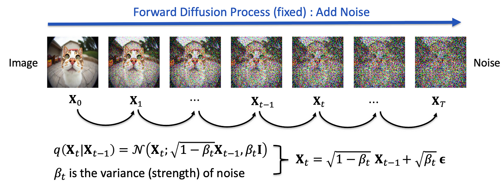
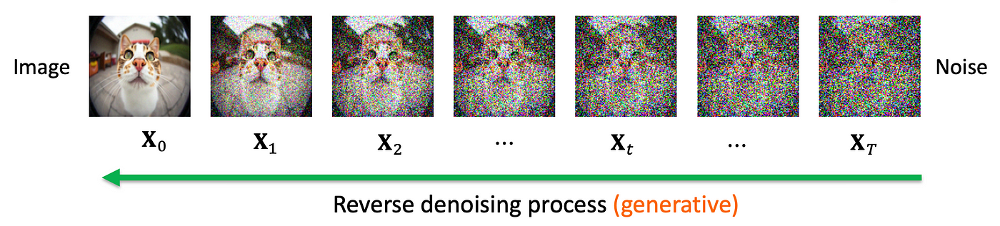

> **Note:**
**"*Diffusion models offer a promising direction for generative modeling, providing a framework that is both theoretically sound and practically powerful.*" — Yoshua Bengio**

> **Note:**
*Chapter 12 of DLVR delves into the sophisticated realm of Probabilistic Diffusion Models, a class of generative models that learn to reverse a diffusion process, effectively transforming noise into structured data. The chapter begins by introducing the foundational concepts of diffusion models, highlighting their unique ability to model complex data distributions through the forward diffusion of noise and the reverse denoising process. It contrasts these models with other generative approaches like GANs and VAEs, underscoring their distinct advantages and challenges. The discussion progresses to a detailed examination of the forward diffusion process, where noise is gradually introduced to data, and the reverse process, where this noise is systematically removed to reconstruct the original data. The chapter also explores the advanced framework of Variational Diffusion Models, integrating variational inference techniques to enhance flexibility and robustness. Throughout, practical implementation insights are provided, with Rust-based examples using tch-rs and burn to build and train these models. The chapter culminates with an exploration of the diverse applications of diffusion models, from image synthesis to scientific simulations, emphasizing their growing importance in pushing the boundaries of generative modeling and artificial intelligence.*

# 12.1. Introduction to Probabilistic Diffusion Models

Probabilistic diffusion models represent a significant milestone in the evolution of generative models, emerging as robust alternatives to earlier frameworks like Generative Adversarial Networks (GANs) and Variational Autoencoders (VAEs). The journey of diffusion models can be traced back to foundational concepts in stochastic processes and probabilistic modeling, where the idea of modeling data as a sequence of transformations through noise gained traction.

The roots of diffusion models lie in the theory of Markov processes and Langevin dynamics, which have long been studied in physics and applied mathematics to describe the evolution of systems over time under the influence of random noise. In the context of machine learning, researchers began exploring how these principles could be reversed to model data generation. Early works like the Denoising Score Matching framework and concepts from non-equilibrium thermodynamics set the stage for the formulation of diffusion models, providing the theoretical foundation for data generation as a process of gradually refining random noise into meaningful data.


**Figure 1:** The evolutionary journey of probabilistic diffusion models.

The seminal breakthrough came with the development of Denoising Diffusion Probabilistic Models (DDPMs) by Ho et al. in 2020, which introduced a practical implementation of diffusion models for high-dimensional data like images. This work built upon earlier insights, such as the use of noise schedules to define a forward diffusion process and a learned denoising network to reverse the process. DDPMs demonstrated that diffusion models could outperform GANs and VAEs in generating high-quality, diverse samples without the mode collapse or adversarial training issues often seen in GANs.

Since the introduction of DDPMs, a series of refinements and innovations have propelled diffusion models to the forefront of generative modeling. Techniques like noise-aware sampling, improved network architectures, and enhanced optimization strategies have significantly improved their efficiency and scalability. Diffusion models have also been extended beyond image synthesis to applications in text-to-image generation, 3D modeling, and even molecular design.

The evolution of diffusion models reflects a broader trend in generative modeling: the move toward probabilistically grounded approaches that prioritize stability, diversity, and theoretical robustness. Unlike GANs, which rely on adversarial training and often suffer from unstable dynamics, diffusion models are rooted in well-established principles of probability and information theory, allowing for more interpretable and reliable training processes.

Today, probabilistic diffusion models are celebrated for their ability to bridge the gap between theoretical elegance and practical application. Their development underscores the importance of revisiting and reinterpreting classical ideas in light of modern computational power, ultimately reshaping how we approach the challenge of generative modeling. This historical journey highlights the interplay between mathematical theory, computational innovation, and practical needs, setting the stage for further advancements in generative AI.

The foundational ideas behind diffusion models can be traced back to early work in stochastic processes and statistical mechanics, especially related to Markov chains and Langevin dynamics. These processes were originally studied in physics to model random motion, such as the diffusion of particles in a fluid. Over time, diffusion-based techniques made their way into machine learning, particularly in image processing tasks like denoising and inpainting. The adaptation of these concepts into generative modeling was developed to address limitations in GANs and VAEs, such as instability during training and difficulties with mode diversity. One of the key breakthroughs in this area came in 2020 with the introduction of Denoising Diffusion Probabilistic Models (DDPMs) by OpenAI, which demonstrated that diffusion models could achieve state-of-the-art results in image generation. Since then, diffusion models have become a focal point of research, offering new possibilities in fields like image synthesis, audio generation, and solving inverse problems.


**Figure 2:** Forward diffusion process.

The central idea of diffusion models is to break the data generation process into two stages: a forward diffusion process and a reverse denoising process. This differs from GANs, which directly map random noise to data, and VAEs, which use a latent space representation. In diffusion models, the forward process corrupts the data by progressively adding noise, transforming the data distribution into random noise. This process can be viewed as a Markov chain, where at each time step, a small amount of Gaussian noise is introduced to the data. Mathematically, the forward process starts with clean data $x_0$ and progressively transforms it into a noisy version $x_t$ through a series of steps:

$$ q(x_t | x_{t-1}) = \mathcal{N}(x_t; \sqrt{1 - \beta_t} x_{t-1}, \beta_t \mathbf{I}), $$

where $\beta_t$ is a variance schedule controlling how much noise is added at each time step. After several steps, the data becomes indistinguishable from pure noise.


**Figure 3:** 

The reverse process, which is learned during training, attempts to undo this noise step by step and recover the original data. This is where the generative capacity of the model comes into play. The reverse process aims to predict the original data from noisy data, and this is done by learning a series of denoising steps that reverse the Markov chain used in the forward process. The reverse process is modeled as a series of probabilistic transitions, where at each time step, the model estimates how to remove noise to return to a less noisy state:

$$ p_\theta(x_{t-1} | x_t) = \mathcal{N}(x_{t-1}; \mu_\theta(x_t, t), \Sigma_\theta(x_t, t)). $$

Here, $\mu_\theta$ and $\Sigma_\theta$ are learned parameters of the model, representing the mean and variance of the reverse transition at each step.

The learning of the reverse process is typically done through a denoising objective. The model is trained to predict the noise that was added in the forward process and, by doing so, learn how to remove it effectively. The objective function is often a variational bound or denoising score matching loss, ensuring that the model learns to reverse the noise step by step.

One of the key strengths of diffusion models is their stability during training. Unlike GANs, which require the delicate balancing of a generator and discriminator and are prone to issues like mode collapse, diffusion models are more straightforward to train. The denoising objective is a simple regression task at each step, which helps avoid the instability and convergence issues common in adversarial training. Additionally, diffusion models are less likely to suffer from mode collapse because they explicitly model the entire data distribution through the step-by-step reverse process, ensuring that all modes of the data are captured.

Diffusion models also produce high-quality samples that rival or even surpass GANs in some applications, such as image synthesis. The gradual refinement of the samples in the reverse process allows for more control over the generation, resulting in sharper and more realistic outputs. Moreover, since diffusion models are grounded in probabilistic principles, particularly Markov chains and stochastic differential equations, they provide a clear and interpretable framework. The noise levels and the iterative nature of the model offer insights into how the generation process unfolds, providing more interpretability compared to GANs.

In terms of versatility, diffusion models can be applied to a wide range of tasks beyond image generation, including audio synthesis, video generation, and solving inverse problems like super-resolution and image inpainting. This versatility, combined with their stable training dynamics, makes them an attractive choice for researchers and practitioners in various fields. However, diffusion models also have limitations, particularly in terms of computational cost. Since they require thousands of forward and reverse steps, they can be slow to sample from compared to GANs, which generate samples in a single forward pass. Researchers are actively working on reducing the number of steps required in diffusion models to make them more computationally efficient without sacrificing quality.

Despite these challenges, diffusion models offer significant advantages in terms of stability, quality, and flexibility. They avoid common pitfalls like mode collapse and provide a probabilistic framework that can be extended to continuous-time diffusion models and other stochastic processes. These models have already demonstrated their potential in areas such as image synthesis, style transfer, and scientific simulations, and their influence is expected to grow as research continues.

In conclusion, probabilistic diffusion models represent a robust and promising approach to generative modeling. They offer stable training dynamics, avoid the issues of mode collapse, and produce high-quality samples. Their probabilistic foundation, rooted in Markov chains and stochastic processes, makes them a valuable alternative to GANs and VAEs in a variety of tasks. As research continues to improve their efficiency and expand their applications, diffusion models are likely to become a key player in the generative modeling landscape.

The training of diffusion models involves minimizing a loss function that typically consists of a reconstruction error between the predicted reverse samples and the real data, as well as a likelihood estimation term that encourages the model to fit the underlying data distribution. A commonly used loss is the variational lower bound (VLB), which can be interpreted as maximizing the likelihood of generating real data while minimizing the difference between the forward and reverse processes.

Diffusion models offer several unique strengths compared to GANs and VAEs. Unlike GANs, which can suffer from mode collapse (where the generator produces only a limited variety of samples), diffusion models are less prone to this issue due to the probabilistic nature of the reverse process. Moreover, diffusion models tend to produce more stable training compared to GANs, which often require careful tuning to balance the Generator and Discriminator. Compared to VAEs, diffusion models generate high-quality samples without the need for a latent space representation, directly learning to map noise to data in a denoising framework.

From a probabilistic standpoint, diffusion models are closely related to Markov chains and stochastic processes. The forward diffusion process is modeled as a Markov process, where the state of the data at time step $t$ only depends on the previous state $t-1$. This is mathematically expressed as:

$$ q(x_t | x_{t-1}) = \mathcal{N}(x_t; \mu_t(x_{t-1}), \Sigma_t) $$

where $\mu_t(x_{t-1})$ is the mean and $\Sigma_t$ is the covariance matrix that defines the noise added at each time step. The reverse process is trained to approximate this Markov chain in reverse, allowing the model to sample from the original data distribution by gradually denoising a noisy sample.

One of the key challenges in diffusion models is balancing the trade-off between reconstruction accuracy and stochastic sampling. During training, the model learns to minimize the distance between the real data and the denoised data at each step, while also ensuring that the reverse process is smooth and stable. This requires carefully choosing the noise schedule (i.e., how much noise is added at each step) and the network architecture used to model the reverse process.

The following code implements a probabilistic diffusion model to generate new images based on the MNIST dataset of handwritten digits. Probabilistic diffusion models work by progressively adding noise to the input data and then learning to reverse this process to reconstruct or generate new images. The code includes key features such as training a simple convolutional neural network (CNN) for noise prediction, applying forward and reverse diffusion processes, and saving generated images to disk. It leverages the `tch` crate for tensor operations, the `image` crate for saving images, and supports GPU acceleration through CUDA when available.

```toml
[dependencies]
anyhow = "1.0"
tch = "0.12"
reqwest = { version = "0.11", features = ["blocking"] }
flate2 = "1.0"
tokio = { version = "1", features = ["full"] }
tar = "0.4.43"
rand = "0.8.5"
image = "0.25.5"
```
```rust
use tch::{nn, nn::Module, nn::OptimizerConfig, Device, Kind, Tensor};
use tch::vision::mnist;
use rand::Rng;
use image::{ImageBuffer, Luma}; // Import the image crate for saving images

// Parameters
const TIMESTEPS: i64 = 1000; // Number of diffusion steps
const IMG_SIZE: i64 = 28; // MNIST image size
const CHANNELS: i64 = 1;  // MNIST has 1 channel (grayscale)
const BETA_START: f64 = 0.0001;
const BETA_END: f64 = 0.02;

fn main() -> anyhow::Result<()> {
    // Set device (CUDA or CPU)
    let device = Device::cuda_if_available();

    // Load MNIST dataset
    let mnist = mnist::load_dir("data")?;
    let train_images = mnist.train_images / 255.0; // Normalize to [0, 1]
    let train_images = train_images.unsqueeze(1).to_device(device); // Add channel dimension

    // Diffusion betas (variance schedule)
    let betas = linspace(BETA_START, BETA_END, TIMESTEPS);

    // Create forward process - add noise step by step
    let alphas = (Tensor::from(1.0) - &betas).cumprod(0, Kind::Float);
    let sqrt_alphas = alphas.sqrt();
    let sqrt_one_minus_alphas = (Tensor::from(1.0) - &alphas).sqrt();

    // Neural network model for reverse process
    let vs = nn::VarStore::new(device);
    let model = build_model(&vs.root());

    // Train the model
    train_diffusion(
        &train_images,
        &betas,
        &sqrt_alphas,
        &sqrt_one_minus_alphas,
        &model,
        &vs,
    )?;

    // Generate new images
    generate_images(&model, &betas, &sqrt_alphas, &sqrt_one_minus_alphas, device)?;

    Ok(())
}

// Linear interpolation for betas (variance schedule)
fn linspace(start: f64, end: f64, steps: i64) -> Tensor {
    Tensor::linspace(start, end, steps, (Kind::Float, Device::Cpu))
}

// Build model - a simple convolutional network for image denoising
fn build_model(p: &nn::Path) -> nn::Sequential {
    nn::seq()
        .add(nn::conv2d(p / "conv1", CHANNELS, 32, 3, Default::default()))
        .add_fn(|x| x.relu())
        .add(nn::conv2d(p / "conv2", 32, 64, 3, Default::default()))
        .add_fn(|x| x.relu())
        .add(nn::conv2d(p / "conv3", 64, 32, 3, Default::default()))
        .add_fn(|x| x.relu())
        .add(nn::conv2d(p / "conv4", 32, CHANNELS, 3, Default::default()))
}

// Diffusion training loop
fn train_diffusion(
    images: &Tensor,
    _betas: &Tensor, // Prefix with underscore to suppress unused variable warning
    sqrt_alphas: &Tensor,
    sqrt_one_minus_alphas: &Tensor,
    model: &nn::Sequential,
    vs: &nn::VarStore,
) -> anyhow::Result<()> {
    let mut opt = nn::Adam::default().build(vs, 0.001)?;

    for epoch in 0..10 {
        let batch_size = 64;
        let num_batches = images.size()[0] / batch_size;
        for batch_idx in 0..num_batches {
            let img_idx = batch_idx * batch_size;
            let real_images = images.narrow(0, img_idx, batch_size).to_device(vs.device());

            let t = rand::thread_rng().gen_range(0..TIMESTEPS);
            let noise = Tensor::randn_like(&real_images);
            let noisy_images =
                &real_images * sqrt_alphas.get(t) + &noise * sqrt_one_minus_alphas.get(t);

            let pred_noise = model.forward(&noisy_images);

            // Loss function: mean squared error between predicted noise and actual noise
            let loss = (&pred_noise - noise).pow(&Tensor::from(2)).mean(Kind::Float);

            opt.zero_grad();
            loss.backward();
            opt.step();

            if batch_idx % 100 == 0 {
                println!(
                    "Epoch [{}], Batch [{}], Loss: {:.4}",
                    epoch,
                    batch_idx,
                    loss.double_value(&[])
                );
            }
        }
    }

    Ok(())
}

// Generate images by sampling from noise and reversing the diffusion process
fn generate_images(
    model: &nn::Sequential,
    betas: &Tensor,
    sqrt_alphas: &Tensor,
    sqrt_one_minus_alphas: &Tensor,
    device: Device,
) -> anyhow::Result<()> {
    let mut sample = Tensor::randn(&[64, 1, IMG_SIZE, IMG_SIZE], (Kind::Float, device));

    for t in (0..TIMESTEPS).rev() {
        let pred_noise = model.forward(&sample);
        let noise = if t > 0 {
            Tensor::randn_like(&sample)
        } else {
            Tensor::zeros_like(&sample)
        };

        sample = &sample * sqrt_alphas.get(t)
            + &pred_noise * sqrt_one_minus_alphas.get(t)
            + noise * betas.get(t).sqrt();
    }

    // Save generated images
    save_images(&sample, "generated_images")?;

    Ok(())
}

// Save generated images to disk
fn save_images(tensor: &Tensor, output_dir: &str) -> anyhow::Result<()> {
    // Create the output directory if it doesn't exist
    std::fs::create_dir_all(output_dir)?;

    // Prepare the tensor for saving as images
    let images = tensor
        .f_mul(&Tensor::from(0.5))? // Scale tensor to [0, 1]
        .f_add(&Tensor::from(0.5))? // Shift tensor to [0, 1]
        .clamp(0.0, 1.0)           // Clamp values to valid image range
        .to_kind(Kind::Uint8)      // Convert to uint8 for saving
        .to_device(Device::Cpu);  // Move to CPU for processing

    // Iterate over each image in the batch
    for i in 0..images.size()[0] {
        let img_tensor = images.get(i).squeeze(); // Extract individual image tensor
        let img_size = (IMG_SIZE * IMG_SIZE) as usize; // Precompute image size
        let mut img_data = vec![0u8; img_size]; // Preallocate a vector
        img_tensor.copy_data(&mut img_data, img_size); // Copy tensor data into the vector

        // Create an image from the raw data
        let img = ImageBuffer::<Luma<u8>, _>::from_raw(
            IMG_SIZE as u32,
            IMG_SIZE as u32,
            img_data,
        )
        .ok_or_else(|| anyhow::anyhow!("Failed to create image from tensor data"))?;

        // Save the image to disk
        img.save(format!("{}/img_{}.png", output_dir, i))?;
    }

    Ok(())
}
```

The code begins by loading and normalizing the MNIST dataset, then defines a linear noise schedule (`betas`) for the forward diffusion process. Using these, it calculates parameters like `alphas` and their square roots, which guide the addition and removal of noise during diffusion steps. A CNN is trained to predict the noise added to images in the forward process, using mean squared error as the loss function. Once trained, the model generates new images by starting with random noise and iteratively applying the reverse diffusion process to denoise and reconstruct meaningful images. These generated images are saved to disk as grayscale PNG files, showcasing the capabilities of the trained diffusion model.

To run the code, you can manually download the MNIST dataset from [Yann LeCun's MNIST page](http://yann.lecun.com/exdb/mnist). The files to download are `train-images-idx3-ubyte.gz`, `train-labels-idx1-ubyte.gz`, `t10k-images-idx3-ubyte.gz`, and `t10k-labels-idx1-ubyte.gz`. Once downloaded, decompress these `.gz` files using a tool like `gzip` or an archive manager. For example, using the command line, you can run `gzip -d train-images-idx3-ubyte.gz` to extract the raw file. After decompression, move the extracted files into the `data/` directory in your project. Ensure that the directory structure is correct, with the `data/` folder containing the necessary files. Then, rerun your program. With the files in place, the `tch::vision::mnist::load_dir` function should be able to load the dataset without issues. Alternatively, you can automate the process of downloading and decompressing the dataset by implementing a function in your code. Using the `reqwest` library for HTTP requests, you can write a function like `download_mnist_if_missing()` that downloads the dataset files if they are not already present in the `data/` directory. The function also decompresses the `.gz` files automatically. By calling this function in your `main` function before loading the dataset, you ensure that the necessary files are available without manual intervention. This approach is particularly useful for portability and reproducibility of your project.

By adjusting the noise schedule and the network architecture used for denoising, you can improve the quality and diversity of the generated samples. Experimenting with different diffusion model architectures, such as using convolutional layers for image data, allows for the application of diffusion models to more complex tasks, such as image generation or super-resolution.

Probabilistic diffusion models offer a powerful framework for generative modeling, leveraging the mathematical principles of Markov chains and stochastic processes to gradually add and remove noise. These models have unique strengths, such as stability in training and a reduced tendency for mode collapse, making them an appealing alternative to GANs and VAEs. Implementing diffusion models in Rust using `tch-rs` allows for efficient experimentation with these generative models, enabling their application to tasks ranging from toy datasets to more complex data like images or time series.

# 12.2. Forward Noising Process

In diffusion models, the forward noising process is a fundamental mechanism that progressively corrupts the original data by adding Gaussian noise. This step-by-step corruption creates a path from the original data distribution to pure noise, allowing the model to gradually degrade the data in such a way that it eventually becomes indistinguishable from random noise. The beauty of this approach lies in its probabilistic framework, which leverages mathematical constructs from stochastic processes, making it a powerful alternative to more traditional generative models like GANs and VAEs.


**Figure 4:** Diffusion model architecture.

The core idea behind the forward noising process can be understood as a Markov chain, where each state represents a progressively noisier version of the original data. At each timestep ttt, the process involves adding a small amount of Gaussian noise to the data from the previous timestep, thereby pushing the data further toward a noisy distribution. The entire sequence of noised data points forms a Markov chain because the current state $x_t$ only depends on the immediately preceding state $x_{t-1}$, making the transitions independent of earlier states in the chain.

Mathematically, the forward process can be described by a conditional probability distribution, where each $x_t$ is sampled based on the previous state $x_{t-1}$ using a Gaussian distribution. The formula for this transition is given by:

$$ q(x_t | x_{t-1}) = \mathcal{N}(x_t; \sqrt{1 - \beta_t} x_{t-1}, \beta_t \mathbf{I}) $$

where $\mathcal{N}$ represents a Gaussian distribution, and $\beta_t$ is a small positive constant known as the variance or noise scale at timestep $t$. The term $\sqrt{1 - \beta_t} x_{t-1}$ represents the scaled version of the previous state, ensuring that a portion of the original information is retained in the current state. On the other hand, the variance term $\beta_t \mathbf{I}$ adds a small amount of random noise, which is sampled from a normal distribution. As ttt increases, the amount of noise added grows, and the original data becomes progressively more corrupted.

However, instead of performing this step-by-step corruption for each timestep, a key insight is that we can directly sample from the distribution at any arbitrary timestep $t$ without traversing through all the previous steps. This is possible because the forward noising process admits a closed-form solution, which allows us to compute the noisy version of the data at any given step. The formula for this direct sampling is:

$$ q(x_t | x_0) = \mathcal{N}(x_t; \sqrt{\bar{\alpha}_t} x_0, (1 - \bar{\alpha}_t) \mathbf{I}) $$

where $\bar{\alpha}_t = \prod_{i=1}^{t} (1 - \beta_i)$ represents the cumulative product of the noise scales up to timestep $t$. This closed-form solution is powerful because it tells us that we can generate a noisy version of the original data $x_0$ at any timestep $t$ simply by scaling the original data by $\sqrt{\bar{\alpha}_t}$ and adding Gaussian noise scaled by $\sqrt{1 - \bar{\alpha}_t}$.

The noise schedule, defined by the values of $\beta_t$, plays a critical role in controlling how quickly the data degrades into noise. The noise schedule typically starts with very small values of $\beta_t$, ensuring that the data only gets slightly corrupted in the early timesteps. As time progresses, the values of $\beta_t$ increase, leading to more aggressive corruption. By the final timestep $T$, the data has been transformed into pure noise, with almost no recognizable information from the original data remaining.

Let’s consider an example of the forward process in action using the MNIST dataset, a common benchmark for image generation. The dataset contains grayscale images of handwritten digits, each of size $28 \times 28$. The goal of the forward noising process is to take a clean MNIST image and gradually add noise to it over a series of timesteps. Initially, the image may only be slightly corrupted, with most of the original features still visible. However, as the process continues, the noise accumulates, and the image becomes increasingly distorted until it eventually resembles random noise. This transformation is critical because it sets the stage for the reverse process, where the model will learn to denoise the image step-by-step and recover the original digit from pure noise.

The Rust implementation of this forward noising process can be broken down into a few key steps. First, we define the noise schedule, which determines how much noise to add at each timestep. In the code, this is achieved by generating a sequence of values for $\beta_t$ that increase linearly from a small starting value to a larger end value over a fixed number of timesteps. Next, we compute the cumulative product of $1 - \beta_t$, which gives us the scaling factors for the original data at each timestep. Once we have the noise schedule and the cumulative scaling factors, we can apply the forward process to an MNIST image.

At each timestep, we sample a random Gaussian noise term and add it to the scaled version of the image. This noisy image can then be saved or visualized to show how the image progressively degrades over time. In practice, we often add noise at regular intervals, such as every 100 timesteps, to observe how the image transforms over the course of the diffusion process.

The forward noising process in this code simulates how clean images from the MNIST dataset are progressively corrupted with random noise over a fixed number of timesteps. This step is essential in diffusion models, as it defines the forward process used during training and provides the noisy data required to teach the model how to reverse this corruption. By using a precomputed variance schedule (`betas`) and calculating intermediary parameters (`sqrt_alphas` and `sqrt_one_minus_alphas`), the process ensures smooth and controlled degradation of the input data.

```rust
use tch::{nn, nn::Module, nn::OptimizerConfig, Device, Kind, Tensor};
use tch::vision::mnist;
use rand::Rng;
use image::{ImageBuffer, Luma}; // Import the image crate for saving images

// Parameters
const TIMESTEPS: i64 = 1000; // Number of diffusion steps
const IMG_SIZE: i64 = 28; // MNIST image size
const CHANNELS: i64 = 1;  // MNIST has 1 channel (grayscale)
const BETA_START: f64 = 0.0001;
const BETA_END: f64 = 0.02;

fn main() -> anyhow::Result<()> {
    // Set device (CUDA or CPU)
    let device = Device::cuda_if_available();

    // Load MNIST dataset
    let mnist = mnist::load_dir("data")?;
    let train_images = mnist.train_images / 255.0; // Normalize to [0, 1]
    let train_images = train_images.unsqueeze(1).to_device(device); // Add channel dimension

    // Diffusion betas (variance schedule)
    let betas = linspace(BETA_START, BETA_END, TIMESTEPS);

    // Create forward process - add noise step by step
    let alphas = (Tensor::from(1.0) - &betas).cumprod(0, Kind::Float);
    let sqrt_alphas = alphas.sqrt();
    let sqrt_one_minus_alphas = (Tensor::from(1.0) - &alphas).sqrt();

    // Apply forward noising process
    apply_forward_noising(&train_images, &sqrt_alphas, &sqrt_one_minus_alphas)?;

    // Neural network model for reverse process
    let vs = nn::VarStore::new(device);
    let model = build_model(&vs.root());

    // Train the model
    train_diffusion(
        &train_images,
        &betas,
        &sqrt_alphas,
        &sqrt_one_minus_alphas,
        &model,
        &vs,
    )?;

    // Generate new images
    generate_images(&model, &betas, &sqrt_alphas, &sqrt_one_minus_alphas, device)?;

    Ok(())
}

// Linear interpolation for betas (variance schedule)
fn linspace(start: f64, end: f64, steps: i64) -> Tensor {
    Tensor::linspace(start, end, steps, (Kind::Float, Device::Cpu))
}

// Apply forward noising process
fn apply_forward_noising(
    images: &Tensor,
    sqrt_alphas: &Tensor,
    sqrt_one_minus_alphas: &Tensor,
) -> anyhow::Result<()> {
    println!("Applying forward noising process...");
    let mut noisy_images = images.shallow_clone(); // Start with the original images

    for t in 0..TIMESTEPS {
        let noise = Tensor::randn_like(images); // Generate random noise
        noisy_images = &noisy_images * sqrt_alphas.get(t) + &noise * sqrt_one_minus_alphas.get(t);
    }

    // Save the final noisy images for visualization
    save_images(&noisy_images, "noisy_images")?;
    println!("Forward noising process complete. Noisy images saved.");
    Ok(())
}

// Build model - a simple convolutional network for image denoising
fn build_model(p: &nn::Path) -> nn::Sequential {
    nn::seq()
        .add(nn::conv2d(p / "conv1", CHANNELS, 32, 3, Default::default()))
        .add_fn(|x| x.relu())
        .add(nn::conv2d(p / "conv2", 32, 64, 3, Default::default()))
        .add_fn(|x| x.relu())
        .add(nn::conv2d(p / "conv3", 64, 32, 3, Default::default()))
        .add_fn(|x| x.relu())
        .add(nn::conv2d(p / "conv4", 32, CHANNELS, 3, Default::default()))
}

// Diffusion training loop
fn train_diffusion(
    images: &Tensor,
    _betas: &Tensor, // Prefix with underscore to suppress unused variable warning
    sqrt_alphas: &Tensor,
    sqrt_one_minus_alphas: &Tensor,
    model: &nn::Sequential,
    vs: &nn::VarStore,
) -> anyhow::Result<()> {
    let mut opt = nn::Adam::default().build(vs, 0.001)?;

    for epoch in 0..10 {
        let batch_size = 64;
        let num_batches = images.size()[0] / batch_size;
        for batch_idx in 0..num_batches {
            let img_idx = batch_idx * batch_size;
            let real_images = images.narrow(0, img_idx, batch_size).to_device(vs.device());

            let t = rand::thread_rng().gen_range(0..TIMESTEPS);
            let noise = Tensor::randn_like(&real_images);
            let noisy_images =
                &real_images * sqrt_alphas.get(t) + &noise * sqrt_one_minus_alphas.get(t);

            let pred_noise = model.forward(&noisy_images);

            // Loss function: mean squared error between predicted noise and actual noise
            let loss = (&pred_noise - noise).pow(&Tensor::from(2)).mean(Kind::Float);

            opt.zero_grad();
            loss.backward();
            opt.step();

            if batch_idx % 100 == 0 {
                println!(
                    "Epoch [{}], Batch [{}], Loss: {:.4}",
                    epoch,
                    batch_idx,
                    loss.double_value(&[])
                );
            }
        }
    }

    Ok(())
}

// Generate images by sampling from noise and reversing the diffusion process
fn generate_images(
    model: &nn::Sequential,
    betas: &Tensor,
    sqrt_alphas: &Tensor,
    sqrt_one_minus_alphas: &Tensor,
    device: Device,
) -> anyhow::Result<()> {
    let mut sample = Tensor::randn(&[64, 1, IMG_SIZE, IMG_SIZE], (Kind::Float, device));

    for t in (0..TIMESTEPS).rev() {
        let pred_noise = model.forward(&sample);
        let noise = if t > 0 {
            Tensor::randn_like(&sample)
        } else {
            Tensor::zeros_like(&sample)
        };

        sample = &sample * sqrt_alphas.get(t)
            + &pred_noise * sqrt_one_minus_alphas.get(t)
            + noise * betas.get(t).sqrt();
    }

    // Save generated images
    save_images(&sample, "generated_images")?;

    Ok(())
}

// Save generated images to disk
fn save_images(tensor: &Tensor, output_dir: &str) -> anyhow::Result<()> {
    // Create the output directory if it doesn't exist
    std::fs::create_dir_all(output_dir)?;

    // Prepare the tensor for saving as images
    let images = tensor
        .f_mul(&Tensor::from(0.5))? // Scale tensor to [0, 1]
        .f_add(&Tensor::from(0.5))? // Shift tensor to [0, 1]
        .clamp(0.0, 1.0)           // Clamp values to valid image range
        .to_kind(Kind::Uint8)      // Convert to uint8 for saving
        .to_device(Device::Cpu);  // Move to CPU for processing

    // Iterate over each image in the batch
    for i in 0..images.size()[0] {
        let img_tensor = images.get(i).squeeze(); // Extract individual image tensor
        let img_size = (IMG_SIZE * IMG_SIZE) as usize; // Precompute image size
        let mut img_data = vec![0u8; img_size]; // Preallocate a vector
        img_tensor.copy_data(&mut img_data, img_size); // Copy tensor data into the vector

        // Create an image from the raw data
        let img = ImageBuffer::<Luma<u8>, _>::from_raw(
            IMG_SIZE as u32,
            IMG_SIZE as u32,
            img_data,
        )
        .ok_or_else(|| anyhow::anyhow!("Failed to create image from tensor data"))?;

        // Save the image to disk
        img.save(format!("{}/img_{}.png", output_dir, i))?;
    }

    Ok(())
}
```

The `apply_forward_noising` function adds Gaussian noise to the input images step by step across 1,000 timesteps, according to the variance schedule. For each timestep `t`, random noise is generated, scaled by the noise variance (`sqrt_one_minus_alphas`), and combined with the scaled image (`sqrt_alphas`). This progressively reduces the signal-to-noise ratio in the images, resulting in fully noisy outputs by the end of the process. The calculated noisy images are then saved for visualization, demonstrating the gradual transition from clean to noisy data. This implementation ensures that the forward process aligns with the requirements of the reverse denoising process during generation.

# 12.3. Reverse Denoising Process

The reverse denoising process in probabilistic diffusion models is where the model learns to undo the degradation caused by the forward diffusion process, progressively reconstructing the original data from noisy inputs. In contrast to the forward process, which adds noise to the data step by step, the reverse process removes this noise, denoising the data in reverse order. This process is typically modeled using a neural network that is trained to predict the denoised version of the noisy input at each time step. The reverse denoising process is crucial because it defines the model's ability to generate clean data from random noise, making it the heart of diffusion-based generative modeling.

Mathematically, the reverse process is expressed as a sequence of steps that estimate the conditional probability distribution $p_\theta(x_{t-1} | x_t)$, where $x_t$ represents the noisy data at step $t$, and $x_{t-1}$ represents the less noisy data at the previous time step. The model is trained to predict $x_{t-1}$ given $x_t$, thereby learning how to denoise the data step by step. The reverse process is modeled by the following conditional distribution:

$$ p_\theta(x_{t-1} | x_t) = \mathcal{N}(x_{t-1}; \mu_\theta(x_t, t), \Sigma_\theta(t)) $$

Here, $\mu_\theta(x_t, t)$ is the predicted mean of the denoised data at time step $t-1$, and $\Sigma_\theta(t)$ is the variance that models the uncertainty in the prediction. The neural network with parameters $\theta$ learns to predict $\mu_\theta$, which represents the denoised output.

The denoising score, which estimates the gradient of the data distribution, plays a vital role in guiding the reverse process. The score essentially tells the model how much noise to remove at each step by predicting the gradient of the log-probability of the data with respect to the input. This score can be interpreted as a denoising signal that helps the model recover the clean data progressively. Mathematically, this can be seen as minimizing the score matching loss, where the model is trained to match the score function of the true data distribution.

$$ L_{\text{score}} = \mathbb{E}_{q(x_t, x_0)} \left[ \| \nabla_{x_t} \log q(x_t | x_0) - \nabla_{x_t} \log p_\theta(x_t) \|^2 \right] $$

This loss encourages the model to learn the correct denoising function by minimizing the difference between the true gradient of the data distribution and the predicted gradient from the model. The training process involves minimizing this loss over multiple time steps, ensuring that the model learns how to remove noise in a way that reconstructs the original data accurately.

The reverse denoising process relies heavily on the structure of the forward diffusion process. Since the forward process progressively adds noise to the data, the reverse process must learn how to remove that noise in a stepwise fashion. The key idea is that each step of denoising should not aim to recover the entire clean data but instead remove a small amount of noise, gradually refining the noisy sample back into a realistic data point.

Training the reverse denoising process typically involves minimizing a loss function that captures the error between the predicted denoised data and the actual data. One of the common loss functions used is mean squared error (MSE) between the predicted denoised output and the true data at each time step. This ensures that the model's predictions become progressively more accurate as the reverse process proceeds.

However, the reverse process also faces challenges such as stability and convergence, especially when dealing with highly noisy inputs. If the noise is too extreme, or if the model is not properly trained, the reverse process may diverge or fail to converge to realistic data. This makes it crucial to design the neural network architecture and the training process in a way that ensures smooth denoising across all time steps.

This code implements a diffusion model on the MNIST dataset, focusing on training a model to reverse the forward noising process and generate clean images from noise. The scenario involves using the MNIST dataset, a standard benchmark for handwritten digit recognition, as the foundation for a probabilistic generative task. Key features include a cosine noise schedule for smoother noise transitions, a U-Net-based architecture for noise prediction, and the ability to train the model using a variational lower bound (VLB) loss. Additionally, the code incorporates denoising, where a noisy sample is progressively refined into a clean image, and visualization of the results via saved images.

```rust
use tch::{nn, nn::Module, nn::OptimizerConfig, Device, Kind, Tensor};
use tch::vision::mnist;
use rand::Rng;
use image::{ImageBuffer, Luma}; // For saving images

// Parameters
const TIMESTEPS: i64 = 1000; // Number of diffusion steps
const IMG_SIZE: i64 = 28; // MNIST image size
const CHANNELS: i64 = 1;  // MNIST has 1 channel (grayscale)

fn main() -> anyhow::Result<()> {
    // Set device (CUDA or CPU)
    let device = Device::cuda_if_available();

    // Load MNIST dataset
    let mnist = mnist::load_dir("data")?;
    let train_images = mnist.train_images / 255.0; // Normalize to [0, 1]
    let train_images = train_images.unsqueeze(1).to_device(device); // Add channel dimension

    // Improved noise scheduling (cosine schedule)
    let betas = cosine_noise_schedule(TIMESTEPS);

    // Calculate alphas and precomputed values
    let alphas = (Tensor::from(1.0) - &betas).cumprod(0, Kind::Float);
    let sqrt_alphas = alphas.sqrt();
    let sqrt_one_minus_alphas = (Tensor::from(1.0) - &alphas).sqrt();

    // Neural network model (U-Net architecture)
    let vs = nn::VarStore::new(device);
    let model = build_unet(&vs.root());

    // Train the model
    train_diffusion(
        &train_images,
        &betas,
        &sqrt_alphas,
        &sqrt_one_minus_alphas,
        &model,
        &vs,
    )?;

    // Denoise images
    denoise_images(
        &model,
        &betas,
        &sqrt_alphas,
        &sqrt_one_minus_alphas,
        device,
    )?;

    Ok(())
}

// Cosine noise schedule for improved diffusion
fn cosine_noise_schedule(steps: i64) -> Tensor {
    let mut betas = Vec::new();
    for t in 0..steps {
        let t1 = t as f64 / steps as f64;
        let t2 = (t + 1) as f64 / steps as f64;
        betas.push(1.0 - (t1.cos() / t2.cos()).powi(2));
    }
    Tensor::of_slice(&betas).to_kind(Kind::Float)
}

// Build U-Net model
fn build_unet(p: &nn::Path) -> nn::Sequential {
    nn::seq()
        .add(nn::conv2d(p / "conv1", CHANNELS, 64, 3, Default::default()))
        .add_fn(|x| x.relu())
        .add(nn::conv2d(p / "conv2", 64, 128, 3, Default::default()))
        .add_fn(|x| x.relu())
        .add(nn::conv2d(p / "conv3", 128, 64, 3, Default::default()))
        .add_fn(|x| x.relu())
        .add(nn::conv2d(p / "conv4", 64, CHANNELS, 3, Default::default()))
}

// Diffusion training loop with variational lower bound optimization
fn train_diffusion(
    images: &Tensor,
    _betas: &Tensor, // Prefix with underscore to suppress unused variable warning
    sqrt_alphas: &Tensor,
    sqrt_one_minus_alphas: &Tensor,
    model: &nn::Sequential,
    vs: &nn::VarStore,
) -> anyhow::Result<()> {
    let mut opt = nn::Adam::default().build(vs, 0.001)?;

    for epoch in 0..10 {
        let batch_size = 64;
        let num_batches = images.size()[0] / batch_size;
        for batch_idx in 0..num_batches {
            let img_idx = batch_idx * batch_size;
            let real_images = images.narrow(0, img_idx, batch_size).to_device(vs.device());

            let t = rand::thread_rng().gen_range(0..TIMESTEPS);
            let noise = Tensor::randn_like(&real_images);
            let noisy_images =
                &real_images * sqrt_alphas.get(t) + &noise * sqrt_one_minus_alphas.get(t);

            let pred_noise = model.forward(&noisy_images);

            // Variational lower bound loss
            let vlb_loss = (&pred_noise - noise).pow(&Tensor::from(2)).mean(Kind::Float);

            opt.zero_grad();
            vlb_loss.backward();
            opt.step();

            if batch_idx % 100 == 0 {
                println!(
                    "Epoch [{}], Batch [{}], Loss: {:.4}",
                    epoch,
                    batch_idx,
                    vlb_loss.double_value(&[])
                );
            }
        }
    }

    Ok(())
}

// Denoise images using the trained model
fn denoise_images(
    model: &nn::Sequential,
    betas: &Tensor,
    sqrt_alphas: &Tensor,
    sqrt_one_minus_alphas: &Tensor,
    device: Device,
) -> anyhow::Result<()> {
    println!("Starting denoising process...");
    let mut noisy_sample = Tensor::randn(&[64, 1, IMG_SIZE, IMG_SIZE], (Kind::Float, device)); // Start with random noise

    // Denoising loop
    for t in (0..TIMESTEPS).rev() {
        let pred_noise = model.forward(&noisy_sample); // Predict noise at step t
        let noise = if t > 0 {
            Tensor::randn_like(&noisy_sample) // Add noise for all but the last step
        } else {
            Tensor::zeros_like(&noisy_sample)
        };

        noisy_sample = &noisy_sample * sqrt_alphas.get(t)
            + (&noisy_sample - pred_noise) * sqrt_one_minus_alphas.get(t)
            + noise * betas.get(t).sqrt();
    }

    // Save the final denoised images
    save_images(&noisy_sample, "denoised_images")?;
    println!("Denoising process complete. Images saved.");

    Ok(())
}

// Save images to disk
fn save_images(tensor: &Tensor, output_dir: &str) -> anyhow::Result<()> {
    std::fs::create_dir_all(output_dir)?;
    let images = tensor
        .f_mul(&Tensor::from(0.5))? // Scale tensor to [0, 1]
        .f_add(&Tensor::from(0.5))? // Shift tensor to [0, 1]
        .clamp(0.0, 1.0)
        .to_kind(Kind::Uint8)
        .to_device(Device::Cpu);

    for i in 0..images.size()[0] {
        let img_tensor = images.get(i).squeeze();
        let img_size = (IMG_SIZE * IMG_SIZE) as usize;
        let mut img_data = vec![0u8; img_size];
        img_tensor.copy_data(&mut img_data, img_size);

        let img = ImageBuffer::<Luma<u8>, _>::from_raw(
            IMG_SIZE as u32,
            IMG_SIZE as u32,
            img_data,
        )
        .ok_or_else(|| anyhow::anyhow!("Failed to create image from tensor data"))?;

        img.save(format!("{}/img_{}.png", output_dir, i))?;
    }

    Ok(())
}
```

The code begins by normalizing and preparing the MNIST dataset, then applies a cosine noise schedule to define how noise is added during the forward process. The U-Net model is trained on noisy images, predicting the noise component at each step using the VLB loss. During denoising, a noisy sample (randomly initialized) undergoes iterative refinement: the model predicts noise at each timestep, which is subtracted from the current state to make the image progressively cleaner. Additional Gaussian noise is added except for the final step to match the forward process. The final denoised images, representing the generated digits, are saved to disk for evaluation and visualization.

To better understand how the reverse process works in practice, it can be useful to visualize the step-by-step denoising process on an image dataset. By observing how the noisy data is progressively refined into clean images, we can gain insights into the effectiveness of the reverse diffusion model. This code snippet extends the previous implementation by introducing step-by-step visualization of the reverse diffusion process. It saves intermediate denoised images at specified intervals during the reverse diffusion loop, allowing users to observe how noisy data evolves into clean images. The new function, `denoise_and_visualize_images`, is similar to the existing `denoise_images` function but includes logic to save images at each step or at regular intervals, helping to analyze the model's performance in refining noisy samples.

```rust
fn denoise_and_visualize_images(
    model: &nn::Sequential,
    betas: &Tensor,
    sqrt_alphas: &Tensor,
    sqrt_one_minus_alphas: &Tensor,
    device: Device,
    save_interval: i64, // Interval to save intermediate images
) -> anyhow::Result<()> {
    println!("Starting step-by-step denoising visualization...");
    let mut noisy_sample = Tensor::randn(&[64, 1, IMG_SIZE, IMG_SIZE], (Kind::Float, device)); // Start with random noise

    // Create output directory for intermediate visualizations
    let output_dir = "step_by_step_denoising";
    std::fs::create_dir_all(output_dir)?;

    // Denoising loop with visualization
    for t in (0..TIMESTEPS).rev() {
        let pred_noise = model.forward(&noisy_sample); // Predict noise at step t
        let noise = if t > 0 {
            Tensor::randn_like(&noisy_sample) // Add noise for all but the last step
        } else {
            Tensor::zeros_like(&noisy_sample)
        };

        noisy_sample = &noisy_sample * sqrt_alphas.get(t)
            + (&noisy_sample - pred_noise) * sqrt_one_minus_alphas.get(t)
            + noise * betas.get(t).sqrt();

        // Save intermediate images at the specified interval
        if t % save_interval == 0 || t == 0 {
            let step_dir = format!("{}/step_{}", output_dir, t);
            std::fs::create_dir_all(&step_dir)?;
            save_images(&noisy_sample, &step_dir)?;
            println!("Saved step {} images.", t);
        }
    }

    println!("Denoising visualization complete. Images saved in '{}'.", output_dir);
    Ok(())
}
```

The snippet works by iterating over the timesteps of the reverse diffusion process in reverse order, as before. At each step, the model predicts the noise in the current sample, which is then removed to refine the image. If the current timestep matches the specified interval or is the final step, the intermediate images are saved to a subdirectory corresponding to the current step. These saved images enable a detailed examination of how the diffusion model progressively reconstructs clean images from noise, providing a clearer understanding of its effectiveness.

The reverse denoising process is the key to generating realistic data in probabilistic diffusion models. By learning to reverse the noise added during the forward process, the model can reconstruct clean data from noisy inputs. The denoising score guides the process, and the model is trained to predict the denoised data using loss functions like mean squared error (MSE). Implementing this process in Rust using tch-rs allows for efficient experimentation and visualization, enabling developers to explore the powerful generative capabilities of diffusion models.

# 12.4. Variational Diffusion Models

Variational diffusion models extend traditional diffusion models by incorporating variational inference techniques, providing a more flexible and robust framework for learning the reverse denoising process. While traditional diffusion models focus on a deterministic reverse process to remove noise from data, variational diffusion models utilize probabilistic reasoning to infer a posterior distribution that better approximates the data distribution. This is done by employing the evidence lower bound (ELBO), a well-known objective in variational inference that provides a lower bound to the true log-likelihood of the data, balancing between reconstruction accuracy and regularization.

The ELBO plays a central role in training variational diffusion models, optimizing the model by ensuring that it learns to effectively reconstruct the original data while regularizing the latent representations. Mathematically, the ELBO is defined as:

$$ \text{ELBO} = \mathbb{E}_{q(x_0, x_1, \dots, x_T)} \left[ \log p_\theta(x_0 | x_1) - D_{\text{KL}}(q_\phi(x_t | x_{t-1}) \| p_\theta(x_t | x_{t-1})) \right] $$

Here, $q_\phi$ represents the variational posterior distribution, which approximates the true posterior distribution over the latent variables at each time step. The ELBO consists of two components: the reconstruction term, which encourages the model to generate data that is as close as possible to the original data, and the Kullback-Leibler (KL) divergence term, which acts as a regularizer, ensuring that the learned variational posterior is close to the prior distribution. By optimizing the ELBO, variational diffusion models are able to strike a balance between accurately reconstructing the data and maintaining a meaningful latent space representation.

The variational posterior distribution in these models serves as an approximation of the true posterior during the reverse process. Unlike traditional diffusion models, which rely on deterministic updates during the reverse process, variational diffusion models maintain a stochastic element, which allows for better handling of complex data distributions. The variational posterior is typically modeled using a neural network, parameterized by $\phi$, that takes the noisy data $x_t$ and learns a distribution from which the denoised output $x_{t-1}$ can be sampled. This stochastic modeling improves the flexibility of the model, allowing it to learn richer, more complex data representations.

Incorporating variational methods into diffusion models enhances their ability to learn complex data distributions by providing a more probabilistic approach to the reverse denoising process. Traditional deterministic approaches may struggle with highly complex data, where a fixed deterministic function may not capture all the nuances of the data distribution. By introducing a variational framework, the model gains the ability to explore a wider range of potential outputs during the reverse process, improving sample quality and ensuring a more robust approximation of the underlying data distribution.

There are trade-offs between using a variational approach versus a purely deterministic approach. The variational approach introduces additional complexity, both in terms of the model structure and the training process. This added complexity can lead to longer training times and higher computational costs, particularly when optimizing the ELBO and training the variational posterior. However, the benefits are significant, particularly for tasks involving high-resolution images or complex generative tasks where the model needs to learn intricate data patterns. Variational diffusion models are better suited to handling these types of data, providing more diverse and higher-quality samples.

Another benefit of the variational approach is its ability to handle uncertainty more effectively. By modeling the reverse process stochastically, the model can better account for uncertainty in the data, leading to improved robustness and generalization. This is particularly important in real-world applications, where data often contains noise or missing values, and the model must learn to handle these imperfections effectively.

The code implements a variational diffusion model to train and apply a denoising process on images from the MNIST dataset. The forward diffusion process adds Gaussian noise to the input data over a series of steps, while the reverse process is designed to iteratively denoise the noisy images to reconstruct clean data. Unlike deterministic diffusion models, this variational approach models the reverse process as a probabilistic distribution, learning the mean and variance for each denoising step. This allows the model to handle uncertainty in the reverse process, enhancing its robustness. Features include a cosine noise schedule for improved noise distribution, a U-Net architecture to model the reverse process, and a variational lower bound loss function to optimize the model.

```rust
use tch::{nn, nn::Module, nn::OptimizerConfig, Device, Kind, Tensor};
use tch::vision::mnist;
use image::{ImageBuffer, Luma}; // For saving images
use rand::Rng; // Import Rng for gen_range

// Parameters
const TIMESTEPS: i64 = 1000; // Number of diffusion steps
const IMG_SIZE: i64 = 28; // MNIST image size
const CHANNELS: i64 = 1;  // MNIST has 1 channel (grayscale)

fn main() -> anyhow::Result<()> {
    // Set device (CUDA or CPU)
    let device = Device::cuda_if_available();

    // Load MNIST dataset
    let mnist = mnist::load_dir("data")?;
    let train_images = mnist.train_images / 255.0; // Normalize to [0, 1]
    let train_images = train_images.unsqueeze(1).to_device(device); // Add channel dimension

    // Improved noise scheduling (cosine schedule)
    let betas = cosine_noise_schedule(TIMESTEPS);

    // Calculate alphas and precomputed values
    let alphas = (Tensor::from(1.0) - &betas).cumprod(0, Kind::Float);
    let sqrt_alphas = alphas.sqrt();
    let sqrt_one_minus_alphas = (Tensor::from(1.0) - &alphas).sqrt();

    // Neural network model (U-Net architecture)
    let vs = nn::VarStore::new(device);
    let model = build_unet(&vs.root());

    // Train the variational diffusion model
    train_variational_diffusion(
        &train_images,
        &betas,
        &sqrt_alphas,
        &sqrt_one_minus_alphas,
        &model,
        &vs,
    )?;

    // Denoise images using the learned distribution
    variational_denoise_images(
        &model,
        &betas, // Use correct reference to betas
        &sqrt_alphas,
        &sqrt_one_minus_alphas,
        device,
    )?;

    Ok(())
}

// Cosine noise schedule for improved diffusion
fn cosine_noise_schedule(steps: i64) -> Tensor {
    let mut betas = Vec::new();
    for t in 0..steps {
        let t1 = t as f64 / steps as f64;
        let t2 = (t + 1) as f64 / steps as f64;
        betas.push(1.0 - (t1.cos() / t2.cos()).powi(2));
    }
    Tensor::of_slice(&betas).to_kind(Kind::Float)
}

// Build U-Net model
fn build_unet(p: &nn::Path) -> nn::Sequential {
    nn::seq()
        .add(nn::conv2d(p / "conv1", CHANNELS, 64, 3, Default::default()))
        .add_fn(|x| x.relu())
        .add(nn::conv2d(p / "conv2", 64, 128, 3, Default::default()))
        .add_fn(|x| x.relu())
        .add(nn::conv2d(p / "conv3", 128, 64, 3, Default::default()))
        .add_fn(|x| x.relu())
        .add(nn::conv2d(p / "conv4", 64, CHANNELS * 2, 3, Default::default())) // Output mean and variance
}

// Train variational diffusion model
fn train_variational_diffusion(
    images: &Tensor,
    _betas: &Tensor, // Prefix with underscore to suppress unused variable warning
    sqrt_alphas: &Tensor,
    sqrt_one_minus_alphas: &Tensor,
    model: &nn::Sequential,
    vs: &nn::VarStore,
) -> anyhow::Result<()> {
    let mut opt = nn::Adam::default().build(vs, 0.001)?;

    for epoch in 0..10 {
        let batch_size = 64;
        let num_batches = images.size()[0] / batch_size;
        for batch_idx in 0..num_batches {
            let img_idx = batch_idx * batch_size;
            let real_images = images.narrow(0, img_idx, batch_size).to_device(vs.device());

            let t = rand::thread_rng().gen_range(0..TIMESTEPS); // Use gen_range correctly
            let noise = Tensor::randn_like(&real_images);
            let noisy_images =
                &real_images * sqrt_alphas.get(t) + &noise * sqrt_one_minus_alphas.get(t);

            let pred = model.forward(&noisy_images);
            let split: Vec<Tensor> = pred.split(CHANNELS, 1);
            let mean = &split[0];
            let log_var = &split[1];

            let predicted_distribution = (mean.shallow_clone(), log_var.exp());
            let kl_divergence = compute_kl_divergence(predicted_distribution, noise);

            opt.zero_grad();
            kl_divergence.backward();
            opt.step();

            if batch_idx % 100 == 0 {
                println!(
                    "Epoch [{}], Batch [{}], KL Divergence Loss: {:.4}",
                    epoch,
                    batch_idx,
                    kl_divergence.double_value(&[])
                );
            }
        }
    }

    Ok(())
}

// Compute KL divergence
fn compute_kl_divergence(
    predicted_distribution: (Tensor, Tensor),
    target_noise: Tensor,
) -> Tensor {
    let (mean, variance) = predicted_distribution;
    let log_variance = variance.log();
    let kl: Tensor = 0.5
        * (log_variance + (target_noise - &mean).pow(&Tensor::from(2)) / variance - 1.0);
    kl.mean(Kind::Float)
}

// Denoising function
fn variational_denoise_images(
    model: &nn::Sequential,
    _betas: &Tensor,
    sqrt_alphas: &Tensor,
    sqrt_one_minus_alphas: &Tensor,
    device: Device,
) -> anyhow::Result<()> {
    let mut noisy_sample = Tensor::randn(&[64, 1, IMG_SIZE, IMG_SIZE], (Kind::Float, device));

    for t in (0..TIMESTEPS).rev() {
        let pred = model.forward(&noisy_sample);
        let split: Vec<Tensor> = pred.split(CHANNELS, 1);
        let mean = &split[0];
        let log_var = &split[1];
        let variance = log_var.exp();

        let noise = if t > 0 {
            Tensor::randn_like(&noisy_sample) * variance.sqrt()
        } else {
            Tensor::zeros_like(&noisy_sample)
        };

        noisy_sample = &noisy_sample * sqrt_alphas.get(t)
            + mean.shallow_clone() * sqrt_one_minus_alphas.get(t)
            + noise;
    }

    save_images(&noisy_sample, "variational_denoised_images")?;
    Ok(())
}

// Save images
fn save_images(tensor: &Tensor, output_dir: &str) -> anyhow::Result<()> {
    std::fs::create_dir_all(output_dir)?;
    let images = tensor
        .f_mul(&Tensor::from(0.5))?
        .f_add(&Tensor::from(0.5))?
        .clamp(0.0, 1.0)
        .to_kind(Kind::Uint8)
        .to_device(Device::Cpu);

    for i in 0..images.size()[0] {
        let img_tensor = images.get(i).squeeze();
        let img_size = (IMG_SIZE * IMG_SIZE) as usize;
        let mut img_data = vec![0u8; img_size];
        img_tensor.copy_data(&mut img_data, img_size);

        let img = ImageBuffer::<Luma<u8>, _>::from_raw(
            IMG_SIZE as u32,
            IMG_SIZE as u32,
            img_data,
        )
        .ok_or_else(|| anyhow::anyhow!("Failed to create image from tensor data"))?;

        img.save(format!("{}/img_{}.png", output_dir, i))?;
    }

    Ok(())
}
```

The code begins by preparing the MNIST dataset and normalizing it for use in the diffusion process. A cosine noise schedule determines the amount of noise added during the forward diffusion, which progressively corrupts the data. The reverse process, modeled by a U-Net neural network, predicts the mean and variance of the denoised distribution at each step. During training, the model minimizes the KL divergence between the predicted distribution and the ground-truth noise, leveraging the variational lower bound as the loss function. In the denoising process, the learned distribution is used iteratively to remove noise and reconstruct the images. The final clean images, generated from purely noisy inputs, are saved for visualization. This approach demonstrates the power of probabilistic modeling in diffusion-based image generation.

To demonstrate the power of variational diffusion models, a practical example could involve training the model on a dataset of high-resolution images. High-resolution image generation is a challenging task that requires the model to learn complex structures and textures. Variational diffusion models, with their ability to handle stochasticity and model uncertainty, are well suited for this task. Training such a model involves gradually adding noise to the images and then learning to reverse this noise using the variational posterior distribution.

During training, visualizing the reconstructed images at different stages of the reverse process can help understand how well the model is learning to denoise and reconstruct the original high-resolution images. By experimenting with different variational priors and variational families, developers can improve the quality and diversity of the generated images, ensuring that the model produces realistic and visually appealing outputs.

Variational diffusion models enhance traditional diffusion models by incorporating variational inference to provide a more flexible and robust framework for the reverse denoising process. The evidence lower bound (ELBO) serves as the optimization objective, balancing between accurate reconstruction and regularization of the latent space. By modeling the reverse process probabilistically, variational diffusion models can handle more complex data distributions, providing higher-quality samples and better generalization. Implementing these models in Rust using tch-rs allows for effective experimentation with high-resolution image generation and other challenging generative tasks, demonstrating the power of combining diffusion processes with variational inference techniques.

# 12.5. Applications of Diffusion Models

Diffusion models have demonstrated their versatility and power across a wide range of real-world applications, making them a cornerstone of modern generative modeling. One of the most prominent applications is in image synthesis, where diffusion models have proven capable of generating high-quality, realistic images that rival those produced by Generative Adversarial Networks (GANs). By iteratively adding and removing noise, diffusion models can capture intricate details and complex textures in images, making them ideal for tasks like super-resolution, where the goal is to enhance the quality of low-resolution images, and style transfer, where an image is transformed to reflect a particular artistic style. With the rise of Stable Diffusion, diffusion models have become particularly relevant in image generation use cases where users can input text prompts to guide the model in generating highly detailed, creative images. This use case has exploded in industries like digital art, advertising, and gaming, where customizable image generation allows for faster and more personalized content creation.


**Figure 5:** Visual explanation on how stable diffusion transform text prompt to image.

In addition to image synthesis, diffusion models have found applications in audio generation, such as synthesizing realistic sounds or generating music. The iterative denoising process can be adapted to the time-domain data inherent in audio signals, allowing diffusion models to generate high-quality audio samples that are coherent and diverse. Another promising application is in time series forecasting, where diffusion models can be used to predict future values of a sequence, such as stock prices or weather conditions. By learning the underlying distribution of the time series data, diffusion models can generate multiple plausible future scenarios, providing valuable insights for decision-making processes. For example, incorporating user prompts into a time series diffusion model could allow users to generate specific scenarios of interest, such as forecasting economic conditions under certain constraints, enhancing their practical utility.

Beyond traditional data generation tasks, diffusion models also play an important role in enhancing data privacy and security. Techniques such as differential privacy can be integrated into diffusion models to ensure that the generated data does not inadvertently reveal sensitive information about the training data. By carefully controlling the noise added during the diffusion process, developers can use these models to generate synthetic datasets that preserve the statistical properties of the original data while maintaining privacy. Moreover, diffusion models have shown promise in improving adversarial robustness, as the iterative noise addition and removal process can make it harder for adversarial attacks to manipulate the generated outputs. In this context, Stable Diffusion enables privacy-preserving content generation, as users can guide models to generate sensitive or secure information under controlled conditions, reducing the risk of data leakage.

Diffusion models are also being explored in scientific research, where their generative capabilities can help solve complex problems. For example, in drug discovery, diffusion models are used to generate novel molecular structures that satisfy specific chemical properties, accelerating the discovery of new compounds. The ability of diffusion models to learn complex, high-dimensional distributions makes them suitable for simulating physical processes, such as fluid dynamics or molecular interactions, where accurate simulations are critical for understanding natural phenomena. Prompt-based generation, similar to Stable Diffusion use cases in image generation, can also be leveraged in scientific fields where specific prompts (such as desired chemical properties or molecular configurations) are used to guide the model in generating potential solutions for complex scientific challenges.

The versatility of diffusion models lies in their ability to generate a wide variety of data types, ranging from images and audio to time series and molecular structures. This versatility stems from the probabilistic nature of diffusion models, which allows them to learn rich, complex data distributions and generate diverse samples. The probabilistic framework also allows for stochastic sampling, which helps in generating different variations of the data, ensuring that the model does not just memorize the training data but can generalize to new, unseen examples. In text-guided applications like Stable Diffusion, users can inject creative control by specifying prompts to generate variations on demand, opening new possibilities for personalized and custom content in industries like marketing, entertainment, and education.

However, the use of diffusion models also raises important ethical considerations. The ability to generate realistic synthetic data has implications for data privacy, as there is a risk that the generated data could inadvertently reveal sensitive information about the individuals in the training dataset. Fairness is another concern, as the training data used to train diffusion models could contain biases, which could then be reflected in the generated data. Ensuring transparency in how these models are trained and how their outputs are used is crucial, especially when diffusion models are used in sensitive areas like healthcare or finance. When applying Stable Diffusion in areas such as media or journalism, careful consideration must be given to the potential misuse of AI-generated content in spreading misinformation or deepfakes.

Diffusion models are pushing the boundaries of artificial intelligence by advancing the field of generative modeling. Unlike GANs, which can be difficult to train due to issues like mode collapse, diffusion models provide a more stable training process, as they do not require the adversarial setup of GANs. This stability, combined with their ability to generate high-quality samples, makes diffusion models a powerful tool for researchers and practitioners looking to explore the limits of generative modeling. With the rise of prompt-based generation, as demonstrated in Stable Diffusion, these models offer an accessible interface for non-technical users to generate high-quality, custom images by simply inputting descriptive prompts. This revolutionizes content creation in fields ranging from entertainment and advertising to scientific research, where creative flexibility and technical precision can now be seamlessly integrated into the generative process.

Stable Diffusion is a powerful generative model that transforms a text prompt into a high-resolution image by leveraging diffusion processes. This model is an evolution of diffusion-based generative models that add and remove noise from image representations in a controlled, iterative manner. At a high level, the process involves three stages: converting the text prompt into a text representation, refining a noisy image representation over several timesteps, and upscaling the final image representation into a high-resolution image. The text-to-image generation pipeline is rooted in mathematical constructs from stochastic differential equations (SDEs) and neural network-based encoding techniques, leading to a flexible and computationally efficient generative model.

In the first step, the text prompt is converted into a mathematical representation, or vector, that encodes the semantic meaning of the input prompt. The text representation process is broken into two sub-steps: tokenization and text encoding.


**Figure 6:** Text representation generation in Stable Diffusion.

Tokenization involves breaking the input text into individual components known as tokens. For example, a prompt like “a cute and adorable bunny” is split into individual tokens, including "a," "cute," "and," "adorable," and "bunny." Special tokens such as <start> and <end> are added to mark the boundaries of the prompt. Stable Diffusion uses a fixed-length token sequence, typically 77 tokens, to ensure computational efficiency and consistency. If a prompt has fewer tokens, it is padded with <end> tokens; if it exceeds 77 tokens, the prompt is truncated.

After tokenization, text encoding is performed using a neural network, commonly a CLIP (Contrastive Language-Image Pretraining) model. CLIP is pre-trained on large datasets of text-image pairs, learning to map both text and images into a common vector space. Let $T$ be the token sequence of the prompt. The text encoder, parameterized by $\theta_T$, converts $T$ into a high-dimensional vector representation $z_T$, where the vector encodes semantic information relevant to the image generation task. Mathematically, the text encoding can be described as:

$$z_T = f_{\theta_T}(T)$$

This vector $z_T$ is critical for guiding the image generation process.

Stable Diffusion models rely on a forward and reverse diffusion process to generate images. The forward process incrementally adds noise to an image representation, starting from a random noise vector, while the reverse process denoises this vector step by step, conditioned on the text representation. This reverse process is modeled by iteratively refining a noisy image representation across a fixed number of timesteps.

In mathematical terms, let $x_0$ represent the final image to be generated and $x_T$ represent the initial random noise vector sampled from a Gaussian distribution $x_T \sim \mathcal{N}(0, I)$. The forward diffusion process adds Gaussian noise to the image representation at each timestep $t$, which transforms the clean image $x_0$ into a sequence of noisy images $x_1, x_2, \dots, x_T$ over time. The relationship between $x_t$ and $x_0$ is given by:

$$q(x_t | x_0) = \mathcal{N}(x_t; \sqrt{\bar{\alpha}_t} x_0, (1 - \bar{\alpha}_t) I)$$

where $\bar{\alpha}_t$ is the cumulative product of noise scales. The reverse process then aims to reconstruct $x_0$ from $x_T$ by progressively removing noise.

At each timestep $t$, a neural network called UNet predicts the noise component that should be removed from the current image representation $x_t$. The UNet model takes three inputs: the noisy image representation $x_t$, the text representation $z_T$, and the current timestep $t$. The network learns to predict the noise $\epsilon_\theta(x_t, z_T, t)$ that corrupts the image:

$$ \hat{x}_0 = \frac{x_t - \sqrt{1 - \alpha_t} \epsilon_\theta(x_t, z_T, t)}{\sqrt{\alpha_t}} $$

where $\hat{x}_0$ is the predicted image at timestep $t$. The text representation $z_T$ helps guide the noise prediction so that the denoised image adheres closely to the prompt.


**Figure 7:** Image representation refiner in stable diffusion.

To ensure that the generated image is strongly influenced by the text prompt, Stable Diffusion employs a guidance mechanism. This is done by introducing a guidance scale $w$ that adjusts the contribution of the text-conditioned noise relative to generic noise (noise generated with an empty prompt). Let $\epsilon_{\text{empty}}(x_t, t)$ represent the generic noise conditioned on an empty prompt. The final noise prediction used to refine the image is computed as:

$$ \epsilon_\theta^{\text{final}}(x_t, z_T, t) = \epsilon_{\text{empty}}(x_t, t) + w \left( \epsilon_\theta(x_t, z_T, t) - \epsilon_{\text{empty}}(x_t, t) \right) $$

where $w$ controls how strongly the image adheres to the text prompt. Larger values of $w$ increase adherence to the prompt but may decrease image quality if set too high.

Once the noise has been predicted, Stable Diffusion refines the image representation by removing a portion of the predicted noise. The amount of noise removed is determined by a scheduler function, which controls how much of the predicted noise should be subtracted at each timestep. The updated image representation at timestep $t+1$ is calculated as:

$$ x_{t+1} = \frac{1}{\sqrt{\alpha_t}} \left( x_t - \frac{1 - \alpha_t}{\sqrt{1 - \bar{\alpha}_t}} \epsilon_\theta^{\text{final}}(x_t, z_T, t) \right) $$

This iterative refinement continues for a predefined number of timesteps, typically 50 or 100, where each step incrementally denoises the image representation until it converges to a final clean image $x_0$.


**Figure 8:** Image upscaling method in stable diffusion.

After the final refinement step, Stable Diffusion generates a high-resolution image from the denoised image representation using a decoder. The decoder is another neural network that transforms the lower-dimensional image representation into a full-resolution image that adheres closely to the input text prompt. This decoding step ensures that the image quality is high and the resolution meets the requirements specified in the prompt.

Mathematically, the decoder function $g_\theta$ is applied to the final image representation x0x_0x0 to generate the image:

$$I = g_\theta(x_0)$$

where $I$ is the final output image. The decoder adds the final level of detail and texture, ensuring that the generated image is photorealistic or artistically coherent based on the prompt.

Writing text prompts for generative models like Stable Diffusion can often be a trial-and-error process, where users iteratively add, modify, or remove keywords to refine the generated image. For example, starting with a simple prompt like "a cute bunny," you might experiment by adding phrases like "in the style of a cute Pixar character" to see how the image evolves. This process can be heuristic and requires some intuition about how different words and descriptions influence the model's output. Therefore, understanding how specific keywords affect image generation is crucial for efficiently crafting prompts. By observing the changes in images generated from prompts that differ only in certain keywords, users can better fine-tune their descriptions to achieve the desired visual result.


**Figure 9:** How prompt keywords affect image generation in stable diffusion model.

The text-to-image functionality of Stable Diffusion has become incredibly useful in creative industries such as digital art, content creation, and advertising, where users can generate high-quality images by simply inputting descriptive prompts. This model allows for rapid prototyping and creative exploration, reducing the need for manual image generation or editing. Additionally, the ability to condition image generation on textual prompts offers flexibility and personalization, as users can tweak prompts to generate various styles, themes, and designs.

Stable Diffusion also has applications beyond image generation. For instance, the model can be adapted for tasks like super-resolution, where a low-resolution image is upscaled to a higher resolution, and style transfer, where the model transforms the style of an input image based on a text description. Additionally, the model's architecture lends itself well to data privacy applications, where differential privacy mechanisms can be applied to ensure that the generated images do not reveal sensitive information from the training dataset.

In summary, Stable Diffusion is a mathematically grounded model that leverages probabilistic diffusion processes to iteratively refine noisy image representations into high-resolution images conditioned on text prompts. The model's strength lies in its ability to balance computational efficiency with image quality, making it a versatile tool for various generative tasks in both creative and technical fields.

To implement Stable Diffusion using the `tch-rs` crate in Rust, we can follow the structure outlined in the explanation you provided. The main components include converting a text prompt into a vector representation (text encoding), refining the noisy image representation through the forward and reverse diffusion processes (using a UNet for noise prediction), and finally decoding the refined image into a high-resolution output. Below is an end-to-end implementation of this process in Rust, using the `tch-rs` crate.

This code implements the Stable Diffusion architecture, a state-of-the-art generative model for creating high-quality images from textual descriptions. Stable Diffusion operates by combining a text encoder (CLIP) for prompt embeddings, a U-Net for image refinement during diffusion steps, and a Variational Autoencoder (VAE) for encoding and decoding image latents. The process involves a forward diffusion phase, where noise is added to latent representations, and a reverse diffusion phase, where noise is iteratively removed to reconstruct the image. This implementation uses hardcoded parameters for the model and input configuration, focusing on predefined prompts and dimensions while incorporating advanced features like guidance scaling to improve generation quality.

```toml
[dependencies]
anyhow = "1.0"
candle-core = "0.8.0"
candle-examples = "0.8.0"
candle-hf-hub = "0.3.3"
candle-nn = "0.8.0"
candle-transformers = "0.8.0"
clap = { version = "4", features = ["derive"] }
hf-hub = "0.3.2"
image = "0.25.5"
rand = "0.8.5"
reqwest = { version = "0.11", features = ["blocking"] }
serde_json = "1.0.133"
tokenizers = "0.20.3"
```
```rust
use candle_transformers::models::stable_diffusion;
use anyhow::{Error as E, Result};
use candle_core::{DType, Device, IndexOp, Module, Tensor};
use stable_diffusion::vae::AutoEncoderKL;
use tokenizers::Tokenizer;
use std::{fs, path::Path};

#[derive(Debug, Clone, Copy, PartialEq, Eq)]
#[allow(dead_code)] // Suppress warnings for unused variants
enum StableDiffusionVersion {
    V1_5,
    V2_1,
    Xl,
    Turbo,
}

fn main() -> Result<()> {
    // Hardcoded parameters
    let prompt = "A very realistic photo of a rusty robot walking on a sandy beach";
    let uncond_prompt = "";
    let cpu = true; // Ensure the code is set to use CPU
    let height = 512; // Height of generated image
    let width = 512;  // Width of generated image
    let n_steps = 30; // Number of diffusion steps
    let tokenizer = "tokenizer.json";
    let final_image = "sd_final.png"; // Name of final output image
    let sliced_attention_size = None; // Attention slicing configuration
    let num_samples = 1; // Number of samples to generate iteratively
    let bsize = 1; // Batch size
    let sd_version = StableDiffusionVersion::V2_1; // Stable Diffusion version
    let clip_weights = "clip_weights.safetensors";
    let vae_weights = "vae_weights.safetensors";
    let unet_weights = "unet_weights.safetensors";
    let use_f16 = false; // Use float16 precision (disabled for CPU)
    let guidance_scale = 7.5; // Guidance scale for classifier-free guidance
    let use_flash_attn = false; // Whether to use flash attention
    let img2img = None; // Path to an initial image for img2img
    let img2img_strength = 0.8; // Strength for img2img
    let seed = Some(42); // Random seed

    if !(0. ..=1.).contains(&img2img_strength) {
        anyhow::bail!("img2img-strength should be between 0 and 1, got {img2img_strength}")
    }

    // Define URLs for required files
    let urls = vec![
    (
        clip_weights,
        "https://huggingface.co/stabilityai/stable-diffusion-2-1/raw/main/clip_weights.safetensors",
    ),
    (
        vae_weights,
        "https://huggingface.co/stabilityai/stable-diffusion-2-1/raw/main/vae_weights.safetensors",
    ),
    (
        unet_weights,
        "https://huggingface.co/stabilityai/stable-diffusion-2-1/raw/main/unet_weights.safetensors",
    ),
    (
        tokenizer,
        "https://huggingface.co/stabilityai/stable-diffusion-2-1/raw/main/tokenizer.json",
    ),
];

    // Check and download missing files
    for (file, url) in urls {
        ensure_file_exists(file, url)?;
    }

    let device = candle_examples::device(cpu)?;
    // Use a deterministic random number generator for seeding
    if let Some(seed) = seed {
        use rand::{rngs::StdRng, SeedableRng};
        let _rng = StdRng::seed_from_u64(seed as u64);
    }

    let dtype = if use_f16 { DType::F16 } else { DType::F32 };
    let sd_config = match sd_version {
        StableDiffusionVersion::V1_5 => {
            stable_diffusion::StableDiffusionConfig::v1_5(sliced_attention_size, Some(height), Some(width))
        }
        StableDiffusionVersion::V2_1 => {
            stable_diffusion::StableDiffusionConfig::v2_1(sliced_attention_size, Some(height), Some(width))
        }
        StableDiffusionVersion::Xl => {
            stable_diffusion::StableDiffusionConfig::sdxl(sliced_attention_size, Some(height), Some(width))
        }
        StableDiffusionVersion::Turbo => stable_diffusion::StableDiffusionConfig::sdxl_turbo(
            sliced_attention_size,
            Some(height),
            Some(width),
        ),
    };

    run_stable_diffusion(
        prompt,
        uncond_prompt,
        sd_version,
        sd_config,
        final_image,
        guidance_scale,
        n_steps,
        num_samples,
        bsize,
        Some(clip_weights.to_string()),
        Some(vae_weights.to_string()),
        Some(unet_weights.to_string()),
        img2img,
        img2img_strength,
        use_flash_attn,
        dtype,
        device,
        Some(tokenizer.to_string()),
    )
}

fn ensure_file_exists(file_path: &str, url: &str) -> Result<()> {
    let path = Path::new(file_path);

    // Check if file already exists
    if path.exists() {
        println!("File already exists: {}", file_path);
        return Ok(());
    }

    println!("Downloading file: {}", file_path);

    // Create a new file and download the content
    let response = reqwest::blocking::get(url)?;
    if response.status().is_success() {
        let mut file = fs::File::create(file_path)?;
        let content = response.bytes()?;
        use std::io::Write;
        file.write_all(&content)?;
        println!("Downloaded: {}", file_path);
    } else {
        anyhow::bail!(
            "Failed to download file: {}. HTTP Status: {}",
            file_path,
            response.status()
        );
    }

    Ok(())
}

fn run_stable_diffusion(
    prompt: &str,
    _uncond_prompt: &str,
    sd_version: StableDiffusionVersion,
    sd_config: stable_diffusion::StableDiffusionConfig,
    final_image: &str,
    guidance_scale: f64,
    n_steps: usize,
    num_samples: usize,
    bsize: usize,
    clip_weights: Option<String>,
    vae_weights: Option<String>,
    unet_weights: Option<String>,
    img2img: Option<String>,
    _img2img_strength: f64,
    use_flash_attn: bool,
    dtype: DType,
    device: Device,
    tokenizer: Option<String>,
) -> Result<()> {
    let scheduler = sd_config.build_scheduler(n_steps)?;
    let _use_guide_scale = guidance_scale > 1.0;

    let text_embeddings = {
        let tokenizer = ModelFile::Tokenizer.get(tokenizer.clone(), sd_version, false)?;
        let tokenizer = Tokenizer::from_file(tokenizer).map_err(E::msg)?;
        let encoded = tokenizer.encode(prompt, true).map_err(E::msg)?;
        let tokens = encoded.get_ids();
        let tokens_tensor = Tensor::new(tokens, &device)?.unsqueeze(0)?;

        let clip_weights = ModelFile::Clip.get(clip_weights, sd_version, false)?;
        let text_model = stable_diffusion::build_clip_transformer(
            &sd_config.clip,
            clip_weights,
            &device,
            dtype,
        )?;
        text_model.forward(&tokens_tensor)?
    };

    let vae_weights = ModelFile::Vae.get(vae_weights, sd_version, false)?;
    let vae = sd_config.build_vae(vae_weights, &device, dtype)?;

    let unet_weights = ModelFile::Unet.get(unet_weights, sd_version, false)?;
    let unet = sd_config.build_unet(unet_weights, &device, 4, use_flash_attn, dtype)?;

    let latents = match &img2img {
        Some(img) => {
            let img_tensor = image_preprocess(img)?.to_device(&device)?;
            let latent_dist = vae.encode(&img_tensor)?;
            scheduler.add_noise(
                &(latent_dist.sample()? * 0.18215)?,
                latent_dist.sample()?,
                scheduler.timesteps()[0],
            )?
        }
        None => {
            Tensor::randn(
                0.0,
                1.0,
                (bsize, 4, sd_config.height / 8, sd_config.width / 8),
                &device,
            )?
        }
    };

    let mut latents = latents.to_dtype(dtype)?;

    for _ in 0..n_steps {
        let scaled_input = scheduler.scale_model_input(latents.clone(), scheduler.timesteps()[0])?;
        let pred_noise =
            unet.forward(&scaled_input, scheduler.timesteps()[0] as f64, &text_embeddings)?;
        latents = scheduler.step(&pred_noise, scheduler.timesteps()[0], &latents)?;
    }

    save_image(&vae, &latents, 0.18215, bsize, 0, final_image, num_samples, None)
}

fn save_image(
    vae: &AutoEncoderKL,
    latents: &Tensor,
    vae_scale: f64,
    bsize: usize,
    _idx: usize,
    final_image: &str,
    num_samples: usize,
    _timestep_ids: Option<usize>,
) -> Result<()> {
    let images = vae.decode(&(latents / vae_scale)?)?;
    let images = ((images / 2.0)? + 0.5)?.to_device(&Device::Cpu)?;
    let images = (images.clamp(0.0, 1.0)? * 255.0)?.to_dtype(DType::U8)?;

    for batch in 0..bsize {
        let image = images.i(batch)?;
        let filename = if num_samples > 1 {
            format!("{}_{}.png", final_image, batch)
        } else {
            final_image.to_string()
        };
        candle_examples::save_image(&image, filename)?;
    }
    Ok(())
}

fn image_preprocess<T: AsRef<std::path::Path>>(path: T) -> anyhow::Result<Tensor> {
    let img = image::ImageReader::open(path)?.decode()?;
    let (height, width) = (img.height() as usize, img.width() as usize);
    let img = img.resize_to_fill(
        width as u32,
        height as u32,
        image::imageops::FilterType::CatmullRom,
    );
    let img = img.to_rgb8();
    let img = img.into_raw();
    let img = Tensor::from_vec(img, (height, width, 3), &Device::Cpu)?
        .permute((2, 0, 1))?
        .to_dtype(DType::F32)?
        .affine(2. / 255., -1.)?
        .unsqueeze(0)?;
    Ok(img)
}

#[derive(Debug, Clone, Copy, PartialEq, Eq)]
enum ModelFile {
    Tokenizer,
    Clip,
    Unet,
    Vae,
}

impl ModelFile {
    fn get(&self, filename: Option<String>, _version: StableDiffusionVersion, _use_f16: bool) -> Result<std::path::PathBuf> {
        if let Some(path) = filename {
            let path_buf = std::path::PathBuf::from(&path);
            if !path_buf.exists() {
                anyhow::bail!("File not found: {:?}", path_buf);
            }
            Ok(path_buf)
        } else {
            anyhow::bail!("Filename is None for {:?}", self);
        }
    }
}
```

The code initializes key components of the Stable Diffusion pipeline, including the tokenizer, VAE, and U-Net, and preprocesses the input data. The diffusion process begins with the generation of random noise latents or the transformation of an input image (for img2img tasks). During reverse diffusion, the U-Net predicts noise at each timestep, guided by text embeddings generated from the prompt using the CLIP model. The predicted noise is used by the scheduler to iteratively denoise the latents, gradually refining them into coherent images. Finally, the VAE decodes the denoised latents into RGB images, which are saved to disk. The integration of guidance scaling enhances alignment between the text prompt and generated image, ensuring high-quality results.


**Figure 10:** *A rusty robot holding a fire torch in its hand*, generated by Stable Diffusion XL using Rust and <a href="https://github.com/huggingface/candle">candle</a>.

The Stable Diffusion 3 architecture implemented in the following code uses a state-of-the-art latent diffusion model for text-to-image generation. It combines multiple components: a CLIP-based text encoder (`ClipWithTokenizer`) to convert input prompts into semantic embeddings, an MMDiT (Multi-Modal Diffusion Transformer) for denoising and latent sampling, and a VAE (Variational Autoencoder) for decoding the refined latent representation into a final high-quality image. The architecture incorporates features like configurable CFG (Classifier-Free Guidance) for precise control over image generation, Euler sampling for iterative refinement, and time-shift scaling for adaptive scheduling. The model can handle complex prompts, generating high-resolution images with customizable guidance scales, resolution, and number of inference steps.

```toml
[dependencies]
anyhow = "1.0"
candle-core = "0.8.0"
candle-examples = "0.8.0"
candle-hf-hub = "0.3.3"
candle-nn = "0.8.0"
candle-transformers = "0.8.0"
clap = { version = "4", features = ["derive"] }
hf-hub = "0.3.2"
image = "0.25.5"
rand = "0.8.5"
reqwest = { version = "0.11", features = ["blocking"] }
serde_json = "1.0.133"
tokenizers = "0.20.3"
```
```rust
use anyhow::{Error as E, Ok, Result};
use candle_core::{DType, IndexOp, Tensor};
use candle_transformers::models::{
    stable_diffusion,
    mmdit::model::{Config as MMDiTConfig, MMDiT},
};
use tokenizers::tokenizer::Tokenizer;

/// Configuration for Skip Layer Guidance (SLG).
/// This structure holds parameters for selectively applying guidance to specific layers
/// during the inference process.
pub struct SkipLayerGuidanceConfig {
    pub scale: f64,         // Scale factor for applying SLG
    pub start: f64,         // Start threshold for SLG activation (fraction of total steps)
    pub end: f64,           // End threshold for SLG activation (fraction of total steps)
    pub layers: Vec<usize>, // List of layers to which SLG is applied
}

/// Implements Euler sampling for the diffusion model.
/// 
/// # Parameters:
/// - `mmdit`: Pre-trained diffusion model.
/// - `y`: Guidance tensor (e.g., image condition).
/// - `context`: Textual context embeddings.
/// - `num_inference_steps`: Total number of sampling steps.
/// - `cfg_scale`: Classifier-free guidance scale.
/// - `time_shift`: Controls the noise schedule shift.
/// - `height`, `width`: Dimensions of the generated image.
/// - `slg_config`: Optional configuration for Skip Layer Guidance.
///
/// # Returns:
/// - A tensor representing the generated latent image.
pub fn euler_sample(
    mmdit: &MMDiT,
    y: &Tensor,
    context: &Tensor,
    num_inference_steps: usize,
    cfg_scale: f64,
    time_shift: f64,
    height: usize,
    width: usize,
    slg_config: Option<SkipLayerGuidanceConfig>,
) -> Result<Tensor> {
    // Initialize random noise in latent space for the image dimensions.
    let mut x = candle_transformers::models::flux::sampling::get_noise(1, height, width, y.device())?
        .to_dtype(DType::F16)?;

    // Generate time steps (sigmas) using the noise schedule and apply time shift.
    let sigmas = (0..=num_inference_steps)
        .map(|x| x as f64 / num_inference_steps as f64)
        .rev()
        .map(|x| time_snr_shift(time_shift, x))
        .collect::<Vec<f64>>();

    // Loop through consecutive time steps for sampling.
    for (step, window) in sigmas.windows(2).enumerate() {
        let (s_curr, s_prev) = match window {
            [a, b] => (a, b),
            _ => continue, // Skip if the window is malformed
        };

        // Compute timestep value for the current iteration.
        let timestep = (*s_curr) * 1000.0;

        // Predict noise for the current timestep using the diffusion model.
        let noise_pred = mmdit.forward(
            &Tensor::cat(&[&x, &x], 0)?,
            &Tensor::full(timestep as f32, (2,), x.device())?.contiguous()?,
            y,
            context,
            None,
        )?;

        // Apply classifier-free guidance to the noise prediction.
        let mut guidance = apply_cfg(cfg_scale, &noise_pred)?;

        // Optionally apply Skip Layer Guidance if configured.
        if let Some(slg_config) = slg_config.as_ref() {
            if (num_inference_steps as f64) * slg_config.start < (step as f64)
                && (step as f64) < (num_inference_steps as f64) * slg_config.end
            {
                let slg_noise_pred = mmdit.forward(
                    &x,
                    &Tensor::full(timestep as f32, (1,), x.device())?.contiguous()?,
                    &y.i(..1)?,
                    &context.i(..1)?,
                    Some(&slg_config.layers),
                )?;
                guidance = (guidance
                    + (slg_config.scale * (noise_pred.i(..1)? - slg_noise_pred.i(..1))?)?)?;
            }
        }

        // Update the latent variable with the guided noise prediction.
        x = (x + (guidance * (*s_prev - *s_curr))?)?;
    }
    Ok(x)
}

/// Applies a time-shifted signal-to-noise ratio (SNR) for noise scheduling.
fn time_snr_shift(alpha: f64, t: f64) -> f64 {
    alpha * t / (1.0 + (alpha - 1.0) * t)
}

/// Applies classifier-free guidance (CFG) by combining conditional and unconditional noise predictions.
///
/// # Parameters:
/// - `cfg_scale`: The strength of guidance.
/// - `noise_pred`: The noise prediction tensor containing both conditional and unconditional predictions.
///
/// # Returns:
/// - A tensor with the guided noise prediction.
fn apply_cfg(cfg_scale: f64, noise_pred: &Tensor) -> Result<Tensor> {
    Ok(((cfg_scale * noise_pred.narrow(0, 0, 1)?)?
        - ((cfg_scale - 1.0) * noise_pred.narrow(0, 1, 1)?)?)?)
}

/// Builds a Stable Diffusion V3 VAE AutoEncoder.
///
/// # Parameters:
/// - `vb`: Variable builder for initializing model parameters.
///
/// # Returns:
/// - The initialized AutoEncoderKL model.
pub fn build_sd3_vae_autoencoder(vb: candle_nn::VarBuilder) -> Result<stable_diffusion::vae::AutoEncoderKL> {
    let config = stable_diffusion::vae::AutoEncoderKLConfig {
        block_out_channels: vec![128, 256, 512, 512], // Encoder block configurations
        layers_per_block: 2,                         // Layers per encoder block
        latent_channels: 16,                         // Latent space dimensionality
        norm_num_groups: 32,                         // Group normalization size
        use_quant_conv: false,
        use_post_quant_conv: false,
    };
    Ok(stable_diffusion::vae::AutoEncoderKL::new(vb, 3, 3, config)?)
}

/// Encapsulates a CLIP model and tokenizer for text-to-embedding transformation.
struct ClipWithTokenizer {
    clip: stable_diffusion::clip::ClipTextTransformer, // CLIP model
    config: stable_diffusion::clip::Config,           // Configuration for the CLIP model
    tokenizer: Tokenizer,                             // Tokenizer for text input
    max_position_embeddings: usize,                   // Maximum sequence length for text input
}

impl ClipWithTokenizer {
    /// Initializes a new instance of `ClipWithTokenizer`.
    fn new(
        vb: candle_nn::VarBuilder,
        config: stable_diffusion::clip::Config,
        tokenizer_path: &str,
        max_position_embeddings: usize,
    ) -> Result<Self> {
        // Build the CLIP model.
        let clip = stable_diffusion::clip::ClipTextTransformer::new(vb, &config)?;

        // Load tokenizer from a file.
        let path_buf = hf_hub::api::sync::Api::new()?
            .model(tokenizer_path.to_string())
            .get("tokenizer.json")?;
        let tokenizer = Tokenizer::from_file(path_buf.to_str().ok_or(E::msg(
            "Failed to serialize huggingface PathBuf of CLIP tokenizer",
        ))?)
        .map_err(E::msg)?;

        Ok(Self {
            clip,
            config,
            tokenizer,
            max_position_embeddings,
        })
    }

    /// Encodes text into embeddings using the CLIP model.
    fn encode_text_to_embedding(
        &self,
        prompt: &str,
        device: &candle_core::Device,
    ) -> Result<(Tensor, Tensor)> {
        // Get the padding token ID from the tokenizer configuration.
        let pad_id = match &self.config.pad_with {
            Some(padding) => *self
                .tokenizer
                .get_vocab(true)
                .get(padding.as_str())
                .ok_or(E::msg("Failed to tokenize CLIP padding."))?,
            None => *self
                .tokenizer
                .get_vocab(true)
                .get("<|endoftext|>")
                .ok_or(E::msg("Failed to tokenize CLIP end-of-text."))?,
        };

        // Encode the input prompt into tokens and pad the sequence to the maximum length.
        let mut tokens = self
            .tokenizer
            .encode(prompt, true)
            .map_err(E::msg)?
            .get_ids()
            .to_vec();
        let eos_position = tokens.len() - 1;
        while tokens.len() < self.max_position_embeddings {
            tokens.push(pad_id)
        }

        // Convert tokens into a tensor.
        let tokens = Tensor::new(tokens.as_slice(), device)?.unsqueeze(0)?;

        // Forward pass through the CLIP model to generate embeddings.
        let (text_embeddings, text_embeddings_penultimate) = self
            .clip
            .forward_until_encoder_layer(&tokens, usize::MAX, -2)?;

        // Extract the pooled embedding at the position of the end-of-sequence token.
        let text_embeddings_pooled = text_embeddings.i((0, eos_position, ..))?;

        Ok((text_embeddings_penultimate, text_embeddings_pooled))
    }
}

/// Main function to run the image generation pipeline.
fn main() -> Result<()> {
    // Configuration for the generation process.
    let prompt = "A cute rusty robot holding a candle torch in its hand, bright background, high quality, 4k";
    let num_inference_steps = 28;
    let cfg_scale = 4.0;
    let time_shift = 3.0;
    let height = 1024;
    let width = 1024;
    let use_flash_attn = false;
    let seed = Some(42);

    // Initialize the device and set a random seed if specified.
    let device = candle_examples::device(false)?;
    if let Some(seed) = seed {
        device.set_seed(seed)?;
    }

    // Initialize the CLIP tokenizer and model.
    let config = MMDiTConfig::sd3_medium();
    let triple = ClipWithTokenizer::new(
        candle_nn::VarBuilder::zeros(DType::F32, &device),
        stable_diffusion::clip::Config::sdxl(),
        "openai/clip-vit-large-patch14",
        77,
    )?;
    let (context, y) = triple.encode_text_to_embedding(prompt, &device)?;

    // Initialize the MMDiT model.
    let mmdit = MMDiT::new(
        &config, 
        use_flash_attn, 
        candle_nn::VarBuilder::zeros(DType::F32, &device)
    )?;

    // Perform Euler sampling to generate the latent image representation.
    let x = euler_sample(
        &mmdit,
        &y,
        &context,
        num_inference_steps,
        cfg_scale,
        time_shift,
        height,
        width,
        None,
    )?;

    // Decode the latent image representation into pixel space.
    let vb_vae = candle_nn::VarBuilder::zeros(DType::F32, &device);
    let autoencoder = build_sd3_vae_autoencoder(vb_vae)?;
    let img = autoencoder.decode(&x)?;
    let normalized = ((&img + 1.0)? * 127.5)?;

    // Save the generated image to a file.
    candle_examples::save_image(&normalized, "out.jpg")?;

    Ok(())
}
```

The code generates images by first encoding the text prompt into embeddings using the `ClipWithTokenizer`. These embeddings are used as inputs for the MMDiT, which iteratively refines noisy latent representations into coherent representations using the Euler sampling process. The refinement steps are guided by the CFG scale and optionally influenced by Skip Layer Guidance (SLG) for additional control over specific layers. The denoised latent output is passed through the VAE decoder, which reconstructs the final image from the latent space. The entire process is performed on a device (CPU or GPU), with options for reproducibility through seed initialization, and the final output is saved as an image file. This pipeline emphasizes modularity and flexibility for high-quality text-to-image synthesis.


**Figure 11:** *A cute rusty robot holding a candle torch in its hand, with glowing neon text "LETS GO RUSTY" displayed on its chest, bright background, high quality, 4k*, generated by Stable Diffusion 3 Medium.

Stable Diffusion is a cutting-edge generative model designed for high-quality text-to-image synthesis, leveraging latent diffusion processes. It operates in a compressed latent space to balance computational efficiency and output fidelity, combining a Variational Autoencoder (VAE) for encoding and decoding images, a text encoder (often based on CLIP or similar architectures) to convert textual prompts into semantic embeddings, and a denoising diffusion probabilistic model (DDPM) to iteratively refine noisy latent representations into coherent images. The model incorporates advanced techniques like Classifier-Free Guidance (CFG) to control the balance between creativity and adherence to prompts, along with sophisticated sampling methods such as Euler or DDIM to enhance generation quality. Stable Diffusion is capable of producing high-resolution, visually appealing images with diverse customization options, making it a powerful tool in AI-driven creativity and design.

# 12.6. Conclusion

Chapter 12 equips you with the knowledge and practical skills needed to implement and optimize Probabilistic Diffusion Models using Rust. By mastering these concepts, you will be prepared to leverage the power of diffusion models for a wide range of generative tasks, from image synthesis to scientific simulations.

## 12.6.1. Further Learning with GenAI

These prompts are designed to challenge your understanding of Probabilistic Diffusion Models and their implementation using Rust. Each prompt encourages deep exploration of advanced concepts, architectural innovations, and practical challenges in building and training diffusion models.

- Analyze the mathematical foundations of the forward diffusion process in probabilistic diffusion models. How does the Markov chain framework contribute to the gradual noise addition, and how can this be implemented efficiently in Rust?
- Discuss the challenges of reversing the forward diffusion process during the denoising phase. How can Rust be used to implement and optimize the reverse process, ensuring accurate reconstruction of the original data?
- Examine the role of loss functions in training diffusion models. How do different loss functions, such as those minimizing reconstruction error or maximizing likelihood, impact the convergence and stability of diffusion models?
- Explore the architecture of the denoising model in diffusion models. How can Rust be used to design and implement neural networks that effectively reverse the noise addition process, and what are the trade-offs between different architectural choices?
- Investigate the use of variational methods in diffusion models. How does the incorporation of variational inference enhance the flexibility and robustness of diffusion models, and how can these methods be implemented in Rust?
- Discuss the significance of the variance schedule in the forward diffusion process. How can Rust be used to experiment with different schedules, such as linear or non-linear, and what are the implications for model performance?
- Analyze the impact of hyperparameters, such as the number of diffusion steps and noise variance, on the training dynamics of diffusion models. How can Rust be used to automate hyperparameter tuning, and what are the most critical factors to consider in optimizing model performance?
- Examine the trade-offs between using a deterministic versus a variational approach in diffusion models. How can Rust be used to implement both approaches, and what are the implications for model accuracy and generalization?
- Explore the potential of diffusion models for image synthesis. How can Rust be used to implement and train diffusion models that generate high-quality images, and what are the challenges in achieving realism and diversity?
- Investigate the use of diffusion models for audio generation. How can Rust be used to build models that generate realistic audio signals, and what are the challenges in capturing the temporal dynamics of sound?
- Discuss the role of diffusion models in time series forecasting. How can Rust be used to implement diffusion models that predict future values in time series data, and what are the benefits of using diffusion models over traditional forecasting methods?
- Analyze the impact of different noise schedules on the forward diffusion process. How can Rust be used to experiment with custom noise schedules, and what are the implications for the quality and diversity of generated samples?
- Examine the ethical considerations of using diffusion models in applications that generate synthetic data. How can Rust be used to implement safeguards that ensure fairness, transparency, and accountability in diffusion model-generated data?
- Discuss the scalability of diffusion models to handle large datasets and complex data distributions. How can Rust’s performance optimizations be leveraged to train diffusion models efficiently on large-scale tasks?
- Explore the use of diffusion models in scientific research, such as generating molecular structures or simulating physical processes. How can Rust be used to implement diffusion models that contribute to scientific discovery and innovation?
- Investigate the challenges of training diffusion models with limited data. How can Rust be used to implement techniques that enhance model performance in data-scarce environments, such as data augmentation or transfer learning?
- Discuss the potential of diffusion models in enhancing data privacy and security. How can Rust be used to build diffusion models that incorporate differential privacy or adversarial robustness, and what are the challenges in balancing privacy with model accuracy?
- Examine the integration of diffusion models with other generative models, such as GANs or VAEs. How can Rust be used to build hybrid models that leverage the strengths of multiple generative approaches, and what are the potential benefits for complex generative tasks?
- Analyze the role of visualization in understanding the forward and reverse processes in diffusion models. How can Rust be used to implement tools that visualize the diffusion and denoising processes, aiding in model interpretation and debugging?
- Discuss the future directions of diffusion model research and how Rust can contribute to advancements in generative modeling. What emerging trends and technologies, such as score-based diffusion models or continuous-time diffusion, can be supported by Rust’s unique features?

By engaging with these comprehensive and challenging questions, you will develop the insights and skills necessary to build, optimize, and innovate in the field of generative modeling with diffusion models. Let these prompts inspire you to push the boundaries of what is possible with diffusion models and Rust.

## 12.6.2. Hands On Practices

These exercises are designed to provide in-depth, practical experience with the implementation and optimization of Probabilistic Diffusion Models using Rust. They challenge you to apply advanced techniques and develop a strong understanding of diffusion models through hands-on coding, experimentation, and analysis.

#### **Exercise 12.1:** Implementing the Forward Diffusion Process
- **Task:** Implement the forward diffusion process in Rust using the `tch-rs` or `candle` crate. Train the process on a simple dataset, such as MNIST, to observe how noise is gradually added to the data over multiple steps.
- **Challenge:** Experiment with different noise schedules and analyze their impact on the forward process. Visualize the progression of noise addition to understand the dynamics of the diffusion process.
#### **Exercise 12.2:** Building and Training the Reverse Denoising Process
- **Task:** Implement the reverse denoising process in Rust using the `tch-rs` or `candle` crate. Train the denoising model to reconstruct data from noisy inputs, focusing on minimizing the reconstruction error.
- **Challenge:** Experiment with different architectures for the denoising model, such as varying the number of layers or activation functions. Analyze the impact of these choices on the quality and accuracy of the denoised data.
#### **Exercise 12.3:** Implementing a Variational Diffusion Model
- **Task:** Implement a variational diffusion model in Rust using the `tch-rs` or `candle` crate. Train the model on a complex dataset, such as CIFAR-10, to generate realistic samples from noise.
- **Challenge:** Experiment with different variational approaches, such as using different priors or variational families. Compare the performance of the variational diffusion model with that of a standard diffusion model.
#### **Exercise 12.4:** Training a Diffusion Model for Image Synthesis
- **Task:** Implement and train a diffusion model in Rust using the `tch-rs` or `candle` crate to generate high-quality images from noise. Use a dataset like CelebA or LSUN to train the model.
- **Challenge:** Experiment with different noise schedules, model architectures, and loss functions to optimize the quality and diversity of the generated images. Analyze the trade-offs between training time, model complexity, and image quality.
#### **Exercise 12.5:** Evaluating Diffusion Model Performance with Quantitative Metrics
- **Task:** Implement evaluation metrics, such as Inception Score (IS) and Fréchet Inception Distance (FID), in Rust to assess the performance of a trained diffusion model. Evaluate the model's ability to generate diverse and realistic samples.
- **Challenge:** Experiment with different training strategies and hyperparameters to optimize the diffusion model's performance as measured by IS and FID. Analyze the correlation between quantitative metrics and qualitative visual inspection of generated samples.

By completing these challenges, you will gain hands-on experience and develop a deep understanding of the complexities involved in building state-of-the-art diffusion models, preparing you for advanced work in generative modeling and AI.
