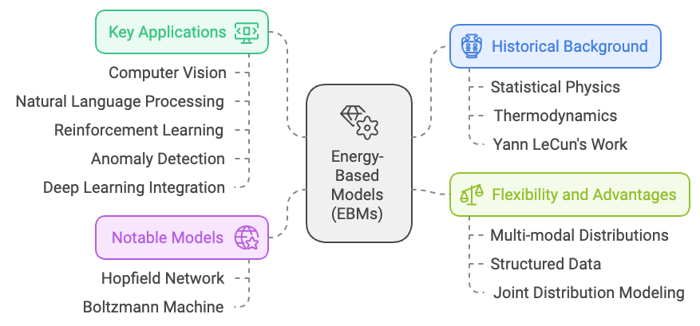
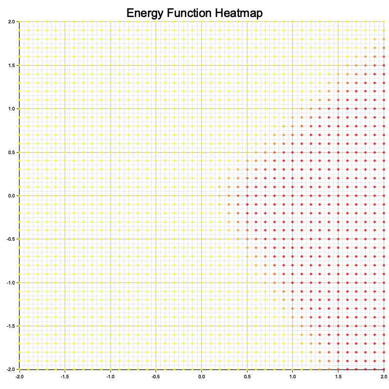
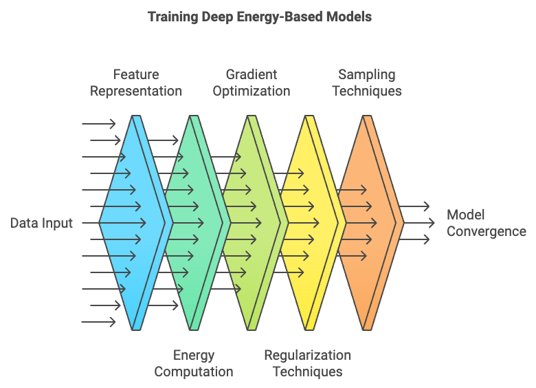
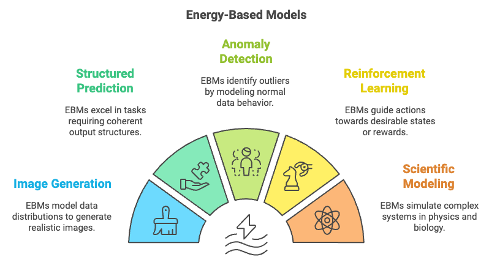

> **Note:**
**"*Energy-Based Models offer a powerful framework for capturing the underlying structure of data, enabling models to learn in a more flexible and interpretable way.*" — Yann LeCun**

> **Note:**
*Chapter 13 of DLVR provides a comprehensive examination of Energy-Based Models (EBMs), a powerful class of probabilistic models where an energy function captures the compatibility between input data and target variables. The chapter begins by introducing the fundamental components of EBMs, including the energy function and the concept of negative sampling, and contrasts EBMs with other generative models like GANs and VAEs, highlighting their unique approach to modeling energy landscapes directly. It delves into the learning and inference processes in EBMs, exploring methods like contrastive divergence and sampling techniques such as MCMC for estimating gradients and generating samples. The chapter further extends to Deep EBMs, where deep neural networks are used to parameterize the energy function, providing the flexibility to capture complex data distributions. Practical implementation guidance is provided throughout, with Rust-based examples using tch-rs and burn to build, train, and apply EBMs to tasks like image classification, structured prediction, and anomaly detection. The chapter also discusses real-world applications of EBMs across various domains, including reinforcement learning, control, and scientific modeling, emphasizing their versatility and potential to advance the field of generative modeling.*

# 13.1. Introduction to Energy-Based Models (EBMs)

Energy-Based Models (EBMs) have their roots in statistical physics, where the concept of energy is used to describe the likelihood of a system being in a certain state. Historically, the idea of energy minimization emerged from the study of physical systems, particularly in thermodynamics, where systems tend to evolve towards states with minimal energy—representing stability or equilibrium. This idea was later adapted into machine learning, particularly through the work of people like Yann LeCun and others in the late 20th century, to model complex probability distributions. In EBMs, the "energy" of a particular configuration of data reflects its compatibility or likelihood. Lower energy states correspond to higher probabilities, and the goal of training is to learn an energy function that assigns low energy values to desired outputs or configurations (such as real images or labels) and higher energy to incorrect or unlikely ones.

One of the earliest applications of energy-based models in machine learning was the Hopfield network, developed in the 1980s. This was one of the first models that used energy minimization principles to explain associative memory and pattern recognition. Each pattern in the network was associated with a low-energy state, and the network's dynamics were designed to move towards these low-energy states, effectively "remembering" stored patterns. Another significant development was the Boltzmann machine, introduced by Geoffrey Hinton and Terry Sejnowski, which explicitly modeled probability distributions using energy functions and was inspired by the physics of spin glasses.


**Figure 1:** History, benefits, applications and previous notable models of EBM.

As machine learning evolved, EBMs gained prominence due to their flexibility. Unlike traditional models that predict explicit outputs given inputs, EBMs focus on modeling relationships between variables through the lens of energy minimization. This allows EBMs to represent much more complex, multimodal data distributions compared to classical probabilistic models. In EBMs, the model doesn’t directly output probabilities; instead, it assigns energy values to possible configurations of the system. These energy values are related to the likelihood of the configurations, with low energy indicating high likelihood. This approach is particularly useful for dealing with structured data, where explicit probability distributions are difficult to model.

One key feature of EBMs is that they are more flexible than other generative models like GANs or VAEs, as they can easily handle multi-modal distributions, where there are multiple plausible outputs for a given input. In contrast to discriminative models, which directly model the conditional probability of a target given input data, EBMs model the joint distribution of inputs and outputs implicitly by learning an energy function that assigns low energy to compatible input-output pairs and high energy to incompatible ones.

Over the years, EBMs have found numerous applications across various fields. One of the notable applications is in computer vision. In vision tasks such as image denoising, image completion, and object detection, energy-based models can be used to model the relationships between pixels or image patches. In these tasks, EBMs can learn the "natural" configurations of images (low-energy states) and predict whether an image is corrupted or anomalous by evaluating its energy. For example, an EBM can be used to detect objects in an image by assigning low energy to configurations where objects are present and high energy to configurations where they are not.

EBMs also play an important role in natural language processing (NLP). In tasks like text generation, translation, or sequence labeling, EBMs model the relationships between sequences of words and the structures in language. They can assign low energy to grammatically and semantically correct sentences and high energy to those that are unlikely or nonsensical. This flexibility allows EBMs to capture complex dependencies in language that might be hard to model with traditional probabilistic approaches.

In reinforcement learning, EBMs are employed to model the interaction between an agent and its environment. The energy function can represent the value of a certain state-action pair, where low-energy (high-value) states correspond to desirable outcomes, guiding the agent's learning and decision-making. In this context, EBMs provide a way to model and optimize behavior by finding trajectories or strategies that minimize energy, leading to optimal performance.

Another area where EBMs have been influential is in anomaly detection. Since EBMs can model what constitutes a "normal" configuration for a system, they can be applied to detect anomalies by identifying states or configurations that have unusually high energy compared to typical configurations. This makes them valuable in fields such as cybersecurity, fraud detection, or industrial monitoring, where it's important to detect outliers or abnormal patterns in data.

More recently, EBMs have also been integrated into deep learning architectures. For instance, deep EBMs use neural networks to parameterize the energy function, allowing them to handle complex, high-dimensional data like images, video, and text. In this context, energy-based models can be used as a general-purpose framework for training unsupervised and semi-supervised models, where the goal is to learn useful representations of the data that capture its underlying structure. This approach has been applied in generative modeling, where EBMs have been used to generate realistic images or predict missing parts of an image.

EBMs are also gaining interest for their potential in multi-task learning and structured prediction, where the goal is to predict complex outputs that have interdependencies, such as sequences, trees, or graphs. The energy function can be designed to capture these dependencies, making EBMs an attractive option for tasks like speech recognition, machine translation, and protein folding, where relationships between different parts of the data are crucial.


**Figure 2:** Illustration of Energy Based Model (EBM).

The core components of an EBM include the energy function, the data distribution, and the concept of negative sampling. The energy function, $E(x, y)$, assigns a scalar value to the input-output pair $(x, y)$. Lower values of $E(x, y)$ indicate that $y$ is more likely to be a compatible output for input $x$, while higher values imply the opposite. To derive a probability distribution from the energy function, EBMs use the Boltzmann distribution:

$$
p(y | x) = \frac{e^{-E(x, y)}}{Z(x)}
$$

where $Z(x)$ is the partition function or normalization constant given by:

$$
Z(x) = \sum_{y} e^{-E(x, y)}
$$

The partition function ensures that the distribution sums to one, making it a valid probability distribution. However, computing $Z(x)$ can be extremely challenging in practice, especially for high-dimensional data, as it involves summing over all possible states $y$. This difficulty is a major obstacle in EBMs, and a significant portion of research and practical implementation focuses on methods to approximate or avoid direct calculation of the partition function.

One common approach to circumvent the intractable nature of the partition function is to use techniques like negative sampling or contrastive divergence. Negative sampling involves generating negative examples (i.e., examples that do not fit the data well) and training the model to assign higher energy values to these examples while assigning lower energy values to positive examples. This way, the model learns to shape the energy landscape such that valid data configurations have low energy and invalid ones have high energy.

Compared to other probabilistic models like GANs and VAEs, EBMs directly model the energy landscape without requiring an explicit latent variable representation. GANs rely on an adversarial setup with a generator and discriminator, while VAEs use latent variables to approximate the data distribution. In contrast, EBMs offer a more straightforward approach by focusing on energy minimization, which can lead to more stable training under certain conditions and allows for flexibility in defining the energy function.

The role of the energy function is crucial in determining the behavior of EBMs. The model's goal is to learn an energy function that assigns low energy to configurations that match the data and high energy to configurations that do not. For instance, in the context of a binary classification task, the energy function can be used to determine the compatibility of a given input with each possible label. The model is trained to assign lower energy to the correct label and higher energy to incorrect labels.

The partition function $Z(x)$ is necessary to turn the energy function into a valid probability distribution. However, computing $Z(x)$ is often intractable for high-dimensional data, which presents a significant challenge in training EBMs. Techniques like contrastive divergence help approximate the partition function by using samples that approximate the true data distribution. In contrastive divergence, the model is updated based on the difference between the energy assigned to samples from the true data distribution and samples generated by the model itself. This iterative process allows the model to refine the energy landscape without directly calculating the partition function.

To demonstrate the practical application of EBMs, consider a binary classification problem where we want to classify points in a two-dimensional space into two classes. The EBM is trained to assign lower energy to points that belong to the correct class and higher energy to points that belong to the incorrect class. During training, we visualize the energy landscape by plotting the energy values over the input space, which helps us understand how the model differentiates between the two classes. The energy landscape should ideally have low-energy regions corresponding to the true data distribution, while regions corresponding to incorrect classifications should have high energy. By experimenting with different network architectures and training strategies, we can refine the energy landscape to improve classification performance and generalization.

This Rust program implements a simple energy-based model using the `tch` library for machine learning and the `plotters` library for visualization. The energy-based model consists of a neural network with two linear layers, where the energy function maps input tensors to scalar values. The program trains this model on synthetic 2D data by minimizing the energy of true samples while maximizing the energy of perturbed negative samples. After training, the energy function is visualized as a heatmap over a grid of 2D points, showcasing the learned energy landscape.

```toml
[dependencies]
plotters = "0.3.7"
tch = "0.12.0"
```
```rust
use plotters::prelude::*;
use tch::{nn, Tensor, nn::OptimizerConfig, Kind, Device};

struct EnergyBasedModel {
    fc1: nn::Linear,
    fc2: nn::Linear,
}

impl EnergyBasedModel {
    fn new(vs: &nn::Path) -> Self {
        let fc1 = nn::linear(vs, 2, 16, Default::default());
        let fc2 = nn::linear(vs, 16, 1, Default::default());
        EnergyBasedModel { fc1, fc2 }
    }

    fn energy(&self, x: &Tensor) -> Tensor {
        // Ensure input tensor is float32
        let x = x.to_kind(Kind::Float);
        x.apply(&self.fc1).relu().apply(&self.fc2)
    }
}

fn visualize_energy(model: &EnergyBasedModel) -> Result<(), Box<dyn std::error::Error>> {
    let x_range: Vec<f64> = (-20..=20).map(|x| x as f64 / 10.0).collect();
    let y_range: Vec<f64> = (-20..=20).map(|y| y as f64 / 10.0).collect();
    let mut energies = vec![];

    for &x in &x_range {
        for &y in &y_range {
            // Create tensor with explicit float32 type
            let point = Tensor::of_slice(&[x as f32, y as f32])
                .to_kind(Kind::Float)
                .unsqueeze(0);
            let energy = model.energy(&point).double_value(&[]);
            energies.push((x, y, energy));
        }
    }

    // Rest of visualization code remains the same
    let root = BitMapBackend::new("energy_plot.png", (800, 800)).into_drawing_area();
    root.fill(&WHITE)?;
    let mut chart = ChartBuilder::on(&root)
        .caption("Energy Function Heatmap", ("sans-serif", 30))
        .margin(10)
        .x_label_area_size(30)
        .y_label_area_size(30)
        .build_cartesian_2d(-2.0..2.0, -2.0..2.0)?;

    chart.configure_mesh().draw()?;

    chart.draw_series(
        energies.iter().map(|&(x, y, e)| {
            Circle::new(
                (x, y),
                2,
                ShapeStyle {
                    color: RGBColor(255, (255.0 * (1.0 - e)).max(0.0) as u8, 0).mix(0.8),
                    filled: true,
                    stroke_width: 0,
                },
            )
        }),
    )?;

    root.present()?;
    println!("Energy visualization saved to 'energy_plot.png'");
    Ok(())
}

fn main() -> Result<(), Box<dyn std::error::Error>> {
    let vs = nn::VarStore::new(Device::cuda_if_available());
    let model = EnergyBasedModel::new(&vs.root());
    let mut opt = nn::Adam::default().build(&vs, 1e-3).unwrap();

    // Create training data with explicit float32 type
    let data = Tensor::randn(&[64, 2], (Kind::Float, Device::Cpu));
    let _labels = Tensor::randint(2, &[64], (Kind::Int64, Device::Cpu));

    for epoch in 1..=100 {
        let positive_energy = model.energy(&data);
        let noise = Tensor::randn_like(&data) * 0.1;
        let negative_data = &data + &noise;
        let negative_energy = model.energy(&negative_data);
        let loss = positive_energy.mean(Kind::Float) - negative_energy.mean(Kind::Float);

        opt.backward_step(&loss);
        if epoch % 10 == 0 {
            println!("Epoch {}: Loss = {:.4}", epoch, loss.double_value(&[]));
        }
    }

    println!("Training of Energy-Based Model complete!");
    visualize_energy(&model)?;
    Ok(())
}
```

In this implementation, the EnergyBasedModel is a simple neural network with two fully connected layers that represent the energy function. The energy function takes an input tensor (e.g., a feature vector for a classification problem) and returns a scalar value representing the energy of that input. The model is trained by minimizing the energy for positive samples (i.e., samples that match the training data) and maximizing the energy for negative samples (i.e., perturbed or incorrect samples). The negative sampling step generates negative examples by adding random noise to the input data, and the model learns to assign higher energy to these perturbed examples.

The code begins by defining the energy-based model and its architecture, including methods for calculating energy. Training data is generated as 2D points with binary labels, and the model is optimized using the Adam optimizer over 100 epochs. The visualization function computes energy values for a grid of 2D points and uses `plotters` to create a heatmap, saved as `energy_plot.png`. Throughout, data type consistency is maintained by explicitly setting tensor kinds to `Float32` for computations. This ensures stability during model training and when evaluating the energy landscape for visualization.


**Figure 3:** Visualization of energy function from the simple code.

The loss function used in training is designed to minimize the energy assigned to positive samples while maximizing the energy assigned to negative samples. This effectively shapes the energy landscape so that correct configurations have lower energy compared to incorrect ones. By iteratively updating the model parameters, the EBM learns to differentiate between valid and invalid data configurations.

Energy-Based Models (EBMs) provide a powerful framework for modeling complex relationships between input and output variables using an energy function. The energy function assigns a scalar value representing the compatibility of input-output pairs, and the model is trained to learn an energy landscape that favors correct configurations. Compared to other probabilistic models like GANs and VAEs, EBMs offer a more straightforward approach by focusing directly on energy minimization. Implementing EBMs in Rust using tch-rs provides an opportunity to explore this flexible generative modeling approach, with applications ranging from classification to more complex generative tasks.

# 12.2. Learning and Inference in EBMs

Learning and inference in Energy-Based Models (EBMs) involve the estimation of the parameters of the energy function and finding the most likely configurations of inputs and outputs by minimizing the energy. Unlike traditional neural networks that learn by minimizing a loss function representing prediction error, EBMs focus on learning the energy landscape that describes the compatibility between inputs and outputs. The learning process in EBMs typically involves maximum likelihood estimation or contrastive divergence to update the parameters of the energy function so that the energy for correct configurations is minimized, while the energy for incorrect configurations is maximized.

Mathematically, the goal of learning in EBMs is to maximize the likelihood of the data. Given an energy function $E_\theta(x, y)$ parameterized by $\theta$, the probability distribution over the output $y$ given the input $x$ is defined as:

$$
p_\theta(y | x) = \frac{e^{-E_\theta(x, y)}}{Z_\theta(x)}
$$

where $Z_\theta(x)$ is the partition function, given by:

$$
Z_\theta(x) = \sum_{y} e^{-E_\theta(x, y)}
$$

The partition function is crucial for normalizing the distribution, but it is often intractable to compute, especially for high-dimensional data. To estimate the parameters $\theta$, one approach is to use maximum likelihood estimation (MLE), which involves computing the gradient of the log-likelihood. However, due to the intractable nature of the partition function, calculating the exact gradient is impractical. Instead, contrastive divergence (CD) is often used as an approximation.

Contrastive divergence simplifies the learning process by approximating the gradient of the log-likelihood using a method that starts with real data samples and performs a limited number of updates to generate negative samples. These negative samples are used to estimate the gradient, allowing the model to adjust the energy function to assign lower energy to real data and higher energy to negative samples. Specifically, the parameter update rule in contrastive divergence can be expressed as:

$$
\Delta \theta \propto \frac{\partial E_\theta(x, y^+)}{\partial \theta} - \frac{\partial E_\theta(x, y^-)}{\partial \theta}
$$

where $y^+$ represents a positive (real) sample and $y^-$ represents a negative (generated) sample. By iteratively updating the parameters using these gradients, the model gradually shapes the energy landscape to better fit the data distribution.

Inference in EBMs involves finding the configuration of the output that minimizes the energy for a given input. This process can be thought of as finding the most compatible output for a given input by searching for the minimum energy state. This is often achieved using optimization techniques that minimize the energy function directly. However, due to the complexity of the energy landscape, especially for high-dimensional data, efficient sampling techniques are required to explore the energy landscape effectively.

Markov Chain Monte Carlo (MCMC) methods, such as Gibbs sampling and Langevin dynamics, are commonly used to sample from the energy distribution and estimate gradients during learning. Gibbs sampling works by iteratively sampling each variable while keeping the others fixed, allowing the model to explore the energy landscape. Langevin dynamics, on the other hand, combines gradient information with stochastic noise to perform a more informed exploration of the energy landscape. Each method has its own trade-offs: Gibbs sampling is relatively simple but may be slow in high-dimensional spaces, while Langevin dynamics can be more efficient but requires careful tuning of the noise term to ensure stability and convergence.

To implement learning and inference in EBMs using tch-rs, we need to define the energy function, implement the contrastive divergence learning algorithm, and use a sampling technique like Langevin dynamics to approximate gradients. Langevin dynamics is a sampling technique inspired by physical systems, which combines deterministic gradient-based updates with stochastic noise to explore the energy landscape of a system. In this code, Langevin dynamics is used to generate negative samples by iteratively adjusting an input tensor (`x_t`). The updates combine the negative gradient of the energy function (indicating the direction of steepest descent) and Gaussian noise (to introduce stochasticity), which prevents the dynamics from getting stuck in local minima. The combination enables exploration of the energy landscape and simulates sampling from a distribution defined by the energy function.

```rust
use plotters::prelude::*;
use tch::{nn, Tensor, nn::OptimizerConfig, Kind, Device};

struct EnergyBasedModel {
    fc1: nn::Linear,
    fc2: nn::Linear,
}

impl EnergyBasedModel {
    fn new(vs: &nn::Path) -> Self {
        let fc1 = nn::linear(vs, 2, 16, Default::default());
        let fc2 = nn::linear(vs, 16, 1, Default::default());
        EnergyBasedModel { fc1, fc2 }
    }

    fn energy(&self, x: &Tensor) -> Tensor {
        // Ensure input tensor is float32
        let x = x.to_kind(Kind::Float);
        x.apply(&self.fc1).relu().apply(&self.fc2)
    }

    fn langevin_dynamics(&self, x: &Tensor, steps: usize, step_size: f64) -> Tensor {
        let mut x_t = x.shallow_clone().set_requires_grad(true);

        for _ in 0..steps {
            // Clear gradients from previous iteration
            x_t.zero_grad();

            let energy = self.energy(&x_t);
            let energy_mean = energy.mean(Kind::Float);
            energy_mean.backward();

            // Get gradients and detach from computation graph
            let grad = x_t.grad().detach();

            // Update x_t: x_t = x_t - step_size * grad + sqrt(2 * step_size) * noise
            let noise = Tensor::randn_like(&x_t) * (2.0 * step_size).sqrt();
            x_t = x_t - (grad * step_size) + noise;

            // Detach and require gradients for next iteration
            x_t = x_t.detach().set_requires_grad(true);
        }
        x_t.detach()
    }
}

fn visualize_energy(model: &EnergyBasedModel) -> Result<(), Box<dyn std::error::Error>> {
    let x_range: Vec<f64> = (-20..=20).map(|x| x as f64 / 10.0).collect();
    let y_range: Vec<f64> = (-20..=20).map(|y| y as f64 / 10.0).collect();
    let mut energies = vec![];

    for &x in &x_range {
        for &y in &y_range {
            let point = Tensor::of_slice(&[x as f32, y as f32])
                .to_kind(Kind::Float)
                .unsqueeze(0);
            let energy = model.energy(&point).double_value(&[]);
            energies.push((x, y, energy));
        }
    }

    let root = BitMapBackend::new("energy_plot.png", (800, 800)).into_drawing_area();
    root.fill(&WHITE)?;
    let mut chart = ChartBuilder::on(&root)
        .caption("Energy Function Heatmap", ("sans-serif", 30))
        .margin(10)
        .x_label_area_size(30)
        .y_label_area_size(30)
        .build_cartesian_2d(-2.0..2.0, -2.0..2.0)?;

    chart.configure_mesh().draw()?;

    chart.draw_series(
        energies.iter().map(|&(x, y, e)| {
            Circle::new(
                (x, y),
                2,
                ShapeStyle {
                    color: RGBColor(255, (255.0 * (1.0 - e)).max(0.0) as u8, 0).mix(0.8),
                    filled: true,
                    stroke_width: 0,
                },
            )
        }),
    )?;

    root.present()?;
    println!("Energy visualization saved to 'energy_plot.png'");
    Ok(())
}

fn main() -> Result<(), Box<dyn std::error::Error>> {
    let vs = nn::VarStore::new(Device::cuda_if_available());
    let model = EnergyBasedModel::new(&vs.root());
    let mut opt = nn::Adam::default().build(&vs, 1e-3).unwrap();

    // Create data with consistent device
    let device = vs.device();
    let data = Tensor::randn(&[64, 2], (Kind::Float, device));
    let _labels = Tensor::randint(2, &[64], (Kind::Int64, device));

    for epoch in 1..=500 {
        let positive_energy = model.energy(&data);
        let negative_data = model.langevin_dynamics(&data, 10, 0.01);
        let negative_energy = model.energy(&negative_data);

        let loss = positive_energy.mean(Kind::Float) - negative_energy.mean(Kind::Float);

        opt.backward_step(&loss);
        if epoch % 10 == 0 {
            println!("Epoch {}: Loss = {:.4}", epoch, loss.double_value(&[]));
        }
    }

    println!("Training of Energy-Based Model complete!");
    visualize_energy(&model)?;
    Ok(())
}
```

In this implementation, the EnergyBasedModel is defined with two fully connected layers that represent the energy function. The model is trained using contrastive divergence, which involves computing the energy of positive samples (real data) and negative samples (generated via Langevin dynamics). The Langevin dynamics method is used to approximate the gradient by adding stochastic noise to the data while moving in the direction of the energy gradient, allowing the model to explore the energy landscape effectively. The loss function is designed to minimize the energy for real data while maximizing the energy for negative samples, effectively shaping the energy landscape to favor correct configurations.

The code defines an energy-based model using a simple neural network with two linear layers. The energy function maps input tensors to scalar energy values. During training, the model minimizes the energy of real data samples (positive phase) and maximizes the energy of generated negative samples (negative phase) created via Langevin dynamics. The training loop computes the loss as the difference between the mean energies of the positive and negative samples, optimizing the model using the Adam optimizer. After training, the energy function is visualized over a 2D grid using `plotters`, generating a heatmap that illustrates how the model assigns energy to different regions of the input space.

The visualization represents the energy function as a heatmap over a 2D input space. Each point in the grid corresponds to a 2D input value, and its color indicates the energy assigned by the model: lower energy regions are depicted with cooler colors (e.g., blue), while higher energy regions are shown with warmer colors (e.g., red). The heatmap allows you to interpret how the model perceives the input space, with low-energy areas representing likely or favorable configurations (where the model expects real data to lie) and high-energy areas representing less likely configurations. This visualization helps to understand how well the model has learned the structure of the data and the effectiveness of its energy function in differentiating between real and generated samples.


**Figure 4:** Visualization of energy function using Langevin dynamic.

A practical example of using EBMs is to train the model on a structured prediction task, such as predicting the labels of nodes in a graph or segmenting an image. In such tasks, the goal is to find a configuration of output variables that jointly minimizes the energy function, reflecting the compatibility between inputs and outputs. During training, contrastive divergence can be used to update the energy function, and inference can be performed by minimizing the energy for a given input, which can be done using optimization techniques like gradient descent or sampling methods like Gibbs sampling.

For instance, in an image segmentation task, each pixel in the image can be assigned a label representing the object it belongs to. The energy function models the compatibility between neighboring pixels, ensuring that similar pixels are likely to have the same label. By training an EBM on such data, the model learns to assign labels that minimize the overall energy of the image, resulting in coherent segmentations.

Learning and inference in Energy-Based Models (EBMs) differ significantly from traditional neural networks due to the focus on shaping the energy landscape rather than directly predicting outputs. The contrastive divergence learning algorithm allows EBMs to approximate the gradients needed to adjust the energy function, while sampling techniques like Langevin dynamics and Gibbs sampling play a crucial role in exploring the energy landscape and generating negative samples. Implementing these concepts in Rust using tch-rs enables developers to experiment with EBMs for various tasks, from structured prediction to generative modeling, and to explore the unique capabilities of EBMs in capturing complex relationships within data.

# 12.3. Deep Energy-Based Models

Deep Energy-Based Models (Deep EBMs) represent an evolution of traditional EBMs by utilizing deep neural networks to parameterize the energy function. This allows Deep EBMs to model more complex and intricate relationships within the data, capturing dependencies that are challenging for simpler models to represent. In Deep EBMs, the energy function $E_\theta(x, y)$ is parameterized by a deep neural network with parameters θ\\thetaθ. This energy function assigns a scalar energy value to an input-output pair, indicating the compatibility between them. By employing deep neural networks, Deep EBMs are capable of modeling high-dimensional and complex data distributions, making them suitable for tasks such as image generation, structured prediction, and classification.

The architecture of Deep EBMs combines the strengths of deep learning with the probabilistic framework of EBMs. In practice, a deep neural network, such as a convolutional neural network (CNN) or a recurrent neural network (RNN), is used to learn a feature representation of the data, and this representation is then used to compute the energy for a given input-output configuration. The energy landscape produced by the model is much richer and more expressive than that of traditional linear or shallow models, enabling it to capture complex interactions and hierarchical structures within the data. This makes Deep EBMs highly flexible, suitable for dealing with intricate, high-dimensional data in domains such as computer vision and natural language processing.


**Figure 5:** Training lifecycle of Deep EBM model.

The benefits of using deep neural networks in EBMs are substantial, as they provide the ability to learn complex feature hierarchies directly from data, enabling Deep EBMs to model multi-modal distributions and account for intricate dependencies between input features. For example, in the case of image data, a deep EBM can learn to represent different aspects of an image, such as edges, textures, and higher-level semantic features, and use these representations to evaluate the compatibility of different regions or generate new samples.

However, training Deep EBMs presents several challenges, including vanishing gradients and mode collapse. Due to the depth and complexity of the neural networks used to model the energy function, gradients can vanish or explode, making it difficult for the model to converge during training. Mode collapse, a common issue in GANs, can also occur in Deep EBMs, where the model learns to focus on a narrow range of configurations rather than capturing the full diversity of the data distribution. To address these challenges, regularization techniques such as weight decay and batch normalization are often used to stabilize training. Weight decay helps prevent the model from overfitting by penalizing large weights, while batch normalization normalizes activations during training, improving gradient flow and helping to maintain stable convergence.

Deep neural networks enhance the expressiveness of EBMs by providing more flexible energy functions that can capture non-linear dependencies and complex interactions between features. Unlike traditional EBMs, which may rely on simple linear energy functions, Deep EBMs can learn from data with much richer structure, making them more suitable for tasks where relationships between features are not straightforward. For instance, in image classification, a Deep EBM can learn the spatial relationships between different parts of an image, allowing it to model the complex patterns that distinguish different classes.

The training process for Deep EBMs is similar to that of traditional EBMs, where the goal is to adjust the parameters of the energy function such that the energy for correct configurations is minimized while the energy for incorrect configurations is maximized. This is done using contrastive divergence or other sampling-based methods to approximate the gradients. However, due to the depth of the model, the optimization landscape becomes much more complex, requiring careful tuning of hyperparameters and the use of regularization to ensure stable training.

In addition to regularization, sampling techniques like Markov Chain Monte Carlo (MCMC) are crucial for learning in Deep EBMs. Given the high dimensionality of the energy function, sampling methods like Gibbs sampling or Langevin dynamics are used to explore the energy landscape and generate negative samples that help shape the energy function. The quality of these samples is important for ensuring that the model learns a good representation of the data distribution.

To implement Deep EBMs in Rust using tch-rs, we need to define a deep energy function using a deep neural network, train it using a suitable optimization algorithm, and use sampling techniques to generate negative samples for training. This code implements a Deep EBM using a convolutional neural network (CNN) in Rust with the `tch` library. The model is designed to estimate an energy function that assigns a scalar value to input data, capturing its likelihood or quality. The model includes two convolutional layers followed by max-pooling and two fully connected layers, enabling it to handle image data, such as MNIST-like grayscale images. It leverages Langevin dynamics to generate negative samples for training, facilitating contrastive divergence learning, where the model learns to differentiate between real and generated data distributions.

```rust
use tch::{nn, Tensor, nn::OptimizerConfig, Kind, Device};

// Define a Deep Energy-Based Model using a convolutional neural network
struct DeepEnergyBasedModel {
    conv1: nn::Conv2D,
    conv2: nn::Conv2D,
    fc1: nn::Linear,
    fc2: nn::Linear,
}

impl DeepEnergyBasedModel {
    fn new(vs: &nn::Path) -> Self {
        let conv1 = nn::conv2d(vs, 1, 16, 3, Default::default());
        let conv2 = nn::conv2d(vs, 16, 32, 3, Default::default());
        let fc1 = nn::linear(vs, 32 * 5 * 5, 128, Default::default()); // Updated to match 5x5
        let fc2 = nn::linear(vs, 128, 1, Default::default());
        DeepEnergyBasedModel { conv1, conv2, fc1, fc2 }
    }

    // Energy function that assigns a scalar value to an input-output pair
    fn energy(&self, x: &Tensor) -> Tensor {
        let x = x.apply(&self.conv1).relu().max_pool2d_default(2); // 28x28 -> 13x13
        let x = x.apply(&self.conv2).relu().max_pool2d_default(2); // 13x13 -> 5x5
        let x = x.view([-1, 32 * 5 * 5]).apply(&self.fc1).relu().apply(&self.fc2); // Flatten correctly
        x
    }

    // Perform Langevin dynamics to generate negative samples
    fn langevin_dynamics(&self, x: &Tensor, steps: usize, step_size: f64) -> Tensor {
        let mut x_t = x.shallow_clone().set_requires_grad(true);

        for _ in 0..steps {
            x_t.zero_grad();

            let energy = self.energy(&x_t);
            let energy_mean = energy.mean(Kind::Float);
            energy_mean.backward();

            let grad = x_t.grad().detach();
            let noise = Tensor::randn_like(&x_t) * (2.0 * step_size).sqrt();
            x_t = x_t - (grad * step_size) + noise;

            x_t = x_t.detach().set_requires_grad(true);
        }
        x_t.detach()
    }
}

fn main() -> Result<(), Box<dyn std::error::Error>> {
    let vs = nn::VarStore::new(Device::cuda_if_available());
    let model = DeepEnergyBasedModel::new(&vs.root());
    let mut opt = nn::Adam::default().build(&vs, 1e-3).unwrap();

    // Example image data (MNIST-like grayscale images)
    let device = vs.device();
    let data = Tensor::randn(&[64, 1, 28, 28], (Kind::Float, device)); // 64 images, 1 channel, 28x28 size

    // Train the model using contrastive divergence
    for epoch in 1..=100 {
        // Positive phase: compute energy for real data
        let positive_energy = model.energy(&data);

        // Negative phase: generate negative samples using Langevin dynamics
        let negative_data = model.langevin_dynamics(&data, 10, 0.01);
        let negative_energy = model.energy(&negative_data);

        // Loss: minimize positive energy, maximize negative energy
        let loss = positive_energy.mean(Kind::Float) - negative_energy.mean(Kind::Float);

        opt.backward_step(&loss);
        if epoch % 10 == 0 {
            println!("Epoch {}: Loss = {:.4}", epoch, loss.double_value(&[]));
        }
    }

    println!("Training of Deep Energy-Based Model complete!");
    Ok(())
}
```

The code defines the DEBM with convolutional and fully connected layers. In the training loop, it processes real data in the positive phase, computing their energy, and uses Langevin dynamics in the negative phase to generate adversarial negative samples by adding noise and gradient-based updates to the input data. The training objective is to minimize the energy of real samples while maximizing the energy of generated samples, achieved using the Adam optimizer. After 100 epochs, the model effectively learns an energy function that distinguishes real data from negative samples. The code is designed to work efficiently on both CPU and GPU.A practical example of using Deep EBMs is to train the model on a complex dataset, such as CIFAR-10 for image classification. In this task, the Deep EBM learns to assign lower energy to images that belong to the correct class and higher energy to those that do not. By leveraging the expressive power of deep neural networks, the model can learn complex representations of the images, capturing features that distinguish different classes.

During training, regularization techniques like weight decay and batch normalization are applied to ensure stable convergence. Batch normalization helps mitigate the vanishing gradient problem by normalizing activations, ensuring that the gradient flow remains consistent throughout the network. Weight decay prevents overfitting by adding a penalty term to the loss function, encouraging the model to learn more generalized representations of the data.

Deep Energy-Based Models (Deep EBMs) extend traditional EBMs by incorporating deep neural networks to parameterize the energy function, allowing them to capture complex data distributions and model high-dimensional data effectively. By using convolutional and fully connected layers, Deep EBMs can learn rich energy landscapes that represent intricate relationships in the data. However, training Deep EBMs poses several challenges, including issues related to vanishing gradients and mode collapse, which require careful use of regularization and sampling techniques. Implementing Deep EBMs in Rust using tch-rs allows for experimentation with complex datasets and provides an opportunity to explore the potential of EBMs in modern deep learning applications, such as image classification and structured prediction.

# 12.4. Applications of Energy-Based Models

Energy-Based Models (EBMs) have proven to be highly versatile and powerful tools in various real-world applications, ranging from image generation and structured prediction to anomaly detection and reinforcement learning. In image generation, EBMs are used to model the underlying data distribution by assigning lower energy to realistic images and higher energy to non-realistic ones. By learning the energy landscape, EBMs can generate novel images that match the distribution of training data, similar to other generative models like GANs. However, EBMs have a different training paradigm that directly models the energy function, making them potentially more stable and flexible.

In structured prediction tasks, EBMs excel by directly modeling the compatibility between input and output variables, making them suitable for problems such as image segmentation, natural language processing, and graph-based tasks. In these cases, the energy function evaluates the coherence of different parts of the output with respect to the input, allowing EBMs to capture complex dependencies and produce structured outputs that are globally consistent. This ability to capture and represent intricate relationships between elements makes EBMs well-suited for tasks involving interdependent outputs.


**Figure 6:** Potential application areas of Deep EBM models.

Another significant application of EBMs is in anomaly detection, where the goal is to identify outliers or unusual patterns in the data. The energy function of an EBM is trained to assign low energy to normal data and high energy to anomalies. When applied to real-world domains such as financial transactions or network security, EBMs can effectively model normal behavior and identify deviations, which may indicate fraud or potential threats. This makes EBMs particularly valuable in fields where identifying rare, abnormal events is critical to maintaining system integrity and security.

EBMs have also found applications in reinforcement learning (RL) and control systems, where the energy function can represent potential future states or rewards. In this context, EBMs can be used to model the desirability of different states, guiding an agent to select actions that lead to states with low energy (i.e., high reward). By framing the RL problem as an energy minimization task, EBMs provide a new approach to policy learning that complements traditional methods based on value functions or policy gradients.

Beyond these traditional applications, EBMs have the potential to contribute to scientific modeling, such as simulating physical systems or modeling biological processes. For instance, in physics, EBMs can be used to model the energy states of a system, allowing for the simulation of equilibrium states and phase transitions. In biology, EBMs can be applied to model molecular interactions or protein folding, where the energy function represents the stability of different configurations. The flexibility of EBMs in defining the energy landscape makes them a powerful tool for simulating systems that are governed by energy-based dynamics.

The versatility of EBMs lies in their ability to handle various types of data and tasks, from generative modeling and structured prediction to reinforcement learning and scientific simulation. This flexibility is due to the nature of the energy function, which provides a unified way to model the compatibility between inputs and outputs. Unlike models that rely on explicit latent variables or adversarial training, EBMs focus on shaping the energy landscape to reflect the underlying data distribution, allowing them to be applied to a wide range of problems.

However, deploying EBMs in real-world applications presents several ethical considerations and challenges, particularly in terms of interpretability and transparency. The energy function learned by an EBM is often a complex, high-dimensional function that can be difficult to interpret, making it challenging to understand why the model assigns certain energy values to specific inputs or outputs. This lack of transparency can be problematic in sensitive applications, such as financial decision-making or medical diagnostics, where understanding the reasoning behind a model's predictions is crucial. To address these issues, ongoing research is focused on developing methods to make EBMs more interpretable, such as visualizing the energy landscape or using post-hoc explanations to provide insights into the model's behavior.

Despite these challenges, EBMs have made significant contributions to the field of generative modeling. Unlike GANs, which rely on an adversarial setup that can lead to instability, EBMs offer a more straightforward approach to modeling data distributions by directly defining and learning an energy function. This allows EBMs to complement other machine learning approaches, providing an alternative framework for generative modeling that can be more stable and easier to train in certain scenarios.

To implement EBM-based applications in Rust, we can leverage libraries like tch-rs or burn to define the energy function, train the model, and use it for specific tasks such as image generation or anomaly detection. Below is a practical example of implementing an EBM for anomaly detection in financial data:

```rust
use tch::{nn, Tensor, nn::OptimizerConfig, Kind, Device};

// Define an Energy-Based Model for anomaly detection
struct AnomalyDetectionEBM {
    fc1: nn::Linear,
    fc2: nn::Linear,
    fc3: nn::Linear,
}

impl AnomalyDetectionEBM {
    fn new(vs: &nn::Path) -> Self {
        let fc1 = nn::linear(vs, 10, 64, Default::default());
        let fc2 = nn::linear(vs, 64, 32, Default::default());
        let fc3 = nn::linear(vs, 32, 1, Default::default());
        AnomalyDetectionEBM { fc1, fc2, fc3 }
    }

    // Energy function that assigns a scalar value to an input
    fn energy(&self, x: &Tensor) -> Tensor {
        x.apply(&self.fc1).relu().apply(&self.fc2).relu().apply(&self.fc3)
    }

    // Langevin dynamics to simulate anomalies (negative samples)
    fn langevin_dynamics(&self, x: &Tensor, steps: usize, step_size: f64) -> Tensor {
        let mut x_t = x.shallow_clone().set_requires_grad(true);

        for _ in 0..steps {
            x_t.zero_grad();

            let energy = self.energy(&x_t);
            let energy_mean = energy.mean(Kind::Float);
            energy_mean.backward();

            let grad = x_t.grad().detach();
            let noise = Tensor::randn_like(&x_t) * (2.0 * step_size).sqrt();
            x_t = x_t - (grad * step_size) + noise;

            x_t = x_t.detach().set_requires_grad(true);
        }
        x_t.detach()
    }
}

fn main() -> Result<(), Box<dyn std::error::Error>> {
    let vs = nn::VarStore::new(Device::cuda_if_available());
    let model = AnomalyDetectionEBM::new(&vs.root());
    let mut opt = nn::Adam::default().build(&vs, 1e-3).unwrap();

    // Example financial data (features representing transactions)
    let device = vs.device();
    let data = Tensor::randn(&[128, 10], (Kind::Float, device)); // 128 samples with 10 features each

    // Train the model
    for epoch in 1..=100 {
        // Positive phase: compute energy for real (normal) data
        let positive_energy = model.energy(&data);

        // Negative phase: generate negative samples using Langevin dynamics
        let negative_data = model.langevin_dynamics(&data, 10, 0.01);
        let negative_energy = model.energy(&negative_data);

        // Loss: minimize positive energy, maximize negative energy
        let loss = positive_energy.mean(Kind::Float) - negative_energy.mean(Kind::Float);

        opt.backward_step(&loss);
        if epoch % 10 == 0 {
            println!("Epoch {}: Loss = {:.4}", epoch, loss.double_value(&[]));
        }
    }

    println!("Training of Energy-Based Model for anomaly detection complete!");
    Ok(())
}
```

In this implementation, the AnomalyDetectionEBM uses a simple feedforward neural network to define the energy function for financial transaction data. The energy function takes a feature vector representing a transaction and assigns an energy value, with lower energy indicating that the transaction is normal and higher energy indicating a potential anomaly. The model is trained using contrastive divergence, where the positive phase involves computing the energy for normal transactions and the negative phase involves adding noise to generate anomalous transactions. By minimizing the energy for normal transactions and maximizing it for anomalies, the model learns to differentiate between normal and abnormal patterns in the data.

Another practical example involves using EBMs for scientific modeling, such as simulating a physical system. For instance, an EBM could be used to model the energy states of a molecular system, with each configuration of molecules assigned an energy value by the model. The goal is to learn an energy function that reflects the stability of different configurations, allowing researchers to simulate the equilibrium states of the system. By using MCMC sampling, the model can explore the energy landscape and generate configurations that are likely to occur in nature, providing insights into the physical properties of the system.

Energy-Based Models (EBMs) have a wide range of applications across different fields, from image generation and structured prediction to reinforcement learning and scientific modeling. By defining an energy function that assigns a compatibility score to input-output pairs, EBMs provide a flexible framework for modeling complex relationships and generating new data. However, deploying EBMs in practice requires addressing challenges related to interpretability, transparency, and stability. Implementing EBMs in Rust using tch-rs allows for the exploration of their potential in different domains, providing an opportunity to leverage the power of EBMs for both generative modeling and decision-making tasks.

# 13.5. Conclusion

Chapter 13 equips you with the foundational and practical knowledge needed to implement and optimize Energy-Based Models using Rust. By mastering these concepts, you will be well-prepared to develop EBMs that can model complex data distributions and solve a wide range of tasks, from generative modeling to anomaly detection.

## 13.5.1. Further Learning with GenAI

These prompts are designed to challenge your understanding of Energy-Based Models and their implementation using Rust. Each prompt encourages deep exploration of advanced concepts, architectural innovations, and practical challenges in building and training EBMs.

- Analyze the mathematical foundations of Energy-Based Models (EBMs). How does the energy function define the compatibility between inputs and outputs, and how can this be implemented efficiently in Rust?
- Discuss the challenges of computing the partition function in EBMs. How can Rust be used to approximate or avoid the direct calculation of this normalization constant, and what are the trade-offs involved?
- Examine the role of contrastive divergence in training EBMs. How does this technique approximate the gradients of the energy function, and how can it be implemented in Rust to optimize learning?
- Explore the architecture of Deep EBMs. How can deep neural networks be used to parameterize the energy function, and what are the benefits and challenges of using deep learning in the EBM framework?
- Investigate the use of sampling techniques, such as MCMC and Langevin dynamics, in EBMs. How can Rust be used to implement these techniques, and what are the implications for learning and inference in high-dimensional spaces?
- Discuss the impact of regularization techniques on the stability of Deep EBMs. How can Rust be used to implement regularization strategies, such as weight decay and batch normalization, to improve training convergence and performance?
- Analyze the trade-offs between using EBMs and other generative models, such as GANs or VAEs. How can Rust be used to experiment with different model architectures, and what are the key factors to consider when choosing an appropriate model for a specific task?
- Examine the role of EBMs in structured prediction tasks. How can Rust be used to implement EBMs for predicting structured outputs, such as sequences or graphs, and what are the challenges in modeling complex dependencies?
- Explore the potential of EBMs for anomaly detection. How can Rust be used to build and train EBMs that identify anomalies in data, such as detecting fraudulent transactions or unusual patterns in sensor data?
- Investigate the use of EBMs in reinforcement learning and control. How can Rust be used to implement EBMs that model potential future states or rewards, and what are the benefits of using EBMs in decision-making processes?
- Discuss the scalability of EBMs to handle large datasets and high-dimensional data. How can Rust’s performance optimizations be leveraged to train EBMs efficiently on large-scale tasks, such as image generation or natural language processing?
- Analyze the impact of different energy functions on the performance of EBMs. How can Rust be used to experiment with various energy functions, such as quadratic or exponential forms, and what are the implications for model accuracy and interpretability?
- Examine the ethical considerations of using EBMs in applications that require transparency and fairness. How can Rust be used to implement EBMs that provide interpretable results, and what are the challenges in ensuring that EBMs are fair and unbiased?
- Discuss the role of EBMs in scientific modeling, such as simulating physical systems or modeling biological processes. How can Rust be used to implement EBMs that contribute to scientific discovery and innovation?
- Explore the integration of EBMs with other machine learning models, such as integrating EBMs with CNNs or RNNs. How can Rust be used to build hybrid models that leverage the strengths of multiple approaches, and what are the potential benefits for complex tasks?
- Investigate the use of EBMs for multi-modal learning, where models process and integrate data from different modalities, such as text, images, and audio. How can Rust be used to build and train multi-modal EBMs, and what are the challenges in aligning data from diverse sources?
- Analyze the role of inference algorithms in EBMs. How can Rust be used to implement efficient inference techniques, such as variational inference or Gibbs sampling, to find the most likely configurations of inputs and outputs?
- Discuss the potential of EBMs in enhancing data privacy and security. How can Rust be used to build EBMs that incorporate differential privacy or adversarial robustness, and what are the challenges in balancing privacy with model accuracy?
- Examine the visualization techniques for understanding the energy landscape in EBMs. How can Rust be used to implement tools that visualize the energy function, aiding in model interpretation and debugging?
- Discuss the future directions of EBM research and how Rust can contribute to advancements in probabilistic modeling. What emerging trends and technologies, such as self-supervised learning or energy-based reinforcement learning, can be supported by Rust’s unique features?

By engaging with these comprehensive and challenging questions, you will develop the insights and skills necessary to build, optimize, and innovate in the field of probabilistic modeling with EBMs. Let these prompts inspire you to explore the full potential of EBMs and Rust.

## 13.5.2. Hands On Practices

These exercises are designed to provide in-depth, practical experience with the implementation and optimization of Energy-Based Models using Rust. They challenge you to apply advanced techniques and develop a strong understanding of EBMs through hands-on coding, experimentation, and analysis.

#### **Exercise 13.1:** Implementing a Basic Energy Function for Binary Classification
- **Task:** Implement a basic EBM in Rust using the `tch-rs` or `candle` crate. Define a simple energy function for a binary classification task and train the model to learn the energy landscape.
- **Challenge:** Experiment with different forms of the energy function, such as quadratic or linear, and analyze their impact on model performance and interpretability.
#### **Exercise 13.2:** Training an EBM with Contrastive Divergence
- **Task:** Implement the contrastive divergence algorithm in Rust to train an EBM on a structured prediction task. Focus on estimating the gradients of the energy function and optimizing the model parameters.
- **Challenge:** Experiment with different sampling techniques, such as Gibbs sampling or Langevin dynamics, and evaluate their impact on the convergence and accuracy of the EBM.
#### **Exercise 13.3:** Building a Deep EBM for Image Generation
- **Task:** Implement a Deep EBM in Rust using the `tch-rs` or `candle` crate. Train the model on an image dataset, such as CIFAR-10, to generate realistic images by learning the energy landscape.
- **Challenge:** Experiment with different architectures for the deep neural network that parameterizes the energy function. Analyze the trade-offs between model complexity, training stability, and image quality.
#### **Exercise 13.4:** Implementing an EBM for Anomaly Detection
- **Task:** Build and train an EBM in Rust for anomaly detection on a dataset, such as financial transactions or sensor data. Use the energy function to identify outliers or unusual patterns in the data.
- **Challenge:** Experiment with different methods for defining and optimizing the energy function. Compare the performance of the EBM with traditional anomaly detection techniques, such as clustering or threshold-based methods.
#### **Exercise 13.5:** Evaluating EBM Performance with Quantitative Metrics
- **Task:** Implement evaluation metrics, such as log-likelihood or classification accuracy, in Rust to assess the performance of a trained EBM. Evaluate the model's ability to accurately predict or generate data based on the learned energy landscape.
- **Challenge:** Experiment with different training strategies and hyperparameters to optimize the EBM's performance as measured by the chosen metrics. Analyze the correlation between quantitative metrics and the qualitative behavior of the model.

By completing these challenges, you will gain hands-on experience and develop a deep understanding of the complexities involved in building state-of-the-art EBMs, preparing you for advanced work in probabilistic modeling and AI.
