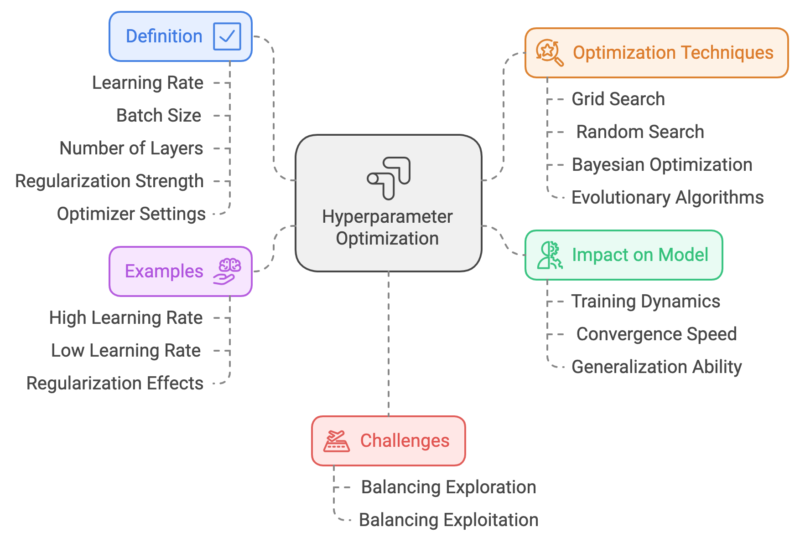
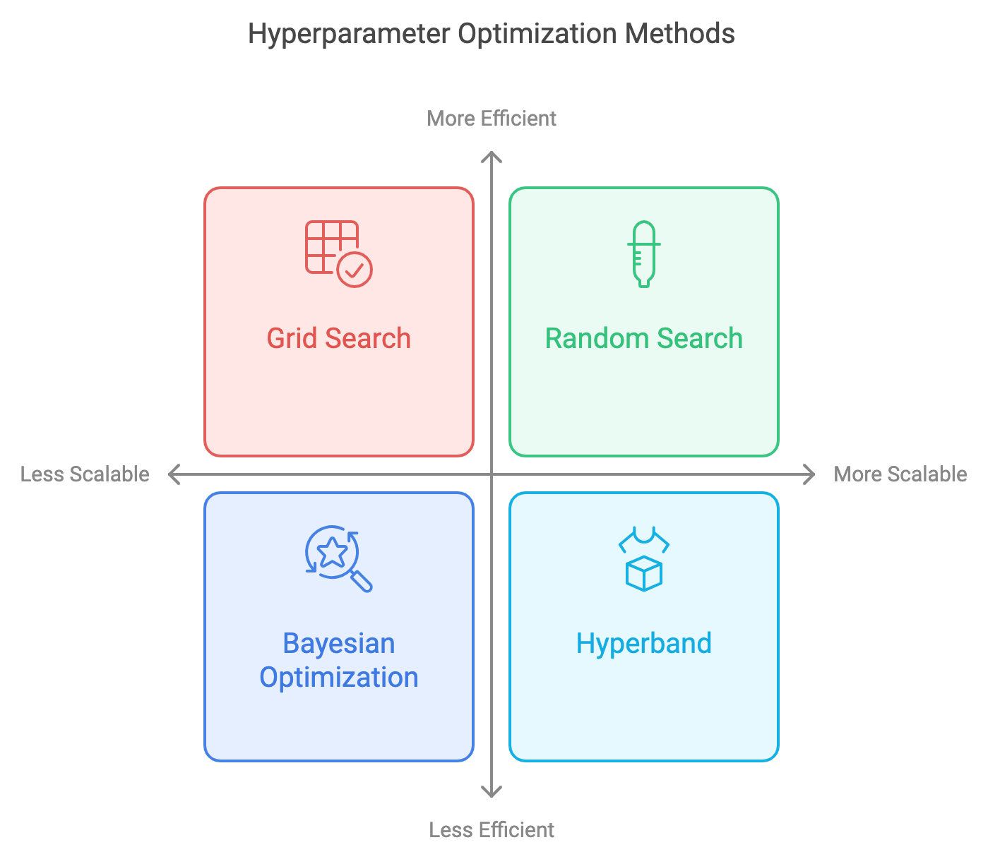

> **Note:**
**"*Optimizing hyperparameters is the key to unlocking the full potential of machine learning models, transforming them from good to great.*" — Andrew Ng**

> **Note:**
*Chapter 14 of DLVR delves into the critical process of Hyperparameter Optimization and Model Tuning, essential for maximizing the performance and generalization of deep learning models. The chapter begins by introducing the concept of hyperparameters, which govern the training process but are not directly learned from data, highlighting the importance of correctly tuning these parameters to achieve optimal model behavior. It explores various search algorithms for hyperparameter optimization, including Grid Search, Random Search, and Bayesian Optimization, comparing their efficiency and applicability. The chapter also covers practical techniques for model tuning, such as learning rate schedules, regularization methods, and data augmentation, emphasizing their role in enhancing model robustness and preventing overfitting. Finally, it introduces automated hyperparameter tuning tools like Optuna and Ray Tune, discussing their integration with Rust and the benefits of automating the tuning process for large-scale projects. Throughout, practical implementation guidance is provided, with Rust-based examples using tch-rs and burn to build, tune, and optimize deep learning models effectively.*

# 14.1. Introduction to Hyperparameter Optimization

Hyperparameter optimization is a crucial yet complex aspect of deep learning model development. The primary goal of hyperparameter optimization is to find the optimal set of hyperparameters that governs the learning process, such as learning rate, batch size, number of layers, regularization strength, and optimizer settings, to maximize model performance and generalization ability. These hyperparameters differ from model parameters in that they are not learned directly from the training data. Instead, they must be pre-set by the model developer and can dramatically affect the training dynamics, convergence speed, and generalization to unseen data.


**Figure 1:** Hyperparameters optimization for deep learning model.

Model parameters, such as weights and biases in a neural network, are internal to the model and are adjusted during training to minimize the loss function using gradient-based optimization techniques. In contrast, hyperparameters control external aspects of this process, such as how fast the model learns (learning rate), how much data is processed at once (batch size), how complex the network is (number of layers or neurons), or how regularization is applied (dropout rate or L2 regularization). A poorly chosen set of hyperparameters can lead to suboptimal training outcomes, even if the model architecture and data are well-suited for the task at hand. For instance, if the learning rate is too high, gradient updates can overshoot optimal parameter values, leading to instability or divergence during training. Conversely, an excessively low learning rate can result in a prolonged training process that may get stuck in local minima.

Hyperparameters also directly influence overfitting and underfitting behaviors in models. For instance, the choice of regularization strength (e.g., L2 weight decay or dropout rate) plays a critical role in constraining the model’s capacity to fit the training data too closely, which can harm generalization. Regularization hyperparameters need to be carefully balanced to avoid either underfitting (where the model is too simple to capture underlying patterns) or overfitting (where the model memorizes noise or anomalies in the training data). This fine-tuning process requires not only a strong understanding of the model architecture but also a deep awareness of how these hyperparameters interact with one another and with the specific data distribution.

The landscape of hyperparameter optimization involves a high-dimensional, non-convex search space, where each hyperparameter may span continuous, discrete, or even categorical values. Because of the high-dimensional nature of this space, direct gradient-based optimization techniques cannot typically be applied to find optimal hyperparameters, as the objective function (model performance) is non-differentiable with respect to these values. Instead, hyperparameter optimization relies on search strategies such as grid search, random search, Bayesian optimization, or evolutionary algorithms. These methods explore the hyperparameter space by evaluating different configurations on validation datasets to identify the best-performing set of hyperparameters.

Grid search exhaustively tries every combination of hyperparameters from a predefined set of values. While simple, this approach becomes computationally prohibitive as the number of hyperparameters grows, making it impractical for large-scale models. Random search, by contrast, samples random combinations of hyperparameters from the search space, which has been shown to perform as well or better than grid search in many cases, especially when only a subset of hyperparameters is important. Bayesian optimization techniques offer a more intelligent approach by building a probabilistic model of the hyperparameter space and using this model to make informed decisions about which hyperparameters to explore next. Bayesian optimization methods attempt to balance exploration (sampling new areas of the hyperparameter space) and exploitation (refining the regions of the space that have already shown promise) to maximize efficiency.

When performing hyperparameter optimization, one of the main challenges is balancing exploration and exploitation. Exploration is crucial because it allows the model to evaluate hyperparameters that may lie in under-explored areas of the search space, which could lead to significant improvements in performance. However, focusing too much on exploration can lead to inefficiencies, as the model may spend too much time evaluating poor-performing hyperparameters. Exploitation, on the other hand, involves concentrating on refining known promising regions of the search space to find the local optimal configurations. Striking the right balance between these two objectives is essential for efficient hyperparameter optimization, particularly in high-dimensional and non-convex search spaces.

Implementing hyperparameter optimization in deep learning frameworks requires a solid understanding of both the underlying optimization algorithms and the structure of the model being trained. Rust, with its powerful performance guarantees and safety features, provides an ideal environment for building custom deep learning models and experimenting with hyperparameter optimization strategies. Two prominent libraries in Rust for deep learning tasks are `tch-rs` and `candle`.

This code is an end-to-end implementation of training a Convolutional Neural Network (CNN) for image classification on the MNIST dataset using the Rust programming language and the `tch` crate, which provides bindings for PyTorch. The program begins by downloading and extracting the MNIST dataset if it is not already present. It then defines and trains a CNN model to classify handwritten digits (0-9), employing advanced techniques like dropout for regularization, L2 weight decay, and hyperparameter search to improve model accuracy. The goal is to achieve a test accuracy close to 99%.

```rust
use anyhow::{Result, Context};
use flate2::read::GzDecoder;
use std::{fs, fs::File, io::copy, path::Path};
use tch::{nn, nn::ModuleT, nn::OptimizerConfig, Device, Tensor, vision, Kind};

// URLs for the MNIST dataset files
// Each tuple contains the URL to the gzipped MNIST data file and the target local path where the extracted file will be stored.
const MNIST_URLS: &[(&str, &str)] = &[
    ("https://ossci-datasets.s3.amazonaws.com/mnist/train-images-idx3-ubyte.gz", "data/train-images-idx3-ubyte"),
    ("https://ossci-datasets.s3.amazonaws.com/mnist/train-labels-idx1-ubyte.gz", "data/train-labels-idx1-ubyte"),
    ("https://ossci-datasets.s3.amazonaws.com/mnist/t10k-images-idx3-ubyte.gz", "data/t10k-images-idx3-ubyte"),
    ("https://ossci-datasets.s3.amazonaws.com/mnist/t10k-labels-idx1-ubyte.gz", "data/t10k-labels-idx1-ubyte"),
];

// Function to download and extract MNIST dataset files if they don't exist.
async fn download_mnist() -> Result<()> {
    // Create the "data" directory if it doesn't exist
    fs::create_dir_all("data").context("Failed to create data directory")?;

    for &(url, file_path) in MNIST_URLS {
        // Check if the file already exists to avoid redundant downloads
        if !Path::new(file_path).exists() {
            println!("Downloading {}...", url);

            // Fetch the gzipped file from the given URL
            let response = reqwest::get(url).await?;
            let bytes = response.bytes().await?;

            // Decompress the gzipped file and save it to the specified path
            let mut gz = GzDecoder::new(bytes.as_ref());
            let mut out_file = File::create(file_path).context("Failed to create MNIST file")?;
            copy(&mut gz, &mut out_file).context("Failed to extract MNIST file")?;
            println!("Downloaded and extracted to {}", file_path);
        } else {
            println!("File {} already exists, skipping download.", file_path);
        }
    }
    Ok(())
}

// Define a CNN model to classify MNIST images
#[derive(Debug)]
struct Net {
    conv1: nn::Conv2D, // First convolutional layer
    conv2: nn::Conv2D, // Second convolutional layer
    fc1: nn::Linear,   // First fully connected layer
    fc2: nn::Linear,   // Output layer with 10 classes (digits 0-9)
}

impl Net {
    // Constructor to initialize the network layers
    fn new(vs: &nn::Path) -> Net {
        let conv1 = nn::conv2d(vs, 1, 32, 5, Default::default()); // 1 input channel, 32 filters, kernel size 5
        let conv2 = nn::conv2d(vs, 32, 64, 5, Default::default()); // 32 input channels, 64 filters, kernel size 5
        let fc1 = nn::linear(vs, 1024, 1024, Default::default()); // Fully connected layer with 1024 nodes
        let fc2 = nn::linear(vs, 1024, 10, Default::default());   // Output layer with 10 nodes
        Net { conv1, conv2, fc1, fc2 }
    }
}

impl nn::ModuleT for Net {
    // Define the forward pass for the network
    fn forward_t(&self, xs: &Tensor, train: bool) -> Tensor {
        xs.view([-1, 1, 28, 28])          // Reshape input to match image dimensions (batch, channel, height, width)
            .apply(&self.conv1)           // Apply first convolutional layer
            .relu()                       // Apply ReLU activation
            .max_pool2d_default(2)        // Max-pooling with kernel size 2
            .apply(&self.conv2)           // Apply second convolutional layer
            .relu()                       // Apply ReLU activation
            .max_pool2d_default(2)        // Max-pooling with kernel size 2
            .view([-1, 1024])             // Flatten the tensor for fully connected layers
            .apply(&self.fc1)             // Apply first fully connected layer
            .relu()                       // Apply ReLU activation
            .dropout(0.5, train)          // Apply dropout (only during training)
            .apply(&self.fc2)             // Apply final output layer
    }
}

// Define hyperparameter search space for batch size and learning rate
fn hyperparameter_search() -> Vec<(usize, f64)> {
    vec![(64, 1e-3), (128, 1e-4), (256, 1e-5)] // Combinations of batch size and learning rate
}

// Function to compute L2 regularization loss for all model parameters
fn l2_regularization(vs: &nn::VarStore, factor: f64) -> Tensor {
    let mut l2_loss = Tensor::zeros(&[], (Kind::Float, vs.device())); // Initialize loss to zero
    for (_, mut value) in vs.variables() {
        // Add the squared sum of each parameter's values to the loss
        l2_loss = l2_loss + value.pow_tensor_(&Tensor::from(2.0)).sum(Kind::Float);
    }
    l2_loss * factor // Scale the loss by the regularization factor
}

// Function to train and evaluate the CNN model
fn run_conv() -> Result<()> {
    // Load MNIST dataset from the "data" directory
    let m = vision::mnist::load_dir("data")?;
    let train_images = m.train_images.view([-1, 1, 28, 28]) / 255.0; // Normalize training images
    let train_labels = m.train_labels;
    let test_images = m.test_images.view([-1, 1, 28, 28]) / 255.0;   // Normalize test images
    let test_labels = m.test_labels;

    // Perform training for each hyperparameter combination
    for (batch_size, lr) in hyperparameter_search() {
        println!("Training with batch size {} and learning rate {}", batch_size, lr);

        // Initialize model and optimizer
        let vs = nn::VarStore::new(Device::cuda_if_available());
        let net = Net::new(&vs.root());
        let mut opt = nn::Adam::default().build(&vs, lr)?;

        // Train the model for 10 epochs
        for epoch in 1..=10 {
            for (bimages, blabels) in train_images.split(batch_size as i64, 0).into_iter().zip(
                train_labels.split(batch_size as i64, 0).into_iter(),
            ) {
                let loss = net
                    .forward_t(&bimages, true) // Compute model predictions
                    .cross_entropy_for_logits(&blabels) // Compute cross-entropy loss
                    + l2_regularization(&vs, 1e-4); // Add L2 regularization

                opt.backward_step(&loss); // Perform backpropagation and update weights
            }

            // Evaluate the model on the test dataset
            let test_accuracy =
                net.batch_accuracy_for_logits(&test_images, &test_labels, vs.device(), 1024);
            println!(
                "Epoch: {:4}, Batch Size: {}, LR: {:7.1e}, Test Accuracy: {:5.2}%",
                epoch, batch_size, lr, 100. * test_accuracy
            );
        }
    }
    Ok(())
}

#[tokio::main]
// Main function to download the dataset and run the training process
async fn main() -> Result<()> {
    download_mnist().await?; // Download MNIST dataset
    run_conv()?;             // Train and evaluate the model
    Ok(())
}
```

The program starts by downloading and extracting the MNIST dataset using asynchronous HTTP requests and gzip decompression. The dataset is preprocessed and split into training and test sets, normalizing pixel values. A CNN architecture is defined in the `Net` struct, which includes two convolutional layers and two fully connected layers. The model is trained using the Adam optimizer with varying batch sizes and learning rates, as specified by the hyperparameter search function. L2 regularization is applied to reduce overfitting. Training progresses over multiple epochs, with the model's performance evaluated on the test dataset after each epoch. The program uses GPU acceleration when available and prints the test accuracy for each combination of hyperparameters.

# 14.2. Search Algorithms for Hyperparameter Optimization

Hyperparameter optimization is a critical and complex process in deep learning, as it directly impacts model performance, convergence speed, and generalization ability. Hyperparameters, which control the training process but are not learned from data, must be carefully chosen to avoid suboptimal outcomes such as underfitting, overfitting, or inefficient training. In deep learning, where models often have many hyperparameters (e.g., learning rate, batch size, number of layers, weight decay), finding the best set of hyperparameters becomes a high-dimensional, computationally expensive task. Several search algorithms are used for hyperparameter optimization, including Grid Search, Random Search, and Bayesian Optimization, each offering different trade-offs in terms of exploration, computational efficiency, and scalability. More advanced techniques like Hyperband and evolutionary algorithms further push the boundaries of efficient hyperparameter optimization, particularly for deep learning models where training large datasets can be costly.


**Figure 2:** Various search algorithms of hyperparameters optimization.

Grid Search, one of the most straightforward and widely used methods for hyperparameter optimization, works by exhaustively evaluating every combination of hyperparameters in a predefined grid. While its simplicity and deterministic nature make it appealing, it becomes computationally prohibitive in high-dimensional spaces. The total number of hyperparameter combinations grows exponentially with each additional hyperparameter, leading to a curse of dimensionality. For example, if a deep learning model has five hyperparameters, each of which can take ten values, Grid Search would need to evaluate 100,000 configurations. This brute-force approach leads to inefficiencies because Grid Search does not adapt to the underlying structure of the hyperparameter space, potentially wasting resources on redundant or suboptimal configurations. Moreover, in deep learning, where only a few hyperparameters tend to have a significant impact on performance, evaluating all possible configurations, including less impactful ones, results in unnecessary computational overhead.

Random Search offers a more efficient alternative to Grid Search by randomly sampling hyperparameter values from the predefined search space. It does not evaluate all combinations but instead explores the space stochastically, making it better suited for high-dimensional hyperparameter spaces. Research has shown that Random Search often outperforms Grid Search, especially when only a few hyperparameters dominate model performance. In deep learning, this means that Random Search is more likely to stumble upon high-performing configurations early on, as it dedicates computational resources to exploring diverse regions of the search space rather than exhaustively covering it. Random Search is particularly effective when hyperparameters exhibit different degrees of sensitivity, where some hyperparameters (e.g., learning rate) have a far more substantial impact on model performance than others (e.g., batch size). By sampling randomly, Random Search ensures that more diverse configurations are evaluated, making it more scalable and efficient than Grid Search, particularly for models with a large number of hyperparameters.

Bayesian Optimization takes a more sophisticated approach to hyperparameter optimization by constructing a probabilistic model of the objective function—typically using a Gaussian process or other surrogate models—to represent the relationship between hyperparameters and model performance. The key insight behind Bayesian Optimization is that it uses the model’s uncertainty to guide the search towards promising regions of the hyperparameter space. Unlike Grid Search or Random Search, which are oblivious to past evaluations, Bayesian Optimization incorporates knowledge from previous evaluations into its decision-making process. It does so by employing an acquisition function, which balances exploration and exploitation. Exploration focuses on sampling regions where the model’s uncertainty is high (i.e., regions not yet thoroughly explored), while exploitation focuses on regions where the model predicts good performance based on prior observations. This iterative, data-driven approach makes Bayesian Optimization highly effective in scenarios where each evaluation is computationally expensive, such as in deep learning, where training a single model can take hours or days. By intelligently selecting which hyperparameters to evaluate next, Bayesian Optimization minimizes the number of function evaluations required to converge on an optimal solution, making it ideal for scenarios with limited computational resources.

Beyond these standard methods, more advanced strategies like Hyperband and evolutionary algorithms provide further innovations in hyperparameter optimization. Hyperband is a resource-efficient optimization algorithm that extends the idea of random search while incorporating multi-armed bandit principles. It is particularly well-suited for deep learning models where evaluating a hyperparameter configuration requires significant computational resources. Hyperband begins by evaluating a large number of hyperparameter configurations with a limited budget (e.g., few training epochs) and progressively allocates more resources to the most promising candidates based on their early performance. By dynamically adjusting the allocation of computational resources, Hyperband can significantly reduce the cost of hyperparameter optimization while still exploring a wide range of configurations. This iterative narrowing process allows Hyperband to explore many configurations early on, but only fully trains those that show the most promise, effectively trading off exploration with computational efficiency. As a result, Hyperband is highly effective for deep learning, where training costs are a key bottleneck.

Evolutionary algorithms, inspired by the principles of natural selection, represent another powerful class of hyperparameter optimization techniques. These algorithms maintain a population of hyperparameter configurations that evolve over successive generations using genetic operations such as mutation, crossover, and selection. During each generation, the fittest configurations—those that yield the best performance—are selected and used to generate new configurations by applying random mutations or combining aspects of parent configurations (crossover). Over time, the population converges towards an optimal or near-optimal solution. Evolutionary algorithms are particularly effective in large and complex search spaces because they explore a diverse set of hyperparameter configurations and adaptively focus on promising regions as the population evolves. In deep learning, where the search space for hyperparameters is often non-convex, multi-modal, and highly complex, evolutionary algorithms can effectively explore diverse configurations and converge on good solutions. Moreover, because these algorithms maintain a population of solutions, they can avoid becoming trapped in local minima, a common issue in gradient-based optimization.

The effectiveness of any hyperparameter optimization method depends on the specific problem being solved and the computational resources available. For low-dimensional problems or scenarios with abundant computational resources, Grid Search may be adequate despite its inefficiencies. However, for high-dimensional problems or when computational resources are limited, Random Search offers a scalable and efficient alternative, especially when hyperparameters have varying degrees of influence on model performance. Bayesian Optimization shines in situations where model training is computationally expensive, as it reduces the number of evaluations required by focusing on the most promising regions of the hyperparameter space. More advanced techniques like Hyperband are especially useful in resource-constrained environments, where it is important to allocate computational resources effectively. Evolutionary algorithms, with their population-based search strategies, excel in large, complex search spaces where diverse exploration is necessary to find optimal solutions.

A key challenge in hyperparameter optimization is striking the right balance between exploration and exploitation. Exploration refers to sampling new and untested regions of the hyperparameter space, gathering information about the objective function in areas with high uncertainty. Exploitation, on the other hand, involves focusing on regions that are known to yield good results based on previous evaluations. An effective hyperparameter optimization strategy must dynamically balance these two goals. Bayesian Optimization handles this trade-off explicitly through the acquisition function, which guides the search process by weighing the uncertainty of the model’s predictions against the expected improvement in performance. This ensures that Bayesian Optimization does not get stuck in suboptimal regions and continues to explore new areas that could lead to better solutions.

Hyperband introduces an additional layer of complexity by considering the computational cost associated with evaluating each hyperparameter configuration. By initially evaluating a large number of configurations with limited resources (e.g., a few epochs of training), and then progressively allocating more resources to those that demonstrate the most promise, Hyperband achieves a balance between thorough exploration and efficient resource allocation. This makes it particularly suitable for deep learning tasks, where training models can be time-consuming and computationally expensive. Hyperband’s ability to adaptively allocate resources ensures that promising hyperparameter configurations are given more attention while limiting the waste of resources on poor-performing configurations. This efficiency in resource utilization is a major advantage for deep learning practitioners who are often constrained by computational budgets.

In conclusion, hyperparameter optimization is a foundational aspect of deep learning that significantly influences model performance and generalization. Grid Search, Random Search, and Bayesian Optimization offer varying levels of efficiency and adaptability, with Random Search providing a practical alternative to Grid Search for high-dimensional problems and Bayesian Optimization offering sophisticated probabilistic guidance for computationally expensive evaluations. Advanced methods like Hyperband and evolutionary algorithms extend these ideas further, making hyperparameter optimization more feasible for complex models and large-scale deep learning tasks. The choice of optimization method depends heavily on the problem domain, the dimensionality of the hyperparameter space, and the available computational resources. By understanding the strengths and limitations of each approach, practitioners can choose the most appropriate strategy to achieve optimal model performance.

This code implements three hyperparameter optimization techniques: Grid Search, Random Search, and a placeholder for Bayesian Optimization, to tune the performance of a LeNet-5-like CNN on the MNIST dataset. Grid Search systematically evaluates predefined combinations of hyperparameters, while Random Search randomly samples hyperparameter configurations within a specified range. The placeholder for Bayesian Optimization hints at using probabilistic models to iteratively search for the best hyperparameters. These techniques aim to identify the optimal batch size and learning rate to maximize the model's test accuracy efficiently.

```toml
[dependencies]
anyhow = "1.0"
tch = "0.12"
reqwest = { version = "0.11", features = ["blocking"] }
flate2 = "1.0"
tokio = { version = "1", features = ["full"] }
kind = "1.0.0"
rand = "0.8.5"
```
```rust
use anyhow::{Result, Context};
use flate2::read::GzDecoder;
use rand::prelude::SliceRandom; // Import SliceRandom for choose
use rand::Rng; // For random search
use std::{fs, fs::File, io::copy, path::Path};
use tch::{nn, nn::ModuleT, nn::OptimizerConfig, Device, Tensor, vision, Kind};

// URLs for the MNIST dataset files
const MNIST_URLS: &[(&str, &str)] = &[
    ("https://ossci-datasets.s3.amazonaws.com/mnist/train-images-idx3-ubyte.gz", "data/train-images-idx3-ubyte"),
    ("https://ossci-datasets.s3.amazonaws.com/mnist/train-labels-idx1-ubyte.gz", "data/train-labels-idx1-ubyte"),
    ("https://ossci-datasets.s3.amazonaws.com/mnist/t10k-images-idx3-ubyte.gz", "data/t10k-images-idx3-ubyte"),
    ("https://ossci-datasets.s3.amazonaws.com/mnist/t10k-labels-idx1-ubyte.gz", "data/t10k-labels-idx1-ubyte"),
];

// Function to download and extract MNIST dataset files if they don't exist.
async fn download_mnist() -> Result<()> {
    fs::create_dir_all("data").context("Failed to create data directory")?;

    for &(url, file_path) in MNIST_URLS {
        if !Path::new(file_path).exists() {
            println!("Downloading {}...", url);

            let response = reqwest::get(url).await?;
            let bytes = response.bytes().await?;

            let mut gz = GzDecoder::new(bytes.as_ref());
            let mut out_file = File::create(file_path).context("Failed to create MNIST file")?;
            copy(&mut gz, &mut out_file).context("Failed to extract MNIST file")?;
            println!("Downloaded and extracted to {}", file_path);
        } else {
            println!("File {} already exists, skipping download.", file_path);
        }
    }
    Ok(())
}

// Define a CNN model (LeNet-5-like) to classify MNIST images
#[derive(Debug)]
struct Net {
    conv1: nn::Conv2D,
    conv2: nn::Conv2D,
    fc1: nn::Linear,
    fc2: nn::Linear,
}

impl Net {
    fn new(vs: &nn::Path) -> Net {
        let conv1 = nn::conv2d(vs, 1, 32, 5, Default::default());
        let conv2 = nn::conv2d(vs, 32, 64, 5, Default::default());
        let fc1 = nn::linear(vs, 1024, 1024, Default::default());
        let fc2 = nn::linear(vs, 1024, 10, Default::default());
        Net { conv1, conv2, fc1, fc2 }
    }
}

impl nn::ModuleT for Net {
    fn forward_t(&self, xs: &Tensor, train: bool) -> Tensor {
        xs.view([-1, 1, 28, 28])
            .apply(&self.conv1)
            .relu()
            .max_pool2d_default(2)
            .apply(&self.conv2)
            .relu()
            .max_pool2d_default(2)
            .view([-1, 1024])
            .apply(&self.fc1)
            .relu()
            .dropout(0.5, train)
            .apply(&self.fc2)
    }
}

// Define hyperparameter search methods: Grid Search, Random Search, Bayesian Optimization
fn hyperparameter_search(method: &str) -> Vec<(usize, f64)> {
    match method {
        "grid" => {
            // Grid Search: Predefined combinations of batch size and learning rate
            vec![(64, 1e-3), (128, 1e-4), (256, 1e-5)]
        }
        "random" => {
            // Random Search: Randomly sample batch size and learning rate
            let mut rng = rand::thread_rng();
            (0..5)
                .map(|_| {
                    let batch_size = *[64, 128, 256].choose(&mut rng).unwrap();
                    let lr = 10f64.powf(-rng.gen_range(3.0..6.0));
                    (batch_size, lr)
                })
                .collect()
        }
        "bayesian" => {
            // Placeholder for Bayesian Optimization
            println!("Bayesian Optimization is currently not implemented.");
            vec![]
        }
        _ => panic!("Unknown hyperparameter search method: {}", method),
    }
}

// Function to compute L2 regularization loss
fn l2_regularization(vs: &nn::VarStore, factor: f64) -> Tensor {
    let mut l2_loss = Tensor::zeros(&[], (Kind::Float, vs.device()));
    for (_, value) in vs.variables() {
        // Use Tensor::from to convert the integer to a Tensor
        l2_loss = l2_loss + value.pow(&Tensor::from(2)).sum(Kind::Float);
    }
    l2_loss * factor
}

// Function to train and evaluate the model
fn run_conv(method: &str) -> Result<()> {
    let m = vision::mnist::load_dir("data")?;
    let train_images = m.train_images.view([-1, 1, 28, 28]) / 255.0;
    let train_labels = m.train_labels;
    let test_images = m.test_images.view([-1, 1, 28, 28]) / 255.0;
    let test_labels = m.test_labels;

    for (batch_size, lr) in hyperparameter_search(method) {
        println!("Training with batch size {} and learning rate {}", batch_size, lr);

        let vs = nn::VarStore::new(Device::cuda_if_available());
        let net = Net::new(&vs.root());
        let mut opt = nn::Adam::default().build(&vs, lr)?;

        for epoch in 1..=10 {
            for (bimages, blabels) in train_images.split(batch_size as i64, 0).into_iter().zip(
                train_labels.split(batch_size as i64, 0).into_iter(),
            ) {
                let loss = net
                    .forward_t(&bimages, true)
                    .cross_entropy_for_logits(&blabels)
                    + l2_regularization(&vs, 1e-4);

                opt.backward_step(&loss);
            }

            let test_accuracy =
                net.batch_accuracy_for_logits(&test_images, &test_labels, vs.device(), 1024);
            println!(
                "Epoch: {:4}, Batch Size: {}, LR: {:7.1e}, Test Accuracy: {:5.2}%",
                epoch, batch_size, lr, 100. * test_accuracy
            );
        }
    }
    Ok(())
}

#[tokio::main]
async fn main() -> Result<()> {
    download_mnist().await?;
    println!("Choose hyperparameter search method: grid, random, or bayesian.");
    let method = "grid"; // Change this to "random" or "bayesian" as needed
    run_conv(method)?;
    Ok(())
}
```

The hyperparameter search logic is implemented in the `hyperparameter_search` function. For Grid Search, the function iterates over a fixed set of predefined combinations of batch sizes and learning rates. In Random Search, it uses random sampling to generate configurations, leveraging the `rand` crate to randomly pick values from specified ranges. The selected hyperparameters are passed to the training function, which evaluates the model's performance on the test set after each training epoch. Bayesian Optimization, while not implemented, would involve dynamically updating a probabilistic model to predict promising hyperparameter configurations based on past evaluations. This modular approach allows switching between optimization strategies by simply changing the method parameter.

Search algorithms for hyperparameter optimization play a critical role in finding the best hyperparameter configurations for deep learning models. Grid Search is exhaustive but computationally expensive, making it impractical for high-dimensional problems. Random Search offers a more efficient alternative, especially for deep learning models, by exploring diverse regions of the hyperparameter space. Bayesian Optimization provides a sophisticated approach by building a probabilistic model to guide the search, balancing exploration and exploitation to minimize the number of evaluations needed. More advanced techniques like Hyperband and evolutionary algorithms further enhance the efficiency of the search process by considering computational cost and leveraging evolutionary principles. Implementing these methods in Rust using tch-rs allows practitioners to explore different hyperparameter optimization strategies, ultimately leading to better model performance and more efficient training processes.

# 14.3. Practical Techniques for Model Tuning

Model tuning involves a range of practical techniques that help optimize the training process, improve the generalization of deep learning models, and mitigate common issues like overfitting and unstable training. Some of the key techniques include learning rate schedules, early stopping, model checkpointing, regularization methods like L2 regularization and dropout, and data augmentation. These techniques are crucial for maximizing model performance while minimizing the risk of overfitting and ensuring efficient use of computational resources.


**Figure 3:** Various approach of deep learning model tuning.

A learning rate schedule is a practical approach for controlling the learning rate during training. The learning rate determines the size of the steps taken during gradient descent, and using a fixed learning rate can be suboptimal because different phases of training may benefit from different step sizes. For example, a high learning rate at the beginning of training helps the model converge quickly, while a lower learning rate in the later stages can help the model fine-tune and converge to a better local minimum. Learning rate schedules such as cosine annealing and step decay are used to adjust the learning rate dynamically. In cosine annealing, the learning rate is decreased following a cosine curve, allowing it to start high and gradually decrease, sometimes even incorporating a restart mechanism to help the model escape shallow local minima. Step decay reduces the learning rate by a fixed factor at specific intervals, often leading to better convergence by providing stability in later epochs.

Early stopping is another practical tuning technique that aims to prevent overfitting by monitoring the model's performance on a validation set. During training, the model's performance on the training set typically improves continuously, but its performance on the validation set can start to deteriorate once the model begins to overfit. Early stopping involves stopping the training process once the validation performance no longer improves, thereby preventing unnecessary training and reducing computational costs. This technique is particularly useful when training large models, as it not only prevents overfitting but also saves valuable time and resources by avoiding further training once no substantial improvement is observed.

Model checkpointing complements early stopping by periodically saving the model's weights during training, usually whenever there is an improvement in the validation performance. This ensures that the best-performing model is preserved, even if the training process is stopped early or interrupted. Checkpointing also provides robustness against potential hardware failures or crashes, making it a valuable practice in any large-scale training setup.

Regularization techniques such as L2 regularization and dropout play a significant role in preventing overfitting. L2 regularization, also known as weight decay, adds a penalty to the loss function proportional to the square of the weights, encouraging the model to learn smaller weights, which helps in improving generalization. Mathematically, the L2 regularized loss function can be expressed as:

$$
L_{\text{reg}} = L + \lambda \sum_{i} w_i^2
$$

where $L$ is the original loss function, $w_i$ are the model weights, and $\lambda$ is the regularization coefficient. By penalizing large weights, L2 regularization ensures that the model does not become overly complex, which helps in reducing overfitting.

Dropout is another regularization technique that works by randomly setting a fraction of the neurons to zero during each forward pass in training. This prevents the model from relying too heavily on any particular set of neurons, thereby encouraging it to learn more robust and distributed representations. During inference, all neurons are used, but their outputs are scaled to account for the dropout applied during training. Dropout is particularly effective in deep neural networks with many layers, where the risk of overfitting is high.

Data augmentation is a powerful technique for improving model robustness and generalization by artificially increasing the size of the training dataset. This is done by applying various transformations to the input data, such as rotations, scaling, flipping, and cropping. Data augmentation helps expose the model to a more diverse set of examples, which helps it generalize better to unseen data. For instance, in image classification tasks, applying random rotations or flips helps the model learn features that are invariant to these transformations, making it more robust to variations in real-world data.

The various techniques for model tuning each have their own trade-offs. Learning rate schedules such as cosine annealing and step decay can significantly improve convergence, but they require careful tuning to determine the best schedule and parameters. Early stopping and checkpointing are effective for preventing overfitting and saving resources, but they depend on having a well-defined validation set and appropriate metrics to monitor performance. Regularization techniques like L2 regularization and dropout help prevent overfitting, but they can also slow down convergence or make it harder for the model to fit complex data if used excessively. Data augmentation improves generalization, but it also increases the complexity of the data pipeline and the computational burden during training.

The key to effective model tuning is understanding these trade-offs and selecting the right combination of techniques based on the model, data, and computational resources available. For instance, a combination of cosine annealing for learning rate scheduling, early stopping based on validation loss, dropout for regularization, and data augmentation can be highly effective for training deep convolutional neural networks on image data. By monitoring the validation metrics and tuning hyperparameters related to these techniques, it is possible to strike a balance between training stability, model performance, and resource efficiency.

This Rust code implements a ResNet-50 model for classifying the CIFAR-10 dataset, incorporating advanced training techniques like learning rate scheduling, L2 regularization, and early stopping. Learning rate scheduling dynamically adjusts the learning rate to improve convergence, while L2 regularization penalizes large model weights to prevent overfitting. Early stopping halts training when the validation performance stops improving, reducing unnecessary computations. These techniques optimize model performance by striking a balance between underfitting and overfitting.

```rust
use anyhow::{Result, Context};
use flate2::read::GzDecoder;
use reqwest;
use std::{fs, path::Path};
use tar::Archive;
use tch::{nn, nn::ModuleT, nn::OptimizerConfig, Device, Tensor, vision};

/// URL for the CIFAR-10 dataset
const CIFAR10_URL: &str = "https://www.cs.toronto.edu/~kriz/cifar-10-binary.tar.gz";

/// Function to download and extract the CIFAR-10 dataset.
async fn download_cifar10() -> Result<()> {
    let dest = "data/cifar10";
    if Path::new(&format!("{}/test_batch.bin", dest)).exists() {
        println!("CIFAR-10 dataset already exists, skipping download.");
        return Ok(());
    }

    fs::create_dir_all(dest).context("Failed to create data directory")?;

    println!("Downloading CIFAR-10 dataset...");
    let response = reqwest::get(CIFAR10_URL).await?;
    let bytes = response.bytes().await?;
    let tar_gz = GzDecoder::new(&bytes[..]);
    let mut archive = Archive::new(tar_gz);

    println!("Extracting CIFAR-10 dataset...");
    archive.unpack("data")?;

    println!("CIFAR-10 dataset downloaded and extracted successfully.");
    Ok(())
}

/// Function to adjust learning rate dynamically during training.
fn adjust_learning_rate(opt: &mut nn::Sgd, epoch: i64, base_lr: f64) {
    let new_lr = base_lr * (0.1_f64.powi((epoch / 10) as i32)); // Reduce LR by 10x every 10 epochs.
    opt.set_lr(new_lr);
    println!("Adjusted learning rate: {:.5}", new_lr);
}

/// Function to compute L2 regularization loss.
fn l2_regularization(vs: &nn::VarStore, factor: f64) -> Tensor {
    let mut l2_loss = Tensor::zeros(&[], (tch::Kind::Float, vs.device()));
    for (_, param) in vs.variables() {
        l2_loss = l2_loss + param.pow(2).sum(tch::Kind::Float);
    }
    l2_loss * factor
}

/// Function to train and test the ResNet-50 model on the CIFAR-10 dataset.
fn run_resnet50() -> Result<()> {
    // Load the CIFAR-10 dataset.
    let cifar_data = vision::cifar::load_dir("data/cifar10")?;

    // Use GPU if available, otherwise use CPU.
    let vs = nn::VarStore::new(Device::cuda_if_available());
    let net = ResNet50::new(&vs.root()); // Initialize the ResNet-50 model.
    let mut opt = nn::Sgd {
        momentum: 0.9,
        weight_decay: 5e-4, // L2 regularization weight decay.
    }
    .build(&vs, 0.1)?; // Initial learning rate.

    // Reshape and normalize the training and test images.
    let train_images = cifar_data.train_images / 255.0;
    let train_labels = cifar_data.train_labels;
    let test_images = cifar_data.test_images / 255.0;
    let test_labels = cifar_data.test_labels;

    let mut best_accuracy = 0.0;
    let mut patience = 5; // Number of epochs to wait before early stopping.
    let mut no_improve_count = 0;

    // Training loop for the ResNet-50 model.
    for epoch in 1..=50 {
        adjust_learning_rate(&mut opt, epoch, 0.1); // Adjust learning rate based on epoch.

        // Train the model for one epoch.
        for (bimages, blabels) in train_images
            .split(128, 0)
            .into_iter()
            .zip(train_labels.split(128, 0).into_iter())
        {
            let loss = net
                .forward_t(&bimages, true)
                .cross_entropy_for_logits(&blabels)
                + l2_regularization(&vs, 5e-4); // Add L2 regularization.

            opt.backward_step(&loss); // Backpropagation step.
        }

        // Calculate test accuracy at the end of each epoch.
        let test_accuracy = net.batch_accuracy_for_logits(&test_images, &test_labels, vs.device(), 256);
        println!("Epoch: {:4}, Test Accuracy: {:5.2}%", epoch, 100. * test_accuracy);

        // Early stopping logic.
        if test_accuracy > best_accuracy {
            best_accuracy = test_accuracy;
            no_improve_count = 0; // Reset no improvement count.
        } else {
            no_improve_count += 1;
            if no_improve_count >= patience {
                println!("Early stopping triggered at epoch {}", epoch);
                break;
            }
        }
    }
    println!("Best Test Accuracy: {:5.2}%", 100. * best_accuracy);
    Ok(())
}

#[tokio::main]
async fn main() -> Result<()> {
    download_cifar10().await?; // Ensure the CIFAR-10 dataset is downloaded.
    run_resnet50()?; // Train and test the ResNet-50 model.
    Ok(())
}
```

The program begins by downloading and extracting the CIFAR-10 dataset if it is not already available. The ResNet-50 model, designed with residual blocks for deep learning, is initialized alongside an SGD optimizer with momentum and weight decay for L2 regularization. During training, the learning rate is adjusted dynamically using a scheduler, reducing the rate by a factor of 10 every 10 epochs. The model's loss includes the cross-entropy for classification and an L2 penalty on weights. At the end of each epoch, the test accuracy is evaluated. If the accuracy does not improve for a specified number of epochs (`patience`), early stopping is triggered to prevent overtraining. The final output includes the model's best test accuracy and ensures efficient, well-regularized training.

Data augmentation can be implemented as part of the data preprocessing pipeline. For image data, this might involve using libraries like imageproc in Rust to apply random rotations, flips, and other transformations to the training images, which helps improve the model's ability to generalize to unseen data.

Practical model tuning techniques such as learning rate schedules, early stopping, model checkpointing, regularization, and data augmentation play a crucial role in improving the training efficiency and generalization of deep learning models. By carefully selecting and implementing these techniques, practitioners can effectively optimize their models, prevent overfitting, and ensure stable convergence. Implementing these methods in Rust using tch-rs allows for a robust approach to training deep learning models, leveraging practical insights from both scientific research and industry practices to achieve the best possible performance.

# 14.4. Automated Hyperparameter Tuning

Automated hyperparameter tuning has emerged as an essential technique in deep learning, especially given the complexity of modern models and the vast number of hyperparameters that influence their performance. Tools such as Optuna and Ray Tune have become popular due to their ability to automate the hyperparameter optimization process, making it both more efficient and more accessible for machine learning practitioners. These tools help in efficiently navigating the hyperparameter search space, thus reducing the need for manual intervention and ensuring better outcomes for model performance. In this section, we will discuss the integration of automated tuning tools with Rust, the concept of Hyperparameter Optimization as a Service (HPOaaS), and how automated approaches can improve reproducibility and efficiency in model development.


**Figure 4:** Optuna framework for automated hyperparameter optimization.

Optuna and Ray Tune are powerful tools designed for automated hyperparameter optimization. Optuna is an open-source framework that supports both Bayesian optimization and Tree-structured Parzen Estimator (TPE) methods to explore hyperparameter spaces efficiently. It uses pruning to terminate unpromising trials early, which is particularly valuable in deep learning where each trial can be computationally expensive. Ray Tune is another widely used hyperparameter optimization tool that is built on the Ray distributed framework, allowing it to scale tuning jobs across multiple nodes easily. These tools help optimize not only model hyperparameters but also training-related configurations, such as batch size and learning rate schedules.

In the context of deep learning, automated hyperparameter tuning is especially beneficial when dealing with large-scale models, such as transformers or generative adversarial networks (GANs). These models typically have many hyperparameters, and their performance is highly sensitive to these configurations. Manual tuning for such models is both time-consuming and prone to human error, often leading to suboptimal results. With automated tuning frameworks, it is possible to leverage sophisticated search algorithms—such as Bayesian optimization or Hyperband—that balance exploration and exploitation to efficiently find promising hyperparameter settings. This not only saves valuable time but also often results in better performance compared to manual efforts.

Hyperparameter Optimization as a Service (HPOaaS) represents a natural evolution in the automation of machine learning workflows. In large-scale machine learning projects, managing hyperparameter optimization can become cumbersome, especially when multiple models are being trained and evaluated simultaneously. HPOaaS provides a platform-based approach where hyperparameter optimization is offered as a service, abstracting the underlying complexities of distributed optimization, resource management, and scalability. This concept is becoming increasingly relevant in organizations aiming to streamline machine learning pipelines, where they can simply configure their model and let the service handle the tuning process.

Another major benefit of using automated hyperparameter tuning is the improvement in reproducibility. By using structured optimization frameworks like Optuna or Ray Tune, every experiment is logged, and the corresponding configurations are saved, allowing researchers to easily reproduce results or tweak experiments based on historical data. This is particularly important in deep learning, where slight changes in hyperparameter values can significantly affect model outcomes. Ensuring reproducibility helps in building trustworthy models, which is especially crucial in sensitive applications like healthcare, finance, and autonomous driving.

Integrating automated tuning tools with Rust-based deep learning frameworks presents both opportunities and challenges. While Rust has rapidly grown in popularity as a language for deep learning due to its performance benefits and memory safety, the ecosystem is still developing in terms of compatibility with hyperparameter tuning tools. To implement automated tuning in Rust, developers can use crates like tch-rs for model training while integrating with Python-based tools like Optuna through bindings or APIs. Another potential approach is to use Ray Tune by setting up Rust-based training scripts as command-line jobs that Ray can manage and execute. The integration process involves careful handling of data transfer between Rust and Python, and the need for robust serialization mechanisms, especially when working with large datasets.

To illustrate automated hyperparameter tuning using Optuna with Rust-based training code, we will set up a pipeline that involves using the `tch-rs` crate for training a deep learning model and the Optuna library for hyperparameter search and optimization. The goal of this pipeline is to optimize hyperparameters such as the learning rate and batch size for a simple deep learning model on MNIST-like data. We use Rust to define and train the model, and Python with Optuna to handle the optimization process by invoking the Rust script with different hyperparameter values.

#### **Step 1:** Rust Script for Model Training

We begin by defining a simple neural network model in Rust. The training function takes hyperparameters such as the learning rate and batch size, trains the model for a fixed number of epochs, and returns the validation loss, which will be used by Optuna to evaluate the effectiveness of the hyperparameter configuration.

```rust
use tch::{nn, nn::Module, Tensor, nn::OptimizerConfig};

// Define a simple neural network model
struct SimpleNet {
    fc1: nn::Linear,
    fc2: nn::Linear,
}

impl SimpleNet {
    fn new(vs: &nn::Path) -> Self {
        let fc1 = nn::linear(vs, 784, 128, Default::default()); // Input size 784 for MNIST
        let fc2 = nn::linear(vs, 128, 10, Default::default());  // Output size 10 for 10 classes
        SimpleNet { fc1, fc2 }
    }

    fn forward(&self, x: &Tensor) -> Tensor {
        x.apply(&self.fc1).relu().apply(&self.fc2)
    }
}

// Function to train the model with given hyperparameters
fn train_model(learning_rate: f64, batch_size: i64) -> f64 {
    let vs = nn::VarStore::new(tch::Device::cuda_if_available());
    let model = SimpleNet::new(&vs.root());
    let mut opt = nn::Adam::default().build(&vs, learning_rate).unwrap();

    // Placeholder training loop for demonstration
    for _epoch in 1..=10 {
        let data = Tensor::randn(&[batch_size, 784], tch::kind::FLOAT_CPU); // Random input data
        let labels = Tensor::randint(0, 10, &[batch_size], tch::kind::INT64_CPU); // Random labels
        let logits = model.forward(&data);
        let loss = logits.cross_entropy_for_logits(&labels);
        opt.backward_step(&loss);
    }

    // Placeholder validation loss value (in practice, use real validation data)
    let validation_loss = 0.5; // This should be calculated from the validation dataset
    validation_loss
}

fn main() {
    // Parse command-line arguments for hyperparameters
    let args: Vec<String> = std::env::args().collect();
    let learning_rate: f64 = args[1].parse().unwrap();
    let batch_size: i64 = args[2].parse().unwrap();

    // Call train_model with the hyperparameters
    let validation_loss = train_model(learning_rate, batch_size);

    // Print the validation loss for Python to capture
    println!("{}", validation_loss);
}
```

This Rust script defines a simple neural network model with two fully connected layers, where the first layer reduces the input size (784 features) to 128 neurons, and the second layer maps it to 10 output classes (for classification). The `train_model` function takes in the learning rate and batch size as hyperparameters and trains the model for 10 epochs. The script prints the validation loss, which will be captured by the Python script for hyperparameter optimization using Optuna.

#### **Step 2:** Python Script for Hyperparameter Optimization with Optuna

The Python script uses Optuna to tune the hyperparameters of the Rust-based deep learning model. The script executes the Rust training script with different hyperparameter values, capturing the output (validation loss) for each trial.

```python
import optuna
import subprocess

def objective(trial):
    # Suggest hyperparameters for tuning
    learning_rate = trial.suggest_loguniform('learning_rate', 1e-5, 1e-1)
    batch_size = trial.suggest_int('batch_size', 32, 128)

    # Call the Rust training script with the suggested hyperparameters
    result = subprocess.run(
        ["cargo", "run", "--release", "--", str(learning_rate), str(batch_size)],
        capture_output=True, text=True
    )

    # Parse the output to get the validation loss
    validation_loss = float(result.stdout.strip())

    return validation_loss

# Create an Optuna study and optimize
study = optuna.create_study(direction='minimize')
study.optimize(objective, n_trials=50)

# Print the best hyperparameters and validation loss
print(f"Best hyperparameters: {study.best_params}")
print(f"Best validation loss: {study.best_value}")
```

In this Python script, Optuna is used to search for the optimal learning rate and batch size. The `objective` function is defined to suggest hyperparameter values (using Optuna's `suggest_loguniform` and `suggest_int` methods). It calls the Rust training script by invoking `cargo run` and passes the hyperparameter values as command-line arguments. The Rust script returns the validation loss, which is captured by the Python script. Optuna's Bayesian optimization process minimizes the validation loss over a series of trials (50 in this case), exploring the hyperparameter space efficiently. The best hyperparameters and corresponding validation loss are printed at the end.

This code setup integrates Rust and Python to leverage the strengths of both ecosystems. The deep learning model is trained in Rust using the `tch-rs` crate for performance and low-level control, while the hyperparameter optimization is handled by Optuna in Python. This approach enables automated hyperparameter tuning using advanced search algorithms like Bayesian optimization, improving the model’s performance by efficiently exploring the hyperparameter space.

For more complex models, such as transformers or GANs, automated hyperparameter tuning is especially valuable due to the large number of hyperparameters involved. By using Optuna or Ray Tune, practitioners can efficiently tune key hyperparameters like the number of layers, hidden units, dropout rates, and learning rate schedules. The automated tuning process can help identify the best configurations with minimal manual intervention, thereby accelerating the training process and ensuring the model's performance is optimal.

Automated hyperparameter tuning using tools like Optuna and Ray Tune significantly reduces the need for manual hyperparameter search, making it easier to achieve high-performing models. This is particularly important in large-scale projects where manual tuning is impractical and error-prone. HPOaaS represents an evolution in this field, providing scalable solutions for hyperparameter optimization across distributed environments. By integrating these tools with Rust-based deep learning frameworks, developers can leverage the performance and memory safety of Rust while benefiting from the advanced capabilities of automated hyperparameter tuning frameworks. This combination ultimately leads to more efficient model training, improved reproducibility, and better outcomes in deep learning research and industry applications.

# 14.5. Conclusion

Chapter 14 equips you with the essential knowledge and practical skills to effectively tune and optimize deep learning models using Rust. By mastering these techniques, you will be prepared to develop models that achieve state-of-the-art performance across a wide range of applications, making the most of the powerful tools and methodologies available in the Rust ecosystem.

## 14.5.1. Further Learning with GenAI

These prompts are designed to challenge your understanding of hyperparameter optimization and model tuning, with a focus on implementation using Rust. Each prompt encourages deep exploration of advanced concepts, optimization techniques, and practical challenges in fine-tuning deep learning models.

- Analyze the impact of learning rate and batch size on the convergence of deep learning models. How can Rust be used to implement dynamic learning rate schedules, and what are the implications for model performance?
- Discuss the trade-offs between Grid Search and Random Search in hyperparameter optimization. How can Rust be used to efficiently implement these search strategies, and what are the advantages of one over the other in different scenarios?
- Examine the role of Bayesian Optimization in hyperparameter tuning. How does Bayesian Optimization guide the search process, and how can Rust be used to integrate this technique into a model tuning workflow?
- Explore the challenges of tuning hyperparameters in high-dimensional search spaces. How can Rust be used to implement techniques that mitigate these challenges, such as dimensionality reduction or advanced sampling methods?
- Investigate the use of learning rate schedules, such as cosine annealing or step decay, in deep learning models. How can Rust be used to implement these schedules, and what are the benefits for model convergence and final performance?
- Discuss the importance of regularization techniques, such as dropout and weight decay, in preventing overfitting during model training. How can Rust be used to experiment with different regularization strategies to optimize model generalization?
- Analyze the effectiveness of early stopping as a model tuning technique. How can Rust be used to implement early stopping, and what are the trade-offs between stopping too early and overfitting?
- Examine the role of data augmentation in improving model robustness. How can Rust be used to implement data augmentation strategies, and what are the implications for model performance on unseen data?
- Explore the integration of automated hyperparameter tuning tools, such as Optuna or Ray Tune, with Rust-based deep learning frameworks. How can these tools be used to accelerate the tuning process, and what are the challenges in their integration?
- Discuss the benefits of Hyperband as an efficient hyperparameter optimization algorithm. How can Rust be used to implement Hyperband, and what are the trade-offs between exploration and exploitation in this context?
- Investigate the use of evolutionary algorithms for hyperparameter tuning. How can Rust be used to implement these algorithms, and what are the potential benefits for exploring large and complex search spaces?
- Analyze the impact of model architecture on the hyperparameter tuning process. How can Rust be used to optimize both the architecture and hyperparameters simultaneously, and what are the challenges in balancing these aspects?
- Examine the importance of reproducibility in hyperparameter tuning. How can Rust be used to ensure that tuning experiments are reproducible, and what are the best practices for managing random seeds and experiment tracking?
- Discuss the role of multi-objective optimization in hyperparameter tuning. How can Rust be used to implement techniques that optimize for multiple objectives, such as accuracy and training time, simultaneously?
- Explore the potential of transfer learning in reducing the hyperparameter search space. How can Rust be used to leverage pre-trained models and transfer learning techniques to streamline the tuning process?
- Investigate the challenges of hyperparameter tuning for large-scale models, such as transformers or GANs. How can Rust be used to implement efficient tuning strategies for these models, and what are the key considerations?
- Discuss the use of surrogate models in Bayesian Optimization for hyperparameter tuning. How can Rust be used to build and train surrogate models, and what are the benefits of using these models in the search process?
- Examine the role of ensemble methods in hyperparameter tuning. How can Rust be used to combine multiple tuned models into an ensemble, and what are the benefits for improving model robustness and performance?
- Analyze the impact of hyperparameter tuning on model interpretability. How can Rust be used to balance tuning for performance with the need for interpretable models, and what are the challenges in achieving this balance?
- Discuss the future directions of hyperparameter optimization research and how Rust can contribute to advancements in this field. What emerging trends and technologies, such as meta-learning or automated machine learning (AutoML), can be supported by Rust’s unique features?

By engaging with these comprehensive and challenging questions, you will develop the insights and skills necessary to build, optimize, and fine-tune deep learning models that achieve top-tier performance. Let these prompts inspire you to explore the full potential of hyperparameter tuning and push the boundaries of what is possible in deep learning.

## 14.5.2. Hands On Practices

These exercises are designed to provide in-depth, practical experience with hyperparameter optimization and model tuning using Rust. They challenge you to apply advanced techniques and develop a strong understanding of tuning deep learning models through hands-on coding, experimentation, and analysis.

#### **Exercise 14.1:** Implementing Dynamic Learning Rate Schedules
- **Task:** Implement dynamic learning rate schedules, such as cosine annealing or step decay, in Rust using the `tch-rs` or `candle` crate. Train a deep learning model with different schedules and evaluate the impact on convergence and final performance.
- **Challenge:** Experiment with various schedules and analyze the trade-offs between fast convergence and final model accuracy. Compare the results with a fixed learning rate baseline.
#### **Exercise 14.2:** Tuning Hyperparameters with Random Search and Bayesian Optimization
- **Task:** Implement both Random Search and Bayesian Optimization in Rust to tune the hyperparameters of a convolutional neural network on an image classification task. Compare the effectiveness of both search strategies.
- **Challenge:** Experiment with different configurations for Bayesian Optimization, such as the choice of acquisition function or surrogate model. Analyze the performance trade-offs between Random Search and Bayesian Optimization.
#### **Exercise 14.3:** Implementing Early Stopping and Model Checkpointing
- **Task:** Implement early stopping and model checkpointing mechanisms in Rust using the `tch-rs` or `candle` crate. Train a deep learning model on a large dataset and use these techniques to prevent overfitting and improve training efficiency.
- **Challenge:** Experiment with different early stopping criteria and checkpointing strategies. Analyze the impact on model generalization and training time.
#### **Exercise 14.4:** Integrating Automated Hyperparameter Tuning Tools
- **Task:** Integrate an automated hyperparameter tuning tool, such as Optuna or Ray Tune, with a Rust-based deep learning model. Use the tool to automate the tuning of multiple hyperparameters simultaneously.
- **Challenge:** Experiment with different tuning algorithms provided by the tool, such as Hyperband or Tree-structured Parzen Estimator (TPE). Evaluate the effectiveness of automated tuning compared to manual tuning efforts.
#### **Exercise 14.5:** Optimizing Model Architecture and Hyperparameters Simultaneously
- **Task:** Implement a strategy in Rust to optimize both the architecture and hyperparameters of a deep learning model simultaneously. Use a combination of Grid Search, Random Search, or Bayesian Optimization to explore the search space.
- **Challenge:** Experiment with different combinations of architecture choices (e.g., number of layers, units per layer) and hyperparameters (e.g., learning rate, regularization). Analyze the impact on model performance and identify the best configuration.

By completing these challenges, you will gain hands-on experience and develop a deep understanding of the complexities involved in fine-tuning deep learning models, preparing you for advanced work in machine learning and AI.
