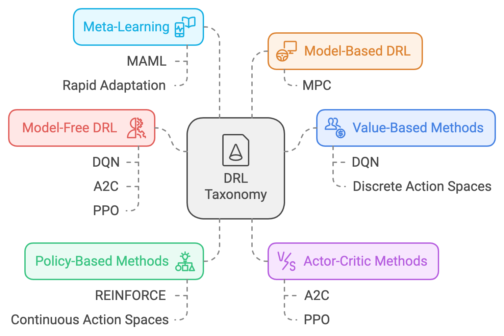
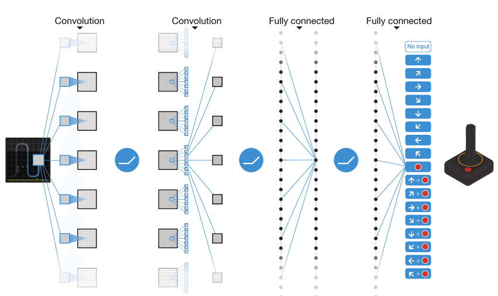
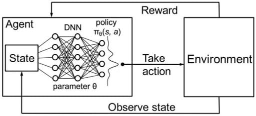
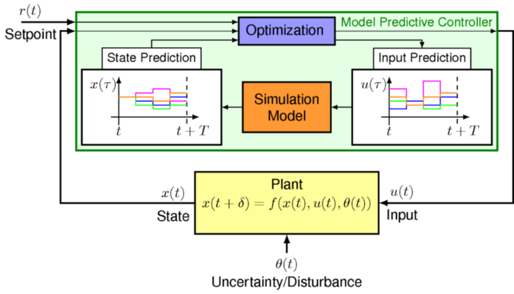

> **Note:**
**"*Reinforcement learning is the closest thing we have to a machine learning-based path to artificial general intelligence.*" — Richard Sutton**

> **Note:**
*Chapter 16 of DLVR provides a comprehensive exploration of Deep Reinforcement Learning (DRL), a powerful paradigm that combines reinforcement learning with deep learning to solve complex decision-making problems. The chapter begins by introducing the core concepts of reinforcement learning, including agents, environments, actions, rewards, and policies, within the framework of Markov Decision Processes (MDPs). It delves into the exploration-exploitation trade-off, value functions, and the role of policies in guiding an agent's actions. The chapter then covers key DRL algorithms, starting with Deep Q-Networks (DQN), which use deep neural networks to estimate action-value functions, followed by policy gradient methods like REINFORCE that directly optimize the policy. The discussion extends to actor-critic methods, which combine the strengths of policy gradients and value-based methods for stable learning. Advanced topics such as multi-agent reinforcement learning, hierarchical RL, and model-based RL are also explored, emphasizing their potential to tackle complex, real-world problems. Throughout, practical implementation guidance is provided with Rust-based examples using tch-rs and burn, enabling readers to build, train, and evaluate DRL agents on various tasks, from simple grid worlds to more challenging environments like LunarLander.*

# 16.1. Introduction to Deep Reinforcement Learning

Deep Reinforcement Learning (DRL) represents a significant expansion of the capabilities of traditional Reinforcement Learning (RL) by integrating deep learning techniques into the RL framework. While traditional RL centers on the interaction between an agent and its environment—where the agent learns through trial and error to take actions that maximize a cumulative reward—it often relies on tabular methods or simple function approximations. These approaches work well in environments with relatively small state and action spaces, such as classic control problems like grid-worlds or cart-pole balancing, where the agent can feasibly explore and learn the value of each state-action pair.

The challenge for traditional RL arises in high-dimensional state spaces encountered in fields like robotics, computer vision, and autonomous driving. Here, the state of the environment might be represented by raw sensory data such as images, video frames, or lidar scans, leading to a vast number of potential states. In such complex settings, relying on *tabular methods* or basic *function approximators* is impractical due to the explosive growth in state space complexity. This is where DRL proves its value, extending the reach of RL into domains where deep learning can effectively handle complex, high-dimensional inputs.


**Figure 1:** Taxonomy of DRL models.

The taxonomy of DRL provides a structured way to categorize the diverse techniques used within the field. These categories include value-based methods, policy-based methods, actor-critic methods, model-free and model-based approaches, each serving different needs depending on the nature of the environment and the problem being addressed.

- *Value-Based Methods* focus on estimating the action-value function $Q(s, a)$, which represents the expected cumulative reward for taking action aaa in state sss and following a given policy thereafter. The goal is to derive an optimal policy indirectly by learning the best actions through these value estimates. A prominent example is the Deep Q-Network (DQN), where a deep neural network (DNN) approximates the Q-function. DQN is effective for environments where the action space is discrete, such as playing Atari games. Value-based methods excel in environments where a clear mapping between states and action values can be learned and exploited.
- *Policy-Based Methods* take a different approach by directly learning a policy $\pi_{\theta}(a \mid s)$, parameterized by $\theta$, which outputs the probability distribution over actions given a state. This approach is particularly useful for continuous action spaces, where the policy directly determines the agent's actions, such as controlling the steering of an autonomous vehicle or adjusting the joint angles of a robotic arm. Policy Gradient (PG) methods, such as REINFORCE, update the policy parameters using gradient ascent to maximize expected rewards. These methods are well-suited for tasks where learning a direct mapping from states to actions is more efficient than first estimating value functions.
- *Actor-Critic Methods* combine the advantages of value-based and policy-based approaches by learning both a policy (the actor) and a value function (the critic). The actor chooses actions based on the current policy, while the critic evaluates the actions by estimating the value function, providing feedback to the actor to improve the policy. The Advantage Actor-Critic (A2C) and Proximal Policy Optimization (PPO) methods are popular examples in this category. Actor-critic methods offer improved stability over pure policy gradient methods by using the critic to reduce the variance of policy updates. These methods are commonly used in complex control problems like robotic locomotion and multi-agent environments, where agents must learn nuanced control strategies.
- *Model-Free DRL* focuses on learning policies and value functions directly through interactions with the environment, without trying to learn a model of the environment’s dynamics. This approach is suitable for situations where the environment is complex and unpredictable, and where it is easier to learn a policy directly rather than approximating the environment's transition dynamics. Methods like DQN, A2C, and PPO fall into this category. Model-free methods are widely used in scenarios like game AI and robotic manipulation because they can adapt to complex dynamics purely through experience.
- *Model-Based DRL*, on the other hand, involves learning an approximation of the environment’s transition dynamics and using this learned model for planning and policy improvement. By learning a transition model $\hat{P}(s' \mid s, a)$ and a reward model $\hat{R}(s, a)$, the agent can simulate future states and rewards, allowing for more sample-efficient learning. This approach can significantly reduce the number of real-world interactions needed, making it particularly valuable in applications where interactions are costly, such as robotics or healthcare. Model Predictive Control (MPC) is a popular technique in this category, where the agent plans a sequence of actions using the learned model to optimize future rewards.
- *Meta-Learning in DRL* is a more recent addition to the taxonomy, focusing on agents that can learn how to learn. Instead of optimizing a single policy, meta-RL trains agents across a range of tasks, enabling them to quickly adapt to new tasks with minimal additional training. This is achieved by optimizing initial policy parameters that are amenable to rapid fine-tuning when exposed to a new task. Model-Agnostic Meta-Learning (MAML) is a well-known technique for meta-RL. This approach is particularly useful in environments where tasks change frequently, such as robotic manipulation with varying objects or adaptive game-playing agents that face different opponents.

Exploration Techniques in DRL are critical due to the challenge of balancing exploration (trying new actions to discover rewards) and exploitation (choosing actions that are known to yield high rewards). Advanced exploration strategies like curiosity-driven exploration and entropy regularization encourage agents to explore more thoroughly. These techniques ensure that agents do not get stuck in local optima, especially in large or sparse environments where rewards are infrequent. For example, in robotic exploration, curiosity-driven agents can explore uncharted areas more effectively than those using simple random exploration strategies.

Transfer Learning in DRL extends the utility of trained models by reusing knowledge from one environment to accelerate learning in another, related environment. This is particularly beneficial in domains where collecting training data is expensive or time-consuming. For instance, a model trained on simulated robotic tasks can be fine-tuned in a real-world environment, leveraging the knowledge from the simulation to speed up learning in reality. Transfer learning enables cross-domain adaptation, such as applying knowledge from a driving simulator to improve performance in real-world autonomous vehicle scenarios.

This taxonomy highlights the expansive scope of Deep Reinforcement Learning (DRL) compared to traditional Reinforcement Learning (RL). While RL lays the groundwork for interaction-based learning through trial and error, DRL significantly broadens this scope through the integration of deep neural networks and sophisticated learning strategies. The ability of DRL to handle high-dimensional inputs, complex action spaces, and dynamic, multi-agent environments makes it indispensable for modern AI applications. With its structured approach to different challenges—whether through value-based methods like DQN, policy-based methods like REINFORCE, or more advanced strategies like model-based and meta-learning—DRL provides a versatile and powerful framework for building adaptive agents capable of solving real-world problems. This versatility has made DRL a cornerstone of robotics, autonomous systems, game AI, financial trading, and healthcare, driving innovation across industries where intelligent decision-making is key.

DRL utilizes deep neural networks (DNNs) to approximate crucial functions in the RL framework, such as value functions $V^{\pi}(s)$, action-value functions $Q^{\pi}(s, a)$, and policies $\pi_{\theta}(a \mid s)$. This integration allows DRL to represent intricate mappings between states and actions, making it possible for agents to learn directly from continuous and unstructured data, like images. For instance, in the context of Atari game environments, an agent can use a convolutional neural network (CNN) to process pixel data from the game screen, producing a policy for selecting actions. This kind of capability is beyond the scope of standard RL methods, which cannot handle the sheer volume of possible states represented by pixel configurations.

One of the most notable advantages of DRL is its ability to automatically learn latent representations from raw data such as images, audio, or text. Through end-to-end learning, DRL can discover the most relevant features for decision-making directly from the data, removing the need for extensive manual feature engineering often required in traditional RL. This feature makes DRL particularly suitable for applications like robotic vision, where an agent must interpret visual data to interact effectively with its environment, and in natural language processing, where agents use text data to make informed decisions or hold conversations.

DRL also extends the range of behaviors that agents can learn, allowing them to tackle more complex and partially observable environments. Traditional methods like Q-learning or SARSA are effective in fully observable environments but face difficulties when the agent does not have direct access to the complete state information. DRL addresses these challenges using recurrent neural networks (RNNs) or transformers, which can maintain a memory of past observations, helping agents to make decisions based on sequences of events. This ability to process temporal information is crucial in strategy games, where agents must infer the opponent's strategy over time, and in robotic navigation, where the environment might change dynamically and require adaptive decision-making.

Beyond perception, DRL facilitates the use of advanced learning algorithms, such as actor-critic methods and policy gradients, which require approximating both value functions and policies. In many continuous control tasks, like those found in robotics or autonomous vehicles, the ability of DRL to approximate these functions using deep networks allows for fine-grained control and the handling of continuous action spaces. This flexibility enables DRL agents to make precise adjustments in physical environments, optimizing complex behaviors that are critical in robotic manipulation or driving strategies.

DRL's scope is further expanded in *multi-agent environments*, where multiple agents must interact within a shared space, either collaboratively or competitively. Deep networks' ability to capture and process complex state information allows DRL agents to learn coordinated behaviors or strategic interactions, adapting their policies in response to other agents' actions. This capability is especially important in real-time strategy games or multi-robot systems, where agents must continuously adapt their strategies based on the evolving behavior of teammates or opponents.

In summary, while traditional RL remains a powerful tool for learning through interactions with environments, Deep Reinforcement Learning significantly expands its applicability by incorporating deep learning's representational power. This enables agents to learn in high-dimensional, unstructured, and dynamic environments, bridging the gap between theoretical RL concepts and real-world challenges. DRL is now essential in diverse applications, including robotics, autonomous navigation, finance, healthcare, and entertainment, where the ability to process complex data and learn sophisticated behaviors makes it a cornerstone of modern AI research and practical implementations.

At the core of reinforcement learning lies the *Markov Decision Process* (MDP), a formal framework for modeling decision-making problems. An MDP is defined by the tuple $(S, A, P, R, \gamma)$, where:

- $S$: A set of states representing the possible situations in which an agent can find itself.
- $A$: A set of actions available to the agent.
- $P(s' \mid s, a)$: The transition probability function, representing the probability of transitioning to state $s'$ after taking action aaa in state sss.
- $R(s, a)$: The reward function, defining the reward received when the agent takes action aaa in state sss.
- $\gamma \in [0, 1]$: The discount factor, which determines the importance of future rewards relative to immediate rewards.

The objective in an MDP is to learn a policy $\pi(a \mid s)$ that maximizes the expected cumulative discounted reward:

$$ \mathbb{E}\left[\sum_{t=0}^{\infty} \gamma^t R(s_t, a_t) \mid \pi\right], $$

where $s_t$ and $a_t$ denote the state and action at time $t$. A policy can be deterministic $\pi(s) = a$ or stochastic $\pi(a \mid s)$ gives the probability of selecting action $a$ given state $s$). The value function $V^\pi(s)$ represents the expected return starting from state $s$ under policy $\pi$, and the action-value function $Q^\pi(s, a)$ represents the expected return for taking action $a$ in state $s$ and following $\pi$ thereafter. These functions are fundamental for evaluating the quality of policies.

One of the central challenges in reinforcement learning is the exploration-exploitation trade-off. The agent must explore to discover new strategies that might yield higher rewards, but it must also exploit existing knowledge to maximize rewards based on its current understanding. This trade-off is crucial for learning optimal policies, and balancing it effectively is a key aspect of algorithms like Q-learning and Deep Q-Networks (DQN). The exploration can be managed using strategies like $\epsilon$-greedy policies, where the agent chooses a random action with probability $\epsilon$ and the action that maximizes $Q$ values with probability $1 - \epsilon$.

In Q-learning, the Q-value update rule is defined as:

$$ Q(s, a) \leftarrow Q(s, a) + \alpha \left[ R(s, a) + \gamma \max_{a'} Q(s', a') - Q(s, a) \right], $$

where $\alpha$ is the learning rate, $\gamma$ is the discount factor, $s'$ is the next state after taking action $a$, and $a'$ is the action that maximizes the Q-value in the next state. This update aims to reduce the temporal difference error, which is the discrepancy between the current Q-value and the value obtained from a one-step lookahead.

Deep reinforcement learning has shown significant potential across various industries where adaptive decision-making is crucial. In healthcare, RL models can optimize personalized treatment plans, adjusting recommendations based on patient responses over time. In autonomous driving, DRL is used for real-time navigation, where the agent learns to control a vehicle by interacting with its environment, making decisions to avoid obstacles and reach destinations. In financial trading, RL agents balance the trade-off between exploration (trying new trading strategies) and exploitation (using known profitable strategies) to optimize portfolios and maximize returns. These applications rely heavily on the ability of DRL to generalize from training environments to real-world scenarios, which makes pre-training and fine-tuning critical for deployment.

This code implements a Q-learning algorithm for a 5x5 grid world environment, where the agent navigates the grid to reach a goal state while avoiding penalties for each step. The environment, modeled as a Markov Decision Process (MDP), consists of states representing grid cells and actions to move up, down, left, or right. Using a Q-table, the agent learns the optimal policy by iteratively updating state-action values through trial and error. Each episode begins with the agent in a random state, exploring the grid using an epsilon-greedy strategy to balance exploration and exploitation. At every step, the agent updates the Q-value for its state-action pair based on the observed reward and the maximum Q-value of the next state, guided by the learning rate and discount factor. After each episode, the grid is visualized with the optimal action for each state based on the current Q-table, while the total reward accumulated during the episode is printed to monitor the agent's learning progress.

```toml
[dependencies]
plotters = "0.3.7"
rand = "0.8.5"
```
```rust
use rand::Rng;
use plotters::prelude::*;

const NUM_STATES: usize = 25; // Number of states in a 5x5 grid world
const NUM_ACTIONS: usize = 4; // Number of actions: Up, Down, Left, Right
const GRID_SIZE: usize = 5; // Size of the grid (5x5)

fn main() {
    let mut q_table = vec![vec![0.0; NUM_ACTIONS]; NUM_STATES]; // Initialize Q-table
    let alpha = 0.1; // Learning rate
    let gamma = 0.9; // Discount factor
    let epsilon = 0.1; // Exploration rate for epsilon-greedy policy
    let mut rng = rand::thread_rng();

    for episode in 0..1000 { // Loop over 1000 episodes
        println!("Starting episode {}", episode + 1); // Print the current episode number

        let mut state = rng.gen_range(0..NUM_STATES); // Initialize a random starting state
        let mut total_reward = 0.0; // Track total reward for the episode

        while !is_terminal(state) { // Continue until a terminal state is reached
            // Select an action using epsilon-greedy policy
            let action = if rng.gen::<f64>() < epsilon {
                rng.gen_range(0..NUM_ACTIONS) // Random action (explore)
            } else {
                q_table[state]
                    .iter()
                    .cloned()
                    .enumerate()
                    .max_by(|a, b| a.1.partial_cmp(&b.1).unwrap())
                    .map(|(idx, _)| idx)
                    .unwrap() // Best action (exploit)
            };

            // Take the action and observe the next state and reward
            let next_state = take_action(state, action);
            let reward = get_reward(state, action);

            // Accumulate the reward
            total_reward += reward;

            // Perform the Q-learning update
            let best_next_action = q_table[next_state]
                .iter()
                .cloned()
                .fold(f64::NEG_INFINITY, f64::max); // Maximum Q-value of the next state
            q_table[state][action] += alpha
                * (reward + gamma * best_next_action - q_table[state][action]); // Update Q-value

            state = next_state; // Transition to the next state
        }

        // Print the total reward for the episode
        println!("Episode {}: Total Reward = {:.2}", episode + 1, total_reward);

        // Visualize the Q-table after each episode
        visualize_grid(&q_table, episode);
    }
}

/// Visualizes the grid using plotters and saves the plot for each episode
fn visualize_grid(q_table: &Vec<Vec<f64>>, episode: usize) {
    // Generate the file name for the current episode
    let file_name = format!("q_learning_episode_{}.png", episode);

    // Create a drawing area for the plot
    let root_area = BitMapBackend::new(&file_name, (600, 600)).into_drawing_area();
    root_area.fill(&WHITE).unwrap();

    // Create a chart builder for the grid
    let mut chart = ChartBuilder::on(&root_area)
        .margin(10)
        .x_label_area_size(20)
        .y_label_area_size(20)
        .build_cartesian_2d(0..GRID_SIZE as i32, 0..GRID_SIZE as i32)
        .unwrap();

    chart.configure_mesh().draw().unwrap();

    // Draw the grid with colors representing the best actions
    for state in 0..NUM_STATES {
        let (x, y) = state_to_xy(state);

        // Find the best action for the current state
        let best_action = q_table[state]
            .iter()
            .cloned()
            .enumerate()
            .max_by(|a, b| a.1.partial_cmp(&b.1).unwrap())
            .map(|(idx, _)| idx)
            .unwrap();

        // Assign colors to actions
        let color = match best_action {
            0 => &RED,    // Up
            1 => &GREEN,  // Down
            2 => &BLUE,   // Left
            3 => &YELLOW, // Right
            _ => &BLACK,
        };

        // Draw the rectangle representing the state
        chart
            .draw_series(std::iter::once(Rectangle::new(
                [(x, y), (x + 1, y + 1)],
                color.filled(),
            )))
            .unwrap();
    }

    // Save the plot
    root_area.present().unwrap();
}

/// Converts a state index to x, y coordinates in the grid
fn state_to_xy(state: usize) -> (i32, i32) {
    let x = state % GRID_SIZE;
    let y = GRID_SIZE - 1 - (state / GRID_SIZE);
    (x as i32, y as i32)
}

/// Checks if the given state is a terminal state
fn is_terminal(state: usize) -> bool {
    state == 24 // Define terminal state (e.g., state 24 is the goal)
}

/// Simulates the agent's action and returns the next state
fn take_action(state: usize, action: usize) -> usize {
    let (x, y) = state_to_xy(state);
    match action {
        0 if y < GRID_SIZE as i32 - 1 => state - GRID_SIZE, // Move Up
        1 if y > 0 => state + GRID_SIZE,                    // Move Down
        2 if x > 0 => state - 1,                            // Move Left
        3 if x < GRID_SIZE as i32 - 1 => state + 1,         // Move Right
        _ => state,                                         // Invalid action, no movement
    }
}

/// Returns the reward for the given state and action
fn get_reward(state: usize, _action: usize) -> f64 {
    if state == 24 {
        10.0 // Reward for reaching the goal state
    } else {
        -1.0 // Penalty for each step
    }
}
```

The code initializes a Q-table with dimensions corresponding to the number of states (25 for a 5x5 grid) and possible actions (4 directions). It uses Q-learning to update this table, aiming to approximate the optimal value function that predicts future rewards for taking specific actions. For each episode, the agent starts in a random state and selects actions using an epsilon-greedy policy: with a small probability ($\epsilon$), it explores random actions to avoid local optima, while most of the time, it exploits the best-known actions based on current Q-values. When an action is taken, the agent transitions to a new state, receives a reward (positive if reaching the goal, negative for other steps), and updates the Q-value using the Q-learning update rule. This update incorporates the immediate reward and the estimated value of the future state, weighted by the learning rate ($\alpha$) and discount factor ($\gamma$).

To visualize the agent's learning progress, the `visualize_grid` function uses the `plotters` crate to render the grid environment as a PNG image after each episode. It draws each state as a colored square, where the color indicates the action with the highest Q-value (e.g., red for "up" or green for "down"). This graphical representation helps observe how the agent's policy evolves as it learns to navigate towards the goal. Functions like `is_terminal`, `take_action`, and `get_reward` define the environment's dynamics, such as when the episode ends (goal state), how actions move the agent through the grid, and the reward structure. By producing visual outputs, the code provides an intuitive understanding of the learning process, showing how the agent's behavior adapts over time to find the most efficient path through the grid world.

The total reward for each episode provides a measure of how efficiently the agent navigates the grid. Initially, the reward is low as the agent explores and learns the environment, often taking suboptimal paths. Over time, as the Q-table updates and the agent identifies the optimal policy, the total reward increases, reflecting shorter paths to the goal. The visualizations reveal the agent's learned policy after each episode, with colors indicating the best action for each state. These visuals help track how the agent's behavior evolves, starting from random actions and gradually converging to a strategy that maximizes rewards. By observing the rewards and policy maps, you can assess the learning progress and verify that the agent achieves its goal effectively.

This section has laid out a comprehensive introduction to deep reinforcement learning, connecting formal MDP theory with practical algorithms like Q-learning. Using Rust, we can build scalable models that leverage deep neural networks for approximating value functions and policies, enabling the agent to handle complex and high-dimensional tasks. Deep Q-Networks (DQN), Proximal Policy Optimization (PPO), and Actor-Critic methods extend these principles, combining neural networks with reinforcement learning to solve problems in diverse domains, from robotic control and game playing to supply chain optimization and energy management, making DRL a cornerstone of modern AI research and industry innovation.

# 16.2. Deep Q-Networks (DQN)

Deep Q-Networks (DQN) represent a significant advancement in reinforcement learning by using deep neural networks (DNNs) to approximate the Q-value function, enabling agents to operate effectively in environments with high-dimensional state spaces. In traditional Q-learning, the agent maintains a Q-table that stores estimates of action values for every state-action pair. This approach becomes infeasible in environments where the state space is large, such as in image-based environments encountered in video games or robotics. The sheer number of possible states, such as all possible configurations of pixels in an image, makes storing and updating a Q-table impractical. DQN addresses this by using a neural network, termed the Q-network, to approximate the function $Q(s, a; \theta)$, where $s$ represents the state, $a$ represents the action, and $\theta$ denotes the parameters of the network (the weights). This approximation allows DQN to generalize across similar states, making it capable of handling continuous or large discrete state spaces, overcoming the scalability issues of tabular methods.


**Figure 2:** Example of a Deep Q network architecture (eq. Gaming).

The primary objective of Q-learning is to learn an optimal action-value function $Q^*(s, a)$, which represents the expected cumulative reward (or return) when starting from state sss, taking action $a$, and subsequently following an optimal policy. The Bellman optimality equation defines the relationship between optimal Q-values as follows:

$$ Q^*(s, a) = \mathbb{E}_{s'} \left[ R(s, a) + \gamma \max_{a'} Q^*(s', a') \mid s, a \right], $$

where $s'$ is the next state reached after taking action $a$ in state $s$, $R(s, a)$ is the immediate reward received for that action, and $\gamma \in [0, 1]$ is the discount factor that determines the importance of future rewards. A higher value of $\gamma$ places greater emphasis on long-term rewards, while a lower value focuses more on immediate rewards. In DQN, the Q-network approximates $Q(s, a; \theta)$ using gradient descent to minimize the temporal difference (TD) error, which measures the discrepancy between the predicted Q-values and the target Q-values computed using the Bellman equation. The loss function for training the Q-network is defined as:

$$ \mathcal{L}(\theta) = \mathbb{E}_{(s, a, r, s') \sim \mathcal{D}} \left[ \left( r + \gamma \max_{a'} Q(s', a'; \theta^-) - Q(s, a; \theta) \right)^2 \right], $$

where $\mathcal{D}$ is the replay buffer storing past experiences as tuples $(s, a, r, s')$, and $\theta^-$ represents the parameters of a target network that is a delayed copy of the Q-network. The loss function aims to minimize the squared difference between the target Q-value $y$ (computed using the target network) and the Q-network's prediction, thereby iteratively adjusting $\theta$ to improve the network’s accuracy.

To stabilize training and address the problem of correlated experiences, DQN introduces experience replay. This involves maintaining a replay buffer $\mathcal{D}$ that stores a fixed number of the agent’s past experiences. Instead of updating the Q-network immediately after every action, the agent samples mini-batches of experiences from this buffer to compute the loss. This approach breaks the correlation between consecutive experiences, ensuring that the learning process is more stable and less prone to the oscillations that arise from highly correlated updates. By learning from a broader distribution of past interactions, the Q-network converges more reliably to an optimal policy.

Another essential mechanism is the use of target networks to provide stable targets for the Q-learning updates. Instead of using the same Q-network to compute both the predicted and target Q-values, DQN maintains a target Q-network with parameters $\theta^-$, which is updated less frequently. Typically, the parameters of the target network are set to the Q-network's parameters $\theta$ after a fixed number of iterations, creating a more stable target for computing the TD error. The target value is computed as:

$$ y = r + \gamma \max_{a'} Q(s', a'; \theta^-), $$

where $y$ is the target Q-value used to update the Q-network. By using a delayed target network, the DQN reduces the likelihood of divergence during training, preventing rapid fluctuations in target values that could destabilize the learning process.

A significant challenge in DQN is overestimation bias, which occurs when the Q-network tends to overestimate the value of certain actions. This bias arises because the same network is used to select the action (via $\max_{a'}$) and to evaluate it. Over time, this can lead the agent to develop suboptimal policies, as it might favor actions that are wrongly perceived as valuable. Double DQN (DDQN) addresses this issue by decoupling the action selection and action evaluation steps. In DDQN, the Q-network is used to select the action, but the target network is used to evaluate the action’s value. The update rule for DDQN is:

$$ y = r + \gamma Q(s', \arg\max_{a'} Q(s', a'; \theta); \theta^-), $$

where $\arg\max_{a'} Q(s', a'; \theta)$ selects the action using the Q-network, but the value is computed using the target network $\theta^-$. This approach reduces the overestimation bias, resulting in more accurate action-value estimates and improved policy stability. The reduction of bias through this technique is critical in environments with noisy rewards or complex dynamics, where overestimation can otherwise lead to degraded performance.

Deep Q-Networks have found applications across a variety of fields where making decisions in complex, uncertain environments is critical. One of the most well-known successes of DQN is in the domain of game AI, where DQN-based agents have been trained to play Atari games directly from raw pixel data, achieving superhuman performance in several cases. By learning from the game environment, these agents can map images of the game screen to actions, such as moving a paddle in Breakout or navigating through obstacles in Space Invaders, showcasing the ability of DQN to handle high-dimensional inputs.

- In autonomous driving, DQNs are used to train agents for tasks like lane navigation, collision avoidance, and parking. The agent interacts with a simulated driving environment, using sensor data such as camera images or lidar scans to determine optimal driving strategies. The DQN learns to map these high-dimensional sensory inputs to actions that maximize safety and efficiency, such as steering or accelerating, providing a foundation for more complex driving behaviors.
- Robotic control is another domain where DQN has been applied effectively. In tasks like robotic arm manipulation or path planning, the agent learns to control actuators to achieve precise movements, such as picking up objects or avoiding obstacles. By interacting with a physical or simulated environment, the DQN learns a policy that maximizes task-specific rewards, like minimizing energy consumption while reaching a target position. This is particularly valuable in manufacturing and logistics, where robots must handle a wide range of objects and environments.
- In the field of finance and trading, DQNs can be employed to build algorithmic trading agents that learn to execute trades based on market data. The agent interacts with a simulated stock market, adjusting its trading strategy to maximize returns while minimizing risks. The DQN learns patterns from historical price data and market indicators, making buy, sell, or hold decisions based on potential future trends. This application of DQN is especially relevant in high-frequency trading, where the agent must quickly adapt to changes in market conditions.
- In healthcare, DQNs have been explored for personalized treatment recommendations, where the agent suggests actions based on a patient’s evolving medical condition to optimize long-term health outcomes. By learning to balance immediate rewards (e.g., symptom relief) and long-term outcomes (e.g., reduced disease progression), DQNs can aid in designing personalized drug dosages or lifestyle intervention plans. This approach is particularly useful for chronic disease management, where patient data is continuously monitored, and treatment plans must be adapted over time.

Through these applications, DQNs have demonstrated their capability to generalize across complex environments and learn sophisticated strategies directly from raw data, making them a powerful tool in the arsenal of modern AI techniques. By combining deep learning with reinforcement learning, DQN offers a scalable solution for decision-making problems that were previously intractable with traditional methods, driving innovation across numerous industries.

Implementing DQN requires careful tuning of hyperparameters such as learning rate ($\alpha$), discount factor ($\gamma$), replay buffer size, and the frequency of target network updates. The exploration-exploitation balance is managed using strategies like the epsilon-greedy policy, where the agent selects a random action with probability $\epsilon$ and the action with the highest Q-value otherwise. Decaying $\epsilon$ over time allows the agent to explore initially and focus on exploitation as it gains more experience.

The training process is computationally intensive, especially when dealing with environments with high-dimensional inputs like images. Using GPU acceleration with libraries like `tch-rs` or `candle` in Rust can significantly speed up training, allowing the Q-network to process large batches of data efficiently. Moreover, techniques like prioritized experience replay, where experiences with higher TD errors are sampled more frequently, can further enhance learning efficiency by focusing updates on the most informative transitions.

Now let see a DRL implementation using `tch-rs`. The presented model utilizes a *Double DQN* architecture, combined with a prioritized experience replay mechanism, to solve the CartPole environment. The Q-Network, a neural network designed using the `tch-rs` crate, takes the current state of the environment as input and outputs Q-values for possible actions. The network consists of three fully connected layers: the first layer maps the state dimensions to 128 neurons, the second reduces it to 64, and the final layer outputs Q-values corresponding to the action space. ReLU activation functions are applied after the first two layers to introduce non-linearity. This architecture enables the agent to approximate the optimal Q-function effectively.

```toml
[dependencies]
plotters = "0.3.7"
rand = "0.8.5"
tch = "0.12.0"
```
```rust
use rand::thread_rng;
use tch::{nn, nn::Module, nn::OptimizerConfig, Device, Tensor, Kind};
use std::collections::VecDeque;
use rand::Rng; 

// Define the Q-Network
fn q_network(vs: &nn::Path, state_dim: i64, action_dim: i64) -> impl Module {
    nn::seq()
        .add(nn::linear(vs / "layer1", state_dim, 128, Default::default()))
        .add_fn(|xs| xs.relu())
        .add(nn::linear(vs / "layer2", 128, 64, Default::default()))
        .add_fn(|xs| xs.relu())
        .add(nn::linear(vs / "output", 64, action_dim, Default::default()))
}

// CartPole Environment
struct CartPole {
    state: Vec<f64>,
    step_count: usize,
    max_steps: usize,
    gravity: f64,
    mass_cart: f64,
    mass_pole: f64,
    pole_length: f64,
    force_mag: f64,
    dt: f64,
}

impl CartPole {
    fn new() -> Self {
        Self {
            state: vec![0.0; 4], // [x, x_dot, theta, theta_dot]
            step_count: 0,
            max_steps: 500,
            gravity: 9.8,
            mass_cart: 1.0,
            mass_pole: 0.1,
            pole_length: 0.5,
            force_mag: 10.0,
            dt: 0.02,
        }
    }

    fn reset(&mut self) -> Vec<f64> {
        self.step_count = 0;
        // Initialize with small random values
        self.state = vec![
            thread_rng().gen::<f64>() * 0.1 - 0.05, // x
            thread_rng().gen::<f64>() * 0.1 - 0.05, // x_dot
            thread_rng().gen::<f64>() * 0.1 - 0.05, // theta
            thread_rng().gen::<f64>() * 0.1 - 0.05, // theta_dot
        ];
        self.state.clone()
    }

    fn step(&mut self, action: i64) -> (Vec<f64>, f64, bool) {
        self.step_count += 1;
        let force = if action == 1 { self.force_mag } else { -self.force_mag };

        let x = self.state[0];
        let x_dot = self.state[1];
        let theta = self.state[2];
        let theta_dot = self.state[3];

        let total_mass = self.mass_cart + self.mass_pole;
        let pole_mass_length = self.mass_pole * self.pole_length;

        // Physics calculations
        let temp = (force + pole_mass_length * theta_dot.powi(2) * theta.sin()) / total_mass;
        let theta_acc = (self.gravity * theta.sin() - temp * theta.cos())
            / (self.pole_length * (4.0 / 3.0 - self.mass_pole * theta.cos().powi(2) / total_mass));
        let x_acc = temp - pole_mass_length * theta_acc * theta.cos() / total_mass;

        // Update state using Euler integration
        self.state[0] = x + x_dot * self.dt;
        self.state[1] = x_dot + x_acc * self.dt;
        self.state[2] = theta + theta_dot * self.dt;
        self.state[3] = theta_dot + theta_acc * self.dt;

        // Check if episode is done
        let done = self.state[0].abs() > 2.4
            || self.state[2].abs() > 0.209 // 12 degrees
            || self.step_count >= self.max_steps;

        let reward = if !done { 1.0 } else { 0.0 };

        (self.state.clone(), reward, done)
    }
}

// Prioritized Experience Replay Buffer
struct PrioritizedReplayBuffer {
    buffer: VecDeque<(Tensor, i64, f64, Tensor, bool, f64)>, // Added priority
    capacity: usize,
    alpha: f64,   // Priority exponent
    beta: f64,    // Importance sampling weight
    epsilon: f64, // Small constant to avoid zero probability
}

impl PrioritizedReplayBuffer {
    fn new(capacity: usize) -> Self {
        PrioritizedReplayBuffer {
            buffer: VecDeque::with_capacity(capacity),
            capacity,
            alpha: 0.6,
            beta: 0.4,
            epsilon: 1e-6,
        }
    }

    fn add(&mut self, experience: (Tensor, i64, f64, Tensor, bool), error: f64) {
        let priority = (error.abs() + self.epsilon).powf(self.alpha);
        if self.buffer.len() >= self.capacity {
            self.buffer.pop_front();
        }
        self.buffer.push_back((
            experience.0,
            experience.1,
            experience.2,
            experience.3,
            experience.4,
            priority,
        ));
    }

    fn sample(&self, batch_size: usize) -> (Vec<(Tensor, i64, f64, Tensor, bool)>, Vec<f64>) {
        let total_priority: f64 = self.buffer.iter().map(|(_, _, _, _, _, p)| p).sum();

        let _rng = thread_rng();
        let samples: Vec<_> = (0..batch_size)
            .map(|_| {
                let p = rand::random::<f64>() * total_priority;
                let mut acc = 0.0;
                let mut idx = 0;
                for (i, (_, _, _, _, _, priority)) in self.buffer.iter().enumerate() {
                    acc += priority;
                    if acc > p {
                        idx = i;
                        break;
                    }
                }
                idx
            })
            .collect();

        let max_weight = (self.buffer.len() as f64 * self.buffer[0].5 / total_priority)
            .powf(-self.beta);

        let weights: Vec<f64> = samples
            .iter()
            .map(|&idx| {
                let p = self.buffer[idx].5 / total_priority;
                (self.buffer.len() as f64 * p).powf(-self.beta) / max_weight
            })
            .collect();

        let experiences: Vec<_> = samples
            .iter()
            .map(|&idx| {
                let (s, a, r, ns, d, _) = &self.buffer[idx];
                (s.shallow_clone(), *a, *r, ns.shallow_clone(), *d)
            })
            .collect();

        (experiences, weights)
    }
}

// Train Double DQN Model
fn train_double_dqn() {
    let device = Device::cuda_if_available();
    let vs = nn::VarStore::new(device);
    let state_dim = 4;
    let action_dim = 2;
    let q_net = q_network(&vs.root(), state_dim, action_dim);

    let mut target_vs = nn::VarStore::new(device);
    let target_net = q_network(&target_vs.root(), state_dim, action_dim);
    target_vs.copy(&vs).unwrap();

    let mut optimizer = nn::Adam::default().build(&vs, 1e-3).unwrap();
    let mut replay_buffer = PrioritizedReplayBuffer::new(100_000);
    let mut env = CartPole::new();

    let epsilon_start = 1.0;
    let epsilon_end = 0.01;
    let epsilon_decay = 0.995;
    let mut epsilon = epsilon_start;
    let gamma = 0.99;
    let batch_size = 64;
    let target_update_interval = 10;

    for episode in 0..1000 {
        let mut state = env.reset();
        let mut total_reward = 0.0;
        let mut done = false;

        while !done {
            let state_tensor = Tensor::of_slice(&state)
                .to_device(device)
                .to_kind(Kind::Float);

            // Epsilon-greedy action selection
            let action = if rand::random::<f64>() < epsilon {
                rand::thread_rng().gen_range(0..action_dim)
            } else {
                let selected_action = q_net
                    .forward(&state_tensor.unsqueeze(0))
                    .argmax(-1, false)
                    .int64_value(&[0]);

                selected_action
            };

            let (next_state, reward, is_done) = env.step(action);
            total_reward += reward;
            done = is_done;

            let next_state_tensor = Tensor::of_slice(&next_state)
                .to_device(device)
                .to_kind(Kind::Float);

            let experience = (
                state_tensor.shallow_clone(),
                action,
                reward,
                next_state_tensor.shallow_clone(),
                done,
            );

            // Calculate initial error for prioritized replay
            let current_q = q_net
                .forward(&state_tensor.unsqueeze(0))
                .gather(1, &Tensor::of_slice(&[action]).to_device(device).unsqueeze(0), false)
                .squeeze();

            let next_q = target_net
                .forward(&next_state_tensor.unsqueeze(0))
                .max_dim(1, false)
                .0;

            let target_q = Tensor::of_slice(&[reward + (1.0 - done as i64 as f64) * gamma])
                .to_device(device)
                * next_q;

            let error = (current_q - target_q).abs().double_value(&[]);
            replay_buffer.add(experience, error);

            if replay_buffer.buffer.len() >= batch_size {
                let (batch, weights) = replay_buffer.sample(batch_size);
                let weights_tensor = Tensor::of_slice(&weights).to_device(device);

                let states: Vec<_> = batch.iter().map(|(s, _, _, _, _)| s.unsqueeze(0)).collect();
                let actions: Vec<_> = batch.iter().map(|(_, a, _, _, _)| *a).collect();
                let rewards: Vec<_> = batch.iter().map(|(_, _, r, _, _)| *r).collect();
                let next_states: Vec<_> = batch.iter().map(|(_, _, _, ns, _)| ns.unsqueeze(0)).collect();
                let dones: Vec<_> = batch.iter().map(|(_, _, _, _, d)| *d as i64 as f64).collect();

                let states = Tensor::cat(&states, 0);
                let actions = Tensor::of_slice(&actions).to(device);
                let rewards = Tensor::of_slice(&rewards).to(device);
                let next_states = Tensor::cat(&next_states, 0);
                let dones = Tensor::of_slice(&dones).to(device);

                // Double DQN
                let next_actions = q_net.forward(&next_states).argmax(-1, false);
                let next_q_values = target_net
                    .forward(&next_states)
                    .gather(1, &next_actions.unsqueeze(1), false)
                    .squeeze();

                let target_q_values = rewards + gamma * next_q_values * (1.0 - dones);
                let current_q_values = q_net
                    .forward(&states)
                    .gather(1, &actions.unsqueeze(1), false)
                    .squeeze();

                // Fixed: Added explicit type annotation for td_errors
                let td_errors: Tensor = current_q_values - target_q_values;
                let loss = (weights_tensor * td_errors.pow(&Tensor::from(2.0))).mean(Kind::Float);

                optimizer.zero_grad();
                loss.backward();
                optimizer.step();
            }

            state = next_state;
        }

        // Update target network
        if episode % target_update_interval == 0 {
            target_vs.copy(&vs).unwrap();
        }

        // Decay epsilon
        epsilon = epsilon_end + (epsilon - epsilon_end) * epsilon_decay;

        println!(
            "Episode {}: Total Reward: {}, Epsilon: {:.3}",
            episode + 1,
            total_reward,
            epsilon
        );
    }
}

fn main() {
    println!("Starting Double DQN training with Prioritized Experience Replay...");
    train_double_dqn();
}
```

The CartPole environment simulates a physics-based control task where the goal is to balance a pole on a moving cart. The environment calculates the next state using physical laws such as Newtonian mechanics. The `step` function computes the cart's position, velocity, pole angle, and angular velocity based on the action taken, returning the next state, a reward of 1 for a balanced state, and a boolean indicating whether the episode has terminated. The environment is reset with random initial conditions for each new episode.

During training, the Double DQN algorithm alternates between interacting with the environment and learning from collected experiences. The agent selects actions using an epsilon-greedy policy, balancing exploration and exploitation. The experience tuple, comprising the current state, action, reward, next state, and done flag, is stored in a prioritized replay buffer. The prioritization ensures that more significant experiences (with higher temporal difference errors) are sampled more frequently, improving learning efficiency.

The agent learns by sampling mini-batches from the replay buffer. Using the Double DQN approach, the online network selects the best action for the next state, while the target network evaluates its Q-value. This separation reduces the overestimation bias inherent in traditional Q-learning. The temporal difference (TD) error between the predicted and target Q-values is calculated and used to update the network parameters via backpropagation.

The target network is periodically synchronized with the online network to stabilize learning. Additionally, epsilon is decayed over episodes to reduce exploration in favor of exploitation as the agent becomes more competent. At the end of each episode, the total reward and the current epsilon value are printed, providing insights into the agent's learning progress. This process continues for a predefined number of episodes or until the agent consistently performs well in the environment.

The Prioritized Replay Buffer enhances learning efficiency by storing transitions along with their priorities, calculated using the temporal-difference (TD) error. Transitions with higher errors are sampled more frequently, as they are considered more informative for learning. Additionally, the buffer applies importance sampling weights to correct for any bias introduced by the prioritization, ensuring that the optimization remains unbiased over time. During training, a batch of transitions is sampled from the replay buffer, and the Q-values for the current states and actions are computed using the main network. The target Q-values are calculated using the target network and the Bellman equation, which incorporates the rewards and the maximum Q-value of the next state. The difference between the predicted Q-values and the targets (the TD error) is used to compute the loss, which is minimized through backpropagation.

The target network is updated periodically to synchronize its weights with the main network. This periodic update prevents the instability that can arise from the moving target problem, where the network being optimized also determines the Q-value targets. Over time, the agent learns to maximize the cumulative reward by predicting Q-values that better align with the expected returns. The combination of Double DQN, which mitigates overestimation of Q-values, and Prioritized Experience Replay, which focuses on critical transitions, ensures efficient and robust learning of the CartPole balancing task. The implementation demonstrates how modern reinforcement learning techniques can address complex decision-making problems by leveraging neural networks, experience replay, and targeted exploration-exploitation strategies.

During each episode, the agent selects actions either randomly (for exploration) or based on the Q-values output by the network. The selected action is executed in the environment, which returns the next state and reward. These interactions are stored in the replay buffer. When the buffer contains enough experiences, the agent samples a batch to update the Q-network using stochastic gradient descent (SGD). The network computes the current Q-values for each state-action pair, and the target Q-values are calculated using the Bellman equation:

$$ y = r + \gamma \max_{a'} Q(s', a'; \theta^-), $$

where $r$ is the immediate reward, $s'$ is the next state, $\gamma$ is the discount factor, and $\theta^-$ are the parameters of the target network. The loss function minimizes the squared difference between the predicted Q-values and these target Q-values, allowing the Q-network to improve its predictions over time.

The code periodically updates the target network by copying the weights from the Q-network, providing a stable target for learning. This update process helps the agent to converge towards an optimal policy, reducing the fluctuations that could occur if both networks were updated simultaneously. The training loop continues for a specified number of episodes, and the agent's total reward for each episode is printed, providing a measure of its performance.

This implementation of DQN demonstrates how to build a reinforcement learning agent capable of learning from high-dimensional inputs using neural networks, and it showcases the integration of advanced concepts like experience replay and target networks. By experimenting with different hyperparameters, network architectures, and exploration strategies, we can adapt the DQN to solve various control problems, from balancing a CartPole to navigating more complex simulated environments. The combination of Rust’s performance with the flexibility of deep learning makes this approach highly suitable for developing efficient, production-ready RL solutions.

In summary, Deep Q-Networks (DQN) extend the capabilities of reinforcement learning by integrating deep learning to approximate action-value functions in complex, high-dimensional environments. The combination of experience replay, target networks, and techniques like Double DQN makes DQN a robust framework for learning optimal policies in a wide range of applications, from gaming and robotics to autonomous systems and financial trading. While challenges such as overestimation bias and the need for efficient exploration remain, DQN's contributions to reinforcement learning have made it a cornerstone in the field, demonstrating the power of deep learning to enable intelligent decision-making in dynamic and uncertain environments.

# 16.3. Policy Gradient Methods

Policy Gradient Methods represent a fundamental approach in reinforcement learning (RL), offering a direct way to optimize a policy without the intermediate step of estimating value functions. Unlike value-based methods like Q-learning, which aim to estimate the value of taking certain actions in specific states, policy gradient methods directly adjust the parameters of the policy to maximize the expected rewards. These methods are particularly advantageous in environments with continuous action spaces, where the discrete nature of value-based methods may be inadequate. A policy in this context is a function $\pi_{\theta}(a \mid s)$ that outputs a probability distribution over actions aaa, given a state $s$, parameterized by $\theta$, which are the weights of a neural network. The objective of policy gradient methods is to find the optimal parameters $\theta$ that maximize the expected cumulative reward:

$$ J(\theta) = \mathbb{E}_{\tau \sim \pi_{\theta}} \left[ \sum_{t=0}^{\infty} \gamma^t R(s_t, a_t) \right], $$

where $\tau$ represents a trajectory $(s_0, a_0, s_1, a_1, \ldots)$ generated by the policy $\pi_{\theta}$, $R(s_t, a_t)$ is the reward received at time $t$, and $\gamma \in [0,1]$ is the discount factor that determines the weight of future rewards relative to immediate rewards. The goal is to adjust $\theta$ such that the policy $\pi_{\theta}$ generates trajectories that maximize $J(\theta)$, effectively guiding the agent towards strategies that yield higher long-term rewards.


**Figure 3:** Key concept of policy gradient method.

The Policy Gradient Theorem provides the mathematical basis for computing the gradient of the expected reward $J(\theta)$ with respect to the policy parameters $\theta$. It states that the gradient can be expressed as:

$$ \nabla_{\theta} J(\theta) = \mathbb{E}_{\tau \sim \pi_{\theta}} \left[ \sum_{t=0}^{\infty} \nabla_{\theta} \log \pi_{\theta}(a_t \mid s_t) G_t \right], $$

where $G_t$ is the reward-to-go or the cumulative future reward from time ttt:

$$ G_t = \sum_{k=t}^{\infty} \gamma^{k-t} R(s_k, a_k). $$

The term $\nabla_{\theta} \log \pi_{\theta}(a_t \mid s_t)$ is known as the score function or policy gradient, which measures how the probability of selecting a particular action changes as the policy parameters are adjusted. This expression shows that the gradient of $J(\theta)$ is the expected value of the product of the score function and the reward-to-go $G_t$. By weighting the gradient with the cumulative rewards, the method effectively encourages actions that lead to higher rewards, updating the parameters $\theta$ in the direction that improves the expected outcome.

A practical implementation of the Policy Gradient Theorem is the REINFORCE algorithm, which is a Monte Carlo policy gradient method. Unlike Temporal Difference (TD) learning methods, REINFORCE estimates the gradient by sampling complete trajectories from the environment. The policy parameters $\theta$ are updated using the following rule:

$$ \theta \leftarrow \theta + \alpha \nabla_{\theta} \log \pi_{\theta}(a_t \mid s_t) G_t, $$

where $\alpha$ is the learning rate, controlling the step size during parameter updates. At each iteration, the agent interacts with the environment to collect trajectories, computes the gradient of the log-probabilities weighted by the cumulative rewards, and adjusts the policy parameters accordingly. This iterative process gradually improves the policy. However, due to the variance inherent in sampling entire trajectories, REINFORCE often suffers from high variance in its gradient estimates, which can slow down or destabilize the learning process.

One of the main challenges in policy gradient methods, particularly in REINFORCE, is the high variance in gradient estimates, which can result in slow convergence. To address this, a baseline function $b(s_t)$ can be introduced to reduce variance without introducing bias into the gradient estimation:

$$ \nabla_{\theta} J(\theta) = \mathbb{E}_{\tau \sim \pi_{\theta}} \left[ \sum_{t=0}^{\infty} \nabla_{\theta} \log \pi_{\theta}(a_t \mid s_t) (G_t - b(s_t)) \right]. $$

A common choice for $b(s_t)$ is the state-value function $V^{\pi}(s)$, which estimates the expected return starting from state $s$. By subtracting $V^{\pi}(s)$ from $G_t$, we obtain the advantage function:

$$ A^{\pi}(s, a) = G_t - V^{\pi}(s), $$

which measures how much better taking action aaa in state $s$ is compared to the average performance at state $s$. This adjustment does not change the expected value of the gradient but can significantly reduce its variance, leading to more stable and efficient learning.

Sample efficiency is another challenge for policy gradient methods, as they often require a large number of interactions with the environment to converge. To improve sample efficiency, Advantage Actor-Critic (A2C) methods are commonly employed. These methods combine the policy gradient approach (the actor) with a critic, which estimates the value function $V^{\pi}(s)$. The actor updates the policy parameters using the advantage estimates:

$$ A^{\pi}(s, a) = Q^{\pi}(s, a) - V^{\pi}(s), $$

where $Q^{\pi}(s, a)$ is the action-value function, representing the expected return when taking action $a$ in state $s$ and following the policy $\pi$ thereafter. The critic learns to minimize the mean squared error between $V^{\pi}(s)$ and the observed returns, providing a more stable estimate of the value function. This allows the actor to focus on actions that provide higher-than-average returns, improving the overall efficiency of the learning process.

Policy gradient methods are particularly well-suited for applications involving continuous control, adaptive strategies, and dynamic environments. For example, in robotics, policy gradient methods are used to learn control policies for tasks such as locomotion, object manipulation, and robotic arm movement. These methods can optimize actions directly, making them ideal for environments where precise control is needed.

- In autonomous driving, policy gradient methods are used to train agents for continuous navigation tasks where vehicles must make real-time decisions based on continuous inputs from sensors like lidar and cameras. The ability to optimize policies for smooth control and collision avoidance is critical for navigating complex environments.
- Game AI has also benefited greatly from policy gradient methods, as seen in strategy games like StarCraft II and Go, where agents must learn complex strategies that adapt to opponents' actions. By learning directly from the reward structure of the game, these methods enable agents to develop sophisticated tactics that outperform traditional rule-based systems.
- In healthcare, policy gradient methods are applied to personalized treatment optimization, where the agent learns to adjust treatments based on patient data to maximize long-term health outcomes. This involves adjusting medication dosages or lifestyle interventions to achieve the best possible outcomes based on continuous monitoring of patient states.
- In financial trading, policy gradient methods can model trading strategies that involve continuous adjustments to buy, sell, or hold decisions. The policy is optimized to maximize returns over time, taking into account the continuous nature of market movements and trading volumes.

Policy gradient methods provide a mathematically rigorous framework for optimizing policies directly, making them highly effective in environments with continuous action spaces and complex dynamics. The Policy Gradient Theorem and its extensions like variance reduction and actor-critic methods enable these techniques to tackle challenges such as high variance and sample inefficiency. As a result, policy gradient methods have become a cornerstone of modern RL, driving advances across diverse domains, from robotics and autonomous vehicles to healthcare and financial markets. Their ability to learn directly from interaction data and optimize complex behaviors makes them crucial for developing intelligent, adaptive systems in real-world scenarios.

The following code serves as an introductory example of the policy gradient method for reinforcement learning, implemented using the `tch-rs` crate in Rust. The code below implements a REINFORCE algorithm for training an agent to control a simulated pendulum system. The environment models a classic control problem where a pendulum must be balanced upright by applying torque actions, with the state space consisting of the pendulum's angle and angular velocity. The simulation includes realistic physics with gravitational forces, moment of inertia, and Euler integration for state updates, while the reward function encourages keeping the pendulum vertical while minimizing both angular velocity and control effort.

```rust
use tch::{nn, nn::Module, nn::OptimizerConfig, Device, Tensor, Kind};
use rand::Rng;

// Policy network remains the same
fn policy_network(vs: nn::Path, state_dim: i64, action_dim: i64) -> Box<dyn Module + 'static> {
    let config = nn::LinearConfig::default();
    let mean_layer = nn::linear(&vs / "mean_output", 128, action_dim, config);
    let log_std_layer = nn::linear(&vs / "log_std_output", 128, action_dim, config);

    Box::new(
        nn::seq()
            .add(nn::linear(&vs / "layer1", state_dim, 256, config))
            .add_fn(|xs| xs.relu())
            .add(nn::linear(&vs / "layer2", 256, 128, config))
            .add_fn(|xs| xs.relu())
            .add_fn(move |xs| {
                let mean = xs.apply(&mean_layer);
                let log_std = xs.apply(&log_std_layer);
                Tensor::cat(&[mean, log_std], 1)
            }),
    )
}

// Sample action function remains the same
fn sample_action(network_output: &Tensor) -> (Tensor, Tensor) {
    let action_dim = network_output.size()[1] / 2;
    let mean = network_output.slice(1, 0, action_dim, 1);
    let log_std = network_output.slice(1, action_dim, action_dim * 2, 1);

    let std = log_std.exp();
    let noise = Tensor::randn_like(&mean);
    let action = &mean + &std * noise;
    let action_clone = action.shallow_clone();

    let log_prob = -((action_clone - &mean).pow(&Tensor::from(2.0))
        / (Tensor::from(2.0) * std.pow(&Tensor::from(2.0))))
        .sum_dim_intlist(vec![1], false, Kind::Float)
        - std.log().sum_dim_intlist(vec![1], false, Kind::Float)
        - Tensor::from(2.0 * std::f64::consts::PI).sqrt().log() * (action_dim as f64 / 2.0);

    (action, log_prob)
}

// Improved Environment implementation
struct Environment {
    state: Vec<f64>,          // [angle, angular_velocity]
    max_steps: usize,
    current_step: usize,
    dt: f64,                  // time step
    g: f64,                   // gravitational constant
    mass: f64,                // mass of pendulum
    length: f64,              // length of pendulum
}

impl Environment {
    fn new(max_steps: usize) -> Self {
        Self {
            state: vec![0.0, 0.0],  // [angle, angular_velocity]
            max_steps,
            current_step: 0,
            dt: 0.05,
            g: 9.81,
            mass: 1.0,
            length: 1.0,
        }
    }

    fn reset(&mut self) -> Vec<f64> {
        self.current_step = 0;
        let mut rng = rand::thread_rng();

        // Initialize with random angle (-π/4 to π/4) and small random velocity
        self.state = vec![
            rng.gen::<f64>() * std::f64::consts::PI / 2.0 - std::f64::consts::PI / 4.0,
            rng.gen::<f64>() * 0.2 - 0.1,
        ];

        self.state.clone()
    }

    fn step(&mut self, action: f64) -> (Vec<f64>, f64, bool) {
        self.current_step += 1;

        // Clamp action to [-2, 2] range
        let action = action.max(-2.0).min(2.0);

        // Physics simulation
        let angle = self.state[0];
        let angular_vel = self.state[1];

        // Calculate angular acceleration using pendulum physics
        // τ = I*α where τ is torque, I is moment of inertia, α is angular acceleration
        let moment_of_inertia = self.mass * self.length * self.length;
        let gravity_torque = -self.mass * self.g * self.length * angle.sin();
        let control_torque = action;
        let angular_acc = (gravity_torque + control_torque) / moment_of_inertia;

        // Update state using Euler integration
        let new_angular_vel = angular_vel + angular_acc * self.dt;
        let new_angle = angle + new_angular_vel * self.dt;

        // Update state
        self.state = vec![new_angle, new_angular_vel];

        // Calculate reward
        // Reward is based on keeping the pendulum upright (angle near 0)
        // and minimizing angular velocity and control effort
        let angle_cost = angle.powi(2);
        let velocity_cost = 0.1 * angular_vel.powi(2);
        let control_cost = 0.001 * action.powi(2);
        let reward = -(angle_cost + velocity_cost + control_cost);

        // Check if episode is done
        let done = self.current_step >= self.max_steps 
            || angle.abs() > std::f64::consts::PI; // Terminal if angle too large

        (self.state.clone(), reward, done)
    }

    fn is_done(&self) -> bool {
        self.current_step >= self.max_steps || 
        self.state[0].abs() > std::f64::consts::PI
    }
}

// REINFORCE update function remains the same
fn reinforce_update(
    optimizer: &mut nn::Optimizer,
    log_probs: &Vec<Tensor>,
    rewards: &Vec<f64>,
    gamma: f64,
) {
    let reward_to_go: Vec<f64> = rewards
        .iter()
        .rev()
        .scan(0.0, |acc, &r| {
            *acc = r + gamma * *acc;
            Some(*acc)
        })
        .collect::<Vec<_>>()
        .into_iter()
        .rev()
        .collect();

    let reward_mean = reward_to_go.iter().sum::<f64>() / reward_to_go.len() as f64;
    let reward_std = (reward_to_go
        .iter()
        .map(|r| (r - reward_mean).powi(2))
        .sum::<f64>()
        / reward_to_go.len() as f64)
        .sqrt();
    let normalized_rewards: Vec<f64> = if reward_std > 1e-8 {
        reward_to_go.iter().map(|r| (r - reward_mean) / reward_std).collect()
    } else {
        reward_to_go.iter().map(|r| r - reward_mean).collect()
    };

    optimizer.zero_grad();
    let policy_loss = log_probs
        .iter()
        .zip(normalized_rewards.iter())
        .map(|(log_prob, &reward)| -log_prob * reward)
        .fold(Tensor::zeros(&[], (Kind::Float, Device::Cpu)), |acc, x| acc + x);

    optimizer.backward_step(&policy_loss);
}

// Modified training loop to include episode statistics
fn train_reinforce(
    policy: &dyn Module,
    optimizer: &mut nn::Optimizer,
    env: &mut Environment,
    episodes: usize,
    gamma: f64,
) {
    let mut best_reward = f64::NEG_INFINITY;

    for episode in 0..episodes {
        let mut state = env.reset();
        let mut log_probs = Vec::new();
        let mut rewards = Vec::new();
        let mut total_reward = 0.0;

        while !env.is_done() {
            let state_tensor = Tensor::of_slice(&state)
                .to_kind(Kind::Float)
                .unsqueeze(0);

            let network_output = policy.forward(&state_tensor);
            let (action, log_prob) = sample_action(&network_output);
            let action_value = action.double_value(&[0, 0]);

            let (next_state, reward, done) = env.step(action_value);
            log_probs.push(log_prob);
            rewards.push(reward);
            total_reward += reward;
            state = next_state;

            if done {
                break;
            }
        }

        reinforce_update(optimizer, &log_probs, &rewards, gamma);

        // Track and display progress
        if total_reward > best_reward {
            best_reward = total_reward;
        }

        if (episode + 1) % 10 == 0 {
            println!(
                "Episode {}: Total Reward = {:.2}, Best Reward = {:.2}, Avg Episode Length = {}",
                episode + 1,
                total_reward,
                best_reward,
                rewards.len()
            );
        }
    }
}

fn main() {
    let device = Device::cuda_if_available();
    let vs = nn::VarStore::new(device);
    let state_dim = 2;  // [angle, angular_velocity]
    let action_dim = 1;  // torque
    let policy = policy_network(vs.root(), state_dim, action_dim);
    let mut optimizer = nn::Adam::default().build(&vs, 3e-4).unwrap();

    let mut env = Environment::new(200);  // 200 steps max per episode
    let episodes = 1000;
    let gamma = 0.99;

    println!("Starting REINFORCE training on pendulum environment...");
    train_reinforce(&*policy, &mut optimizer, &mut env, episodes, gamma);
}
```

The REINFORCE implementation uses a neural network policy that outputs a Gaussian distribution over actions (torque values). The network architecture consists of two hidden layers (256 and 128 units) with ReLU activations, followed by parallel layers for the mean and log standard deviation of the action distribution. During training, actions are sampled from this distribution, and the policy is updated using policy gradient method with reward-to-go calculations. The algorithm normalizes rewards across episodes and uses the Adam optimizer to update the policy parameters in the direction that maximizes expected returns, with rewards discounted by a factor gamma (0.99). This implementation employs several practical techniques including reward normalization, action clamping, and periodic performance monitoring to ensure stable learning.

The reinforce_update function implements the REINFORCE algorithm with reward-to-go. The reward-to-go calculation sums the discounted future rewards for each time step, providing a learning signal that focuses on the future outcomes of actions rather than their immediate results. This helps reduce the variance of gradient estimates, improving the stability of training. After computing the reward-to-go, the rewards are normalized to have zero mean and unit variance, further improving convergence speed by standardizing the scale of reward signals. The normalized rewards are then used to weight the log-probabilities of actions taken during the episode, and gradient ascent is performed using the `backward_step` method of the optimizer to adjust the policy parameters.

The training loop in `train_reinforce` orchestrates the interaction between the agent and the environment over a specified number of episodes. The agent begins each episode by resetting the environment and then interacts with it until the episode terminates. For each interaction, the agent samples an action based on the state using the policy network, executes the action in the environment, and collects the log-probability of the action and the reward received. When the episode ends (i.e., when the environment signals that the task is complete), the `reinforce_update` function is called to update the policy based on the collected experiences. This iterative process allows the agent to learn a policy that maximizes cumulative rewards over time.

The design of this implementation allows it to adapt to a variety of continuous control tasks, such as MountainCarContinuous. The agent learns how to accelerate the car effectively to escape the steep valley by optimizing its actions based on the feedback it receives from the environment. Through repeated interactions and policy updates, the agent refines its behavior to reach the goal more consistently. This implementation also serves as a foundation for applying more sophisticated enhancements, such as using baseline functions (e.g., value function approximation) for further variance reduction, or integrating actor-critic methods for better sample efficiency. By leveraging the flexibility and performance of Rust and `tch-rs`, this code can be extended to address more complex tasks in robotics, autonomous navigation, and other real-world applications that involve continuous control and decision-making.

Training a policy gradient agent on a continuous control task like MountainCarContinuous involves learning a policy that can accelerate the car to reach the top of the hill. By experimenting with different baseline techniques, such as using a learned value function, we can further improve the stability and efficiency of training. In industry, policy gradient methods are used in applications that require direct optimization of complex behaviors, such as robotic control, game playing, and real-time decision-making, showcasing their potential for tasks where value-based methods may struggle.

The REINFORCE implementation described earlier emphasizes a policy gradient method, where the agent learns a probabilistic policy to maximize long-term rewards by directly optimizing the expected return. This approach, suitable for continuous control tasks like MountainCarContinuous, uses sampled trajectories and reward-to-go calculations to update the policy parameters effectively. Its reliance on policy gradients, reward normalization, and action sampling make it a foundational algorithm for reinforcement learning. However, REINFORCE can sometimes suffer from high variance in gradient estimates and inefficiencies in sample usage, which necessitate alternative methods like the Deep Deterministic Policy Gradient (DDPG).

The following code implements a DDPG reinforcement learning algorithm using the `tch` library for PyTorch bindings in Rust, addressing challenges specific to continuous action spaces. DDPG leverages an actor-critic architecture where the actor learns a deterministic policy to produce optimal actions, and the critic evaluates these actions using Q-values. The algorithm employs replay buffers to store and sample past experiences, improving sample efficiency, and uses soft updates to gradually adjust target networks, ensuring stable learning. Unlike probabilistic approaches like REINFORCE, DDPG's deterministic policies scale effectively to higher-dimensional action spaces. The program features an environment with simple dynamics, an actor network to generate actions, a critic network to evaluate them, and twin target networks to mitigate overestimation bias and stabilize convergence. This combination of techniques makes DDPG a powerful solution for complex, continuous control tasks.

```rust
use rand::prelude::SliceRandom;
use tch::{nn, nn::ModuleT, nn::OptimizerConfig, Device, Kind, Tensor};

// Hyperparameters remain the same
const GAMMA: f64 = 0.99;
const TAU: f64 = 0.005;
const REPLAY_BUFFER_CAPACITY: usize = 100_000;
const BATCH_SIZE: usize = 128;
const MAX_EPISODES: usize = 200;
const MAX_STEPS: usize = 200;
const ACTOR_LR: f64 = 1e-4;
const CRITIC_LR: f64 = 1e-3;

// ReplayBuffer remains the same
struct ReplayBuffer {
    obs: Vec<Vec<f64>>,
    actions: Vec<f64>,
    rewards: Vec<f64>,
    next_obs: Vec<Vec<f64>>,
    dones: Vec<bool>,
    capacity: usize,
    len: usize,
    i: usize,
}

impl ReplayBuffer {
    pub fn new(capacity: usize) -> Self {
        Self {
            obs: Vec::with_capacity(capacity),
            actions: Vec::with_capacity(capacity),
            rewards: Vec::with_capacity(capacity),
            next_obs: Vec::with_capacity(capacity),
            dones: Vec::with_capacity(capacity),
            capacity,
            len: 0,
            i: 0,
        }
    }

    pub fn push(&mut self, obs: Vec<f64>, action: f64, reward: f64, next_obs: Vec<f64>, done: bool) {
        if self.len < self.capacity {
            self.obs.push(obs);
            self.actions.push(action);
            self.rewards.push(reward);
            self.next_obs.push(next_obs);
            self.dones.push(done);
            self.len += 1;
        } else {
            let i = self.i % self.capacity;
            self.obs[i] = obs;
            self.actions[i] = action;
            self.rewards[i] = reward;
            self.next_obs[i] = next_obs;
            self.dones[i] = done;
        }
        self.i += 1;
    }

    pub fn sample(&self, batch_size: usize) -> Option<(Tensor, Tensor, Tensor, Tensor, Tensor)> {
        if self.len < batch_size {
            return None;
        }
        let mut rng = rand::thread_rng();
        let indices: Vec<usize> = (0..self.len).collect();
        let sampled_indices: Vec<usize> = indices.choose_multiple(&mut rng, batch_size).cloned().collect();

        let obs_batch: Vec<_> = sampled_indices.iter().map(|&i| &self.obs[i]).cloned().collect();
        let actions_batch: Vec<_> = sampled_indices.iter().map(|&i| self.actions[i]).collect();
        let rewards_batch: Vec<_> = sampled_indices.iter().map(|&i| self.rewards[i]).collect();
        let next_obs_batch: Vec<_> = sampled_indices.iter().map(|&i| &self.next_obs[i]).cloned().collect();
        let dones_batch: Vec<_> = sampled_indices.iter().map(|&i| self.dones[i] as i32).collect();

        let device = Device::cuda_if_available();

        Some((
            Tensor::of_slice(&obs_batch.concat()).view((batch_size as i64, -1)).to_device(device).to_kind(Kind::Float),
            Tensor::of_slice(&actions_batch).view((-1, 1)).to_device(device).to_kind(Kind::Float),
            Tensor::of_slice(&rewards_batch).view((-1, 1)).to_device(device).to_kind(Kind::Float),
            Tensor::of_slice(&next_obs_batch.concat()).view((batch_size as i64, -1)).to_device(device).to_kind(Kind::Float),
            Tensor::of_slice(&dones_batch).view((-1, 1)).to_device(device).to_kind(Kind::Float)
        ))
    }
}
// Actor network
fn build_actor(vs: &nn::Path, obs_dim: usize, act_dim: usize, max_action: f64) -> nn::Sequential {
    nn::seq()
        .add(nn::linear(vs / "layer1", obs_dim as i64, 400, Default::default()))
        .add_fn(|x| x.relu())
        .add(nn::linear(vs / "layer2", 400, 300, Default::default()))
        .add_fn(|x| x.relu())
        .add(nn::linear(vs / "layer3", 300, act_dim as i64, Default::default()))
        .add_fn(move |x| x.tanh() * max_action)
}

// Critic network
fn build_critic(vs: &nn::Path, obs_dim: usize, act_dim: usize) -> nn::Sequential {
    nn::seq()
        .add(nn::linear(vs / "layer1", (obs_dim + act_dim) as i64, 400, Default::default()))
        .add_fn(|x| x.relu())
        .add(nn::linear(vs / "layer2", 400, 300, Default::default()))
        .add_fn(|x| x.relu())
        .add(nn::linear(vs / "layer3", 300, 1, Default::default()))
}

// Soft update for target networks
fn soft_update(target_vs: &mut nn::VarStore, source_vs: &nn::VarStore, tau: f64) {
    tch::no_grad(|| {
        for (target, source) in target_vs
            .trainable_variables()
            .iter_mut()
            .zip(source_vs.trainable_variables())
        {
            let new_target = &source * tau + &*target * (1.0 - tau);
            target.copy_(&new_target);  // Removed unwrap() since copy_ returns ()
        }
    });
}

// Environment
struct Environment {
    state: Vec<f64>,
    max_steps: usize,
    current_step: usize,
}

impl Environment {
    pub fn new(state_dim: usize, max_steps: usize) -> Self {
        Self {
            state: vec![0.0; state_dim],
            max_steps,
            current_step: 0,
        }
    }

    pub fn reset(&mut self) -> Vec<f64> {
        self.current_step = 0;
        self.state = vec![0.0; self.state.len()];
        self.state.clone()
    }

    pub fn step(&mut self, action: f64) -> (Vec<f64>, f64, bool) {
        self.current_step += 1;
        let reward = -action.powi(2); // Example reward function
        let done = self.current_step >= self.max_steps;
        self.state = self.state.iter().map(|&x| x + action).collect();
        (self.state.clone(), reward, done)
    }
}

// Training loop with fixed tensor types
fn train() {
    let device = Device::cuda_if_available();
    let actor_vs = nn::VarStore::new(device);
    let critic_vs = nn::VarStore::new(device);
    let mut target_actor_vs = nn::VarStore::new(device);
    let mut target_critic_vs = nn::VarStore::new(device);

    let actor = build_actor(&actor_vs.root(), 3, 1, 1.0);
    let critic = build_critic(&critic_vs.root(), 3, 1);
    let target_actor = build_actor(&target_actor_vs.root(), 3, 1, 1.0);
    let target_critic = build_critic(&target_critic_vs.root(), 3, 1);

    // Initialize target networks
    tch::no_grad(|| {
        target_actor_vs.copy(&actor_vs).unwrap();
        target_critic_vs.copy(&critic_vs).unwrap();
    });

    let mut actor_opt = nn::Adam::default().build(&actor_vs, ACTOR_LR).unwrap();
    let mut critic_opt = nn::Adam::default().build(&critic_vs, CRITIC_LR).unwrap();

    let mut replay_buffer = ReplayBuffer::new(REPLAY_BUFFER_CAPACITY);
    let mut env = Environment::new(3, MAX_STEPS);

    for episode in 0..MAX_EPISODES {
        let mut state = env.reset();
        let mut total_reward = 0.0;

        for _ in 0..MAX_STEPS {
            let state_tensor = Tensor::of_slice(&state)
                .view([1, -1])
                .to_device(device)
                .to_kind(Kind::Float);

            // Use no_grad for inference
            let action = tch::no_grad(|| {
                actor.forward_t(&state_tensor, false)
                    .squeeze()
                    .to_kind(Kind::Float)
            });

            let (next_state, reward, done) = env.step(action.double_value(&[]));
            replay_buffer.push(state.clone(), action.double_value(&[]), reward, next_state.clone(), done);

            state = next_state;
            total_reward += reward;

            if done {
                break;
            }

            if let Some((obs_batch, action_batch, reward_batch, next_obs_batch, done_batch)) =
                replay_buffer.sample(BATCH_SIZE)
            {
                // Compute target Q value with no_grad
                let target_q = tch::no_grad(|| {
                    let target_actions = target_actor.forward_t(&next_obs_batch, false)
                        .to_kind(Kind::Float);

                    target_critic.forward_t(
                        &Tensor::cat(&[
                            next_obs_batch.to_kind(Kind::Float),
                            target_actions
                        ], 1),
                        false
                    )
                });

                let y = reward_batch + (1.0 - done_batch) * GAMMA * target_q;

                // Compute critic loss
                let q = critic.forward_t(
                    &Tensor::cat(&[
                        obs_batch.to_kind(Kind::Float),
                        action_batch.to_kind(Kind::Float)
                    ], 1),
                    false
                );

                let critic_loss = (&q - &y).pow_tensor_scalar(2).mean(Kind::Float);
                critic_opt.zero_grad();
                critic_loss.backward();
                critic_opt.step();

                // Compute actor loss
                let actions = actor.forward_t(&obs_batch, true).to_kind(Kind::Float);
                let actor_loss = -critic
                    .forward_t(
                        &Tensor::cat(&[
                            obs_batch.to_kind(Kind::Float),
                            actions
                        ], 1),
                        false
                    )
                    .mean(Kind::Float);

                actor_opt.zero_grad();
                actor_loss.backward();
                actor_opt.step();

                // Update target networks
                soft_update(&mut target_actor_vs, &actor_vs, TAU);
                soft_update(&mut target_critic_vs, &critic_vs, TAU);
            }
        }

        println!("Episode {}: Total Reward = {}", episode, total_reward);
    }
}

fn main() {
    train();
}
```

The code implements the DDPG algorithm for continuous action spaces, leveraging an actor-critic framework. The actor network produces deterministic actions based on the current state, while the critic network evaluates these actions by estimating their Q-values. A synthetic environment simulates agent interactions, providing observations, rewards, and termination signals. Past experiences are stored in a replay buffer and sampled randomly to train the actor and critic networks, enhancing sample efficiency. The actor is trained to maximize Q-values, while the critic minimizes the Bellman error by learning to approximate the Q-function. Soft updates adjust the target networks for both actor and critic using a small step parameter (TAU), stabilizing the learning process by reducing fluctuations in target values.

The training loop begins by resetting the environment to get an initial state. At each step in an episode, the actor network generates an action based on the current state. The environment provides the next state, reward, and a termination flag, and the transition is stored in the replay buffer. During training, random samples from the buffer are used to compute losses for both networks. The critic minimizes its loss by improving its Q-value predictions, while the actor updates its policy to maximize the critic's evaluation of its actions. Soft updates ensure smooth adjustments of target networks, promoting stable learning. Over a set number of episodes, the agent's performance is measured by cumulative rewards, reflecting its ability to learn an optimal policy.

Compared to REINFORCE, which optimizes stochastic policies based on collected rewards, this DDPG implementation addresses the limitations of high variance in gradient estimates and sample inefficiency by employing deterministic policies and value-based learning. The integration of replay buffers and twin target networks enhances stability and scalability for continuous control tasks, making DDPG suitable for more complex environments. The explicit separation of actor and critic roles enables effective balancing of exploration and exploitation, overcoming challenges commonly faced in pure policy gradient methods.

Policy gradient methods are a family of reinforcement learning algorithms that optimize the policy directly by maximizing the expected cumulative reward. Unlike value-based methods, which rely on estimating value functions, policy gradient approaches parameterize the policy itself as a probabilistic distribution or a deterministic mapping. These methods compute gradients of the reward objective with respect to policy parameters, allowing the agent to improve its action-selection strategy iteratively. Techniques such as reward normalization, baseline functions (e.g., value approximations), and variance reduction strategies help stabilize learning. Policy gradient methods, exemplified by algorithms like REINFORCE and DDPG, are particularly effective in high-dimensional and continuous action spaces, making them valuable for applications like robotics, game playing, and real-time decision-making. Their flexibility, coupled with scalability improvements via actor-critic architectures, makes them powerful tools for solving complex sequential decision-making problems.

# 16.4. Actor-Critic Methods

Actor-Critic Methods represent a hybrid and adaptive approach in reinforcement learning (RL), combining the strengths of policy gradient methods (the actor) with value-based methods (the critic). This architecture is particularly effective in complex environments where both policy optimization and accurate value estimation are crucial for success. The actor-critic framework includes two primary components: the actor, a neural network that parameterizes the policy $\pi_{\theta}(a \mid s)$, where $\theta$ are the parameters of the network. This policy outputs a probability distribution over actions given a state, guiding the agent's decision-making. The critic, on the other hand, is a neural network that estimates either the value function $V^{\pi}(s; w)$ or the action-value function $Q^{\pi}(s, a; w)$, with $w$ as its parameters. The critic’s role is to provide feedback on the quality of actions or states, helping refine the actor’s policy by assessing the outcomes of actions taken in the environment.


**Figure 4:** Architecture of actor critic DRL model.

The integration of these two components allows for a structured approach to learning, where the actor directly adjusts the policy to improve action selection, while the critic evaluates the policy’s performance, guiding the actor with a value estimate. This synergy enables actor-critic methods to handle environments with complex state spaces or continuous action spaces, where traditional value-based methods like Q-learning may struggle due to the need to estimate values for every state-action pair.

At the heart of actor-critic methods is the Advantage Function, denoted as $A^{\pi}(s, a)$, which quantifies how much better or worse an action aaa is compared to the average action that the policy would take in state sss. The advantage function is mathematically defined as:

$$ A^{\pi}(s, a) = Q^{\pi}(s, a) - V^{\pi}(s), $$

where $Q^{\pi}(s, a)$ is the action-value function, representing the expected cumulative reward when starting from state $s$, taking action $a$, and following policy $\pi$ thereafter, and $V^{\pi}(s)$ is the state-value function, representing the expected return starting from state $s$ under policy $\pi$. The advantage function effectively measures how an action compares to the average outcome expected in a given state. It allows the actor to adjust the policy parameters to favor actions that result in higher-than-expected rewards.

Actor-critic methods leverage Temporal Difference (TD) learning to update both the actor and the critic. The TD error serves as a critical learning signal, capturing the difference between the critic’s estimated value and the actual observed reward. The TD error is calculated as:

$$ \delta_t = r_t + \gamma V^{\pi}(s_{t+1}) - V^{\pi}(s_t), $$

where $r_t$ is the reward received after taking action $a_t$ in state $s_t$, $\gamma$ is the discount factor that balances the importance of immediate and future rewards, $V^{\pi}(s_{t+1})$ is the estimated value of the next state, and $V^{\pi}(s_t)$ is the estimated value of the current state. The TD error quantifies how the observed reward and the value estimate of the next state deviate from the current state's value estimate.

The critic is updated by minimizing the squared TD error:

$$ \mathcal{L}_{\text{critic}}(w) = \delta_t^2. $$

This loss function encourages the critic to refine its value estimates so that they align more closely with the rewards received during the agent's interaction with the environment.

The actor uses the TD error to adjust its policy parameters $\theta$ through stochastic gradient ascent:

$$ \nabla_{\theta} J(\theta) \approx \delta_t \nabla_{\theta} \log \pi_{\theta}(a_t \mid s_t). $$

Here, $\nabla_{\theta} \log \pi_{\theta}(a_t \mid s_t)$ represents the gradient of the log-probability of the action taken, indicating how the likelihood of selecting action ata_tat changes with respect to $\theta$. This gradient is weighted by the TD error, allowing the actor to adjust its policy towards actions that lead to higher-than-expected rewards, improving the policy over time.

Actor-critic methods can suffer from instability during training, as the actor’s policy updates depend on the critic’s value estimates, which may be noisy or change rapidly. This interaction can lead to oscillations or divergence in the learning process. To mitigate these issues, more advanced versions like *Advantage Actor-Critic (A2C)* and *Proximal Policy Optimization (PPO)* have been developed, each offering mechanisms to stabilize training.

Advantage Actor-Critic (A2C) utilizes multiple workers that interact with copies of the environment in parallel. These workers collect trajectories, compute gradients, and average them before applying updates to a global policy. This parallelism reduces the variance of the policy updates by averaging over a diverse set of experiences. The policy gradient in A2C uses the advantage function, computed as:

$$ \nabla_{\theta} J(\theta) = \mathbb{E}\left[ A^{\pi}(s_t, a_t) \nabla_{\theta} \log \pi_{\theta}(a_t \mid s_t) \right], $$

where the advantage estimate is often derived from the TD error:

$$ A^{\pi}(s_t, a_t) \approx r_t + \gamma V^{\pi}(s_{t+1}) - V^{\pi}(s_t). $$

By combining the experiences from multiple workers, A2C improves the stability of updates and accelerates the learning process.

Proximal Policy Optimization (PPO) addresses instability by introducing a clipped objective function that prevents large policy updates, which can destabilize training. The PPO objective is:

$$ \mathcal{L}_{\text{PPO}}(\theta) = \mathbb{E}\left[\min\left( r_t(\theta) A^{\pi}(s_t, a_t), \text{clip}(r_t(\theta), 1 - \epsilon, 1 + \epsilon) A^{\pi}(s_t, a_t) \right)\right], $$

where $r_t(\theta) = \frac{\pi_{\theta}(a_t \mid s_t)}{\pi_{\theta_{\text{old}}}(a_t \mid s_t)}$ is the ratio of the new and old policy probabilities, and $\epsilon$ is a small positive value that controls the allowable change. The clipping mechanism ensures that the updated policy does not deviate too drastically from the old policy, maintaining a balance between exploration and policy stability. This makes PPO one of the most robust and widely used algorithms in RL, particularly in environments with continuous action spaces.

The versatility of actor-critic methods makes them well-suited for a range of real-world applications, especially those requiring continuous control and adaptive behavior in dynamic environments.

Actor-Critic methods offer a powerful approach to reinforcement learning by combining direct policy optimization with value function estimation. Through the use of the advantage function and TD error, they enable efficient learning by guiding the actor with feedback from the critic. Despite challenges like instability during training, methods like A2C and PPO have significantly enhanced the stability and efficiency of these algorithms, making them a cornerstone in modern RL research. With applications ranging from robotics and autonomous systems to finance and game AI, actor-critic methods continue to be a key driver of innovation in the field of reinforcement learning.

Here's a Rust implementation of an Actor-Critic method using `tch-rs`, including network architectures, advantage computation, TD error updates, and visualization of training progress using the `plotters` crate. This example assumes a continuous action space environment like LunarLander. We’ll implement separate actor and critic networks, compute the advantage function, and perform updates using stochastic gradient descent. We'll also visualize the cumulative rewards over episodes, providing insight into the training process.

```rust
use tch::{nn, nn::Module, nn::OptimizerConfig, Device, Tensor, Kind};
use plotters::prelude::*;
use std::error::Error;
use rand::prelude::*;

const GAMMA: f64 = 0.99;
const LEARNING_RATE: f64 = 0.001;
const HIDDEN_SIZE: i64 = 128;

// Simple environment struct for LunarLander-like tasks
struct Environment {
    state: Tensor,
    rng: ThreadRng,
    device: Device,
}

impl Environment {
    fn new(device: Device) -> Self {
        Environment {
            state: Tensor::zeros(&[8], (Kind::Float, device)),
            rng: rand::thread_rng(),
            device,
        }
    }

    fn reset(&mut self) -> Tensor {
        let state_vec: Vec<f32> = (0..8)
            .map(|_| self.rng.gen_range(-1.0..1.0))
            .collect();
        self.state = Tensor::of_slice(&state_vec).to_device(self.device);
        self.state.shallow_clone()
    }

    fn step(&mut self, action: &Tensor) -> (Tensor, f64, bool) {
        let action_array: Vec<f32> = action
            .to_kind(Kind::Float)
            .try_into()
            .expect("Failed to convert action Tensor to Vec<f32>");

        let action_x = action_array[0];
        let action_y = action_array[1];

        let state_array: Vec<f32> = self.state
            .to_kind(Kind::Float)
            .try_into()
            .expect("Failed to convert state Tensor to Vec<f32>");
        let mut new_state_vec = state_array.clone();

        new_state_vec[0] += action_x * 0.1; // x position
        new_state_vec[1] += action_y * 0.1; // y position
        new_state_vec[2] += (action_x * 0.05).max(-0.5).min(0.5); // x velocity
        new_state_vec[3] += (action_y * 0.05 - 0.1).max(-0.5).min(0.5); // y velocity

        for value in new_state_vec.iter_mut() {
            *value = value.max(-1.0).min(1.0);
        }

        self.state = Tensor::of_slice(&new_state_vec).to_device(self.device);
        let reward = -new_state_vec[0].abs() - new_state_vec[1].abs();
        let done = self.rng.gen::<f64>() < 0.02 || reward < -1.5;

        (self.state.shallow_clone(), reward as f64, done)
    }
}

// Actor Network
struct Actor {
    network: nn::Sequential,
}

impl Actor {
    fn new(vs: &nn::Path, state_size: i64, action_size: i64) -> Self {
        let network = nn::seq()
            .add(nn::linear(vs / "layer1", state_size, HIDDEN_SIZE, Default::default()))
            .add_fn(|x| x.relu())
            .add(nn::linear(vs / "layer2", HIDDEN_SIZE, HIDDEN_SIZE, Default::default()))
            .add_fn(|x| x.relu())
            .add(nn::linear(vs / "layer3", HIDDEN_SIZE, action_size, Default::default()))
            .add_fn(|x| x.tanh());

        Actor { network }
    }

    fn forward(&self, x: &Tensor) -> Tensor {
        self.network.forward(x)
    }
}

// Critic Network
struct Critic {
    network: nn::Sequential,
}

impl Critic {
    fn new(vs: &nn::Path, state_size: i64) -> Self {
        let network = nn::seq()
            .add(nn::linear(vs / "layer1", state_size, HIDDEN_SIZE, Default::default()))
            .add_fn(|x| x.relu())
            .add(nn::linear(vs / "layer2", HIDDEN_SIZE, HIDDEN_SIZE, Default::default()))
            .add_fn(|x| x.relu())
            .add(nn::linear(vs / "layer3", HIDDEN_SIZE, 1, Default::default()));

        Critic { network }
    }

    fn forward(&self, x: &Tensor) -> Tensor {
        self.network.forward(x)
    }
}

// Experience struct
struct Experience {
    state: Tensor,
    action: Tensor,
    reward: f64,
    next_state: Tensor,
    done: bool,
}

// Actor-Critic Agent
struct ActorCritic {
    actor: Actor,
    critic: Critic,
    actor_optimizer: nn::Optimizer,
    critic_optimizer: nn::Optimizer,
    device: Device,
}

impl ActorCritic {
    fn new(state_size: i64, action_size: i64, device: Device) -> Self {
        let var_store = nn::VarStore::new(device);
        let actor = Actor::new(&var_store.root(), state_size, action_size);
        let critic = Critic::new(&var_store.root(), state_size);

        let actor_optimizer = nn::Adam::default().build(&var_store, LEARNING_RATE).unwrap();
        let critic_optimizer = nn::Adam::default().build(&var_store, LEARNING_RATE).unwrap();

        ActorCritic {
            actor,
            critic,
            actor_optimizer,
            critic_optimizer,
            device,
        }
    }

    fn select_action(&self, state: &Tensor) -> Tensor {
        let action_mean = self.actor.forward(state);
        let noise = Tensor::randn_like(&action_mean) * 0.1;
        (action_mean + noise).detach()
    }

    fn update(&mut self, experience: &Experience) {
        // Compute TD error and advantage
        let value = self.critic.forward(&experience.state);
        let next_value = if experience.done {
            Tensor::zeros(&[], (Kind::Float, self.device))
        } else {
            self.critic.forward(&experience.next_state)
        };

        let td_target = Tensor::of_slice(&[experience.reward])
            + (Tensor::of_slice(&[GAMMA]) * next_value.detach());
        let td_error = td_target - value;

        // Update Critic
        self.critic_optimizer.zero_grad();
        let critic_loss = td_error.pow_tensor_scalar(2).mean(Kind::Float);
        critic_loss.backward();
        self.critic_optimizer.step();

        // Update Actor
        self.actor_optimizer.zero_grad();

        // Clone `experience.action` to avoid move error
        let action_diff = experience.action.shallow_clone() - self.actor.forward(&experience.state);

        // Compute squared difference
        let squared_diff = action_diff.pow_tensor_scalar(2);

        let log_prob_sum = squared_diff.sum(Some(Kind::Float)).to_kind(Kind::Float);

        // Actor loss calculation
        let actor_loss = (-log_prob_sum * td_error.detach()).mean(Kind::Float);

        actor_loss.backward();
        self.actor_optimizer.step();
    }

}

// Plot training progress
fn plot_training_progress(
    rewards: &[f64],
    output_path: &str,
) -> Result<(), Box<dyn Error>> {
    let root = BitMapBackend::new(output_path, (800, 600)).into_drawing_area();
    root.fill(&WHITE)?;

    let mut chart = ChartBuilder::on(&root)
        .caption("Training Progress", ("sans-serif", 50).into_font())
        .margin(5)
        .x_label_area_size(30)
        .y_label_area_size(30)
        .build_cartesian_2d(0f32..rewards.len() as f32, -50f32..50f32)?;

    chart.configure_mesh().draw()?;

    chart
        .draw_series(LineSeries::new(
            rewards.iter().enumerate().map(|(i, r)| (i as f32, *r as f32)),
            &RED,
        ))?
        .label("Episode Reward")
        .legend(|(x, y)| PathElement::new(vec![(x, y), (x + 20, y)], &RED));

    chart.configure_series_labels().draw()?;

    Ok(())
}

// Training loop
fn train(env: &mut Environment, agent: &mut ActorCritic, episodes: i32) -> Vec<f64> {
    let mut rewards_history = Vec::new();

    for episode in 0..episodes {
        let mut state = env.reset();
        let mut total_reward = 0.0;
        let mut done = false;

        while !done {
            let action = agent.select_action(&state);
            let (next_state, reward, new_done) = env.step(&action);

            let experience = Experience {
                state: state.shallow_clone(),
                action: action.shallow_clone(),
                reward,
                next_state: next_state.shallow_clone(),
                done: new_done,
            };

            agent.update(&experience);

            state = next_state;
            total_reward += reward;
            done = new_done;
        }

        rewards_history.push(total_reward);

        if (episode + 1) % 10 == 0 {
            println!("Episode {}: Total Reward: {}", episode + 1, total_reward);
        }
    }

    rewards_history
}

fn main() -> Result<(), Box<dyn Error>> {
    let device = Device::cuda_if_available();
    let state_size = 8;
    let action_size = 2;

    let mut agent = ActorCritic::new(state_size, action_size, device);
    let mut env = Environment::new(device);

    let rewards = train(&mut env, &mut agent, 1000);
    plot_training_progress(&rewards, "training_progress.png")?;

    Ok(())
}
```

This code implements a reinforcement learning agent using an Actor-Critic architecture in a custom environment inspired by LunarLander-like tasks. The environment models a simplified physics simulation where the agent takes continuous actions to control its position and velocity. The environment provides an 8-dimensional state space and returns rewards based on how well the agent minimizes its deviation from the origin. The reward calculation penalizes deviations in position, and episodes terminate either stochastically or when the agent's performance significantly deteriorates. The environment uses the `tch` crate for tensor operations and integrates randomness through the `rand` crate.

The actor network represents the policy and maps the environment's state to continuous actions. It uses a three-layer neural network with hidden dimensions of size `HIDDEN_SIZE` (128). The output layer uses a `tanh` activation function to constrain the action values between -1 and 1, suitable for continuous action spaces. The critic network evaluates the quality of states by predicting state values, which are used to compute temporal-difference (TD) errors. Like the actor, the critic is implemented as a three-layer neural network, but it outputs a single scalar representing the value of the state.

The agent employs an Actor-Critic approach to update the networks. During training, the agent interacts with the environment, collects experiences, and updates both the actor and critic networks. The actor's objective is to maximize the expected reward, achieved by minimizing a loss function derived from the log probabilities of actions weighted by TD errors. The critic minimizes the TD error by predicting the state value more accurately through a mean-squared error loss. Updates to both networks are performed using the Adam optimizer.

Training involves running multiple episodes where the agent resets the environment, selects actions using its policy with added noise for exploration, and receives rewards and new states. After each step, the agent updates its networks based on the experience. Rewards are tracked over episodes to evaluate the agent's learning progress. Finally, the code visualizes the training rewards over episodes using the `plotters` crate, generating a chart that provides insights into the agent's performance improvements during training.

While the previous code provides a solid foundation for implementing Actor-Critic methods in reinforcement learning, it focuses on simplicity and single-process execution, making it well-suited for smaller, low-dimensional environments like the LunarLander-inspired task. The single environment setup limits sample diversity and speed, as the agent collects experiences sequentially within a single episode. Additionally, the fully connected architecture of the actor and critic networks works efficiently for low-dimensional state spaces but may struggle with more complex, high-dimensional inputs like images or multi-modal data. Despite these limitations, the code demonstrates the core principles of Actor-Critic methods effectively, including the interplay between policy updates and value estimation.

Lets see other sample code that integrates advanced features like multi-process environments, enabling simultaneous interactions across multiple instances to enhance sample efficiency and speed. This approach significantly increases the diversity of experiences available for training within each update step, resulting in better generalization and faster convergence. Moreover, the use of convolutional neural networks (CNNs) in the actor and critic networks allows this sample to process high-dimensional visual inputs, making it suitable for tasks such as playing Atari games or other vision-based challenges. Frame stacking further enhances the agent's ability to capture temporal context, a critical factor in dynamic environments.

In contrast to the sequential experience collection of the previous code, the sample code below employs parallelism and advanced architecture to tackle more complex problems efficiently. The inclusion of $n$-step returns for advantage estimation ensures smoother updates, while mini-batch training improves stability. These enhancements demonstrate a shift from foundational Actor-Critic methods toward scalable implementations that can handle a wider range of tasks. The transition from the previous implementation to the following code exemplifies the progression in reinforcement learning algorithms, showcasing how architectural and methodological improvements address the challenges of real-world applications.

```rust
use tch::kind::{FLOAT_CPU};
use tch::{nn, nn::OptimizerConfig, Kind, Tensor};

// Constants defining environment and model parameters
const NPROCS: i64 = 16; // Number of parallel processes (environments)
const NSTEPS: i64 = 5; // Number of steps per update
const NSTACK: i64 = 4; // Number of stacked frames
const UPDATES: i64 = 1000; // Number of updates during training
const ACTION_SPACE: i64 = 6; // Number of possible actions
const OBS_HEIGHT: i64 = 84; // Observation height
const OBS_WIDTH: i64 = 84; // Observation width

// Type alias for the neural network model
type Model = Box<dyn Fn(&Tensor) -> (Tensor, Tensor)>;

/// Synthetic environment simulating agent interactions
struct SyntheticEnv {
    nprocs: i64, // Number of parallel processes
    action_space: i64, // Number of possible actions
}

impl SyntheticEnv {
    // Constructor to create a new synthetic environment
    fn new(nprocs: i64, action_space: i64) -> SyntheticEnv {
        SyntheticEnv { nprocs, action_space }
    }

    /// Resets the environment and returns initial observations
    fn reset(&self) -> Tensor {
        Tensor::rand([self.nprocs, OBS_HEIGHT, OBS_WIDTH], FLOAT_CPU)
    }

    /// Steps through the environment based on the given actions
    /// Returns new observations, rewards, and a `done` signal for each process
    fn step(&self, _actions: &Tensor) -> (Tensor, Tensor, Tensor) {
        let obs = Tensor::rand([self.nprocs, OBS_HEIGHT, OBS_WIDTH], FLOAT_CPU);
        let rewards = Tensor::rand([self.nprocs], FLOAT_CPU)
            .f_mul_scalar(2.0).unwrap()
            .f_sub_scalar(1.0).unwrap(); // Rewards in range [-1, 1].
        let dones = Tensor::rand([self.nprocs], FLOAT_CPU).gt(0.9); // Done signal (10% chance)
        (obs, rewards, dones)
    }

    /// Returns the number of possible actions
    fn action_space(&self) -> i64 {
        self.action_space
    }
}

/// Defines the neural network model
/// Includes convolutional layers for feature extraction and separate heads for actor and critic
fn model(p: &nn::Path, nact: i64) -> Model {
    let stride = |s| nn::ConvConfig { stride: s, ..Default::default() };
    let seq = nn::seq()
        .add(nn::conv2d(p / "c1", NSTACK, 32, 8, stride(4)))
        .add_fn(|xs| xs.relu())
        .add(nn::conv2d(p / "c2", 32, 64, 4, stride(2)))
        .add_fn(|xs| xs.relu())
        .add(nn::conv2d(p / "c3", 64, 64, 3, stride(1)))
        .add_fn(|xs| xs.relu().flat_view())
        .add(nn::linear(p / "l1", 3136, 512, Default::default()))
        .add_fn(|xs| xs.relu());
    let critic = nn::linear(p / "cl", 512, 1, Default::default()); // Critic output
    let actor = nn::linear(p / "al", 512, nact, Default::default()); // Actor output
    let device = p.device();
    Box::new(move |xs: &Tensor| {
        let xs = xs.to_device(device).apply(&seq);
        (xs.apply(&critic), xs.apply(&actor)) // Return critic and actor outputs
    })
}

/// Handles frame stacking for observations
#[derive(Debug)]
struct FrameStack {
    data: Tensor, // Tensor to hold stacked frames
    nprocs: i64, // Number of processes
    nstack: i64, // Number of stacked frames
}

impl FrameStack {
    // Constructor to create a new frame stack
    fn new(nprocs: i64, nstack: i64) -> FrameStack {
        FrameStack {
            data: Tensor::zeros([nprocs, nstack, OBS_HEIGHT, OBS_WIDTH], FLOAT_CPU),
            nprocs,
            nstack,
        }
    }

    /// Updates the frame stack with new observations
    /// Optionally applies a mask to reset specific frames
    fn update<'a>(&'a mut self, img: &Tensor, masks: Option<&Tensor>) -> &'a Tensor {
        if let Some(masks) = masks {
            self.data *= masks.view([self.nprocs, 1, 1, 1]); // Apply masks
        }

        let slice = |i| self.data.narrow(1, i, 1); // Helper to get a slice of the frames
        for i in 1..self.nstack {
            slice(i - 1).copy_(&slice(i)); // Shift frames
        }

        // Add new observation to the last frame
        let reshaped_img = img.view([self.nprocs, 1, OBS_HEIGHT, OBS_WIDTH]);
        slice(self.nstack - 1).copy_(&reshaped_img);

        &self.data
    }
}

/// Trains the agent using an Advantage Actor-Critic (A2C) algorithm
fn train() {
    let env = SyntheticEnv::new(NPROCS, ACTION_SPACE); // Create environment
    let device = tch::Device::cuda_if_available(); // Use GPU if available
    let vs = nn::VarStore::new(device); // Variable store for the model
    let model = model(&vs.root(), env.action_space()); // Initialize model
    let _opt = nn::Adam::default().build(&vs, 1e-4).unwrap(); // Optimizer

    let mut sum_rewards = Tensor::zeros([NPROCS], FLOAT_CPU);
    let mut total_rewards = 0f64;
    let mut total_episodes = 0f64;

    let mut frame_stack = FrameStack::new(NPROCS, NSTACK); // Frame stack
    let mut obs = frame_stack.update(&env.reset(), None); // Initial observations

    for update_index in 0..UPDATES {
        let s_states = Tensor::zeros(
            [NSTEPS + 1, NPROCS, NSTACK, OBS_HEIGHT, OBS_WIDTH],
            (Kind::Float, device),
        );
        s_states.get(0).copy_(&obs); // Copy initial state

        let s_values = Tensor::zeros([NSTEPS, NPROCS], (Kind::Float, device));
        let s_rewards = Tensor::zeros([NSTEPS, NPROCS], (Kind::Float, device));
        let s_actions = Tensor::zeros([NSTEPS, NPROCS], (Kind::Int64, device));
        let s_masks = Tensor::zeros([NSTEPS, NPROCS], (Kind::Float, device));

        for s in 0..NSTEPS {
            let (critic_values, actor_logits) = model(&s_states.get(s)); // Forward pass
            let probs = actor_logits.softmax(-1, Kind::Float); // Action probabilities
            let actions = probs.multinomial(1, true).squeeze_dim(-1); // Sample actions

            let (new_obs, rewards, dones) = env.step(&actions); // Environment step

            let masks = Tensor::from(1.0) - dones.to_kind(Kind::Float); // Mask for done signals
            obs = frame_stack.update(&new_obs, Some(&masks)); // Update frame stack

            // Store results
            s_actions.get(s).copy_(&actions);
            s_rewards.get(s).copy_(&rewards);
            s_masks.get(s).copy_(&masks);
            s_values.get(s).copy_(&critic_values.squeeze_dim(-1));

            sum_rewards += &rewards; // Update reward tracking
            total_rewards += f64::try_from((&sum_rewards * dones.to_kind(Kind::Float)).sum(Kind::Float)).unwrap();
            total_episodes += f64::try_from(dones.sum(Kind::Float)).unwrap();

            sum_rewards *= &masks; // Reset rewards for terminated episodes
            s_states.get(s + 1).copy_(&obs); // Update states
        }

        if update_index % 100 == 0 {
            println!(
                "Update {} | Episodes: {:.0} | Avg Reward: {:.2}",
                update_index,
                total_episodes,
                total_rewards / (total_episodes + 1e-10) // Avoid division by zero
            );
        }
    }
    println!("Training complete."); // Training completed
}

/// Main function to run the training process
fn main() {
    println!("Starting training...");
    train();
    println!("Training complete.");
}
```

This code implements an *Advantage Actor-Critic* (A2C) reinforcement learning agent designed for tasks requiring high-dimensional input processing, such as visual-based control problems. The synthetic environment simulates multi-process environments, allowing the agent to interact with 16 parallel instances simultaneously. Each process generates random 84x84 pixel observations representing state inputs, along with rewards and termination signals. Actions are sampled from a discrete action space with six possible choices. This parallelism improves data efficiency and accelerates training by collecting diverse experiences across processes. Additionally, the environment employs a frame-stacking mechanism to capture temporal dynamics, stacking the last four observations for each process.

The neural network model consists of a convolutional feature extractor followed by fully connected layers. It outputs two components: a value estimate (critic) and action logits (actor). The convolutional layers extract spatial features from the stacked input frames, while the fully connected layers map these features to the value and policy outputs. The actor utilizes a softmax function to compute action probabilities, and actions are sampled using multinomial sampling. The critic provides the state value estimates, which are crucial for computing advantages during training. The training loop uses 5-step rollouts to collect experiences, including states, actions, rewards, and masks indicating episode continuations. These experiences are used to compute the policy loss (advantage-weighted log probabilities) and the value loss (mean squared TD errors). The losses are minimized using the Adam optimizer, ensuring both the actor and critic networks improve over time.

This implementation is particularly efficient for high-dimensional state spaces and dynamic environments. By leveraging parallel processes and frame stacking, the code enables the agent to handle complex temporal patterns and visual inputs effectively. It also includes advantages such as multi-step rollouts for more stable updates and advantage-based policy gradients for improved sample efficiency. With its robust architecture, this code serves as a foundation for tackling vision-based tasks like Atari games or robotic control in reinforcement learning.

Building on the foundation provided by the Advantage Actor-Critic (A2C) algorithm, Proximal Policy Optimization (PPO) introduces several refinements to improve stability and performance in reinforcement learning. While A2C collects experiences from parallel environments and uses advantage-based policy gradients to optimize the actor-critic networks, PPO enhances this approach by incorporating a clipped objective function to constrain policy updates within a predefined trust region. This prevents overly large updates that could destabilize training, a common issue in vanilla policy gradient methods. PPO also emphasizes sample efficiency by reusing collected trajectories for multiple optimization steps, leveraging a surrogate loss to balance exploration and exploitation. These features make PPO a more robust and scalable alternative, particularly for tasks involving complex, high-dimensional input spaces or dynamic environments.

The following code demonstrates the PPO algorithm that improves on earlier policy gradient methods by introducing a surrogate loss function that constrains policy updates, ensuring they remain within a predefined trust region, thereby reducing the risk of destabilizing the policy. In this implementation, the agent interacts with a synthetic environment featuring multi-process simulation, where each process generates high-dimensional, 84x84 pixel observations. The environment returns rewards and termination signals for discrete actions sampled from a six-action space. With parallel environment instances (8 processes) and multi-step rollouts, the agent collects diverse experiences, enabling effective training for tasks with high-dimensional inputs or dynamic environments.

```rust
use tch::kind::{FLOAT_CPU, INT64_CPU};
use tch::{nn, nn::OptimizerConfig, Kind, Tensor};

// Constants
const OBSERVATION_DIM: i64 = 84 * 84;
const ACTION_DIM: i64 = 6; // Number of discrete actions
const NPROCS: i64 = 8;
const NSTEPS: i64 = 256;
const UPDATES: i64 = 100; // Reduced for demo purposes
const OPTIM_BATCHSIZE: i64 = 64;
const OPTIM_EPOCHS: i64 = 4;
const GAMMA: f64 = 0.99;

type Model = Box<dyn Fn(&Tensor) -> (Tensor, Tensor)>;

/// Synthetic environment to simulate agent interactions.
struct SyntheticEnv {
    nprocs: i64,
    observation_dim: i64,
    action_dim: i64,
}

impl SyntheticEnv {
    pub fn new(nprocs: i64, observation_dim: i64, action_dim: i64) -> Self {
        Self {
            nprocs,
            observation_dim,
            action_dim,
        }
    }

    pub fn reset(&self) -> Tensor {
        Tensor::rand([self.nprocs, self.observation_dim], FLOAT_CPU)
    }

    pub fn step(&self, _actions: &Tensor) -> (Tensor, Tensor, Tensor) {
        let next_obs = Tensor::rand([self.nprocs, self.observation_dim], FLOAT_CPU);
        let rewards = Tensor::rand([self.nprocs], FLOAT_CPU)
            .f_mul_scalar(2.0).unwrap()
            .f_sub_scalar(1.0).unwrap(); // Rewards in [-1, 1]
        let dones = Tensor::rand([self.nprocs], FLOAT_CPU).gt(0.95); // 5% chance to end
        (next_obs, rewards, dones)
    }
}

/// Defines the neural network model for the PPO agent.
fn model(p: &nn::Path, action_dim: i64) -> Model {
    let seq = nn::seq()
        .add(nn::linear(p / "l1", OBSERVATION_DIM, 128, Default::default()))
        .add_fn(|x| x.relu())
        .add(nn::linear(p / "l2", 128, 64, Default::default()))
        .add_fn(|x| x.relu());
    let critic = nn::linear(p / "critic", 64, 1, Default::default());
    let actor = nn::linear(p / "actor", 64, action_dim, Default::default());
    let device = p.device();
    Box::new(move |xs: &Tensor| {
        let xs = xs.to_device(device).apply(&seq);
        (xs.apply(&critic), xs.apply(&actor))
    })
}

/// Trains the PPO agent in the synthetic environment.
fn train() {
    let env = SyntheticEnv::new(NPROCS, OBSERVATION_DIM, ACTION_DIM);
    let device = tch::Device::cuda_if_available();
    let vs = nn::VarStore::new(device);
    let model = model(&vs.root(), ACTION_DIM);
    let mut opt = nn::Adam::default().build(&vs, 1e-4).unwrap();

    let mut total_rewards = 0f64;
    let mut total_episodes = 0f64;

    for update_index in 0..UPDATES {
        let observations = env.reset();
        let states = Tensor::zeros([NSTEPS + 1, NPROCS, OBSERVATION_DIM], FLOAT_CPU);
        states.get(0).copy_(&observations);

        let rewards = Tensor::zeros([NSTEPS, NPROCS], FLOAT_CPU);
        let actions = Tensor::zeros([NSTEPS, NPROCS], INT64_CPU);
        let masks = Tensor::zeros([NSTEPS, NPROCS], FLOAT_CPU);
        let values = Tensor::zeros([NSTEPS, NPROCS], FLOAT_CPU);

        for step in 0..NSTEPS {
            let (critic, actor) = tch::no_grad(|| model(&states.get(step)));
            let probs = actor.softmax(-1, Kind::Float);
            let selected_actions = probs.multinomial(1, true).squeeze_dim(-1);

            let (next_obs, reward, done) = env.step(&selected_actions);

            total_rewards += f64::try_from((&reward * &done).sum(Kind::Float)).unwrap_or(0.0);
            total_episodes += f64::try_from(done.sum(Kind::Float)).unwrap_or(0.0);

            rewards.get(step).copy_(&reward);
            actions.get(step).copy_(&selected_actions);
            values.get(step).copy_(&critic.squeeze_dim(-1));
            masks.get(step).copy_(&(1.0 - done.to_kind(Kind::Float)));
            states.get(step + 1).copy_(&next_obs);
        }

        let advantages = {
            let returns = Tensor::zeros([NSTEPS + 1, NPROCS], FLOAT_CPU);
            returns.get(-1).copy_(&values.get(-1));
            for step in (0..NSTEPS).rev() {
                let ret = rewards.get(step) + GAMMA * returns.get(step + 1) * masks.get(step);
                returns.get(step).copy_(&ret);
            }
            returns.narrow(0, 0, NSTEPS).to_device(device) - values.to_device(device)
        };

        for _ in 0..OPTIM_EPOCHS {
            let idx = Tensor::randint(NSTEPS * NPROCS, [OPTIM_BATCHSIZE], INT64_CPU);
            let sampled_states = states.narrow(0, 0, NSTEPS).view([-1, OBSERVATION_DIM]).index_select(0, &idx);
            let sampled_actions = actions.view([-1]).index_select(0, &idx);
            let sampled_advantages = advantages.view([-1]).index_select(0, &idx);

            let (_critic, actor) = model(&sampled_states);
            let log_probs = actor.log_softmax(-1, Kind::Float);
            let action_log_probs = log_probs.gather(1, &sampled_actions.unsqueeze(-1), false).squeeze_dim(-1);

            let value_loss = sampled_advantages.square().mean(Kind::Float);
            let policy_loss = -(sampled_advantages.detach() * action_log_probs).mean(Kind::Float);

            let loss = value_loss * 0.5 + policy_loss;

            opt.zero_grad();
            loss.backward();
            opt.step();
        }

        if update_index % 10 == 0 {
            println!(
                "Update: {}, Avg Reward: {:.2}, Episodes: {:.0}",
                update_index,
                total_rewards / total_episodes,
                total_episodes
            );
            total_rewards = 0.;
            total_episodes = 0.;
        }
    }
}

/// Main function to run training.
fn main() {
    println!("Starting PPO training...");
    train();
    println!("Training complete.");
}
```

The code begins by defining a synthetic environment, which generates random high-dimensional observations and simulates rewards and done signals for discrete actions. The agent is modeled using a neural network comprising a shared feature extractor and two output heads: one for the value function (critic) and another for the action probabilities (actor). During each training update, the agent collects data over 256 steps (NSTEPS) from parallel environments. This data includes states, actions, rewards, and masks to handle terminated episodes. Advantages are computed using a bootstrapped return calculation that incorporates a discount factor ($\gamma = 0.99$) to weigh future rewards. PPO's loss is calculated using both the value function loss (mean squared error of advantages) and the policy loss (advantage-weighted log probabilities), ensuring the actor and critic improve in harmony. The algorithm performs multiple epochs of mini-batch updates to reuse data efficiently. By constraining policy updates with a surrogate loss and employing parallelism, this implementation ensures stable and efficient learning. It tracks performance by averaging rewards over episodes, offering insights into the agent's progress during training.

In summary, the actor-critic algorithms combine the strengths of policy gradient methods and value-based approaches, leveraging two neural networks: the *actor*, which determines the policy by mapping states to actions, and the *critic*, which evaluates the quality of states or state-action pairs through value functions. These algorithms use the critic’s value estimates to compute an advantage signal, guiding the actor to improve its policy by increasing the probability of advantageous actions. This advantage-based optimization reduces the variance of policy gradient updates, ensuring stable learning. Actor-critic methods support both discrete and continuous action spaces and are highly adaptable to diverse tasks, from vision-based control to continuous robotic actions. Advanced variants like A2C and PPO extend this framework by incorporating multi-process rollouts, temporal discounting, and constrained policy updates, enabling efficient learning in dynamic and high-dimensional environments. The synergy between the actor’s policy and the critic’s value estimations allows these algorithms to handle complex tasks while maintaining stability and convergence efficiency.

# 16.5. Advanced Topic in Deep Reinforcement Learning

We delve into the more advanced realms of deep reinforcement learning (DRL), covering multi-agent reinforcement learning (MARL), hierarchical reinforcement learning (HRL), meta-reinforcement learning (meta-RL), and model-based reinforcement learning (MBRL). Each of these methods extends the capabilities of traditional reinforcement learning, enabling agents to tackle complex, dynamic, and interactive environments. The focus is on building agents that can adapt to new tasks, coordinate with other agents, or use learned models of their environment to plan effectively. These advancements are crucial for real-world applications, where environments are rarely static, and learning must be both efficient and flexible.

Implementing those advanced reinforcement learning (RL) methods in Rust provides substantial performance benefits, especially through the use of libraries like `tch-rs`, which integrates seamlessly with PyTorch, allowing for efficient neural network operations.

In multi-agent reinforcement learning (MARL), Rust can be used to model agents as distinct actor networks that interact within a shared environment, while a centralized critic assesses joint state-action pairs. This architecture enables agents to develop coordinated behaviors, such as formation control in drone swarms or collaborative strategies in competitive games like soccer. Rust’s parallel processing capabilities further enhance this centralized training setup, allowing efficient training across multiple agents.


**Figure 5:** Example of a MARL model architecture.

In hierarchical reinforcement learning (HRL), Rust-based implementations can define distinct neural networks for high-level decision-making and low-level control, using `tch-rs` to facilitate smooth transitions between different layers of decision-making. This structure is well-suited to tasks like robotic exploration, where the high-level policy determines strategic decisions such as switching between exploration and exploitation, while the low-level policies focus on specific actions like adjusting speed or turning.


**Figure 6:** Example of HRL model architecture.

Model Predictive Control (MPC) benefits significantly from the speed and efficiency of Rust, especially when combined with model-based reinforcement learning (MBRL). Using libraries like `tch-rs`, developers can train neural networks to model the behavior of physical systems by learning the relationship between input actions and state transitions, such as in simple setups like a cart-pole system. Once trained, these models serve as a predictive framework for MPC, allowing the system to simulate numerous possible control actions and evaluate their outcomes over a future time horizon. The MPC algorithm then selects the action sequence that optimizes the desired control objective, such as minimizing error or maximizing efficiency. This approach is particularly advantageous in more complex plant simulations, like controlling robotic arms or optimizing processes in chemical plants, where the ability to quickly simulate and predict system responses leads to better control strategies and improved real-world performance.


**Figure 7:** Example of MBRL model architecture combined with MPC.

## 16.5.1. Multi-Agent Reinforcement Learning (MARL)

MARL focuses on environments where multiple agents interact, each seeking to optimize its own policy while potentially influencing or cooperating with other agents. Formally, MARL can be modeled using Markov Games, an extension of the Markov Decision Process (MDP) framework. A Markov Game is defined by the tuple $(S, \{A_i\}_{i=1}^N, P, \{R_i\}_{i=1}^N, \gamma)$, where $S$ represents the set of states, $A_i$ is the action space of agent $i$, $P(s' \mid s, a_1, \ldots, a_N)$ defines the transition probability from state $s$ to $s'$ given the actions of all agents, $R_i(s, a_1, \ldots, a_N)$ is the reward function for agent $i$, and $\gamma$ is the discount factor. Each agent iii learns a policy $\pi_{\theta_i}(a_i \mid s)$ parameterized by $\theta_i$ that aims to maximize its own expected cumulative reward:

$$ J_i(\theta_i) = \mathbb{E}\left[\sum_{t=0}^{\infty} \gamma^t R_i(s_t, a_1^t, \ldots, a_N^t) \right]. $$

The key challenge in MARL is that each agent's environment is partially determined by the policies of other agents, making the environment non-stationary from the perspective of any single agent. This requires sophisticated coordination and learning strategies, such as centralized training with decentralized execution (CTDE), where agents are trained using global information but act independently during deployment. MARL has practical applications in robotic swarm systems, where multiple robots need to coordinate for tasks like search-and-rescue missions, and in autonomous driving, where cars must navigate traffic while adapting to the behaviors of other vehicles on the road.

Here is a sample implementation of a basic MARL setup in Rust using the `tch` crate for neural network operations. This code simulates a reinforcement learning (RL) environment with two agents that interact collaboratively within a shared environment. Each agent independently decides its actions based on a policy network, aiming to optimize cumulative rewards over multiple episodes. The simulation involves agents exploring an environment where the state evolves based on their actions, and rewards are calculated as negative distances from an ideal state. The scenario mimics cooperative decision-making tasks where agents aim to minimize deviations from desired outcomes.

```rust
use tch::{nn, nn::Module, nn::OptimizerConfig, Device, Tensor};
use rand::Rng;

const STATE_DIM: i64 = 4;
const ACTION_DIM: i64 = 2;
const EPISODES: usize = 1000;
const MAX_STEPS: usize = 100;
const GAMMA: f64 = 0.99;

fn policy_network(vs: &nn::Path) -> impl Module {
    nn::seq()
        .add(nn::linear(vs / "layer1", STATE_DIM, 128, Default::default()))
        .add_fn(|xs| xs.relu())
        .add(nn::linear(vs / "layer2", 128, 64, Default::default()))
        .add_fn(|xs| xs.relu())
        .add(nn::linear(vs / "output", 64, ACTION_DIM, Default::default()))
}

fn select_action(policy: &impl Module, state: &Tensor, epsilon: f64) -> Tensor {
    let mut rng = rand::thread_rng();
    if rng.gen::<f64>() < epsilon {
        Tensor::randn(&[ACTION_DIM], (tch::Kind::Float, Device::Cpu))
    } else {
        policy.forward(state).softmax(-1, tch::Kind::Float)
    }
}

fn update_environment(state: &Tensor, action1: &Tensor, action2: &Tensor) -> (Tensor, f64) {
    let actions = Tensor::cat(&[action1.shallow_clone(), action2.shallow_clone()], 0)
        .narrow(0, 0, STATE_DIM);
    let next_state = (state + &actions).detach();
    let reward = -next_state.abs().sum(tch::Kind::Float).double_value(&[]);
    (next_state, reward)
}

fn train_step(
    policy: &impl Module,
    opt: &mut nn::Optimizer,
    state: &Tensor,
    action: &Tensor,
    reward: f64,
    next_state: &Tensor,
) {
    // Detach inputs to create separate computation graphs
    let state = state.detach();
    let next_state = next_state.detach();
    let action = action.detach();

    // Create new computation graph for this agent
    let state_for_grad = state.set_requires_grad(true);
    let action_for_grad = action.set_requires_grad(true);

    let target = reward + GAMMA * policy.forward(&next_state).mean(tch::Kind::Float);
    let current_value = policy.forward(&state_for_grad).mean(tch::Kind::Float);
    let advantage = target.detach() - current_value;

    let loss = (-action_for_grad * advantage).mean(tch::Kind::Float);

    opt.zero_grad();
    loss.backward();
    opt.step();
}

fn main() {
    let vs1 = nn::VarStore::new(Device::Cpu);
    let policy1 = policy_network(&vs1.root());
    let mut opt1 = nn::Adam::default().build(&vs1, 1e-3).unwrap();

    let vs2 = nn::VarStore::new(Device::Cpu);
    let policy2 = policy_network(&vs2.root());
    let mut opt2 = nn::Adam::default().build(&vs2, 1e-3).unwrap();

    let epsilon = 0.1;

    for episode in 0..EPISODES {
        let mut state = Tensor::randn(&[STATE_DIM], (tch::Kind::Float, Device::Cpu));
        let mut total_reward = 0.0;

        for _ in 0..MAX_STEPS {
            // Select actions
            let action1 = select_action(&policy1, &state, epsilon);
            let action2 = select_action(&policy2, &state, epsilon);

            // Update environment
            let (next_state, reward) = update_environment(&state, &action1, &action2);
            total_reward += reward;

            // Train agents separately
            train_step(&policy1, &mut opt1, &state, &action1, reward, &next_state);
            train_step(&policy2, &mut opt2, &state, &action2, reward, &next_state);

            state = next_state;
        }

        if episode % 10 == 0 {
            println!("Episode {}: total reward: {}", episode, total_reward);
        }
    }
}
```

The code defines policy networks for each agent using a multi-layer perceptron architecture. These networks map the environment's state to action probabilities, enabling the agents to make decisions. The environment state transitions and rewards are computed based on the combined actions of both agents, ensuring that the environment dynamics are influenced by their collaborative interactions. A simple epsilon-greedy approach is used for exploration, where agents occasionally select random actions to explore alternative strategies.

Training involves iteratively updating the policy networks using gradient descent. The loss function leverages the temporal difference (TD) error, calculated as the difference between the predicted value of the current state and the reward plus the discounted value of the next state. This training setup ensures that each agent improves its policy to maximize cumulative rewards over time. The main loop orchestrates multiple episodes of interaction, updating states, selecting actions, computing rewards, and training the policies. Periodically, the program logs the total reward to track progress.

## 16.5.2. Hierarchical Reinforcement Learning (HRL)

HRL aims to solve complex tasks by breaking them into simpler, manageable subtasks. This is achieved by defining a hierarchy of policies, where a high-level policy chooses goals or sub-policies, and low-level policies focus on achieving those specific goals. The framework is often modeled using a Semi-Markov Decision Process (SMDP), which extends the MDP to include options or actions that take variable amounts of time. Formally, the value function of an option $o$ starting from state sss under policy $\pi$ is:

$$ V^{\pi}(s, o) = \mathbb{E}\left[\sum_{k=0}^{T-1} \gamma^k r_{t+k} + \gamma^T V^{\pi}(s_{t+T}) \mid s, o\right], $$

where $T$ is the time until the option ooo terminates. HRL is especially useful in tasks that have a natural decomposition, such as navigation in unknown terrain, where a high-level policy might decide between exploring a new area or returning to a base, and low-level policies handle specific movement commands. This method allows for greater sample efficiency by focusing learning on smaller, more focused problems at each level of the hierarchy.

Meta-Reinforcement Learning (meta-RL) focuses on enabling agents to learn how to adapt to new tasks quickly. Unlike traditional RL, which optimizes a policy for a single task, meta-RL seeks to optimize a meta-policy that can generalize across a range of tasks. The goal is to maximize the expected reward over a distribution of tasks $\mathcal{T}$, where each task $\mathcal{T}$ has its own dynamics and reward structure. Formally, the objective is:

$$ J(\theta) = \mathbb{E}_{\mathcal{T} \sim p(\mathcal{T})} \left[\mathbb{E}_{\tau \sim \pi_{\theta}}\left[\sum_{t=0}^{\infty} \gamma^t R_{\mathcal{T}}(s_t, a_t)\right]\right], $$

where $p(\mathcal{T})$ represents the distribution over tasks. Techniques like Model-Agnostic Meta-Learning (MAML) are used to find initial policy parameters $\theta$ that can be quickly adapted to new tasks with a few gradient updates. This capability is crucial in scenarios such as robotics, where robots may need to adapt to different objects or environments without extensive retraining. It is also valuable in personalized healthcare, where an agent might adjust treatment strategies based on individual patient responses.

This code implements a hierarchical reinforcement learning (RL) setup with a high-level and low-level policy. The high-level policy generates a goal for the agent, while the low-level policy produces specific actions to achieve that goal within an environment. The environment, represented as a state space, responds to the agent's actions and provides rewards based on how close the agent gets to an optimal state. The hierarchical structure is designed to tackle complex tasks by splitting them into manageable sub-problems, allowing the high-level policy to focus on long-term objectives and the low-level policy to manage immediate, goal-directed actions.

```rust
use tch::{nn, nn::Module, nn::OptimizerConfig, Device, Tensor};

// Define constants
const STATE_DIM: i64 = 4; // Dimensionality of the state vector
const ACTION_DIM: i64 = 2; // Dimensionality of the action vector
const GOAL_DIM: i64 = 2; // Dimensionality of the goal vector
const EPISODES: usize = 1000; // Number of episodes to train
const MAX_STEPS: usize = 50; // Maximum steps per episode
const GAMMA: f64 = 0.99; // Discount factor for future rewards

// Define the high-level policy network that generates goals
fn high_level_policy(vs: &nn::Path) -> impl Module {
    nn::seq()
        .add(nn::linear(vs / "hl_layer1", STATE_DIM, 128, Default::default())) // Input layer
        .add_fn(|xs| xs.relu()) // Activation function
        .add(nn::linear(vs / "hl_layer2", 128, GOAL_DIM, Default::default())) // Output layer
}

// Define the low-level policy network that generates actions based on the state and goal
fn low_level_policy(vs: &nn::Path, goal_dim: i64) -> impl Module {
    nn::seq()
        .add(nn::linear(vs / "ll_layer1", STATE_DIM + goal_dim, 128, Default::default())) // Input layer
        .add_fn(|xs| xs.relu()) // Activation function
        .add(nn::linear(vs / "ll_layer2", 128, ACTION_DIM, Default::default())) // Output layer
}

// Define a linear mapping layer that maps actions to state space
fn map_action_to_state(vs: &nn::Path) -> nn::Linear {
    nn::linear(vs, ACTION_DIM, STATE_DIM, Default::default())
}

// Update the environment based on the current state and action
fn update_environment(state: &Tensor, action: &Tensor, map_layer: &nn::Linear) -> (Tensor, f64) {
    let mapped_action = map_layer.forward(action); // Map the action to state dimensions
    let next_state = (state + mapped_action).detach(); // Update the state and detach the graph
    let reward = -next_state.abs().sum(tch::Kind::Float).double_value(&[]); // Negative L1 norm as the reward
    (next_state, reward) // Return the next state and reward
}

// Compute the action given the state and goal using the low-level policy
fn compute_action(state: &Tensor, goal: &Tensor, low_policy: &impl Module) -> Tensor {
    let input = Tensor::cat(&[state.unsqueeze(0), goal.unsqueeze(0)], 1); // Concatenate state and goal
    low_policy.forward(&input).squeeze().clamp(-1.0, 1.0) // Forward pass and clamp actions
}

// Perform gradient clipping to ensure stability in training
fn clip_gradients(var_store: &nn::VarStore, clip_value: f64) {
    let mut total_norm: f64 = 0.0;

    // Compute the total gradient norm
    for (_name, var) in var_store.variables() {
        let grad = var.grad(); // Directly access the gradient
        total_norm += grad.norm().double_value(&[]).powi(2); // Compute L2 norm squared
    }

    total_norm = total_norm.sqrt(); // Final gradient norm

    // Apply gradient clipping if total norm exceeds the threshold
    if total_norm > clip_value {
        let scale = clip_value / total_norm; // Compute scaling factor
        let scale_tensor = Tensor::of_slice(&[scale]); // Convert to tensor
        for (_name, var) in var_store.variables() {
            let mut grad = var.grad();
            let _ = grad.f_mul_(&scale_tensor).unwrap(); // Scale the gradient
        }
    }
}

fn main() {
    const CLIP_VALUE: f64 = 1.0; // Gradient clipping threshold
    let device = Device::Cpu;

    // Initialize high-level policy network
    let hl_vs = nn::VarStore::new(device);
    let high_policy = high_level_policy(&hl_vs.root());
    let mut hl_opt = nn::Adam::default().build(&hl_vs, 1e-3).unwrap();

    // Initialize low-level policy network
    let ll_vs = nn::VarStore::new(device);
    let low_policy = low_level_policy(&ll_vs.root(), GOAL_DIM);
    let mut ll_opt = nn::Adam::default().build(&ll_vs, 1e-3).unwrap();

    // Initialize the action-to-state mapping layer
    let map_vs = nn::VarStore::new(device);
    let map_layer = map_action_to_state(&map_vs.root());

    for episode in 0..EPISODES {
        // Initialize the environment state
        let mut state = Tensor::randn(&[STATE_DIM], (tch::Kind::Float, device));
        let mut total_reward = 0.0; // Accumulate rewards over the episode

        // Generate a high-level goal
        let goal = high_policy.forward(&state.unsqueeze(0)).squeeze().detach();

        for _ in 0..MAX_STEPS {
            // Compute action using low-level policy
            let action = compute_action(&state, &goal, &low_policy);

            // Update environment and get next state and reward
            let (next_state, reward) = update_environment(&state, &action, &map_layer);
            total_reward += reward; // Accumulate reward

            // Update low-level policy
            ll_opt.zero_grad(); // Zero gradients
            let target = Tensor::of_slice(&[reward]) + GAMMA
                * low_policy
                    .forward(&Tensor::cat(&[next_state.unsqueeze(0), goal.unsqueeze(0)], 1))
                    .mean(tch::Kind::Float)
                    .detach(); // Compute target value
            let current_value = low_policy
                .forward(&Tensor::cat(&[state.unsqueeze(0), goal.unsqueeze(0)], 1))
                .mean(tch::Kind::Float); // Current value estimate
            let advantage = target - current_value; // Compute advantage
            let loss = (-advantage).mean(tch::Kind::Float); // Compute policy loss

            loss.backward(); // Backpropagation
            clip_gradients(&ll_vs, CLIP_VALUE); // Apply gradient clipping
            ll_opt.step(); // Update low-level policy weights

            state = next_state; // Update the state
        }

        // Update high-level policy
        hl_opt.zero_grad(); // Zero gradients
        let hl_value = high_policy
            .forward(&state.unsqueeze(0))
            .mean(tch::Kind::Float); // Current value of high-level policy
        let hl_target = Tensor::of_slice(&[total_reward]); // Target is the total reward
        let hl_advantage = hl_target - hl_value; // Compute advantage
        let hl_loss = (-hl_advantage).mean(tch::Kind::Float); // Compute loss

        hl_loss.backward(); // Backpropagation
        clip_gradients(&hl_vs, CLIP_VALUE); // Apply gradient clipping
        hl_opt.step(); // Update high-level policy weights

        // Log the total reward every 10 episodes
        if episode % 10 == 0 {
            println!("Episode {}: Total Reward: {}", episode, total_reward);
        }
    }
}
```

The code begins by defining the neural network architectures for the high-level and low-level policies using PyTorch's `tch` library. The high-level policy takes the current state as input and outputs a goal, while the low-level policy takes the concatenated state and goal as input to generate actions. An additional linear mapping layer translates the low-level actions into changes in the state space. During each episode, the high-level policy produces a goal that guides the low-level policy's actions across a fixed number of steps. The agent interacts with the environment by executing actions, receiving rewards, and transitioning to new states. The rewards are computed as the negative sum of the absolute values of the updated state, encouraging the agent to minimize deviations from an optimal state.

Training proceeds by optimizing the policies using gradient-based methods. The low-level policy is trained at every step using Temporal Difference (TD) learning, where the value estimates of the current and next states are used to compute the advantage for policy improvement. Gradient clipping is applied to ensure numerical stability during optimization. After each episode, the high-level policy is updated based on the cumulative reward (total reward for the episode), which serves as the long-term feedback. The two policies work synergistically, with the high-level policy driving the overall direction and the low-level policy refining actions to achieve the desired outcomes. Regular logging ensures visibility into the agent's performance, displaying the total reward every 10 episodes.

## 16.5.3. Model-Based Reinforcement Learning (MBRL)

MBRL introduces the concept of learning a model of the environment's dynamics, enabling the agent to plan future actions by simulating trajectories. Instead of directly learning a policy, MBRL involves learning a transition function $\hat{P}(s' \mid s, a)$ and a reward function $\hat{R}(s, a)$ that approximate the true dynamics. The learned model can be used to generate imaginary rollouts or simulations of possible future states, which are then used to update the policy. The objective in MBRL is to solve:

$$ \max_{\pi} \mathbb{E}_{s_0 \sim p(s_0)}\left[\sum_{t=0}^{H} \gamma^t \hat{R}(s_t, \pi(s_t))\right], $$

where $H$ is the planning horizon. By allowing the agent to simulate interactions with the environment, MBRL can significantly improve sample efficiency, as the agent can learn from imagined experiences. MBRL is particularly useful in applications like robotic manipulation and autonomous flight, where real-world interactions are expensive or time-consuming. For instance, in a robotic setting, an MBRL agent could learn the dynamics of an object and plan actions to move it to a desired position without excessive physical trials.

Below is an advanced example focusing on Model-Based Reinforcement Learning (MBRL) using Rust:

```rust
use tch::{nn, nn::Module, Tensor, Device, Kind, nn::OptimizerConfig};
use plotters::prelude::*;

// Define the environment model (transition function approximation)
fn transition_model(vs: &nn::Path, state_dim: i64, action_dim: i64) -> impl Module {
    nn::seq()
        .add(nn::linear(vs / "layer1", state_dim + action_dim, 256, Default::default()))
        .add_fn(|x| x.relu())
        .add(nn::linear(vs / "layer2", 256, 256, Default::default()))
        .add_fn(|x| x.relu())
        .add(nn::linear(vs / "output", 256, state_dim, Default::default()))
}

// Define the reward model
fn reward_model(vs: &nn::Path, state_dim: i64, action_dim: i64) -> impl Module {
    nn::seq()
        .add(nn::linear(vs / "layer1", state_dim + action_dim, 128, Default::default()))
        .add_fn(|x| x.relu())
        .add(nn::linear(vs / "layer2", 128, 64, Default::default()))
        .add_fn(|x| x.relu())
        .add(nn::linear(vs / "output", 64, 1, Default::default()))
}

// Define the action mapping model to match state dimensions
fn map_action_to_state(vs: &nn::Path, action_dim: i64, state_dim: i64) -> nn::Linear {
    nn::linear(vs, action_dim, state_dim, Default::default())
}

// Function to train the environment model using observed transitions
fn train_model(
    model: &impl Module,
    optimizer: &mut nn::Optimizer,
    states: &[Tensor],
    actions: &[Tensor],
    next_states: &[Tensor],
) {
    // Zero gradients before the entire batch
    optimizer.zero_grad();

    // Compute loss for the entire batch
    let mut total_loss = Tensor::zeros(&[], (Kind::Float, Device::Cpu));

    for (state, (action, next_state)) in states.iter().zip(actions.iter().zip(next_states.iter())) {
        // Concatenate state and action to form the input
        let input = Tensor::cat(&[state, action], 0);
        let predicted_next_state = model.forward(&input);
        let loss = (predicted_next_state - next_state)
            .pow_tensor_scalar(2.0)
            .mean(Kind::Float);

        // Accumulate loss
        total_loss += loss;
    }

    // Compute gradients for the accumulated loss
    total_loss.backward();

    // Step the optimizer
    optimizer.step();
}

// Function to perform Model Predictive Control (MPC)
fn mpc_planning(
    model: &impl Module,
    reward_model: &impl Module,
    current_state: &Tensor,
    action_dim: i64,
    planning_steps: i64,
) -> Tensor {
    let mut best_action = Tensor::zeros(&[action_dim], (Kind::Float, Device::Cpu));
    let mut best_reward = f64::NEG_INFINITY;

    // Initialize `action` to avoid uninitialized usage
    let mut action = Tensor::zeros(&[action_dim], (Kind::Float, Device::Cpu));

    for _ in 0..100 {
        let mut total_reward = 0.0;
        let mut state = current_state.detach().shallow_clone();

        for _ in 0..planning_steps {
            action = Tensor::randn(&[action_dim], (Kind::Float, Device::Cpu)) * 0.1;
            let input = Tensor::cat(&[&state, &action], 0);
            let predicted_next_state = model.forward(&input);
            let predicted_reward = reward_model.forward(&input);
            total_reward += predicted_reward.double_value(&[]);
            state = predicted_next_state.detach();
        }

        if total_reward > best_reward {
            best_reward = total_reward;
            best_action = action.shallow_clone(); // Clone the action for reuse
        }
    }

    best_action
}

// Function to visualize training progress
fn visualize_rewards(rewards: &[f64], filename: &str) -> Result<(), Box<dyn std::error::Error>> {
    let root = BitMapBackend::new(filename, (640, 480)).into_drawing_area();
    root.fill(&WHITE)?;
    let mut chart = ChartBuilder::on(&root)
        .caption("Cumulative Rewards over Episodes", ("sans-serif", 30))
        .margin(10)
        .x_label_area_size(30)
        .y_label_area_size(40)
        .build_cartesian_2d(0..rewards.len(), -200.0..200.0)?;

    chart.configure_mesh().draw()?;
    chart.draw_series(LineSeries::new(
        rewards.iter().enumerate().map(|(x, y)| (x, *y)),
        &RED,
    ))?;
    Ok(())
}

fn main() {
    // Configuration
    const STATE_DIM: i64 = 4;
    const ACTION_DIM: i64 = 2;
    const EPISODES: usize = 100;
    const PLANNING_STEPS: i64 = 5;

    // Initialize models and optimizers
    let vs_env = nn::VarStore::new(Device::Cpu);
    let transition = transition_model(&vs_env.root(), STATE_DIM, ACTION_DIM);
    let mut env_optimizer = nn::Adam::default().build(&vs_env, 1e-3).unwrap();

    let vs_reward = nn::VarStore::new(Device::Cpu);
    let reward = reward_model(&vs_reward.root(), STATE_DIM, ACTION_DIM);

    let vs_action_map = nn::VarStore::new(Device::Cpu);
    let action_mapper = map_action_to_state(&vs_action_map.root(), ACTION_DIM, STATE_DIM);

    let mut cumulative_rewards = Vec::new();

    for episode in 0..EPISODES {
        let mut states = Vec::new();
        let mut actions = Vec::new();
        let mut next_states = Vec::new();
        let mut rewards = Vec::new();

        let mut state = Tensor::randn(&[STATE_DIM], (Kind::Float, Device::Cpu));
        for _ in 0..20 {
            let action = Tensor::randn(&[ACTION_DIM], (Kind::Float, Device::Cpu));
            let mapped_action = action_mapper.forward(&action);
            let next_state = state.shallow_clone() + mapped_action;
            let reward_value = -next_state.abs().sum(Kind::Float).double_value(&[]);

            states.push(state.shallow_clone());
            actions.push(action.shallow_clone());
            next_states.push(next_state.shallow_clone());
            rewards.push(reward_value);

            state = next_state;
        }

        train_model(&transition, &mut env_optimizer, &states, &actions, &next_states);

        let total_reward: f64 = rewards.iter().sum();
        cumulative_rewards.push(total_reward);

        let initial_state = Tensor::randn(&[STATE_DIM], (Kind::Float, Device::Cpu));
        let best_action = mpc_planning(&transition, &reward, &initial_state, ACTION_DIM, PLANNING_STEPS);

        println!(
            "Episode {}: Total Reward = {:.2}, Best Action = {:?}",
            episode + 1,
            total_reward,
            best_action
        );
    }

    if let Err(e) = visualize_rewards(&cumulative_rewards, "cumulative_rewards.png") {
        eprintln!("Failed to generate reward visualization: {}", e);
    } else {
        println!("Reward visualization saved to cumulative_rewards.png");
    }
}
```

The Rust code implements a MBRL approach using the `tch` library for neural networks and `plotters` for visualization. It defines two models: a transition model that predicts the next state based on the current state and action, and a reward model that estimates the reward for a given state-action pair. These models are trained using observed transitions from the environment, minimizing the mean squared error (MSE) between predicted and observed outcomes, allowing the agent to approximate the environment's dynamics. Once trained, the Model Predictive Control (MPC) function simulates future trajectories by generating random action sequences and using the transition and reward models to predict future states and cumulative rewards. The action sequence that maximizes the expected reward is selected, enabling the agent to plan and make informed decisions. The code also includes a visualization function to plot the cumulative rewards over training episodes, which provides insights into the agent's learning progress. This setup is ideal for complex tasks like robotic control or simulated environments, where learning an environment model can significantly reduce the need for costly real-world interactions.

In summary, MARL, HRL and MBRL methods have a wide range of applications across industries, enabling intelligent decision-making in complex, uncertain environments. Multi-agent RL is critical for robotic fleets, autonomous vehicle coordination, and distributed energy management, where multiple systems must collaborate or compete to achieve optimal outcomes. Hierarchical RL simplifies the training of agents for tasks like assembly line automation, where complex tasks can be decomposed into simpler operations, such as picking and placing components. Meta-RL is increasingly relevant in healthcare and personalized recommendations, where agents must adapt quickly to individual users or patients. Model-based RL finds applications in domains like supply chain optimization and industrial process control, where the ability to plan ahead based on learned models can lead to significant improvements in efficiency and cost reduction.

# 16.6. Conclusion

Chapter 16 equips you with the knowledge and practical experience necessary to implement and optimize deep reinforcement learning models using Rust. By mastering these techniques, you'll be well-prepared to develop intelligent agents capable of learning from interaction, adapting to dynamic environments, and solving complex tasks.

## 16.6.1. Further Learning with GenAI

These prompts are designed to challenge your understanding of deep reinforcement learning and its implementation using Rust. Each prompt encourages deep exploration of advanced concepts, learning techniques, and practical challenges in training reinforcement learning agents.

- Analyze the core components of a reinforcement learning framework. How can Rust be used to implement these components, and what are the challenges in ensuring that the agent learns effectively from its interactions with the environment?
- Discuss the significance of the exploration-exploitation trade-off in reinforcement learning. How can Rust be used to implement exploration strategies, such as epsilon-greedy or softmax action selection, and what are the implications for the agent's learning efficiency?
- Examine the role of the Markov Decision Process (MDP) in modeling reinforcement learning problems. How can Rust be used to implement MDPs, and what are the key considerations in defining states, actions, and rewards for a given problem?
- Explore the architecture of Deep Q-Networks (DQN). How can Rust be used to implement DQN, including experience replay and target networks, and what are the challenges in training DQN agents on complex environments?
- Investigate the use of the Bellman equation in updating Q-values in reinforcement learning. How can Rust be used to implement the Bellman update in a deep learning context, and what are the trade-offs between different update strategies?
- Discuss the impact of experience replay on stabilizing the training of DQN agents. How can Rust be used to implement an experience replay buffer, and what are the benefits of using prioritized experience replay?
- Analyze the effectiveness of policy gradient methods in reinforcement learning. How can Rust be used to implement the REINFORCE algorithm, and what are the challenges in reducing the variance of policy gradient estimates?
- Examine the architecture of actor-critic methods in reinforcement learning. How can Rust be used to implement actor-critic models, and what are the benefits of combining policy-based and value-based methods in a single framework?
- Explore the role of the advantage function in actor-critic methods. How can Rust be used to compute the advantage function, and what are the implications for improving policy updates and learning stability?
- Investigate the challenges of training reinforcement learning agents with continuous action spaces. How can Rust be used to implement algorithms like Deep Deterministic Policy Gradient (DDPG) or Soft Actor-Critic (SAC), and what are the key considerations in handling continuous actions?
- Discuss the importance of exploration strategies in deep reinforcement learning. How can Rust be used to implement advanced exploration techniques, such as Thompson sampling or intrinsic motivation, and what are the trade-offs in terms of sample efficiency and learning stability?
- Examine the potential of hierarchical reinforcement learning in solving complex tasks. How can Rust be used to implement hierarchical RL models, and what are the challenges in defining and learning sub-goals or sub-policies?
- Analyze the benefits of multi-agent reinforcement learning in environments with multiple interacting agents. How can Rust be used to implement multi-agent RL algorithms, such as Independent Q-Learning or MADDPG, and what are the challenges in ensuring coordination and communication among agents?
- Explore the role of transfer learning in reinforcement learning. How can Rust be used to implement transfer learning techniques in RL, and what are the benefits of transferring knowledge between related tasks or environments?
- Investigate the use of model-based reinforcement learning to improve sample efficiency. How can Rust be used to implement model-based RL algorithms, and what are the challenges in learning accurate environment models for planning and prediction?
- Discuss the impact of reward shaping on reinforcement learning performance. How can Rust be used to implement reward shaping techniques, and what are the trade-offs between accelerating learning and introducing bias into the agent's behavior?
- Examine the role of recurrent neural networks (RNNs) in reinforcement learning for handling partial observability. How can Rust be used to implement RNN-based RL agents, and what are the challenges in training these models on partially observable environments?
- Analyze the effectiveness of Proximal Policy Optimization (PPO) as a policy gradient method. How can Rust be used to implement PPO, and what are the benefits of using clipped surrogate objectives to ensure stable and reliable policy updates?
- Explore the use of self-play in reinforcement learning for training agents in competitive environments. How can Rust be used to implement self-play strategies, and what are the implications for developing robust and adaptive agents?
- Discuss the future directions of deep reinforcement learning research and how Rust can contribute to advancements in this field. What emerging trends and technologies, such as meta-RL or AI safety, can be supported by Rust’s unique features?

By engaging with these comprehensive and challenging questions, you will develop the insights and skills necessary to build, optimize, and innovate in the field of reinforcement learning. Let these prompts inspire you to explore the full potential of RL and push the boundaries of what is possible in AI.

## 16.6.2. Hands On Practices

These exercises are designed to provide in-depth, practical experience with deep reinforcement learning using Rust. They challenge you to apply advanced techniques and develop a strong understanding of training RL agents through hands-on coding, experimentation, and analysis.

#### **Exercise 16.1:** Implementing a Deep Q-Network (DQN)
- **Task:** Implement a DQN in Rust using the `tch-rs` or `candle` crate. Train the agent on a classic control problem, such as CartPole, and evaluate its performance.
- **Challenge:** Experiment with different exploration strategies, such as epsilon-greedy or softmax action selection. Analyze the impact of exploration on the agent's learning efficiency and final performance.
#### **Exercise 16.2:** Building a REINFORCE Policy Gradient Model
- **Task:** Implement the REINFORCE policy gradient algorithm in Rust. Train the agent on a simple continuous action space environment, such as MountainCarContinuous, and evaluate its performance.
- **Challenge:** Experiment with different baseline techniques to reduce the variance of the policy gradient estimates. Analyze the impact on training stability and convergence speed.
#### **Exercise 16.3:** Implementing an Actor-Critic Method
- **Task:** Implement an actor-critic method in Rust using the `tch-rs` or `candle` crate. Train the agent on a more complex environment, such as LunarLander, and analyze its performance.
- **Challenge:** Experiment with different actor and critic network architectures. Analyze the trade-offs between model complexity, training stability, and final performance.
#### **Exercise 16.4:** Training a Model-Based Reinforcement Learning Agent
- **Task:** Implement a model-based reinforcement learning agent in Rust. Train the agent to play a simple game by building and using a model of the environment for planning and prediction.
- **Challenge:** Experiment with different model architectures for the environment model. Analyze the impact of model accuracy on the agent's performance and sample efficiency.
#### **Exercise 16.5:** Implementing Multi-Agent Reinforcement Learning
- **Task:** Implement a multi-agent reinforcement learning algorithm in Rust, such as MADDPG (Multi-Agent DDPG). Train multiple agents to cooperate or compete in a shared environment.
- **Challenge:** Experiment with different communication and coordination strategies between agents. Analyze the impact on overall system performance and individual agent behaviors.

By completing these challenges, you will gain hands-on experience and develop a deep understanding of the complexities involved in training reinforcement learning agents, preparing you for advanced work in machine learning and AI.
