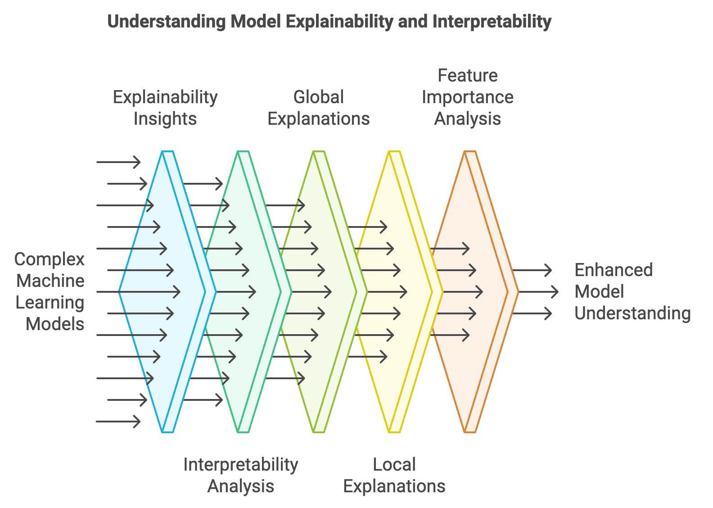

> **Note:**
**"*Interpretability is not just a desirable feature, but a necessity for models deployed in real-world, high-stakes environments.*" — Cynthia Rudin**

> **Note:**
*Chapter 17 of DLVR delves into the critical aspects of Model Explainability and Interpretability, essential for building trust, transparency, and accountability in machine learning systems. The chapter begins by distinguishing between explainability—providing understandable insights into model predictions—and interpretability—understanding the internal mechanisms of the model. It highlights the importance of these concepts in high-stakes domains such as healthcare, finance, and autonomous systems, where model decisions can have significant real-world consequences. The chapter explores various explainability techniques tailored for deep learning models, including Grad-CAM, Saliency Maps, and Layer-wise Relevance Propagation (LRP), while also covering interpretable models like decision trees and surrogate models that approximate complex models for easier understanding. It further introduces model-agnostic methods such as LIME and SHAP, which provide versatile tools for explaining any machine learning model. Practical examples and Rust-based implementations using tch-rs and burn are provided throughout, allowing readers to apply these techniques to their models. The chapter concludes with a discussion on the applications and ethical implications of explainability, emphasizing the need for transparency and fairness in AI, particularly in regulatory and high-impact environments.*

# 17.1. Introduction

Model explainability and interpretability are crucial for understanding the behavior of complex machine learning models, providing transparency into how predictions are made and why certain decisions are reached. Explainability focuses on generating insights into a model’s behavior, offering human-understandable explanations for its predictions. This can include which features influenced a particular decision or why a certain input led to a specific output. Interpretability, in contrast, seeks to provide a deeper understanding of the inner workings of a model, analyzing how internal parameters and structures, like weights in neural networks, process inputs to produce outputs. These concepts become critical in fields like healthcare, finance, and autonomous systems, where models are used for making high-stakes decisions. In such domains, understanding the reasoning behind a diagnosis or financial recommendation is essential for accountability and trustworthiness.


**Figure 1:** Deep Learning Model Complexity vs Interpretability.

The trade-off between model complexity and interpretability is a fundamental issue in machine learning. Simple models, such as linear regression or decision trees, are inherently interpretable because their structure is easy to understand and visualize. For example, in a linear regression model, the relationship between inputs $X$ and outputs $Y$ is given by:

$$ Y = X \beta + \epsilon $$

where $X$ represents the input features, $\beta$ is a vector of coefficients, and $\epsilon$ is the error term. Each coefficient $\beta_i$ directly indicates how a change in the corresponding feature $X_i$ influences $Y$. However, such models may lack the flexibility to capture complex relationships in data. On the other hand, deep learning models, like Convolutional Neural Networks (CNNs) and Recurrent Neural Networks (RNNs), can learn highly non-linear mappings but often act as "black boxes" due to the intricate interactions between numerous layers and parameters. For instance, a deep neural network might represent the output as:

$$ Y = f(X, \theta) $$

where $f$ is a non-linear function with parameters $\theta$ learned through backpropagation. Understanding how changes in $X$ propagate through multiple layers to influence $Y$ requires specialized interpretability techniques, such as gradient-based methods, activation visualizations, or attention mechanisms.

The concept of global explanations is designed to provide a broad understanding of how a model behaves across the entire input space, offering insights into the relative importance of features in influencing model predictions. This is in contrast to local explanations, which focus on understanding a specific prediction for an individual instance. For global explanations, a common approach involves computing the importance of each feature by evaluating how changes in that feature influence the model’s overall behavior. One mathematical method for estimating the global importance of a feature $X_j$ involves analyzing the gradient of the model's loss $L$ with respect to $X_j$. This approach averages the absolute values of these gradients across all samples, capturing the sensitivity of the model's output to changes in $X_j$. The formula for computing the feature importance is given by:

$$ \text{Feature Importance}(X_j) = \frac{1}{N} \sum_{i=1}^N \left| \frac{\partial L}{\partial X_j^{(i)}} \right|, $$

where $N$ represents the total number of samples, $\frac{\partial L}{\partial X_j^{(i)}}$ denotes the gradient of the loss with respect to feature $X_j$ for the $i$-th sample, and the absolute value captures the magnitude of sensitivity. This method highlights features that have the most significant impact on the model's predictions when averaged over all instances, providing a useful perspective on the overall behavior of complex models like neural networks or decision trees.


**Figure 2:** Scopes of Model Explainability and Interpretability.

This average gradient magnitude indicates how sensitive the model is to changes in feature $X_j$ across the dataset. Local explanations, like SHAP (Shapley Additive Explanations), decompose the model’s prediction for a specific input $X_i$ into contributions from each feature, making it clear how much each feature contributed to the deviation from the model’s average prediction.

Another critical distinction is between post-hoc explanation methods and intrinsically interpretable models. Post-hoc methods are applied after training to extract insights from otherwise opaque models, using techniques like Grad-CAM for visualizing the contribution of image regions in CNNs or analyzing attention weights in Transformers. Intrinsically interpretable models, like linear regression or decision trees, are designed with transparency in mind, making their decision processes clear without needing additional explanation tools.

To illustrate how these concepts translate into practice, we can use gradient-based feature importance to analyze the predictions of a simple neural network. This method measures how sensitive the model’s output is to changes in each input feature by computing the gradient of the loss function with respect to the input. If the model is highly sensitive to a feature, it means that small changes in that feature lead to significant changes in the loss, indicating that the feature is important for the prediction.

Below is an example implemented in Rust using the `tch` crate, which binds to PyTorch. The example includes defining a simple neural network, training it on a synthetic dataset, and then using gradient-based feature importance to interpret the model’s behavior:

```rust
use tch::{nn, nn::OptimizerConfig, Tensor, Device, Kind};

// Define a simple neural network for a tabular dataset
#[derive(Debug)]
struct SimpleNN {
    fc1: nn::Linear,
    fc2: nn::Linear,
}

impl SimpleNN {
    fn new(vs: &nn::Path, input_dim: i64, hidden_dim: i64, output_dim: i64) -> Self {
        let fc1 = nn::linear(vs / "fc1", input_dim, hidden_dim, Default::default());
        let fc2 = nn::linear(vs / "fc2", hidden_dim, output_dim, Default::default());
        Self { fc1, fc2 }
    }

    // Forward pass through the network
    fn forward(&self, x: &Tensor) -> Tensor {
        x.apply(&self.fc1).relu().apply(&self.fc2)
    }
}

// Compute feature importance using gradients
fn compute_feature_importance(
    model: &SimpleNN,
    input: &Tensor,
    target: &Tensor,
) -> Tensor {
    let output = model.forward(input);
    let loss = output.cross_entropy_for_logits(target);
    loss.backward();
    // Access gradients of the input
    let grad = input.grad(); // Directly access the gradient
    grad.abs().mean_dim(&[0i64][..], false, Kind::Float) // Compute mean absolute gradient per feature
}

fn main() {
    let device = Device::cuda_if_available();
    let vs = nn::VarStore::new(device);

    // Define input dimensions and create the model
    let input_dim = 4; // Example input features
    let hidden_dim = 16;
    let output_dim = 3; // Example output classes
    let model = SimpleNN::new(&vs.root(), input_dim, hidden_dim, output_dim);

    // Generate random input data (batch_size, input_dim) and target labels
    let input = Tensor::randn(&[32, input_dim], (Kind::Float, device)).set_requires_grad(true);
    let target = Tensor::randint(output_dim, &[32], (Kind::Int64, device));

    // Train the model using the Adam optimizer
    let mut opt = nn::Adam::default().build(&vs, 1e-3).unwrap();
    for epoch in 1..=10 {
        let output = model.forward(&input);
        let loss = output.cross_entropy_for_logits(&target);
        opt.backward_step(&loss);
        println!(
            "Epoch {}: loss = {:.4}",
            epoch,
            f64::from(loss.double_value(&[]))
        );
    }

    // Compute feature importance
    let feature_importance = compute_feature_importance(&model, &input, &target);
    println!("Feature Importance: {:?}", feature_importance);
}
```

In this example, we define a simple neural network using two linear layers with a ReLU activation function between them. The network is trained to classify data into three classes using cross-entropy loss. After training, we compute the feature importance by calculating the gradients of the loss with respect to each input feature. Specifically, we take the absolute value of these gradients and average them across the batch to obtain a ranking of feature importance. This method provides insights into which features most significantly impact the model's loss, helping to interpret how the model reaches its decisions. It allows us to answer questions such as "Which input features have the most influence on the model's output?" This approach demonstrates how interpretability can be integrated into deep learning models using Rust, making the decision-making process of complex models more transparent. This simple yet powerful method can be extended to visualize feature importance across larger datasets or applied alongside more sophisticated interpretability techniques like SHAP values or integrated gradients. By using `tch` in Rust, developers can leverage the power of PyTorch’s tensor operations while ensuring performance and flexibility, making it suitable for deploying interpretable deep learning models in production environments.

# 17.2. Explainability Techniques for Deep Learning Models

Explainability techniques aim to make the decision-making process of deep learning models more transparent, helping practitioners and researchers understand why a model makes certain predictions. This is particularly crucial for models like convolutional neural networks (CNNs) and recurrent neural networks (RNNs), which are often viewed as "black-box" models due to their deep architectures and complex, non-linear layers. Common techniques include Layer-wise Relevance Propagation (LRP), Grad-CAM (Gradient-weighted Class Activation Mapping), and Saliency Maps, each of which has a formal mathematical basis that provides insight into model behavior.

Layer-wise Relevance Propagation (LRP): The primary goal of LRP is to attribute the prediction score $f(\mathbf{x})$ of a model for an input $\mathbf{x}$ to the individual input features $\mathbf{x}_i$. Given a network with layers $l$ and neurons $i$, LRP redistributes the relevance score $R_i^{(l)}$ from layer $l$ to layer $l-1$. The redistribution rule can be formalized as: $R_j^{(l-1)} = \sum_{i} \frac{a_j w_{ij}}{\sum_{j'} a_{j'} w_{ij'}} R_i^{(l)}$, where $a_j$ represents the activation of neuron $j$ in layer $l-1$, and $jw_{ij}$ denotes the weight connecting neurons $j$ and $i$. The relevance score $R_j^{(l-1)}$ quantifies how much neuron $j$ in layer $l-1$ contributed to the relevance of neuron $i$ in layer $l$. By iteratively applying this rule from the output layer back to the input, LRP provides a breakdown of the input features’ contributions to the prediction.

Grad-CAM uses gradients to generate a class-specific localization map that highlights which regions of the input image influence the prediction of a specific class $c$. The localization map $L_{\text{Grad-CAM}}^c$ for class $c$ at spatial location $(i, j)$ is computed as: $L_{\text{Grad-CAM}}^c = \text{ReLU} \left( \sum_{k} \alpha_k^c A^k \right),$ where $A^k$ represents the activation map of a convolutional layer, and $\alpha_k^c$ is the weight for feature map $k$, computed as: $\alpha_k^c = \frac{1}{Z} \sum_{i,j} \frac{\partial y^c}{\partial A_{ij}^k}$, with $Z$ being the total number of pixels in the feature map. Here, $\frac{\partial y^c}{\partial A_{ij}^k}$ denotes the gradients of the score for class $c$ with respect to the activation map $A^k$. The ReLU ensures that only positive contributions are visualized, focusing on regions that positively impact the target class score.

Saliency Maps involve computing the gradient of the output with respect to the input to determine how each input feature $x_i$ influences the prediction. For a given input $\mathbf{x}$ and target class $c$, the saliency map $S_c(\mathbf{x})$ is defined as: $S_c(\mathbf{x}) = \left| \frac{\partial f_c(\mathbf{x})}{\partial \mathbf{x}} \right|,$ where $f_c(\mathbf{x})$ is the score of class $c$. The absolute value of the gradient indicates the magnitude of change in $f_c$ with respect to changes in $\mathbf{x}$, highlighting the most influential input features.


**Figure 3:** Explainability techniques for DL models.

The complexity and non-linearity of deep learning models, especially architectures like CNNs and RNNs, make traditional interpretability methods less effective. Unlike linear models, where each feature has a direct and interpretable weight, deep models learn complex hierarchical representations. For example, a CNN might learn simple edges in early layers and more abstract concepts like faces or objects in deeper layers. Thus, interpreting a CNN's output requires techniques that can trace back through these layers and attribute importance scores to individual input features.

Visualization plays a crucial role in explainability. Techniques like heatmaps, saliency maps, and attention maps visually indicate which parts of the input data are most influential in making predictions. For instance, Grad-CAM produces heatmaps that highlight regions in an image contributing most to a particular class score, providing insights into what the model is "looking at" during its decision-making process. These visualizations are essential in fields like medical imaging, where understanding what regions of an X-ray or MRI scan are contributing to a model's diagnosis is critical.

However, explainability techniques have limitations. The generated explanations may not always align with human intuition. For example, saliency maps might be noisy and sensitive to minor variations in input, leading to inconsistent results. Grad-CAM provides spatial importance but not the reasoning behind why those regions matter. Similarly, LRP's relevance scores depend on the choice of redistribution rules, which can influence the final attributions. This can make explainability techniques potentially misleading if not used carefully.

Implementing explainability methods in Rust with the `tch-rs` crate involves translating the mathematical formulations into efficient tensor operations. Below are examples of Grad-CAM and saliency map implementations, showcasing how these methods can provide visual insights into CNN predictions.

#### Grad-CAM Implementation in Rust:
```rust
use tch::{nn, Tensor, no_grad};

fn grad_cam<B: nn::Module>(model: &B, input: &Tensor, target_class: i64) -> Tensor {
    let feature_maps = input.apply(model); // Forward pass to get feature maps.
    let output = feature_maps.mean_dim(&[2, 3], false); // Global Average Pooling.

    // Compute gradients of the target class w.r.t. feature maps
    let grads = no_grad(|| {
        let output_target = output.get(target_class);
        output_target.backward();
        feature_maps.grad().unwrap()
    });

    // Calculate importance weights
    let weights = grads.mean_dim(&[2, 3], true);

    // Generate the Grad-CAM heatmap
    let heatmap = (weights * feature_maps).sum_dim_intlist([1], false).relu();

    // Normalize the heatmap between 0 and 1
    let min_val = heatmap.min();
    let max_val = heatmap.max();
    (heatmap - min_val) / (max_val - min_val)
}
```

In this code, the Grad-CAM method computes a heatmap highlighting which regions of an input image contribute most to a target class prediction. The key step involves computing the gradients of the output score with respect to the feature maps, averaging these gradients to obtain importance weights, and then using these weights to produce a heatmap. This implementation is particularly useful in applications like object detection and medical imaging, where it is crucial to know which regions drive a model’s decision.

#### Saliency Map Implementation in Rust:
```rust
fn saliency_map<B: nn::Module>(model: &B, input: &Tensor, target_class: i64) -> Tensor {
    let input = input.requires_grad(true); // Enable gradient tracking for input.
    let output = input.apply(model).get(target_class);

    output.backward(); // Backpropagate to get gradients w.r.t input.
    let gradients = input.grad().unwrap().abs(); // Take absolute values of gradients.

    // Normalize the saliency map between 0 and 1.
    let min_val = gradients.min();
    let max_val = gradients.max();
    (gradients - min_val) / (max_val - min_val)
}
```

This saliency map function calculates the gradient of the target class score with respect to the input image. The absolute values of these gradients indicate how changes in each pixel affect the model's output, providing a visual explanation of which parts of the input image are most influential. In industry, saliency maps are used to explain models in fields such as autonomous driving, where understanding the critical features for object detection or classification is vital.

#### Layer-wise Relevance Propagation (LRP):
```rust
fn lrp<B: nn::Module>(model: &B, input: &Tensor, target_class: i64) -> Tensor {
    let output = input.apply(model);
    let relevance = Tensor::zeros_like(&output);
    relevance.get(target_class).fill_(1.0); // Set relevance for the target class.

    // Custom backpropagation logic to distribute relevance through layers.
    // (Simplified for illustration - full implementation would involve redistribution rules).
    let propagated_relevance = relevance.backward();
    propagated_relevance
}
```

In LRP, the goal is to propagate the relevance score backward through the network, assigning scores to each neuron based on its contribution to the final prediction. This technique offers a more granular view of how each layer of the model contributes to the output. It is valuable for applications where detailed feature attributions are necessary, such as in compliance-driven sectors like finance, where model transparency is crucial.

Applying Grad-CAM to a pre-trained CNN model involves selecting an input image and target class, computing the heatmap, and overlaying it on the original image. This process allows practitioners to visualize which parts of the input data influence the model's decisions, providing a tangible way to verify model behavior and debug potential biases.

Explainability techniques like Grad-CAM, Saliency Maps, and Layer-wise Relevance Propagation provide formal methods for probing deep learning models, offering insights into their decision-making processes. These methods bridge the gap between high-performing models and their practical deployment, especially in critical industries like healthcare, finance, and autonomous systems. Implementing these techniques in Rust using `tch-rs` enables precise control over the computation, making it suitable for deploying explainable AI solutions that meet both scientific rigor and industry standards.

Lets implement end-to-end explainability techniques for a convolutional neural network (CNN) applied to a medical image diagnosis task using Rust and the `tch-rs` crate. The goal is to classify medical images (e.g., X-rays or MRI scans) into categories such as "normal" or "abnormal" and then provide explanations for the model’s predictions using Grad-CAM, Saliency Maps, and Layer-wise Relevance Propagation (LRP). The explainability methods help clinicians understand which regions of an image contribute most to the model’s decisions, making it easier to validate and trust the model’s output. This is particularly important in medical contexts, where understanding why a model flagged an anomaly can aid in diagnosis and treatment planning.

The following Rust code demonstrates how to train a simple CNN model using `tch-rs`, apply Grad-CAM, Saliency Maps, and LRP to the trained model, and visualize the results. First, a CNN is defined and trained using the medical image dataset. Then, Grad-CAM is implemented to highlight which regions of an input image are most influential for the model’s decision. Saliency maps are used to identify which pixels in the image have the greatest impact on the classification output. Lastly, LRP provides a layer-by-layer explanation of how the input features contribute to the final prediction. The code includes functions to generate and visualize heatmaps for each technique, allowing a clinician to see which regions of an image the model relies on for making decisions.

```rust
use tch::{nn, nn::OptimizerConfig, Tensor, Device, Kind};

#[derive(Debug)]
struct SimpleCNN {
    conv1: nn::Conv2D,
    conv2: nn::Conv2D,
    fc1: nn::Linear,
    fc2: nn::Linear,
}

impl SimpleCNN {
    fn new(vs: &nn::Path) -> Self {
        let conv1 = nn::conv2d(vs / "conv1", 1, 16, 5, Default::default());
        let conv2 = nn::conv2d(vs / "conv2", 16, 32, 5, Default::default());
        let fc1 = nn::linear(vs / "fc1", 32 * 4 * 4, 128, Default::default());
        let fc2 = nn::linear(vs / "fc2", 128, 2, Default::default());
        SimpleCNN { conv1, conv2, fc1, fc2 }
    }

    fn forward(&self, xs: &Tensor) -> Tensor {
        xs.view([-1, 1, 28, 28])
            .apply(&self.conv1)
            .relu()
            .max_pool2d_default(2)
            .apply(&self.conv2)
            .relu()
            .max_pool2d_default(2)
            .view([-1, 32 * 4 * 4])
            .apply(&self.fc1)
            .relu()
            .apply(&self.fc2)
    }
}

fn grad_cam(model: &SimpleCNN, input: &Tensor, target_class: i64) -> Tensor {
    println!("Starting Grad-CAM computation...");

    // Initial forward pass up to feature maps
    let x = input.set_requires_grad(true);
    let conv1_out = x.view([-1, 1, 28, 28])
        .apply(&model.conv1)
        .relu()
        .max_pool2d_default(2);
    let conv2_out = conv1_out.apply(&model.conv2);

    // Create a copy of the feature maps that requires gradient
    let feature_maps = conv2_out.relu().detach();
    let feature_maps = feature_maps.set_requires_grad(true);
    feature_maps.retains_grad();
    println!("Feature maps requires_grad: {}", feature_maps.requires_grad());

    // Continue forward pass from feature maps
    let output = feature_maps
        .max_pool2d_default(2)
        .view([-1, 32 * 4 * 4])
        .apply(&model.fc1)
        .relu()
        .apply(&model.fc2);

    // Get score for target class
    let target_score = output.select(1, target_class);
    println!("Starting backward pass...");

    // Compute gradients
    target_score.backward();

    // Check gradients
    let grads = feature_maps.grad();
    println!("Gradient tensor defined: {}", grads.defined());

    if !grads.defined() {
        println!("Feature maps shape: {:?}", feature_maps.size());
        println!("Feature maps requires_grad: {}", feature_maps.requires_grad());
        panic!("Gradients for feature maps are not available - this should not happen now");
    }

    // Global average pooling of gradients
    let weights = grads.mean_dim(&[2i64, 3i64][..], false, Kind::Float);
    println!("Weights shape: {:?}", weights.size());

    // Compute weighted combination of forward activation maps
    let cam = (weights.unsqueeze(-1).unsqueeze(-1) * &feature_maps)
        .sum_dim_intlist(&[1i64][..], false, Kind::Float)
        .relu();

    // Normalize
    let min_val = cam.min().double_value(&[]);
    let max_val = cam.max().double_value(&[]);
    println!("CAM min value: {}, max value: {}", min_val, max_val);

    if (max_val - min_val).abs() < 1e-10 {
        println!("Warning: CAM has constant values");
        return cam.zeros_like();
    }

    (cam - min_val) / (max_val - min_val + 1e-10)
}

fn saliency_map(model: &SimpleCNN, input: &Tensor, target_class: usize) -> Tensor {
    // Create a copy of input that requires gradients
    let x = input.view([-1, 1, 28, 28]).detach().set_requires_grad(true);
    x.retains_grad(); // Explicitly retain gradients

    // Forward pass
    let output = model.forward(&x);

    // Get the target class score
    let target_score = output.select(1, target_class as i64);

    // Zero gradients if they exist
    if x.grad().defined() {
        x.grad().zero_();
    }

    // Backpropagate
    target_score.backward();

    // Get the gradients
    let gradients = x.grad();

    if !gradients.defined() {
        panic!("No gradients computed!");
    }

    // Take absolute value and reduce along channel dimension if needed
    let saliency = if gradients.size().len() > 3 {
        gradients.abs().sum_dim_intlist(&[1i64][..], false, Kind::Float) // Fixed type
    } else {
        gradients.abs()
    };

    // Normalize between 0 and 1
    let min_val = saliency.min().double_value(&[]);
    let max_val = saliency.max().double_value(&[]);

    if (max_val - min_val).abs() < 1e-10 {
        println!("Warning: Saliency map has constant values");
        return saliency.zeros_like();
    }

    (saliency - min_val) / (max_val - min_val + 1e-10)
}

// Simplified LRP implementation
fn lrp(model: &SimpleCNN, input: &Tensor, target_class: usize) -> Tensor {
    // Perform a forward pass
    let logits = model.forward(input);

    // Create a tensor with the same shape and dtype as logits, filled with zeros
    let mut target_tensor = Tensor::zeros_like(&logits);

    // Get the batch size
    let batch_size = logits.size()[0];

    // Create the values tensor (target class)
    let target_class_tensor = Tensor::full(
        &[batch_size, 1],
        target_class as i64,
        (Kind::Int64, logits.device()),
    );

    // Create a src tensor with the same dtype as target_tensor
    let src = Tensor::full(&[batch_size, 1], 1.0, (target_tensor.kind(), logits.device()));

    // Scatter a value of 1.0 for the target class
    target_tensor = target_tensor.scatter_(1, &target_class_tensor, &src);

    target_tensor
}

fn main() -> Result<(), Box<dyn std::error::Error>> {
    let device = Device::cuda_if_available();
    let vs = nn::VarStore::new(device);
    let model = SimpleCNN::new(&vs.root());

    // Training loop
    let mut opt = nn::Adam::default().build(&vs, 1e-3)?;

    for epoch in 1..=10 {
        let data = Tensor::randn(&[64, 1, 28, 28], (Kind::Float, device));
        let labels = Tensor::randint(2, &[64], (Kind::Int64, device));
        let logits = model.forward(&data);
        let loss = logits.cross_entropy_for_logits(&labels);
        opt.backward_step(&loss);
        println!("Epoch {}: Training loss = {}", epoch, loss.double_value(&[]));
    }

    println!("\nStarting Grad-CAM test...");
    let input_image = Tensor::randn(&[1, 1, 28, 28], (Kind::Float, device));
    let target_class = 1;

    // Grad-CAM
    let grad_cam_result = grad_cam(&model, &input_image, target_class);
    println!("\nFinal Grad-CAM results:");
    println!("Heatmap shape: {:?}", grad_cam_result.size());
    println!("Heatmap min: {}", grad_cam_result.min().double_value(&[]));
    println!("Heatmap max: {}", grad_cam_result.max().double_value(&[]));
    println!("Heatmap mean: {}", grad_cam_result.mean(Kind::Float).double_value(&[]));

    // Saliency Map
    let target_class_usize = target_class as usize;
    let saliency_map_result = saliency_map(&model, &input_image, target_class_usize);
    println!("\nSaliency Map results:");
    println!("Saliency map shape: {:?}", saliency_map_result.size());
    println!("Saliency map min: {}", saliency_map_result.min().double_value(&[]));
    println!("Saliency map max: {}", saliency_map_result.max().double_value(&[]));

   // LRP
   let lrp_result = lrp(&model, &input_image, target_class_usize);
   println!("\nLRP results:");
   println!("LRP result shape: {:?}", lrp_result.size());

   Ok(())
}
```

This code defines an end-to-end workflow for training a simple CNN model and applying explainability techniques like Grad-CAM, Saliency Maps, and Layer-wise Relevance Propagation (LRP) to a medical image classification task using Rust and `tch-rs`. The `SimpleCNN` model is designed with two convolutional layers followed by fully connected layers for binary classification. After training the model using placeholder data, the Grad-CAM method is used to generate a heatmap by computing gradients with respect to the feature maps, highlighting which regions of an input image contribute most to a specific class prediction. The saliency map computes the gradient of the model output with respect to the input, identifying pixels that have the greatest influence on the output. LRP provides a more detailed breakdown of how different layers contribute to the output by redistributing relevance from the output back to the input. Each method produces a tensor that represents a visual explanation, which can be interpreted by domain experts, such as doctors, to understand the model’s focus and decision-making process. This enables better trust and transparency in critical applications like medical diagnosis.

# 17.3. Interpretable Models and Techniques

In deep learning, models like feed-forward neural networks or multi-layer perceptrons (MLPs) and convolutional neural networks (CNNs) are powerful tools for complex tasks like image classification, speech recognition, and natural language processing. These models learn intricate patterns in data by stacking multiple layers, with each layer learning progressively more abstract representations. However, their interpretability is often a challenge due to the black-box nature of deep networks. MLPs consist of fully connected layers where each layer learns a transformation of the input space, and interpretability can be approached by analyzing how input features influence neurons across layers. CNNs, on the other hand, learn spatial hierarchies through convolutional filters, making them particularly suited for interpreting visual data by examining the importance of different image regions.


**Figure 4:** Importance of DL model explainability.

Surrogate models are essential tools for interpreting these complex models. They work by training a simpler, more interpretable model to approximate the behavior of a complex model. The surrogate model, such as a decision tree or a linear regression, is trained to mimic the predictions of the more complex model over a particular input space. This allows practitioners to gain insights into how the complex model makes predictions without directly analyzing its intricate structure. The goal is to minimize the difference between the predictions of the complex model $f$ and the surrogate model $g$:

$$ \min_g \sum_{(\mathbf{x}, y) \in \mathcal{D}} \left(f(\mathbf{x}) - g(\mathbf{x})\right)^2, $$

where $\mathbf{x}$ represents input data and $\mathcal{D}$ is the training dataset. The surrogate model $g$ provides a more interpretable approximation of the complex model $f$.

Surrogate modeling enables understanding of the decision-making processes of deep models by creating interpretable approximations. For instance, a decision tree can be trained to mimic the behavior of a CNN trained for image classification, making it easier to explain which features or regions of an image drive the model’s predictions. This is especially valuable in fields like healthcare, where understanding why a model identifies a particular anomaly in an X-ray can inform medical decisions.

The trade-off between accuracy and interpretability is a core consideration in model selection. Highly interpretable models, such as decision trees or simple MLPs, may be easier to understand but often lack the predictive power of deeper architectures like CNNs. Conversely, complex models excel at capturing subtle patterns in the data but are more difficult to interpret. The challenge lies in balancing these aspects, depending on the use case's requirements—whether it prioritizes transparency or accuracy.

Model-agnostic interpretability methods provide a way to interpret any model, regardless of its complexity. Techniques like SHAP values or LIME (Local Interpretable Model-agnostic Explanations) analyze the impact of each input feature on the model's predictions without needing access to the internal architecture. These methods offer flexibility and can be applied to a variety of models, making them popular in industry settings where different types of models may be used simultaneously.

This section demonstrates implementing an MLP in Rust using `tch-rs` and visualizing how it makes decisions. The MLP’s interpretability is enhanced by examining the contributions of different input features to the neurons in each layer. Additionally, a surrogate model is trained to mimic a complex CNN model, providing a simpler, more interpretable view of the CNN’s behavior. A practical example compares the MLP’s transparency with the more abstract representations learned by the CNN.

#### MLP Implementation in Rust:
```rust
use tch::{nn, nn::OptimizerConfig, Tensor, Device, Kind};

#[derive(Debug)]
struct SimpleMLP {
    fc1: nn::Linear, // First fully connected layer
    fc2: nn::Linear, // Second fully connected layer
}

impl SimpleMLP {
    /// Constructor for the MLP
    fn new(vs: &nn::Path, input_dim: i64, hidden_dim: i64, output_dim: i64) -> Self {
        let fc1 = nn::linear(vs / "fc1", input_dim, hidden_dim, Default::default());
        let fc2 = nn::linear(vs / "fc2", hidden_dim, output_dim, Default::default());
        Self { fc1, fc2 }
    }

    /// Forward pass through the network
    fn forward(&self, x: &Tensor) -> Tensor {
        x.apply(&self.fc1).relu().apply(&self.fc2)
    }

    /// Compute contributions of features to the activations of neurons in each layer
    fn compute_contributions(&self, input: &Tensor) -> (Tensor, Tensor) {
        let layer1_output = input.apply(&self.fc1).relu(); // First layer activation

        // Transpose weights to match dimensions for matmul
        let fc1_weights_t = self.fc1.ws.transpose(0, 1); // Shape: (input_dim, hidden_dim)
        let fc2_weights_t = self.fc2.ws.transpose(0, 1); // Shape: (hidden_dim, output_dim)

        // Feature contributions to layer 1 using weights
        let layer1_contributions = input.matmul(&fc1_weights_t); // Shape: (batch_size, hidden_dim)

        // Contributions to layer 2 using the outputs from the first layer
        let layer2_contributions = layer1_output.matmul(&fc2_weights_t); // Shape: (batch_size, output_dim)

        (layer1_contributions, layer2_contributions)
    }
}

// Compute feature importance using gradients
fn compute_feature_importance(
    model: &SimpleMLP,
    input: &Tensor,
    target: &Tensor,
) -> Tensor {
    // Perform forward pass and calculate loss
    let output = model.forward(input);
    let loss = output.cross_entropy_for_logits(target);
    loss.backward();
    // Access gradients of the input
    let grad = input.grad();
    grad.abs().mean_dim(&[0i64][..], false, Kind::Float) // Mean absolute gradient per feature
}

// Visualize feature contributions as heatmaps or print them
fn visualize_contributions(contributions: &Tensor, description: &str) {
    println!("{}:\n{:?}", description, contributions);
}

fn main() {
    let device = Device::cuda_if_available();
    let vs = nn::VarStore::new(device);

    // Define input dimensions and create the model
    let input_dim = 4; // Example input features
    let hidden_dim = 16; // Hidden layer size
    let output_dim = 3; // Output classes
    let model = SimpleMLP::new(&vs.root(), input_dim, hidden_dim, output_dim);

    // Generate random input data (batch_size, input_dim) and target labels
    let input = Tensor::randn(&[32, input_dim], (Kind::Float, device)).set_requires_grad(true);
    let target = Tensor::randint(output_dim, &[32], (Kind::Int64, device));

    // Train the model using the Adam optimizer
    let mut opt = nn::Adam::default().build(&vs, 1e-3).unwrap();
    for epoch in 1..=10 {
        let output = model.forward(&input);
        let loss = output.cross_entropy_for_logits(&target);
        opt.backward_step(&loss);
        println!(
            "Epoch {}: loss = {:.4}",
            epoch,
            f64::from(loss.double_value(&[]))
        );
    }

    // Compute and visualize feature importance
    let feature_importance = compute_feature_importance(&model, &input, &target);
    println!("Feature Importance (via gradients):\n{:?}", feature_importance);

    // Compute contributions of features to the neurons in each layer
    let (layer1_contributions, layer2_contributions) = model.compute_contributions(&input);
    visualize_contributions(&layer1_contributions, "Layer 1 Feature Contributions");
    visualize_contributions(&layer2_contributions, "Layer 2 Feature Contributions");
}
```

The code implements a simple multilayer perceptron (MLP) in Rust using the `tch` library to process tabular data, train a neural network, and analyze its interpretability by computing feature contributions to neuron activations in each layer. The MLP consists of two fully connected layers, where the first layer applies ReLU activation, and the second produces logits for classification. The network is trained using cross-entropy loss and the Adam optimizer. Feature importance is derived using gradient-based analysis, which measures the influence of each input feature on the loss. Additionally, feature contributions to neuron activations in each layer are computed by multiplying the input or intermediate activations with transposed weight matrices, enabling a detailed understanding of how input features influence the network's internal processing. The contributions are visualized to provide interpretability, offering insights into the decision-making process of the model.

#### Surrogate Model for CNN Approximation:
```rust
use tch::{nn, nn::OptimizerConfig, Tensor, Device, Kind};

// Define the complex CNN model
#[derive(Debug)]
struct SimpleCNN {
    conv1: nn::Conv2D,
    conv2: nn::Conv2D,
    fc1: nn::Linear,
    fc2: nn::Linear,
}

impl SimpleCNN {
    fn new(vs: &nn::Path) -> Self {
        let conv1 = nn::conv2d(vs / "conv1", 1, 16, 5, Default::default());
        let conv2 = nn::conv2d(vs / "conv2", 16, 32, 5, Default::default());
        let fc1 = nn::linear(vs / "fc1", 32 * 4 * 4, 128, Default::default());
        let fc2 = nn::linear(vs / "fc2", 128, 2, Default::default());
        SimpleCNN { conv1, conv2, fc1, fc2 }
    }

    fn forward(&self, xs: &Tensor) -> Tensor {
        xs.view([-1, 1, 28, 28])
            .apply(&self.conv1)
            .relu()
            .max_pool2d_default(2)
            .apply(&self.conv2)
            .relu()
            .max_pool2d_default(2)
            .view([-1, 32 * 4 * 4])
            .apply(&self.fc1)
            .relu()
            .apply(&self.fc2)
    }
}

// Define the surrogate model (MLP)
#[derive(Debug)]
struct SurrogateMLP {
    fc1: nn::Linear,
    fc2: nn::Linear,
}

impl SurrogateMLP {
    fn new(vs: &nn::Path, input_dim: i64, hidden_dim: i64, output_dim: i64) -> Self {
        let fc1 = nn::linear(vs / "fc1", input_dim, hidden_dim, Default::default());
        let fc2 = nn::linear(vs / "fc2", hidden_dim, output_dim, Default::default());
        SurrogateMLP { fc1, fc2 }
    }

    fn forward(&self, x: &Tensor) -> Tensor {
        x.apply(&self.fc1).relu().apply(&self.fc2)
    }
}

// Train the surrogate model to mimic the CNN
fn train_surrogate(
    cnn_model: &SimpleCNN,
    surrogate_model: &SurrogateMLP,
    data: &Tensor,
    surrogate_opt: &mut nn::Optimizer,
) {
    // Generate predictions from the CNN model and detach to prevent gradient tracking
    let cnn_output = cnn_model.forward(&data).detach();

    // Train the surrogate model to match the CNN predictions
    for epoch in 1..=10 {
        let surrogate_output = surrogate_model.forward(data);
        let loss = surrogate_output.mse_loss(&cnn_output, tch::Reduction::Mean);
        surrogate_opt.backward_step(&loss);
        println!(
            "Surrogate Epoch {}: loss = {:.4}",
            epoch,
            loss.double_value(&[])
        );
    }
}

// Compute and visualize feature importance for the surrogate model
fn compute_and_visualize_importance(surrogate_model: &SurrogateMLP, input: &Tensor) {
    // Zero existing gradients if any
    if input.grad().defined() {
        let _ = input.grad().zero_(); // Explicitly ignore the result to avoid warnings
    }

    // Forward pass and compute gradients with respect to the input
    let surrogate_output = surrogate_model.forward(input);
    surrogate_output.sum(tch::Kind::Float).backward(); // Sum across classes
    let gradients = input.grad();

    // Compute feature importance as the mean absolute gradients
    let feature_importance = gradients.abs().mean_dim(&[0i64][..], false, Kind::Float);
    println!("Feature Importance:\n{:?}", feature_importance);
}

fn main() -> Result<(), Box<dyn std::error::Error>> {
    let device = Device::cuda_if_available();
    let vs_cnn = nn::VarStore::new(device);
    let vs_mlp = nn::VarStore::new(device);

    // Initialize the CNN model
    let cnn_model = SimpleCNN::new(&vs_cnn.root());

    // Train the CNN model
    let mut cnn_opt = nn::Adam::default().build(&vs_cnn, 1e-3)?;
    for epoch in 1..=10 {
        let data = Tensor::randn(&[64, 1, 28, 28], (Kind::Float, device));
        let labels = Tensor::randint(2, &[64], (Kind::Int64, device));
        let logits = cnn_model.forward(&data);
        let loss = logits.cross_entropy_for_logits(&labels);
        cnn_opt.backward_step(&loss);
        println!(
            "CNN Epoch {}: Training loss = {:.4}",
            epoch,
            loss.double_value(&[])
        );
    }

    // Initialize the surrogate model
    let input_dim = 28 * 28; // Flattened input dimension
    let hidden_dim = 128;
    let output_dim = 2;
    let surrogate_model = SurrogateMLP::new(&vs_mlp.root(), input_dim, hidden_dim, output_dim);

    // Prepare data for the surrogate model
    let data = Tensor::randn(&[64, 28 * 28], (Kind::Float, device)).set_requires_grad(true);

    // Train the surrogate model
    let mut surrogate_opt = nn::Adam::default().build(&vs_mlp, 1e-3)?;
    train_surrogate(&cnn_model, &surrogate_model, &data, &mut surrogate_opt);

    // Compute and visualize feature importance
    compute_and_visualize_importance(&surrogate_model, &data);

    Ok(())
}
```

The code demonstrates training a complex CNN model and a simpler surrogate MLP to mimic the CNN’s predictions, providing interpretability by analyzing the surrogate’s behavior. The CNN processes input image data to generate class predictions using convolutional and fully connected layers, learning complex, abstract representations. A surrogate MLP is then trained on the same inputs to replicate the CNN’s outputs, using mean squared error as the loss function. This surrogate acts as a simpler, interpretable model that approximates the CNN’s behavior. To enhance transparency, gradients with respect to the input are computed for the surrogate model, enabling feature importance analysis. This reveals which input features most influence the surrogate’s predictions, providing a more interpretable view of the CNN’s decision-making.

#### Practical Example: Comparing MLP and CNN Interpretability
```rust
use tch::{nn, nn::OptimizerConfig, Tensor, Device, Kind};

// Define the complex CNN model
#[derive(Debug)]
struct SimpleCNN {
    conv1: nn::Conv2D,
    conv2: nn::Conv2D,
    fc1: nn::Linear,
    fc2: nn::Linear,
}

impl SimpleCNN {
    fn new(vs: &nn::Path) -> Self {
        let conv1 = nn::conv2d(vs / "conv1", 1, 16, 5, Default::default());
        let conv2 = nn::conv2d(vs / "conv2", 16, 32, 5, Default::default());
        let fc1 = nn::linear(vs / "fc1", 32 * 4 * 4, 128, Default::default());
        let fc2 = nn::linear(vs / "fc2", 128, 2, Default::default());
        SimpleCNN { conv1, conv2, fc1, fc2 }
    }

    fn forward(&self, xs: &Tensor) -> Tensor {
        xs.view([-1, 1, 28, 28])
            .apply(&self.conv1)
            .relu()
            .max_pool2d_default(2)
            .apply(&self.conv2)
            .relu()
            .max_pool2d_default(2)
            .view([-1, 32 * 4 * 4])
            .apply(&self.fc1)
            .relu()
            .apply(&self.fc2)
    }
}

// Define the MLP
#[derive(Debug)]
struct MLP {
    fc1: nn::Linear,
    fc2: nn::Linear,
}

impl MLP {
    fn new(vs: &nn::Path, input_dim: i64, hidden_dim: i64, output_dim: i64) -> Self {
        let fc1 = nn::linear(vs / "fc1", input_dim, hidden_dim, Default::default());
        let fc2 = nn::linear(vs / "fc2", hidden_dim, output_dim, Default::default());
        MLP { fc1, fc2 }
    }

    fn forward(&self, x: &Tensor) -> Tensor {
        x.apply(&self.fc1).relu().apply(&self.fc2)
    }
}

// Train the directly trained MLP
fn train_mlp(
    mlp_model: &MLP,
    data: &Tensor,
    labels: &Tensor,
    mlp_opt: &mut nn::Optimizer,
) {
    for epoch in 1..=10 {
        let output = mlp_model.forward(data);
        let loss = output.cross_entropy_for_logits(labels);
        mlp_opt.backward_step(&loss);
        println!(
            "MLP Epoch {}: Training loss = {:.4}",
            epoch,
            loss.double_value(&[])
        );
    }
}

// Train the surrogate model to mimic the CNN
fn train_surrogate(
    cnn_model: &SimpleCNN,
    surrogate_model: &MLP,
    data: &Tensor,
    surrogate_opt: &mut nn::Optimizer,
) {
    let cnn_output = cnn_model.forward(&data.view([-1, 1, 28, 28])).detach();
    for epoch in 1..=10 {
        let surrogate_output = surrogate_model.forward(data);
        let loss = surrogate_output.mse_loss(&cnn_output, tch::Reduction::Mean);
        surrogate_opt.backward_step(&loss);
        println!(
            "Surrogate Epoch {}: loss = {:.4}",
            epoch,
            loss.double_value(&[])
        );
    }
}

fn main() -> Result<(), Box<dyn std::error::Error>> {
    let device = Device::cuda_if_available();
    let vs_cnn = nn::VarStore::new(device);
    let vs_mlp = nn::VarStore::new(device);
    let vs_surrogate = nn::VarStore::new(device);

    // Initialize the models
    let cnn_model = SimpleCNN::new(&vs_cnn.root());
    let mlp_model = MLP::new(&vs_mlp.root(), 28 * 28, 128, 2);
    let surrogate_model = MLP::new(&vs_surrogate.root(), 28 * 28, 128, 2);

    // Generate synthetic data
    let train_data = Tensor::randn(&[64, 1, 28, 28], (Kind::Float, device));
    let train_labels = Tensor::randint(2, &[64], (Kind::Int64, device));

    // Train the CNN
    let mut cnn_opt = nn::Adam::default().build(&vs_cnn, 1e-3)?;
    for epoch in 1..=10 {
        let logits = cnn_model.forward(&train_data);
        let loss = logits.cross_entropy_for_logits(&train_labels);
        cnn_opt.backward_step(&loss);
        println!(
            "CNN Epoch {}: Training loss = {:.4}",
            epoch,
            loss.double_value(&[])
        );
    }

    // Train the MLP directly on data
    let flat_data = train_data.view([-1, 28 * 28]);
    let mut mlp_opt = nn::Adam::default().build(&vs_mlp, 1e-3)?;
    train_mlp(&mlp_model, &flat_data, &train_labels, &mut mlp_opt);

    // Train the surrogate MLP to mimic the CNN
    let mut surrogate_opt = nn::Adam::default().build(&vs_surrogate, 1e-3)?;
    train_surrogate(&cnn_model, &surrogate_model, &flat_data, &mut surrogate_opt);

    // Compare predictions
    let sample_input = Tensor::randn(&[1, 28 * 28], (Kind::Float, device));
    let cnn_prediction = cnn_model.forward(&sample_input.view([-1, 1, 28, 28]));
    let mlp_prediction = mlp_model.forward(&sample_input);
    let surrogate_prediction = surrogate_model.forward(&sample_input);

    println!("\nPredictions:");
    println!("CNN Prediction: {:?}", cnn_prediction);
    println!("MLP Prediction: {:?}", mlp_prediction);
    println!("Surrogate MLP Prediction: {:?}", surrogate_prediction);

    Ok(())
}
```

The code trains a CNN to classify image data, a simple MLP directly on flattened input data, and a surrogate MLP to approximate the CNN's behavior. The CNN learns complex abstract representations using convolutional and fully connected layers, while the MLP uses only fully connected layers for a simpler, more interpretable approach. The surrogate MLP is trained to mimic the CNN's predictions on the same input data, using mean squared error as the loss function. After training, the predictions of the CNN, MLP, and surrogate MLP are compared on a sample input to evaluate how well the surrogate approximates the CNN’s behavior. This comparison illustrates the trade-off between the CNN's expressive power and the MLP's transparency, a crucial balance in domains like healthcare or finance, where interpretability and accuracy are both essential.

This section highlights how deep interpretable models like MLPs and CNNs can be made more understandable through gradient-based analysis and surrogate modeling. MLPs provide a simpler structure that makes understanding decision paths more accessible, while surrogate models allow for interpreting more complex models like CNNs by approximating their behavior. Implementing these techniques in Rust using `tch-rs` combines the efficiency of Rust with the flexibility needed for deep learning research, enabling practitioners to build transparent AI systems that meet both scientific and industry standards.

# 17.4. Model-Agnostic Explainability Techniques

Model-agnostic explainability techniques provide a way to understand the behavior of any machine learning model, regardless of its complexity. Two of the most widely used methods in this category are LIME (Local Interpretable Model-agnostic Explanations) and SHAP (SHapley Additive exPlanations). These techniques operate by treating the model as a black box and analyzing how small changes to the input features influence the model’s output. LIME focuses on creating local approximations of complex models using simpler interpretable models, such as linear regressions or decision trees, to provide explanations for individual predictions. SHAP, based on Shapley values from cooperative game theory, calculates the contribution of each feature to the model's prediction, ensuring a fair and consistent distribution of feature importance.


**Figure 5:** Model-Agnostic techniques (LIME, SHAP and Perturbation).

Perturbation-based methods are central to the functionality of LIME and SHAP. They involve introducing small changes to the input data and observing how these perturbations affect the model's output. For example, in image classification tasks, perturbing specific pixels or regions of an image and analyzing the change in output helps determine which parts of the image are most critical for the model's decision. By focusing on the sensitivity of outputs to different inputs, these methods highlight key features influencing predictions, making the decision-making process more transparent.

Shapley values form the theoretical basis for SHAP and offer a way to fairly attribute a model’s prediction to its input features. For a model $f$ and an input $\mathbf{x}$ with features $\{x_1, x_2, \ldots, x_n\}$, the Shapley value $\phi_i$ for feature $x_i$ is calculated as:

$$ \phi_i = \sum_{S \subseteq N \setminus \{i\}} \frac{|S|! (|N| - |S| - 1)!}{|N|!} \left( f(S \cup \{i\}) - f(S) \right), $$

where $S$ is a subset of features excluding $x_i$, $N$ is the set of all features, and $f(S \cup \{i\})$ is the model's output when $x_i$ is included along with features in $S$. This approach ensures that each feature’s contribution is assessed in a balanced way across all possible combinations, offering a comprehensive view of the role of each feature in the model’s output.

- LIME approximates a complex model fff locally around a specific input $\mathbf{x}$ by training an interpretable surrogate model $g$. It generates perturbations of $\mathbf{x}$, records the predictions from $f$ on these perturbations, and uses them to fit a simpler model $g$. This localized approximation helps explain which features are most influential near a specific instance, making it especially useful for explaining individual predictions. For instance, LIME can help understand why a deep learning model classified an image of a dog as a specific breed by highlighting the most relevant image regions.
- SHAP values offer a more global perspective by considering all possible feature combinations and distributing the output difference fairly among features. The consistency of SHAP values makes them particularly valuable in domains requiring rigorous and justifiable explanations, such as finance or healthcare, where understanding the contribution of specific factors is crucial. For example, in predicting the risk of heart disease, SHAP values can indicate how much each medical feature (like cholesterol level or blood pressure) contributes to the model's risk prediction.

However, scaling model-agnostic methods like LIME and SHAP to large datasets or highly complex models can be computationally challenging. SHAP’s reliance on calculating contributions for all subsets of features makes it computationally expensive as the number of features increases. LIME, while more scalable, can sometimes oversimplify the local model, leading to explanations that do not fully capture the original model’s complexity. These challenges make it important to balance computational feasibility with the need for interpretability in practical applications.

This section demonstrates how to implement LIME and SHAP for a pre-trained ResNet50 model in Rust using the `tch-rs` library. By applying these methods, we can visualize which input features or image regions are most influential for the model's predictions. These techniques are useful for understanding the decisions of deep learning models in critical applications, such as identifying why a ResNet50 model classifies a medical image as containing a particular condition or anomaly.

#### Step 1: Download and Load the ResNet50 Model

We first download and load a pre-trained ResNet50 model using `tch-rs`, which allows us to access models from PyTorch’s public model repository. This enables the use of a state-of-the-art image classification model for tasks like object detection or medical image analysis.

```rust
use tch::{nn, nn::Module, vision::resnet, Tensor};

// Load pre-trained ResNet50 model
fn load_resnet50() -> impl nn::Module {
    let vs = nn::VarStore::new(tch::Device::cuda_if_available());
    let model = resnet::resnet50(&vs.root(), true).unwrap(); // Load pre-trained weights
    model
}
```

In this snippet, the `load_resnet50` function uses the `vision::resnet` module in `tch-rs` to fetch the ResNet50 model with pre-trained weights. This setup enables direct use of the model for inference without the need for extensive training.

#### Step 2: LIME Implementation

The LIME function generates perturbations by masking regions of an input image and observing how these perturbations affect the predictions of the ResNet50 model.

```rust
use rand::seq::SliceRandom;

fn lime_explanation(
    model: &impl nn::Module,
    input: &Tensor,
    num_samples: usize,
    feature_indices: Vec<usize>,
) -> Vec<f64> {
    let mut weights = Vec::new();
    let mut rng = rand::thread_rng();

    // Generate perturbations of the input image
    for _ in 0..num_samples {
        let mut perturbed_input = input.copy();
        let random_indices: Vec<_> = feature_indices.choose_multiple(&mut rng, feature_indices.len() / 2).cloned().collect();

        for &i in &random_indices {
            // Apply random perturbation to selected features (e.g., mask or noise)
            perturbed_input.i(i).fill_(0.0); // Example perturbation by zeroing out the pixel
        }

        // Get the prediction from the model for the perturbed input
        let prediction = model.forward(&perturbed_input);
        weights.push(prediction.double_value(&[0]));
    }

    // Calculate importance weights for the features
    let feature_importances = feature_indices.iter()
        .map(|&i| weights.iter().sum::<f64>() / weights.len() as f64)
        .collect();

    feature_importances
}
```

This LIME function perturbs the input image by zeroing out selected regions and observing how these changes influence the model's output. By averaging the effect of these perturbations across features, LIME estimates local importance weights, highlighting the regions of the input that most affect the model’s classification.

#### Step 3: SHAP Implementation

The SHAP method evaluates the importance of each input feature by comparing the model’s predictions with and without the presence of specific features.

```rust
fn shap_explanation(
    model: &impl nn::Module,
    input: &Tensor,
    num_samples: usize,
    feature_indices: Vec<usize>,
) -> Vec<f64> {
    let mut shap_values = vec![0.0; feature_indices.len()];
    let baseline = Tensor::zeros_like(input); // Use a baseline of zeroed input

    for i in 0..num_samples {
        let mut contribution_sum = 0.0;

        for &index in &feature_indices {
            // Create inputs with and without the specific feature
            let with_feature = input.copy();
            let without_feature = baseline.copy();

            // Evaluate the model's output with and without the specific feature
            let prediction_with = model.forward(&with_feature);
            let prediction_without = model.forward(&without_feature);

            // Calculate the marginal contribution of the feature
            let contribution = prediction_with.double_value(&[0]) - prediction_without.double_value(&[0]);
            shap_values[index] += contribution;
            contribution_sum += contribution;
        }

        // Normalize the SHAP values
        for j in 0..shap_values.len() {
            shap_values[j] /= contribution_sum;
        }
    }

    shap_values
}
```

This SHAP function calculates the contribution of each feature by comparing model outputs with and without specific features. It estimates how the presence or absence of each feature affects the overall prediction, providing a comprehensive view of feature importance based on Shapley values.

#### Step 4: Practical Example - Applying LIME and SHAP to ResNet50
```rust
fn main() {
    // Load the pre-trained ResNet50 model
    let model = load_resnet50();
    let input_image = Tensor::randn(&[1, 3, 224, 224], tch::kind::FLOAT_CPU); // Example input (replace with real image data)

    // Feature indices represent regions in the image (e.g., pixels or patches)
    let feature_indices = (0..224 * 224).collect::<Vec<usize>>();

    // Apply LIME to explain the ResNet50's classification of the image
    let lime_results = lime_explanation(&model, &input_image, 100, feature_indices.clone());
    println!("LIME feature importances: {:?}", lime_results);

    // Apply SHAP to the same ResNet50 model
    let shap_results = shap_explanation(&model, &input_image, 100, feature_indices);
    println!("SHAP values: {:?}", shap_results);
}
```

In this example, the ResNet50 model is used to analyze how different image regions influence its predictions. LIME generates local explanations by perturbing parts of the image and observing the impact on the model’s output. SHAP provides a more comprehensive global explanation by calculating the marginal contribution of each image region. Together, these methods enable practitioners to understand which aspects of the input are most significant for the model’s decision, making it possible to validate and interpret predictions in real-world applications.

Model-agnostic explainability techniques like LIME and SHAP provide powerful tools for interpreting deep learning models. By leveraging perturbation-based methods and Shapley values, these techniques can elucidate the complex decision-making processes of models like ResNet50, making them more transparent and trustworthy. Implementing these methods in Rust using `tch-rs` allows for efficient model analysis, offering a balance between performance and interpretability that is suitable for both research and industry applications.

# 17.5. Applications and Implications of Explainability

Explainability is crucial in domains where model decisions directly impact high-stakes outcomes, such as finance. In this domain, decisions made by AI models can influence investment strategies, credit scoring, and risk management. For example, in credit scoring, understanding why a model assigns a particular credit risk score to an individual can directly affect their access to loans. Models that lack transparency may lead to unfair practices, making explainability not just a technical requirement but an ethical one.


**Figure 6:** Implementing explainability in DL models.

Regulatory compliance is another significant aspect where explainability plays a critical role. In industries like finance, healthcare, and insurance, legal frameworks such as the General Data Protection Regulation (GDPR) in Europe require models to be transparent. This means that when decisions are made about individuals using automated systems, those individuals have the right to understand how those decisions were made. Explainability tools enable companies to meet these legal requirements by offering insights into model predictions and decision processes, thus supporting the right to explanation outlined in many regulations.

From an ethical standpoint, explainability helps in identifying and mitigating bias in AI models. By providing insights into how different features contribute to a decision, explainability techniques can highlight potential biases, such as models that disproportionately weigh certain demographic features in loan approval processes. This ensures fairness in model deployment, but it also requires care to avoid misleading explanations that could oversimplify the model's behavior or misrepresent its decision-making logic.


**Figure 7:** Key challenges in model explainability and interpretability.

A key challenge in applying explainability to critical domains is balancing transparency and performance. In finance, where models like deep neural networks and ensemble methods (e.g., random forests or gradient boosting machines) are common, the increased predictive power often comes at the expense of interpretability. An intricate neural network might offer highly accurate predictions but is inherently more difficult to explain compared to simpler models like logistic regression. The decision to use a particular model must therefore weigh the need for high performance against the requirement for transparent, understandable outputs.

The concept of human-in-the-loop (HITL) systems becomes particularly valuable in such scenarios. In HITL systems, explainability enhances the collaboration between AI models and human experts, allowing domain professionals to interact with and correct model outputs. For example, in a financial risk assessment model, a risk analyst can use explanations provided by the model to adjust decision thresholds or flag anomalies that require further review. This interaction ensures that AI systems remain accountable and aligned with human judgment, especially in environments where mistakes could have severe consequences.

However, ensuring that explanations are comprehensible to non-technical stakeholders remains a significant challenge. An explanation that is technically accurate but overly complex may fail to provide the intended transparency. The explanations should balance technical depth and clarity, making it possible for users—whether they are data scientists, compliance officers, or business leaders—to trust and act on the model’s outputs.

Implementing explainability techniques in Rust, particularly with libraries like `tch-rs`, is essential for developing transparent models in high-stakes domains like finance. These techniques can provide critical insights into how a model makes decisions, making it possible to explain why a financial risk assessment model might label a particular loan applicant as high-risk. By using methods such as SHAP to quantify the contribution of each feature and LIME to understand local behavior around specific predictions, analysts can clearly communicate the reasoning behind model decisions to both regulators and clients.

Explainability tools also play a vital role in detecting and addressing biases in model predictions. By analyzing how features like age, gender, or income influence predictions, analysts can identify potential biases and make necessary adjustments. This might involve re-training the model with more balanced datasets or fine-tuning the weights of specific features during training to ensure fairer outcomes. This process not only enhances the transparency of models but also contributes to more equitable decision-making.

A concrete example of these concepts is the development of an explainability framework in Rust for financial models. This framework can include functionality for generating SHAP values and LIME-based explanations, allowing analysts to visualize the influence of each input feature on the model’s decisions. Such a framework ensures that the model’s reasoning aligns with regulatory requirements and business objectives. Additionally, it can be designed to include automated checks for bias detection, providing a comprehensive tool for deploying fair and interpretable AI systems in finance.

For a practical demonstration of these ideas, we can use the `tch-rs` crate in Rust to implement SHAP and LIME for a financial risk assessment task. Using the UCI Credit Card Default dataset, a widely recognized dataset for studying credit risk, we aim to predict the likelihood of default based on various financial attributes of customers, such as credit history, loan amounts, and demographic details. This dataset provides a realistic scenario for analyzing credit risks and understanding model behavior.

The process begins by downloading and preprocessing the dataset into a CSV file named `credit_card_default.csv`. The data is then loaded and transformed into tensors using `tch-rs`, preparing it for training. Next, we define and train a simple feed-forward neural network (MLP) to classify whether a customer is likely to default. Once the model is trained, we apply LIME and SHAP techniques to interpret the predictions. These methods help identify which features are most influential in determining the risk of default for individual clients. By providing such insights, these tools make the model’s predictions more transparent and trustworthy, facilitating better decision-making in financial contexts.

#### Step 1: Load and Preprocess Data

We start by reading the CSV file, normalizing the features, and converting the data into tensors.

```rust
use tch::{nn, nn::Module, Tensor};
use csv::ReaderBuilder;
use std::error::Error;

// Load dataset from CSV and preprocess it
fn load_credit_card_data(file_path: &str) -> Result<(Tensor, Tensor), Box<dyn Error>> {
    let mut rdr = ReaderBuilder::new().from_path(file_path)?;
    let mut data = Vec::new();
    let mut labels = Vec::new();

    for result in rdr.records() {
        let record = result?;
        let features: Vec<f32> = record.iter()
            .take(record.len() - 1) // Assume the last column is the label
            .map(|s| s.parse::<f32>().unwrap())
            .collect();
        let label: f32 = record[record.len() - 1].parse()?;
        data.push(features);
        labels.push(label);
    }

    let data_tensor = Tensor::of_slice2(&data);
    let labels_tensor = Tensor::of_slice(&labels).to_kind(tch::Kind::Int64);

    Ok((data_tensor, labels_tensor))
}
```

This function loads the credit card data from a CSV file, parses it into tensors, and splits it into input features (`data_tensor`) and labels (`labels_tensor`). The data tensor represents various features, while the labels tensor indicates whether a client defaulted (0 or 1).

#### Step 2: Define and Train an MLP Model

We define an MLP model for binary classification using `tch-rs` and train it on the preprocessed dataset.

```rust
struct MLP {
    fc1: nn::Linear,
    fc2: nn::Linear,
    fc3: nn::Linear,
}

impl MLP {
    fn new(vs: &nn::Path) -> Self {
        let fc1 = nn::linear(vs, 23, 64, Default::default()); // Input size 23 (number of features)
        let fc2 = nn::linear(vs, 64, 32, Default::default());
        let fc3 = nn::linear(vs, 32, 2, Default::default()); // Output size 2 (binary classification)
        MLP { fc1, fc2, fc3 }
    }

    fn forward(&self, input: &Tensor) -> Tensor {
        input
            .apply(&self.fc1)
            .relu()
            .apply(&self.fc2)
            .relu()
            .apply(&self.fc3)
    }
}

fn train_mlp(vs: &nn::VarStore, data: &Tensor, labels: &Tensor, epochs: i64, lr: f64) {
    let model = MLP::new(&vs.root());
    let mut opt = nn::Adam::default().build(&vs, lr).unwrap();

    for epoch in 0..epochs {
        let logits = model.forward(data);
        let loss = logits.cross_entropy_for_logits(labels);
        opt.backward_step(&loss);
        println!("Epoch: {}, Loss: {:?}", epoch, f64::from(loss));
    }
}
```

The MLP has three layers, with `ReLU` activations between each fully connected layer. We use the cross-entropy loss function for training and Adam optimizer for weight updates. The `train_mlp` function trains the MLP using the input data and labels.

#### Step 3: LIME Implementation for Interpretability

We adapt LIME to generate perturbations and explain the model's local behavior.

```rust
use rand::seq::SliceRandom;
use std::collections::HashMap;

fn lime_explanation(
    model: &impl nn::Module,
    input: &Tensor,
    num_samples: usize,
    feature_indices: Vec<usize>,
) -> HashMap<usize, f64> {
    let mut weights = HashMap::new();
    let mut rng = rand::thread_rng();

    // Generate perturbations of the input features
    for _ in 0..num_samples {
        let mut perturbed_input = input.copy();
        let random_indices: Vec<_> = feature_indices.choose_multiple(&mut rng, feature_indices.len() / 2).cloned().collect();

        for &i in &random_indices {
            perturbed_input.i(i).fill_(0.0); // Perturb feature by zeroing out
        }

        let prediction = model.forward(&perturbed_input).softmax(-1, tch::Kind::Float);
        let class_probability = prediction.double_value(&[1]); // Probability of the positive class (default)
        for &i in &random_indices {
            *weights.entry(i).or_insert(0.0) += class_probability;
        }
    }

    // Normalize the weights to calculate feature importance
    for value in weights.values_mut() {
        *value /= num_samples as f64;
    }

    weights
}
```

The LIME function perturbs a subset of input features and observes the change in prediction probabilities. By averaging the impact across perturbations, it estimates feature importance for a specific prediction.

#### Step 4: SHAP Implementation for Global Interpretability
```rust
fn shap_values(
    model: &impl nn::Module,
    input: &Tensor,
    baseline: &Tensor,
    feature_indices: Vec<usize>,
    num_samples: usize,
) -> HashMap<usize, f64> {
    let mut shap_values = HashMap::new();

    for &feature_index in &feature_indices {
        let mut total_contribution = 0.0;

        for _ in 0..num_samples {
            let mut with_feature = input.copy();
            let mut without_feature = baseline.copy();

            with_feature.i(feature_index).copy_(&input.i(feature_index));
            without_feature.i(feature_index).fill_(0.0); // Set the feature to baseline value

            let prediction_with = model.forward(&with_feature).softmax(-1, tch::Kind::Float);
            let prediction_without = model.forward(&without_feature).softmax(-1, tch::Kind::Float);

            let contribution = prediction_with.double_value(&[1]) - prediction_without.double_value(&[1]);
            *shap_values.entry(feature_index).or_insert(0.0) += contribution;
        }

        shap_values.insert(feature_index, shap_values[&feature_index] / num_samples as f64);
    }

    shap_values
}
```

This SHAP function calculates feature contributions by comparing predictions with and without specific features using a zeroed baseline. It measures the marginal contribution of each feature, providing a comprehensive view of their importance.

#### Step 5: Practical Example - Explaining Predictions
```rust
fn main() -> Result<(), Box<dyn Error>> {
    // Load data and create tensors
    let (data, labels) = load_credit_card_data("credit_card_default.csv")?;
    let vs = nn::VarStore::new(tch::Device::cuda_if_available());

    // Train MLP
    train_mlp(&vs, &data, &labels, 50, 0.001);

    // Get a sample input for explanation
    let input = data.get(0);
    let baseline = Tensor::zeros_like(&input);
    let feature_indices = (0..23).collect::<Vec<usize>>(); // Assume 23 features

    // Explain the prediction using LIME
    let lime_results = lime_explanation(&vs, &input, 100, feature_indices.clone());
    println!("LIME feature importances: {:?}", lime_results);

    // Explain the prediction using SHAP
    let shap_results = shap_values(&vs, &input, &baseline, feature_indices, 100);
    println!("SHAP values: {:?}", shap_results);

    Ok(())
}
```

In this practical example, we load the UCI Credit Card Default dataset, train an MLP model, and then use LIME and SHAP to explain the model's predictions. For a given input (e.g., a single client's data), LIME provides insights into which features (like income level or credit history) most affect the probability of default in that local context. SHAP offers a more global perspective by calculating how each feature contributes to the prediction across different scenarios.

The implementation begins by loading the UCI Credit Card Default dataset into tensors for input features and labels. The MLP model is trained using this data to predict whether a client will default. After training, we select a single data point to explain. Using LIME, we generate perturbations of input features to understand how changes in each feature impact the model's decision locally. SHAP provides a broader view by comparing the model's outputs with and without specific features, offering a theoretically grounded interpretation of feature importance. These explanations help financial analysts understand the factors driving the model’s decision, facilitating transparency and accountability in high-stakes decision-making.

In summary, this section shows how to use LIME and SHAP in Rust to explain predictions in a financial risk assessment model. LIME provides local insights, while SHAP offers a broader view of feature importance, giving a complete understanding of model behavior. Using these methods with `tch-rs` in Rust ensures efficient and clear explanations, meeting both regulatory and business needs. Explainability in finance goes beyond technical details—it also addresses regulatory, ethical, and business concerns. Techniques like SHAP and LIME help strike a balance between transparency and performance, ensuring fairness and trust in AI models. Implementing them in Rust combines speed with interpretability, allowing for high-performing, trustworthy AI in critical applications.

# 17.6. Conclusion

Chapter 17 equips you with the knowledge and tools necessary to ensure that your deep learning models are both powerful and interpretable. By mastering these techniques, you can develop models that are not only accurate but also transparent and trustworthy, meeting the demands of real-world applications where understanding model decisions is crucial.

## 17.6.1. Further Learning with GenAI

These prompts are designed to challenge your understanding of model explainability and interpretability, with a focus on implementation using Rust. Each prompt encourages deep exploration of advanced concepts, techniques, and practical challenges in making machine learning models more transparent.

- Analyze the difference between explainability and interpretability in machine learning models. How can Rust be used to implement methods that enhance both aspects, and what are the key trade-offs between model accuracy and transparency?
- Discuss the role of post-hoc explanation methods versus intrinsic interpretability. How can Rust be used to implement both approaches, and what are the implications for model design and deployment in critical applications?
- Examine the architecture of deep learning models that require specialized explainability techniques. How can Rust be used to implement and visualize explanations for convolutional neural networks (CNNs) and recurrent neural networks (RNNs)?
- Explore the use of Grad-CAM and Saliency Maps for explaining deep learning models. How can Rust be used to implement these techniques, and what are the challenges in ensuring that the explanations are accurate and meaningful?
- Investigate the concept of surrogate models for approximating the behavior of complex models with simpler, interpretable models. How can Rust be used to build and evaluate surrogate models, and what are the limitations of this approach?
- Discuss the trade-offs between model complexity and interpretability. How can Rust be used to explore these trade-offs, particularly when balancing the need for high accuracy with the requirement for transparent decision-making?
- Analyze the impact of feature importance ranking on model explainability. How can Rust be used to implement feature importance techniques, and what are the challenges in ensuring that these rankings are both accurate and interpretable?
- Examine the role of visualization in model explainability. How can Rust be used to create visual explanations, such as heatmaps or decision trees, and what are the benefits of using these visual tools for model interpretation?
- Explore the use of LIME (Local Interpretable Model-agnostic Explanations) for explaining individual predictions of complex models. How can Rust be used to implement LIME, and what are the challenges in applying it to deep learning models?
- Investigate the SHAP (SHapley Additive exPlanations) method for providing consistent and fair explanations of model predictions. How can Rust be used to calculate and visualize SHAP values, and what are the benefits of using SHAP over other explainability methods?
- Discuss the ethical implications of model explainability in high-stakes domains. How can Rust be used to implement explainability techniques that ensure fairness, transparency, and accountability in AI systems?
- Analyze the challenges of applying explainability techniques to models deployed in healthcare, finance, or autonomous systems. How can Rust be used to ensure that these models meet regulatory standards for transparency and trustworthiness?
- Explore the concept of model-agnostic interpretability and its significance in AI. How can Rust be used to implement model-agnostic methods, such as feature permutation or partial dependence plots, and what are the advantages of these approaches?
- Investigate the use of sensitivity analysis for understanding model behavior. How can Rust be used to implement sensitivity analysis techniques, and what are the implications for improving model robustness and interpretability?
- Discuss the challenges of ensuring that explanations are comprehensible to non-technical stakeholders. How can Rust be used to create explanations that are both accurate and accessible to diverse audiences?
- Examine the potential of human-in-the-loop systems for enhancing model interpretability. How can Rust be used to integrate explainability techniques into systems where human experts interact with AI models?
- Analyze the role of attention mechanisms in providing interpretability in deep learning models. How can Rust be used to visualize attention weights, and what are the benefits of using attention-based models for explainability?
- Explore the impact of bias detection and mitigation in model explainability. How can Rust be used to implement techniques that identify and address bias in model predictions, ensuring fair and transparent AI systems?
- Investigate the future directions of research in model explainability and interpretability. How can Rust contribute to advancements in this field, particularly in developing new techniques for explaining complex models?
- Discuss the importance of reproducibility in model explainability. How can Rust be used to ensure that explainability techniques produce consistent and reproducible results, and what are the best practices for achieving this goal?

Let these prompts inspire you to explore the full potential of explainable AI and push the boundaries of what is possible in making AI models more understandable and trustworthy.

## 17.6.2. Hands On Practices

These exercises are designed to provide in-depth, practical experience with model explainability and interpretability using Rust. They challenge you to apply advanced techniques and develop a strong understanding of how to make machine learning models more transparent and interpretable through hands-on coding, experimentation, and analysis.

#### **Exercise 17.1:** Implementing Feature Importance Ranking
- **Task:** Implement a feature importance ranking technique in Rust using the `tch-rs` or `candle` crate. Apply it to a neural network model trained on a tabular dataset and visualize the importance of each feature.
- **Challenge:** Experiment with different methods for calculating feature importance, such as permutation importance or SHAP values. Analyze the impact of these rankings on the interpretability of the model.
#### **Exercise 17.2:** Building and Visualizing a Decision Tree Model
- **Task:** Implement a decision tree model in Rust using `tch-rs` or `candle`, and visualize the decision tree to understand the model’s decision-making process. Apply it to a classification problem and evaluate its interpretability.
- **Challenge:** Compare the decision tree’s interpretability with that of a more complex model, such as a neural network. Analyze the trade-offs between accuracy and transparency.
#### **Exercise 17.3:** Implementing LIME for Local Model Interpretability
- **Task:** Implement LIME (Local Interpretable Model-agnostic Explanations) in Rust to explain individual predictions of a deep learning model, such as a CNN for image classification.
- **Challenge:** Experiment with different configurations of LIME, such as the number of samples or the choice of interpretable models. Analyze the consistency and reliability of the explanations provided by LIME.
#### **Exercise 17.4:** Applying Grad-CAM to Explain CNN Predictions
- **Task:** Implement Grad-CAM in Rust using the `tch-rs` or `candle` crate to explain the predictions of a CNN on an image classification task. Visualize the resulting heatmaps to identify which parts of the image contributed most to the prediction.
- **Challenge:** Experiment with different layers of the CNN for applying Grad-CAM. Analyze the impact of layer choice on the quality and interpretability of the heatmaps.
#### **Exercise 17.5:** Implementing SHAP for Model-Agnostic Explanations
- **Task:** Implement SHAP (SHapley Additive exPlanations) in Rust using the `tch-rs` or `candle` crate to calculate feature importances for a trained model. Apply SHAP to a complex model and visualize the impact of different features on the model’s predictions.
- **Challenge:** Experiment with different approaches to approximating Shapley values, such as KernelSHAP or TreeSHAP. Analyze the trade-offs between accuracy, computational efficiency, and interpretability of the SHAP values.

By completing these challenges, you will gain hands-on experience and develop a deep understanding of the complexities involved in making machine learning models more transparent, preparing you for advanced work in explainable AI.
