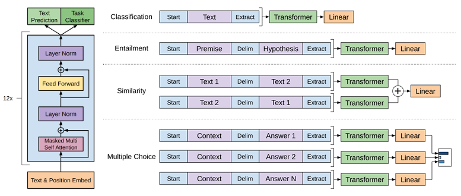

> **Note:**
**"*Language is the fabric of our thoughts, and large language models are the loom upon which we can weave the future of human-computer interaction.*" — Yoshua Bengio**

> **Note:**
*Chapter 20 of DLVR delves into the intricacies of building and deploying Large Language Models (LLMs) using Rust, focusing on their pivotal role in natural language processing tasks such as translation, summarization, and text generation. The chapter begins by exploring the architecture of LLMs, emphasizing transformers, self-attention mechanisms, and the critical steps of pre-training and fine-tuning. It highlights the significance of Rust’s performance, concurrency, and memory management in handling the complexities of LLMs. The chapter then covers key strategies for training LLMs on large datasets, addressing challenges like distributed training and optimization techniques. It also provides insights into the inference and deployment of LLMs, discussing model optimization techniques and deployment strategies across various environments. Finally, advanced topics such as transfer learning, zero-shot learning, and the ethical considerations of deploying LLMs are explored, offering readers a comprehensive understanding of building and scaling LLMs using Rust.*

# 20.1. Introduction to Large Language Models (LLMs)

Large Language Models (LLMs) have revolutionized natural language processing (NLP) by significantly improving the ability of machines to understand and generate human language. LLMs, such as GPT (Generative Pre-trained Transformer) and BERT (Bidirectional Encoder Representations from Transformers), have transformed tasks like machine translation, summarization, question answering, and text generation by learning to represent the intricacies of language in powerful and flexible ways.


**Figure 1:** Evolutionary tree of Large Language Models.

The key strength of LLMs lies in their ability to pre-train on vast amounts of unlabeled text data, enabling them to capture deep patterns in language structure. These pre-trained models can then be fine-tuned on specific tasks with relatively smaller datasets, making LLMs versatile tools for various applications like chatbots, virtual assistants, and automated content generation. LLMs can be scaled to billions of parameters, allowing them to generate coherent, contextually relevant text across a wide range of inputs.

Rust plays an essential role in building and deploying LLMs due to its high-performance capabilities, efficient memory management, and safe concurrency model. Rust’s ability to provide low-level control over system resources makes it a powerful choice for training and serving large-scale models, where performance and resource efficiency are critical. Moreover, Rust's ownership and borrowing system ensures that LLM implementations can handle large datasets and memory-intensive operations without encountering memory leaks or unsafe data access.

The core architecture of most LLMs is based on the transformer model, which has become the de facto standard in NLP due to its ability to model long-range dependencies in text more efficiently than previous models like RNNs (Recurrent Neural Networks). The transformer leverages self-attention mechanisms, which allow the model to focus on different parts of the input sequence at each layer. The self-attention mechanism computes attention scores between tokens in the input sequence to decide how much importance each token should have in relation to others:

$$ \text{Attention}(Q, K, V) = \text{softmax}\left(\frac{QK^T}{\sqrt{d_k}}\right) V $$

Where:

- $Q$ is the query matrix derived from the input,
- $K$ is the key matrix,
- $V$ is the value matrix,
- $d_k$ is the dimensionality of the keys.

The transformer architecture consists of stacked layers of self-attention and feedforward neural networks, which are trained to encode and generate textual data in a way that captures the relationships between words (or tokens) over long contexts.

To process text data efficiently, LLMs use tokenization strategies such as Byte-Pair Encoding (BPE) or WordPiece to break down sentences into smaller, more manageable units called tokens. These tokenization methods are designed to balance vocabulary size and computational efficiency. For example, BPE iteratively merges the most frequent pairs of characters or subwords, creating a compact vocabulary that can represent a wide variety of text with fewer tokens.

The size, depth, and number of parameters of an LLM have a direct impact on its performance and capabilities. Larger models with more layers and parameters are able to learn more complex patterns, but they also require more computational resources for training and inference. Parameter tuning and architectural decisions, such as the number of attention heads and hidden units, play a crucial role in determining the effectiveness of the LLM for specific tasks.

LLMs represent one of the most advanced and heavily researched areas of NLP. Transformers, the core architecture behind LLMs, have transformed the field by addressing limitations in handling long-range dependencies and scaling to massive datasets. Research continues to focus on improving the efficiency of LLMs, reducing their computational demands while maintaining their performance, as well as enhancing their interpretability and addressing ethical concerns such as bias in language generation.

In industry, LLMs power many of the most popular applications in AI today, including virtual assistants (e.g., Siri, Google Assistant), text generation platforms, and automated customer support systems. Companies like OpenAI, Google, and Microsoft are at the forefront of scaling LLMs to unprecedented sizes, such as OpenAI’s GPT-3, which has 175 billion parameters. Rust’s role in this landscape is to provide the tools for building high-performance, scalable AI models that can efficiently handle large datasets and complex computations in production environments.

Lets learn more practically from code. The following Rust program showcases the use of prompt techniques with the `langchain-rust` library to optimize responses from OpenAI’s language models. Prompt engineering involves carefully designing input prompts to steer the model’s response style, tone, and structure. The program demonstrates various techniques, such as defining clear roles, controlling response length, incorporating conversation history, and applying few-shot learning examples. These methods enhance the model’s output by making it more accurate, contextually relevant, and aligned with specific user requirements, demonstrating the effectiveness of prompt engineering in fine-tuning generative model interactions.

```toml
[dependencies]
langchain-rust = "4.6.0"
serde_json = "1.0.132"
tokio = "1.41.0"
```
```rust
use langchain_rust::{
    chain::{Chain, LLMChainBuilder},
    fmt_message, fmt_placeholder, fmt_template,
    language_models::llm::LLM,
    llm::openai::{OpenAI, OpenAIModel},
    message_formatter,
    prompt::HumanMessagePromptTemplate,
    prompt_args,
    schemas::messages::Message,
    template_fstring,
};

#[tokio::main]
async fn main() {
    // Initialize the OpenAI model:
    let open_ai = OpenAI::default().with_model(OpenAIModel::Gpt4oMini.to_string());

    // Basic Prompt - Asking a simple question
    let basic_response = open_ai.invoke("What is rust").await.unwrap();
    println!("Basic Response: {}", basic_response);

    // **1. Role Specification** - Specifying a Role with System Message
    let role_prompt = message_formatter![
        fmt_message!(Message::new_system_message(
            "You are a world-class technical documentation writer with a deep knowledge of Rust programming."
        )),
        fmt_template!(HumanMessagePromptTemplate::new(template_fstring!(
            "{input}", "input"
        )))
    ];

    let role_chain = LLMChainBuilder::new()
        .prompt(role_prompt)
        .llm(open_ai.clone())
        .build()
        .unwrap();

    match role_chain
        .invoke(prompt_args! {
        "input" => "Explain Rust in simple terms.",
           })
        .await
    {
        Ok(result) => {
            println!("Role-Specified Response: {:?}", result);
        }
        Err(e) => panic!("Error invoking role_chain: {:?}", e),
    }

    // **2. Response Formatting and Contextual Guidance**
    let format_prompt = message_formatter![
        fmt_message!(Message::new_system_message(
            "You are a concise, professional technical writer. Answer in three bullet points."
        )),
        fmt_template!(HumanMessagePromptTemplate::new(template_fstring!(
            "{input}", "input"
        )))
    ];

    let format_chain = LLMChainBuilder::new()
        .prompt(format_prompt)
        .llm(open_ai.clone())
        .build()
        .unwrap();

    match format_chain
        .invoke(prompt_args! {
        "input" => "What are the key benefits of Rust?",
           })
        .await
    {
        Ok(result) => {
            println!("Formatted Response: {:?}", result);
        }
        Err(e) => panic!("Error invoking format_chain: {:?}", e),
    }

    // **3. Few-Shot Learning Examples** - Providing Examples to Guide the Response
    let few_shot_prompt = message_formatter![
        fmt_message!(Message::new_system_message(
            "You are an expert programmer. Answer in a friendly, concise tone."
        )),
        fmt_template!(HumanMessagePromptTemplate::new(template_fstring!(
            "{input}", "input"
        ))),
        fmt_message!(Message::new_human_message("Explain the difference between Rust and C++.")),
        fmt_message!(Message::new_ai_message("Rust focuses on memory safety without a garbage collector, whereas C++ provides more control but with greater risk of memory errors.")),
    ];

    let few_shot_chain = LLMChainBuilder::new()
        .prompt(few_shot_prompt)
        .llm(open_ai.clone())
        .build()
        .unwrap();

    match few_shot_chain
        .invoke(prompt_args! {
        "input" => "What makes Rust different from Python?",
           })
        .await
    {
        Ok(result) => {
            println!("Few-Shot Response: {:?}", result);
        }
        Err(e) => panic!("Error invoking few_shot_chain: {:?}", e),
    }

    // **4. Historical Context** - Adding Conversation History
    let history_prompt = message_formatter![
        fmt_message!(Message::new_system_message(
            "You are a helpful assistant that remembers context."
        )),
        fmt_placeholder!("history"),
        fmt_template!(HumanMessagePromptTemplate::new(template_fstring!(
            "{input}", "input"
        ))),
    ];

    let history_chain = LLMChainBuilder::new()
        .prompt(history_prompt)
        .llm(open_ai.clone())
        .build()
        .unwrap();

    match history_chain
        .invoke(prompt_args! {
        "input" => "Who is the writer of 20,000 Leagues Under the Sea?",
        "history" => vec![
                Message::new_human_message("My name is Luis."),
                Message::new_ai_message("Hi Luis, nice to meet you!"),
                Message::new_human_message("Can you also tell me who wrote 'Around the World in 80 Days'?"),
                Message::new_ai_message("That would be Jules Verne, the famous French author."),
                ],
        })
        .await
    {
        Ok(result) => {
            println!("History-Based Response: {:?}", result);
        }
        Err(e) => panic!("Error invoking history_chain: {:?}", e),
    }

    // **5. Instructional Prompt for Output Length** - Limiting Response Length
    let length_prompt = message_formatter![
        fmt_message!(Message::new_system_message(
            "You are a Rust expert. Provide a response that is no more than three sentences."
        )),
        fmt_template!(HumanMessagePromptTemplate::new(template_fstring!(
            "{input}", "input"
        )))
    ];

    let length_chain = LLMChainBuilder::new()
        .prompt(length_prompt)
        .llm(open_ai.clone())
        .build()
        .unwrap();

    match length_chain
        .invoke(prompt_args! {
        "input" => "What is Rust and why is it popular?",
           })
        .await
    {
        Ok(result) => {
            println!("Length-Limited Response: {:?}", result);
        }
        Err(e) => panic!("Error invoking length_chain: {:?}", e),
    }

    // **6. Contextual Prompts with Additional Hints** - Providing Specific Hints
    let contextual_prompt = message_formatter![
        fmt_message!(Message::new_system_message(
            "You are a knowledgeable assistant. Answer the following question with a focus on security and performance."
        )),
        fmt_template!(HumanMessagePromptTemplate::new(template_fstring!(
            "{input}", "input"
        )))
    ];

    let contextual_chain = LLMChainBuilder::new()
        .prompt(contextual_prompt)
        .llm(open_ai)
        .build()
        .unwrap();

    match contextual_chain
        .invoke(prompt_args! {
        "input" => "Why do developers choose Rust over other languages?",
           })
        .await
    {
        Ok(result) => {
            println!("Contextual Response: {:?}", result);
        }
        Err(e) => panic!("Error invoking contextual_chain: {:?}", e),
    }
}
```

The code begins by initializing an instance of OpenAI’s language model and then defines multiple prompt templates, each incorporating a different prompt engineering technique. Each template is structured with specific instructions for the model, such as assigning a technical writer’s role, formatting responses as concise bullet points, and using prior conversation history to provide context for more personalized interactions. These templates are then combined into `LLMChain`s, which allow the model to be invoked with a prompt tailored to each technique. For example, the `history_chain` includes conversation history in the prompt to create contextually aware responses, while the `few_shot_chain` includes sample questions and answers to encourage consistency in style and relevance. By systematically applying these techniques, the code demonstrates how to steer the model’s behavior to produce responses that better match specific goals and communication needs.

By leveraging Rust’s performance, memory safety, and concurrency features, developers can build robust, high-performance LLM systems that can meet the demands of both research and production-scale deployments. In conclusion, Large Language Models (LLMs) are at the heart of modern NLP applications. By implementing LLMs in Rust, developers can build scalable, efficient models for real-world NLP tasks while taking advantage of Rust’s strengths in performance, concurrency, and memory management. As LLMs continue to evolve, Rust offers a powerful foundation for developing the next generation of AI-powered language models.

# 20.2. Architectures of Large Language Models

Large Language Models (LLMs) rely on the transformer architecture, which is a highly effective neural network design for natural language processing (NLP) tasks. Popular LLM architectures such as GPT (Generative Pre-trained Transformer), BERT (Bidirectional Encoder Representations from Transformers), and T5 (Text-To-Text Transfer Transformer) have set new standards in NLP by leveraging transformers to handle large amounts of text data and complex language tasks. These models are based on the core idea of self-attention mechanisms, which allow the model to capture long-range dependencies between words or tokens in a sequence, making them more efficient than previous architectures like RNNs or LSTMs.


**Figure 2:** Illustration of GPT model architecture.

The self-attention mechanism is the heart of transformer models and operates by computing a weighted combination of all words in a sequence. The mechanism uses queries (Q), keys (K), and values (V) to compare the relationship between different tokens. The attention weights are computed as:

$$ \text{Attention}(Q, K, V) = \text{softmax}\left(\frac{QK^T}{\sqrt{d_k}}\right)V $$

Where $d_k$ is the dimensionality of the key vectors, and the softmax function normalizes the attention scores. This operation allows each word to attend to every other word in the sequence, enabling the model to understand contextual relationships, regardless of distance between tokens.

While traditional transformers like GPT, BERT, and T5 have been highly successful, advanced architectures such as Transformer-XL and Reformer have emerged to address the memory and computation constraints of traditional transformers. Transformer-XL introduces a mechanism for segment-level recurrence, allowing it to capture dependencies across longer sequences without truncating the input. Reformer, on the other hand, reduces memory usage and computational cost by replacing standard attention mechanisms with locally sensitive hashing (LSH), making it more efficient for large-scale models.

LLM architectures can be classified into three primary categories:

- Encoder-only models, like BERT, are designed for tasks that require a deep understanding of the input text (e.g., classification, named entity recognition). These models capture bidirectional context, meaning they attend to both past and future tokens in the sequence.
- Decoder-only models, like GPT, are designed for generative tasks such as text completion or text generation. They process tokens in a unidirectional manner, attending only to past tokens.
- Encoder-decoder models, like T5, combine both encoder and decoder architectures. The encoder processes the input sequence, and the decoder generates an output sequence, making them suitable for tasks such as machine translation and summarization.

A critical element of transformer models is positional encoding, which encodes information about the position of tokens in a sequence since transformers are not inherently sequential like RNNs. Positional encodings are added to the input embeddings and help the model understand the order of tokens. The most common method is to use sinusoidal functions, where the positional encoding for a token at position pospospos is defined as:

$$ PE_{(pos, 2i)} = \sin\left(\frac{pos}{10000^{\frac{2i}{d}}}\right) $$

$$ PE_{(pos, 2i+1)} = \cos\left(\frac{pos}{10000^{\frac{2i}{d}}}\right) $$

Here, $d$ is the dimensionality of the embedding, and $i$ is the dimension index. These encodings are added to the word embeddings to provide a notion of position in the input sequence.

Attention heads and layers are another crucial aspect of transformer architectures. The number of attention heads determines how the model can focus on different parts of the input sequence simultaneously. Multiple heads in multi-head attention allow the model to capture diverse contextual relationships between tokens. The depth (number of layers) and number of attention heads are critical for determining the expressiveness of the model, though deeper and wider models also require more computational resources.

To provide practical example, the following Rust program implements a GPT-like text generation model using the `tch-rs` crate, which provides Rust bindings to PyTorch. The model, similar to Andrej Karpathy’s `minGPT`, is trained on the `tinyshakespeare` dataset. This dataset, available as a simple text file, allows the model to learn how to predict the next character based on previous characters, ultimately enabling it to generate coherent text sequences. The code includes both training and inference (prediction) functionalities, making it a complete example of an autoregressive language model in Rust.

```toml
[dependencies]
anyhow = "1.0.90"
tch = "0.12.0"
```
```rust
/* This example uses the tinyshakespeare dataset which can be downloaded at:
   https://raw.githubusercontent.com/karpathy/char-rnn/master/data/tinyshakespeare/input.txt

   This is mostly a rust port of https://github.com/karpathy/minGPT
*/

use anyhow::{bail, Result};
use tch::data::TextData;
use tch::nn::{ModuleT, OptimizerConfig};
use tch::{nn, Device, IndexOp, Kind, Tensor};

const LEARNING_RATE: f64 = 0.0003;
const BLOCK_SIZE: i64 = 128;
const BATCH_SIZE: i64 = 64;
const EPOCHS: i64 = 100;
const SAMPLING_LEN: i64 = 4096;

#[derive(Debug, Copy, Clone)]
struct Config {
    vocab_size: i64,
    n_embd: i64,
    n_head: i64,
    n_layer: i64,
    block_size: i64,
    attn_pdrop: f64,
    resid_pdrop: f64,
    embd_pdrop: f64,
}

// Weight decay only applies to the weight matrixes in the linear layers
const NO_WEIGHT_DECAY_GROUP: usize = 0;
const WEIGHT_DECAY_GROUP: usize = 1;

// Custom linear layer so that different groups can be used for weight
// and biases.
#[derive(Debug)]
struct Linear {
    pub ws: Tensor,
    pub bs: Tensor,
}

impl nn::Module for Linear {
    fn forward(&self, xs: &Tensor) -> Tensor {
        xs.matmul(&self.ws.tr()) + &self.bs
    }
}

fn linear(vs: nn::Path, in_dim: i64, out_dim: i64) -> Linear {
    let wd = vs.set_group(WEIGHT_DECAY_GROUP);
    let no_wd = vs.set_group(NO_WEIGHT_DECAY_GROUP);
    Linear {
        ws: wd.randn("weight", &[out_dim, in_dim], 0.0, 0.02),
        bs: no_wd.zeros("bias", &[out_dim]),
    }
}

fn linear_no_bias(vs: nn::Path, in_dim: i64, out_dim: i64) -> Linear {
    let wd = vs.set_group(WEIGHT_DECAY_GROUP);
    let no_wd = vs.set_group(NO_WEIGHT_DECAY_GROUP);
    Linear {
        ws: wd.randn("weight", &[out_dim, in_dim], 0.0, 0.02),
        bs: no_wd.zeros_no_train("bias", &[out_dim]),
    }
}

fn causal_self_attention(p: &nn::Path, cfg: Config) -> impl ModuleT {
    let key = linear(p / "key", cfg.n_embd, cfg.n_embd);
    let query = linear(p / "query", cfg.n_embd, cfg.n_embd);
    let value = linear(p / "value", cfg.n_embd, cfg.n_embd);
    let proj = linear(p / "proj", cfg.n_embd, cfg.n_embd);
    let mask_init =
        Tensor::ones([cfg.block_size, cfg.block_size], (Kind::Float, p.device())).tril(0);
    let mask_init = mask_init.view([1, 1, cfg.block_size, cfg.block_size]);
    // let mask = p.var_copy("mask", &mask_init);
    let mask = mask_init;
    nn::func_t(move |xs, train| {
        let (sz_b, sz_t, sz_c) = xs.size3().unwrap();
        let sizes = [sz_b, sz_t, cfg.n_head, sz_c / cfg.n_head];
        let k = xs.apply(&key).view(sizes).transpose(1, 2);
        let q = xs.apply(&query).view(sizes).transpose(1, 2);
        let v = xs.apply(&value).view(sizes).transpose(1, 2);
        let att = q.matmul(&k.transpose(-2, -1)) * (1.0 / f64::sqrt(sizes[3] as f64));
        let att = att.masked_fill(&mask.i((.., .., ..sz_t, ..sz_t)).eq(0.), f64::NEG_INFINITY);
        let att = att.softmax(-1, Kind::Float).dropout(cfg.attn_pdrop, train);
        let ys = att.matmul(&v).transpose(1, 2).contiguous().view([sz_b, sz_t, sz_c]);
        ys.apply(&proj).dropout(cfg.resid_pdrop, train)
    })
}

fn block(p: &nn::Path, cfg: Config) -> impl ModuleT {
    let ln1 = nn::layer_norm(p / "ln1", vec![cfg.n_embd], Default::default());
    let ln2 = nn::layer_norm(p / "ln2", vec![cfg.n_embd], Default::default());
    let attn = causal_self_attention(p, cfg);
    let lin1 = linear(p / "lin1", cfg.n_embd, 4 * cfg.n_embd);
    let lin2 = linear(p / "lin2", 4 * cfg.n_embd, cfg.n_embd);
    nn::func_t(move |xs, train| {
        let xs = xs + xs.apply(&ln1).apply_t(&attn, train);
        let ys =
            xs.apply(&ln2).apply(&lin1).gelu("none").apply(&lin2).dropout(cfg.resid_pdrop, train);
        xs + ys
    })
}

fn gpt(p: nn::Path, cfg: Config) -> impl ModuleT {
    let p = &p.set_group(NO_WEIGHT_DECAY_GROUP);
    let tok_emb = nn::embedding(p / "tok_emb", cfg.vocab_size, cfg.n_embd, Default::default());
    let pos_emb = p.zeros("pos_emb", &[1, cfg.block_size, cfg.n_embd]);
    let ln_f = nn::layer_norm(p / "ln_f", vec![cfg.n_embd], Default::default());
    let head = linear_no_bias(p / "head", cfg.n_embd, cfg.vocab_size);
    let mut blocks = nn::seq_t();
    for block_idx in 0..cfg.n_layer {
        blocks = blocks.add(block(&(p / block_idx), cfg));
    }
    nn::func_t(move |xs, train| {
        let (_sz_b, sz_t) = xs.size2().unwrap();
        let tok_emb = xs.apply(&tok_emb);
        let pos_emb = pos_emb.i((.., ..sz_t, ..));
        (tok_emb + pos_emb)
            .dropout(cfg.embd_pdrop, train)
            .apply_t(&blocks, train)
            .apply(&ln_f)
            .apply(&head)
    })
}

/// Generates some sample string using the GPT model.
fn sample(data: &TextData, gpt: &impl ModuleT, input: Tensor) -> String {
    let mut input = input;
    let mut result = String::new();
    for _index in 0..SAMPLING_LEN {
        let logits = input.apply_t(gpt, false).i((0, -1, ..));
        let sampled_y = logits.softmax(-1, Kind::Float).multinomial(1, true);
        let last_label = i64::try_from(&sampled_y).unwrap();
        result.push(data.label_to_char(last_label));
        input = Tensor::cat(&[input, sampled_y.view([1, 1])], 1).narrow(1, 1, BLOCK_SIZE);
    }
    result
}

pub fn main() -> Result<()> {
    let device = Device::cuda_if_available();
    let mut vs = nn::VarStore::new(device);
    let data = TextData::new("data/input.txt")?;
    let labels = data.labels();
    println!("Dataset loaded, {labels} labels.");
    let cfg = Config {
        vocab_size: labels,
        n_embd: 512,
        n_head: 8,
        n_layer: 8,
        block_size: BLOCK_SIZE,
        attn_pdrop: 0.1,
        resid_pdrop: 0.1,
        embd_pdrop: 0.1,
    };
    let gpt = gpt(vs.root() / "gpt", cfg);
    let args: Vec<_> = std::env::args().collect();
    if args.len() < 2 {
        bail!("usage: main (train|predict weights.ot seqstart)")
    }
    match args[1].as_str() {
        "train" => {
            let mut opt = nn::AdamW::default().build(&vs, LEARNING_RATE)?;
            opt.set_weight_decay_group(NO_WEIGHT_DECAY_GROUP, 0.0);
            opt.set_weight_decay_group(WEIGHT_DECAY_GROUP, 0.1);
            let mut idx = 0;
            for epoch in 1..(1 + EPOCHS) {
                let mut sum_loss = 0.;
                let mut cnt_loss = 0.;
                for batch in data.iter_shuffle(BLOCK_SIZE + 1, BATCH_SIZE) {
                    let xs = batch.narrow(1, 0, BLOCK_SIZE).to_kind(Kind::Int64).to_device(device);
                    let ys = batch.narrow(1, 1, BLOCK_SIZE).to_kind(Kind::Int64).to_device(device);
                    let logits = xs.apply_t(&gpt, true);
                    let loss = logits
                        .view([BATCH_SIZE * BLOCK_SIZE, labels])
                        .cross_entropy_for_logits(&ys.view([BATCH_SIZE * BLOCK_SIZE]));
                    opt.backward_step_clip(&loss, 0.5);
                    sum_loss += f64::try_from(loss)?;
                    cnt_loss += 1.0;
                    idx += 1;
                    if idx % 10000 == 0 {
                        println!("Epoch: {}   loss: {:5.3}", epoch, sum_loss / cnt_loss);
                        let input = Tensor::zeros([1, BLOCK_SIZE], (Kind::Int64, device));
                        println!("Sample: {}", sample(&data, &gpt, input));
                        if let Err(err) = vs.save(format!("gpt{idx}.ot")) {
                            println!("error while saving {err}");
                        }
                        sum_loss = 0.;
                        cnt_loss = 0.;
                    }
                }
            }
        }
        "predict" => {
            vs.load(args[2].as_str())?;
            let seqstart = args[3].as_str();
            let input = Tensor::zeros([1, BLOCK_SIZE], (Kind::Int64, device));
            for (idx, c) in seqstart.chars().rev().enumerate() {
                let idx = idx as i64;
                if idx >= BLOCK_SIZE {
                    break;
                }
                let _filled =
                    input.i((0, BLOCK_SIZE - 1 - idx)).fill_(data.char_to_label(c)? as i64);
            }
            println!("Sample: {}", sample(&data, &gpt, input));
        }
        _ => bail!("usage: main (train|predict weights.ot seqstart)"),
    };

    Ok(())
}
```

The code defines a generative model architecture with configurable hyperparameters such as vocabulary size, embedding size, and number of attention heads. It builds a GPT-like model with multiple attention layers that learn to attend to specific positions in the input sequence. The main training loop updates the model using the AdamW optimizer, calculating the loss using cross-entropy based on the model's predicted next character versus the actual character in the sequence. The `sample` function generates text by sampling from the output probabilities, using a causal mask to ensure that each position only attends to previous positions in the sequence. This mask is crucial for generating text in an autoregressive manner. The `predict` functionality loads a pre-trained model and takes an input sequence to generate new text, demonstrating the model's learned ability to continue a text sequence in a coherent manner.

By experimenting with attention heads, layers, and different architectures in Rust, developers can analyze the impact of these hyperparameters on model performance. For example, increasing the number of attention heads or layers may improve the model’s ability to capture more nuanced language features but also increases computational complexity. Similarly, modifying the tokenization strategy or adjusting the depth of the model can affect the model's ability to generalize to different NLP tasks.

Transformer architectures have been a breakthrough in NLP research, enabling models to handle long-range dependencies and large datasets more efficiently than previous models like RNNs. The transformer’s ability to scale and its flexibility in handling various NLP tasks make it a key area of ongoing research. Advanced models like Transformer-XL and Reformer continue to push the boundaries by addressing the memory and computation constraints of traditional transformers, making large-scale models more feasible.

In industry, transformers like GPT, BERT, and T5 are widely used in applications such as machine translation, chatbots, document summarization, and question answering. These models are foundational to many AI products offered by companies like Google, OpenAI, and Microsoft. Rust’s performance, safety, and concurrency features make it a valuable tool for building scalable, production-ready implementations of these architectures. With Rust, developers can deploy robust, efficient models that handle the demands of real-world NLP applications while benefiting from safe concurrency and memory management.

Next, lets learn about other model like BERT. The following Rust code demonstrates how to download, configure, and fine-tune a pre-trained BERT model using the `rust-bert` and `tch` libraries. Leveraging `rust-bert`, a Rust port of Hugging Face’s Transformers library, it initializes a BERT model for sequence classification, enabling it to be trained or fine-tuned for specific natural language processing tasks such as sentiment analysis, topic classification, or question answering. The code sets up resources and configuration files, including the model weights, vocabulary, and configuration file, which are downloaded from a remote URL and used to load a pre-trained BERT model.

```toml
[dependencies]
anyhow = "1.0.90"
rust-bert = "0.19.0"
tch = "0.8.0"
```
```rust
use anyhow::Result;
use rust_bert::bert::{BertConfig, BertForSequenceClassification};
use rust_bert::resources::{RemoteResource, ResourceProvider};
use rust_bert::Config;
use tch::{Device, nn, nn::OptimizerConfig, Tensor};

fn main() -> Result<()> {
    // Set device for training
    let device = Device::cuda_if_available();

    // Define resources using URLs
    let config_resource = RemoteResource::new("https://huggingface.co/bert-base-uncased/resolve/main/config.json", "bert_config.json");
    let _vocab_resource = RemoteResource::new("https://huggingface.co/bert-base-uncased/resolve/main/vocab.txt", "bert_vocab.txt");
    let weights_resource = RemoteResource::new("https://huggingface.co/bert-base-uncased/resolve/main/rust_model.ot", "bert_model.ot");

    // Download resources
    let config_path = config_resource.get_local_path()?;
    let weights_path = weights_resource.get_local_path()?;

    // Load the configuration and model
    let config = BertConfig::from_file(config_path);
    let mut vs = nn::VarStore::new(device); // `vs` is now mutable
    let model = BertForSequenceClassification::new(&vs.root(), &config);

    // Load the pre-trained weights
    vs.load(weights_path)?;

    // Define optimizer
    let mut optimizer = nn::Adam::default().build(&vs, 1e-5)?;

    // Sample training data: (input_ids, attention_masks, labels)
    let input_ids = Tensor::randint(0, &[8, 128], (tch::Kind::Int64, device));
    let attention_mask = Tensor::ones(&[8, 128], (tch::Kind::Int64, device));
    let labels = Tensor::randint(0, &[8], (tch::Kind::Int64, device));

    // Training loop
    let num_epochs = 3;
    for epoch in 1..=num_epochs {
        optimizer.zero_grad();

        let output = model
            .forward_t(Some(&input_ids), Some(&attention_mask), None, None, None, false);

        // Compute loss (cross-entropy loss for classification)
        let logits = output.logits;
        let loss = logits.cross_entropy_for_logits(&labels);

        // Backpropagation
        loss.backward();
        optimizer.step();

        println!("Epoch: {}, Loss: {:?}", epoch, f64::from(loss));
    }

    println!("Fine-tuning complete!");

    Ok(())
}
```

The code works by first setting up the environment, defining the device (CPU or GPU), and downloading the necessary resources. The `BertForSequenceClassification` model is initialized with a configuration and the model weights are loaded into memory. Sample data is created for demonstration purposes (real training data would replace it), and an Adam optimizer is set up to manage the training updates. Within the training loop, the model computes the output logits, calculates cross-entropy loss, and performs backpropagation to update the model parameters. After several epochs, the model parameters will be fine-tuned for the specific training data, ready for further evaluation or deployment.

Lets see another Rust code to implement a pipeline for generating sentence embeddings using a pre-trained BERT model. It utilizes the `candle_transformers` library for loading and running a BERT model, specifically the "all-MiniLM-L6-v2" model from Hugging Face's model repository. The code loads the model and tokenizer, processes a set of predefined sentences, and computes embeddings for each sentence. By leveraging a GPU (if available) to accelerate inference, the code efficiently generates and normalizes embeddings for downstream tasks like similarity calculations between sentences.

```toml
[dependencies]
accelerate-src = "0.3.2"
anyhow = "1.0.90"
candle-core = "0.7.2"
candle-nn = "0.7.2"
candle-transformers = "0.7.2"
clap = "4.5.20"
hf-hub = "0.3.2"
serde = "1.0.210"
serde_json = "1.0.132"
tokenizers = "0.20.1"
```
```rust
use candle_transformers::models::bert::{BertModel, Config, HiddenAct, DTYPE};
use anyhow::{Error as E, Result};
use candle_core::{Tensor, Device};
use candle_nn::VarBuilder;
use hf_hub::{api::sync::Api, Repo, RepoType};
use tokenizers::{PaddingParams, Tokenizer};
use std::fs;

fn build_model_and_tokenizer() -> Result<(BertModel, Tokenizer)> {
    // Automatically use GPU 0 if available, otherwise fallback to CPU
    let device = Device::cuda_if_available(0)?;
    let model_id = "sentence-transformers/all-MiniLM-L6-v2".to_string();
    let revision = "main".to_string();

    let repo = Repo::with_revision(model_id, RepoType::Model, revision);
    let (config_filename, tokenizer_filename, weights_filename) = {
        let api = Api::new()?;
        let api = api.repo(repo);
        let config = api.get("config.json")?;
        let tokenizer = api.get("tokenizer.json")?;
        let weights = api.get("model.safetensors")?;
        (config, tokenizer, weights)
    };

    let config = fs::read_to_string(config_filename)?;
    let mut config: Config = serde_json::from_str(&config)?;
    let tokenizer = Tokenizer::from_file(tokenizer_filename).map_err(E::msg)?;

    let vb = unsafe { VarBuilder::from_mmaped_safetensors(&[weights_filename], DTYPE, &device)? };
    config.hidden_act = HiddenAct::GeluApproximate;
    let model = BertModel::load(vb, &config)?;
    Ok((model, tokenizer))
}

fn main() -> Result<()> {
    let (model, mut tokenizer) = build_model_and_tokenizer()?;
    let device = &model.device;

    // Define a set of sentences for embedding and similarity computation
    let sentences = [
        "The cat sits outside",
        "A man is playing guitar",
        "I love pasta",
        "The new movie is awesome",
        "The cat plays in the garden",
        "A woman watches TV",
        "The new movie is so great",
        "Do you like pizza?",
    ];
    let n_sentences = sentences.len();

    // Set padding strategy for batch processing
    let pp = PaddingParams {
        strategy: tokenizers::PaddingStrategy::BatchLongest,
        ..Default::default()
    };
    tokenizer.with_padding(Some(pp));

    // Tokenize each sentence and collect the tokens into tensors
    let tokens = tokenizer.encode_batch(sentences.to_vec(), true).map_err(E::msg)?;
    let token_ids = tokens
        .iter()
        .map(|tokens| {
            let tokens = tokens.get_ids().to_vec();
            Ok(Tensor::new(tokens.as_slice(), device)?)
        })
        .collect::<Result<Vec<_>>>()?;
    let attention_mask = tokens
        .iter()
        .map(|tokens| {
            let tokens = tokens.get_attention_mask().to_vec();
            Ok(Tensor::new(tokens.as_slice(), device)?)
        })
        .collect::<Result<Vec<_>>>()?;

    // Stack token tensors and prepare them for the model
    let token_ids = Tensor::stack(&token_ids, 0)?;
    let attention_mask = Tensor::stack(&attention_mask, 0)?;
    let token_type_ids = token_ids.zeros_like()?;

    println!("Running inference on batch {:?}", token_ids.shape());
    let embeddings = model.forward(&token_ids, &token_type_ids, Some(&attention_mask))?;
    println!("Generated embeddings {:?}", embeddings.shape());

    // Apply mean pooling (average across tokens)
    let (_n_sentence, n_tokens, _hidden_size) = embeddings.dims3()?;
    let embeddings = (embeddings.sum(1)? / (n_tokens as f64))?;
    let embeddings = normalize_l2(&embeddings)?;

    println!("Pooled embeddings {:?}", embeddings.shape());

    // Calculate cosine similarities between sentences
    let mut similarities = vec![];
    for i in 0..n_sentences {
        let e_i = embeddings.get(i)?;
        for j in (i + 1)..n_sentences {
            let e_j = embeddings.get(j)?;
            let sum_ij = (&e_i * &e_j)?.sum_all()?.to_scalar::<f32>()?;
            let sum_i2 = (&e_i * &e_i)?.sum_all()?.to_scalar::<f32>()?;
            let sum_j2 = (&e_j * &e_j)?.sum_all()?.to_scalar::<f32>()?;
            let cosine_similarity = sum_ij / (sum_i2 * sum_j2).sqrt();
            similarities.push((cosine_similarity, i, j))
        }
    }

    // Print the top 5 sentence pairs with the highest similarity scores
    similarities.sort_by(|u, v| v.0.total_cmp(&u.0));
    for &(score, i, j) in similarities[..5].iter() {
        println!("Score: {score:.2} '{}' '{}'", sentences[i], sentences[j]);
    }

    Ok(())
}

// Function for L2 normalization of embeddings
pub fn normalize_l2(v: &Tensor) -> Result<Tensor> {
    Ok(v.broadcast_div(&v.sqr()?.sum_keepdim(1)?.sqrt()?)?)
}
```

The program begins by setting up the device, loading the model configuration, tokenizer, and weights from Hugging Face's Hub. It then tokenizes a list of example sentences, adding padding to ensure uniform input lengths across sentences in a batch. After encoding the sentences into tensors, it passes them through the BERT model to generate embeddings for each token. The code applies average pooling to obtain a single embedding per sentence and performs L2 normalization on these embeddings to standardize their magnitudes. Finally, it computes cosine similarities between the embeddings, identifying the top 5 most similar sentence pairs based on the highest cosine similarity scores. This process provides insight into semantic relationships between sentences, making it useful for tasks like sentence clustering or similarity-based search.

In conclusion, building and experimenting with Large Language Model architectures in Rust offers developers the opportunity to create highly efficient and scalable NLP systems. By understanding the differences between encoder-only, decoder-only, and encoder-decoder architectures, and by leveraging Rust's powerful ecosystem, developers can build robust LLMs that handle a variety of tasks while ensuring performance and resource efficiency.

# 20.3. Training Large Language Models

Training Large Language Models (LLMs) involves processing vast amounts of text data and requires substantial computational resources, making it one of the most demanding tasks in artificial intelligence. The model is trained by feeding it large-scale text data, allowing it to learn relationships between words, phrases, and concepts by optimizing billions of parameters. These parameters are adjusted by minimizing a loss function using stochastic gradient descent (SGD) or its variants. The training process is typically divided into two phases: pre-training and fine-tuning. During pre-training, the model learns general language features by being exposed to a large corpus of diverse text data, capturing broad patterns and knowledge. Fine-tuning follows this, where the pre-trained model is adapted to perform specific tasks or work in specialized domains by training on smaller, task-specific datasets, ensuring the model can generate more precise and relevant outputs in particular contexts.

The sheer size of modern LLMs, such as GPT-3 (with 175 billion parameters), necessitates distributed training across multiple GPUs or nodes. Model parallelism and data parallelism are techniques used to distribute the model and data across various devices, allowing training to be scaled efficiently. Model parallelism involves splitting the model’s layers across different devices, while data parallelism involves splitting the training data and running parallel forward and backward passes across multiple devices.

Lets review the training process of ChatGPT which follows three key steps: supervised learning, reward model training, and reinforcement learning (RL) using Proximal Policy Optimization (PPO). Here’s a detailed explanation of each step:

- Collecting Demonstration Data and Training a Supervised Policy: The first step involves gathering demonstration data from human labelers. These labelers are given specific tasks or prompts and provide example responses. This creates a high-quality dataset where the model is trained to generate outputs similar to those provided by humans. Using this dataset, the model is trained with supervised learning, where it learns to predict the next token in a sequence based on the human-annotated responses. This phase is crucial because it teaches the model how to follow instructions and respond in ways that resemble human-like conversation or task completion. The output of this stage is a supervised policy, which guides the model to generate coherent and contextually appropriate responses.
- Collecting Comparison Data and Training a Reward Model: After the initial supervised training, the next step is to improve the model’s output by using human preference data. This involves comparison data collection, where human evaluators are shown pairs of model responses to the same prompt and asked to rank them in order of preference. This data allows the system to learn which responses are more aligned with human expectations. From this comparison data, a reward model is trained, which takes in a model output and assigns it a score based on how well it aligns with the preferences indicated by human labelers. This reward model is used to evaluate the quality of responses in the next phase.
- Optimizing the Policy Against the Reward Model Using Reinforcement Learning (PPO): In this final step, reinforcement learning is applied to optimize the model’s behavior. Specifically, Proximal Policy Optimization (PPO), a popular reinforcement learning algorithm, is used to adjust the model’s policy. The goal of PPO is to fine-tune the model so that it generates responses that maximize the reward given by the reward model. Essentially, the model generates a response, the reward model assigns a score, and PPO adjusts the model’s policy to improve its future responses based on this feedback. PPO ensures that the model makes small, stable updates to avoid drastic changes that could harm performance. Through multiple iterations of this process, the model improves its ability to generate high-quality, human-aligned responses, resulting in more accurate, safe, and reliable outputs.

This three-step process—supervised learning, reward model training, and PPO-based reinforcement learning—enables ChatGPT to generate high-quality, human-like responses while aligning its outputs with user preferences and safety guidelines.


**Figure 3:** Training process of ChatGPT 3.0.

Rust's ecosystem, with crates like `tch-rs` (a Rust binding for PyTorch), provides the tools necessary for building and training large models while ensuring performance, memory safety, and concurrency. Distributed training techniques can also be implemented efficiently using libraries like `rayon` for parallelism.

Training LLMs presents several challenges, such as managing memory efficiently, preventing overfitting, and ensuring that the model converges during training. Memory management becomes a critical issue due to the large size of the models, requiring careful allocation and release of resources. Additionally, techniques like gradient accumulation and gradient checkpointing can be used to reduce memory usage by storing intermediate computations only when necessary.

Preventing overfitting is another challenge, especially when dealing with large models. Overfitting occurs when the model memorizes the training data instead of generalizing to new inputs. To prevent this, regularization techniques such as dropout and weight decay are commonly used:

- Dropout randomly disables a fraction of neurons during each forward pass, forcing the model to learn more robust features.
- Weight decay penalizes large weights in the model by adding a regularization term to the loss function, which helps in preventing overfitting.

Optimization techniques are crucial for efficient training of LLMs. Commonly used methods include:

- Learning rate schedules (e.g., learning rate warm-up and decay) help in dynamically adjusting the learning rate during training to prevent overshooting or slow convergence.
- Gradient clipping ensures that gradients do not explode during backpropagation by capping the gradients’ magnitude.
- Mixed precision training uses lower precision (e.g., FP16) to speed up computations and reduce memory usage, while maintaining the accuracy of the model.

Lets see Rust code to demonstrate fine-tuning a GPT-2 model using the `tch` crate, a Rust binding for PyTorch. The code prepares a structure for fine-tuning GPT-2 on a text completion task by defining a data loader, data preprocessing steps, and a trainer module. It uses a simple `DataLoader` to handle batches of text data and a `Trainer` struct that manages model training and evaluation. For simplicity, the code uses randomly generated embeddings to represent tokenized text, simulating inputs that would typically be passed to a language model.

```rust
use tch::{nn, nn::OptimizerConfig, Device, Tensor, Kind};
use std::error::Error;

// Define a custom data loader for loading text completion data
struct DataLoader {
    data: Vec<String>, // Input text data for fine-tuning
    batch_size: usize,
}

impl DataLoader {
    fn new(data: Vec<String>, batch_size: usize) -> Self {
        DataLoader { data, batch_size }
    }

    fn get_batch(&self, index: usize) -> Vec<String> {
        let start = index * self.batch_size;
        let end = std::cmp::min(start + self.batch_size, self.data.len());
        self.data[start..end].to_vec()
    }

    fn total_batches(&self) -> usize {
        (self.data.len() + self.batch_size - 1) / self.batch_size
    }
}

// Placeholder for tokenization and encoding logic
fn preprocess_data(data: Vec<String>) -> Vec<Tensor> {
    data.iter()
        .map(|_text| {
            // Generate a tensor with 768 features as a placeholder for GPT-2 tokenized text
            Tensor::randn([768], (Kind::Float, Device::Cpu)) // Adjusted to GPT-2's input size
        })
        .collect()
}

// Define the model trainer
struct Trainer {
    model: Box<dyn nn::ModuleT>,
    optimizer: nn::Optimizer,
}

impl Trainer {
    fn new(vs: nn::VarStore, model: Box<dyn nn::ModuleT>) -> Self {
        let optimizer = nn::Adam::default().build(&vs, 1e-4).unwrap();
        Trainer { model, optimizer }
    }

    fn train(&mut self, data_loader: &DataLoader, epochs: usize) {
        for epoch in 0..epochs {
            println!("Epoch: {}", epoch + 1);
            for batch_idx in 0..data_loader.total_batches() {
                let batch = data_loader.get_batch(batch_idx);
                let inputs: Vec<Tensor> = preprocess_data(batch);
                let input_tensor = Tensor::stack(&inputs, 0);

                // Forward pass through GPT-2
                let logits = self.model.forward_t(&input_tensor, true);

                // Dummy target for cross-entropy (randomly generated labels)
                let target = Tensor::randint(50257, &[inputs.len() as i64], (Kind::Int64, Device::Cpu));

                // Calculate cross-entropy loss between generated and target
                let loss = logits.cross_entropy_for_logits(&target);

                // Backpropagation
                self.optimizer.backward_step(&loss);
                println!("Batch: {}, Loss: {:?}", batch_idx + 1, loss);
            }
        }
    }

    fn evaluate(&self, data_loader: &DataLoader) -> f64 {
        let mut total_loss = 0.0;
        let mut batch_count = 0;

        for batch_idx in 0..data_loader.total_batches() {
            let batch = data_loader.get_batch(batch_idx);
            let inputs: Vec<Tensor> = preprocess_data(batch);
            let input_tensor = Tensor::stack(&inputs, 0);

            let logits = self.model.forward_t(&input_tensor, false);

            // Dummy target for evaluation
            let target = Tensor::randint(50257, &[inputs.len() as i64], (Kind::Int64, Device::Cpu));
            let loss = logits.cross_entropy_for_logits(&target);

            total_loss += loss.double_value(&[]);
            batch_count += 1;
        }

        total_loss / batch_count as f64
    }
}

fn main() -> Result<(), Box<dyn Error>> {
    let device = Device::cuda_if_available();
    let vs = nn::VarStore::new(device);

    // Placeholder for GPT-2 model initialization (replace with actual GPT-2 model)
    let model = nn::seq().add(nn::linear(vs.root() / "layer1", 768, 50257, Default::default())); // Replace with actual model

    // Sample data
    let data = vec![
        "The quick brown fox".to_string(),
        "GPT-2 is an advanced language model".to_string(),
    ];
    let data_loader = DataLoader::new(data, 2);

    // Box the model here
    let mut trainer = Trainer::new(vs, Box::new(model));

    // Train and evaluate the model
    trainer.train(&data_loader, 3);
    let average_loss = trainer.evaluate(&data_loader);

    println!("Average Loss: {:.2}", average_loss);
    Ok(())
}
```

The program operates by initializing a GPT-2-like model with a placeholder single linear layer and training it over several epochs. During training, the `Trainer` struct iterates through data batches, calculates the model's output, and computes cross-entropy loss against randomly generated target tokens as placeholders. The optimizer updates the model weights to minimize the loss, simulating a fine-tuning process. After training, the `evaluate` method computes the average loss across the dataset, giving an indication of the model's performance. This code provides a structural outline for fine-tuning a language model in Rust.

Let see other example. The Rust code below demonstrates a structure for fine-tuning a LLaMA 2-like language model using the `tch` crate, a Rust wrapper for PyTorch. It is designed to simulate text completion by setting up a data loader, a preprocessing function for input text, and a training and evaluation pipeline. The `DataLoader` manages batches of text data, while a simple linear layer simulates the LLaMA 2 model's output layer. The code uses randomly generated embeddings as placeholders for tokenized text, preparing the model to handle text data in batches.

```rust
use tch::{nn, nn::OptimizerConfig, Device, Tensor, Kind};
use std::error::Error;

// Define a custom data loader for loading text completion data
struct DataLoader {
    data: Vec<String>, // Input text data for fine-tuning
    batch_size: usize,
}

impl DataLoader {
    fn new(data: Vec<String>, batch_size: usize) -> Self {
        DataLoader { data, batch_size }
    }

    fn get_batch(&self, index: usize) -> Vec<String> {
        let start = index * self.batch_size;
        let end = std::cmp::min(start + self.batch_size, self.data.len());
        self.data[start..end].to_vec()
    }

    fn total_batches(&self) -> usize {
        (self.data.len() + self.batch_size - 1) / self.batch_size
    }
}

// Placeholder for tokenization and encoding logic
fn preprocess_data(data: Vec<String>) -> Vec<Tensor> {
    data.iter()
        .map(|_text| {
            // Generate a tensor with 1024 features as a placeholder for LLaMA 2 tokenized text
            Tensor::randn([1024], (Kind::Float, Device::Cpu)) // Adjusted to LLaMA 2's input size
        })
        .collect()
}

// Define the model trainer
struct Trainer {
    model: Box<dyn nn::ModuleT>,
    optimizer: nn::Optimizer,
}

impl Trainer {
    fn new(vs: nn::VarStore, model: Box<dyn nn::ModuleT>) -> Self {
        let optimizer = nn::Adam::default().build(&vs, 1e-4).unwrap();
        Trainer { model, optimizer }
    }

    fn train(&mut self, data_loader: &DataLoader, epochs: usize) {
        for epoch in 0..epochs {
            println!("Epoch: {}", epoch + 1);
            for batch_idx in 0..data_loader.total_batches() {
                let batch = data_loader.get_batch(batch_idx);
                let inputs: Vec<Tensor> = preprocess_data(batch);
                let input_tensor = Tensor::stack(&inputs, 0);

                // Forward pass through LLaMA 2
                let logits = self.model.forward_t(&input_tensor, true);

                // Dummy target for cross-entropy (randomly generated labels)
                let target = Tensor::randint(32000, &[inputs.len() as i64], (Kind::Int64, Device::Cpu));

                // Calculate cross-entropy loss between generated and target
                let loss = logits.cross_entropy_for_logits(&target);

                // Backpropagation
                self.optimizer.backward_step(&loss);
                println!("Batch: {}, Loss: {:?}", batch_idx + 1, loss);
            }
        }
    }

    fn evaluate(&self, data_loader: &DataLoader) -> f64 {
        let mut total_loss = 0.0;
        let mut batch_count = 0;

        for batch_idx in 0..data_loader.total_batches() {
            let batch = data_loader.get_batch(batch_idx);
            let inputs: Vec<Tensor> = preprocess_data(batch);
            let input_tensor = Tensor::stack(&inputs, 0);

            let logits = self.model.forward_t(&input_tensor, false);

            // Dummy target for evaluation
            let target = Tensor::randint(32000, &[inputs.len() as i64], (Kind::Int64, Device::Cpu));
            let loss = logits.cross_entropy_for_logits(&target);

            total_loss += loss.double_value(&[]);
            batch_count += 1;
        }

        total_loss / batch_count as f64
    }
}

fn main() -> Result<(), Box<dyn Error>> {
    let device = Device::cuda_if_available();
    let vs = nn::VarStore::new(device);

    // Placeholder for LLaMA 2 model initialization (replace with actual LLaMA 2 model)
    let model = nn::seq().add(nn::linear(vs.root() / "layer1", 1024, 32000, Default::default())); // Replace with actual model

    // Sample data
    let data = vec![
        "The quick brown fox".to_string(),
        "LLaMA 2 is an advanced language model".to_string(),
    ];
    let data_loader = DataLoader::new(data, 2);

    // Box the model here
    let mut trainer = Trainer::new(vs, Box::new(model));

    // Train and evaluate the model
    trainer.train(&data_loader, 3);
    let average_loss = trainer.evaluate(&data_loader);

    println!("Average Loss: {:.2}", average_loss);
    Ok(())
}
```

The code operates by first initializing a simulated model and optimizer, then iterating through data batches to calculate predictions and compute cross-entropy loss against randomly generated targets. During training, the `Trainer` struct handles backpropagation, adjusting model weights based on the calculated loss. After each epoch, the `evaluate` function computes the average loss, providing a measure of the model's performance on the training data. This outline demonstrates the process of fine-tuning a language model in Rust and provides a structural template for integrating real pre-trained models and tokenization in future implementations.

Experimenting with different fine-tuning strategies and hyperparameter configurations can yield significant insights into model performance. For instance, adjusting batch size can impact memory use and convergence rates, while varying the learning rate can influence the model’s adaptability. To better understand the model’s versatility, we evaluate its performance on both in-domain (sentiment analysis) and out-of-domain (general text) datasets. Evaluating the fine-tuned model on out-of-domain data provides insight into its generalization capabilities, revealing if the model has become overly specialized.

Training LLMs can be further optimized by experimenting with techniques such as:

- Learning rate schedules: Dynamically adjusting the learning rate over time can lead to faster convergence. For example, you can use a learning rate warm-up phase followed by a cosine decay schedule to prevent overshooting during training.
- Gradient clipping: Implement gradient clipping to ensure that the gradients remain within a certain threshold, preventing exploding gradients during backpropagation.
- Mixed precision training: Use FP16 precision for tensors and computations to speed up training and reduce memory usage, especially when training on GPUs.

By incorporating these techniques into the training pipeline, developers can optimize the training process, ensuring efficient memory use and faster convergence while maintaining model accuracy.

Fine-tuning has found extensive use across industries. In finance, sentiment analysis models fine-tuned on industry-specific language can aid in interpreting investor sentiment from financial news and social media posts. In healthcare, foundational models fine-tuned on clinical text corpora have significantly improved information retrieval and classification accuracy, particularly in medical literature analysis. Recent trends in fine-tuning emphasize resource efficiency and cross-domain adaptability. For example, parameter-efficient fine-tuning techniques, such as adapters and LoRA (Low-Rank Adaptation), enable models to be fine-tuned with a smaller set of parameters, reducing computational demands while maintaining performance. Additionally, mixed-domain fine-tuning trains models across multiple related domains to improve generalization, creating robust models capable of performing consistently across a wide range of contexts.

The training of LLMs continues to be a major focus of research, with efforts aimed at reducing the computational complexity and energy consumption of these models. Techniques like model distillation (compressing large models into smaller, more efficient versions) and zero-shot learning (adapting models without task-specific fine-tuning) are gaining attention for improving training efficiency. Researchers are also exploring ways to make training more accessible by reducing reliance on massive datasets and expensive hardware.

In industry, large-scale models like GPT-3 and T5 are used by companies such as OpenAI, Google, and Microsoft to power applications in language generation, customer support, and content creation. Distributed training on specialized hardware (e.g., TPUs, GPUs) has become a standard practice for training these massive models efficiently. Techniques like mixed precision training and gradient checkpointing are essential for reducing resource consumption during training, making these models more practical to deploy at scale.

Rust, with its performance advantages and focus on concurrency, provides a robust platform for implementing efficient, scalable LLM training pipelines. By leveraging Rust's safety features and ecosystem of parallel computation libraries, developers can build systems that handle the large-scale computational demands of modern NLP models while ensuring memory safety and resource efficiency.

In conclusion, training Large Language Models is a complex task that requires careful management of computational resources and optimization techniques. By implementing distributed training in Rust and experimenting with techniques like learning rate schedules, gradient clipping, and regularization, developers can train efficient and scalable LLMs for a wide range of NLP applications. Rust's capabilities in parallelism and performance optimization make it an excellent tool for tackling the challenges of large-scale model training.

# 20.4. Inference and Deployment of Large Language Models

The inference process in Large Language Models (LLMs) involves using a pre-trained model to generate predictions or outputs based on new input data. In the context of LLMs, inference typically refers to tasks such as text generation, question answering, or translation. Serving these models in production environments poses challenges due to the large model size, high memory usage, and slow response times, especially when deployed in real-time applications such as virtual assistants or chatbots.


**Figure 4:** Illustration of LLMOps architecture.

To address these challenges, various model optimization techniques can be applied to improve the efficiency of LLM inference:

- Quantization reduces the precision of the model’s weights (e.g., converting floating-point values to lower precision, such as FP16 or INT8) to decrease memory usage and increase inference speed.
- Pruning removes unnecessary or redundant weights and neurons from the model, reducing the model's size without significantly sacrificing accuracy.
- Distillation involves training a smaller model (a "student" model) to mimic the behavior of a larger model (the "teacher"), which can drastically reduce the inference time while retaining much of the original model’s performance.

When deploying LLMs, organizations must consider different strategies, including on-premises, cloud, and edge deployment. Cloud-based deployments offer scalability and flexibility, while on-premises solutions are better suited for organizations with strict data privacy regulations. Edge deployment is an emerging trend where models are deployed closer to the data source (e.g., on mobile devices or IoT sensors) to enable low-latency inference in real-time applications.

The trade-offs between model size, accuracy, and inference speed are a central concern when deploying LLMs. Larger models like GPT-3, with billions of parameters, provide higher accuracy but come with significant computational and memory requirements. Reducing model size through techniques like quantization or pruning can lead to faster inference, but this often comes at the cost of a slight decrease in accuracy. Thus, choosing the right balance depends on the application’s requirements.

Scaling inference across multiple devices or servers is another important aspect of deploying LLMs in production. Model parallelism (splitting the model across different devices) and data parallelism (splitting the input data across multiple devices) are commonly used strategies to distribute the inference workload and ensure low-latency responses, even when processing large volumes of requests.

Additionally, monitoring and logging are crucial for maintaining the performance and reliability of deployed LLMs. Monitoring allows developers to track metrics such as inference time, resource usage, and error rates, helping them detect and address performance bottlenecks or failures in real-time. Logging helps in debugging issues, understanding user interactions, and ensuring the model behaves as expected in production environments.

The code below provides a REST API using the Rocket framework to serve a text generation model based on the Mistral model family. The API includes a single endpoint, `/generate`, which accepts a prompt and generates a continuation of text based on the prompt, optionally with a specified sample length. The text generation model can either be a full Mistral model or a quantized version, depending on configuration. The model and tokenizer are initialized once on server startup, allowing efficient, repeated inference calls through the API. The API is designed to be scalable and can be accessed with a simple POST request.

```toml
[dependencies]
anyhow = "1.0"
candle-core = "0.7.2"
candle-examples = "0.7.2"
candle-nn = "0.7.2"
candle-transformers = "0.7.2"
env_logger = "0.11.5"
hf-hub = "0.3.2"
log = "0.4.22"
rocket = { version = "0.5.1", features = ["json"] }
serde = { version = "1.0.214", features = ["derive"] }
serde_json = "1.0.132"
tch = "0.12.0"
tokenizers = "0.19.1"
```
```rust
// Import necessary libraries and modules.
use std::sync::Mutex; // Provides thread-safe mutable access.
use std::path::PathBuf; // Represents file system paths.
use anyhow::{Error as E, Result}; // For error handling.
use candle_transformers::models::mistral::{Config, Model as Mistral}; // Standard Mistral model.
use candle_transformers::models::quantized_mistral::Model as QMistral; // Quantized version of Mistral model.
use candle_core::{DType, Device, Tensor}; // Core types for working with tensors and devices.
use candle_examples::token_output_stream::TokenOutputStream; // Helper for outputting tokens.
use candle_nn::VarBuilder; // Utility to build neural network variables.
use candle_transformers::generation::{LogitsProcessor, Sampling}; // Generation and sampling utilities.
use hf_hub::{api::sync::Api, Repo, RepoType}; // API and repository access for model files.
use tokenizers::Tokenizer; // Tokenizer for tokenizing text input.
use rocket::{post, routes, serde::json::Json, State}; // Rocket framework for web API.
use rocket::http::Status; // HTTP status codes.
use rocket::response::status::Custom; // Custom HTTP status responses.
use serde::Deserialize; // JSON deserialization for API requests.

// Define an enum to represent either a standard or quantized model.
enum Model {
    Mistral(Mistral),
    Quantized(QMistral),
}

// Define the structure for text generation with relevant configuration.
struct TextGeneration {
    model: Model, // Stores either a standard or quantized Mistral model.
    device: Device, // Device (e.g., CPU or GPU) where computations are run.
    tokenizer: TokenOutputStream, // Token stream helper for handling tokenized text.
    logits_processor: LogitsProcessor, // Processes logits for text generation.
    repeat_penalty: f32, // Penalty applied to repeated tokens.
    repeat_last_n: usize, // Number of recent tokens to apply repeat penalty to.
}

impl TextGeneration {
    // Create a new TextGeneration instance with specified configurations.
    fn new(
        model: Model,
        tokenizer: Tokenizer,
        seed: u64,
        temp: Option<f64>,
        top_p: Option<f64>,
        top_k: Option<usize>,
        repeat_penalty: f32,
        repeat_last_n: usize,
        device: &Device,
    ) -> Self {
        // Configure the sampling method based on temperature and top-k/p settings.
        let logits_processor = {
            let temperature = temp.unwrap_or(0.);
            let sampling = if temperature <= 0. {
                Sampling::ArgMax // If temperature is 0, use argmax for deterministic output.
            } else {
                match (top_k, top_p) {
                    (None, None) => Sampling::All { temperature },
                    (Some(k), None) => Sampling::TopK { k, temperature },
                    (None, Some(p)) => Sampling::TopP { p, temperature },
                    (Some(k), Some(p)) => Sampling::TopKThenTopP { k, p, temperature },
                }
            };
            LogitsProcessor::from_sampling(seed, sampling) // Initialize the logits processor.
        };

        // Return a new TextGeneration instance.
        Self {
            model,
            tokenizer: TokenOutputStream::new(tokenizer),
            logits_processor,
            repeat_penalty,
            repeat_last_n,
            device: device.clone(),
        }
    }

    // Run text generation based on a prompt and specified sample length.
    fn run(&mut self, prompt: &str, sample_len: usize) -> Result<String> {
        let mut generated_text = String::new(); // Holds generated text.

        // Tokenize the input prompt.
        let mut tokens = self
            .tokenizer
            .tokenizer()
            .encode(prompt, true)
            .map_err(E::msg)?
            .get_ids()
            .to_vec();

        // Convert tokens to text and append to generated text.
        for &t in tokens.iter() {
            if let Some(t) = self.tokenizer.next_token(t)? {
                generated_text.push_str(&t);
            }
        }

        // Define the end-of-sequence (EOS) token.
        let eos_token = match self.tokenizer.get_token("</s>") {
            Some(token) => token,
            None => anyhow::bail!("cannot find the </s> token"),
        };

        // Generate new tokens up to the specified sample length.
        for _ in 0..sample_len {
            let context_size = if tokens.len() > 1 { 1 } else { tokens.len() };
            let start_pos = tokens.len().saturating_sub(context_size);
            let ctxt = &tokens[start_pos..];
            let input = Tensor::new(ctxt, &self.device)?.unsqueeze(0)?;

            // Get logits (prediction probabilities) from the model.
            let logits = match &mut self.model {
                Model::Mistral(m) => m.forward(&input, start_pos)?,
                Model::Quantized(m) => m.forward(&input, start_pos)?,
            };

            // Process logits and apply penalties if necessary.
            let logits = logits.squeeze(0)?.squeeze(0)?.to_dtype(DType::F32)?;
            let logits = if self.repeat_penalty == 1. {
                logits
            } else {
                let start_at = tokens.len().saturating_sub(self.repeat_last_n);
                candle_transformers::utils::apply_repeat_penalty(
                    &logits,
                    self.repeat_penalty,
                    &tokens[start_at..],
                )?
            };

            // Sample the next token from logits and add it to tokens.
            let next_token = self.logits_processor.sample(&logits)?;
            tokens.push(next_token);
            if next_token == eos_token {
                break;
            }

            // Append generated token to text.
            if let Some(t) = self.tokenizer.next_token(next_token)? {
                generated_text.push_str(&t);
            }
        }

        // Return the generated text.
        Ok(generated_text)
    }
}

// Define a structure for handling text generation requests.
#[derive(Deserialize)]
struct GenerateRequest {
    prompt: String, // The text prompt for generation.
    sample_len: Option<usize>, // Optional sample length.
}

// Define an endpoint for text generation.
#[post("/generate", data = "<request>")]
async fn generate_text(
    request: Json<GenerateRequest>,
    state: &State<Mutex<TextGeneration>>,
) -> Result<Json<String>, Custom<String>> {
    // Lock the pipeline for thread-safe access.
    let mut pipeline = state.lock().map_err(|_| Custom(Status::InternalServerError, "Lock error".to_string()))?;
    let sample_len = request.sample_len.unwrap_or(100);

    // Run text generation and handle errors.
    match pipeline.run(&request.prompt, sample_len) {
        Ok(generated_text) => Ok(Json(generated_text)),
        Err(e) => Err(Custom(Status::InternalServerError, format!("Error generating text: {}", e))),
    }
}

// The main function initializes the model and Rocket server.
#[rocket::main]
async fn main() -> Result<()> {
    let cpu = true;
    let temperature = Some(0.8);
    let top_p = Some(0.9);
    let top_k = Some(40);
    let seed = 299792458;
    let model_id = "mistralai/Mistral-7B-v0.1".to_string();
    let revision = "main".to_string();
    let tokenizer_file: Option<PathBuf> = None;
    let quantized = false;
    let repeat_penalty = 1.1;
    let repeat_last_n = 64;

    // Set up API and load model files.
    let api = Api::new()?;
    let repo = api.repo(Repo::with_revision(model_id.clone(), RepoType::Model, revision));
    let tokenizer_filename = match tokenizer_file {
        Some(file) => file,
        None => repo.get("tokenizer.json")?,
    };
    let filenames = if quantized {
        vec![repo.get("model-q4k.gguf")?]
    } else {
        candle_examples::hub_load_safetensors(&repo, "model.safetensors.index.json")?
    };
    let tokenizer = Tokenizer::from_file(tokenizer_filename).map_err(E::msg)?;

    // Set model configuration based on quantization.
    let config = Config::config_7b_v0_1(false);
    let device = candle_examples::device(cpu)?;
    let model = if quantized {
        let filename = &filenames[0];
        let vb = candle_transformers::quantized_var_builder::VarBuilder::from_gguf(filename, &device)?;
        Model::Quantized(QMistral::new(&config, vb)?)
    } else {
        let dtype = if device.is_cuda() { DType::BF16 } else { DType::F32 };
        let vb = unsafe { VarBuilder::from_mmaped_safetensors(&filenames, dtype, &device)? };
        Model::Mistral(Mistral::new(&config, vb)?)
    };

    // Initialize the text generation pipeline.
    let pipeline = TextGeneration::new(
        model,
        tokenizer,
        seed,
        temperature,
        top_p,
        top_k,
        repeat_penalty,
        repeat_last_n,
        &device,
    );

    // Start the Rocket server and mount the API route.
    rocket::build()
        .manage(Mutex::new(pipeline))
        .mount("/", routes![generate_text])
        .launch()
        .await?;
    Ok(())
}
```

In this code, the `TextGeneration` struct encapsulates the model, tokenizer, and generation settings, applying rules like repeat penalty to avoid repetitive or low-quality output. The main function sets up configurations, dynamically loads models from the Hugging Face Hub (with options for model ID and revision), and initiates inference. If a 401 Unauthorized error arises when accessing model files, it indicates a missing or incorrect Hugging Face API token. Users can resolve this by generating an access token from Hugging Face with read permissions and setting it in the environment as `HUGGINGFACE_HUB_TOKEN`, ensuring secure access to restricted models. The program configures either a standard or quantized Mistral model and initializes a tokenizer with files from Hugging Face. A Rocket-based REST API serves the model with a `/generate` endpoint, handling POST requests for text generation. Upon receiving a request, the `generate_text` function locks the model with a Mutex for thread-safe access, generates text based on the prompt, and returns the output as JSON. This setup ensures the API is scalable and able to handle concurrent requests, provided the Hugging Face token is properly configured for accessing restricted resources.

Different deployment strategies can be used based on the application requirements:

- On-premises deployment is useful when data privacy is critical, and the model needs to run within a secure, controlled environment (e.g., healthcare applications).
- Cloud deployment (e.g., using AWS, Azure, or Google Cloud) provides scalability and flexibility, allowing the model to handle large volumes of requests by leveraging distributed resources.
- Edge deployment places the model closer to the data source (e.g., on mobile devices or IoT sensors), reducing latency and bandwidth usage. This is especially useful for real-time applications like speech recognition or autonomous vehicles.

To analyze the impact of various deployment strategies, developers can experiment with different configurations:

- Measure the inference latency in cloud vs. on-premises deployments.
- Experiment with edge deployment by deploying a quantized or pruned version of the model on a mobile device, monitoring its latency and resource consumption.
- Implement monitoring and logging to track the performance and reliability of the model in production environments.

Optimizing LLM inference has been an area of active research, particularly as LLMs have grown in size. Techniques such as model pruning and quantization have been developed to improve the speed and reduce the resource requirements of LLM inference. Researchers are also exploring zero-shot and few-shot learning to enable smaller models to perform tasks traditionally handled by larger models, improving efficiency without the need for significant fine-tuning.

In industry, deploying LLMs at scale is becoming increasingly common in applications like chatbots, virtual assistants, and automated content generation. Companies such as OpenAI, Google, and Microsoft are developing optimized versions of LLMs like GPT and BERT for production environments. Optimizations such as model distillation, FP16 precision, and distributed inference are crucial for making these large models usable in real-time applications without excessive computational costs.

Rust, with its performance-oriented ecosystem, is an excellent choice for deploying LLMs in production environments. Rust’s memory safety, concurrency support, and ability to handle low-level optimizations make it a robust platform for building highly efficient and scalable inference pipelines.

In conclusion, deploying and optimizing the inference process for Large Language Models involves a combination of techniques such as quantization, pruning, and distributed inference to reduce latency and memory usage. By leveraging Rust’s performance capabilities and experimenting with various deployment strategies, developers can ensure that LLMs are both efficient and reliable in production environments, delivering low-latency responses for real-time applications.

# 20.5. Advanced Topics in Large Language Models

Large Language Models (LLMs) have rapidly evolved, significantly advancing natural language processing (NLP) and expanding into more sophisticated areas like transfer learning, zero-shot learning, multimodal models, and agent development. These developments have made LLMs not only more adaptable across a range of tasks but also capable of integrating various types of data, making them versatile tools for a wide array of applications.

Transfer learning is central to the success of LLMs. Instead of training a model from scratch, which is computationally expensive and time-consuming, transfer learning allows models to be pre-trained on large datasets and then fine-tuned on smaller, task-specific data. This fine-tuning enables the model to perform well in specialized tasks while retaining the general knowledge acquired during pre-training. Transfer learning dramatically reduces computational costs and allows LLMs to generalize to many applications, from healthcare to legal analysis. This ability to adapt quickly with minimal data has made LLMs highly efficient in a variety of domains.

Zero-shot learning further extends the versatility of LLMs by enabling them to perform tasks without explicit task-specific training. For instance, a model can generate translations or answer domain-specific questions by leveraging its extensive language understanding built during pre-training. This allows LLMs to generalize their abilities across different tasks, effectively transferring knowledge from one domain to another. Similarly, few-shot learning enhances the model's performance by fine-tuning with minimal labeled data, demonstrating the model's capability to adapt and specialize with just a few examples.

Multimodal models take the application of LLMs beyond text-based tasks by incorporating multiple data types, such as images and audio, into the model. By integrating these different modalities, LLMs can perform complex tasks like image captioning, video understanding, and audio transcription, opening new possibilities for AI applications in fields such as autonomous driving, media, and virtual assistants. For example, models like OpenAI’s CLIP and DALL·E demonstrate how text and image processing can be combined to enable text-based image generation and understanding.

In addition to these advanced learning techniques, prompt engineering has become a key method for extracting optimal performance from LLMs. By designing and refining prompts, users can guide LLMs to generate specific responses or perform certain tasks more effectively. Techniques like zero-shot prompting and few-shot prompting have been widely adopted, where the prompt contains either no task-specific examples (zero-shot) or a small number of task-specific examples (few-shot) to instruct the model. More advanced methods, such as chain-of-thought prompting and meta prompting, allow for more complex reasoning tasks by encouraging the model to explain its reasoning or break down tasks into smaller steps. For instance, chain-of-thought prompting helps LLMs solve complex problems by having them generate intermediate reasoning steps, leading to more accurate and explainable outcomes.


**Figure 5:** Collection of prompt engineering techniques (<a href="https://www.promptingguide.ai/">https://www.promptingguide.ai</a>).

LLM-based agents are another transformative development. By incorporating techniques like prompt chaining, where a series of prompts are designed to handle multi-step tasks, LLMs can be transformed into AI agents capable of executing complex workflows. For example, ReAct combines reasoning and action-based prompting to enable LLMs to interact with external environments, while retrieval-augmented generation (RAG) equips LLMs with the ability to retrieve and incorporate external knowledge in real-time. These agents can automate sophisticated tasks such as data retrieval, complex decision-making, and even problem-solving across domains by using pre-trained models as a foundation for reasoning and action.


**Figure 6:** Retrieval Augmented Generation (RAG) architecture.

While these advancements hold immense promise, ethical concerns surrounding LLM deployment remain pressing. The vast datasets used to pre-train LLMs can harbor biases that the models inadvertently learn and reproduce in their outputs. These biases can result in discriminatory behavior or reinforce harmful stereotypes, particularly in sensitive areas like hiring, law enforcement, or healthcare. Addressing these biases is critical for ensuring fairness, transparency, and accountability in LLM deployment. Techniques such as bias detection, fairness-aware algorithms, and model interpretability must be integrated into the development lifecycle to mitigate these risks. Moreover, the increasing reliance on LLMs in decision-making processes raises concerns about accountability and transparency. Ensuring that AI systems remain explainable and that their decision-making processes can be audited is crucial for maintaining ethical standards as LLMs are integrated into more impactful real-world applications.

As LLMs scale to billions or even trillions of parameters, infrastructure management and computational costs become significant challenges. Training and deploying models at this scale require highly optimized systems for distributed computing, massive storage capabilities, and cost-effective ways to maintain performance without sacrificing accuracy.

Transfer learning in LLMs capitalizes on the vast knowledge encoded during pre-training, enabling the model to generalize across different domains. The formal mathematical framework behind transfer learning can be described by the concept of domain adaptation, where a model trained on a source domain ($\mathcal{D}_S$) with task $\mathcal{T}_S$ is adapted to a target domain ($\mathcal{D}_T$) with task $\mathcal{T}_T$. The pre-trained model learns general patterns in the source domain and applies this knowledge to the target domain, minimizing the need for extensive new data:

$$ \mathcal{L}_{\text{fine-tune}} = \sum_{i=1}^{N_T} \mathcal{L}\left(f_{\theta}(x_i^{(T)}), y_i^{(T)}\right) $$

Where $f_{\theta}$ represents the LLM’s parameters after pre-training, $x_i^{(T)}$ and $y_i^{(T)}$ are the target domain's input-output pairs, and $\mathcal{L}$ is the loss function used during fine-tuning.

Zero-shot learning leverages the generalization power of LLMs by enabling the model to perform tasks without any specific task-related training. This capability stems from the model’s broad understanding of language and patterns learned during pre-training. In zero-shot settings, the model can generate outputs for unseen tasks by relying on task descriptions embedded in the input prompt.

Multimodal models take LLMs a step further by integrating text with other forms of data, such as images or audio. This can be achieved using techniques like cross-attention mechanisms, which allow the model to align information from different modalities:

$$ \text{Cross-Attention}(Q, K_{\text{text}}, V_{\text{image}}) = \text{softmax}\left(\frac{Q K_{\text{text}}^T}{\sqrt{d_k}}\right)V_{\text{image}} $$

In this formulation, the text input serves as the query $Q$, and the key-value pairs come from different modalities, such as image embeddings ($K_{\text{image}}$, $V_{\text{image}}$), enabling the model to generate integrated text and image representations.

The importance of ethical AI in LLMs cannot be overstated. Biases present in training data can manifest in harmful ways when models are deployed in production. Bias detection and mitigation techniques can involve both pre-processing (removing biased data from training), in-processing (modifying the model’s loss function to penalize biased outcomes), and post-processing (adjusting the output to ensure fairness). Detecting and mitigating these biases requires thoughtful implementation to ensure models act ethically in real-world applications.

Implementing prompt engineering in Rust offers several advantages, including memory safety, performance, and robust error handling. By building prompt engineering tools in Rust, developers can create efficient workflows for constructing, testing, and refining prompts at scale. The following Rust code demonstrates a simple prompt engineering pipeline, where different prompts are formatted, tokenized, and evaluated for effectiveness in generating desired model outputs.

```toml
[dependencies]
candle-core = "0.7.2"
candle-nn = "0.7.2"
ndarray = "0.16.1"
petgraph = "0.6.5"
tokenizers = "0.20.3"
reqwest = { version = "0.12", features = ["blocking"] }
```
```rust
use tokenizers::{Tokenizer, Encoding};
use std::fs;
use std::path::Path;
use reqwest::blocking::get;
use std::io::Write;

// Define prompt structures for different tasks
enum PromptType {
    Instructional(String),
    Conversational(String),
    TaskSpecific(String),
}

// Function to create prompt formats based on PromptType
fn create_prompt(prompt_type: PromptType) -> String {
    match prompt_type {
        PromptType::Instructional(text) => format!("Please follow the instructions carefully: {}", text),
        PromptType::Conversational(text) => format!("Let's have a conversation: {}", text),
        PromptType::TaskSpecific(text) => format!("Task for the model: {}", text),
    }
}

// Function to tokenize and encode the prompt
fn tokenize_prompt(prompt: &str, tokenizer: &Tokenizer) -> Encoding {
    tokenizer.encode(prompt, true).expect("Tokenization failed")
}

// Download tokenizer file if it doesn't exist
fn ensure_tokenizer_file_exists() -> &'static str {
    let file_path = "bert-base-uncased.json";
    if !Path::new(file_path).exists() {
        println!("Downloading tokenizer file...");
        let url = "https://huggingface.co/bert-base-uncased/resolve/main/tokenizer.json";
        let response = get(url).expect("Failed to download tokenizer file");
        let mut file = fs::File::create(file_path).expect("Failed to create tokenizer file");
        file.write_all(&response.bytes().expect("Failed to read response bytes"))
            .expect("Failed to write tokenizer file");
        println!("Tokenizer file downloaded successfully.");
    }
    file_path
}

fn main() {
    // Ensure tokenizer file exists
    let tokenizer_file = ensure_tokenizer_file_exists();

    // Initialize tokenizer from the file
    let tokenizer = Tokenizer::from_file(tokenizer_file).expect("Failed to load tokenizer");

    // Define prompts for testing
    let prompt_inst = PromptType::Instructional("Generate a summary of the following document.".to_string());
    let prompt_conv = PromptType::Conversational("What is the weather like today?".to_string());
    let prompt_task = PromptType::TaskSpecific("Classify this message as spam or not.".to_string());

    // Generate and tokenize prompts
    let prompt_inst_text = create_prompt(prompt_inst);
    let prompt_conv_text = create_prompt(prompt_conv);
    let prompt_task_text = create_prompt(prompt_task);

    let encoded_inst = tokenize_prompt(&prompt_inst_text, &tokenizer);
    let encoded_conv = tokenize_prompt(&prompt_conv_text, &tokenizer);
    let encoded_task = tokenize_prompt(&prompt_task_text, &tokenizer);

    println!("Instructional prompt tokens: {:?}", encoded_inst.get_ids());
    println!("Conversational prompt tokens: {:?}", encoded_conv.get_ids());
    println!("Task-specific prompt tokens: {:?}", encoded_task.get_ids());
}
```

In this example, different prompt types are defined, each catering to a specific purpose. The `create_prompt` function applies unique formatting to each prompt type, while the `tokenize_prompt` function tokenizes the prompt into a format suitable for the LLM. Rust’s performance and error-handling capabilities ensure the prompt engineering process is efficient and robust, even when applied to large datasets.

Bias mitigation strategies can be implemented at different stages of LLM development. For example, during training, penalizing biased outcomes in the loss function can help reduce bias in the model's predictions. Post-training, bias can be detected using fairness metrics like demographic parity or equalized odds to ensure that the model’s predictions are fair across different demographic groups.

From a scientific perspective, transfer learning, zero-shot learning, and multimodal models represent cutting-edge developments in LLM research. Researchers continue to explore ways to make LLMs more efficient through few-shot learning techniques and multimodal integration, which extends their capabilities across various data types. Ethical concerns around biases in LLMs are also a growing area of focus, with researchers developing methods to detect and mitigate harmful biases and ensure that models are deployed responsibly.

In industry, companies such as OpenAI, Google, and Microsoft are pioneering the use of transfer learning and zero-shot learning in products like GPT-3 and BERT, which can adapt to various tasks without task-specific training. Multimodal models are also becoming integral to applications like image recognition and video understanding. Ethical concerns around LLMs, particularly around bias and fairness, are gaining attention as companies strive to ensure that AI systems are used responsibly and inclusively.

Rust’s performance and memory safety make it an excellent choice for building and deploying advanced LLMs. With Rust, developers can build efficient, scalable systems that handle large models while ensuring robust performance and security in production environments.

In conclusion, advanced topics in LLMs such as transfer learning, zero-shot learning, and multimodal models extend the capabilities of language models beyond text-based tasks. By implementing these techniques in Rust, developers can build highly efficient models that adapt to various domains and ensure ethical outcomes through bias detection and mitigation strategies.

# 20.6. Conclusion

This chapter equips you with the knowledge and skills to build and deploy large language models using Rust. By mastering these techniques, you can create models that push the boundaries of natural language processing, enabling new applications and experiences in AI-powered communication. To delve deeper into the intricacies of large language models, readers are advised to explore *LMVR - Large Language Models via Rust*. This comprehensive resource provides a step-by-step guide to understanding and implementing cutting-edge LLM architectures using Rust, blending theoretical insights with practical applications to prepare you for advanced AI development.

## 20.6.1. Further Learning with GenAI

These prompts are designed to deepen your understanding of building large language models in Rust. Each prompt encourages exploration of advanced concepts, implementation techniques, and practical challenges in developing and deploying large-scale language models.

- Critically analyze the architectural intricacies of transformers in large language models (LLMs). How can Rust be utilized to efficiently implement key components such as self-attention mechanisms and positional encoding, and what are the challenges in achieving optimal performance?
- Discuss the complexities and challenges associated with tokenization in large language models. How can Rust be leveraged to design and implement efficient tokenization strategies like Byte-Pair Encoding (BPE) or WordPiece, and what are the trade-offs involved in different approaches?
- Examine the pivotal role of pre-training and fine-tuning in the development and deployment of large language models. How can Rust be optimized to streamline these processes for domain-specific tasks, ensuring high performance and accuracy in specialized applications?
- Explore the potential of distributed training in scaling large language models across multiple GPUs or nodes. How can Rust be used to design and implement robust distributed training pipelines that maximize computational efficiency and scalability?
- Investigate the use of advanced optimization techniques in training large language models. How can Rust be employed to implement critical features like learning rate schedules, gradient clipping, and mixed precision training, and what are the implications for model performance and stability?
- Discuss the significance of model parallelism in overcoming memory constraints during the training of large language models. How can Rust be used to effectively partition models across multiple devices, and what are the challenges in ensuring seamless communication and synchronization?
- Analyze the challenges associated with real-time inference in large language models. How can Rust be harnessed to optimize inference speed and memory usage, enabling efficient deployment in latency-sensitive applications?
- Examine the role of quantization and pruning techniques in reducing the computational footprint of large language models. How can Rust be utilized to implement these techniques while minimizing the impact on model accuracy and performance?
- Explore the multifaceted challenges of deploying large language models in production environments. How can Rust be employed to build scalable, reliable, and maintainable deployment pipelines that meet the demands of real-world applications?
- Discuss the inherent trade-offs between model size and inference speed in large language models. How can Rust be used to find and implement the optimal balance for specific applications, considering both computational resources and performance requirements?
- Investigate the potential of multimodal large language models in integrating text with other data types like images or audio. How can Rust be utilized to develop and deploy models that effectively handle complex, multimodal tasks across various domains?
- Analyze the impact of transfer learning on enhancing the versatility and applicability of large language models. How can Rust be leveraged to adapt pre-trained models to new tasks with minimal additional data, ensuring efficient and effective knowledge transfer?
- Examine the ethical considerations and challenges in deploying large language models at scale. How can Rust be employed to implement robust bias detection and mitigation techniques, ensuring fair and responsible AI outcomes?
- Discuss the challenges and strategies for scaling large language models to billions of parameters. How can Rust be utilized to manage infrastructure and computational costs, enabling efficient scaling while maintaining model performance?
- Explore the role of zero-shot and few-shot learning in enhancing the capabilities of large language models. How can Rust be used to enable and optimize these learning paradigms, particularly in scenarios with limited training data?
- Investigate the use of Rust in developing custom architectures for large language models. How can Rust be employed to experiment with novel transformer designs, attention mechanisms, and other architectural innovations in pursuit of cutting-edge model performance?
- Analyze the challenges and opportunities in integrating large language models with cloud and edge deployment environments. How can Rust be utilized to optimize models for deployment across diverse platforms, ensuring efficient operation in both cloud and edge settings?
- Discuss the critical importance of monitoring and logging in the deployment of large language models. How can Rust be used to implement comprehensive and robust monitoring systems that ensure the reliability, security, and performance of models in production?
- Examine the potential of large language models in generating creative content, such as poetry, stories, or code snippets. How can Rust be used to build and fine-tune models that excel in creative tasks, pushing the boundaries of AI-generated content?
- Explore the future of large language models in revolutionizing AI-powered communication. How can Rust contribute to the development of next-generation language models that advance the state of natural language processing (NLP) and facilitate more sophisticated and nuanced human-computer interactions?

Let these prompts inspire you to push the limits of what is possible in AI-powered language processing.

## 29.6.2. Hands On Practices

These exercises are designed to provide practical experience with building large language models in Rust. They challenge you to apply advanced techniques and develop a deep understanding of implementing and optimizing LLMs through hands-on coding, experimentation, and analysis.

#### **Exercise 20.1:** Implementing a Transformer Model in Rust
- **Task:** Implement a transformer model in Rust using the `tch-rs` or the `candle` crate, focusing on key components like self-attention and positional encoding. Train the model on a text dataset and evaluate its performance on a language modeling task.
- **Challenge:** Experiment with different model architectures, such as varying the number of attention heads and layers, and analyze the impact on model accuracy.
#### **Exercise 20.2:** Building a BERT-Like Model for Text Classification
- **Task:** Implement a BERT-like model in Rust using the `tch-rs` or the `candle` crate, focusing on masked language modeling and fine-tuning for a text classification task. Train the model on a labeled dataset and evaluate its classification accuracy.
- **Challenge:** Experiment with different fine-tuning strategies, such as varying the learning rate and dropout rate, to optimize model performance.
#### **Exercise 20.3:** Developing a Distributed Training Pipeline for LLMs
- **Task:** Implement a distributed training pipeline in Rust using the `tch-rs` and `rayon` crates. Train a large language model on a distributed system with multiple GPUs or nodes, and evaluate the training speed and model convergence.
- **Challenge:** Experiment with different distributed training strategies, such as model parallelism and data parallelism, and analyze their impact on training efficiency.
#### **Exercise 20.4:** Optimizing LLM Inference with Quantization
- **Task:** Implement a quantization technique in Rust using the `tch-rs` or the `candle` crate to reduce the size of a large language model for inference. Deploy the quantized model as a RESTful API and evaluate its inference speed and accuracy.
- **Challenge:** Experiment with different quantization levels and techniques, such as dynamic quantization or post-training quantization, and analyze their impact on model performance.
#### **Exercise 20.5:** Implementing Transfer Learning in Rust for Domain Adaptation
- **Task:** Implement a transfer learning approach in Rust using the `tch-rs` or the `candle` crate, adapting a pre-trained LLM to a new domain with minimal additional training data. Fine-tune the model on a domain-specific dataset and evaluate its performance on a related task.
- **Challenge:** Experiment with different transfer learning strategies, such as freezing certain layers or using domain-specific tokenization, and analyze their impact on model adaptation and accuracy.

By completing these challenges, you will gain hands-on experience and develop a deep understanding of the complexities involved in creating and deploying LLMs, preparing you for advanced work in NLP and AI.
