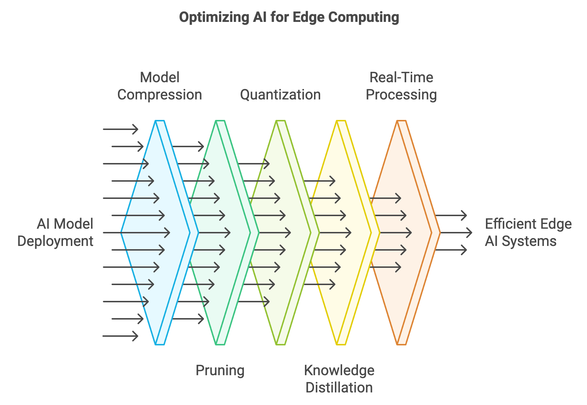
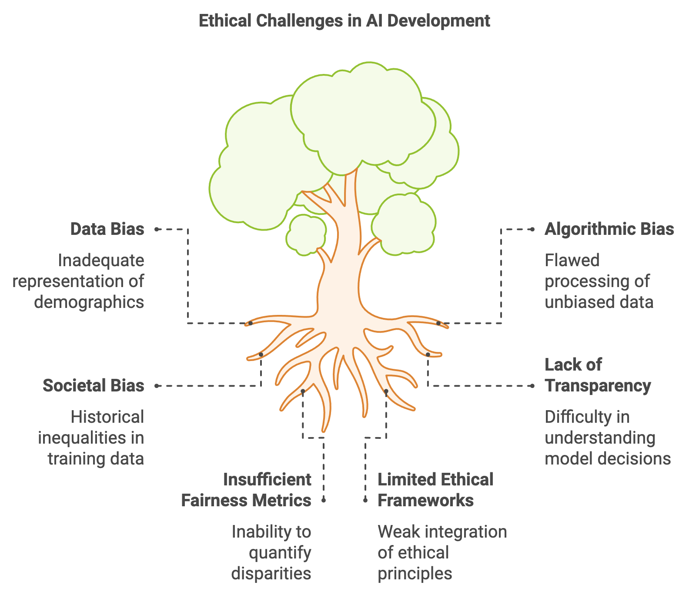

> **Note:**
**"*The future of AI lies at the intersection of diverse disciplines, where the fusion of new ideas and technologies will drive the next wave of innovation.*" — Andrew Ng**

> **Note:**
*Chapter 21 of DLVR explores the cutting-edge trends and research frontiers in the intersection of AI and Rust, with a focus on quantum machine learning, edge computing, federated learning, self-supervised learning, and ethics in AI. The chapter begins by discussing the transformative potential of quantum computing in AI, highlighting Rust's role in developing quantum machine learning models that leverage quantum mechanics principles like superposition and entanglement. It then delves into AI for edge computing and IoT, emphasizing Rust's advantages in deploying lightweight AI models on resource-constrained devices for real-time processing. The chapter also covers federated learning and privacy-preserving AI, underscoring the importance of decentralized model training to protect user data, and explores Rust’s capabilities in implementing secure, privacy-conscious AI systems. Furthermore, it examines the growing significance of self-supervised and unsupervised learning in leveraging unlabeled data, with Rust facilitating performance-optimized model implementations. Finally, the chapter addresses the ethical challenges in AI, emphasizing fairness, transparency, and accountability, and showcases how Rust can be used to build ethical AI models that incorporate bias mitigation and fairness metrics, ensuring AI systems are both effective and socially responsible.*

# 21.1. Quantum Machine Learning and Rust

Quantum computing is emerging as a groundbreaking technology with the potential to solve complex computational problems that are currently infeasible for classical systems. It leverages the principles of quantum mechanics, such as superposition, entanglement, and quantum interference, to enable computations that transcend the limitations of classical computing. These principles form the foundation of quantum machine learning (QML), where quantum computers accelerate and enhance machine learning algorithms, opening new possibilities for solving optimization problems, data-intensive tasks, and more.


**Figure 1:** Key concepts of Quantum machine learning. Rust QML framework offers better performance, safety and concurrency.

To understand quantum computing’s transformative impact, it is essential to grasp the fundamental principles that distinguish it from classical systems. Unlike classical bits, which can represent either 0 or 1, quantum bits (qubits) can exist in a combination of states, simultaneously representing both 0 and 1, thanks to the phenomenon of superposition. This allows quantum computers to process vast amounts of information in parallel. Additionally, qubits can exhibit entanglement, a phenomenon where the state of one qubit is directly correlated with the state of another, regardless of the physical distance between them. These properties enable quantum computers to handle computations with intricate interdependencies that are computationally prohibitive for classical systems.

Machine learning algorithms often face challenges such as the curse of dimensionality, slow optimization processes, and exponentially increasing resource demands for large datasets and complex models. Quantum computing addresses these issues by introducing quantum parallelism, which allows quantum computers to explore vast solution spaces simultaneously. Moreover, quantum algorithms such as Grover’s and Shor’s offer dramatic improvements in efficiency for specific problems. Grover’s algorithm, for example, enables the search of unsorted datasets in $O(\sqrt{N})$ time, offering a quadratic speedup compared to classical methods. Shor’s algorithm, originally developed for integer factorization, has inspired quantum approaches to decomposition and structural analysis, which can be applied to tasks like spectral clustering.

In the current era, quantum computing is transitioning through the stage of Noisy Intermediate-Scale Quantum (NISQ) devices, which are constrained by limited qubit counts and error rates. Consequently, hybrid quantum-classical algorithms have become a practical solution. These algorithms combine the strengths of classical and quantum processing, with classical computers handling large-scale numerical computations and quantum subroutines addressing specific tasks more efficiently. An example is the Variational Quantum Eigensolver (VQE), where a quantum computer prepares quantum states and a classical optimizer adjusts parameters to minimize a target function. Hybrid methods are particularly relevant for machine learning tasks, such as training models on large datasets, where quantum circuits can efficiently perform operations like sampling and matrix computations.

Rust plays a critical role in the development of quantum computing frameworks due to its performance, memory safety, and concurrency capabilities. Quantum simulations and hybrid quantum-classical algorithms demand precise resource management and parallel computation, areas where Rust excels. Its ability to integrate low-level hardware control with efficient high-level abstractions makes it an ideal language for building scalable quantum machine learning systems. For instance, Rust can be used to design quantum state simulators or coordinate quantum workloads with classical processing, ensuring reliability and efficiency.

The transformative potential of quantum machine learning lies in its ability to redefine how we approach data-driven tasks. Problems such as optimizing deep learning models, analyzing massive datasets, and uncovering complex patterns in data stand to benefit immensely from quantum-enhanced methods. Techniques like amplitude encoding allow quantum systems to represent and process exponentially larger datasets than classical systems can handle, while quantum neural networks and kernel methods introduce entirely new paradigms for learning and pattern recognition. While full-scale quantum computing remains an aspiration, the advances made today are laying the groundwork for a future where quantum machine learning becomes an integral part of AI development.

To explore Quantum Machine Learning in Rust, developers can utilize libraries such as `qrusty` and `rust-qiskit` to simulate and implement quantum algorithms. The Rust ecosystem for quantum computing is still growing, but these crates provide tools to prototype and experiment with quantum algorithms using simulators and quantum backends (like IBM’s Qiskit).

This Rust code implements a quantum classifier using the `rust_qiskit` library, simulating a quantum circuit for binary classification tasks. The code enhances a simple quantum circuit by introducing advanced quantum gates like Hadamard and controlled-X (CX) gates, and parameterized quantum rotations. Additionally, it includes an optimization loop that adjusts the parameters of the quantum circuit using a gradient descent method to improve classification accuracy. The quantum classifier processes input data by encoding it into quantum rotations and measuring the qubits to produce output probabilities.

```rust
use rust_qiskit::{QuantumCircuit, execute, Aer, BasicAer, QuantumJob};
use std::f64::consts::PI;

// Function to build an advanced quantum classifier with parameterized quantum gates
fn quantum_classifier(input_data: Vec<f64>, parameters: Vec<f64>) -> Vec<f64> {
    let num_qubits = input_data.len(); // Number of qubits matches the input features
    let mut qc = QuantumCircuit::new(num_qubits); // Create a quantum circuit with n qubits

    // Apply a Hadamard gate to initialize all qubits into superposition
    for i in 0..num_qubits {
        qc.h(i);
    }

    // Apply parameterized quantum rotations and controlled gates based on input data and parameters
    for i in 0..num_qubits {
        let input_angle = input_data[i] * PI; // Scale input data to an angle
        qc.rx(input_angle + parameters[i], i); // Apply RX rotation with a parameter shift

        // Apply a controlled-X (CX) gate between adjacent qubits for entanglement
        if i < num_qubits - 1 {
            qc.cx(i, i + 1); // Controlled-X between qubit i and i+1
        }
    }

    // Measure the qubits to classify the input data
    for i in 0..num_qubits {
        qc.measure(i, i);
    }

    // Simulate the quantum circuit
    let backend = Aer::get_backend("qasm_simulator").expect("Failed to get backend");
    let result = execute(&qc, backend, 1024).expect("Failed to execute quantum circuit");

    // Return the probabilities of the measurement outcomes
    result.get_probabilities()
}

// Optimization function to tune parameters for quantum classifier
fn optimize_parameters(input_data: Vec<f64>, target_output: Vec<f64>, iterations: usize) -> Vec<f64> {
    let mut parameters = vec![0.0; input_data.len()]; // Initialize parameters to zero
    let learning_rate = 0.01;

    for _ in 0..iterations {
        // Get output from the quantum classifier with the current parameters
        let output = quantum_classifier(input_data.clone(), parameters.clone());

        // Compute gradient (simple difference for illustrative purposes)
        let mut gradients = vec![0.0; parameters.len()];
        for i in 0..parameters.len() {
            let delta = output[i] - target_output[i]; // Error for this qubit
            gradients[i] = delta * 2.0; // Gradient approximation (error times 2 for update)
        }

        // Update parameters using a simple gradient descent step
        for i in 0..parameters.len() {
            parameters[i] -= learning_rate * gradients[i];
        }

        println!("Updated parameters: {:?}", parameters); // Log the parameter updates
    }

    parameters
}

fn main() {
    let input_data = vec![0.5, 0.8]; // Example input data
    let target_output = vec![0.0, 1.0]; // Target classification (for example purposes)

    // Optimize parameters to train the quantum classifier
    let optimized_parameters = optimize_parameters(input_data.clone(), target_output.clone(), 100);

    // Run the quantum classifier with optimized parameters
    let output = quantum_classifier(input_data, optimized_parameters);

    println!("Final Quantum classifier output: {:?}", output);
}
```

The code first builds a quantum circuit with an initialization step using Hadamard gates to place qubits into superposition. The classifier then applies parameterized rotation gates based on the input data and entangles the qubits with controlled-X gates to capture complex correlations. After measuring the qubits, the circuit is executed using the `qasm_simulator` backend, and the resulting output probabilities are returned. The `optimize_parameters` function performs gradient-based optimization to adjust the circuit parameters, minimizing the error between the output and a target classification. The `main` function demonstrates the process of running the quantum classifier, optimizing its parameters, and producing a final classification result.

Quantum simulators are an essential tool for prototyping quantum machine learning models. Since access to real quantum hardware is limited and noisy, simulators allow developers to experiment with quantum algorithms in a classical environment. Rust provides libraries like `qrusty` for prototyping quantum algorithms and exploring how these techniques might improve machine learning tasks.

For example, using quantum-inspired methods like Quantum Kernel Methods—which use quantum computers to perform kernel-based classification—can be simulated in Rust to evaluate their potential speedups and performance in comparison to classical algorithms.

From a scientific perspective, quantum machine learning is a rapidly developing field with the potential to revolutionize how we approach data-intensive tasks. Researchers are focusing on developing algorithms that leverage quantum properties like superposition and entanglement to improve the efficiency of machine learning models. However, quantum hardware is still in its early stages, and most quantum machine learning research today revolves around quantum simulations and hybrid quantum-classical approaches. Breakthroughs in this area could lead to exponential speedups for optimization tasks, which are central to training large machine learning models.

In industry, companies like IBM, Google, and Microsoft are pioneering quantum computing platforms that offer cloud-based access to quantum hardware. These platforms enable developers to experiment with quantum algorithms using simulators or real quantum processors. In the near term, hybrid quantum-classical algorithms are expected to be the most practical application of quantum computing, with companies exploring how these methods can be integrated into existing machine learning workflows for tasks such as optimization, classification, and cryptography.

By adopting Rust as a development tool for quantum machine learning, developers can take advantage of its memory safety and concurrency features to build efficient quantum simulations and hybrid algorithms. Rust’s growing ecosystem for quantum computing, combined with its performance capabilities, positions it as a promising language for future advancements in this field.

In conclusion, quantum machine learning represents an exciting frontier for both machine learning and quantum computing. By leveraging quantum algorithms such as Grover’s and hybrid approaches, quantum computers can potentially solve problems that are intractable for classical systems. Rust, with its performance and concurrency features, plays a critical role in building scalable quantum machine learning frameworks, enabling developers to experiment with quantum-enhanced models and prepare for the future of AI in a quantum world.

# 21.2. AI for Edge Computing and IoT

Edge computing and the Internet of Things (IoT) represent a transformative shift in the way data is processed, analyzed, and acted upon. By bringing computation closer to the source of data—such as sensors, mobile devices, and embedded systems—edge computing reduces the dependency on centralized cloud servers, enabling real-time processing and significantly lowering latency. When combined with Artificial Intelligence (AI), this paradigm unlocks powerful capabilities, allowing systems to process vast amounts of data locally and make intelligent decisions without delays. For instance, in autonomous vehicles, AI systems must process terabytes of sensor data in real time to make split-second decisions that impact safety and navigation. In such scenarios, edge computing is indispensable, as sending data to the cloud for processing introduces latency that can have life-threatening consequences.


**Figure 2:** Key challenges in deploying AI at the edge.

Deploying AI models at the edge provides several critical advantages. By processing data locally, edge devices eliminate the latency associated with cloud communication, improve application responsiveness, and reduce bandwidth consumption. This approach also enhances privacy, as sensitive data is processed and stored locally rather than being transmitted to remote servers. However, deploying AI at the edge also poses significant challenges due to the limited computational resources of edge devices, which often have constrained memory, power, and processing capabilities. These limitations necessitate lightweight and optimized AI models that can operate efficiently within the resource constraints of IoT devices.

The Rust programming language is uniquely suited for AI development in edge computing environments. Rust’s low-level control, high performance, and memory safety, achieved without relying on a garbage collector, make it an ideal choice for building robust, efficient systems. Rust’s emphasis on safe concurrency is particularly advantageous for edge devices, which often need to manage multiple tasks simultaneously, such as processing sensor inputs while performing inference. Additionally, Rust’s performance, comparable to C and C++, ensures efficient utilization of limited resources, which is critical for edge applications where maximizing hardware potential is non-negotiable.


**Figure 3:** Common optimization techniques for AI at the edge.

To enable AI deployment on edge devices, optimizing AI models to fit within their limited computational capacities is paramount. Traditional deep learning models are resource-intensive, requiring significant memory and processing power, which makes them unsuitable for direct deployment on edge devices without modifications. To address this, several model compression techniques have been developed to reduce the size and computational requirements of AI models while maintaining acceptable performance levels.

Pruning is one such technique, which removes redundant weights or neurons from the model. By identifying and eliminating parameters that contribute minimally to the model's predictions, pruning reduces the overall size of the neural network while preserving its accuracy. Quantization, another widely used technique, reduces the precision of model weights and activations, typically converting 32-bit floating-point numbers to lower precision formats such as 8-bit integers (INT8). This approach significantly decreases memory usage and speeds up inference by leveraging hardware-accelerated arithmetic operations for low-precision calculations. Knowledge distillation takes a different approach by training a smaller model (the student) to mimic the predictions of a larger, more complex model (the teacher). The student model is compact and optimized for deployment on edge devices, yet retains much of the original model's predictive capabilities.

Real-time processing is a cornerstone of AI at the edge, particularly in applications like autonomous vehicles, smart homes, industrial automation, and healthcare monitoring. In these environments, decision-making often needs to occur in milliseconds to ensure effective operation. Cloud-based AI solutions are impractical in such scenarios, as the latency introduced by data transmission to and from remote servers can hinder performance and reliability. By deploying AI models directly on edge devices, systems can respond to events almost instantaneously, providing faster and more reliable outcomes. For example, in industrial automation, edge AI can analyze data from machinery sensors in real time to predict and prevent equipment failures, minimizing downtime and improving efficiency.

As the convergence of edge computing, IoT, and AI continues to evolve, new opportunities for innovation are emerging. For developers and engineers, mastering the intricacies of deploying AI models at the edge is critical. Techniques like model compression, efficient resource utilization, and real-time processing are not just optimizations but necessities for the future of edge-based AI. Rust, with its unparalleled performance and safety guarantees, is poised to play a pivotal role in shaping the next generation of intelligent edge systems. By leveraging these advanced approaches, edge AI can unlock transformative possibilities across industries, from autonomous systems to smart cities, making the future of computing more distributed, responsive, and intelligent.

The Open Neural Network Exchange (ONNX) is an open-source format designed to make AI model interoperability across different machine learning and deep learning frameworks easier. With ONNX, models can be developed, trained, and exported from one framework, such as PyTorch or TensorFlow, and then deployed in another framework that supports ONNX, like Caffe2 or Microsoft’s ML.NET. This flexibility is critical in production environments where efficient deployment is necessary but training might be done on a specialized research platform. ONNX enables developers to use the best tools for training and inference, while maintaining compatibility and avoiding the need to retrain or redevelop models for different platforms. Additionally, ONNX provides standardization for model structure and operators, which can streamline the workflow for developers and help ensure consistent results across frameworks.

```rust
use anyhow::Result;
use candle_core::{Device, Tensor};
use std::collections::{HashMap, HashSet};

enum Command {
    SimpleEval { file: String },
}

fn main() -> Result<()> {
    // Hardcode the command to SimpleEval and specify the file path
    let command = Command::SimpleEval {
        file: "path/to/model.onnx".to_string(),
    };

    match command {
        Command::SimpleEval { file } => {
            let model = candle_onnx::read_file(file)?;
            let graph = model.graph.as_ref().unwrap();
            let constants: HashSet<_> = graph.initializer.iter().map(|i| i.name.as_str()).collect();
            let mut inputs = HashMap::new();
            for input in graph.input.iter() {
                use candle_onnx::onnx::tensor_proto::DataType;
                if constants.contains(input.name.as_str()) {
                    continue;
                }

                let type_ = input.r#type.as_ref().expect("no type for input");
                let type_ = type_.value.as_ref().expect("no type.value for input");
                let value = match type_ {
                    candle_onnx::onnx::type_proto::Value::TensorType(tt) => {
                        let dt = match DataType::try_from(tt.elem_type) {
                            Ok(dt) => match candle_onnx::dtype(dt) {
                                Some(dt) => dt,
                                None => {
                                    anyhow::bail!(
                                        "unsupported 'value' data-type {dt:?} for {}",
                                        input.name
                                    )
                                }
                            },
                            type_ => anyhow::bail!("unsupported input type {type_:?}"),
                        };
                        let shape = tt.shape.as_ref().expect("no tensortype.shape for input");
                        let dims = shape
                            .dim
                            .iter()
                            .map(|dim| match dim.value.as_ref().expect("no dim value") {
                                candle_onnx::onnx::tensor_shape_proto::dimension::Value::DimValue(v) => Ok(*v as usize),
                                candle_onnx::onnx::tensor_shape_proto::dimension::Value::DimParam(_) => Ok(42),
                            })
                            .collect::<Result<Vec<usize>>>()?;
                        Tensor::zeros(dims, dt, &Device::Cpu)?
                    }
                    type_ => anyhow::bail!("unsupported input type {type_:?}"),
                };
                println!("input {}: {value:?}", input.name);
                inputs.insert(input.name.clone(), value);
            }
            let outputs = candle_onnx::simple_eval(&model, inputs)?;
            for (name, value) in outputs.iter() {
                println!("output {name}: {value:?}")
            }
        }
    }
    Ok(())
}
```

This Rust code demonstrates loading and evaluating an ONNX model file in a simple way, focusing on command processing for model inspection or inference. The code defines an enum `Command` with a single variant `SimpleEval`, representing an operation to perform evaluation. In `main`, a `SimpleEval` command is hardcoded with a specified file path to an ONNX model. When run, the `SimpleEval` branch loads the model using `candle_onnx::read_file`, extracts the graph of operations, and identifies constant initializer nodes. For each input tensor that is not a constant, it gathers type and shape information to construct a placeholder tensor of zeros. The code then calls `candle_onnx::simple_eval` to evaluate the model with these inputs, printing the resulting outputs. This setup provides a basic structure for loading and performing inference on an ONNX model in a streamlined manner, useful for testing or prototyping ONNX models in Rust.

Lets see another example of inference pipeline. The code sets up an efficient inference pipeline for image classification using a pre-trained ONNX model. In this pipeline, an input image is first loaded and preprocessed before being passed through a neural network for classification. SqueezeNet, a compact and efficient neural network model, is used here, making this pipeline ideal for scenarios requiring fast inference with limited computational resources. The model outputs the top-5 predicted classes along with their probabilities, drawing from ImageNet categories. This inference setup is optimized for rapid image recognition tasks commonly seen in embedded systems or other resource-constrained environments, enabling practical applications such as real-time object detection or visual analysis.

```rust
use candle_core::{IndexOp, D};
use std::path::PathBuf;

#[derive(Clone, Copy, Debug)]
enum Which {
    SqueezeNet,
    // If you want to keep EfficientNet for future use, uncomment the next line and suppress the warning.
    // #[allow(dead_code)]
    // EfficientNet,
}

struct Args {
    image: String,
    model: Option<String>,
    which: Which,
}

impl Args {
    fn new() -> Self {
        Args {
            image: "path/to/image.jpg".to_string(), // Hardcoded image path
            model: None, // Optional model path, set to `None` by default
            which: Which::SqueezeNet, // Hardcoded model selection
        }
    }
}

pub fn main() -> anyhow::Result<()> {
    let args = Args::new(); // Instantiate Args with hardcoded values
    let image = candle_examples::imagenet::load_image224(args.image)?;
    let image = match args.which {
        Which::SqueezeNet => image,
        // Uncomment the next line if EfficientNet is reintroduced
        // Which::EfficientNet => image.permute((1, 2, 0))?,
    };

    println!("loaded image {image:?}");

    let model = match args.model {
        Some(model) => PathBuf::from(model),
        None => match args.which {
            Which::SqueezeNet => hf_hub::api::sync::Api::new()?
                .model("lmz/candle-onnx".into())
                .get("squeezenet1.1-7.onnx")?,
            // Uncomment the next line if EfficientNet is reintroduced
            // Which::EfficientNet => hf_hub::api::sync::Api::new()?
            //    .model("onnx/EfficientNet-Lite4".into())
            //    .get("efficientnet-lite4-11.onnx")?,
        },
    };

    let model = candle_onnx::read_file(model)?;
    let graph = model.graph.as_ref().unwrap();
    let mut inputs = std::collections::HashMap::new();
    inputs.insert(graph.input[0].name.to_string(), image.unsqueeze(0)?);
    let mut outputs = candle_onnx::simple_eval(&model, inputs)?;
    let output = outputs.remove(&graph.output[0].name).unwrap();
    let prs = match args.which {
        Which::SqueezeNet => candle_nn::ops::softmax(&output, D::Minus1)?,
        // Uncomment the next line if EfficientNet is reintroduced
        // Which::EfficientNet => output,
    };
    let prs = prs.i(0)?.to_vec1::<f32>()?;

    // Sort the predictions and take the top 5
    let mut top: Vec<_> = prs.iter().enumerate().collect();
    top.sort_by(|a, b| b.1.partial_cmp(a.1).unwrap());
    let top = top.into_iter().take(5).collect::<Vec<_>>();

    // Print the top predictions
    for &(i, p) in &top {
        println!(
            "{:50}: {:.2}%",
            candle_examples::imagenet::CLASSES[i],
            p * 100.0
        );
    }

    Ok(())
}
```

The program begins by defining `Args` to manage user inputs, which are hardcoded here, including the path to the image and the model choice (`SqueezeNet`). In `main`, it loads and prepares the image in the required 224x224 format using a helper function (`load_image224`). If `SqueezeNet` is selected, the image is passed as-is; otherwise, other model options can be uncommented for further flexibility. The ONNX model file is loaded either from a local path or downloaded via `hf_hub::api` if `SqueezeNet` is specified. After reading the model, the program builds a dictionary of input tensors, feeding the processed image as input. It then performs inference using `candle_onnx::simple_eval`, obtaining raw output predictions. For `SqueezeNet`, it applies the softmax function to the output to convert it into probabilities. Finally, the predictions are sorted by confidence, and the top 5 predictions are printed, each associated with a class label from ImageNet and the probability percentage. This flow allows efficient, automated image classification with concise, interpretable results.

In summary, this Rust code offers a robust and advanced way to integrate ONNX models with edge computing platforms. It handles the loading of pre-trained models, processes input data efficiently, and manages errors effectively, making it suitable for deployment in real-time, resource-constrained environments like mobile devices, IoT sensors, or embedded systems. By leveraging ONNX, the code is platform-agnostic and can take advantage of various hardware accelerations optimized for AI inference, enabling a flexible and scalable edge AI deployment strategy.

The integration of AI with edge computing and IoT is an active area of research, focusing on how to make AI models more efficient while maintaining their accuracy. Techniques like edge-based federated learning, where models are trained across distributed edge devices without centralizing data, are gaining popularity due to their privacy benefits and scalability. Researchers are also exploring new hardware accelerators for AI on the edge, such as specialized AI chips optimized for inference tasks.

In industry, deploying AI at the edge is critical in sectors such as smart cities, healthcare, agriculture, and manufacturing. For example, edge AI enables predictive maintenance in industrial automation, where machines can analyze data from sensors to predict failures before they happen. Autonomous vehicles also rely heavily on edge AI to process sensory data in real time, ensuring safe and timely responses without relying on cloud-based processing.

Rust is increasingly being adopted in the IoT and edge computing space due to its efficiency and safety. By combining Rust’s performance with powerful model compression techniques and optimization strategies, developers can build scalable, real-time AI systems that run efficiently on edge devices, pushing AI beyond traditional cloud-based architectures.

In conclusion, AI for edge computing offers numerous advantages in terms of real-time processing, reduced latency, and privacy. By using Rust, developers can build high-performance AI models optimized for edge environments, leveraging techniques like quantization, pruning, and distillation to deploy models on resource-constrained devices. As AI continues to merge with edge computing, Rust’s performance and safety make it an ideal choice for these applications, ensuring scalable and efficient deployment in real-world IoT systems.

# 21.3. Federated Learning and Privacy-Preserving AI

Federated learning (FL) is a decentralized approach to machine learning that allows multiple devices or servers to collaboratively train a model without sharing their local data. This architecture is designed to address the growing concerns around data privacy, particularly in sensitive industries like healthcare, finance, and mobile computing, where user data is highly sensitive and protected by privacy laws. Rather than sending raw data to a central server, federated learning enables local devices to compute model updates based on their local data and send only these updates (gradients or model parameters) to the server, which aggregates them to improve the global model.


**Figure 4:** Key concepts of federated learning (Credit: GeeksforGeeks).

The importance of federated learning lies in its ability to protect user data while still harnessing the collective knowledge of distributed data sources. For example, in healthcare, hospitals can collaboratively train a machine learning model for predicting diseases without directly sharing patient data. This ensures compliance with privacy regulations like HIPAA (Health Insurance Portability and Accountability Act) and the GDPR (General Data Protection Regulation) in Europe.

Rust is an excellent choice for implementing privacy-preserving AI systems because of its strong emphasis on memory safety, concurrency, and performance. These features are particularly important for building secure and efficient federated learning systems, as they need to handle potentially large-scale, distributed computations while ensuring that no sensitive data is exposed.

Challenges in federated learning are primarily related to the distributed nature of the system and the diversity of the participating devices. One of the main issues is communication overhead, as frequent model updates between devices and the central server can introduce latency and bandwidth consumption. Moreover, data heterogeneity is a major concern in federated learning because the data available on each device may vary significantly, leading to non-i.i.d. (independent and identically distributed) data, which complicates model convergence.

Mathematically, let $\mathcal{D}_i$ represent the local dataset on device $i$, and let $\theta_t$ represent the global model parameters at time ttt. During the local training on device iii, the model updates are computed as:

$$ \theta_{i,t+1} = \theta_t - \eta \nabla_{\theta_t} \mathcal{L}_i(\theta_t, \mathcal{D}_i) $$

Where $\eta$ is the learning rate, and $\mathcal{L}_i$ is the local loss function for device $i$. These updates $\theta_{i,t+1}$ are then sent to the central server, which aggregates them (typically through weighted averaging) to update the global model:

$$ \theta_{t+1} = \frac{1}{N} \sum_{i=1}^{N} \theta_{i,t+1} $$

Privacy-preserving techniques such as differential privacy (DP), secure multi-party computation (SMPC), and homomorphic encryption (HE) are employed to ensure that the updates themselves do not leak sensitive information. In differential privacy, noise is added to the model updates to obscure the contribution of individual data points, making it impossible to infer personal information from the updates. Differential privacy ensures that the probability of generating any specific output does not change significantly when any single data point is added or removed from the dataset. This is formalized as:

$$ P(\mathcal{M}(D_1) = o) \leq e^{\epsilon} P(\mathcal{M}(D_2) = o) $$

Where $D_1$ and $D_2$ are datasets differing by a single entry, $\mathcal{M}$ is the mechanism (e.g., the learning algorithm), and $\epsilon$ is the privacy budget, controlling the amount of noise added.

In SMPC, multiple parties collaboratively compute a function over their inputs while keeping those inputs private. Homomorphic encryption allows computations to be performed on encrypted data, ensuring that the central server can aggregate model updates without learning anything about the underlying data.

Federated learning is highly relevant in industries where data privacy is paramount. In healthcare, for example, hospitals can train diagnostic models without ever sharing patient data across institutions. In finance, banks can build fraud detection systems by learning from each other’s transaction data without revealing customer identities. Similarly, mobile devices use federated learning to improve features like next-word prediction or personalized recommendations without sending private user data to central servers.

This pseudo code below outlines the development of a federated learning (FL) system in Rust, covering the main components of FL: client-server communication, federated averaging, handling non-IID data, privacy preservation, and communication efficiency. The code simulates a basic FL setup where clients train local models on distributed data, send model updates to a central server, and the server aggregates these updates into a global model. Advanced features, such as privacy preservation, efficient communication, and resilience to client dropout, are included to demonstrate how Rust’s concurrency, cryptographic libraries, and numerical operations can enable robust and scalable FL systems.

```text
// Define Federated Learning System
FederatedLearningSystem:
    clients: list of client devices or entities participating in FL
    global_model: centralized model shared across clients
    server: central server to aggregate client updates
    disparity_threshold: acceptable level of data disparity across clients

    // Initialize FL system with clients and global model
    new(clients, global_model, server):
        set self.clients to clients
        set self.global_model to global_model
        set self.server to server

    // Method to simulate local training on clients
    client_train():
        for each client in clients:
            client_data = get_data_for_client(client)
            client_model = train_local_model(client_data)
            send_model_to_server(client, client_model)

    // Method to aggregate client updates using federated averaging
    aggregate_updates():
        model_parameters = collect_model_parameters(server)

        // Compute federated average of client models
        global_model.parameters = federated_average(model_parameters)
        update_global_model(global_model)

    // Method to handle non-IID data by adjusting weights or learning rates
    adjust_for_non_iid_data():
        for each client in clients:
            client_data_distribution = analyze_data_distribution(client)
            if client_data_distribution is non-IID:
                apply_weight_adjustment(client)
                adjust_learning_rate(global_model)

    // Method to apply privacy preservation using differential privacy
    apply_privacy_preservation():
        for each client in clients:
            local_update = get_client_update(client)
            secure_update = apply_differential_privacy(local_update)
            send_secure_update_to_server(client, secure_update)

    // Method to optimize communication by compressing and quantizing updates
    optimize_communication():
        for each client in clients:
            local_update = get_client_update(client)
            compressed_update = compress_update(local_update)
            quantized_update = quantize_update(compressed_update)
            send_optimized_update_to_server(client, quantized_update)

    // Method to handle client dropout and communication issues
    manage_client_dropouts():
        active_clients = []
        for each client in clients:
            if client is active:
                add client to active_clients

        // Aggregate updates only from active clients
        aggregate_updates_from_clients(active_clients)

        if client_dropouts_exceed_threshold:
            apply_straggler_mitigation()

// Supporting Functions for Federated Learning System

// Function to train local model on client's data
train_local_model(data):
    local_model = initialize local model
    for each epoch in training loop:
        update local_model using data
    return local_model

// Function to send client model parameters to the server
send_model_to_server(client, model):
    send encrypted model parameters from client to server

// Function to collect model parameters from all clients
collect_model_parameters(server):
    model_parameters = receive model parameters from all clients
    return model_parameters

// Function to calculate federated average of client models
federated_average(model_parameters):
    return sum(model_parameters) / count(model_parameters)

// Function to apply differential privacy to client updates
apply_differential_privacy(update):
    return update with Gaussian noise added to maintain privacy

// Function to compress client updates before transmission
compress_update(update):
    return apply custom compression algorithm to update

// Function to quantize client updates for reduced data size
quantize_update(update):
    return quantize data values in update for transmission efficiency

// Function to analyze client data distribution
analyze_data_distribution(client):
    return compute statistics on client data to assess distribution

// Function to apply adjustments for non-IID data
apply_weight_adjustment(client):
    adjust client model weights to compensate for data skew

// Function to update global model with aggregated parameters
update_global_model(global_model):
    replace current global model parameters with new aggregated parameters

// Main Execution for Federated Learning System

main:
    clients = initialize clients with data
    global_model = initialize global model
    server = initialize central server for aggregation
    disparity_threshold = set allowable disparity level

    // Initialize FL system with clients, global model, and server
    fl_system = new FederatedLearningSystem(clients, global_model, server)

    // Simulate local training on each client
    fl_system.client_train()

    // Aggregate model updates from clients to form global model
    fl_system.aggregate_updates()

    // Adjust for non-IID data if detected among clients
    fl_system.adjust_for_non_iid_data()

    // Apply privacy preservation techniques to secure client updates
    fl_system.apply_privacy_preservation()

    // Optimize communication with compressed and quantized updates
    fl_system.optimize_communication()

    // Handle client dropouts and network instability
    fl_system.manage_client_dropouts()

    print "Federated Learning Process Completed"
```

This pseudo code organizes the federated learning system into distinct modules for client-server communication, model training, aggregation, and optimization. Key methods include:

- Client Training: The `client_train` method simulates local model training on each client’s data. Each client sends its locally trained model parameters to the central server after training.
- Federated Averaging: The `aggregate_updates` method aggregates client model updates through federated averaging, where model parameters are averaged to create a global model that reflects all clients' insights.
- Handling Non-IID Data: The `adjust_for_non_iid_data` method detects non-IID data across clients and adjusts the learning process (e.g., by weighting updates or adjusting learning rates) to address data distribution challenges.
- Privacy Preservation: The `apply_privacy_preservation` method applies differential privacy by adding noise to client updates, protecting sensitive information while balancing model accuracy.
- Communication Optimization: The `optimize_communication` method compresses and quantizes updates, reducing bandwidth consumption and ensuring efficient communication between clients and the server.
- Managing Client Dropouts: The `manage_client_dropouts` method identifies active clients and aggregates updates only from those connected. It applies straggler mitigation techniques to handle client dropout without disrupting the training process.

In the main function, the system initializes clients, a global model, and a server, then sequentially runs client training, aggregation, and optimizations. This structure, made possible by Rust’s efficient data handling, concurrency, and cryptographic support, enables secure, scalable, and privacy-preserving federated learning for real-world applications.

Federated learning represents a shift from centralized machine learning toward decentralized AI systems, where privacy and security are prioritized. Researchers are exploring more efficient methods for handling communication overhead and improving model convergence in non-i.i.d. data environments. Techniques like federated optimization and adaptive aggregation have been developed to address these challenges.

Privacy-preserving techniques, such as differential privacy, secure multi-party computation, and homomorphic encryption, are essential components of modern federated learning systems. These methods allow for secure and private computations in distributed settings, ensuring that no sensitive information is leaked during model training. Research is ongoing to improve the scalability and efficiency of these privacy-preserving techniques, especially in large-scale deployments.

In industry, federated learning has gained significant traction in sectors like mobile computing (e.g., Google’s Gboard uses federated learning for improving text predictions), healthcare, and finance, where data privacy is a top concern. Companies are increasingly adopting federated learning to comply with privacy regulations while still leveraging the power of AI to extract insights from decentralized data.

Rust’s performance and memory safety make it an excellent choice for implementing federated learning systems, particularly when deploying them in resource-constrained environments like mobile devices. Its ability to handle concurrency safely and efficiently also positions Rust as a valuable tool for building scalable and secure AI systems in federated settings.

In conclusion, federated learning and privacy-preserving AI are essential for advancing decentralized machine learning in sensitive domains. By leveraging Rust’s capabilities and integrating techniques like differential privacy, developers can build secure, efficient, and scalable federated learning systems that protect user privacy while enabling the benefits of collective data learning.

# 30.4. Self-Supervised and Unsupervised Learning

Self-supervised learning (SSL) and unsupervised learning are increasingly gaining importance in the field of deep learning, particularly as the need to learn from large amounts of unlabeled data becomes critical. Unlabeled data is abundant and easier to collect compared to labeled data, where manual annotation is time-consuming and costly. In self-supervised learning, models generate labels automatically by exploiting the structure of the input data itself, enabling the network to learn meaningful representations. Unsupervised learning, on the other hand, involves discovering patterns and structures in data without relying on any labels, such as through clustering or density estimation. Chapter 15 of this DLVR book delves into both self-supervised and unsupervised learning methods, exploring their growing relevance in building scalable deep learning models.

These methods are essential for applications where labeled data is scarce but unlabeled data is plentiful, such as in medical imaging, speech processing, and natural language processing. For example, in image representation learning, SSL can be used to pre-train models by predicting missing parts of an image or by contrasting similar images, after which the learned features can be transferred to downstream tasks (e.g., classification) with minimal fine-tuning.

Rust is particularly well-suited for implementing self-supervised and unsupervised learning due to its focus on performance, low-level control, and memory safety. When working with large datasets or computationally expensive algorithms, Rust’s ability to handle concurrency and optimize memory usage ensures efficient model training and deployment.


**Figure 5:** Key concepts of SSL - Self-Supervised Learning (Credit: GeeksforGeeks).

To understand the landscape of self-supervised and unsupervised learning, it’s important to distinguish between supervised, unsupervised, and self-supervised learning:

- Supervised learning involves training a model with labeled data, where the goal is to map inputs to specific labels.
- Unsupervised learning seeks to find hidden patterns or structures in data, such as clustering data points based on similarity.
- Self-supervised learning is a form of unsupervised learning where the model generates labels from the data itself, enabling it to solve a pretext task (e.g., predicting part of the input) that helps in learning useful representations.

In self-supervised learning, techniques like contrastive learning, autoencoders, and transformer-based pre-training are widely used. Contrastive learning aims to bring similar samples (positive pairs) closer in representation space while pushing dissimilar samples (negative pairs) apart. Formally, given a pair of samples $(x_i, x_j)$, a contrastive loss function can be expressed as:

$$ \mathcal{L}_{\text{contrastive}} = -\log \frac{\exp(\text{sim}(h(x_i), h(x_j)) / \tau)}{\sum_{k=1}^{N} \exp(\text{sim}(h(x_i), h(x_k)) / \tau)} $$

Where $\text{sim}(h(x_i), h(x_j))$ represents the cosine similarity between the embeddings $h(x_i)$ and $h(x_j)$, and $\tau$ is a temperature parameter controlling the sharpness of the output distribution.

In autoencoders, the model learns to compress data into a latent space and then reconstruct it. The goal is to minimize the reconstruction error, where the encoder maps the input $x$ to a latent representation $z$, and the decoder reconstructs $\hat{x}$ from $z$:

$$ \mathcal{L}_{\text{autoencoder}} = || x - \hat{x} ||^2 $$


**Figure 6:** Unsupervised Learning Models like Dimensionality Reduction, Clustering and Density Estimation

Unsupervised learning focuses on tasks like clustering, where the objective is to group similar data points together. K-means clustering, for example, minimizes the intra-cluster variance, with the loss function:

$$ \mathcal{L}_{\text{k-means}} = \sum_{i=1}^{N} \min_{\mu_j \in C} || x_i - \mu_j ||^2 $$

Where $C$ represents the set of cluster centroids, and $\mu_j$ is the centroid of cluster $j$.

Feature learning plays a critical role in both SSL and unsupervised learning, as these models aim to extract meaningful representations from raw data that can be used for downstream tasks like classification, regression, or anomaly detection.

From a scientific perspective, self-supervised learning is revolutionizing how models learn from data. In fields like natural language processing (NLP) and computer vision, SSL has enabled models like BERT and SimCLR to achieve state-of-the-art performance by pre-training on massive amounts of unlabeled data before fine-tuning on smaller labeled datasets. Researchers are also exploring new pretext tasks and architectures that improve the quality of the learned representations.

In industry, self-supervised and unsupervised learning are critical for organizations that deal with large amounts of unstructured or unlabeled data. Companies such as Google, Facebook, and OpenAI leverage SSL to pre-train models on vast corpora of text and images, making it possible to build robust AI systems with minimal manual labeling. This has wide-ranging applications, from autonomous driving to content recommendation systems.

By using Rust, developers can build efficient and high-performance models for self-supervised and unsupervised learning. Rust’s memory safety and performance optimization capabilities make it ideal for implementing scalable machine learning algorithms in production environments where resources must be carefully managed.

In conclusion, self-supervised and unsupervised learning are key techniques in modern AI, allowing models to learn from unlabeled data and discover meaningful patterns. Using Rust to implement these methods ensures high-performance and scalable solutions, enabling developers to build powerful, efficient AI systems that can learn from vast amounts of data without the need for extensive labeling.

# 21.5. Ethics and Fairness in AI

Ethical considerations in AI development have become increasingly critical as these technologies are deployed in sensitive domains such as healthcare, criminal justice, hiring, and financial services. The ethical challenges associated with AI primarily revolve around bias, fairness, transparency, and accountability. Without careful design, AI systems risk perpetuating or amplifying existing societal biases, leading to unfair and discriminatory outcomes for certain demographic groups. Bias in AI arises from various sources, including skewed or incomplete training data, algorithmic design flaws, and the broader societal biases embedded in the environments where these models operate. Addressing these issues is not just a technical challenge but a moral imperative, ensuring that AI systems contribute to equitable and inclusive outcomes.


**Figure 7:** Key challenges in Ethical AI development.

Developing AI systems that are both effective and ethical is essential for ensuring fairness, inclusivity, and trustworthiness. Ethical AI not only minimizes harmful biases but also provides a transparent and accountable framework for decision-making, enabling stakeholders to understand and audit the model’s behavior. Achieving this requires a combination of technical innovations, such as fairness-aware algorithms and explainability techniques, and societal interventions, such as inclusive data collection and governance frameworks. By addressing biases and enhancing interpretability, developers can create AI systems that align with ethical principles and societal values.

Rust provides a robust foundation for building ethical AI models due to its focus on safety, security, and performance. Its strong guarantees around memory safety and concurrency reduce the risk of security vulnerabilities, a critical requirement for AI systems operating in sensitive domains. Rust’s performance optimization enables real-time deployment of fairness-aware algorithms, making it an ideal choice for implementing ethical AI in resource-constrained environments such as edge computing or IoT devices. Additionally, Rust’s emphasis on reliability ensures that AI systems built with it are both trustworthy and robust, aligning with the ethical demands of modern AI development.


**Figure 8:** Ethical AI development scopes using Rust.

Bias in AI can stem from multiple sources, each requiring targeted mitigation strategies. Data bias arises when the training dataset does not adequately represent all demographic groups, leading to models that perform poorly on underrepresented populations. For example, facial recognition systems have demonstrated lower accuracy for individuals with darker skin tones when trained on datasets predominantly featuring lighter-skinned individuals. Algorithmic bias can occur even when data is unbiased, stemming from the way the algorithm processes inputs and assigns weights. Models may disproportionately favor certain classes due to their loss functions or decision thresholds, leading to systemic unfairness. Societal bias, on the other hand, reflects the structural inequalities embedded in the historical or environmental data used to train AI models. For instance, historical discrimination in hiring practices can influence AI-based recruitment systems, perpetuating past inequities.

To mitigate these biases, researchers have developed fairness metrics and bias mitigation techniques that aim to quantify and address disparities in AI behavior. Demographic parity ensures that model outcomes are independent of sensitive attributes such as gender or race. Equalized odds go further, requiring that the true positive and false positive rates are equal across all demographic groups, ensuring equitable treatment for all. These metrics are critical for evaluating and improving the fairness of AI systems, particularly in high-stakes applications.

Transparency and explainability are equally important for ensuring that AI models are understandable and accountable. Techniques such as LIME (Local Interpretable Model-agnostic Explanations) and SHAP (SHapley Additive exPlanations) enable developers to identify the contribution of individual features to model predictions, making it easier to detect and correct biases. These tools are invaluable for diagnosing issues like model drift or unintended discriminatory behavior, ensuring that AI systems remain aligned with ethical standards.

In Rust, developers can incorporate fairness metrics and bias mitigation techniques directly into the AI model pipeline. Pre-processing methods, such as rebalancing datasets to ensure demographic representation, can address data bias before training begins. In-processing methods modify the learning algorithm to penalize unfair outcomes, for example, by using weighted loss functions that prioritize fairness alongside accuracy. Post-processing techniques adjust model outputs to meet fairness criteria, such as calibrating decision thresholds to equalize outcomes across groups. Rust’s performance and safety guarantees make it particularly well-suited for implementing these techniques in real-time applications, ensuring that ethical considerations are seamlessly integrated into the AI development process.

The field of ethical AI is rapidly evolving, with researchers developing more sophisticated fairness metrics and mitigation techniques to address complex scenarios like intersectional bias, where individuals belong to multiple sensitive categories. The focus is expanding beyond traditional notions of fairness to encompass broader concepts of equity, inclusivity, and societal impact. In industry, companies such as Google, IBM, and Microsoft are at the forefront of this movement, adopting fairness-aware algorithms and introducing tools like Google’s What-If Tool and IBM’s AI Fairness 360 to help developers detect and mitigate bias in their models. These efforts underscore the growing recognition of fairness as a critical component of AI innovation.

In high-stakes domains such as healthcare, finance, and criminal justice, ensuring fairness is not only a moral obligation but also a practical necessity for building public trust and avoiding legal repercussions. By leveraging Rust’s unique strengths in safety, performance, and concurrency, developers can build AI systems that are robust, transparent, and aligned with ethical principles. Features like logging and transparency mechanisms can be integrated into Rust-based frameworks, enabling continuous monitoring and auditing of AI systems to ensure ethical compliance.

Ethics and fairness are no longer optional considerations in AI development but integral components of creating socially responsible technologies. Rust provides the tools and capabilities necessary to embed these principles into the core of AI systems, enabling developers to build models that balance technical excellence with ethical rigor. By prioritizing fairness, inclusivity, and transparency, AI systems can truly serve as tools for progress, benefiting individuals and society at large while minimizing harm and inequality.

# 21.6. Conclusion

This chapter equips you with the knowledge and skills to explore the emerging trends and research frontiers in AI using Rust. By mastering these advanced techniques, you will be prepared to contribute to the cutting-edge developments that are shaping the future of AI, ensuring that you remain at the forefront of this rapidly evolving field.

## 21.6.1. Further Learning with GenAI

These prompts are designed to deepen your understanding of the emerging trends and research frontiers in AI using Rust. Each prompt encourages exploration of advanced concepts, implementation techniques, and practical challenges in developing next-generation AI systems.

- Critically analyze the transformative potential of quantum machine learning in advancing AI. What are the specific challenges and opportunities in integrating quantum-enhanced machine learning models, and how can Rust be strategically utilized to implement and optimize these models?
- Discuss the multifaceted challenges associated with deploying AI models on edge devices, focusing on the limitations of resource-constrained hardware. How can Rust be effectively leveraged to optimize AI models for real-time inference, ensuring both efficiency and reliability in edge computing environments?
- Examine the critical role of federated learning in the development of privacy-preserving AI systems. How can Rust be employed to architect federated learning frameworks that not only safeguard user data but also facilitate robust and scalable collaborative model training across distributed networks?
- Explore the growing significance of self-supervised learning in minimizing reliance on labeled data. How can Rust be used to engineer sophisticated self-supervised models that efficiently learn from vast, unlabeled datasets, and what are the key considerations in doing so?
- Investigate the complex ethical challenges involved in deploying AI in real-world scenarios. How can Rust be harnessed to design and implement AI systems that inherently prioritize fairness, transparency, and accountability, and what are the potential trade-offs?
- Analyze the potential of hybrid quantum-classical algorithms in AI, particularly in overcoming the current limitations of both quantum and classical computing. How can Rust be employed to implement these hybrid algorithms, and what are the technical and conceptual challenges in achieving seamless integration?
- Evaluate the impact of model compression techniques on the efficiency and scalability of AI deployments. How can Rust be utilized to implement advanced model pruning and quantization techniques, particularly for enhancing AI performance on edge devices?
- Examine the critical role of differential privacy in safeguarding user data during AI model training. How can Rust be strategically applied to implement robust privacy-preserving techniques within federated learning frameworks, ensuring data security without compromising model performance?
- Explore the future trajectory of unsupervised learning in AI, particularly in the context of discovering hidden patterns and structures in unlabeled data. How can Rust be utilized to develop advanced unsupervised models, and what are the challenges in scaling these models for practical applications?
- Discuss the essential role of explainability in AI models, particularly in building trust and transparency in AI-driven decisions. How can Rust be utilized to construct models that provide clear, interpretable explanations, and what are the challenges in balancing explainability with model complexity?
- Investigate the use of quantum simulators within Rust for the early-stage development and prototyping of quantum machine learning models. What are the key limitations and advantages of using simulators in quantum AI research, and how can Rust be optimized for this purpose?
- Analyze the technical challenges and performance trade-offs associated with real-time AI inference in edge computing environments. How can Rust be strategically utilized to optimize both latency and throughput for AI applications at the edge, ensuring seamless operation under constrained resources?
- Examine the role of secure multi-party computation in enhancing data security within federated learning systems. How can Rust be employed to develop and implement secure multi-party computation protocols that maintain data privacy while enabling distributed AI training?
- Discuss the inherent trade-offs between model complexity and interpretability in AI, particularly in high-stakes applications. How can Rust be used to strike a balance between these competing objectives, ensuring that AI models remain both effective and comprehensible?
- Explore the emerging discipline of AI ethics, particularly in the context of aligning AI development with societal values and legal standards. How can Rust be utilized to implement ethical AI frameworks that incorporate fairness, accountability, and transparency as core principles?
- Investigate the challenges of scaling quantum machine learning algorithms, particularly in terms of computational demands and resource management. How can Rust be effectively utilized to manage the complexities of large-scale quantum models, ensuring both performance and scalability?
- Analyze the impact of knowledge distillation on the deployment of AI models, particularly in transferring capabilities from large, complex models to smaller, more efficient ones. How can Rust be used to implement effective knowledge distillation techniques that retain model accuracy while reducing computational overhead?
- Examine the future integration of AI within IoT ecosystems, focusing on the convergence of AI and IoT for creating smarter, more autonomous systems. How can Rust be employed to develop and deploy AI models within IoT devices, ensuring seamless and secure operation across interconnected networks?
- Discuss the critical importance of continuous learning in AI systems, particularly in adapting to new data and evolving environments. How can Rust be utilized to design models that not only learn continuously but also maintain stability and accuracy over time?
- Explore the transformative potential of multimodal learning in AI, particularly in integrating diverse data types such as text, image, and audio. How can Rust be used to develop sophisticated multimodal models, and what are the challenges in achieving effective cross-modal learning and representation?

By engaging with these comprehensive and robust questions, you will develop the skills and insights necessary to contribute to the next wave of AI innovation. Let these prompts inspire you to explore new possibilities and push the boundaries of what AI can achieve.

## 21.6.2. Hands On Practices

These exercises are designed to provide practical experience with emerging trends and research frontiers in AI using Rust. They challenge you to apply advanced techniques and develop a deep understanding of implementing and optimizing cutting-edge AI models through hands-on coding, experimentation, and analysis.

#### **Exercise 21.1:** Implementing a Quantum-Enhanced Machine Learning Model
- **Task:** Implement a quantum-enhanced machine learning model in Rust using a quantum simulator. Train the model on a simple dataset and evaluate its performance compared to classical models.
- **Challenge:** Experiment with different quantum circuits and optimization techniques, analyzing the impact on model accuracy and computational efficiency.
#### **Exercise 21.2:** Building an AI Model for Edge Deployment
- **Task:** Develop an AI model in Rust optimized for edge deployment. Use model compression techniques like pruning and quantization to reduce the model size and deploy it on an IoT device.
- **Challenge:** Experiment with different compression ratios and deployment strategies, analyzing their impact on inference speed and accuracy.
#### **Exercise 21.3:** Developing a Federated Learning System with Differential Privacy
- **Task:** Implement a federated learning system in Rust using differential privacy techniques. Train the model across multiple simulated devices and evaluate the trade-offs between privacy and model performance.
- **Challenge:** Experiment with different privacy levels and communication strategies, analyzing their impact on model convergence and data security.
#### **Exercise 21.4:** Implementing a Self-Supervised Learning Model
- **Task:** Build a self-supervised learning model in Rust using contrastive learning techniques. Train the model on an unlabeled dataset and evaluate its ability to learn meaningful representations.
- **Challenge:** Experiment with different data augmentation and contrastive learning strategies, analyzing their effectiveness in improving model performance on downstream tasks.
#### **Exercise 21.5:** Building an Ethical AI Framework in Rust
- **Task:** Develop an ethical AI framework in Rust that includes fairness metrics, bias detection, and transparency features. Implement the framework in an AI model and evaluate its impact on model performance and fairness.
- **Challenge:** Experiment with different fairness-aware algorithms and logging techniques, analyzing their effectiveness in promoting ethical AI outcomes.

By completing these challenges, you will gain hands-on experience and develop a deep understanding of the complexities involved in creating and deploying advanced AI models, preparing you for the future of AI research and development.
